# Introduction

This document contains the script and results for a research project on extortion against businesses in Mexico.

Previous research has found that extortion against businesses is acutely concentrated on a few businesses who experience more than half of all extortion incidents in the country as repeat extortion victimizations. That project found that the rate at which businesses suffer extortion is mostly determined by their characteristics---such as their age, whether they are a restaurant, the number of corruption incidents they have suffered, and their size---and to a lesser extent, to the characteristics of the state where they are located---which include the state homicide rate and other unmeasured between-state differences.

Nonetheless, that research did not consider that most extortion victims do not comply with extortion demands. Thus this project aims to explore the distribution of successful extortion incidents, and identify the incident, victim and area characteristics associated with a higher likelihood of complying with extortion.

The incident-level characteristics that will be explored are:

- month
- time of day
- number of offenders
- victim's relationship to the offender
- use of a weapon
- type of weapon
- use of violence
- whether the incident was reported to the authorities (MP + other)
- type of extortion
- what was requested
- retaliation against business for not complying
- whether the victim complied with the extortion

The victim-level characteristics are:
- business type
- business age
- business size
- Victim of corruption
- number of corruption victimizations, repeat corruption victim
- number of extortion victimizations
- repeat extortion victim

Area-level characteristics:
- State
- State homicides
- State population (control)
Add more stuff here

# Set up, data input and pre-process

## Session info

We first check details of the session and system, and for reproducibility, we set the random seed.


```r
starttime <- proc.time()
date()
```

```
[1] "Fri May 11 20:02:15 2018"
```

```r
sessionInfo()
```

```
R version 3.4.0 (2017-04-21)
Platform: x86_64-pc-linux-gnu (64-bit)
Running under: Red Hat Enterprise Linux Server 7.2 (Maipo)

Matrix products: default
BLAS/LAPACK: /shared/ucl/apps/openblas/0.2.14/gnu-4.9.2/lib/libopenblasp-r0.2.14.so

locale:
 [1] LC_CTYPE=en_US.UTF-8       LC_NUMERIC=C              
 [3] LC_TIME=en_US.UTF-8        LC_COLLATE=en_US.UTF-8    
 [5] LC_MONETARY=en_US.UTF-8    LC_MESSAGES=en_US.UTF-8   
 [7] LC_PAPER=en_US.UTF-8       LC_NAME=C                 
 [9] LC_ADDRESS=C               LC_TELEPHONE=C            
[11] LC_MEASUREMENT=en_US.UTF-8 LC_IDENTIFICATION=C       

attached base packages:
[1] stats     graphics  grDevices utils     datasets  methods   base     

loaded via a namespace (and not attached):
[1] compiler_3.4.0 magrittr_1.5   tools_3.4.0    stringi_1.1.5 
[5] knitr_1.16     stringr_1.2.0  evaluate_0.10 
```

```r
set.seed(42)
options(scipen=0)
```

## Load packages and functions

Next we load the packages that we will use.


```r
library(Cairo)
library(glmmTMB)
library(victim)
library(tidyverse)
```

```
── Attaching packages ────────────────────────────────── tidyverse 1.2.1 ──
```

```
✔ ggplot2 2.2.1     ✔ purrr   0.2.4
✔ tibble  1.4.2     ✔ dplyr   0.7.4
✔ tidyr   0.8.0     ✔ stringr 1.2.0
✔ readr   1.1.1     ✔ forcats 0.3.0
```

```
── Conflicts ───────────────────────────────────── tidyverse_conflicts() ──
✖ dplyr::filter() masks stats::filter()
✖ dplyr::lag()    masks stats::lag()
```

```r
read.dbf <- foreign::read.dbf
getURL <- RCurl::getURL
kable <- knitr::kable
melt <- reshape2::melt
lrtest <- lmtest::lrtest
select <- dplyr::select


sessionInfo()
```

```
R version 3.4.0 (2017-04-21)
Platform: x86_64-pc-linux-gnu (64-bit)
Running under: Red Hat Enterprise Linux Server 7.2 (Maipo)

Matrix products: default
BLAS/LAPACK: /shared/ucl/apps/openblas/0.2.14/gnu-4.9.2/lib/libopenblasp-r0.2.14.so

locale:
 [1] LC_CTYPE=en_US.UTF-8       LC_NUMERIC=C              
 [3] LC_TIME=en_US.UTF-8        LC_COLLATE=en_US.UTF-8    
 [5] LC_MONETARY=en_US.UTF-8    LC_MESSAGES=en_US.UTF-8   
 [7] LC_PAPER=en_US.UTF-8       LC_NAME=C                 
 [9] LC_ADDRESS=C               LC_TELEPHONE=C            
[11] LC_MEASUREMENT=en_US.UTF-8 LC_IDENTIFICATION=C       

attached base packages:
[1] stats     graphics  grDevices utils     datasets  methods   base     

other attached packages:
 [1] forcats_0.3.0     stringr_1.2.0     dplyr_0.7.4      
 [4] purrr_0.2.4       readr_1.1.1       tidyr_0.8.0      
 [7] tibble_1.4.2      ggplot2_2.2.1     tidyverse_1.2.1  
[10] victim_0.0.0.9000 glmmTMB_0.2.1.0   Cairo_1.5-9      

loaded via a namespace (and not attached):
 [1] zoo_1.8-0        TMB_1.7.13       reshape2_1.4.2   splines_3.4.0   
 [5] haven_1.1.1      lattice_0.20-35  colorspace_1.3-2 rlang_0.2.0     
 [9] nloptr_1.0.4     pillar_1.2.2     foreign_0.8-67   glue_1.2.0      
[13] modelr_0.1.2     readxl_1.1.0     bindrcpp_0.2.2   bindr_0.1.1     
[17] plyr_1.8.4       munsell_0.4.3    gtable_0.2.0     cellranger_1.1.0
[21] rvest_0.3.2      psych_1.7.5      evaluate_0.10    knitr_1.16      
[25] lmtest_0.9-35    parallel_3.4.0   broom_0.4.4      Rcpp_0.12.16    
[29] scales_0.4.1     jsonlite_1.5     lme4_1.1-13      mnormt_1.5-5    
[33] hms_0.3          digest_0.6.12    stringi_1.1.5    grid_3.4.0      
[37] bitops_1.0-6     cli_1.0.0        tools_3.4.0      magrittr_1.5    
[41] RCurl_1.95-4.8   lazyeval_0.2.0   crayon_1.3.4     pkgconfig_2.0.1 
[45] MASS_7.3-47      Matrix_1.2-9     xml2_1.2.0       lubridate_1.7.4 
[49] rstudioapi_0.7   assertthat_0.2.0 minqa_1.2.4      httr_1.3.1      
[53] R6_2.2.2         nlme_3.1-131     compiler_3.4.0  
```

required packages thus far:

- `foreign`
- `classInt`
- `tidyverse`
- `glmmTMB`
- `RCurl`
- `victim`
- `knitr`
- `lmtest`
- `lazyeval`
- `car`
- `devtools`
- `Cairo`


```r
mylog <- function(x, center = FALSE)
{
    if(min(x) <= 0) {tlog <- log1p}
    else {tlog <- log}

    logx <- tlog(x)

    if(isTRUE(center))
    {
        logx <- logx - tlog(mean(x))
    }

    return(logx)

}

multi_glm <- function(data, response, predictor, family = binomial(), ...)
{
    # Function that fits a glm and returns:
    # slope, slope p value, loglik, LR Test p value,

    glm_form <- y ~ x
    lazyeval::f_lhs(glm_form) <- lazyeval::uq(response)
    lazyeval::f_rhs(glm_form) <- lazyeval::uq(predictor)

    mod <- glm(formula = glm_form, data = data, family = family, ...)

    # Gather results into a data frame
    out = data.frame(slope = coef(mod)[2:length(coef(mod))],
                     pval = summary(mod)$coefficients[2:length(coef(mod)),4])

    out$s1 <- victim::add_stars(out$pval)

    out2 <- data.frame(ll = logLik(mod)[1],
                      LRTpval = anova(mod, test = "LRT")[2,5])
    out2$s2 <- victim::add_stars(out2$LRTpval)

    out[1,4] <- out2$ll
    out[1,5] <- out2$LRTpval
    out[1,6] <- out2$s2
    names(out)[4:6] <- names(out2)
    # out <- cbind(out,out2)

    return(out)
}

vif <- function(form, data, family = "binomial")
{
    if(!is_formula(form)) {form <- formula(form)}

    lmmod <- glm(form, data = data,  family = family)

    vifs <- car::vif(lmmod)

    return(vifs)
}

null_glm_ll <- function(dv, data, family = binomial(), ...)
{
    glm_form <- y ~ 1
    lazyeval::f_lhs(glm_form) <- lazyeval::uq(dv)

    model <-  glm(formula = glm_form, data = data, family = family, ...)

    out <- data.frame(slope = NA,
                      pval = NA,
                      s1 = NA,
                      ll= logLik(model),
                      LRTpval = NA,
                      s2 = NA)
    rownames(out) <- "Null"
    return(out)
}


propfun <- function(dv, w, iv, dat)
{
    dat %>%
        group_by_(iv) %>%
        summarise_(lazyeval::interp(~ sum(x), x = as.name(dv)),
                   lazyeval::interp(~ sum(x), x = as.name(w))) -> dat2

    dat2 <- data.frame(dat2)

    pt <- prop.test(dat2[,2], dat2[,3])

    names(pt$estimate) <- dat2[,iv]
    pt$data.name <- paste0(dv, " out of ", w)
    return(pt)
}

tmbresults <- function(tmbmodel)
{
    print(summary(tmbmodel))
    print("Confidence Intervals (Log-odds)")
    print(confint(tmbmodel))
    print("Confidence Intervals (Odd Ratio)")
    print(exp(confint(tmbmodel)))
    print(lmtest::lrtest(tmbmodel))
    print("Variance-Covariance Matrix")
    print(vcov(tmbmodel))

}

dropalltest <- function(mod)
{
    dropped <- drop1(mod, test = "Chisq", trace = TRUE)
    print(dropped)
    print(kable(cbind(dropped, sig = add_stars(dropped$`Pr(>Chi)`))))
}
```

## Load data

We first load and arrange the area and victim level data


```r
### Change if not in testing settings
testing <- TRUE


if(testing == TRUE)
{
    download.file("https://raw.githubusercontent.com/prestevez/datahouse/master/enve2014cuest_ciega_2014.dbf",
                  destfile = "enve2014cuest_ciega_2014.dbf", method = "curl")
    download.file("https://raw.githubusercontent.com/prestevez/datahouse/master/enve2014delitos_ciega_2014.dbf",
                  destfile = "enve2014delitos_ciega_2014.dbf", method = "curl")

}

list.files()
```

```
[1] "cache"                          "ECCA2018_extortion_report.Rmd" 
[3] "enve2014cuest_ciega_2014.dbf"   "enve2014delitos_ciega_2014.dbf"
[5] "LICENSE"                        "package_checker.R"             
[7] "package_installer.R"            "README.md"                     
```


```r
enve_all <- read.dbf("enve2014cuest_ciega_2014.dbf")

cat_entidades <- read.csv(text = getURL("https://raw.githubusercontent.com/prestevez/datahouse/master/cat_entidades.csv"), head=TRUE)
state_level_data <- read.csv(text = getURL("https://raw.githubusercontent.com/prestevez/datahouse/master/state_level_data_2013.csv"), header=TRUE)
state_level_data <- merge(state_level_data,
                          cat_entidades, by="CVE_ENT", all.x=TRUE)
scode <- read.csv(text = getURL("https://raw.githubusercontent.com/prestevez/datahouse/master/secode.csv"), head=TRUE)
scode$Code <- scode$Code*10000

# Prepare data for analysis
# Selecting only the relevant variables

enve_test <- data.frame(extortions=as.integer(as.character(enve_all$P26_10)))

enve_test$extortion_victim <- enve_all$P25_10
enve_test$extortions[enve_test$extortion_victim == 2] <- 0
summary(enve_test$extortions)
```

```
   Min. 1st Qu.  Median    Mean 3rd Qu.    Max.    NA's 
 0.0000  0.0000  0.0000  0.5808  0.0000 33.0000      50 
```

```r
table(enve_test$extortions)
```

```

   0    1    2    3    4    5    6    7    8    9   10   11   12   13   14 
2153  109   46   32   25   19    8    5    4    5    4    2    5    4    6 
  15   19   20   21   22   23   25   27   29   32   33 
   5    2    4    2    1    2    1    1    1    3    1 
```

```r
enve_test$extortions[is.na(enve_test$extortions)] <- 0

summary(enve_test$extortions)
```

```
   Min. 1st Qu.  Median    Mean 3rd Qu.    Max. 
 0.0000  0.0000  0.0000  0.5692  0.0000 33.0000 
```

```r
table(enve_test$extortions)
```

```

   0    1    2    3    4    5    6    7    8    9   10   11   12   13   14 
2203  109   46   32   25   19    8    5    4    5    4    2    5    4    6 
  15   19   20   21   22   23   25   27   29   32   33 
   5    2    4    2    1    2    1    1    1    3    1 
```

```r
enve_test$rep_extortion_victim <- factor(enve_test$extortions)
levels(enve_test$rep_extortion_victim) <- c(0, 0,
                    rep(1, length(levels(enve_test$rep_extortion_victim)) - 2))

summary(enve_test$rep_extortion_victim)
```

```
   0    1 
2312  188 
```

```r
enve_test$rep_extortions <- enve_test$extortions
enve_test$rep_extortions[enve_test$rep_extortions > 0] <- enve_test$rep_extortions[enve_test$rep_extortions > 0] - 1

summary(enve_test$rep_extortions)
```

```
   Min. 1st Qu.  Median    Mean 3rd Qu.    Max. 
 0.0000  0.0000  0.0000  0.4504  0.0000 32.0000 
```

```r
table(enve_test$rep_extortions)
```

```

   0    1    2    3    4    5    6    7    8    9   10   11   12   13   14 
2312   46   32   25   19    8    5    4    5    4    2    5    4    6    5 
  18   19   20   21   22   24   26   28   31   32 
   2    4    2    1    2    1    1    1    3    1 
```

```r
enve_test$CVE_UNICA <- as.integer(as.character(enve_all$ID_CONSECU))

enve_test$bribes <- as.integer(as.character(enve_all$P33))
summary(enve_test$bribes)
```

```
   Min. 1st Qu.  Median    Mean 3rd Qu.    Max.    NA's 
  1.000   1.000   2.000   2.486   3.000  16.000    2218 
```

```r
# 4 bribe cats
enve_test$bribe1 <- enve_all$P29_1
enve_test$bribe2 <- enve_all$P30_1
enve_test$bribe3 <- enve_all$P31_1
enve_test$bribe4 <- enve_all$P32_1

enve_test$bribes[with(enve_test,
                        bribe1 == 2 &
                        bribe2 == 2 &
                        bribe3 == 2 &
                        bribe4 == 2)] <- 0

summary(enve_test$bribes)
```

```
   Min. 1st Qu.  Median    Mean 3rd Qu.    Max.    NA's 
 0.0000  0.0000  0.0000  0.2861  0.0000 16.0000      50 
```

```r
enve_test$bribes[is.na(enve_test$bribes)] <- 0

enve_test$bribe_victim <- factor(enve_test$bribes)
levels(enve_test$bribe_victim) <- c(0,
                                    rep(1, length(levels(enve_test$bribe_victim)) - 1))
summary(enve_test$bribe_victim)
```

```
   0    1 
2218  282 
```

```r
enve_test$rep_bribe <- factor(enve_test$bribes)
levels(enve_test$rep_bribe) <- c(0, 0, rep(1,
                                           length(levels(enve_test$rep_bribe)) - 2))
summary(enve_test$rep_bribe)
```

```
   0    1 
2353  147 
```

```r
enve_test$bribe_cats <- factor(enve_test$bribes)
levels(enve_test$bribe_cats) <- c(0, 1, 2, rep("3+",
                                            length(levels(enve_test$bribe_cats)) - 3))
summary(enve_test$bribe_cats)
```

```
   0    1    2   3+ 
2218  135   54   93 
```

```r
enve_test$CVE_ENT <- as.integer(as.character(enve_all$CVE_ENT))

enve_test$size <- enve_all$ID_ESTRATO
levels(enve_test$size) <- c("Large", "Medium", "Small", "Micro")

enve_test$sector <- enve_all$SECTOR_FIN

# subsector
enve_test$tempsub <- as.integer(as.character(enve_all$P1_1B))
enve_test$subsector <- cut(enve_test$tempsub, scode$Code, right=FALSE)
levels(enve_test$subsector) <- scode$Sector
enve_test$subsector <- droplevels(enve_test$subsector)
enve_test$subsector <- relevel(enve_test$subsector, ref="Retail")
levels(enve_test$subsector)
```

```
 [1] "Retail"         "Mining"         "Utilities"      "Construction"  
 [5] "Manufacturing"  "Wholesale"      "Transport"      "Media"         
 [9] "Finance"        "Real estate"    "Prof. services" "Corporate"     
[13] "Maintenance"    "Education"      "Health"         "Leisure"       
[17] "HotelsRestBar"  "Other"         
```

```r
enve_test$subsector_safe <- enve_test$subsector

enve_test$subsector <- as.character(enve_test$subsector)

enve_test$subsector[enve_test$subsector %in%
                      c("Mining",
                        "Utilities",
                        "Construction")] <- "Industry"

enve_test$subsector[enve_test$subsector %in%
                      c("Media",
                        "Maintenance",
                        "Other",
                        "Corporate",
                        "Finance",
                        "Health",
                        "Leisure",
                        "Education",
                        "Prof. services",
                        "Real estate")] <- "Other serv."


enve_test$subsector <- as.factor(enve_test$subsector)
enve_test$subsector <- relevel(enve_test$subsector, ref="Retail")
levels(enve_test$subsector)
```

```
[1] "Retail"        "HotelsRestBar" "Industry"      "Manufacturing"
[5] "Other serv."   "Transport"     "Wholesale"    
```

```r
summary(enve_test$subsector)
```

```
       Retail HotelsRestBar      Industry Manufacturing   Other serv. 
           82           367           424           484           893 
    Transport     Wholesale 
          135           115 
```

```r
enve_test$years <- 2013 - as.numeric(as.character(enve_all$P3))
summary(enve_test$years)
```

```
   Min. 1st Qu.  Median    Mean 3rd Qu.    Max. 
   0.00   10.00   21.00   20.94   31.00   43.00 
```

```r
intyears <- classInt::classIntervals(enve_test$years, 5, style="quantile")
enve_test$yearsquant <- cut(enve_test$years, intyears$brks, right=TRUE,
                            include.lowest = TRUE)

enve_test <- merge(enve_test, state_level_data, by="CVE_ENT", all.x=TRUE)

length(enve_test$extortions[is.na(enve_test$extortions)])
```

```
[1] 0
```

```r
length(enve_test$bribes[is.na(enve_test$bribes)])
```

```
[1] 0
```

```r
## enve_test$extortions[is.na(enve_test$extortions)] <- 0
## enve_test$bribes[is.na(enve_test$bribes)] <- 0

summary(enve_test)
```

```
    CVE_ENT        extortions      extortion_victim rep_extortion_victim
 Min.   : 1.00   Min.   : 0.0000   1: 297           0:2312              
 1st Qu.: 9.00   1st Qu.: 0.0000   2:2153           1: 188              
 Median :16.00   Median : 0.0000   9:  50                               
 Mean   :16.56   Mean   : 0.5692                                        
 3rd Qu.:24.00   3rd Qu.: 0.0000                                        
 Max.   :32.00   Max.   :33.0000                                        
                                                                        
 rep_extortions      CVE_UNICA          bribes        bribe1   bribe2  
 Min.   : 0.0000   Min.   :    60   Min.   : 0.0000   1: 282   1: 282  
 1st Qu.: 0.0000   1st Qu.: 10220   1st Qu.: 0.0000   2:2168   2:2168  
 Median : 0.0000   Median : 19849   Median : 0.0000   9:  50   9:  50  
 Mean   : 0.4504   Mean   : 32087   Mean   : 0.2804                    
 3rd Qu.: 0.0000   3rd Qu.: 53126   3rd Qu.: 0.0000                    
 Max.   :32.0000   Max.   :100000   Max.   :16.0000                    
                                                                       
 bribe3   bribe4   bribe_victim rep_bribe bribe_cats     size     sector 
 1: 282   1: 282   0:2218       0:2353    0 :2218    Large :589   C:809  
 2:2168   2:2168   1: 282       1: 147    1 : 135    Medium:633   I:825  
 9:  50   9:  50                          2 :  54    Small :618   S:866  
                                          3+:  93    Micro :660          
                                                                         
                                                                         
                                                                         
    tempsub               subsector         subsector_safe     years      
 Min.   :212410   Retail       : 82   Manufacturing:484    Min.   : 0.00  
 1st Qu.:361710   HotelsRestBar:367   Health       :391    1st Qu.:10.00  
 Median :511160   Industry     :424   HotelsRestBar:367    Median :21.00  
 Mean   :511102   Manufacturing:484   Construction :356    Mean   :20.94  
 3rd Qu.:658810   Other serv.  :893   Maintenance  :206    3rd Qu.:31.00  
 Max.   :812910   Transport    :135   Transport    :135    Max.   :43.00  
                  Wholesale    :115   (Other)      :561                   
   yearsquant        X               N        denuncias_homs  
 [0,8]  :552   Min.   : 1.00   Min.   : 534   Min.   :  39.0  
 (8,16] :454   1st Qu.: 9.00   1st Qu.: 745   1st Qu.: 151.0  
 (16,25]:507   Median :16.00   Median : 838   Median : 536.0  
 (25,34]:525   Mean   :16.56   Mean   : 875   Mean   : 581.6  
 (34,43]:462   3rd Qu.:24.00   3rd Qu.: 961   3rd Qu.: 755.5  
               Max.   :32.00   Max.   :1657   Max.   :2087.0  
                                                              
   poblacion           tasahom       bribes_preval    bribes_inci    
 Min.   :  698295   Min.   : 1.938   Min.   :16.93   Min.   : 31.42  
 1st Qu.: 1728429   1st Qu.: 7.611   1st Qu.:32.06   1st Qu.: 72.48  
 Median : 2890108   Median :11.806   Median :42.25   Median : 89.49  
 Mean   : 3811708   Mean   :15.974   Mean   :46.32   Mean   :111.30  
 3rd Qu.: 4941059   3rd Qu.:20.165   3rd Qu.:56.95   3rd Qu.:125.46  
 Max.   :16364210   Max.   :59.225   Max.   :94.14   Max.   :420.16  
                                                                     
  bribes_conc     bribes_abvic   bribes_abincs     Incidence     
 Min.   :1.318   Min.   : 14.0   Min.   : 26.0   Min.   : 45.67  
 1st Qu.:1.693   1st Qu.: 27.0   1st Qu.: 54.0   1st Qu.: 78.41  
 Median :1.895   Median : 34.0   Median : 82.0   Median :116.80  
 Mean   :2.345   Mean   : 39.9   Mean   : 94.9   Mean   :131.86  
 3rd Qu.:2.485   3rd Qu.: 53.0   3rd Qu.:108.0   3rd Qu.:172.60  
 Max.   :5.797   Max.   :101.0   Max.   :371.0   Max.   :290.12  
                                                                 
   Prevalence     Concentration       defun          defun_arma    
 Min.   : 23.85   Min.   :1.163   Min.   :  46.0   Min.   :   8.0  
 1st Qu.: 56.50   1st Qu.:1.340   1st Qu.: 214.0   1st Qu.: 111.0  
 Median : 67.17   Median :1.606   Median : 638.0   Median : 380.0  
 Mean   : 80.30   Mean   :1.658   Mean   : 718.6   Mean   : 449.1  
 3rd Qu.: 99.25   3rd Qu.:1.820   3rd Qu.: 832.0   3rd Qu.: 526.0  
 Max.   :190.69   Max.   :2.709   Max.   :3265.0   Max.   :2049.0  
                                                                   
  ind_general     ind_derecho       Derecho         General     
 Min.   :25.26   Min.   :21.37   Min.   :21.37   Min.   :25.26  
 1st Qu.:42.55   1st Qu.:50.09   1st Qu.:50.09   1st Qu.:42.55  
 Median :49.02   Median :55.53   Median :55.53   Median :49.02  
 Mean   :47.81   Mean   :54.42   Mean   :54.42   Mean   :47.81  
 3rd Qu.:52.67   3rd Qu.:62.15   3rd Qu.:62.15   3rd Qu.:52.67  
 Max.   :67.85   Max.   :78.40   Max.   :78.40   Max.   :67.85  
                                                                
             ENTIDAD          AÑO           drogas             do        
 HIDALGO         : 100   Min.   :2013   Min.   :  37.0   Min.   :  0.00  
 GUANAJUATO      :  95   1st Qu.:2013   1st Qu.: 108.0   1st Qu.: 15.00  
 JALISCO         :  95   Median :2013   Median : 187.0   Median : 28.00  
 NUEVO LEON      :  87   Mean   :2013   Mean   : 548.9   Mean   : 39.64  
 CIUDAD DE MEXICO:  85   3rd Qu.:2013   3rd Qu.: 591.0   3rd Qu.: 53.00  
 PUEBLA          :  84   Max.   :2013   Max.   :3738.0   Max.   :174.00  
 (Other)         :1954                                                   
     armas        ab_ext_preval      ab_ext_inc                NOM_ENT    
 Min.   :  31.0   Min.   : 19.00   Min.   : 29.0   HIDALGO         : 100  
 1st Qu.: 240.0   1st Qu.: 45.00   1st Qu.: 63.0   GUANAJUATO      :  95  
 Median : 455.0   Median : 59.00   Median :103.0   JALISCO         :  95  
 Mean   : 575.1   Mean   : 69.97   Mean   :115.7   NUEVO LEON      :  87  
 3rd Qu.: 874.0   3rd Qu.: 83.00   3rd Qu.:144.0   DISTRITO FEDERAL:  85  
 Max.   :1632.0   Max.   :180.00   Max.   :286.0   PUEBLA          :  84  
                                                   (Other)         :1954  
    NOM_ABR    
 HGO.   : 100  
 GTO.   :  95  
 JAL.   :  95  
 NL     :  87  
 DF     :  85  
 PUE.   :  84  
 (Other):1954  
```

Next we load incident-level data:


```r
enve_incidents_all <- read.dbf("enve2014delitos_ciega_2014.dbf")

# Selecting only those relevant for extortion (code 10)

enve_incidents_all$delito <- as.integer(as.character(enve_incidents_all$ID_DELITO))

enve_incidents <- enve_incidents_all[enve_incidents_all$delito == 10,]

# Selecting those relevant for our study

incident_df <- data.frame(CVE_UNICA=as.integer(as.character(enve_incidents$ID_CONSECU)))

incident_df$delito <- enve_incidents$delito

incident_df$n_offenders <- enve_incidents$M1_8
summary(incident_df$n_offenders)
```

```
   1    2    3    4    5    6    9 NA's 
2394  750  154   34   23   34  199 3067 
```

```r
levels(incident_df$n_offenders) <- c(1:3, "4+", "4+", "4+", "DK/DA")
summary(incident_df$n_offenders)
```

```
    1     2     3    4+ DK/DA  NA's 
 2394   750   154    91   199  3067 
```

```r
incident_df$n_offenders_NA <-  incident_df$n_offenders
incident_df$n_offenders_NA[is.na(incident_df$n_offenders)] <- "DK/DA"
summary(incident_df$n_offenders_NA)
```

```
    1     2     3    4+ DK/DA 
 2394   750   154    91  3266 
```

```r
incident_df$uk_n_offenders <- incident_df$n_offenders_NA
levels(incident_df$uk_n_offenders)[1:4] <- "known"

incident_df$n_offenders_num <- enve_incidents$M1_8
summary(incident_df$n_offenders_num)
```

```
   1    2    3    4    5    6    9 NA's 
2394  750  154   34   23   34  199 3067 
```

```r
levels(incident_df$n_offenders_num) <- c(1:6, 0)
summary(incident_df$n_offenders_num)
```

```
   1    2    3    4    5    6    0 NA's 
2394  750  154   34   23   34  199 3067 
```

```r
incident_df$n_offenders_num[is.na(incident_df$n_offenders_num)] <- 0
incident_df$n_offenders_num <- as.numeric(as.character(incident_df$n_offenders_num))
table(incident_df$n_offenders_num)
```

```

   0    1    2    3    4    5    6 
3266 2394  750  154   34   23   34 
```

```r
incident_df$n_offenders_num <- incident_df$n_offenders_num - 1


## Data imputation for missing variables?

incident_df$rel_offenders <- enve_incidents$M1_11
levels(incident_df$rel_offenders) <- c("Known", "Known",
                                       "Known", "Known",
                                       "Total stranger", "DK/DA")
incident_df$rel_offenders <- relevel(incident_df$rel_offenders, ref="Total stranger")
summary(incident_df$rel_offenders)
```

```
Total stranger          Known          DK/DA           NA's 
          3178            175            235           3067 
```

```r
incident_df$rel_offenders_NA <- incident_df$rel_offenders
incident_df$rel_offenders_NA[is.na(incident_df$rel_offenders_NA)] <- "DK/DA"
summary(incident_df$rel_offenders_NA)
```

```
Total stranger          Known          DK/DA 
          3178            175           3302 
```

```r
incident_df$had_weapon <- enve_incidents$M1_13
levels(incident_df$had_weapon) <- c("Yes", "No", "DK/DA")
incident_df$had_weapon <- relevel(incident_df$had_weapon, ref="No")
summary(incident_df$had_weapon)
```

```
   No   Yes DK/DA  NA's 
 1502   185  1901  3067 
```

```r
incident_df$had_weapon_NA <- incident_df$had_weapon
incident_df$had_weapon_NA[is.na(incident_df$had_weapon_NA)] <- "DK/DA"
summary(incident_df$had_weapon_NA)
```

```
   No   Yes DK/DA 
 1502   185  4968 
```

```r
incident_df$extortion_type <- as.character(enve_incidents$M5_1)
incident_df$extortion_type <- as.factor(incident_df$extortion_type)
levels(incident_df$extortion_type) <- c("Remote", "Remote", "Street",
                                        "Premises", "Cobro de piso", "Other")
levels(incident_df$extortion_type)
```

```
[1] "Remote"        "Street"        "Premises"      "Cobro de piso"
[5] "Other"        
```

```r
summary(incident_df$extortion_type)
```

```
       Remote        Street      Premises Cobro de piso         Other 
         6245           207            52            31           120 
```

```r
incident_df$extortion_type_bin <- as.character(enve_incidents$M5_1)
incident_df$extortion_type_bin <- as.factor(incident_df$extortion_type_bin)
levels(incident_df$extortion_type_bin) <- c("Remote", "Remote", "In person",
                                        "In person", "In person", "Other")
levels(incident_df$extortion_type_bin)
```

```
[1] "Remote"    "In person" "Other"    
```

```r
summary(incident_df$extortion_type_bin)
```

```
   Remote In person     Other 
     6245       290       120 
```

```r
incident_df$complied <- enve_incidents$M5_3
levels(incident_df$complied) <-  c("Yes", "No", "DK/DA")
incident_df$complied <- relevel(incident_df$complied, ref="No")
summary(incident_df$complied)
```

```
   No   Yes DK/DA  NA's 
 4767   370    29  1489 
```

```r
incident_df$complied_bin <- enve_incidents$M5_3
levels(incident_df$complied_bin) <-  c("Yes", "No", NA)
incident_df$complied_bin <- relevel(incident_df$complied_bin, ref="No")
summary(incident_df$complied_bin)
```

```
  No  Yes NA's 
4767  370 1518 
```

```r
incident_df$complied_bin_NA <- incident_df$complied_bin
incident_df$complied_bin_NA[is.na(incident_df$complied_bin_NA)] <- "No"
summary(incident_df$complied_bin_NA)
```

```
  No  Yes 
6285  370 
```

```r
incident_df <- subset(incident_df, extortion_type != "Other")
incident_df$extortion_type <- droplevels(incident_df$extortion_type)
incident_df$extortion_type_bin <- droplevels(incident_df$extortion_type_bin)

summary(incident_df)
```

```
   CVE_UNICA         delito   n_offenders  n_offenders_NA uk_n_offenders
 Min.   :   24   Min.   :10   1    :2351   1    :2351     known:3302    
 1st Qu.: 7168   1st Qu.:10   2    : 728   2    : 728     DK/DA:3233    
 Median :11759   Median :10   3    : 147   3    : 147                   
 Mean   :11948   Mean   :10   4+   :  76   4+   :  76                   
 3rd Qu.:17414   3rd Qu.:10   DK/DA: 194   DK/DA:3233                   
 Max.   :23385   Max.   :10   NA's :3039                                
 n_offenders_num          rel_offenders        rel_offenders_NA
 Min.   :-1.0000   Total stranger:3121   Total stranger:3121   
 1st Qu.:-1.0000   Known         : 142   Known         : 142   
 Median : 0.0000   DK/DA         : 233   DK/DA         :3272   
 Mean   :-0.2929   NA's          :3039                         
 3rd Qu.: 0.0000                                               
 Max.   : 5.0000                                               
 had_weapon   had_weapon_NA       extortion_type extortion_type_bin
 No   :1455   No   :1455    Remote       :6245   Remote   :6245    
 Yes  : 149   Yes  : 149    Street       : 207   In person: 290    
 DK/DA:1892   DK/DA:4931    Premises     :  52                     
 NA's :3039                 Cobro de piso:  31                     
                                                                   
                                                                   
  complied    complied_bin complied_bin_NA
 No   :4714   No  :4714    No :6198       
 Yes  : 337   Yes : 337    Yes: 337       
 DK/DA:   9   NA's:1484                   
 NA's :1475                               
                                          
                                          
```

Next we merge both incident-level and victim-level tables.


```r
enve_incvic <- merge(incident_df, enve_test, by="CVE_UNICA")

nrow(enve_incvic)
```

```
[1] 1567
```

```r
nrow(incident_df)
```

```
[1] 6535
```

# EDA: Incident level

Before progressing to the modeling exercise, we need to explore the distribution of the different variables. See how many missing values are present, as well as exploring possible bivariate relationships, both between the IV and the DV, as well as between the IVs.


```r
summary(enve_incvic)
```

```
   CVE_UNICA         delito   n_offenders n_offenders_NA uk_n_offenders
 Min.   :   60   Min.   :10   1    :564   1    :564      known:778     
 1st Qu.: 7468   1st Qu.:10   2    :154   2    :154      DK/DA:789     
 Median :11822   Median :10   3    : 37   3    : 37                    
 Mean   :12082   Mean   :10   4+   : 23   4+   : 23                    
 3rd Qu.:17608   3rd Qu.:10   DK/DA: 45   DK/DA:789                    
 Max.   :23355   Max.   :10   NA's :744                                
                                                                       
 n_offenders_num          rel_offenders       rel_offenders_NA had_weapon 
 Min.   :-1.0000   Total stranger:742   Total stranger:742     No   :358  
 1st Qu.:-1.0000   Known         : 31   Known         : 31     Yes  : 37  
 Median :-1.0000   DK/DA         : 50   DK/DA         :794     DK/DA:428  
 Mean   :-0.2999   NA's          :744                          NA's :744  
 3rd Qu.: 0.0000                                                          
 Max.   : 5.0000                                                          
                                                                          
 had_weapon_NA       extortion_type extortion_type_bin  complied   
 No   : 358    Remote       :1481   Remote   :1481     No   :1114  
 Yes  :  37    Street       :  63   In person:  86     Yes  :  92  
 DK/DA:1172    Premises     :  16                      DK/DA:   5  
               Cobro de piso:   7                      NA's : 356  
                                                                   
                                                                   
                                                                   
 complied_bin complied_bin_NA    CVE_ENT        extortions     
 No  :1114    No :1475        Min.   : 1.00   Min.   : 0.0000  
 Yes :  92    Yes:  92        1st Qu.: 9.00   1st Qu.: 0.0000  
 NA's: 361                    Median :16.00   Median : 0.0000  
                              Mean   :16.48   Mean   : 0.5916  
                              3rd Qu.:24.00   3rd Qu.: 0.0000  
                              Max.   :32.00   Max.   :33.0000  
                                                               
 extortion_victim rep_extortion_victim rep_extortions        bribes       
 1: 175           0:1462               Min.   : 0.0000   Min.   : 0.0000  
 2:1365           1: 105               1st Qu.: 0.0000   1st Qu.: 0.0000  
 9:  27                                Median : 0.0000   Median : 0.0000  
                                       Mean   : 0.4799   Mean   : 0.3165  
                                       3rd Qu.: 0.0000   3rd Qu.: 0.0000  
                                       Max.   :32.0000   Max.   :16.0000  
                                                                          
 bribe1   bribe2   bribe3   bribe4   bribe_victim rep_bribe bribe_cats
 1: 182   1: 182   1: 182   1: 182   0:1385       0:1469    0 :1385   
 2:1353   2:1353   2:1353   2:1353   1: 182       1:  98    1 :  84   
 9:  32   9:  32   9:  32   9:  32                          2 :  30   
                                                            3+:  68   
                                                                      
                                                                      
                                                                      
     size     sector     tempsub               subsector  
 Large :386   C:505   Min.   :212410   Retail       : 45  
 Medium:378   I:494   1st Qu.:365960   HotelsRestBar:233  
 Small :360   S:568   Median :517210   Industry     :241  
 Micro :443           Mean   :514519   Manufacturing:336  
                      3rd Qu.:667660   Other serv.  :570  
                      Max.   :812910   Transport    : 80  
                                       Wholesale    : 62  
       subsector_safe     years         yearsquant        X        
 Manufacturing:336    Min.   : 0.00   [0,8]  :363   Min.   : 1.00  
 Health       :265    1st Qu.: 9.00   (8,16] :308   1st Qu.: 9.00  
 HotelsRestBar:233    Median :20.00   (16,25]:311   Median :16.00  
 Construction :198    Mean   :20.36   (25,34]:314   Mean   :16.48  
 Maintenance  :126    3rd Qu.:31.00   (34,43]:271   3rd Qu.:24.00  
 Transport    : 80    Max.   :43.00                 Max.   :32.00  
 (Other)      :329                                                 
       N          denuncias_homs     poblacion           tasahom      
 Min.   : 534.0   Min.   :  39.0   Min.   :  698295   Min.   : 1.938  
 1st Qu.: 745.0   1st Qu.: 151.0   1st Qu.: 1874188   1st Qu.: 7.797  
 Median : 838.0   Median : 536.0   Median : 2932313   Median :12.814  
 Mean   : 878.8   Mean   : 595.2   Mean   : 3942778   Mean   :15.875  
 3rd Qu.: 967.0   3rd Qu.: 775.0   3rd Qu.: 4941059   3rd Qu.:20.165  
 Max.   :1657.0   Max.   :2087.0   Max.   :16364210   Max.   :59.225  
                                                                      
 bribes_preval    bribes_inci      bribes_conc     bribes_abvic   
 Min.   :16.93   Min.   : 31.42   Min.   :1.318   Min.   : 14.00  
 1st Qu.:31.50   1st Qu.: 64.99   1st Qu.:1.693   1st Qu.: 27.00  
 Median :42.20   Median : 88.77   Median :1.882   Median : 34.00  
 Mean   :45.75   Mean   :107.01   Mean   :2.290   Mean   : 39.47  
 3rd Qu.:56.95   3rd Qu.:125.46   3rd Qu.:2.263   3rd Qu.: 53.00  
 Max.   :94.14   Max.   :420.16   Max.   :5.797   Max.   :101.00  
                                                                  
 bribes_abincs      Incidence        Prevalence     Concentration  
 Min.   : 26.00   Min.   : 45.67   Min.   : 23.85   Min.   :1.163  
 1st Qu.: 48.00   1st Qu.: 83.42   1st Qu.: 56.50   1st Qu.:1.340  
 Median : 74.00   Median :116.80   Median : 67.17   Median :1.589  
 Mean   : 91.34   Mean   :131.59   Mean   : 80.44   Mean   :1.647  
 3rd Qu.:108.00   3rd Qu.:172.60   3rd Qu.: 99.25   3rd Qu.:1.820  
 Max.   :371.00   Max.   :290.12   Max.   :190.69   Max.   :2.709  
                                                                   
     defun          defun_arma    ind_general     ind_derecho   
 Min.   :  46.0   Min.   :   8   Min.   :25.26   Min.   :21.37  
 1st Qu.: 214.0   1st Qu.: 111   1st Qu.:42.55   1st Qu.:49.83  
 Median : 648.0   Median : 402   Median :49.02   Median :55.50  
 Mean   : 748.8   Mean   : 467   Mean   :47.86   Mean   :54.20  
 3rd Qu.: 832.0   3rd Qu.: 526   3rd Qu.:53.13   3rd Qu.:62.15  
 Max.   :3265.0   Max.   :2049   Max.   :67.85   Max.   :78.40  
                                                                
    Derecho         General            ENTIDAD          AÑO      
 Min.   :21.37   Min.   :25.26   JALISCO   :  74   Min.   :2013  
 1st Qu.:49.83   1st Qu.:42.55   OAXACA    :  66   1st Qu.:2013  
 Median :55.50   Median :49.02   GUANAJUATO:  64   Median :2013  
 Mean   :54.20   Mean   :47.86   CHIHUAHUA :  62   Mean   :2013  
 3rd Qu.:62.15   3rd Qu.:53.13   HIDALGO   :  60   3rd Qu.:2013  
 Max.   :78.40   Max.   :67.85   QUERETARO :  58   Max.   :2013  
                                 (Other)   :1183                 
     drogas             do             armas        ab_ext_preval   
 Min.   :  37.0   Min.   :  0.00   Min.   :  31.0   Min.   : 19.00  
 1st Qu.: 108.0   1st Qu.: 20.00   1st Qu.: 257.0   1st Qu.: 49.00  
 Median : 241.0   Median : 29.00   Median : 468.0   Median : 59.00  
 Mean   : 568.1   Mean   : 40.53   Mean   : 602.1   Mean   : 70.21  
 3rd Qu.: 591.0   3rd Qu.: 53.00   3rd Qu.: 932.0   3rd Qu.: 83.00  
 Max.   :3738.0   Max.   :174.00   Max.   :1632.0   Max.   :180.00  
                                                                    
   ab_ext_inc          NOM_ENT        NOM_ABR    
 Min.   : 29.0   JALISCO   :  74   JAL.   :  74  
 1st Qu.: 64.0   OAXACA    :  66   OAX.   :  66  
 Median :108.0   GUANAJUATO:  64   GTO.   :  64  
 Mean   :115.7   CHIHUAHUA :  62   CHIH.  :  62  
 3rd Qu.:144.0   HIDALGO   :  60   HGO.   :  60  
 Max.   :286.0   QUERETARO :  58   QRO.   :  58  
                 (Other)   :1183   (Other):1183  
```

```r
names(enve_incvic)
```

```
 [1] "CVE_UNICA"            "delito"               "n_offenders"         
 [4] "n_offenders_NA"       "uk_n_offenders"       "n_offenders_num"     
 [7] "rel_offenders"        "rel_offenders_NA"     "had_weapon"          
[10] "had_weapon_NA"        "extortion_type"       "extortion_type_bin"  
[13] "complied"             "complied_bin"         "complied_bin_NA"     
[16] "CVE_ENT"              "extortions"           "extortion_victim"    
[19] "rep_extortion_victim" "rep_extortions"       "bribes"              
[22] "bribe1"               "bribe2"               "bribe3"              
[25] "bribe4"               "bribe_victim"         "rep_bribe"           
[28] "bribe_cats"           "size"                 "sector"              
[31] "tempsub"              "subsector"            "subsector_safe"      
[34] "years"                "yearsquant"           "X"                   
[37] "N"                    "denuncias_homs"       "poblacion"           
[40] "tasahom"              "bribes_preval"        "bribes_inci"         
[43] "bribes_conc"          "bribes_abvic"         "bribes_abincs"       
[46] "Incidence"            "Prevalence"           "Concentration"       
[49] "defun"                "defun_arma"           "ind_general"         
[52] "ind_derecho"          "Derecho"              "General"             
[55] "ENTIDAD"              "AÑO"                  "drogas"              
[58] "do"                   "armas"                "ab_ext_preval"       
[61] "ab_ext_inc"           "NOM_ENT"              "NOM_ABR"             
```

## EDA

### Incident-level variables

First check the relationships between compliance and incident-level DVs


```r
ivs <- c("extortion_type",
         "extortion_type_bin",
         "n_offenders_NA",
         "uk_n_offenders",
         "rel_offenders_NA",
         "had_weapon_NA")

biv_inc_rels_noNA <- batch_chisq(df = enve_incvic, DV = "complied_bin_NA", IV = ivs)

chisq_tb(biv_inc_rels_noNA, stars = TRUE)
```

```
                                         Chi-sq Cramer's V df      p.value
complied_bin_NA vs. extortion_type     276.7529  0.4202538 NA 0.0004997501
complied_bin_NA vs. extortion_type_bin   206.43  0.3629543  1 8.256025e-47
complied_bin_NA vs. n_offenders_NA     169.1888  0.3285877 NA 0.0004997501
complied_bin_NA vs. uk_n_offenders      14.6733 0.09676747  1 0.0001278445
complied_bin_NA vs. rel_offenders_NA   23.00339  0.1211606 NA 0.0009995002
complied_bin_NA vs. had_weapon_NA      164.7211  0.3242202 NA 0.0004997501
                                       stars
complied_bin_NA vs. extortion_type       ***
complied_bin_NA vs. extortion_type_bin   ***
complied_bin_NA vs. n_offenders_NA       ***
complied_bin_NA vs. uk_n_offenders       ***
complied_bin_NA vs. rel_offenders_NA     ***
complied_bin_NA vs. had_weapon_NA        ***
```

```r
print_kables(chisq_list(biv_inc_rels_noNA, option = "observed", print_option = "pandoc"))
```

```


Table: Observed counts of (rows) extortion_type vs. (cols) complied_bin_NA

                   No   Yes
--------------  -----  ----
Remote           1425    56
Street             44    19
Premises            3    13
Cobro de piso       3     4


Table: Observed counts of (rows) extortion_type_bin vs. (cols) complied_bin_NA

               No   Yes
----------  -----  ----
Remote       1425    56
In person      50    36


Table: Observed counts of (rows) n_offenders_NA vs. (cols) complied_bin_NA

          No   Yes
------  ----  ----
1        538    26
2        135    19
3         33     4
4+         8    15
DK/DA    761    28


Table: Observed counts of (rows) uk_n_offenders vs. (cols) complied_bin_NA

          No   Yes
------  ----  ----
known    714    64
DK/DA    761    28


Table: Observed counts of (rows) rel_offenders_NA vs. (cols) complied_bin_NA

                   No   Yes
---------------  ----  ----
Total stranger    681    61
Known              26     5
DK/DA             768    26


Table: Observed counts of (rows) had_weapon_NA vs. (cols) complied_bin_NA

           No   Yes
------  -----  ----
No        332    26
Yes        17    20
DK/DA    1126    46
```

```r
print_kables(chisq_list(biv_inc_rels_noNA, option = "ratio", print_option = "pandoc"))
```

```


Table: Ratio of observed to expected counts of (rows) extortion_type vs. (cols) complied_bin_NA

                    No      Yes
--------------  ------  -------
Remote           1.022    0.644
Street           0.742    5.137
Premises         0.199   13.839
Cobro de piso    0.455    9.733


Table: Ratio of observed to expected counts of (rows) extortion_type_bin vs. (cols) complied_bin_NA

                No     Yes
----------  ------  ------
Remote       1.022   0.644
In person    0.618   7.130


Table: Ratio of observed to expected counts of (rows) n_offenders_NA vs. (cols) complied_bin_NA

            No      Yes
------  ------  -------
1        1.013    0.785
2        0.931    2.101
3        0.948    1.841
4+       0.370   11.108
DK/DA    1.025    0.604


Table: Ratio of observed to expected counts of (rows) uk_n_offenders vs. (cols) complied_bin_NA

            No     Yes
------  ------  ------
known    0.975   1.401
DK/DA    1.025   0.604


Table: Ratio of observed to expected counts of (rows) rel_offenders_NA vs. (cols) complied_bin_NA

                     No     Yes
---------------  ------  ------
Total stranger    0.975   1.400
Known             0.891   2.747
DK/DA             1.028   0.558


Table: Ratio of observed to expected counts of (rows) had_weapon_NA vs. (cols) complied_bin_NA

            No     Yes
------  ------  ------
No       0.985   1.237
Yes      0.488   9.207
DK/DA    1.021   0.669
```

```r
print_kables(chisq_list(biv_inc_rels_noNA, option = "percent", print_option = "pandoc"))
```

```


Table: Row percentages of (rows) extortion_type vs. (cols) complied_bin_NA

                    No     Yes
--------------  ------  ------
Remote           96.22    3.78
Street           69.84   30.16
Premises         18.75   81.25
Cobro de piso    42.86   57.14


Table: Row percentages of (rows) extortion_type_bin vs. (cols) complied_bin_NA

                No     Yes
----------  ------  ------
Remote       96.22    3.78
In person    58.14   41.86


Table: Row percentages of (rows) n_offenders_NA vs. (cols) complied_bin_NA

            No     Yes
------  ------  ------
1        95.39    4.61
2        87.66   12.34
3        89.19   10.81
4+       34.78   65.22
DK/DA    96.45    3.55


Table: Row percentages of (rows) uk_n_offenders vs. (cols) complied_bin_NA

            No    Yes
------  ------  -----
known    91.77   8.23
DK/DA    96.45   3.55


Table: Row percentages of (rows) rel_offenders_NA vs. (cols) complied_bin_NA

                     No     Yes
---------------  ------  ------
Total stranger    91.78    8.22
Known             83.87   16.13
DK/DA             96.73    3.27


Table: Row percentages of (rows) had_weapon_NA vs. (cols) complied_bin_NA

            No     Yes
------  ------  ------
No       92.74    7.26
Yes      45.95   54.05
DK/DA    96.08    3.92
```


Repeat considering NAs


```r
ivs <- c("extortion_type",
         "extortion_type_bin",
         "n_offenders",
         "rel_offenders",
         "had_weapon")

biv_inc_rels <- batch_chisq(df = enve_incvic, DV = "complied_bin", IV = ivs)

chisq_tb(biv_inc_rels, stars = TRUE)
```

```
                                      Chi-sq Cramer's V df      p.value
complied_bin vs. extortion_type     250.0201   0.455317 NA 0.0004997501
complied_bin vs. extortion_type_bin 199.4423  0.4066633  1 2.764049e-45
complied_bin vs. n_offenders        97.97966  0.3988206 NA 0.0004997501
complied_bin vs. rel_offenders      6.291618  0.1010627 NA   0.05297351
complied_bin vs. had_weapon          106.922  0.4166229 NA 0.0004997501
                                    stars
complied_bin vs. extortion_type       ***
complied_bin vs. extortion_type_bin   ***
complied_bin vs. n_offenders          ***
complied_bin vs. rel_offenders           
complied_bin vs. had_weapon           ***
```

```r
print_kables(chisq_list(biv_inc_rels, option = "observed", print_option = "pandoc"))
```

```


Table: Observed counts of (rows) extortion_type vs. (cols) complied_bin

                   No   Yes
--------------  -----  ----
Remote           1081    56
Street             29    19
Premises            1    13
Cobro de piso       3     4


Table: Observed counts of (rows) extortion_type_bin vs. (cols) complied_bin

               No   Yes
----------  -----  ----
Remote       1081    56
In person      33    36


Table: Observed counts of (rows) n_offenders vs. (cols) complied_bin

          No   Yes
------  ----  ----
1        390    26
2         97    19
3         26     4
4+         5    15
DK/DA     31     3


Table: Observed counts of (rows) rel_offenders vs. (cols) complied_bin

                   No   Yes
---------------  ----  ----
Total stranger    496    61
Known              16     5
DK/DA              37     1


Table: Observed counts of (rows) had_weapon vs. (cols) complied_bin

          No   Yes
------  ----  ----
No       252    26
Yes        9    20
DK/DA    288    21
```

```r
print_kables(chisq_list(biv_inc_rels, option = "ratio", print_option = "pandoc"))
```

```


Table: Ratio of observed to expected counts of (rows) extortion_type vs. (cols) complied_bin

                    No      Yes
--------------  ------  -------
Remote           1.029    0.646
Street           0.654    5.189
Premises         0.077   12.172
Cobro de piso    0.464    7.491


Table: Ratio of observed to expected counts of (rows) extortion_type_bin vs. (cols) complied_bin

                No     Yes
----------  ------  ------
Remote       1.029   0.646
In person    0.518   6.839


Table: Ratio of observed to expected counts of (rows) n_offenders vs. (cols) complied_bin

            No     Yes
------  ------  ------
1        1.052   0.575
2        0.938   1.506
3        0.972   1.226
4+       0.281   6.896
DK/DA    1.023   0.811


Table: Ratio of observed to expected counts of (rows) rel_offenders vs. (cols) complied_bin

                     No     Yes
---------------  ------  ------
Total stranger    0.999   1.007
Known             0.855   2.189
DK/DA             1.093   0.242


Table: Ratio of observed to expected counts of (rows) had_weapon vs. (cols) complied_bin

            No     Yes
------  ------  ------
No       1.017   0.860
Yes      0.348   6.341
DK/DA    1.046   0.625
```

```r
print_kables(chisq_list(biv_inc_rels, option = "percent", print_option = "pandoc"))
```

```


Table: Row percentages of (rows) extortion_type vs. (cols) complied_bin

                    No     Yes
--------------  ------  ------
Remote           95.07    4.93
Street           60.42   39.58
Premises          7.14   92.86
Cobro de piso    42.86   57.14


Table: Row percentages of (rows) extortion_type_bin vs. (cols) complied_bin

                No     Yes
----------  ------  ------
Remote       95.07    4.93
In person    47.83   52.17


Table: Row percentages of (rows) n_offenders vs. (cols) complied_bin

            No     Yes
------  ------  ------
1        93.75    6.25
2        83.62   16.38
3        86.67   13.33
4+       25.00   75.00
DK/DA    91.18    8.82


Table: Row percentages of (rows) rel_offenders vs. (cols) complied_bin

                     No     Yes
---------------  ------  ------
Total stranger    89.05   10.95
Known             76.19   23.81
DK/DA             97.37    2.63


Table: Row percentages of (rows) had_weapon vs. (cols) complied_bin

            No     Yes
------  ------  ------
No       90.65    9.35
Yes      31.03   68.97
DK/DA    93.20    6.80
```

Repeat considering NAs except for compliance


```r
ivs <- c("extortion_type",
         "extortion_type_bin",
         "n_offenders",
         "rel_offenders",
         "had_weapon")

biv_inc_rels <- batch_chisq(df = enve_incvic, DV = "complied_bin_NA", IV = ivs)

chisq_tb(biv_inc_rels, stars = TRUE)
```

```
                                         Chi-sq Cramer's V df      p.value
complied_bin_NA vs. extortion_type     276.7529  0.4202538 NA 0.0004997501
complied_bin_NA vs. extortion_type_bin   206.43  0.3629543  1 8.256025e-47
complied_bin_NA vs. n_offenders        113.7085  0.3717034 NA 0.0004997501
complied_bin_NA vs. rel_offenders      5.172923 0.07928081 NA   0.07646177
complied_bin_NA vs. had_weapon         110.6552   0.366679 NA 0.0004997501
                                       stars
complied_bin_NA vs. extortion_type       ***
complied_bin_NA vs. extortion_type_bin   ***
complied_bin_NA vs. n_offenders          ***
complied_bin_NA vs. rel_offenders           
complied_bin_NA vs. had_weapon           ***
```

```r
print_kables(chisq_list(biv_inc_rels, option = "observed", print_option = "pandoc"))
```

```


Table: Observed counts of (rows) extortion_type vs. (cols) complied_bin_NA

                   No   Yes
--------------  -----  ----
Remote           1425    56
Street             44    19
Premises            3    13
Cobro de piso       3     4


Table: Observed counts of (rows) extortion_type_bin vs. (cols) complied_bin_NA

               No   Yes
----------  -----  ----
Remote       1425    56
In person      50    36


Table: Observed counts of (rows) n_offenders vs. (cols) complied_bin_NA

          No   Yes
------  ----  ----
1        538    26
2        135    19
3         33     4
4+         8    15
DK/DA     42     3


Table: Observed counts of (rows) rel_offenders vs. (cols) complied_bin_NA

                   No   Yes
---------------  ----  ----
Total stranger    681    61
Known              26     5
DK/DA              49     1


Table: Observed counts of (rows) had_weapon vs. (cols) complied_bin_NA

          No   Yes
------  ----  ----
No       332    26
Yes       17    20
DK/DA    407    21
```

```r
print_kables(chisq_list(biv_inc_rels, option = "ratio", print_option = "pandoc"))
```

```


Table: Ratio of observed to expected counts of (rows) extortion_type vs. (cols) complied_bin_NA

                    No      Yes
--------------  ------  -------
Remote           1.022    0.644
Street           0.742    5.137
Premises         0.199   13.839
Cobro de piso    0.455    9.733


Table: Ratio of observed to expected counts of (rows) extortion_type_bin vs. (cols) complied_bin_NA

                No     Yes
----------  ------  ------
Remote       1.022   0.644
In person    0.618   7.130


Table: Ratio of observed to expected counts of (rows) n_offenders vs. (cols) complied_bin_NA

            No     Yes
------  ------  ------
1        1.038   0.566
2        0.954   1.516
3        0.971   1.328
4+       0.379   8.011
DK/DA    1.016   0.819


Table: Ratio of observed to expected counts of (rows) rel_offenders vs. (cols) complied_bin_NA

                     No     Yes
---------------  ------  ------
Total stranger    0.999   1.010
Known             0.913   1.981
DK/DA             1.067   0.246


Table: Ratio of observed to expected counts of (rows) had_weapon vs. (cols) complied_bin_NA

            No     Yes
------  ------  ------
No       1.010   0.892
Yes      0.500   6.640
DK/DA    1.035   0.603
```

```r
print_kables(chisq_list(biv_inc_rels, option = "percent", print_option = "pandoc"))
```

```


Table: Row percentages of (rows) extortion_type vs. (cols) complied_bin_NA

                    No     Yes
--------------  ------  ------
Remote           96.22    3.78
Street           69.84   30.16
Premises         18.75   81.25
Cobro de piso    42.86   57.14


Table: Row percentages of (rows) extortion_type_bin vs. (cols) complied_bin_NA

                No     Yes
----------  ------  ------
Remote       96.22    3.78
In person    58.14   41.86


Table: Row percentages of (rows) n_offenders vs. (cols) complied_bin_NA

            No     Yes
------  ------  ------
1        95.39    4.61
2        87.66   12.34
3        89.19   10.81
4+       34.78   65.22
DK/DA    93.33    6.67


Table: Row percentages of (rows) rel_offenders vs. (cols) complied_bin_NA

                     No     Yes
---------------  ------  ------
Total stranger    91.78    8.22
Known             83.87   16.13
DK/DA             98.00    2.00


Table: Row percentages of (rows) had_weapon vs. (cols) complied_bin_NA

            No     Yes
------  ------  ------
No       92.74    7.26
Yes      45.95   54.05
DK/DA    95.09    4.91
```


Investigate any numericals

Do incidents that lead to compliance involve more offenders in average?


```r
t.test(n_offenders_num ~ complied_bin_NA , data = subset(enve_incvic, n_offenders_num > -1))
```

```

	Welch Two Sample t-test

data:  n_offenders_num by complied_bin_NA
t = -5.0913, df = 65.062, p-value = 3.263e-06
alternative hypothesis: true difference in means is not equal to 0
95 percent confidence interval:
 -1.416507 -0.618332
sample estimates:
 mean in group No mean in group Yes 
        0.3263305         1.3437500 
```

```r
t.test(n_offenders_num ~ complied_bin , data = subset(enve_incvic, n_offenders_num > -1))
```

```

	Welch Two Sample t-test

data:  n_offenders_num by complied_bin
t = -5.0778, df = 65.778, p-value = 3.368e-06
alternative hypothesis: true difference in means is not equal to 0
95 percent confidence interval:
 -1.4175978 -0.6173925
sample estimates:
 mean in group No mean in group Yes 
        0.3262548         1.3437500 
```

```r
### Difference in offender numbers in no compliance in two deffs of the complied variables
t.test(enve_incvic[which(enve_incvic$complied_bin == "No" & enve_incvic$'n_offenders_num' > -1),'n_offenders_num'],
       enve_incvic[which(enve_incvic$complied_bin_NA == "No" & enve_incvic$'n_offenders_num' > -1),'n_offenders_num'])
```

```

	Welch Two Sample t-test

data:  enve_incvic[which(enve_incvic$complied_bin == "No" & enve_incvic$n_offenders_num >  and enve_incvic[which(enve_incvic$complied_bin_NA == "No" & enve_incvic$n_offenders_num >     -1), "n_offenders_num"] and     -1), "n_offenders_num"]
t = -0.0019569, df = 1122, p-value = 0.9984
alternative hypothesis: true difference in means is not equal to 0
95 percent confidence interval:
 -0.07598196  0.07583055
sample estimates:
mean of x mean of y 
0.3262548 0.3263305 
```


Test for cross IV relationships


```r
ivs <- c("extortion_type",
         "extortion_type_bin",
         "n_offenders_NA",
         "uk_n_offenders",
         "rel_offenders_NA",
         "had_weapon_NA")

inc_cross_IV_NA <- lapply(ivs, function(x) batch_chisq(df = enve_incvic, DV = x, IV = ivs))

inc_cross_IV_NA
```

```
[[1]]
[[1]]$extortion_type

	Pearson's Chi-squared test with simulated p-value (based on 2000
	replicates)

data:  extortion_type vs. extortion_type
X-squared = 4701, df = NA, p-value = 0.0004998


[[1]]$extortion_type_bin

	Pearson's Chi-squared test with simulated p-value (based on 2000
	replicates)

data:  extortion_type vs. extortion_type_bin
X-squared = 1567, df = NA, p-value = 0.0004998


[[1]]$n_offenders_NA

	Pearson's Chi-squared test with simulated p-value (based on 2000
	replicates)

data:  extortion_type vs. n_offenders_NA
X-squared = 401.01, df = NA, p-value = 0.0004998


[[1]]$uk_n_offenders

	Pearson's Chi-squared test with simulated p-value (based on 2000
	replicates)

data:  extortion_type vs. uk_n_offenders
X-squared = 68.821, df = NA, p-value = 0.0004998


[[1]]$rel_offenders_NA

	Pearson's Chi-squared test with simulated p-value (based on 2000
	replicates)

data:  extortion_type vs. rel_offenders_NA
X-squared = 462.12, df = NA, p-value = 0.0004998


[[1]]$had_weapon_NA

	Pearson's Chi-squared test with simulated p-value (based on 2000
	replicates)

data:  extortion_type vs. had_weapon_NA
X-squared = 642.7, df = NA, p-value = 0.0004998


[[2]]
[[2]]$extortion_type

	Pearson's Chi-squared test with simulated p-value (based on 2000
	replicates)

data:  extortion_type_bin vs. extortion_type
X-squared = 1567, df = NA, p-value = 0.0004998


[[2]]$extortion_type_bin

	Pearson's Chi-squared test with simulated p-value (based on 2000
	replicates)

data:  extortion_type_bin vs. extortion_type_bin
X-squared = 1567, df = NA, p-value = 0.0004998


[[2]]$n_offenders_NA

	Pearson's Chi-squared test with simulated p-value (based on 2000
	replicates)

data:  extortion_type_bin vs. n_offenders_NA
X-squared = 304.95, df = NA, p-value = 0.0004998


[[2]]$uk_n_offenders

	Pearson's Chi-squared test with Yates' continuity correction

data:  extortion_type_bin vs. uk_n_offenders
X-squared = 66.656, df = 1, p-value = 3.233e-16


[[2]]$rel_offenders_NA

	Pearson's Chi-squared test with simulated p-value (based on 2000
	replicates)

data:  extortion_type_bin vs. rel_offenders_NA
X-squared = 403.59, df = NA, p-value = 0.0004998


[[2]]$had_weapon_NA

	Pearson's Chi-squared test with simulated p-value (based on 2000
	replicates)

data:  extortion_type_bin vs. had_weapon_NA
X-squared = 586.54, df = NA, p-value = 0.0004998


[[3]]
[[3]]$extortion_type

	Pearson's Chi-squared test with simulated p-value (based on 2000
	replicates)

data:  n_offenders_NA vs. extortion_type
X-squared = 401.01, df = NA, p-value = 0.0004998


[[3]]$extortion_type_bin

	Pearson's Chi-squared test with simulated p-value (based on 2000
	replicates)

data:  n_offenders_NA vs. extortion_type_bin
X-squared = 304.95, df = NA, p-value = 0.0004998


[[3]]$n_offenders_NA

	Pearson's Chi-squared test with simulated p-value (based on 2000
	replicates)

data:  n_offenders_NA vs. n_offenders_NA
X-squared = 6268, df = NA, p-value = 0.0004998


[[3]]$uk_n_offenders

	Pearson's Chi-squared test

data:  n_offenders_NA vs. uk_n_offenders
X-squared = 1567, df = 4, p-value < 2.2e-16


[[3]]$rel_offenders_NA

	Pearson's Chi-squared test with simulated p-value (based on 2000
	replicates)

data:  n_offenders_NA vs. rel_offenders_NA
X-squared = 1317.8, df = NA, p-value = 0.0004998


[[3]]$had_weapon_NA

	Pearson's Chi-squared test with simulated p-value (based on 2000
	replicates)

data:  n_offenders_NA vs. had_weapon_NA
X-squared = 1049.2, df = NA, p-value = 0.0004998


[[4]]
[[4]]$extortion_type

	Pearson's Chi-squared test with simulated p-value (based on 2000
	replicates)

data:  uk_n_offenders vs. extortion_type
X-squared = 68.821, df = NA, p-value = 0.0004998


[[4]]$extortion_type_bin

	Pearson's Chi-squared test with Yates' continuity correction

data:  uk_n_offenders vs. extortion_type_bin
X-squared = 66.656, df = 1, p-value = 3.233e-16


[[4]]$n_offenders_NA

	Pearson's Chi-squared test

data:  uk_n_offenders vs. n_offenders_NA
X-squared = 1567, df = 4, p-value < 2.2e-16


[[4]]$uk_n_offenders

	Pearson's Chi-squared test with Yates' continuity correction

data:  uk_n_offenders vs. uk_n_offenders
X-squared = 1563, df = 1, p-value < 2.2e-16


[[4]]$rel_offenders_NA

	Pearson's Chi-squared test

data:  uk_n_offenders vs. rel_offenders_NA
X-squared = 1281.7, df = 2, p-value < 2.2e-16


[[4]]$had_weapon_NA

	Pearson's Chi-squared test

data:  uk_n_offenders vs. had_weapon_NA
X-squared = 457.87, df = 2, p-value < 2.2e-16


[[5]]
[[5]]$extortion_type

	Pearson's Chi-squared test with simulated p-value (based on 2000
	replicates)

data:  rel_offenders_NA vs. extortion_type
X-squared = 462.12, df = NA, p-value = 0.0004998


[[5]]$extortion_type_bin

	Pearson's Chi-squared test with simulated p-value (based on 2000
	replicates)

data:  rel_offenders_NA vs. extortion_type_bin
X-squared = 403.59, df = NA, p-value = 0.0004998


[[5]]$n_offenders_NA

	Pearson's Chi-squared test with simulated p-value (based on 2000
	replicates)

data:  rel_offenders_NA vs. n_offenders_NA
X-squared = 1317.8, df = NA, p-value = 0.0004998


[[5]]$uk_n_offenders

	Pearson's Chi-squared test

data:  rel_offenders_NA vs. uk_n_offenders
X-squared = 1281.7, df = 2, p-value < 2.2e-16


[[5]]$rel_offenders_NA

	Pearson's Chi-squared test with simulated p-value (based on 2000
	replicates)

data:  rel_offenders_NA vs. rel_offenders_NA
X-squared = 3134, df = NA, p-value = 0.0004998


[[5]]$had_weapon_NA

	Pearson's Chi-squared test with simulated p-value (based on 2000
	replicates)

data:  rel_offenders_NA vs. had_weapon_NA
X-squared = 547.42, df = NA, p-value = 0.0004998


[[6]]
[[6]]$extortion_type

	Pearson's Chi-squared test with simulated p-value (based on 2000
	replicates)

data:  had_weapon_NA vs. extortion_type
X-squared = 642.7, df = NA, p-value = 0.0004998


[[6]]$extortion_type_bin

	Pearson's Chi-squared test with simulated p-value (based on 2000
	replicates)

data:  had_weapon_NA vs. extortion_type_bin
X-squared = 586.54, df = NA, p-value = 0.0004998


[[6]]$n_offenders_NA

	Pearson's Chi-squared test with simulated p-value (based on 2000
	replicates)

data:  had_weapon_NA vs. n_offenders_NA
X-squared = 1049.2, df = NA, p-value = 0.0004998


[[6]]$uk_n_offenders

	Pearson's Chi-squared test

data:  had_weapon_NA vs. uk_n_offenders
X-squared = 457.87, df = 2, p-value < 2.2e-16


[[6]]$rel_offenders_NA

	Pearson's Chi-squared test with simulated p-value (based on 2000
	replicates)

data:  had_weapon_NA vs. rel_offenders_NA
X-squared = 547.42, df = NA, p-value = 0.0004998


[[6]]$had_weapon_NA

	Pearson's Chi-squared test with simulated p-value (based on 2000
	replicates)

data:  had_weapon_NA vs. had_weapon_NA
X-squared = 3134, df = NA, p-value = 0.0004998
```

```r
chisq_tb(biv_inc_rels_noNA, stars = TRUE)
```

```
                                         Chi-sq Cramer's V df      p.value
complied_bin_NA vs. extortion_type     276.7529  0.4202538 NA 0.0004997501
complied_bin_NA vs. extortion_type_bin   206.43  0.3629543  1 8.256025e-47
complied_bin_NA vs. n_offenders_NA     169.1888  0.3285877 NA 0.0004997501
complied_bin_NA vs. uk_n_offenders      14.6733 0.09676747  1 0.0001278445
complied_bin_NA vs. rel_offenders_NA   23.00339  0.1211606 NA 0.0009995002
complied_bin_NA vs. had_weapon_NA      164.7211  0.3242202 NA 0.0004997501
                                       stars
complied_bin_NA vs. extortion_type       ***
complied_bin_NA vs. extortion_type_bin   ***
complied_bin_NA vs. n_offenders_NA       ***
complied_bin_NA vs. uk_n_offenders       ***
complied_bin_NA vs. rel_offenders_NA     ***
complied_bin_NA vs. had_weapon_NA        ***
```

```r
lapply(inc_cross_IV_NA, function(x) chisq_tb(x, stars = TRUE))
```

```
[[1]]
                                        Chi-sq Cramer's V df      p.value
extortion_type vs. extortion_type         4701          1 NA 0.0004997501
extortion_type vs. extortion_type_bin     1567          1 NA 0.0004997501
extortion_type vs. n_offenders_NA     401.0111  0.2920674 NA 0.0004997501
extortion_type vs. uk_n_offenders     68.82051  0.2095677 NA 0.0004997501
extortion_type vs. rel_offenders_NA   462.1235  0.3839985 NA 0.0004997501
extortion_type vs. had_weapon_NA      642.6974  0.4528494 NA 0.0004997501
                                      stars
extortion_type vs. extortion_type       ***
extortion_type vs. extortion_type_bin   ***
extortion_type vs. n_offenders_NA       ***
extortion_type vs. uk_n_offenders       ***
extortion_type vs. rel_offenders_NA     ***
extortion_type vs. had_weapon_NA        ***

[[2]]
                                            Chi-sq Cramer's V df
extortion_type_bin vs. extortion_type         1567          1 NA
extortion_type_bin vs. extortion_type_bin     1567          1 NA
extortion_type_bin vs. n_offenders_NA     304.9482  0.4411421 NA
extortion_type_bin vs. uk_n_offenders     66.65553  0.2062451  1
extortion_type_bin vs. rel_offenders_NA   403.5872  0.5074978 NA
extortion_type_bin vs. had_weapon_NA      586.5369  0.6118052 NA
                                               p.value stars
extortion_type_bin vs. extortion_type     0.0004997501   ***
extortion_type_bin vs. extortion_type_bin 0.0004997501   ***
extortion_type_bin vs. n_offenders_NA     0.0004997501   ***
extortion_type_bin vs. uk_n_offenders     3.233476e-16   ***
extortion_type_bin vs. rel_offenders_NA   0.0004997501   ***
extortion_type_bin vs. had_weapon_NA      0.0004997501   ***

[[3]]
                                        Chi-sq Cramer's V df      p.value
n_offenders_NA vs. extortion_type     401.0111  0.2920674 NA 0.0004997501
n_offenders_NA vs. extortion_type_bin 304.9482  0.4411421 NA 0.0004997501
n_offenders_NA vs. n_offenders_NA         6268          1 NA 0.0004997501
n_offenders_NA vs. uk_n_offenders         1567          1  4            0
n_offenders_NA vs. rel_offenders_NA   1317.778  0.6484427 NA 0.0004997501
n_offenders_NA vs. had_weapon_NA      1049.184  0.5785971 NA 0.0004997501
                                      stars
n_offenders_NA vs. extortion_type       ***
n_offenders_NA vs. extortion_type_bin   ***
n_offenders_NA vs. n_offenders_NA       ***
n_offenders_NA vs. uk_n_offenders       ***
n_offenders_NA vs. rel_offenders_NA     ***
n_offenders_NA vs. had_weapon_NA        ***

[[4]]
                                        Chi-sq Cramer's V df       p.value
uk_n_offenders vs. extortion_type     68.82051  0.2095677 NA  0.0004997501
uk_n_offenders vs. extortion_type_bin 66.65553  0.2062451  1  3.233476e-16
uk_n_offenders vs. n_offenders_NA         1567          1  4             0
uk_n_offenders vs. uk_n_offenders     1563.002  0.9987236  1             0
uk_n_offenders vs. rel_offenders_NA    1281.65  0.9043785  2  4.93404e-279
uk_n_offenders vs. had_weapon_NA      457.8714  0.5405517  2 3.753983e-100
                                      stars
uk_n_offenders vs. extortion_type       ***
uk_n_offenders vs. extortion_type_bin   ***
uk_n_offenders vs. n_offenders_NA       ***
uk_n_offenders vs. uk_n_offenders       ***
uk_n_offenders vs. rel_offenders_NA     ***
uk_n_offenders vs. had_weapon_NA        ***

[[5]]
                                          Chi-sq Cramer's V df
rel_offenders_NA vs. extortion_type     462.1235  0.3839985 NA
rel_offenders_NA vs. extortion_type_bin 403.5872  0.5074978 NA
rel_offenders_NA vs. n_offenders_NA     1317.778  0.6484427 NA
rel_offenders_NA vs. uk_n_offenders      1281.65  0.9043785  2
rel_offenders_NA vs. rel_offenders_NA       3134          1 NA
rel_offenders_NA vs. had_weapon_NA      547.4196  0.4179369 NA
                                             p.value stars
rel_offenders_NA vs. extortion_type     0.0004997501   ***
rel_offenders_NA vs. extortion_type_bin 0.0004997501   ***
rel_offenders_NA vs. n_offenders_NA     0.0004997501   ***
rel_offenders_NA vs. uk_n_offenders     4.93404e-279   ***
rel_offenders_NA vs. rel_offenders_NA   0.0004997501   ***
rel_offenders_NA vs. had_weapon_NA      0.0004997501   ***

[[6]]
                                       Chi-sq Cramer's V df       p.value
had_weapon_NA vs. extortion_type     642.6974  0.4528494 NA  0.0004997501
had_weapon_NA vs. extortion_type_bin 586.5369  0.6118052 NA  0.0004997501
had_weapon_NA vs. n_offenders_NA     1049.184  0.5785971 NA  0.0004997501
had_weapon_NA vs. uk_n_offenders     457.8714  0.5405517  2 3.753983e-100
had_weapon_NA vs. rel_offenders_NA   547.4196  0.4179369 NA  0.0004997501
had_weapon_NA vs. had_weapon_NA          3134          1 NA  0.0004997501
                                     stars
had_weapon_NA vs. extortion_type       ***
had_weapon_NA vs. extortion_type_bin   ***
had_weapon_NA vs. n_offenders_NA       ***
had_weapon_NA vs. uk_n_offenders       ***
had_weapon_NA vs. rel_offenders_NA     ***
had_weapon_NA vs. had_weapon_NA        ***
```


## Business level variables

Create a DF grouping variables per business. Particularly, create times complied by times extorted.


```r
# enve_incvic %>%
#     group_by(CVE_UNICA) %>%
#     summarise(extincs = n(),
#               complied = sum(complied_bin_NA == "Yes"),
#               remote = sum(extortion_type == "Remote"),
#               street = sum(extortion_type == "Street"),
#               premises = sum(extortion_type == "Premises"),
#               piso = sum(extortion_type == "Cobro de piso"),
#               inperson = sum(extortion_type_bin == "In person"),
#               comp_remote  = sum(extortion_type_bin == "Remote" & complied_bin_NA == "Yes"),
#               comp_inperson  = sum(extortion_type_bin == "In person" & complied_bin_NA == "Yes"),
#               comp_street  = sum(extortion_type == "Street" & complied_bin_NA == "Yes"),
#               comp_premises  = sum(extortion_type == "Premises" & complied_bin_NA == "Yes"),
#               comp_piso  = sum(extortion_type == "Cobro de piso" & complied_bin_NA == "Yes"),
#               extortions = max(extortions),
#               rep_extortions = max(rep_extortions),
#               bribecount = max(bribes),
#               bribevic = ifelse(bribecount == 0, 0, 1),
#               yearsnum = max(years),
#               yearsquant = first(yearsquant),
#               size = first(size),
#               subsector = first(subsector))

enve_incvic %>%
    group_by(CVE_UNICA) %>%
    summarise(extincs = n(),
              complied = sum(complied_bin_NA == "Yes"),
              remote = sum(extortion_type == "Remote"),
              street = sum(extortion_type == "Street"),
              premises = sum(extortion_type == "Premises"),
              piso = sum(extortion_type == "Cobro de piso"),
              inperson = sum(extortion_type_bin == "In person"),
              comp_remote  = sum(extortion_type_bin == "Remote" & complied_bin_NA == "Yes"),
              comp_inperson  = sum(extortion_type_bin == "In person" & complied_bin_NA == "Yes"),
              comp_street  = sum(extortion_type == "Street" & complied_bin_NA == "Yes"),
              comp_premises  = sum(extortion_type == "Premises" & complied_bin_NA == "Yes"),
              comp_piso  = sum(extortion_type == "Cobro de piso" & complied_bin_NA == "Yes")) -> enve_bus


enve_bus <- merge(enve_bus, enve_test, by="CVE_UNICA", all.x = TRUE)

summary(enve_bus)
```

```
   CVE_UNICA        extincs        complied           remote     
 Min.   :   60   Min.   :1.00   Min.   :0.00000   Min.   :0.000  
 1st Qu.: 7406   1st Qu.:1.00   1st Qu.:0.00000   1st Qu.:1.000  
 Median :11926   Median :1.00   Median :0.00000   Median :1.000  
 Mean   :12152   Mean   :1.25   Mean   :0.07336   Mean   :1.181  
 3rd Qu.:17770   3rd Qu.:1.00   3rd Qu.:0.00000   3rd Qu.:1.000  
 Max.   :23355   Max.   :5.00   Max.   :5.00000   Max.   :5.000  
                                                                 
     street           premises            piso             inperson      
 Min.   :0.00000   Min.   :0.00000   Min.   :0.000000   Min.   :0.00000  
 1st Qu.:0.00000   1st Qu.:0.00000   1st Qu.:0.000000   1st Qu.:0.00000  
 Median :0.00000   Median :0.00000   Median :0.000000   Median :0.00000  
 Mean   :0.05024   Mean   :0.01276   Mean   :0.005582   Mean   :0.06858  
 3rd Qu.:0.00000   3rd Qu.:0.00000   3rd Qu.:0.000000   3rd Qu.:0.00000  
 Max.   :5.00000   Max.   :5.00000   Max.   :3.000000   Max.   :5.00000  
                                                                         
  comp_remote      comp_inperson      comp_street      comp_premises    
 Min.   :0.00000   Min.   :0.00000   Min.   :0.00000   Min.   :0.00000  
 1st Qu.:0.00000   1st Qu.:0.00000   1st Qu.:0.00000   1st Qu.:0.00000  
 Median :0.00000   Median :0.00000   Median :0.00000   Median :0.00000  
 Mean   :0.04466   Mean   :0.02871   Mean   :0.01515   Mean   :0.01037  
 3rd Qu.:0.00000   3rd Qu.:0.00000   3rd Qu.:0.00000   3rd Qu.:0.00000  
 Max.   :1.00000   Max.   :5.00000   Max.   :2.00000   Max.   :5.00000  
                                                                        
   comp_piso          CVE_ENT       extortions      extortion_victim
 Min.   :0.00000   Min.   : 1.0   Min.   : 0.0000   1: 146          
 1st Qu.:0.00000   1st Qu.: 9.0   1st Qu.: 0.0000   2:1084          
 Median :0.00000   Median :16.0   Median : 0.0000   9:  24          
 Mean   :0.00319   Mean   :16.4   Mean   : 0.5782                   
 3rd Qu.:0.00000   3rd Qu.:24.0   3rd Qu.: 0.0000                   
 Max.   :3.00000   Max.   :32.0   Max.   :33.0000                   
                                                                    
 rep_extortion_victim rep_extortions        bribes        bribe1  
 0:1168               Min.   : 0.0000   Min.   : 0.0000   1: 133  
 1:  86               1st Qu.: 0.0000   1st Qu.: 0.0000   2:1093  
                      Median : 0.0000   Median : 0.0000   9:  28  
                      Mean   : 0.4617   Mean   : 0.2855           
                      3rd Qu.: 0.0000   3rd Qu.: 0.0000           
                      Max.   :32.0000   Max.   :16.0000           
                                                                  
 bribe2   bribe3   bribe4   bribe_victim rep_bribe bribe_cats     size    
 1: 133   1: 133   1: 133   0:1121       0:1181    0 :1121    Large :310  
 2:1093   2:1093   2:1093   1: 133       1:  73    1 :  60    Medium:303  
 9:  28   9:  28   9:  28                          2 :  23    Small :280  
                                                   3+:  50    Micro :361  
                                                                          
                                                                          
                                                                          
 sector     tempsub               subsector         subsector_safe
 C:401   Min.   :212410   Retail       : 32   Manufacturing:260   
 I:410   1st Qu.:363710   HotelsRestBar:187   Health       :212   
 S:443   Median :518410   Industry     :198   HotelsRestBar:187   
         Mean   :514563   Manufacturing:260   Construction :160   
         3rd Qu.:668535   Other serv.  :460   Maintenance  :104   
         Max.   :812910   Transport    : 64   Transport    : 64   
                          Wholesale    : 53   (Other)      :267   
     years         yearsquant        X              N         
 Min.   : 0.00   [0,8]  :283   Min.   : 1.0   Min.   : 534.0  
 1st Qu.: 9.25   (8,16] :245   1st Qu.: 9.0   1st Qu.: 745.0  
 Median :20.00   (16,25]:251   Median :16.0   Median : 854.0  
 Mean   :20.57   (25,34]:253   Mean   :16.4   Mean   : 878.9  
 3rd Qu.:31.00   (34,43]:222   3rd Qu.:24.0   3rd Qu.: 967.0  
 Max.   :43.00                 Max.   :32.0   Max.   :1657.0  
                                                              
 denuncias_homs     poblacion           tasahom       bribes_preval  
 Min.   :  39.0   Min.   :  698295   Min.   : 1.938   Min.   :16.93  
 1st Qu.: 151.0   1st Qu.: 1728429   1st Qu.: 7.797   1st Qu.:32.06  
 Median : 536.0   Median : 2890108   Median :11.806   Median :42.25  
 Mean   : 586.8   Mean   : 3871240   Mean   :15.964   Mean   :46.25  
 3rd Qu.: 775.0   3rd Qu.: 4941059   3rd Qu.:20.165   3rd Qu.:59.69  
 Max.   :2087.0   Max.   :16364210   Max.   :59.225   Max.   :94.14  
                                                                     
  bribes_inci      bribes_conc     bribes_abvic    bribes_abincs   
 Min.   : 31.42   Min.   :1.318   Min.   : 14.00   Min.   : 26.00  
 1st Qu.: 72.48   1st Qu.:1.693   1st Qu.: 27.00   1st Qu.: 48.00  
 Median : 88.77   Median :1.882   Median : 34.00   Median : 74.00  
 Mean   :109.33   Mean   :2.311   Mean   : 40.04   Mean   : 93.57  
 3rd Qu.:125.46   3rd Qu.:2.429   3rd Qu.: 57.00   3rd Qu.:108.00  
 Max.   :420.16   Max.   :5.797   Max.   :101.00   Max.   :371.00  
                                                                   
   Incidence        Prevalence     Concentration       defun       
 Min.   : 45.67   Min.   : 23.85   Min.   :1.163   Min.   :  46.0  
 1st Qu.: 83.42   1st Qu.: 56.50   1st Qu.:1.340   1st Qu.: 214.0  
 Median :116.80   Median : 67.17   Median :1.589   Median : 638.0  
 Mean   :132.11   Mean   : 80.54   Mean   :1.653   Mean   : 728.3  
 3rd Qu.:172.60   3rd Qu.: 99.25   3rd Qu.:1.820   3rd Qu.: 832.0  
 Max.   :290.12   Max.   :190.69   Max.   :2.709   Max.   :3265.0  
                                                                   
   defun_arma      ind_general     ind_derecho       Derecho     
 Min.   :   8.0   Min.   :25.26   Min.   :21.37   Min.   :21.37  
 1st Qu.: 111.0   1st Qu.:42.55   1st Qu.:49.83   1st Qu.:49.83  
 Median : 380.0   Median :49.02   Median :55.50   Median :55.50  
 Mean   : 453.9   Mean   :47.87   Mean   :54.34   Mean   :54.34  
 3rd Qu.: 526.0   3rd Qu.:52.67   3rd Qu.:62.15   3rd Qu.:62.15  
 Max.   :2049.0   Max.   :67.85   Max.   :78.40   Max.   :78.40  
                                                                 
    General                  ENTIDAD         AÑO           drogas      
 Min.   :25.26   GUANAJUATO      : 49   Min.   :2013   Min.   :  37.0  
 1st Qu.:42.55   HIDALGO         : 49   1st Qu.:2013   1st Qu.: 108.0  
 Median :49.02   JALISCO         : 49   Median :2013   Median : 187.0  
 Mean   :47.87   PUEBLA          : 48   Mean   :2013   Mean   : 559.7  
 3rd Qu.:52.67   CIUDAD DE MEXICO: 46   3rd Qu.:2013   3rd Qu.: 591.0  
 Max.   :67.85   QUERETARO       : 46   Max.   :2013   Max.   :3738.0  
                 (Other)         :967                                  
       do             armas        ab_ext_preval      ab_ext_inc   
 Min.   :  0.00   Min.   :  31.0   Min.   : 19.00   Min.   : 29.0  
 1st Qu.: 15.00   1st Qu.: 240.0   1st Qu.: 45.00   1st Qu.: 64.0  
 Median : 28.00   Median : 455.0   Median : 59.00   Median :103.0  
 Mean   : 40.13   Mean   : 587.1   Mean   : 70.47   Mean   :116.4  
 3rd Qu.: 53.00   3rd Qu.: 874.0   3rd Qu.: 83.00   3rd Qu.:144.0  
 Max.   :174.00   Max.   :1632.0   Max.   :180.00   Max.   :286.0  
                                                                   
             NOM_ENT       NOM_ABR   
 GUANAJUATO      : 49   GTO.   : 49  
 HIDALGO         : 49   HGO.   : 49  
 JALISCO         : 49   JAL.   : 49  
 PUEBLA          : 48   PUE.   : 48  
 DISTRITO FEDERAL: 46   DF     : 46  
 QUERETARO       : 46   QRO.   : 46  
 (Other)         :967   (Other):967  
```

Plot numerical relationships


```r
p_comp_inc_exts <- ggplot(enve_bus, aes(x = extortions, y = complied/extincs))

p_comp_inc_exts + geom_point() +
  stat_smooth(method="glm", method.args=list(family="binomial"), se=FALSE, aes(weight = extincs)) +
    stat_smooth(method="glm", method.args=list(family="binomial"),
                se=FALSE, aes(weight = extincs),
                formula = y ~ poly(x, degree = 2, raw = TRUE), linetype = 3) +
    stat_smooth(method="glm", method.args=list(family="binomial"),
                se=FALSE, aes(weight = extincs),
                formula = y ~ mylog(x), linetype = 2)  +
    stat_smooth(method="glm", method.args=list(family="binomial"),
                se=FALSE, aes(weight = extincs),
                formula = y ~ poly(mylog(x), degree=2, raw = TRUE), linetype = 4)
```

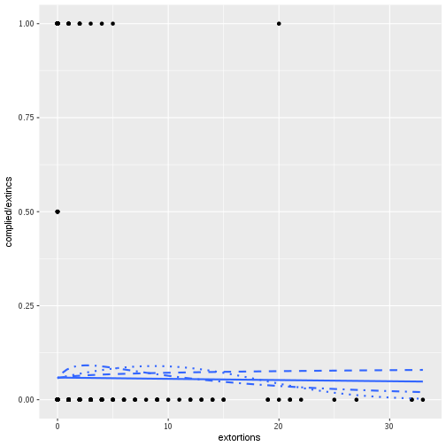

```r
p_comp_inc_repexts <- ggplot(enve_bus, aes(x = rep_extortions, y = complied/extincs))

p_comp_inc_repexts + geom_point() +
  stat_smooth(method="glm", method.args=list(family="binomial"), se=FALSE, aes(weight = extincs))
```

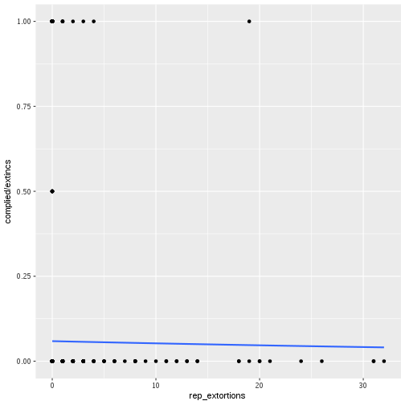

```r
p_comp_inc_bribes <- ggplot(enve_bus, aes(x = bribes, y = complied/extincs))

p_comp_inc_bribes + geom_point() +
  stat_smooth(method="glm", method.args=list(family="binomial"), se=FALSE, aes(weight = extincs))  +
  stat_smooth(method="glm", method.args=list(family="binomial"), se=FALSE, aes(weight = extincs),
              formula = y ~ poly(x, degree = 2, raw = TRUE), linetype = 3)  +
  stat_smooth(method="glm", method.args=list(family="binomial"), se=FALSE, aes(weight = extincs),
              formula = y ~ log1p(x), linetype = 2)
```

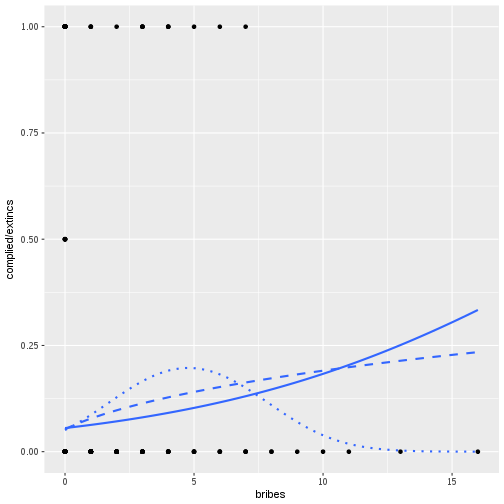

```r
p_comp_inc_bribe_vic <- ggplot(enve_bus, aes(x = bribe_victim, y = complied/extincs))

p_comp_inc_bribe_vic + geom_point() +
  stat_smooth(method="glm", method.args=list(family="binomial"), se=FALSE, aes(weight = extincs))
```


```r
p_comp_inc_years <- ggplot(enve_bus, aes(x = years, y = complied/extincs))

p_comp_inc_years + geom_point() +
  stat_smooth(method="glm", method.args=list(family="binomial"), se=FALSE, aes(weight = extincs)) +
  stat_smooth(method="glm", method.args=list(family="binomial"), se=FALSE, aes(weight = extincs),
              formula = y ~ poly(x, degree = 2, raw = TRUE), linetype = 3)
```

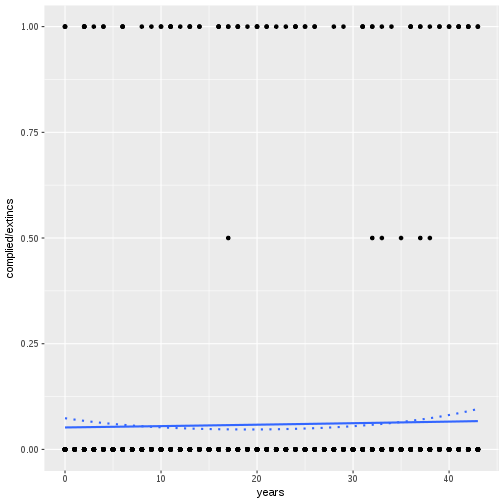

```r
enve_bus %>%
    select(extortions,
           rep_extortions,
           bribes,
           years,
           comp_inperson,
           comp_remote,
           inperson,
           remote) -> enve_temp

reshape2::melt(enve_temp, id.vars = c("extortions",
                                      "rep_extortions",
                                      "bribes",
                                      "years",
                                      "inperson",
                                      "remote")) -> enve_temp


names(enve_temp)[7:8] <- c("group", "compliance")


reshape2::melt(enve_temp, id.vars = c("extortions",
                                      "rep_extortions",
                                      "bribes",
                                      "years",
                                      "compliance",
                                      "group") ) -> enve_temp

names(enve_temp)[8] <- "weight"

summary(enve_temp)
```

```
   extortions      rep_extortions        bribes            years      
 Min.   : 0.0000   Min.   : 0.0000   Min.   : 0.0000   Min.   : 0.00  
 1st Qu.: 0.0000   1st Qu.: 0.0000   1st Qu.: 0.0000   1st Qu.: 9.00  
 Median : 0.0000   Median : 0.0000   Median : 0.0000   Median :20.00  
 Mean   : 0.5782   Mean   : 0.4617   Mean   : 0.2855   Mean   :20.57  
 3rd Qu.: 0.0000   3rd Qu.: 0.0000   3rd Qu.: 0.0000   3rd Qu.:31.00  
 Max.   :33.0000   Max.   :32.0000   Max.   :16.0000   Max.   :43.00  
   compliance                group          variable        weight      
 Min.   :0.00000   comp_inperson:2508   inperson:2508   Min.   :0.0000  
 1st Qu.:0.00000   comp_remote  :2508   remote  :2508   1st Qu.:0.0000  
 Median :0.00000                                        Median :1.0000  
 Mean   :0.03668                                        Mean   :0.6248  
 3rd Qu.:0.00000                                        3rd Qu.:1.0000  
 Max.   :5.00000                                        Max.   :5.0000  
```

```r
levels(enve_temp$group) <- levels(enve_temp$variable)

enve_temp %>%
    filter(variable == group) -> enve_temp

p_ext_comp_by_type <- ggplot(enve_temp, aes(x = extortions, y = compliance/weight, color = variable))

p_ext_comp_by_type + geom_jitter(alpha = 0.3, width = 0.3, height = 0.01) +
    stat_smooth(method="glm", method.args=list(family="binomial"),
                se=FALSE, aes(weight = weight)) +
    stat_smooth(method="glm", method.args=list(family="binomial"),
                se=FALSE, aes(weight = weight),
                formula = y ~ poly(x, degree = 2, raw = TRUE), linetype = 3) +
    stat_smooth(method="glm", method.args=list(family="binomial"),
                se=FALSE, aes(weight = weight),
                formula = y ~ mylog(x), linetype = 2)  +
    stat_smooth(method="glm", method.args=list(family="binomial"),
                se=FALSE, aes(weight = weight),
                formula = y ~ poly(mylog(x), degree=2, raw = TRUE), linetype = 4)
```

```
Warning: Removed 1251 rows containing non-finite values (stat_smooth).

Warning: Removed 1251 rows containing non-finite values (stat_smooth).

Warning: Removed 1251 rows containing non-finite values (stat_smooth).

Warning: Removed 1251 rows containing non-finite values (stat_smooth).
```

```
Warning: Removed 1251 rows containing missing values (geom_point).
```

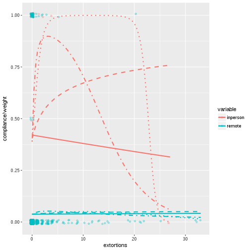

```r
p_repext_comp_by_type <- ggplot(enve_temp, aes(x = rep_extortions, y = compliance/weight, color = variable))

p_repext_comp_by_type + geom_jitter(alpha = 0.3, width = 0.3, height = 0.01) +
    stat_smooth(method="glm", method.args=list(family="binomial"),
                se=FALSE, aes(weight = weight))
```

```
Warning: Removed 1251 rows containing non-finite values (stat_smooth).

Warning: Removed 1251 rows containing missing values (geom_point).
```

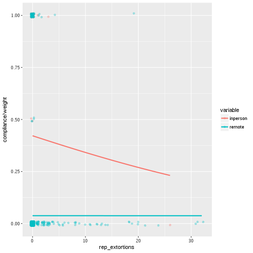

```r
p_bribes_comp_by_type <- ggplot(enve_temp, aes(x = bribes, y = compliance/weight, color = variable))

p_bribes_comp_by_type + geom_jitter(alpha = 0.3, width = 0.3, height = 0.01) +
    stat_smooth(method="glm", method.args=list(family="binomial"),
                se=FALSE, aes(weight = weight)) +
    stat_smooth(method="glm", method.args=list(family="binomial"),
                se=FALSE, aes(weight = weight),
                formula = y ~ poly(x, degree = 2, raw = TRUE), linetype = 3) +
    stat_smooth(method="glm", method.args=list(family="binomial"),
                se=FALSE, aes(weight = weight),
                formula = y ~ log1p(x), linetype = 2)
```

```
Warning: Removed 1251 rows containing non-finite values (stat_smooth).
```

```
Warning: Removed 1251 rows containing non-finite values (stat_smooth).

Warning: Removed 1251 rows containing non-finite values (stat_smooth).
```

```
Warning: Removed 1251 rows containing missing values (geom_point).
```

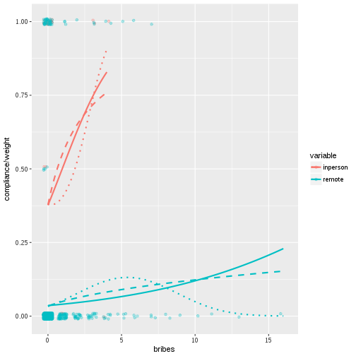

```r
p_years_comp_by_type <- ggplot(enve_temp, aes(x = years, y = compliance/weight, color = variable))

p_years_comp_by_type + geom_jitter(alpha = 0.3, width = 0.3, height = 0.01) +
    stat_smooth(method="glm", method.args=list(family="binomial"),
                se=FALSE, aes(weight = weight)) +
    stat_smooth(method="glm", method.args=list(family="binomial"),
                se=FALSE, aes(weight = weight),
                formula = y ~ poly(x, degree = 2, raw = TRUE), linetype = 3)
```

```
Warning: Removed 1251 rows containing non-finite values (stat_smooth).
```

```
Warning: Removed 1251 rows containing non-finite values (stat_smooth).
```

```
Warning: Removed 1251 rows containing missing values (geom_point).
```

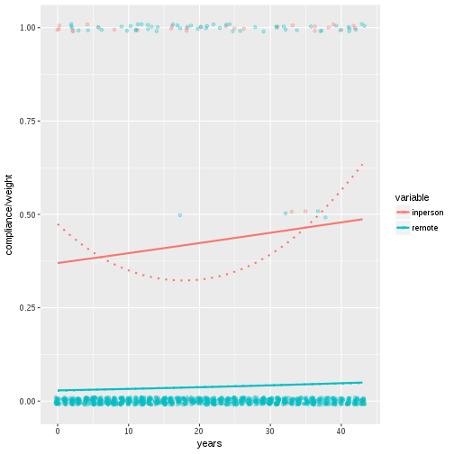


Still need to test relationships between props and numericals, GLM?


```r
predvars <- c(~ extortions,
              ~ mylog(extortions),
              ~ poly(extortions, degree = 2, raw = FALSE),
              ~ poly(mylog(extortions), degree = 2, raw = FALSE),
              ~ rep_extortion_victim,
              ~ rep_extortions,
              ~ bribes,
              ~ log1p(bribes),
              ~ poly(bribes, degree = 2, raw = FALSE),
              ~ poly(log1p(bribes), degree = 2, raw = FALSE),
              ~ bribe_victim,
              ~ bribe_cats,
              ~ size,
              ~ subsector,
              ~ years,
              ~ log1p(years),
              ~ poly(years, degree = 2, raw = FALSE),
              ~ poly(log1p(years), degree = 2, raw = FALSE),
              ~ yearsquant)

lapply(predvars, function(z) tryCatch(multi_glm(data = enve_bus,
                                       response = ~ cbind(complied, extincs),
                                       predictor = z),
                                      error = function(e) NULL)) -> biv_bus_glms


null_bus1 <- null_glm_ll(dv = ~ cbind(complied, extincs), data = enve_bus)

summary(glm(cbind(complied, extincs) ~ 1, data = enve_bus, family = "binomial"))
```

```

Call:
glm(formula = cbind(complied, extincs) ~ 1, family = "binomial", 
    data = enve_bus)

Deviance Residuals: 
    Min       1Q   Median       3Q      Max  
-0.7553  -0.3378  -0.3378  -0.3378   3.9534  

Coefficients:
            Estimate Std. Error z value Pr(>|z|)    
(Intercept)  -2.8351     0.1073  -26.43   <2e-16 ***
---
Signif. codes:  0 '***' 0.001 '**' 0.01 '*' 0.05 '.' 0.1 ' ' 1

(Dispersion parameter for binomial family taken to be 1)

    Null deviance: 449.61  on 1253  degrees of freedom
Residual deviance: 449.61  on 1253  degrees of freedom
AIC: 572.98

Number of Fisher Scoring iterations: 5
```

```r
summary(glm(cbind(complied, extincs) ~ extortions, data = enve_bus, family = "binomial"))
```

```

Call:
glm(formula = cbind(complied, extincs) ~ extortions, family = "binomial", 
    data = enve_bus)

Deviance Residuals: 
    Min       1Q   Median       3Q      Max  
-0.7566  -0.3384  -0.3384  -0.3384   3.9495  

Coefficients:
             Estimate Std. Error z value Pr(>|z|)    
(Intercept) -2.831651   0.109411 -25.881   <2e-16 ***
extortions  -0.006135   0.039438  -0.156    0.876    
---
Signif. codes:  0 '***' 0.001 '**' 0.01 '*' 0.05 '.' 0.1 ' ' 1

(Dispersion parameter for binomial family taken to be 1)

    Null deviance: 449.61  on 1253  degrees of freedom
Residual deviance: 449.58  on 1252  degrees of freedom
AIC: 574.95

Number of Fisher Scoring iterations: 5
```

```r
summary(enve_bus)
```

```
   CVE_UNICA        extincs        complied           remote     
 Min.   :   60   Min.   :1.00   Min.   :0.00000   Min.   :0.000  
 1st Qu.: 7406   1st Qu.:1.00   1st Qu.:0.00000   1st Qu.:1.000  
 Median :11926   Median :1.00   Median :0.00000   Median :1.000  
 Mean   :12152   Mean   :1.25   Mean   :0.07336   Mean   :1.181  
 3rd Qu.:17770   3rd Qu.:1.00   3rd Qu.:0.00000   3rd Qu.:1.000  
 Max.   :23355   Max.   :5.00   Max.   :5.00000   Max.   :5.000  
                                                                 
     street           premises            piso             inperson      
 Min.   :0.00000   Min.   :0.00000   Min.   :0.000000   Min.   :0.00000  
 1st Qu.:0.00000   1st Qu.:0.00000   1st Qu.:0.000000   1st Qu.:0.00000  
 Median :0.00000   Median :0.00000   Median :0.000000   Median :0.00000  
 Mean   :0.05024   Mean   :0.01276   Mean   :0.005582   Mean   :0.06858  
 3rd Qu.:0.00000   3rd Qu.:0.00000   3rd Qu.:0.000000   3rd Qu.:0.00000  
 Max.   :5.00000   Max.   :5.00000   Max.   :3.000000   Max.   :5.00000  
                                                                         
  comp_remote      comp_inperson      comp_street      comp_premises    
 Min.   :0.00000   Min.   :0.00000   Min.   :0.00000   Min.   :0.00000  
 1st Qu.:0.00000   1st Qu.:0.00000   1st Qu.:0.00000   1st Qu.:0.00000  
 Median :0.00000   Median :0.00000   Median :0.00000   Median :0.00000  
 Mean   :0.04466   Mean   :0.02871   Mean   :0.01515   Mean   :0.01037  
 3rd Qu.:0.00000   3rd Qu.:0.00000   3rd Qu.:0.00000   3rd Qu.:0.00000  
 Max.   :1.00000   Max.   :5.00000   Max.   :2.00000   Max.   :5.00000  
                                                                        
   comp_piso          CVE_ENT       extortions      extortion_victim
 Min.   :0.00000   Min.   : 1.0   Min.   : 0.0000   1: 146          
 1st Qu.:0.00000   1st Qu.: 9.0   1st Qu.: 0.0000   2:1084          
 Median :0.00000   Median :16.0   Median : 0.0000   9:  24          
 Mean   :0.00319   Mean   :16.4   Mean   : 0.5782                   
 3rd Qu.:0.00000   3rd Qu.:24.0   3rd Qu.: 0.0000                   
 Max.   :3.00000   Max.   :32.0   Max.   :33.0000                   
                                                                    
 rep_extortion_victim rep_extortions        bribes        bribe1  
 0:1168               Min.   : 0.0000   Min.   : 0.0000   1: 133  
 1:  86               1st Qu.: 0.0000   1st Qu.: 0.0000   2:1093  
                      Median : 0.0000   Median : 0.0000   9:  28  
                      Mean   : 0.4617   Mean   : 0.2855           
                      3rd Qu.: 0.0000   3rd Qu.: 0.0000           
                      Max.   :32.0000   Max.   :16.0000           
                                                                  
 bribe2   bribe3   bribe4   bribe_victim rep_bribe bribe_cats     size    
 1: 133   1: 133   1: 133   0:1121       0:1181    0 :1121    Large :310  
 2:1093   2:1093   2:1093   1: 133       1:  73    1 :  60    Medium:303  
 9:  28   9:  28   9:  28                          2 :  23    Small :280  
                                                   3+:  50    Micro :361  
                                                                          
                                                                          
                                                                          
 sector     tempsub               subsector         subsector_safe
 C:401   Min.   :212410   Retail       : 32   Manufacturing:260   
 I:410   1st Qu.:363710   HotelsRestBar:187   Health       :212   
 S:443   Median :518410   Industry     :198   HotelsRestBar:187   
         Mean   :514563   Manufacturing:260   Construction :160   
         3rd Qu.:668535   Other serv.  :460   Maintenance  :104   
         Max.   :812910   Transport    : 64   Transport    : 64   
                          Wholesale    : 53   (Other)      :267   
     years         yearsquant        X              N         
 Min.   : 0.00   [0,8]  :283   Min.   : 1.0   Min.   : 534.0  
 1st Qu.: 9.25   (8,16] :245   1st Qu.: 9.0   1st Qu.: 745.0  
 Median :20.00   (16,25]:251   Median :16.0   Median : 854.0  
 Mean   :20.57   (25,34]:253   Mean   :16.4   Mean   : 878.9  
 3rd Qu.:31.00   (34,43]:222   3rd Qu.:24.0   3rd Qu.: 967.0  
 Max.   :43.00                 Max.   :32.0   Max.   :1657.0  
                                                              
 denuncias_homs     poblacion           tasahom       bribes_preval  
 Min.   :  39.0   Min.   :  698295   Min.   : 1.938   Min.   :16.93  
 1st Qu.: 151.0   1st Qu.: 1728429   1st Qu.: 7.797   1st Qu.:32.06  
 Median : 536.0   Median : 2890108   Median :11.806   Median :42.25  
 Mean   : 586.8   Mean   : 3871240   Mean   :15.964   Mean   :46.25  
 3rd Qu.: 775.0   3rd Qu.: 4941059   3rd Qu.:20.165   3rd Qu.:59.69  
 Max.   :2087.0   Max.   :16364210   Max.   :59.225   Max.   :94.14  
                                                                     
  bribes_inci      bribes_conc     bribes_abvic    bribes_abincs   
 Min.   : 31.42   Min.   :1.318   Min.   : 14.00   Min.   : 26.00  
 1st Qu.: 72.48   1st Qu.:1.693   1st Qu.: 27.00   1st Qu.: 48.00  
 Median : 88.77   Median :1.882   Median : 34.00   Median : 74.00  
 Mean   :109.33   Mean   :2.311   Mean   : 40.04   Mean   : 93.57  
 3rd Qu.:125.46   3rd Qu.:2.429   3rd Qu.: 57.00   3rd Qu.:108.00  
 Max.   :420.16   Max.   :5.797   Max.   :101.00   Max.   :371.00  
                                                                   
   Incidence        Prevalence     Concentration       defun       
 Min.   : 45.67   Min.   : 23.85   Min.   :1.163   Min.   :  46.0  
 1st Qu.: 83.42   1st Qu.: 56.50   1st Qu.:1.340   1st Qu.: 214.0  
 Median :116.80   Median : 67.17   Median :1.589   Median : 638.0  
 Mean   :132.11   Mean   : 80.54   Mean   :1.653   Mean   : 728.3  
 3rd Qu.:172.60   3rd Qu.: 99.25   3rd Qu.:1.820   3rd Qu.: 832.0  
 Max.   :290.12   Max.   :190.69   Max.   :2.709   Max.   :3265.0  
                                                                   
   defun_arma      ind_general     ind_derecho       Derecho     
 Min.   :   8.0   Min.   :25.26   Min.   :21.37   Min.   :21.37  
 1st Qu.: 111.0   1st Qu.:42.55   1st Qu.:49.83   1st Qu.:49.83  
 Median : 380.0   Median :49.02   Median :55.50   Median :55.50  
 Mean   : 453.9   Mean   :47.87   Mean   :54.34   Mean   :54.34  
 3rd Qu.: 526.0   3rd Qu.:52.67   3rd Qu.:62.15   3rd Qu.:62.15  
 Max.   :2049.0   Max.   :67.85   Max.   :78.40   Max.   :78.40  
                                                                 
    General                  ENTIDAD         AÑO           drogas      
 Min.   :25.26   GUANAJUATO      : 49   Min.   :2013   Min.   :  37.0  
 1st Qu.:42.55   HIDALGO         : 49   1st Qu.:2013   1st Qu.: 108.0  
 Median :49.02   JALISCO         : 49   Median :2013   Median : 187.0  
 Mean   :47.87   PUEBLA          : 48   Mean   :2013   Mean   : 559.7  
 3rd Qu.:52.67   CIUDAD DE MEXICO: 46   3rd Qu.:2013   3rd Qu.: 591.0  
 Max.   :67.85   QUERETARO       : 46   Max.   :2013   Max.   :3738.0  
                 (Other)         :967                                  
       do             armas        ab_ext_preval      ab_ext_inc   
 Min.   :  0.00   Min.   :  31.0   Min.   : 19.00   Min.   : 29.0  
 1st Qu.: 15.00   1st Qu.: 240.0   1st Qu.: 45.00   1st Qu.: 64.0  
 Median : 28.00   Median : 455.0   Median : 59.00   Median :103.0  
 Mean   : 40.13   Mean   : 587.1   Mean   : 70.47   Mean   :116.4  
 3rd Qu.: 53.00   3rd Qu.: 874.0   3rd Qu.: 83.00   3rd Qu.:144.0  
 Max.   :174.00   Max.   :1632.0   Max.   :180.00   Max.   :286.0  
                                                                   
             NOM_ENT       NOM_ABR   
 GUANAJUATO      : 49   GTO.   : 49  
 HIDALGO         : 49   HGO.   : 49  
 JALISCO         : 49   JAL.   : 49  
 PUEBLA          : 48   PUE.   : 48  
 DISTRITO FEDERAL: 46   DF     : 46  
 QUERETARO       : 46   QRO.   : 46  
 (Other)         :967   (Other):967  
```

```r
biv_bus_glms_all <- do.call(rbind, biv_bus_glms)

biv_bus_glms_all <- rbind(null_bus1, biv_bus_glms_all)

kable(biv_bus_glms_all, digits = 2,
      caption = "Response: cbind(complied, extincs)")
```


|                                                  |  slope| pval|s1  |      ll| LRTpval|s2  |
|:-------------------------------------------------|------:|----:|:---|-------:|-------:|:---|
|Null                                              |    ---|  ---|--- | -285.49|     ---|--- |
|extortions                                        |  -0.01| 0.88|    | -285.48|    0.87|    |
|mylog(extortions)                                 |   0.09| 0.63|    | -285.38|    0.64|    |
|poly(extortions, degree = 2, raw = FALSE)1        |  -2.75| 0.66|    | -284.95|    0.58|    |
|poly(extortions, degree = 2, raw = FALSE)2        |  -5.33| 0.38|    |     ---|     ---|--- |
|poly(mylog(extortions), degree = 2, raw = FALSE)1 |   1.21| 0.77|    | -284.56|    0.39|    |
|poly(mylog(extortions), degree = 2, raw = FALSE)2 |  -4.85| 0.23|    |     ---|     ---|--- |
|rep_extortion_victim1                             |   0.41| 0.26|    | -284.91|    0.28|    |
|rep_extortions                                    |  -0.01| 0.79|    | -285.45|    0.78|    |
|bribes                                            |   0.13| 0.02|*   | -283.45|    0.04|*   |
|log1p(bribes)                                     |   0.55| 0.00|**  | -281.86|    0.01|**  |
|poly(bribes, degree = 2, raw = FALSE)1            |   3.00| 0.52|    | -279.42|    0.00|**  |
|poly(bribes, degree = 2, raw = FALSE)2            | -11.46| 0.04|*   |     ---|     ---|--- |
|poly(log1p(bribes), degree = 2, raw = FALSE)1     |   8.06| 0.00|**  | -281.64|    0.02|*   |
|poly(log1p(bribes), degree = 2, raw = FALSE)2     |  -1.68| 0.52|    |     ---|     ---|--- |
|bribe_victim1                                     |   0.62| 0.02|*   | -283.23|    0.03|*   |
|bribe_cats1                                       |  -0.40| 0.50|    | -277.67|    0.00|**  |
|bribe_cats2                                       |  -0.47| 0.64|    |     ---|     ---|--- |
|bribe_cats3+                                      |   1.35| 0.00|*** |     ---|     ---|--- |
|sizeMedium                                        |   0.02| 0.95|    | -279.99|    0.01|*   |
|sizeSmall                                         |   0.63| 0.03|*   |     ---|     ---|--- |
|sizeMicro                                         |  -0.30| 0.37|    |     ---|     ---|--- |
|subsectorHotelsRestBar                            |  -0.26| 0.75|    | -283.44|    0.66|    |
|subsectorIndustry                                 |   0.19| 0.80|    |     ---|     ---|--- |
|subsectorManufacturing                            |   0.39| 0.61|    |     ---|     ---|--- |
|subsectorOther serv.                              |   0.43| 0.56|    |     ---|     ---|--- |
|subsectorTransport                                |   0.12| 0.89|    |     ---|     ---|--- |
|subsectorWholesale                                |   0.37| 0.67|    |     ---|     ---|--- |
|years                                             |   0.01| 0.49|    | -285.25|    0.49|    |
|log1p(years)                                      |   0.01| 0.94|    | -285.49|    0.94|    |
|poly(years, degree = 2, raw = FALSE)1             |   2.36| 0.50|    | -283.81|    0.19|    |
|poly(years, degree = 2, raw = FALSE)2             |   6.24| 0.09|    |     ---|     ---|--- |
|poly(log1p(years), degree = 2, raw = FALSE)1      |   0.53| 0.88|    | -284.84|    0.52|    |
|poly(log1p(years), degree = 2, raw = FALSE)2      |   4.11| 0.25|    |     ---|     ---|--- |
|yearsquant(8,16]                                  |  -0.11| 0.75|    | -283.20|    0.33|    |
|yearsquant(16,25]                                 |   0.05| 0.87|    |     ---|     ---|--- |
|yearsquant(25,34]                                 |  -0.33| 0.35|    |     ---|     ---|--- |
|yearsquant(34,43]                                 |   0.38| 0.22|    |     ---|     ---|--- |

```r
lapply(predvars, function(z) tryCatch(multi_glm(data = enve_bus,
                                       response = ~ cbind(comp_remote, remote),
                                       predictor = z),
                                      error = function(e) NULL)) -> biv_bus_glms_remote

null_bus2 <- null_glm_ll(dv = ~ cbind(comp_remote, remote), data = enve_bus)

biv_bus_glms_remote_all <- do.call(rbind, biv_bus_glms_remote)

biv_bus_glms_remote_all <- rbind(null_bus2, biv_bus_glms_remote_all)

kable(biv_bus_glms_remote_all, digits = 2,
      caption = "Response: cbind(comp_remote, remote)")
```


|                                                  | slope| pval|s1  |      ll| LRTpval|s2  |
|:-------------------------------------------------|-----:|----:|:---|-------:|-------:|:---|
|Null                                              |   ---|  ---|--- | -200.01|     ---|--- |
|extortions                                        |  0.00| 0.94|    | -200.01|    0.94|    |
|mylog(extortions)                                 |  0.09| 0.71|    | -199.95|    0.72|    |
|poly(extortions, degree = 2, raw = FALSE)1        | -0.04| 0.99|    | -199.91|    0.91|    |
|poly(extortions, degree = 2, raw = FALSE)2        | -2.30| 0.68|    |     ---|     ---|--- |
|poly(mylog(extortions), degree = 2, raw = FALSE)1 |  1.59| 0.74|    | -199.73|    0.75|    |
|poly(mylog(extortions), degree = 2, raw = FALSE)2 | -3.05| 0.52|    |     ---|     ---|--- |
|rep_extortion_victim1                             |  0.30| 0.53|    | -199.83|    0.54|    |
|rep_extortions                                    |  0.00| 1.00|    | -200.01|    1.00|    |
|bribes                                            |  0.13| 0.06|    | -198.66|    0.10|    |
|log1p(bribes)                                     |  0.54| 0.02|*   | -197.79|    0.03|*   |
|poly(bribes, degree = 2, raw = FALSE)1            |  4.83| 0.28|    | -196.54|    0.03|*   |
|poly(bribes, degree = 2, raw = FALSE)2            | -9.15| 0.12|    |     ---|     ---|--- |
|poly(log1p(bribes), degree = 2, raw = FALSE)1     |  7.96| 0.02|*   | -197.72|    0.10|    |
|poly(log1p(bribes), degree = 2, raw = FALSE)2     | -1.20| 0.71|    |     ---|     ---|--- |
|bribe_victim1                                     |  0.63| 0.07|    | -198.53|    0.08|    |
|bribe_cats1                                       |  0.09| 0.88|    | -196.82|    0.09|    |
|bribe_cats2                                       | -0.03| 0.98|    |     ---|     ---|--- |
|bribe_cats3+                                      |  1.22| 0.00|**  |     ---|     ---|--- |
|sizeMedium                                        |  0.45| 0.28|    | -197.37|    0.15|    |
|sizeSmall                                         |  0.75| 0.06|    |     ---|     ---|--- |
|sizeMicro                                         |  0.04| 0.93|    |     ---|     ---|--- |
|subsectorHotelsRestBar                            | -0.52| 0.54|    | -196.84|    0.39|    |
|subsectorIndustry                                 | -0.95| 0.28|    |     ---|     ---|--- |
|subsectorManufacturing                            | -0.27| 0.73|    |     ---|     ---|--- |
|subsectorOther serv.                              |  0.07| 0.93|    |     ---|     ---|--- |
|subsectorTransport                                | -0.14| 0.88|    |     ---|     ---|--- |
|subsectorWholesale                                |  0.40| 0.65|    |     ---|     ---|--- |
|years                                             |  0.01| 0.24|    | -199.32|    0.24|    |
|log1p(years)                                      |  0.24| 0.17|    | -199.00|    0.15|    |
|poly(years, degree = 2, raw = FALSE)1             |  5.79| 0.24|    | -199.31|    0.50|    |
|poly(years, degree = 2, raw = FALSE)2             | -0.61| 0.90|    |     ---|     ---|--- |
|poly(log1p(years), degree = 2, raw = FALSE)1      |  8.90| 0.17|    | -198.79|    0.29|    |
|poly(log1p(years), degree = 2, raw = FALSE)2      | -3.98| 0.53|    |     ---|     ---|--- |
|yearsquant(8,16]                                  |  0.71| 0.14|    | -197.48|    0.28|    |
|yearsquant(16,25]                                 |  0.79| 0.09|    |     ---|     ---|--- |
|yearsquant(25,34]                                 |  0.34| 0.51|    |     ---|     ---|--- |
|yearsquant(34,43]                                 |  0.87| 0.07|    |     ---|     ---|--- |

```r
lapply(predvars, function(z) tryCatch(multi_glm(data = enve_bus,
                                       response = ~ cbind(comp_inperson, inperson),
                                       predictor = z),
                                      error = function(e) NULL)) -> biv_bus_glms_inperson
```

```
Warning: glm.fit: fitted probabilities numerically 0 or 1 occurred
```

```r
null_bus3 <- null_glm_ll(dv = ~ cbind(comp_inperson, inperson), data = enve_bus)

biv_bus_glms_inperson_all <- do.call(rbind, biv_bus_glms_inperson)

biv_bus_glms_inperson_all <- rbind(null_bus3, biv_bus_glms_inperson_all)

kable(biv_bus_glms_inperson_all, digits = 2,
      caption = "Response: cbind(comp_inperson, inperson)")
```


|                                                  |  slope| pval|s1  |     ll| LRTpval|s2  |
|:-------------------------------------------------|------:|----:|:---|------:|-------:|:---|
|Null                                              |    ---|  ---|--- | -44.45|     ---|--- |
|extortions                                        |  -0.01| 0.87|    | -44.44|    0.87|    |
|mylog(extortions)                                 |   0.24| 0.53|    | -44.27|    0.54|    |
|poly(extortions, degree = 2, raw = FALSE)1        | -96.22| 0.85|    | -43.33|    0.33|    |
|poly(extortions, degree = 2, raw = FALSE)2        | -59.95| 0.81|    |    ---|     ---|--- |
|poly(mylog(extortions), degree = 2, raw = FALSE)1 |  -0.05| 1.00|    | -43.47|    0.37|    |
|poly(mylog(extortions), degree = 2, raw = FALSE)2 | -11.10| 0.38|    |    ---|     ---|--- |
|rep_extortion_victim1                             |   0.71| 0.32|    | -43.97|    0.32|    |
|rep_extortions                                    |  -0.03| 0.77|    | -44.41|    0.76|    |
|bribes                                            |   0.21| 0.22|    | -43.73|    0.23|    |
|log1p(bribes)                                     |   0.44| 0.25|    | -43.83|    0.26|    |
|poly(bribes, degree = 2, raw = FALSE)1            |  23.70| 0.69|    | -43.69|    0.47|    |
|poly(bribes, degree = 2, raw = FALSE)2            |  13.76| 0.80|    |    ---|     ---|--- |
|poly(log1p(bribes), degree = 2, raw = FALSE)1     |  13.01| 0.14|    | -43.28|    0.31|    |
|poly(log1p(bribes), degree = 2, raw = FALSE)2     |  18.15| 0.33|    |    ---|     ---|--- |
|bribe_victim1                                     |   0.40| 0.45|    | -44.17|    0.45|    |
|sizeMedium                                        |  -1.04| 0.10|    | -42.39|    0.25|    |
|sizeSmall                                         |  -0.06| 0.90|    |    ---|     ---|--- |
|sizeMicro                                         |  -0.63| 0.33|    |    ---|     ---|--- |
|subsectorHotelsRestBar                            |  15.77| 1.00|    | -41.05|    0.34|    |
|subsectorIndustry                                 |  17.12| 1.00|    |    ---|     ---|--- |
|subsectorManufacturing                            |  17.07| 1.00|    |    ---|     ---|--- |
|subsectorOther serv.                              |  16.60| 1.00|    |    ---|     ---|--- |
|subsectorTransport                                |  16.18| 1.00|    |    ---|     ---|--- |
|subsectorWholesale                                |  -0.59| 1.00|    |    ---|     ---|--- |
|years                                             |   0.01| 0.65|    | -44.35|    0.65|    |
|log1p(years)                                      |  -0.01| 0.97|    | -44.45|    0.97|    |
|poly(years, degree = 2, raw = FALSE)1             |   3.34| 0.58|    | -43.97|    0.61|    |
|poly(years, degree = 2, raw = FALSE)2             |   5.89| 0.38|    |    ---|     ---|--- |
|poly(log1p(years), degree = 2, raw = FALSE)1      |   1.22| 0.83|    | -43.76|    0.50|    |
|poly(log1p(years), degree = 2, raw = FALSE)2      |   6.82| 0.24|    |    ---|     ---|--- |
|yearsquant(8,16]                                  |  -0.06| 0.93|    | -43.75|    0.84|    |
|yearsquant(16,25]                                 |  -0.11| 0.85|    |    ---|     ---|--- |
|yearsquant(25,34]                                 |  -0.26| 0.69|    |    ---|     ---|--- |
|yearsquant(34,43]                                 |   0.45| 0.38|    |    ---|     ---|--- |


Check proportions per size, subsector and yearsquant


```r
ob <- propfun("complied", "extincs", "size", enve_bus)

ob
```

```

	4-sample test for equality of proportions without continuity
	correction

data:  complied out of extincs
X-squared = 13.539, df = 3, p-value = 0.003605
alternative hypothesis: two.sided
sample estimates:
     Large     Medium      Small      Micro 
0.05181347 0.05291005 0.09722222 0.03837472 
```

```r
ivs <- c("size", "subsector", "yearsquant")

compext_proptests <- lapply(ivs, function(x) propfun(dv = "complied",
                                                     w = "extincs",
                                                     iv = x,
                                                     dat = enve_bus))
```

```
Warning in prop.test(dat2[, 2], dat2[, 3]): Chi-squared approximation may
be incorrect
```

```r
compext_proptests
```

```
[[1]]

	4-sample test for equality of proportions without continuity
	correction

data:  complied out of extincs
X-squared = 13.539, df = 3, p-value = 0.003605
alternative hypothesis: two.sided
sample estimates:
     Large     Medium      Small      Micro 
0.05181347 0.05291005 0.09722222 0.03837472 


[[2]]

	7-sample test for equality of proportions without continuity
	correction

data:  complied out of extincs
X-squared = 4.1685, df = 6, p-value = 0.6539
alternative hypothesis: two.sided
sample estimates:
       Retail HotelsRestBar      Industry Manufacturing   Other serv. 
   0.04444444    0.03433476    0.05394191    0.06547619    0.06842105 
    Transport     Wholesale 
   0.05000000    0.06451613 


[[3]]

	5-sample test for equality of proportions without continuity
	correction

data:  complied out of extincs
X-squared = 5.3499, df = 4, p-value = 0.2532
alternative hypothesis: two.sided
sample estimates:
     [0,8]     (8,16]    (16,25]    (25,34]    (34,43] 
0.05785124 0.05194805 0.06109325 0.04140127 0.08487085 
```

```r
comp_rem <- lapply(ivs, function(x) propfun(dv = "comp_remote",
                                                     w = "remote",
                                                     iv = x,
                                                     dat = enve_bus))
```

```
Warning in prop.test(dat2[, 2], dat2[, 3]): Chi-squared approximation may
be incorrect
```

```r
comp_rem
```

```
[[1]]

	4-sample test for equality of proportions without continuity
	correction

data:  comp_remote out of remote
X-squared = 5.9638, df = 3, p-value = 0.1134
alternative hypothesis: two.sided
sample estimates:
     Large     Medium      Small      Micro 
0.02710027 0.04237288 0.05740181 0.02810304 


[[2]]

	7-sample test for equality of proportions without continuity
	correction

data:  comp_remote out of remote
X-squared = 6.5445, df = 6, p-value = 0.365
alternative hypothesis: two.sided
sample estimates:
       Retail HotelsRestBar      Industry Manufacturing   Other serv. 
   0.04545455    0.02714932    0.01762115    0.03459119    0.04850746 
    Transport     Wholesale 
   0.03947368    0.06779661 


[[3]]

	5-sample test for equality of proportions without continuity
	correction

data:  comp_remote out of remote
X-squared = 5.1403, df = 4, p-value = 0.2732
alternative hypothesis: two.sided
sample estimates:
     [0,8]     (8,16]    (16,25]    (25,34]    (34,43] 
0.02134146 0.04333333 0.04713805 0.02990033 0.05098039 
```

```r
comp_inperson <- lapply(ivs, function(x) propfun(dv = "comp_inperson",
                                                     w = "inperson",
                                                     iv = x,
                                                     dat = enve_bus))
```

```
Warning in prop.test(dat2[, 2], dat2[, 3]): Chi-squared approximation may
be incorrect

Warning in prop.test(dat2[, 2], dat2[, 3]): Chi-squared approximation may
be incorrect
```

```r
comp_inperson
```

```
[[1]]

	4-sample test for equality of proportions without continuity
	correction

data:  comp_inperson out of inperson
X-squared = 9.2217, df = 3, p-value = 0.02648
alternative hypothesis: two.sided
sample estimates:
    Large    Medium     Small     Micro 
0.5882353 0.2083333 0.5517241 0.3125000 


[[2]]

	7-sample test for equality of proportions without continuity
	correction

data:  comp_inperson out of inperson
X-squared = 12.294, df = 6, p-value = 0.05572
alternative hypothesis: two.sided
sample estimates:
       Retail HotelsRestBar      Industry Manufacturing   Other serv. 
    0.0000000     0.1666667     0.6428571     0.6111111     0.3823529 
    Transport     Wholesale 
    0.2500000     0.0000000 


[[3]]

	5-sample test for equality of proportions without continuity
	correction

data:  comp_inperson out of inperson
X-squared = 3.7872, df = 4, p-value = 0.4356
alternative hypothesis: two.sided
sample estimates:
    [0,8]    (8,16]   (16,25]   (25,34]   (34,43] 
0.4000000 0.3750000 0.3571429 0.3076923 0.6250000 
```


## State level variables


```r
enve_incvic %>%
    group_by(CVE_ENT) %>%
    summarise(extincs = n(),
              complied = sum(complied_bin_NA == "Yes"),
              remote = sum(extortion_type == "Remote"),
              street = sum(extortion_type == "Street"),
              premises = sum(extortion_type == "Premises"),
              piso = sum(extortion_type == "Cobro de piso"),
              inperson = sum(extortion_type_bin == "In person"),
              comp_remote  = sum(extortion_type_bin == "Remote" & complied_bin_NA == "Yes"),
              comp_inperson  = sum(extortion_type_bin == "In person" & complied_bin_NA == "Yes"),
              comp_street  = sum(extortion_type == "Street" & complied_bin_NA == "Yes"),
              comp_premises  = sum(extortion_type == "Premises" & complied_bin_NA == "Yes"),
              comp_piso  = sum(extortion_type == "Cobro de piso" & complied_bin_NA == "Yes")) -> enve_state


enve_state <- merge(enve_state, state_level_data, by="CVE_ENT", all.x = TRUE)

summary(enve_state)
```

```
    CVE_ENT         extincs         complied         remote     
 Min.   : 1.00   Min.   :30.00   Min.   :0.000   Min.   :29.00  
 1st Qu.: 8.75   1st Qu.:41.00   1st Qu.:1.750   1st Qu.:38.00  
 Median :16.50   Median :46.00   Median :3.000   Median :44.50  
 Mean   :16.50   Mean   :48.97   Mean   :2.875   Mean   :46.28  
 3rd Qu.:24.25   3rd Qu.:56.25   3rd Qu.:4.000   3rd Qu.:51.75  
 Max.   :32.00   Max.   :74.00   Max.   :7.000   Max.   :70.00  
                                                                
     street         premises         piso           inperson     
 Min.   :0.000   Min.   :0.00   Min.   :0.0000   Min.   : 0.000  
 1st Qu.:1.000   1st Qu.:0.00   1st Qu.:0.0000   1st Qu.: 1.000  
 Median :2.000   Median :0.00   Median :0.0000   Median : 2.000  
 Mean   :1.969   Mean   :0.50   Mean   :0.2188   Mean   : 2.688  
 3rd Qu.:3.000   3rd Qu.:0.25   3rd Qu.:0.0000   3rd Qu.: 4.000  
 Max.   :8.000   Max.   :6.00   Max.   :3.0000   Max.   :11.000  
                                                                 
  comp_remote   comp_inperson    comp_street     comp_premises   
 Min.   :0.00   Min.   :0.000   Min.   :0.0000   Min.   :0.0000  
 1st Qu.:1.00   1st Qu.:0.000   1st Qu.:0.0000   1st Qu.:0.0000  
 Median :2.00   Median :1.000   Median :0.0000   Median :0.0000  
 Mean   :1.75   Mean   :1.125   Mean   :0.5938   Mean   :0.4062  
 3rd Qu.:2.00   3rd Qu.:1.000   3rd Qu.:1.0000   3rd Qu.:0.0000  
 Max.   :5.00   Max.   :5.000   Max.   :3.0000   Max.   :5.0000  
                                                                 
   comp_piso           X               N          denuncias_homs  
 Min.   :0.000   Min.   : 1.00   Min.   : 534.0   Min.   :  39.0  
 1st Qu.:0.000   1st Qu.: 8.75   1st Qu.: 739.0   1st Qu.: 148.2  
 Median :0.000   Median :16.50   Median : 854.0   Median : 519.5  
 Mean   :0.125   Mean   :16.50   Mean   : 880.6   Mean   : 572.8  
 3rd Qu.:0.000   3rd Qu.:24.25   3rd Qu.: 962.5   3rd Qu.: 755.5  
 Max.   :3.000   Max.   :32.00   Max.   :1657.0   Max.   :2087.0  
                                                                  
   poblacion           tasahom       bribes_preval    bribes_inci    
 Min.   :  698295   Min.   : 1.938   Min.   :16.93   Min.   : 31.42  
 1st Qu.: 1683866   1st Qu.: 7.751   1st Qu.:31.92   1st Qu.: 70.61  
 Median : 2870785   Median :12.310   Median :42.23   Median : 89.13  
 Mean   : 3699845   Mean   :16.168   Mean   :46.33   Mean   :111.13  
 3rd Qu.: 4632700   3rd Qu.:20.703   3rd Qu.:57.64   3rd Qu.:122.65  
 Max.   :16364210   Max.   :59.225   Max.   :94.14   Max.   :420.16  
                                                                     
  bribes_conc     bribes_abvic    bribes_abincs      Incidence     
 Min.   :1.318   Min.   : 14.00   Min.   : 26.00   Min.   : 45.67  
 1st Qu.:1.726   1st Qu.: 27.75   1st Qu.: 52.50   1st Qu.: 82.17  
 Median :1.889   Median : 34.00   Median : 78.00   Median :112.38  
 Mean   :2.327   Mean   : 40.12   Mean   : 95.09   Mean   :132.50  
 3rd Qu.:2.319   3rd Qu.: 54.00   3rd Qu.:108.00   3rd Qu.:176.25  
 Max.   :5.797   Max.   :101.00   Max.   :371.00   Max.   :290.12  
                                                                   
   Prevalence     Concentration       defun          defun_arma    
 Min.   : 23.85   Min.   :1.163   Min.   :  46.0   Min.   :   8.0  
 1st Qu.: 55.87   1st Qu.:1.370   1st Qu.: 202.0   1st Qu.: 102.5  
 Median : 66.89   Median :1.606   Median : 595.5   Median : 335.5  
 Mean   : 80.78   Mean   :1.655   Mean   : 704.6   Mean   : 440.3  
 3rd Qu.:101.60   3rd Qu.:1.827   3rd Qu.: 830.5   3rd Qu.: 515.5  
 Max.   :190.69   Max.   :2.709   Max.   :3265.0   Max.   :2049.0  
                                                                   
  ind_general     ind_derecho       Derecho         General     
 Min.   :25.26   Min.   :21.37   Min.   :21.37   Min.   :25.26  
 1st Qu.:42.44   1st Qu.:50.03   1st Qu.:50.03   1st Qu.:42.44  
 Median :48.76   Median :55.51   Median :55.51   Median :48.76  
 Mean   :47.67   Mean   :54.39   Mean   :54.39   Mean   :47.67  
 3rd Qu.:52.21   3rd Qu.:62.36   3rd Qu.:62.36   3rd Qu.:52.21  
 Max.   :67.85   Max.   :78.40   Max.   :78.40   Max.   :67.85  
                                                                
                ENTIDAD        AÑO           drogas             do        
 AGUASCALIENTES     : 1   Min.   :2013   Min.   :  37.0   Min.   :  0.00  
 BAJA CALIFORNIA    : 1   1st Qu.:2013   1st Qu.: 107.2   1st Qu.: 14.75  
 BAJA CALIFORNIA SUR: 1   Median :2013   Median : 186.5   Median : 27.50  
 CAMPECHE           : 1   Mean   :2013   Mean   : 526.9   Mean   : 38.84  
 CHIAPAS            : 1   3rd Qu.:2013   3rd Qu.: 581.2   3rd Qu.: 44.75  
 CHIHUAHUA          : 1   Max.   :2013   Max.   :3738.0   Max.   :174.00  
 (Other)            :26                                                   
     armas        ab_ext_preval      ab_ext_inc    
 Min.   :  31.0   Min.   : 19.00   Min.   : 29.00  
 1st Qu.: 214.5   1st Qu.: 44.00   1st Qu.: 63.75  
 Median : 427.0   Median : 60.50   Median :105.50  
 Mean   : 559.6   Mean   : 70.84   Mean   :116.88  
 3rd Qu.: 826.8   3rd Qu.: 87.25   3rd Qu.:145.25  
 Max.   :1632.0   Max.   :180.00   Max.   :286.00  
                                                   
                NOM_ENT      NOM_ABR  
 AGUASCALIENTES     : 1   AGS.   : 1  
 BAJA CALIFORNIA    : 1   BC     : 1  
 BAJA CALIFORNIA SUR: 1   BCS    : 1  
 CAMPECHE           : 1   CAMP.  : 1  
 CHIAPAS            : 1   CHIH.  : 1  
 CHIHUAHUA          : 1   CHIS.  : 1  
 (Other)            :26   (Other):26  
```


plots of relationships


```r
p_comp_state_preval <- ggplot(enve_state, aes(x = Prevalence, y = complied/extincs))

p_comp_state_preval + geom_point() +
  stat_smooth(method="glm", method.args=list(family="binomial"), se=FALSE, aes(weight = extincs)) +
  stat_smooth(method="glm", method.args=list(family="binomial"), se=FALSE, aes(weight = extincs),
              formula = y ~ log(x), linetype = 2) +
  stat_smooth(method="glm", method.args=list(family="binomial"), se=FALSE, aes(weight = extincs),
              formula = y ~ poly(x, order = 2, raw = TRUE), linetype = 3)
```

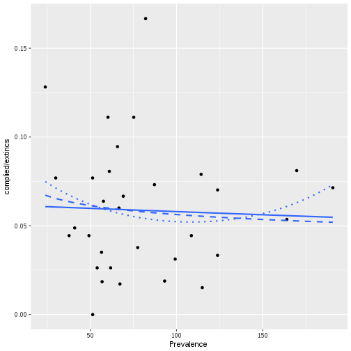

```r
p_comp_state_conc <- ggplot(enve_state, aes(x = Concentration, y = complied/extincs))

p_comp_state_conc + geom_point() +
  stat_smooth(method="glm", method.args=list(family="binomial"), se=FALSE, aes(weight = extincs)) +
  stat_smooth(method="glm", method.args=list(family="binomial"), se=FALSE, aes(weight = extincs),
              formula = y ~ log(x), linetype = 2) +
  stat_smooth(method="glm", method.args=list(family="binomial"), se=FALSE, aes(weight = extincs),
              formula = y ~ poly(x, order = 2, raw = TRUE), linetype = 3)
```

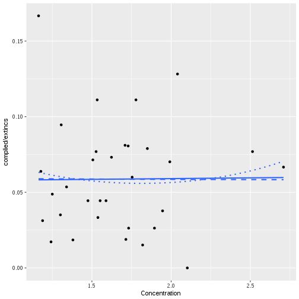

```r
p_comp_state_bribes <- ggplot(enve_state, aes(x = bribes_abvic , y = complied/extincs))

p_comp_state_bribes + geom_point() +
  stat_smooth(method="glm", method.args=list(family="binomial"), se=FALSE, aes(weight = extincs),
              formula = y ~ x) +
  stat_smooth(method="glm", method.args=list(family="binomial"), se=FALSE, aes(weight = extincs),
              formula = y ~ log(x), linetype = 2) +
  stat_smooth(method="glm", method.args=list(family="binomial"), se=FALSE, aes(weight = extincs),
              formula = y ~ poly(x, order = 2, raw = TRUE), linetype = 3)
```

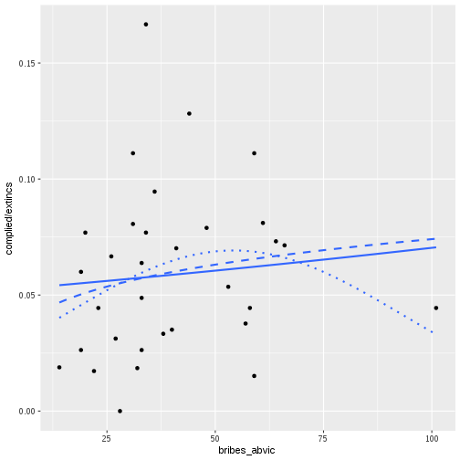

```r
p_comp_state_deaths <- ggplot(enve_state, aes(x = (defun/poblacion)*100000, y = complied/extincs))

p_comp_state_deaths + geom_point() +
  stat_smooth(method="glm", method.args=list(family="binomial"), se=FALSE, aes(weight = extincs)) +
  stat_smooth(method="glm", method.args=list(family="binomial"), se=FALSE, aes(weight = extincs),
              formula = y ~ log(x), linetype = 2) +
  stat_smooth(method="glm", method.args=list(family="binomial"), se=FALSE, aes(weight = extincs),
              formula = y ~ poly(x, order = 2, raw = TRUE), linetype = 3) +
  stat_smooth(method="glm", method.args=list(family="binomial"), se=FALSE, aes(weight = extincs),
              formula = y ~ poly(x, order = 3), linetype = 4)
```

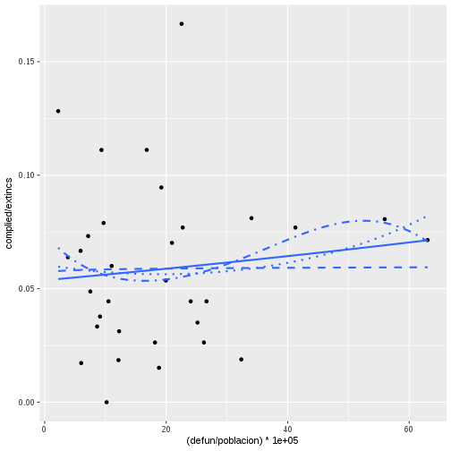

```r
p_comp_state_wpn <- ggplot(enve_state, aes(x = (defun_arma/defun)*100, y = complied/extincs))

p_comp_state_wpn + geom_point() +
  stat_smooth(method="glm", method.args=list(family="binomial"), se=FALSE, aes(weight = extincs)) +
  stat_smooth(method="glm", method.args=list(family="binomial"), se=FALSE, aes(weight = extincs),
              formula = y ~ log(x), linetype = 2) +
  stat_smooth(method="glm", method.args=list(family="binomial"), se=FALSE, aes(weight = extincs),
              formula = y ~ poly(x, order = 2, raw = TRUE), linetype = 3)
```

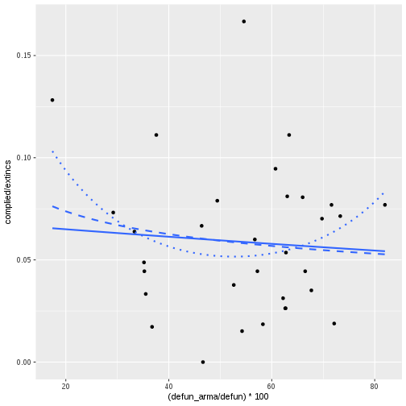

```r
p_comp_state_drugs <- ggplot(enve_state, aes(x = drogas, y = complied/extincs))

p_comp_state_drugs + geom_point() +
  stat_smooth(method="glm", method.args=list(family="binomial"), se=FALSE, aes(weight = extincs)) +
  stat_smooth(method="glm", method.args=list(family="binomial"), se=FALSE, aes(weight = extincs),
              formula = y ~ log(x), linetype = 2) +
  stat_smooth(method="glm", method.args=list(family="binomial"), se=FALSE, aes(weight = extincs),
              formula = y ~ poly(x, order = 2, raw = TRUE), linetype = 3)
```

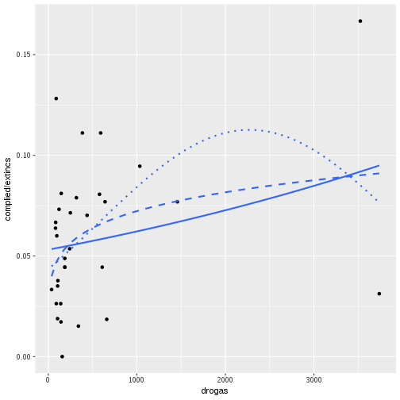

```r
p_comp_state_oc <- ggplot(enve_state, aes(x = do, y = complied/extincs))

p_comp_state_oc + geom_point() +
  stat_smooth(method="glm", method.args=list(family="binomial"), se=FALSE, aes(weight = extincs)) +
  stat_smooth(method="glm", method.args=list(family="binomial"), se=FALSE, aes(weight = extincs),
              formula = y ~ log1p(x), linetype = 2) +
  stat_smooth(method="glm", method.args=list(family="binomial"), se=FALSE, aes(weight = extincs),
              formula = y ~ poly(x, order = 2, raw = TRUE), linetype = 3)
```

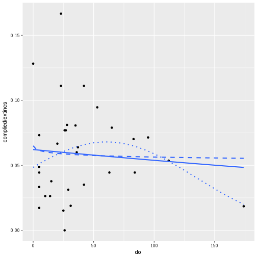

```r
p_comp_state_wpn_crimes <- ggplot(enve_state, aes(x = armas, y = complied/extincs))

p_comp_state_wpn_crimes + geom_point() +
  stat_smooth(method="glm", method.args=list(family="binomial"), se=FALSE, aes(weight = extincs)) +
  stat_smooth(method="glm", method.args=list(family="binomial"), se=FALSE, aes(weight = extincs),
              formula = y ~ log(x), linetype = 2) +
  stat_smooth(method="glm", method.args=list(family="binomial"), se=FALSE, aes(weight = extincs),
              formula = y ~ poly(x, order = 2, raw = TRUE), linetype = 3)
```

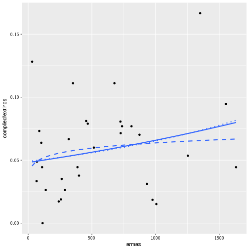

```r
p_comp_state_pop <- ggplot(enve_state, aes(x = poblacion/100000, y = complied/extincs))

p_comp_state_pop + geom_point() +
  stat_smooth(method="glm", method.args=list(family="binomial"), se=FALSE, aes(weight = extincs)) +
  stat_smooth(method="glm", method.args=list(family="binomial"), se=FALSE, aes(weight = extincs),
              formula = y ~ log(x), linetype = 2) +
  stat_smooth(method="glm", method.args=list(family="binomial"), se=FALSE, aes(weight = extincs),
              formula = y ~ poly(x, order = 2, raw = TRUE), linetype = 3) +
  stat_smooth(method="glm", method.args=list(family="binomial"), se=FALSE, aes(weight = extincs),
              formula = y ~ poly(x, order = 3), linetype = 4)
```

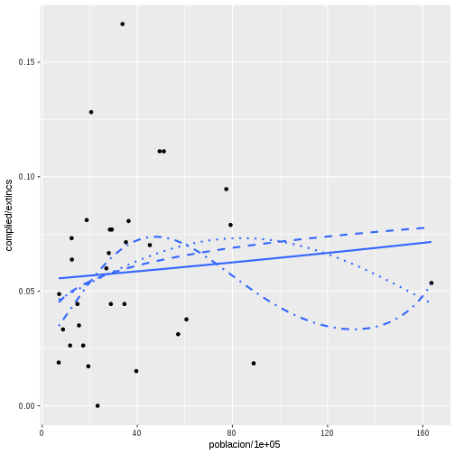

```r
p_comp_state_nbus <- ggplot(enve_state, aes(x = N, y = complied/extincs))

p_comp_state_nbus + geom_point() +
  stat_smooth(method="glm", method.args=list(family="binomial"), se=FALSE, aes(weight = extincs)) +
  stat_smooth(method="glm", method.args=list(family="binomial"), se=FALSE, aes(weight = extincs),
              formula = y ~ log(x), linetype = 2) +
  stat_smooth(method="glm", method.args=list(family="binomial"), se=FALSE, aes(weight = extincs),
              formula = y ~ poly(x, order = 2, raw = TRUE), linetype = 3)
```

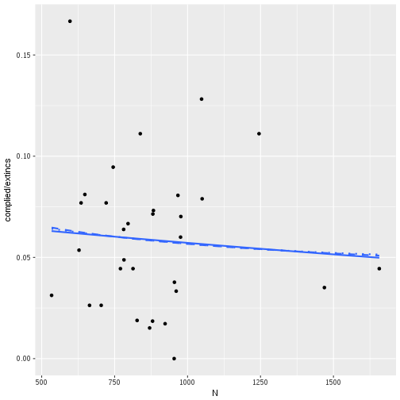

```r
p_comp_state_law <- ggplot(enve_state, aes(x = Derecho, y = complied/extincs))

p_comp_state_law + geom_point() +
  stat_smooth(method="glm", method.args=list(family="binomial"), se=FALSE, aes(weight = extincs)) +
  stat_smooth(method="glm", method.args=list(family="binomial"), se=FALSE, aes(weight = extincs),
              formula = y ~ log(x), linetype = 2) +
  stat_smooth(method="glm", method.args=list(family="binomial"), se=FALSE, aes(weight = extincs),
              formula = y ~ poly(x, order = 2, raw = TRUE), linetype = 3)
```

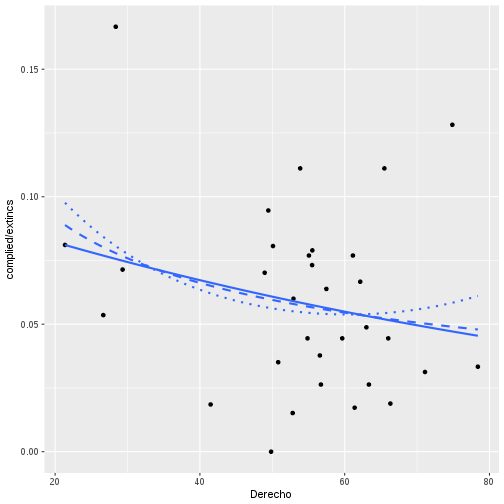

```r
p_comp_state_comp <- ggplot(enve_state, aes(x = General, y = complied/extincs))

p_comp_state_comp + geom_point() +
  stat_smooth(method="glm", method.args=list(family="binomial"), se=FALSE, aes(weight = extincs)) +
  stat_smooth(method="glm", method.args=list(family="binomial"), se=FALSE, aes(weight = extincs),
              formula = y ~ log(x), linetype = 2) +
  stat_smooth(method="glm", method.args=list(family="binomial"), se=FALSE, aes(weight = extincs),
              formula = y ~ poly(x, order = 2, raw = TRUE), linetype = 3)
```

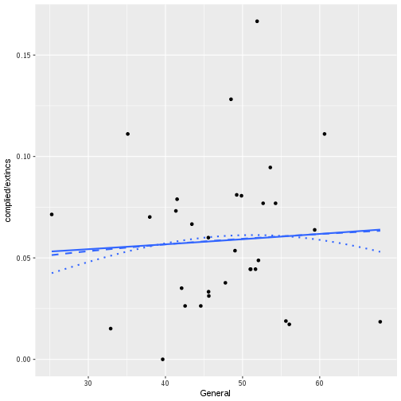

```r
enve_state %>%
    select(Prevalence,
           Concentration,
           bribes_abvic,
           defun,
           defun_arma,
           poblacion,
           drogas,
           do,
           armas,
           N,
           Derecho,
           General,
           comp_inperson,
           comp_remote,
           inperson,
           remote) %>%
    mutate(defun_rate = (defun/poblacion)*100000,
           defun_arma_rt = (defun_arma/defun)*100,
           pob100k = poblacion/100000,
           do = do + 1) %>%
    select(-defun,
           -defun_arma,
           -poblacion)-> enve_temp2


reshape2::melt(enve_temp2, id.vars = c("Prevalence",
                                      "Concentration",
                                      "bribes_abvic",
                                      "defun_rate",
                                      "inperson",
                                      "remote",
                                      "defun_arma_rt",
                                      "pob100k",
                                      "drogas",
                                      "do",
                                      "armas",
                                      "N",
                                      "Derecho",
                                      "General")) -> enve_temp2


names(enve_temp2)[(length(enve_temp2)-1):length(enve_temp2)] <- c("group", "compliance")


reshape2::melt(enve_temp2, id.vars = c("Prevalence",
                                      "Concentration",
                                      "bribes_abvic",
                                      "defun_rate",
                                      "defun_arma_rt",
                                      "pob100k",
                                      "drogas",
                                      "do",
                                      "armas",
                                      "N",
                                      "Derecho",
                                      "General",
                                      "compliance",
                                      "group") ) -> enve_temp2

names(enve_temp2)[length(enve_temp2)] <- "weight"

levels(enve_temp2$group) <- levels(enve_temp2$variable)

enve_temp2 %>%
    filter(variable == group) -> enve_temp2


#### Change the names of objects

p_ext_comp_by_type_state <- ggplot(enve_temp2, aes(x = Prevalence, y = compliance/weight, color = variable))

p_ext_comp_by_type_state + geom_jitter(alpha = 0.3, width = 0.3, height = 0.01) +
    stat_smooth(method="glm", method.args=list(family="binomial"),
                se=FALSE, aes(weight = weight)) +
  stat_smooth(method="glm", method.args=list(family="binomial"), se=FALSE, aes(weight = weight),
              formula = y ~ log(x), linetype = 2) +
  stat_smooth(method="glm", method.args=list(family="binomial"), se=FALSE, aes(weight = weight),
              formula = y ~ poly(x, order = 2, raw = TRUE), linetype = 3)
```

```
Warning: Removed 2 rows containing non-finite values (stat_smooth).

Warning: Removed 2 rows containing non-finite values (stat_smooth).

Warning: Removed 2 rows containing non-finite values (stat_smooth).
```

```
Warning: Removed 2 rows containing missing values (geom_point).
```


```r
p_conc_comp_by_type_state <- ggplot(enve_temp2, aes(x = Concentration, y = compliance/weight, color = variable))

p_conc_comp_by_type_state + geom_jitter(alpha = 0.3, width = 0.3, height = 0.01) +
    stat_smooth(method="glm", method.args=list(family="binomial"),
                se=FALSE, aes(weight = weight)) +
  stat_smooth(method="glm", method.args=list(family="binomial"), se=FALSE, aes(weight = weight),
              formula = y ~ log(x), linetype = 2) +
  stat_smooth(method="glm", method.args=list(family="binomial"), se=FALSE, aes(weight = weight),
              formula = y ~ poly(x, order = 2, raw = TRUE), linetype = 3)
```

```
Warning: Removed 2 rows containing non-finite values (stat_smooth).
```

```
Warning: Removed 2 rows containing non-finite values (stat_smooth).

Warning: Removed 2 rows containing non-finite values (stat_smooth).
```

```
Warning: Removed 2 rows containing missing values (geom_point).
```

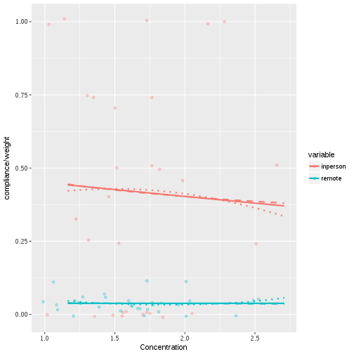

```r
p_bribes_comp_by_type_state <- ggplot(enve_temp2, aes(x = bribes_abvic, y = compliance/weight, color = variable))

p_bribes_comp_by_type_state + geom_jitter(alpha = 0.3, width = 0.3, height = 0.01) +
    stat_smooth(method="glm", method.args=list(family="binomial"),
                se=FALSE, aes(weight = weight)) +
  stat_smooth(method="glm", method.args=list(family="binomial"), se=FALSE, aes(weight = weight),
              formula = y ~ log(x), linetype = 2) +
  stat_smooth(method="glm", method.args=list(family="binomial"), se=FALSE, aes(weight = weight),
              formula = y ~ poly(x, order = 2, raw = TRUE), linetype = 3) +
  stat_smooth(method="glm", method.args=list(family="binomial"), se=FALSE, aes(weight = weight),
              formula = y ~ poly(log(x), order = 2, raw = TRUE), linetype = 4)
```

```
Warning: Removed 2 rows containing non-finite values (stat_smooth).
```

```
Warning: Removed 2 rows containing non-finite values (stat_smooth).

Warning: Removed 2 rows containing non-finite values (stat_smooth).

Warning: Removed 2 rows containing non-finite values (stat_smooth).
```

```
Warning: Removed 2 rows containing missing values (geom_point).
```

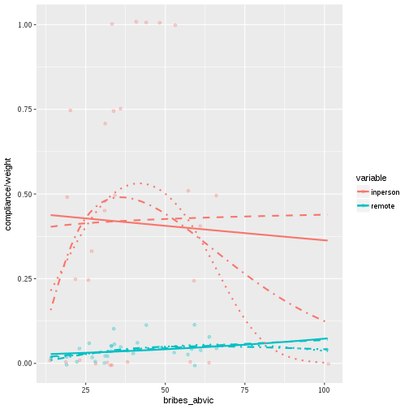

```r
p_defun_comp_by_type_state <- ggplot(enve_temp2, aes(x = defun_rate, y = compliance/weight, color = variable))

p_defun_comp_by_type_state + geom_jitter(alpha = 0.3, width = 0.3, height = 0.01) +
    stat_smooth(method="glm", method.args=list(family="binomial"),
                se=FALSE, aes(weight = weight))  +
  stat_smooth(method="glm", method.args=list(family="binomial"), se=FALSE, aes(weight = weight),
              formula = y ~ log(x), linetype = 2) +
  stat_smooth(method="glm", method.args=list(family="binomial"), se=FALSE, aes(weight = weight),
              formula = y ~ poly(x, order = 2, raw = TRUE), linetype = 3)
```

```
Warning: Removed 2 rows containing non-finite values (stat_smooth).
```

```
Warning: Removed 2 rows containing non-finite values (stat_smooth).

Warning: Removed 2 rows containing non-finite values (stat_smooth).
```

```
Warning: Removed 2 rows containing missing values (geom_point).
```

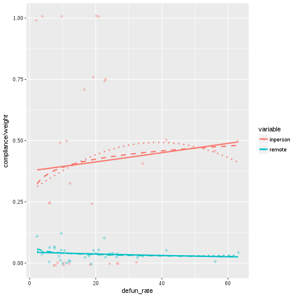

```r
p_defun_arma_comp_by_type_state <- ggplot(enve_temp2, aes(x = defun_arma_rt, y = compliance/weight, color = variable))

p_defun_arma_comp_by_type_state + geom_jitter(alpha = 0.3, width = 0.3, height = 0.01) +
    stat_smooth(method="glm", method.args=list(family="binomial"),
                se=FALSE, aes(weight = weight))  +
  stat_smooth(method="glm", method.args=list(family="binomial"), se=FALSE, aes(weight = weight),
              formula = y ~ log(x), linetype = 2) +
  stat_smooth(method="glm", method.args=list(family="binomial"), se=FALSE, aes(weight = weight),
              formula = y ~ poly(x, order = 2, raw = TRUE), linetype = 3)
```

```
Warning: Removed 2 rows containing non-finite values (stat_smooth).
```

```
Warning: Removed 2 rows containing non-finite values (stat_smooth).

Warning: Removed 2 rows containing non-finite values (stat_smooth).
```

```
Warning: Removed 2 rows containing missing values (geom_point).
```

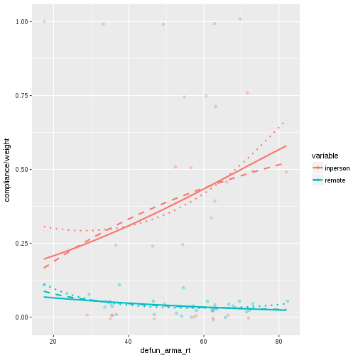

```r
p_pob_comp_by_type_state <- ggplot(enve_temp2, aes(x = pob100k, y = compliance/weight, color = variable))

p_pob_comp_by_type_state + geom_jitter(alpha = 0.3, width = 0.3, height = 0.01) +
    stat_smooth(method="glm", method.args=list(family="binomial"),
                se=FALSE, aes(weight = weight))  +
  stat_smooth(method="glm", method.args=list(family="binomial"), se=FALSE, aes(weight = weight),
              formula = y ~ log(x), linetype = 2) +
  stat_smooth(method="glm", method.args=list(family="binomial"), se=FALSE, aes(weight = weight),
              formula = y ~ poly(x, order = 2, raw = TRUE), linetype = 3)
```

```
Warning: Removed 2 rows containing non-finite values (stat_smooth).
```

```
Warning: Removed 2 rows containing non-finite values (stat_smooth).

Warning: Removed 2 rows containing non-finite values (stat_smooth).
```

```
Warning: Removed 2 rows containing missing values (geom_point).
```

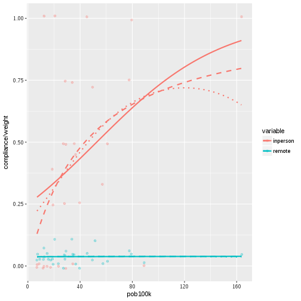

```r
p_drogas_comp_by_type_state <- ggplot(enve_temp2, aes(x = drogas, y = compliance/weight, color = variable))

p_drogas_comp_by_type_state + geom_jitter(alpha = 0.3, width = 0.3, height = 0.01) +
    stat_smooth(method="glm", method.args=list(family="binomial"),
                se=FALSE, aes(weight = weight))  +
  stat_smooth(method="glm", method.args=list(family="binomial"), se=FALSE, aes(weight = weight),
              formula = y ~ log(x), linetype = 2) +
  stat_smooth(method="glm", method.args=list(family="binomial"), se=FALSE, aes(weight = weight),
              formula = y ~ poly(x, order = 2, raw = TRUE), linetype = 3)
```

```
Warning: Removed 2 rows containing non-finite values (stat_smooth).
```

```
Warning: Removed 2 rows containing non-finite values (stat_smooth).

Warning: Removed 2 rows containing non-finite values (stat_smooth).
```

```
Warning: Removed 2 rows containing missing values (geom_point).
```

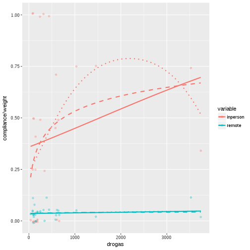

```r
p_do_comp_by_type_state <- ggplot(enve_temp2, aes(x = do, y = compliance/weight, color = variable))

p_do_comp_by_type_state + geom_jitter(alpha = 0.3, width = 0.3, height = 0.01) +
    stat_smooth(method="glm", method.args=list(family="binomial"),
                se=FALSE, aes(weight = weight))  +
  stat_smooth(method="glm", method.args=list(family="binomial"), se=FALSE, aes(weight = weight),
              formula = y ~ log1p(x), linetype = 2) +
  stat_smooth(method="glm", method.args=list(family="binomial"), se=FALSE, aes(weight = weight),
              formula = y ~ poly(x, order = 2, raw = TRUE), linetype = 3)
```

```
Warning: Removed 2 rows containing non-finite values (stat_smooth).
```

```
Warning: Removed 2 rows containing non-finite values (stat_smooth).

Warning: Removed 2 rows containing non-finite values (stat_smooth).
```

```
Warning: Removed 2 rows containing missing values (geom_point).
```

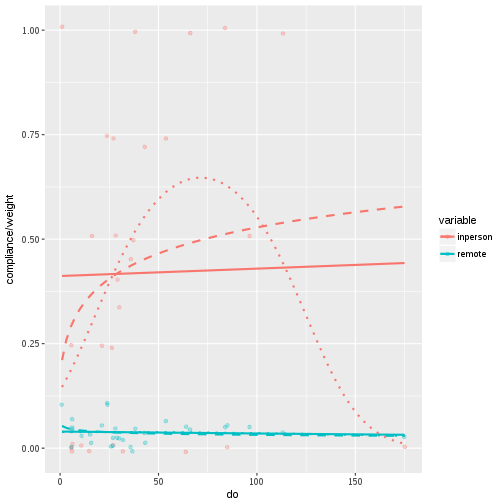

```r
p_armas_comp_by_type_state <- ggplot(enve_temp2, aes(x = armas, y = compliance/weight, color = variable))

p_armas_comp_by_type_state + geom_jitter(alpha = 0.3, width = 0.3, height = 0.01) +
    stat_smooth(method="glm", method.args=list(family="binomial"),
                se=FALSE, aes(weight = weight))  +
  stat_smooth(method="glm", method.args=list(family="binomial"), se=FALSE, aes(weight = weight),
              formula = y ~ log(x), linetype = 2) +
  stat_smooth(method="glm", method.args=list(family="binomial"), se=FALSE, aes(weight = weight),
              formula = y ~ poly(x, order = 2, raw = TRUE), linetype = 3)
```

```
Warning: Removed 2 rows containing non-finite values (stat_smooth).
```

```
Warning: Removed 2 rows containing non-finite values (stat_smooth).

Warning: Removed 2 rows containing non-finite values (stat_smooth).
```

```
Warning: Removed 2 rows containing missing values (geom_point).
```

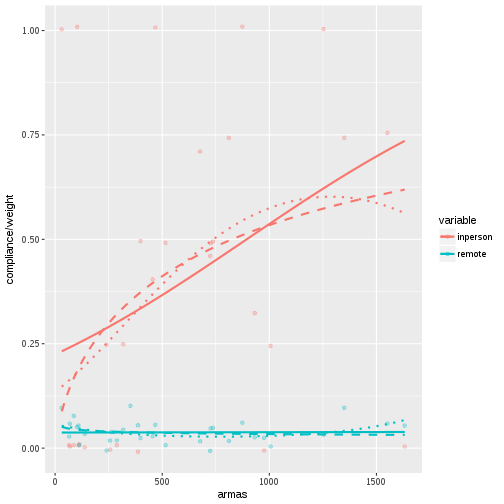

```r
p_N_comp_by_type_state <- ggplot(enve_temp2, aes(x = N, y = compliance/weight, color = variable))

p_N_comp_by_type_state + geom_jitter(alpha = 0.3, width = 0.3, height = 0.01) +
    stat_smooth(method="glm", method.args=list(family="binomial"),
                se=FALSE, aes(weight = weight))  +
  stat_smooth(method="glm", method.args=list(family="binomial"), se=FALSE, aes(weight = weight),
              formula = y ~ log(x), linetype = 2) +
  stat_smooth(method="glm", method.args=list(family="binomial"), se=FALSE, aes(weight = weight),
              formula = y ~ poly(x, order = 2, raw = TRUE), linetype = 3)
```

```
Warning: Removed 2 rows containing non-finite values (stat_smooth).
```

```
Warning: Removed 2 rows containing non-finite values (stat_smooth).

Warning: Removed 2 rows containing non-finite values (stat_smooth).
```

```
Warning: Removed 2 rows containing missing values (geom_point).
```

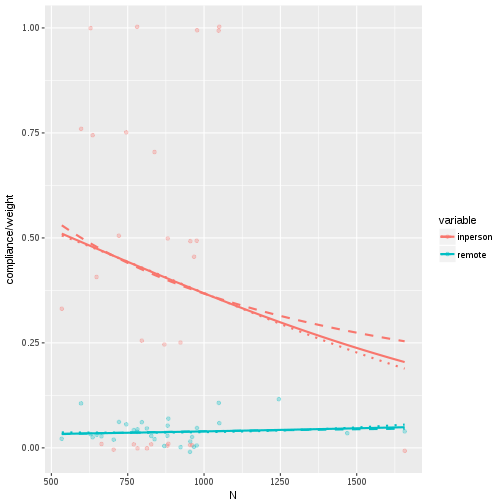

```r
p_derecho_comp_by_type_state <- ggplot(enve_temp2, aes(x = Derecho, y = compliance/weight, color = variable))

p_derecho_comp_by_type_state + geom_jitter(alpha = 0.3, width = 0.3, height = 0.01) +
    stat_smooth(method="glm", method.args=list(family="binomial"),
                se=FALSE, aes(weight = weight))  +
  stat_smooth(method="glm", method.args=list(family="binomial"), se=FALSE, aes(weight = weight),
              formula = y ~ log(x), linetype = 2) +
  stat_smooth(method="glm", method.args=list(family="binomial"), se=FALSE, aes(weight = weight),
              formula = y ~ poly(x, order = 2, raw = TRUE), linetype = 3)
```

```
Warning: Removed 2 rows containing non-finite values (stat_smooth).
```

```
Warning: Removed 2 rows containing non-finite values (stat_smooth).

Warning: Removed 2 rows containing non-finite values (stat_smooth).
```

```
Warning: Removed 2 rows containing missing values (geom_point).
```

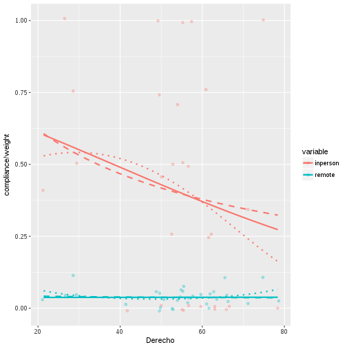

```r
p_general_comp_by_type_state <- ggplot(enve_temp2, aes(x = General, y = compliance/weight, color = variable))

p_general_comp_by_type_state + geom_jitter(alpha = 0.3, width = 0.3, height = 0.01) +
    stat_smooth(method="glm", method.args=list(family="binomial"),
                se=FALSE, aes(weight = weight))  +
  stat_smooth(method="glm", method.args=list(family="binomial"), se=FALSE, aes(weight = weight),
              formula = y ~ log(x), linetype = 2) +
  stat_smooth(method="glm", method.args=list(family="binomial"), se=FALSE, aes(weight = weight),
              formula = y ~ poly(x, order = 2, raw = TRUE), linetype = 3)
```

```
Warning: Removed 2 rows containing non-finite values (stat_smooth).
```

```
Warning: Removed 2 rows containing non-finite values (stat_smooth).

Warning: Removed 2 rows containing non-finite values (stat_smooth).
```

```
Warning: Removed 2 rows containing missing values (geom_point).
```

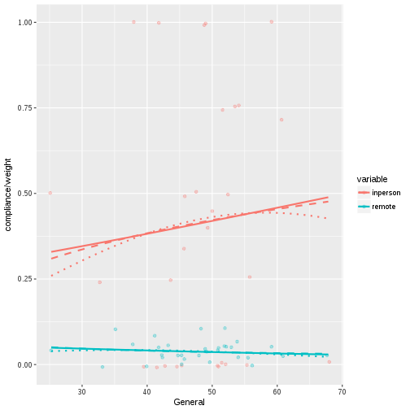


multi_glms


```r
statepredvars <- c(~ Prevalence,
              ~ log(Prevalence),
              ~ poly(Prevalence, degree = 2, raw = FALSE),
              ~ Concentration,
              ~ log(Concentration),
              ~ poly(Concentration, degree = 2, raw = FALSE),
              ~ bribes_abvic,
              ~ log(bribes_abvic),
              ~ poly(bribes_abvic, degree = 2, raw = FALSE),
              ~ defun_rate,
              ~ log(defun_rate),
              ~ poly(defun_rate, degree = 2, raw = FALSE),
              ~ defun_arma_rt,
              ~ log(defun_arma_rt),
              ~ poly(defun_arma_rt, degree = 2, raw = FALSE),
              ~ pob100k,
              ~ log(pob100k),
              ~ poly(pob100k, degree = 2, raw = FALSE),
              ~ drogas,
              ~ log(drogas),
              ~ poly(drogas, degree = 2, raw = FALSE),
              ~ do,
              ~ log1p(do),
              ~ poly(do, degree = 2, raw = FALSE),
              ~ armas,
              ~ log(armas),
              ~ poly(armas, degree = 2, raw = FALSE),
              ~ N,
              ~ log(N),
              ~ poly(N, degree = 2, raw = FALSE),
              ~ Derecho,
              ~ log(Derecho),
              ~ poly(Derecho, degree = 2, raw = FALSE),
              ~ General,
              ~ log(General),
              ~ poly(General, degree = 2, raw = FALSE))

lapply(statepredvars, function(z) tryCatch(multi_glm(data = enve_state,
                                       response = ~ cbind(complied, extincs),
                                       predictor = z),
                                      error = function(e) NULL)) -> biv_state_glms


null_state1 <- null_glm_ll(dv = ~ cbind(complied, extincs), data = enve_state)


biv_state_glms_all <- do.call(rbind, biv_state_glms)

biv_state_glms_all <- rbind(null_state1, biv_state_glms_all)

kable(biv_state_glms_all, digits = 2,
      caption = "Response: cbind(complied, extincs)")
```


|                                              | slope| pval|s1  |     ll| LRTpval|s2  |
|:---------------------------------------------|-----:|----:|:---|------:|-------:|:---|
|Null                                          |   ---|  ---|--- | -59.20|     ---|--- |
|Prevalence                                    |  0.00| 0.83|    | -59.17|    0.83|    |
|log(Prevalence)                               | -0.12| 0.60|    | -59.06|    0.60|    |
|poly(Prevalence, degree = 2, raw = FALSE)1    | -0.13| 0.83|    | -58.79|    0.66|    |
|poly(Prevalence, degree = 2, raw = FALSE)2    |  0.54| 0.37|    |    ---|     ---|--- |
|Concentration                                 |  0.02| 0.95|    | -59.20|    0.95|    |
|log(Concentration)                            | -0.01| 0.98|    | -59.20|    0.98|    |
|poly(Concentration, degree = 2, raw = FALSE)1 |  0.02| 0.98|    | -59.05|    0.87|    |
|poly(Concentration, degree = 2, raw = FALSE)2 |  0.31| 0.59|    |    ---|     ---|--- |
|bribes_abvic                                  |  0.00| 0.60|    | -59.06|    0.61|    |
|log(bribes_abvic)                             |  0.24| 0.34|    | -58.75|    0.34|    |
|poly(bribes_abvic, degree = 2, raw = FALSE)1  |  0.24| 0.73|    | -58.07|    0.32|    |
|poly(bribes_abvic, degree = 2, raw = FALSE)2  | -0.96| 0.19|    |    ---|     ---|--- |
|drogas                                        |  0.00| 0.12|    | -58.12|    0.14|    |
|log(drogas)                                   |  0.18| 0.05|    | -57.41|    0.06|    |
|poly(drogas, degree = 2, raw = FALSE)1        |  0.86| 0.10|    | -56.91|    0.10|    |
|poly(drogas, degree = 2, raw = FALSE)2        | -0.82| 0.11|    |    ---|     ---|--- |
|do                                            |  0.00| 0.63|    | -59.08|    0.63|    |
|log1p(do)                                     | -0.03| 0.77|    | -59.15|    0.77|    |
|poly(do, degree = 2, raw = FALSE)1            | -0.48| 0.53|    | -57.91|    0.28|    |
|poly(do, degree = 2, raw = FALSE)2            | -1.10| 0.16|    |    ---|     ---|--- |
|armas                                         |  0.00| 0.17|    | -58.29|    0.18|    |
|log(armas)                                    |  0.10| 0.39|    | -58.82|    0.38|    |
|poly(armas, degree = 2, raw = FALSE)1         |  0.77| 0.19|    | -58.29|    0.40|    |
|poly(armas, degree = 2, raw = FALSE)2         |  0.05| 0.93|    |    ---|     ---|--- |
|N                                             |  0.00| 0.66|    | -59.10|    0.66|    |
|log(N)                                        | -0.21| 0.64|    | -59.09|    0.64|    |
|poly(N, degree = 2, raw = FALSE)1             | -0.27| 0.67|    | -59.10|    0.90|    |
|poly(N, degree = 2, raw = FALSE)2             |  0.05| 0.94|    |    ---|     ---|--- |
|Derecho                                       | -0.01| 0.22|    | -58.47|    0.23|    |
|log(Derecho)                                  | -0.47| 0.17|    | -58.33|    0.19|    |
|poly(Derecho, degree = 2, raw = FALSE)1       | -0.67| 0.26|    | -58.13|    0.34|    |
|poly(Derecho, degree = 2, raw = FALSE)2       |  0.52| 0.40|    |    ---|     ---|--- |
|General                                       |  0.00| 0.73|    | -59.14|    0.73|    |
|log(General)                                  |  0.21| 0.71|    | -59.13|    0.71|    |
|poly(General, degree = 2, raw = FALSE)1       |  0.24| 0.71|    | -59.00|    0.82|    |
|poly(General, degree = 2, raw = FALSE)2       | -0.34| 0.61|    |    ---|     ---|--- |

```r
lapply(statepredvars, function(z) tryCatch(multi_glm(data = enve_state,
                                       response = ~ cbind(comp_remote, remote),
                                       predictor = z),
                                      error = function(e) NULL)) -> biv_state_glms_remote

null_state2 <- null_glm_ll(dv = ~ cbind(comp_remote, remote), data = enve_state)

biv_state_glms_remote_all <- do.call(rbind, biv_state_glms_remote)

biv_state_glms_remote_all <- rbind(null_state2, biv_state_glms_remote_all)

kable(biv_state_glms_remote_all, digits = 2,
      caption = "Response: cbind(comp_remote, remote)")
```


|                                              | slope| pval|s1  |     ll| LRTpval|s2  |
|:---------------------------------------------|-----:|----:|:---|------:|-------:|:---|
|Null                                          |   ---|  ---|--- | -51.34|     ---|--- |
|Prevalence                                    |  0.00| 0.73|    | -51.29|    0.73|    |
|log(Prevalence)                               | -0.20| 0.49|    | -51.11|    0.49|    |
|poly(Prevalence, degree = 2, raw = FALSE)1    | -0.25| 0.74|    | -50.82|    0.59|    |
|poly(Prevalence, degree = 2, raw = FALSE)2    |  0.74| 0.33|    |    ---|     ---|--- |
|Concentration                                 |  0.01| 0.99|    | -51.34|    0.99|    |
|log(Concentration)                            | -0.09| 0.89|    | -51.33|    0.89|    |
|poly(Concentration, degree = 2, raw = FALSE)1 | -0.06| 0.93|    | -50.74|    0.55|    |
|poly(Concentration, degree = 2, raw = FALSE)2 |  0.78| 0.26|    |    ---|     ---|--- |
|bribes_abvic                                  |  0.01| 0.09|    | -50.02|    0.10|    |
|log(bribes_abvic)                             |  0.63| 0.04|*   | -49.31|    0.04|*   |
|poly(bribes_abvic, degree = 2, raw = FALSE)1  |  1.36| 0.09|    | -48.93|    0.09|    |
|poly(bribes_abvic, degree = 2, raw = FALSE)2  | -1.13| 0.17|    |    ---|     ---|--- |
|drogas                                        |  0.00| 0.60|    | -51.21|    0.61|    |
|log(drogas)                                   |  0.05| 0.67|    | -51.26|    0.67|    |
|poly(drogas, degree = 2, raw = FALSE)1        |  0.37| 0.59|    | -51.21|    0.87|    |
|poly(drogas, degree = 2, raw = FALSE)2        | -0.05| 0.95|    |    ---|     ---|--- |
|do                                            |  0.00| 0.75|    | -51.29|    0.74|    |
|log1p(do)                                     | -0.13| 0.29|    | -50.80|    0.30|    |
|poly(do, degree = 2, raw = FALSE)1            | -0.26| 0.75|    | -51.28|    0.94|    |
|poly(do, degree = 2, raw = FALSE)2            | -0.12| 0.88|    |    ---|     ---|--- |
|armas                                         |  0.00| 0.95|    | -51.34|    0.95|    |
|log(armas)                                    | -0.12| 0.37|    | -50.95|    0.37|    |
|poly(armas, degree = 2, raw = FALSE)1         | -0.17| 0.81|    | -49.49|    0.16|    |
|poly(armas, degree = 2, raw = FALSE)2         |  1.41| 0.05|    |    ---|     ---|--- |
|N                                             |  0.00| 0.53|    | -51.15|    0.53|    |
|log(N)                                        |  0.29| 0.60|    | -51.20|    0.60|    |
|poly(N, degree = 2, raw = FALSE)1             |  0.42| 0.55|    | -51.10|    0.78|    |
|poly(N, degree = 2, raw = FALSE)2             |  0.24| 0.74|    |    ---|     ---|--- |
|Derecho                                       |  0.00| 0.98|    | -51.34|    0.98|    |
|log(Derecho)                                  | -0.11| 0.82|    | -51.32|    0.82|    |
|poly(Derecho, degree = 2, raw = FALSE)1       |  0.01| 0.99|    | -50.28|    0.34|    |
|poly(Derecho, degree = 2, raw = FALSE)2       |  1.12| 0.13|    |    ---|     ---|--- |
|General                                       | -0.01| 0.44|    | -51.05|    0.45|    |
|log(General)                                  | -0.48| 0.48|    | -51.10|    0.49|    |
|poly(General, degree = 2, raw = FALSE)1       | -0.62| 0.44|    | -50.92|    0.66|    |
|poly(General, degree = 2, raw = FALSE)2       | -0.41| 0.62|    |    ---|     ---|--- |

```r
lapply(statepredvars, function(z) tryCatch(multi_glm(data = enve_state,
                                       response = ~ cbind(comp_inperson, inperson),
                                       predictor = z),
                                      error = function(e) NULL)) -> biv_state_glms_inperson


null_state3 <- null_glm_ll(dv = ~ cbind(comp_inperson, inperson), data = enve_state)

biv_state_glms_inperson_all <- do.call(rbind, biv_state_glms_inperson)

biv_state_glms_inperson_all <- rbind(null_state3, biv_state_glms_inperson_all)

kable(biv_state_glms_inperson_all, digits = 2,
      caption = "Response: cbind(comp_inperson, inperson)")
```


|                                              | slope| pval|s1  |     ll| LRTpval|s2  |
|:---------------------------------------------|-----:|----:|:---|------:|-------:|:---|
|Null                                          |   ---|  ---|--- | -27.84|     ---|--- |
|Prevalence                                    |  0.00| 0.79|    | -27.80|    0.79|    |
|log(Prevalence)                               |  0.07| 0.87|    | -27.82|    0.87|    |
|poly(Prevalence, degree = 2, raw = FALSE)1    |  0.29| 0.80|    | -27.80|    0.96|    |
|poly(Prevalence, degree = 2, raw = FALSE)2    |  0.10| 0.93|    |    ---|     ---|--- |
|Concentration                                 | -0.12| 0.84|    | -27.81|    0.84|    |
|log(Concentration)                            | -0.19| 0.85|    | -27.82|    0.85|    |
|poly(Concentration, degree = 2, raw = FALSE)1 | -0.23| 0.84|    | -27.80|    0.96|    |
|poly(Concentration, degree = 2, raw = FALSE)2 | -0.18| 0.86|    |    ---|     ---|--- |
|bribes_abvic                                  |  0.00| 0.86|    | -27.82|    0.86|    |
|log(bribes_abvic)                             |  0.05| 0.93|    | -27.83|    0.93|    |
|poly(bribes_abvic, degree = 2, raw = FALSE)1  | -2.08| 0.42|    | -27.04|    0.45|    |
|poly(bribes_abvic, degree = 2, raw = FALSE)2  | -3.18| 0.29|    |    ---|     ---|--- |
|drogas                                        |  0.00| 0.32|    | -27.36|    0.33|    |
|log(drogas)                                   |  0.24| 0.17|    | -26.91|    0.17|    |
|poly(drogas, degree = 2, raw = FALSE)1        |  1.04| 0.28|    | -26.59|    0.29|    |
|poly(drogas, degree = 2, raw = FALSE)2        | -1.17| 0.21|    |    ---|     ---|--- |
|do                                            |  0.00| 0.94|    | -27.83|    0.94|    |
|log1p(do)                                     |  0.20| 0.43|    | -27.50|    0.42|    |
|poly(do, degree = 2, raw = FALSE)1            | -0.68| 0.77|    | -25.59|    0.11|    |
|poly(do, degree = 2, raw = FALSE)2            | -3.80| 0.12|    |    ---|     ---|--- |
|armas                                         |  0.00| 0.12|    | -26.64|    0.12|    |
|log(armas)                                    |  0.43| 0.12|    | -26.45|    0.10|    |
|poly(armas, degree = 2, raw = FALSE)1         |  2.34| 0.09|    | -26.18|    0.19|    |
|poly(armas, degree = 2, raw = FALSE)2         | -1.16| 0.35|    |    ---|     ---|--- |
|N                                             |  0.00| 0.57|    | -27.67|    0.56|    |
|log(N)                                        | -0.60| 0.57|    | -27.67|    0.56|    |
|poly(N, degree = 2, raw = FALSE)1             | -1.25| 0.64|    | -27.66|    0.84|    |
|poly(N, degree = 2, raw = FALSE)2             | -0.27| 0.89|    |    ---|     ---|--- |
|Derecho                                       | -0.01| 0.37|    | -27.44|    0.37|    |
|log(Derecho)                                  | -0.49| 0.43|    | -27.53|    0.43|    |
|poly(Derecho, degree = 2, raw = FALSE)1       | -1.31| 0.32|    | -27.31|    0.59|    |
|poly(Derecho, degree = 2, raw = FALSE)2       | -0.66| 0.62|    |    ---|     ---|--- |
|General                                       |  0.01| 0.71|    | -27.77|    0.71|    |
|log(General)                                  |  0.43| 0.71|    | -27.77|    0.71|    |
|poly(General, degree = 2, raw = FALSE)1       |  0.49| 0.70|    | -27.74|    0.91|    |
|poly(General, degree = 2, raw = FALSE)2       | -0.28| 0.82|    |    ---|     ---|--- |


proportion compliance per state


```r
enve_state %>%
    transmute(ENTIDAD,
           complied/extincs,
           comp_inperson/inperson,
           comp_remote/remote,
           extincs) %>%
    kable(., digits = 3)
```


|ENTIDAD             | complied/extincs| comp_inperson/inperson| comp_remote/remote| extincs|
|:-------------------|----------------:|----------------------:|------------------:|-------:|
|AGUASCALIENTES      |            0.064|                  1.000|              0.043|      47|
|BAJA CALIFORNIA     |            0.167|                  0.750|              0.105|      42|
|BAJA CALIFORNIA SUR |            0.049|                  0.000|              0.053|      41|
|CAMPECHE            |            0.033|                  0.000|              0.034|      30|
|COAHUILA            |            0.044|                  0.000|              0.047|      45|
|COLIMA              |            0.019|                  0.000|              0.020|      53|
|CHIAPAS             |            0.111|                    ---|              0.111|      45|
|CHIHUAHUA           |            0.081|                  0.455|              0.000|      62|
|CIUDAD DE MEXICO    |            0.019|                  0.000|              0.020|      54|
|DURANGO             |            0.026|                  0.000|              0.027|      38|
|GUANAJUATO          |            0.031|                  0.333|              0.016|      64|
|GUERRERO            |            0.071|                  0.500|              0.050|      42|
|HIDALGO             |            0.067|                  0.250|              0.054|      60|
|JALISCO             |            0.095|                  0.750|              0.057|      74|
|MEXICO              |            0.054|                  1.000|              0.036|      56|
|MICHOACAN           |            0.070|                  1.000|              0.054|      57|
|MORELOS             |            0.081|                  0.400|              0.031|      37|
|NAYARIT             |            0.026|                  0.000|              0.027|      38|
|NUEVO LEON          |            0.111|                  0.714|              0.021|      54|
|OAXACA              |            0.015|                  0.250|              0.000|      66|
|PUEBLA              |            0.038|                  0.500|              0.020|      53|
|QUERETARO           |            0.017|                  0.250|              0.000|      58|
|QUINTANA ROO        |            0.044|                  0.000|              0.047|      45|
|SAN LUIS POTOSI     |            0.060|                  0.500|              0.000|      50|
|SINALOA             |            0.077|                  0.500|              0.054|      39|
|SONORA              |            0.077|                  0.750|              0.021|      52|
|TABASCO             |            0.000|                  0.000|              0.000|      45|
|TAMAULIPAS          |            0.044|                  0.000|              0.045|      45|
|TLAXCALA            |            0.073|                  0.000|              0.075|      41|
|VERACRUZ            |            0.079|                  1.000|              0.054|      38|
|YUCATAN             |            0.128|                  1.000|              0.105|      39|
|ZACATECAS           |            0.035|                    ---|              0.035|      57|


# Models

First we'll try a single level logistic and see how post-hoc analyses work.

As we have many missing values, will start with a saturated model and drop them sequentially, either by hand or through a function.


First we start with the most restricted not excluding weapons, violence or offender variables.


```r
## datasets with no NA values first.

nacols <- colnames(enve_incvic)[colSums(is.na(enve_incvic)) > 0]

nonacols <- names(enve_incvic)[!(names(enve_incvic) %in% nacols)]

enve_incvic %>%
    select(nonacols) -> enve_nona

summary(enve_nona)
```

```
   CVE_UNICA         delito   n_offenders_NA uk_n_offenders
 Min.   :   60   Min.   :10   1    :564      known:778     
 1st Qu.: 7468   1st Qu.:10   2    :154      DK/DA:789     
 Median :11822   Median :10   3    : 37                    
 Mean   :12082   Mean   :10   4+   : 23                    
 3rd Qu.:17608   3rd Qu.:10   DK/DA:789                    
 Max.   :23355   Max.   :10                                
                                                           
 n_offenders_num         rel_offenders_NA had_weapon_NA
 Min.   :-1.0000   Total stranger:742     No   : 358   
 1st Qu.:-1.0000   Known         : 31     Yes  :  37   
 Median :-1.0000   DK/DA         :794     DK/DA:1172   
 Mean   :-0.2999                                       
 3rd Qu.: 0.0000                                       
 Max.   : 5.0000                                       
                                                       
       extortion_type extortion_type_bin complied_bin_NA    CVE_ENT     
 Remote       :1481   Remote   :1481     No :1475        Min.   : 1.00  
 Street       :  63   In person:  86     Yes:  92        1st Qu.: 9.00  
 Premises     :  16                                      Median :16.00  
 Cobro de piso:   7                                      Mean   :16.48  
                                                         3rd Qu.:24.00  
                                                         Max.   :32.00  
                                                                        
   extortions      extortion_victim rep_extortion_victim rep_extortions   
 Min.   : 0.0000   1: 175           0:1462               Min.   : 0.0000  
 1st Qu.: 0.0000   2:1365           1: 105               1st Qu.: 0.0000  
 Median : 0.0000   9:  27                                Median : 0.0000  
 Mean   : 0.5916                                         Mean   : 0.4799  
 3rd Qu.: 0.0000                                         3rd Qu.: 0.0000  
 Max.   :33.0000                                         Max.   :32.0000  
                                                                          
     bribes        bribe1   bribe2   bribe3   bribe4   bribe_victim
 Min.   : 0.0000   1: 182   1: 182   1: 182   1: 182   0:1385      
 1st Qu.: 0.0000   2:1353   2:1353   2:1353   2:1353   1: 182      
 Median : 0.0000   9:  32   9:  32   9:  32   9:  32               
 Mean   : 0.3165                                                   
 3rd Qu.: 0.0000                                                   
 Max.   :16.0000                                                   
                                                                   
 rep_bribe bribe_cats     size     sector     tempsub      
 0:1469    0 :1385    Large :386   C:505   Min.   :212410  
 1:  98    1 :  84    Medium:378   I:494   1st Qu.:365960  
           2 :  30    Small :360   S:568   Median :517210  
           3+:  68    Micro :443           Mean   :514519  
                                           3rd Qu.:667660  
                                           Max.   :812910  
                                                           
         subsector         subsector_safe     years         yearsquant 
 Retail       : 45   Manufacturing:336    Min.   : 0.00   [0,8]  :363  
 HotelsRestBar:233   Health       :265    1st Qu.: 9.00   (8,16] :308  
 Industry     :241   HotelsRestBar:233    Median :20.00   (16,25]:311  
 Manufacturing:336   Construction :198    Mean   :20.36   (25,34]:314  
 Other serv.  :570   Maintenance  :126    3rd Qu.:31.00   (34,43]:271  
 Transport    : 80   Transport    : 80    Max.   :43.00                
 Wholesale    : 62   (Other)      :329                                 
       X               N          denuncias_homs     poblacion       
 Min.   : 1.00   Min.   : 534.0   Min.   :  39.0   Min.   :  698295  
 1st Qu.: 9.00   1st Qu.: 745.0   1st Qu.: 151.0   1st Qu.: 1874188  
 Median :16.00   Median : 838.0   Median : 536.0   Median : 2932313  
 Mean   :16.48   Mean   : 878.8   Mean   : 595.2   Mean   : 3942778  
 3rd Qu.:24.00   3rd Qu.: 967.0   3rd Qu.: 775.0   3rd Qu.: 4941059  
 Max.   :32.00   Max.   :1657.0   Max.   :2087.0   Max.   :16364210  
                                                                     
    tasahom       bribes_preval    bribes_inci      bribes_conc   
 Min.   : 1.938   Min.   :16.93   Min.   : 31.42   Min.   :1.318  
 1st Qu.: 7.797   1st Qu.:31.50   1st Qu.: 64.99   1st Qu.:1.693  
 Median :12.814   Median :42.20   Median : 88.77   Median :1.882  
 Mean   :15.875   Mean   :45.75   Mean   :107.01   Mean   :2.290  
 3rd Qu.:20.165   3rd Qu.:56.95   3rd Qu.:125.46   3rd Qu.:2.263  
 Max.   :59.225   Max.   :94.14   Max.   :420.16   Max.   :5.797  
                                                                  
  bribes_abvic    bribes_abincs      Incidence        Prevalence    
 Min.   : 14.00   Min.   : 26.00   Min.   : 45.67   Min.   : 23.85  
 1st Qu.: 27.00   1st Qu.: 48.00   1st Qu.: 83.42   1st Qu.: 56.50  
 Median : 34.00   Median : 74.00   Median :116.80   Median : 67.17  
 Mean   : 39.47   Mean   : 91.34   Mean   :131.59   Mean   : 80.44  
 3rd Qu.: 53.00   3rd Qu.:108.00   3rd Qu.:172.60   3rd Qu.: 99.25  
 Max.   :101.00   Max.   :371.00   Max.   :290.12   Max.   :190.69  
                                                                    
 Concentration       defun          defun_arma    ind_general   
 Min.   :1.163   Min.   :  46.0   Min.   :   8   Min.   :25.26  
 1st Qu.:1.340   1st Qu.: 214.0   1st Qu.: 111   1st Qu.:42.55  
 Median :1.589   Median : 648.0   Median : 402   Median :49.02  
 Mean   :1.647   Mean   : 748.8   Mean   : 467   Mean   :47.86  
 3rd Qu.:1.820   3rd Qu.: 832.0   3rd Qu.: 526   3rd Qu.:53.13  
 Max.   :2.709   Max.   :3265.0   Max.   :2049   Max.   :67.85  
                                                                
  ind_derecho       Derecho         General            ENTIDAD    
 Min.   :21.37   Min.   :21.37   Min.   :25.26   JALISCO   :  74  
 1st Qu.:49.83   1st Qu.:49.83   1st Qu.:42.55   OAXACA    :  66  
 Median :55.50   Median :55.50   Median :49.02   GUANAJUATO:  64  
 Mean   :54.20   Mean   :54.20   Mean   :47.86   CHIHUAHUA :  62  
 3rd Qu.:62.15   3rd Qu.:62.15   3rd Qu.:53.13   HIDALGO   :  60  
 Max.   :78.40   Max.   :78.40   Max.   :67.85   QUERETARO :  58  
                                                 (Other)   :1183  
      AÑO           drogas             do             armas       
 Min.   :2013   Min.   :  37.0   Min.   :  0.00   Min.   :  31.0  
 1st Qu.:2013   1st Qu.: 108.0   1st Qu.: 20.00   1st Qu.: 257.0  
 Median :2013   Median : 241.0   Median : 29.00   Median : 468.0  
 Mean   :2013   Mean   : 568.1   Mean   : 40.53   Mean   : 602.1  
 3rd Qu.:2013   3rd Qu.: 591.0   3rd Qu.: 53.00   3rd Qu.: 932.0  
 Max.   :2013   Max.   :3738.0   Max.   :174.00   Max.   :1632.0  
                                                                  
 ab_ext_preval      ab_ext_inc          NOM_ENT        NOM_ABR    
 Min.   : 19.00   Min.   : 29.0   JALISCO   :  74   JAL.   :  74  
 1st Qu.: 49.00   1st Qu.: 64.0   OAXACA    :  66   OAX.   :  66  
 Median : 59.00   Median :108.0   GUANAJUATO:  64   GTO.   :  64  
 Mean   : 70.21   Mean   :115.7   CHIHUAHUA :  62   CHIH.  :  62  
 3rd Qu.: 83.00   3rd Qu.:144.0   HIDALGO   :  60   HGO.   :  60  
 Max.   :180.00   Max.   :286.0   QUERETARO :  58   QRO.   :  58  
                                  (Other)   :1183   (Other):1183  
```

```r
nrow(enve_nona)
```

```
[1] 1567
```

```r
nrow(enve_nona[complete.cases(enve_nona),])
```

```
[1] 1567
```

```r
nrow(enve_nona[complete.cases(enve_incvic),])
```

```
[1] 616
```

```r
## Data structure

"number of incidents"
```

```
[1] "number of incidents"
```

```r
nrow(enve_nona)
```

```
[1] 1567
```

```r
"incidents per business"
```

```
[1] "incidents per business"
```

```r
table(table(enve_nona$CVE_UNICA))
```

```

   1    2    3    4    5 
1053  127   49   12   13 
```

```r
enve_nona %>%
    count(CVE_UNICA) %>%
    summarise(min(n),
              max(n),
              mean(n),
              n())
```

```
# A tibble: 1 x 4
  `min(n)` `max(n)` `mean(n)` `n()`
     <dbl>    <dbl>     <dbl> <int>
1        1        5      1.25  1254
```

```r
"number of incidents per state"
```

```
[1] "number of incidents per state"
```

```r
enve_nona %>%
    count(CVE_ENT) %>%
    summarise(min(n),
              mean(n),
              max(n),
              n())
```

```
# A tibble: 1 x 4
  `min(n)` `mean(n)` `max(n)` `n()`
     <dbl>     <dbl>    <dbl> <int>
1       30      49.0       74    32
```

```r
"number of businesses per state"
```

```
[1] "number of businesses per state"
```

```r
enve_nona %>%
    count(CVE_ENT, CVE_UNICA) %>%
    count(CVE_ENT) %>%
    summarise(min(nn),
              mean(nn),
              max(nn))
```

```
# A tibble: 1 x 3
  `min(nn)` `mean(nn)` `max(nn)`
      <dbl>      <dbl>     <dbl>
1        26       39.2        49
```

No do the models, first bivariate


```r
dvs <- c(~ extortion_type,
         ~ extortion_type_bin,
         ~ n_offenders_NA,
         ~ rel_offenders_NA,
         ~ had_weapon_NA,
         ~ extortions,
         ~ mylog(extortions),
         ~ poly(extortons, 2),
         ~ poly(mylog(extortons), 2),
         ~ rep_extortion_victim,
         ~ rep_extortions,
         ~ log1p(rep_extortions),
         ~ poly(rep_extortions, 2),
         ~ bribes,
         ~ log1p(bribes),
         ~ poly(bribes, 2),
         ~ poly(log1p(bribes),2),
         ~ size,
         ~ subsector,
         ~ years,
         ~ log1p(years),
         ~ poly(years, 2),
         ~ poly(log1p(years), 2),
         ~ yearsquant,
         ~ scale(N, scale = FALSE),
         ~ mylog(N, center = TRUE),
         ~ poly(N, 2),
         ~ poly(mylog(N, center = FALSE), 2),
         ~ scale(denuncias_homs, scale = FALSE),
         ~ mylog(denuncias_homs, center = TRUE),
         ~ poly(denuncias_homs, 2),
         ~ poly(mylog(denuncias_homs, center = FALSE), 2),
         ~ scale(poblacion, scale = FALSE),
         ~ mylog(poblacion, center = TRUE),
         ~ poly(poblacion, 2),
         ~ poly(mylog(poblacion, center = FALSE), 2),
         ~ scale(bribes_abvic, scale = FALSE),
         ~ mylog(bribes_abvic, center = TRUE),
         ~ poly(bribes_abvic, 2),
         ~ poly(mylog(bribes_abvic, center = FALSE), 2),
         ~ scale(defun, scale = FALSE),
         ~ mylog(defun, center = TRUE),
         ~ poly(defun, 2),
         ~ poly(mylog(defun, center = FALSE), 2),
         ~ scale(defun/defun_arma, scale = FALSE),
         ~ mylog(defun/defun_arma, center = TRUE),
         ~ poly(defun/defun_arma, 2),
         ~ poly(mylog(defun/defun_arma, center = FALSE), 2),
         ~ scale(ind_general, scale = FALSE),
         ~ mylog(ind_general, center = TRUE),
         ~ poly(ind_general, 2),
         ~ poly(mylog(ind_general, center = FALSE), 2),
         ~ scale(ind_derecho, scale = FALSE),
         ~ mylog(ind_derecho, center = TRUE),
         ~ poly(ind_derecho, 2),
         ~ poly(mylog(ind_derecho, center = FALSE), 2),
         ~ scale(drogas, scale = FALSE),
         ~ mylog(drogas, center = TRUE),
         ~ poly(drogas, 2),
         ~ poly(mylog(drogas, center = FALSE), 2),
         ~ scale(armas, scale = FALSE),
         ~ mylog(armas, center = TRUE),
         ~ poly(armas, 2),
         ~ poly(mylog(armas, center = FALSE), 2),
         ~ scale(do, scale = FALSE),
         ~ mylog(do, center = TRUE),
         ~ poly(do, 2),
         ~ poly(mylog(do, center = FALSE), 2))

lapply(dvs, function(z) tryCatch(multi_glm(data = enve_nona,
                                       response = ~ complied_bin_NA,
                                       predictor = z),
                                      error = function(e) NULL)) -> biv_incvic_glms_compliance


null_biv_incvic <- null_glm_ll(dv = ~ complied_bin_NA, data = enve_incvic)

biv_incvic_glms_compliance_all <- do.call(rbind, biv_incvic_glms_compliance)

biv_incvic_glms_compliance_all <- rbind(null_biv_incvic, biv_incvic_glms_compliance_all)

kable(biv_incvic_glms_compliance_all, digits = 2,
      caption = "Response: complied_bin_NA")
```


|                                                  |  slope| pval|s1  |      ll| LRTpval|s2  |
|:-------------------------------------------------|------:|----:|:---|-------:|-------:|:---|
|Null                                              |    ---|  ---|--- | -350.08|     ---|--- |
|extortion_typeStreet                              |   2.40| 0.00|*** | -289.40|    0.00|*** |
|extortion_typePremises                            |   4.70| 0.00|*** |     ---|     ---|--- |
|extortion_typeCobro de piso                       |   3.52| 0.00|*** |     ---|     ---|--- |
|extortion_type_binIn person                       |   2.91| 0.00|*** | -296.80|    0.00|*** |
|n_offenders_NA2                                   |   1.07| 0.00|*** | -311.44|    0.00|*** |
|n_offenders_NA3                                   |   0.92| 0.10|    |     ---|     ---|--- |
|n_offenders_NA4+                                  |   3.66| 0.00|*** |     ---|     ---|--- |
|n_offenders_NADK/DA                               |  -0.27| 0.33|    |     ---|     ---|--- |
|rel_offenders_NAKnown                             |   0.76| 0.13|    | -338.99|    0.00|*** |
|rel_offenders_NADK/DA                             |  -0.97| 0.00|*** |     ---|     ---|--- |
|had_weapon_NAYes                                  |   2.71| 0.00|*** | -312.77|    0.00|*** |
|had_weapon_NADK/DA                                |  -0.65| 0.01|*   |     ---|     ---|--- |
|extortions                                        |  -0.01| 0.87|    | -350.06|    0.87|    |
|mylog(extortions)                                 |   0.10| 0.61|    | -349.95|    0.62|    |
|rep_extortion_victim1                             |   0.44| 0.23|    | -349.42|    0.25|    |
|rep_extortions                                    |  -0.01| 0.78|    | -350.03|    0.77|    |
|log1p(rep_extortions)                             |   0.07| 0.74|    | -350.02|    0.74|    |
|poly(rep_extortions, 2)1                          |  -3.68| 0.63|    | -349.66|    0.66|    |
|poly(rep_extortions, 2)2                          |  -5.12| 0.45|    |     ---|     ---|--- |
|bribes                                            |   0.13| 0.02|*   | -347.79|    0.03|*   |
|log1p(bribes)                                     |   0.60| 0.00|**  | -345.86|    0.00|**  |
|poly(bribes, 2)1                                  |   3.00| 0.61|    | -342.82|    0.00|*** |
|poly(bribes, 2)2                                  | -14.80| 0.02|*   |     ---|     ---|--- |
|poly(log1p(bribes), 2)1                           |  10.25| 0.00|**  | -345.57|    0.01|*   |
|poly(log1p(bribes), 2)2                           |  -2.33| 0.46|    |     ---|     ---|--- |
|sizeMedium                                        |   0.02| 0.95|    | -343.83|    0.01|**  |
|sizeSmall                                         |   0.68| 0.02|*   |     ---|     ---|--- |
|sizeMicro                                         |  -0.31| 0.35|    |     ---|     ---|--- |
|subsectorHotelsRestBar                            |  -0.27| 0.74|    | -347.80|    0.60|    |
|subsectorIndustry                                 |   0.20| 0.79|    |     ---|     ---|--- |
|subsectorManufacturing                            |   0.41| 0.59|    |     ---|     ---|--- |
|subsectorOther serv.                              |   0.46| 0.54|    |     ---|     ---|--- |
|subsectorTransport                                |   0.12| 0.89|    |     ---|     ---|--- |
|subsectorWholesale                                |   0.39| 0.66|    |     ---|     ---|--- |
|years                                             |   0.01| 0.46|    | -349.80|    0.46|    |
|log1p(years)                                      |   0.01| 0.94|    | -350.07|    0.94|    |
|poly(years, 2)1                                   |   2.66| 0.50|    | -348.17|    0.15|    |
|poly(years, 2)2                                   |   7.43| 0.07|    |     ---|     ---|--- |
|poly(log1p(years), 2)1                            |   0.60| 0.88|    | -349.35|    0.48|    |
|poly(log1p(years), 2)2                            |   4.90| 0.22|    |     ---|     ---|--- |
|yearsquant(8,16]                                  |  -0.11| 0.74|    | -347.50|    0.27|    |
|yearsquant(16,25]                                 |   0.06| 0.86|    |     ---|     ---|--- |
|yearsquant(25,34]                                 |  -0.35| 0.33|    |     ---|     ---|--- |
|yearsquant(34,43]                                 |   0.41| 0.19|    |     ---|     ---|--- |
|scale(N, scale = FALSE)                           |   0.00| 0.64|    | -349.97|    0.64|    |
|mylog(N, center = TRUE)                           |  -0.23| 0.62|    | -349.95|    0.62|    |
|poly(N, 2)1                                       |  -2.01| 0.65|    | -349.96|    0.89|    |
|poly(N, 2)2                                       |   0.37| 0.93|    |     ---|     ---|--- |
|poly(mylog(N, center = FALSE), 2)1                |  -2.10| 0.62|    | -349.93|    0.87|    |
|poly(mylog(N, center = FALSE), 2)2                |   0.77| 0.86|    |     ---|     ---|--- |
|scale(denuncias_homs, scale = FALSE)              |   0.00| 0.11|    | -348.83|    0.11|    |
|mylog(denuncias_homs, center = TRUE)              |   0.13| 0.20|    | -349.24|    0.20|    |
|poly(denuncias_homs, 2)1                          |   7.00| 0.10|    | -348.15|    0.15|    |
|poly(denuncias_homs, 2)2                          |  -4.82| 0.25|    |     ---|     ---|--- |
|poly(mylog(denuncias_homs, center = FALSE), 2)1   |   4.87| 0.23|    | -347.58|    0.08|    |
|poly(mylog(denuncias_homs, center = FALSE), 2)2   |   7.40| 0.06|    |     ---|     ---|--- |
|scale(poblacion, scale = FALSE)                   |   0.00| 0.59|    | -349.94|    0.60|    |
|mylog(poblacion, center = TRUE)                   |   0.18| 0.21|    | -349.28|    0.21|    |
|poly(poblacion, 2)1                               |   2.08| 0.65|    | -349.06|    0.36|    |
|poly(poblacion, 2)2                               |  -5.74| 0.20|    |     ---|     ---|--- |
|poly(mylog(poblacion, center = FALSE), 2)1        |   6.38| 0.18|    | -348.24|    0.16|    |
|poly(mylog(poblacion, center = FALSE), 2)2        |  -6.63| 0.17|    |     ---|     ---|--- |
|scale(bribes_abvic, scale = FALSE)                |   0.00| 0.58|    | -349.93|    0.59|    |
|mylog(bribes_abvic, center = TRUE)                |   0.25| 0.32|    | -349.57|    0.32|    |
|poly(bribes_abvic, 2)1                            |   1.95| 0.68|    | -348.82|    0.28|    |
|poly(bribes_abvic, 2)2                            |  -6.96| 0.17|    |     ---|     ---|--- |
|poly(mylog(bribes_abvic, center = FALSE), 2)1     |   5.28| 0.27|    | -348.12|    0.14|    |
|poly(mylog(bribes_abvic, center = FALSE), 2)2     |  -8.25| 0.11|    |     ---|     ---|--- |
|scale(defun, scale = FALSE)                       |   0.00| 0.29|    | -349.55|    0.30|    |
|mylog(defun, center = TRUE)                       |   0.09| 0.38|    | -349.68|    0.37|    |
|poly(defun, 2)1                                   |   4.46| 0.29|    | -348.91|    0.31|    |
|poly(defun, 2)2                                   |  -4.73| 0.27|    |     ---|     ---|--- |
|poly(mylog(defun, center = FALSE), 2)1            |   3.36| 0.41|    | -348.83|    0.29|    |
|poly(mylog(defun, center = FALSE), 2)2            |   5.29| 0.18|    |     ---|     ---|--- |
|scale(defun/defun_arma, scale = FALSE)            |   0.14| 0.23|    | -349.42|    0.25|    |
|mylog(defun/defun_arma, center = TRUE)            |   0.25| 0.44|    | -349.79|    0.45|    |
|poly(defun/defun_arma, 2)1                        |   3.14| 0.39|    | -348.56|    0.22|    |
|poly(defun/defun_arma, 2)2                        |   5.04| 0.19|    |     ---|     ---|--- |
|poly(mylog(defun/defun_arma, center = FALSE), 2)1 |   1.95| 0.61|    | -348.54|    0.21|    |
|poly(mylog(defun/defun_arma, center = FALSE), 2)2 |   5.86| 0.10|    |     ---|     ---|--- |
|scale(ind_general, scale = FALSE)                 |   0.00| 0.72|    | -350.01|    0.72|    |
|mylog(ind_general, center = TRUE)                 |   0.22| 0.69|    | -350.00|    0.69|    |
|poly(ind_general, 2)1                             |   1.69| 0.71|    | -349.85|    0.80|    |
|poly(ind_general, 2)2                             |  -2.50| 0.58|    |     ---|     ---|--- |
|poly(mylog(ind_general, center = FALSE), 2)1      |   1.71| 0.69|    | -350.00|    0.92|    |
|poly(mylog(ind_general, center = FALSE), 2)2      |  -0.18| 0.97|    |     ---|     ---|--- |
|scale(ind_derecho, scale = FALSE)                 |  -0.01| 0.19|    | -349.25|    0.20|    |
|mylog(ind_derecho, center = TRUE)                 |  -0.51| 0.15|    | -349.08|    0.16|    |
|poly(ind_derecho, 2)1                             |  -4.77| 0.22|    | -348.86|    0.30|    |
|poly(ind_derecho, 2)2                             |   3.61| 0.37|    |     ---|     ---|--- |
|poly(mylog(ind_derecho, center = FALSE), 2)1      |  -5.32| 0.17|    | -348.97|    0.33|    |
|poly(mylog(ind_derecho, center = FALSE), 2)2      |   1.93| 0.63|    |     ---|     ---|--- |
|scale(drogas, scale = FALSE)                      |   0.00| 0.10|    | -348.86|    0.12|    |
|mylog(drogas, center = TRUE)                      |   0.19| 0.04|*   | -348.05|    0.04|*   |
|poly(drogas, 2)1                                  |   6.47| 0.09|    | -347.48|    0.07|    |
|poly(drogas, 2)2                                  |  -6.48| 0.09|    |     ---|     ---|--- |
|poly(mylog(drogas, center = FALSE), 2)1           |   8.24| 0.05|*   | -348.05|    0.13|    |
|poly(mylog(drogas, center = FALSE), 2)2           |  -0.08| 0.98|    |     ---|     ---|--- |
|scale(armas, scale = FALSE)                       |   0.00| 0.15|    | -349.05|    0.15|    |
|mylog(armas, center = TRUE)                       |   0.10| 0.36|    | -349.65|    0.35|    |
|poly(armas, 2)1                                   |   5.87| 0.15|    | -349.05|    0.36|    |
|poly(armas, 2)2                                   |   0.40| 0.92|    |     ---|     ---|--- |
|poly(mylog(armas, center = FALSE), 2)1            |   3.82| 0.34|    | -347.74|    0.10|    |
|poly(mylog(armas, center = FALSE), 2)2            |   7.90| 0.04|*   |     ---|     ---|--- |
|scale(do, scale = FALSE)                          |   0.00| 0.62|    | -349.95|    0.61|    |
|mylog(do, center = TRUE)                          |  -0.03| 0.75|    | -350.03|    0.75|    |
|poly(do, 2)1                                      |  -4.14| 0.46|    | -348.65|    0.24|    |
|poly(do, 2)2                                      |  -8.12| 0.14|    |     ---|     ---|--- |
|poly(mylog(do, center = FALSE), 2)1               |  -1.10| 0.78|    | -349.76|    0.73|    |
|poly(mylog(do, center = FALSE), 2)2               |   2.90| 0.46|    |     ---|     ---|--- |

First the canonical model with the state level variables identified in JQC manuscript, with years, then yearcounts


```r
compliance_formula <- complied_bin_NA ~ extortion_type +
                                        n_offenders_NA +
                                        had_weapon_NA +
                                        mylog(extortions) +
                                        mylog(bribes) +
                                        subsector +
                                        size +
                                        poly(years, 2) +
                                        mylog(bribes_abvic, TRUE) +
                                        mylog(armas, TRUE) +
                                        mylog(drogas, TRUE) +
                                        mylog(poblacion, TRUE) +
                                        mylog(N, TRUE) +
                                        scale(General, scale = FALSE) +
                                        scale(Derecho, scale = FALSE)

m1 <- glm(formula = compliance_formula, data = enve_nona, family = binomial())  

tmbresults(m1)
```

```

Call:
glm(formula = compliance_formula, family = binomial(), data = enve_nona)

Deviance Residuals: 
    Min       1Q   Median       3Q      Max  
-1.9840  -0.3114  -0.2359  -0.1726   3.1730  

Coefficients:
                               Estimate Std. Error z value Pr(>|z|)    
(Intercept)                   -3.418686   0.822451  -4.157 3.23e-05 ***
extortion_typeStreet           2.079974   0.459568   4.526 6.01e-06 ***
extortion_typePremises         4.593098   0.782874   5.867 4.44e-09 ***
extortion_typeCobro de piso    3.381614   0.910821   3.713 0.000205 ***
n_offenders_NA2                1.056336   0.363881   2.903 0.003696 ** 
n_offenders_NA3                0.445042   0.676085   0.658 0.510369    
n_offenders_NA4+               2.434977   0.760382   3.202 0.001363 ** 
n_offenders_NADK/DA           -0.058228   0.338360  -0.172 0.863368    
had_weapon_NAYes              -0.161445   0.651215  -0.248 0.804201    
had_weapon_NADK/DA             0.170809   0.366756   0.466 0.641409    
mylog(extortions)              0.193316   0.210621   0.918 0.358704    
mylog(bribes)                  0.578313   0.238288   2.427 0.015227 *  
subsectorHotelsRestBar        -0.709166   0.845988  -0.838 0.401879    
subsectorIndustry             -0.687149   0.855113  -0.804 0.421641    
subsectorManufacturing        -0.019866   0.797974  -0.025 0.980139    
subsectorOther serv.           0.131075   0.774156   0.169 0.865550    
subsectorTransport            -0.236417   0.954345  -0.248 0.804346    
subsectorWholesale             0.218492   0.926745   0.236 0.813617    
sizeMedium                    -0.087133   0.364669  -0.239 0.811154    
sizeSmall                      0.511431   0.339410   1.507 0.131857    
sizeMicro                     -0.501546   0.387111  -1.296 0.195109    
poly(years, 2)1                8.293685   5.027366   1.650 0.099003 .  
poly(years, 2)2                0.538325   5.080521   0.106 0.915615    
mylog(bribes_abvic, TRUE)      0.507086   0.407863   1.243 0.213766    
mylog(armas, TRUE)            -0.626136   0.250213  -2.502 0.012335 *  
mylog(drogas, TRUE)            0.436566   0.192333   2.270 0.023217 *  
mylog(poblacion, TRUE)         0.396977   0.265152   1.497 0.134350    
mylog(N, TRUE)                 0.493115   0.674446   0.731 0.464693    
scale(General, scale = FALSE) -0.008965   0.016251  -0.552 0.581180    
scale(Derecho, scale = FALSE) -0.018477   0.013276  -1.392 0.163974    
---
Signif. codes:  0 '***' 0.001 '**' 0.01 '*' 0.05 '.' 0.1 ' ' 1

(Dispersion parameter for binomial family taken to be 1)

    Null deviance: 700.15  on 1566  degrees of freedom
Residual deviance: 523.23  on 1537  degrees of freedom
AIC: 583.23

Number of Fisher Scoring iterations: 6

[1] "Confidence Intervals (Log-odds)"
```

```
Waiting for profiling to be done...
```

```
                                    2.5 %       97.5 %
(Intercept)                   -5.36331828 -2.000796405
extortion_typeStreet           1.16352251  2.975798145
extortion_typePremises         3.12536612  6.277450218
extortion_typeCobro de piso    1.60604758  5.271972486
n_offenders_NA2                0.32979578  1.764995144
n_offenders_NA3               -1.00918317  1.681871795
n_offenders_NA4+               0.92218838  3.920450765
n_offenders_NADK/DA           -0.71208209  0.620851108
had_weapon_NAYes              -1.46986481  1.095337290
had_weapon_NADK/DA            -0.53746126  0.908891032
mylog(extortions)             -0.26861548  0.569940779
mylog(bribes)                  0.07851624  1.022232747
subsectorHotelsRestBar        -2.22513065  1.255793347
subsectorIndustry             -2.22735826  1.289279420
subsectorManufacturing        -1.39444341  1.887049789
subsectorOther serv.          -1.17942034  2.008301817
subsectorTransport            -2.06803729  1.860504213
subsectorWholesale            -1.54084220  2.280253760
sizeMedium                    -0.80773188  0.631201841
sizeSmall                     -0.14912019  1.189099340
sizeMicro                     -1.27740981  0.252552714
poly(years, 2)1               -1.49088050 18.317899423
poly(years, 2)2               -9.62542561 10.350058521
mylog(bribes_abvic, TRUE)     -0.29167506  1.313398304
mylog(armas, TRUE)            -1.11717625 -0.133381056
mylog(drogas, TRUE)            0.06201550  0.818262640
mylog(poblacion, TRUE)        -0.12684990  0.915993353
mylog(N, TRUE)                -0.84083823  1.809638234
scale(General, scale = FALSE) -0.04095326  0.022943003
scale(Derecho, scale = FALSE) -0.04452395  0.007672434
[1] "Confidence Intervals (Odd Ratio)"
```

```
Waiting for profiling to be done...
```

```
                                     2.5 %       97.5 %
(Intercept)                   4.685333e-03 1.352275e-01
extortion_typeStreet          3.201190e+00 1.960526e+01
extortion_typePremises        2.276823e+01 5.324294e+02
extortion_typeCobro de piso   4.983077e+00 1.947998e+02
n_offenders_NA2               1.390684e+00 5.841544e+00
n_offenders_NA3               3.645166e-01 5.375609e+00
n_offenders_NA4+              2.514788e+00 5.042317e+01
n_offenders_NADK/DA           4.906216e-01 1.860511e+00
had_weapon_NAYes              2.299566e-01 2.990191e+00
had_weapon_NADK/DA            5.842296e-01 2.481569e+00
mylog(extortions)             7.644371e-01 1.768162e+00
mylog(bribes)                 1.081681e+00 2.779394e+00
subsectorHotelsRestBar        1.080533e-01 3.510622e+00
subsectorIndustry             1.078129e-01 3.630170e+00
subsectorManufacturing        2.479710e-01 6.599869e+00
subsectorOther serv.          3.074569e-01 7.450654e+00
subsectorTransport            1.264337e-01 6.426977e+00
subsectorWholesale            2.142006e-01 9.779162e+00
sizeMedium                    4.458682e-01 1.879869e+00
sizeSmall                     8.614656e-01 3.284122e+00
sizeMicro                     2.787584e-01 1.287307e+00
poly(years, 2)1               2.251743e-01 9.023243e+07
poly(years, 2)2               6.602840e-05 3.125887e+04
mylog(bribes_abvic, TRUE)     7.470112e-01 3.718790e+00
mylog(armas, TRUE)            3.272024e-01 8.751316e-01
mylog(drogas, TRUE)           1.063979e+00 2.266559e+00
mylog(poblacion, TRUE)        8.808659e-01 2.499257e+00
mylog(N, TRUE)                4.313488e-01 6.108237e+00
scale(General, scale = FALSE) 9.598740e-01 1.023208e+00
scale(Derecho, scale = FALSE) 9.564527e-01 1.007702e+00
Likelihood ratio test

Model 1: complied_bin_NA ~ extortion_type + n_offenders_NA + had_weapon_NA + 
    mylog(extortions) + mylog(bribes) + subsector + size + poly(years, 
    2) + mylog(bribes_abvic, TRUE) + mylog(armas, TRUE) + mylog(drogas, 
    TRUE) + mylog(poblacion, TRUE) + mylog(N, TRUE) + scale(General, 
    scale = FALSE) + scale(Derecho, scale = FALSE)
Model 2: complied_bin_NA ~ 1
  #Df  LogLik  Df  Chisq Pr(>Chisq)    
1  30 -261.61                          
2   1 -350.08 -29 176.93  < 2.2e-16 ***
---
Signif. codes:  0 '***' 0.001 '**' 0.01 '*' 0.05 '.' 0.1 ' ' 1
[1] "Variance-Covariance Matrix"
                                (Intercept) extortion_typeStreet
(Intercept)                    6.764253e-01        -0.0554083124
extortion_typeStreet          -5.540831e-02         0.2112026045
extortion_typePremises        -4.052838e-02         0.0982228632
extortion_typeCobro de piso   -6.022806e-02         0.1097394904
n_offenders_NA2               -5.793911e-02         0.0089929950
n_offenders_NA3               -2.890885e-02        -0.0472333350
n_offenders_NA4+              -2.861559e-02         0.0063264132
n_offenders_NADK/DA           -2.889609e-02         0.0031342479
had_weapon_NAYes              -4.447332e-03        -0.1030078397
had_weapon_NADK/DA            -6.685456e-02         0.0584916007
mylog(extortions)             -7.111922e-03         0.0053967844
mylog(bribes)                 -7.318655e-03         0.0087884626
subsectorHotelsRestBar        -5.370394e-01        -0.0148866816
subsectorIndustry             -5.361170e-01        -0.0205503834
subsectorManufacturing        -5.374634e-01        -0.0124341403
subsectorOther serv.          -5.435385e-01        -0.0173499991
subsectorTransport            -5.460944e-01        -0.0009966294
subsectorWholesale            -5.364840e-01        -0.0180923934
sizeMedium                    -5.247472e-02        -0.0048091088
sizeSmall                     -6.904227e-02        -0.0047775678
sizeMicro                     -5.947885e-02         0.0105651914
poly(years, 2)1               -1.489784e-02         0.2613641802
poly(years, 2)2                1.164656e-01        -0.1874315944
mylog(bribes_abvic, TRUE)      1.940762e-02         0.0077228698
mylog(armas, TRUE)             3.240681e-03        -0.0105788605
mylog(drogas, TRUE)            8.286630e-03         0.0043425655
mylog(poblacion, TRUE)         3.486579e-03         0.0078732745
mylog(N, TRUE)                -3.164219e-02         0.0193668608
scale(General, scale = FALSE)  2.506325e-05        -0.0003160226
scale(Derecho, scale = FALSE)  7.259723e-04         0.0002336582
                              extortion_typePremises
(Intercept)                            -0.0405283764
extortion_typeStreet                    0.0982228632
extortion_typePremises                  0.6128912211
extortion_typeCobro de piso             0.0778606937
n_offenders_NA2                         0.0164784830
n_offenders_NA3                        -0.0167774147
n_offenders_NA4+                        0.0334649436
n_offenders_NADK/DA                    -0.0020039732
had_weapon_NAYes                       -0.1038286072
had_weapon_NADK/DA                      0.0557779468
mylog(extortions)                       0.0043401933
mylog(bribes)                           0.0087100833
subsectorHotelsRestBar                 -0.0270164981
subsectorIndustry                      -0.0356320299
subsectorManufacturing                 -0.0077931255
subsectorOther serv.                   -0.0236590585
subsectorTransport                      0.0110682167
subsectorWholesale                     -0.0061534801
sizeMedium                             -0.0108449145
sizeSmall                               0.0041990468
sizeMicro                              -0.0251465081
poly(years, 2)1                        -0.0576690773
poly(years, 2)2                        -0.1539040969
mylog(bribes_abvic, TRUE)               0.0167975555
mylog(armas, TRUE)                     -0.0231132121
mylog(drogas, TRUE)                     0.0162745226
mylog(poblacion, TRUE)                  0.0129699475
mylog(N, TRUE)                          0.0536640538
scale(General, scale = FALSE)          -0.0003746021
scale(Derecho, scale = FALSE)          -0.0006004163
                              extortion_typeCobro de piso n_offenders_NA2
(Intercept)                                 -6.022806e-02   -5.793911e-02
extortion_typeStreet                         1.097395e-01    8.992995e-03
extortion_typePremises                       7.786069e-02    1.647848e-02
extortion_typeCobro de piso                  8.295944e-01    2.628061e-02
n_offenders_NA2                              2.628061e-02    1.324095e-01
n_offenders_NA3                             -3.564273e-02    5.516873e-02
n_offenders_NA4+                             1.038351e-01    7.687187e-02
n_offenders_NADK/DA                          1.556031e-02    4.771397e-02
had_weapon_NAYes                            -1.191922e-01   -4.038847e-02
had_weapon_NADK/DA                           7.078369e-02    3.870355e-03
mylog(extortions)                           -2.407833e-02    9.468950e-04
mylog(bribes)                               -7.629289e-04    9.268409e-03
subsectorHotelsRestBar                      -4.190140e-02   -3.185625e-03
subsectorIndustry                           -2.669406e-02    5.544635e-03
subsectorManufacturing                      -4.680089e-02    3.712733e-03
subsectorOther serv.                        -2.023840e-02    3.537350e-03
subsectorTransport                          -1.190109e-01   -5.584574e-05
subsectorWholesale                          -1.280488e-02    6.119029e-03
sizeMedium                                  -8.908957e-04    2.835255e-03
sizeSmall                                    2.429104e-03    3.504832e-04
sizeMicro                                    2.073160e-02   -8.237540e-04
poly(years, 2)1                              7.339466e-01    4.322806e-02
poly(years, 2)2                             -7.978875e-01   -9.436348e-02
mylog(bribes_abvic, TRUE)                    8.354443e-03    6.099562e-03
mylog(armas, TRUE)                          -1.372333e-03   -3.317551e-03
mylog(drogas, TRUE)                         -1.389105e-03    1.481516e-03
mylog(poblacion, TRUE)                      -7.470863e-03    2.859005e-03
mylog(N, TRUE)                              -1.342154e-02    7.517948e-03
scale(General, scale = FALSE)                4.470544e-04   -2.459453e-05
scale(Derecho, scale = FALSE)               -8.965409e-05   -2.635400e-04
                              n_offenders_NA3 n_offenders_NA4+
(Intercept)                     -0.0289088455    -0.0286155880
extortion_typeStreet            -0.0472333350     0.0063264132
extortion_typePremises          -0.0167774147     0.0334649436
extortion_typeCobro de piso     -0.0356427251     0.1038351004
n_offenders_NA2                  0.0551687264     0.0768718680
n_offenders_NA3                  0.4570904163     0.0905027575
n_offenders_NA4+                 0.0905027575     0.5781805828
n_offenders_NADK/DA              0.0327719387     0.0414252903
had_weapon_NAYes                -0.0157733124    -0.2503836959
had_weapon_NADK/DA               0.0170416876     0.0174227123
mylog(extortions)                0.0022904090    -0.0065416994
mylog(bribes)                    0.0103578555    -0.0054599400
subsectorHotelsRestBar          -0.0372058975    -0.0168758585
subsectorIndustry               -0.0070439971    -0.0479248082
subsectorManufacturing          -0.0030453850    -0.0149302971
subsectorOther serv.            -0.0171213474     0.0032123465
subsectorTransport               0.0053406184    -0.0019242456
subsectorWholesale               0.0086765761     0.0113709465
sizeMedium                      -0.0186103536    -0.0251089439
sizeSmall                       -0.0009843538    -0.0198550938
sizeMicro                       -0.0184209546    -0.0173253105
poly(years, 2)1                 -0.1752710078    -0.1570195282
poly(years, 2)2                 -0.2145592758    -0.2237339264
mylog(bribes_abvic, TRUE)        0.0241842642     0.0180071953
mylog(armas, TRUE)               0.0020949638     0.0064215869
mylog(drogas, TRUE)              0.0017753606    -0.0005344388
mylog(poblacion, TRUE)          -0.0024020519     0.0018886016
mylog(N, TRUE)                  -0.0180546595     0.0113549982
scale(General, scale = FALSE)    0.0005627770     0.0004646095
scale(Derecho, scale = FALSE)   -0.0003729604    -0.0002095124
                              n_offenders_NADK/DA had_weapon_NAYes
(Intercept)                         -2.889609e-02    -0.0044473320
extortion_typeStreet                 3.134248e-03    -0.1030078397
extortion_typePremises              -2.003973e-03    -0.1038286072
extortion_typeCobro de piso          1.556031e-02    -0.1191922418
n_offenders_NA2                      4.771397e-02    -0.0403884685
n_offenders_NA3                      3.277194e-02    -0.0157733124
n_offenders_NA4+                     4.142529e-02    -0.2503836959
n_offenders_NADK/DA                  1.144875e-01    -0.0160420180
had_weapon_NAYes                    -1.604202e-02     0.4240806517
had_weapon_NADK/DA                  -5.156484e-02     0.0187625056
mylog(extortions)                    2.018956e-04     0.0022278238
mylog(bribes)                        8.118804e-03     0.0017264860
subsectorHotelsRestBar               3.252722e-04    -0.0046590871
subsectorIndustry                   -1.285340e-03    -0.0095699553
subsectorManufacturing               4.529450e-05    -0.0218181120
subsectorOther serv.                 4.637400e-03    -0.0118786922
subsectorTransport                  -8.529418e-04    -0.0528837813
subsectorWholesale                   8.712521e-03    -0.0076627496
sizeMedium                           9.932128e-04     0.0249091786
sizeSmall                           -1.358449e-03     0.0239368336
sizeMicro                            1.206117e-03     0.0154440763
poly(years, 2)1                     -6.922629e-02    -0.2376286218
poly(years, 2)2                     -1.862423e-01     0.3397227972
mylog(bribes_abvic, TRUE)           -4.780684e-03    -0.0088684572
mylog(armas, TRUE)                  -4.471680e-04    -0.0107414366
mylog(drogas, TRUE)                 -2.148846e-03    -0.0015426709
mylog(poblacion, TRUE)               8.188313e-04     0.0068522389
mylog(N, TRUE)                       5.809538e-03    -0.0066658758
scale(General, scale = FALSE)       -3.805658e-05     0.0000253147
scale(Derecho, scale = FALSE)       -1.630896e-04    -0.0006878894
                              had_weapon_NADK/DA mylog(extortions)
(Intercept)                        -0.0668545600     -7.111922e-03
extortion_typeStreet                0.0584916007      5.396784e-03
extortion_typePremises              0.0557779468      4.340193e-03
extortion_typeCobro de piso         0.0707836890     -2.407833e-02
n_offenders_NA2                     0.0038703554      9.468950e-04
n_offenders_NA3                     0.0170416876      2.290409e-03
n_offenders_NA4+                    0.0174227123     -6.541699e-03
n_offenders_NADK/DA                -0.0515648360      2.018956e-04
had_weapon_NAYes                    0.0187625056      2.227824e-03
had_weapon_NADK/DA                  0.1345096781     -2.610326e-03
mylog(extortions)                  -0.0026103258      4.436131e-02
mylog(bribes)                      -0.0032076068      3.727592e-03
subsectorHotelsRestBar             -0.0185464706     -4.323330e-04
subsectorIndustry                  -0.0203207570     -7.262294e-03
subsectorManufacturing             -0.0160382433     -1.587056e-03
subsectorOther serv.               -0.0180373527      3.613448e-04
subsectorTransport                 -0.0120156640      9.176610e-03
subsectorWholesale                 -0.0121154587     -2.258218e-03
sizeMedium                         -0.0010903219     -8.028520e-04
sizeSmall                           0.0040708687     -2.095436e-03
sizeMicro                           0.0053778975      1.945903e-03
poly(years, 2)1                    -0.0492878197      2.910443e-02
poly(years, 2)2                     0.0810358571      4.955480e-03
mylog(bribes_abvic, TRUE)          -0.0010565457      4.418410e-03
mylog(armas, TRUE)                 -0.0058862279     -2.924216e-03
mylog(drogas, TRUE)                 0.0011875104      1.436018e-03
mylog(poblacion, TRUE)              0.0036986495      3.379305e-03
mylog(N, TRUE)                      0.0108743944     -2.126748e-03
scale(General, scale = FALSE)       0.0002430436     -2.122996e-04
scale(Derecho, scale = FALSE)      -0.0002931502     -8.860979e-06
                              mylog(bribes) subsectorHotelsRestBar
(Intercept)                   -0.0073186545          -0.5370393600
extortion_typeStreet           0.0087884626          -0.0148866816
extortion_typePremises         0.0087100833          -0.0270164981
extortion_typeCobro de piso   -0.0007629289          -0.0419013979
n_offenders_NA2                0.0092684087          -0.0031856247
n_offenders_NA3                0.0103578555          -0.0372058975
n_offenders_NA4+              -0.0054599400          -0.0168758585
n_offenders_NADK/DA            0.0081188040           0.0003252722
had_weapon_NAYes               0.0017264860          -0.0046590871
had_weapon_NADK/DA            -0.0032076068          -0.0185464706
mylog(extortions)              0.0037275918          -0.0004323330
mylog(bribes)                  0.0567813635          -0.0088723609
subsectorHotelsRestBar        -0.0088723609           0.7156956506
subsectorIndustry             -0.0088166552           0.5640462889
subsectorManufacturing        -0.0103445000           0.5646290498
subsectorOther serv.          -0.0115232478           0.5628470604
subsectorTransport            -0.0031556931           0.5631879334
subsectorWholesale            -0.0037637083           0.5596953578
sizeMedium                     0.0003023642          -0.0108578616
sizeSmall                     -0.0011872799           0.0010159449
sizeMicro                      0.0033171194          -0.0049986178
poly(years, 2)1                0.0067715875          -0.1712639709
poly(years, 2)2               -0.0495751260           0.0204417904
mylog(bribes_abvic, TRUE)     -0.0000735590          -0.0142409620
mylog(armas, TRUE)            -0.0076455690           0.0096710509
mylog(drogas, TRUE)            0.0048795614          -0.0008980099
mylog(poblacion, TRUE)         0.0021531933          -0.0137732557
mylog(N, TRUE)                 0.0068757259           0.0315400518
scale(General, scale = FALSE)  0.0004057910           0.0002957488
scale(Derecho, scale = FALSE) -0.0002495534           0.0001995098
                              subsectorIndustry subsectorManufacturing
(Intercept)                       -5.361170e-01          -0.5374634086
extortion_typeStreet              -2.055038e-02          -0.0124341403
extortion_typePremises            -3.563203e-02          -0.0077931255
extortion_typeCobro de piso       -2.669406e-02          -0.0468008912
n_offenders_NA2                    5.544635e-03           0.0037127333
n_offenders_NA3                   -7.043997e-03          -0.0030453850
n_offenders_NA4+                  -4.792481e-02          -0.0149302971
n_offenders_NADK/DA               -1.285340e-03           0.0000452945
had_weapon_NAYes                  -9.569955e-03          -0.0218181120
had_weapon_NADK/DA                -2.032076e-02          -0.0160382433
mylog(extortions)                 -7.262294e-03          -0.0015870561
mylog(bribes)                     -8.816655e-03          -0.0103445000
subsectorHotelsRestBar             5.640463e-01           0.5646290498
subsectorIndustry                  7.312182e-01           0.5690270777
subsectorManufacturing             5.690271e-01           0.6367630607
subsectorOther serv.               5.638380e-01           0.5645471888
subsectorTransport                 5.632189e-01           0.5695183971
subsectorWholesale                 5.603805e-01           0.5620333430
sizeMedium                        -6.139782e-03          -0.0169034929
sizeSmall                         -2.171250e-03          -0.0057123775
sizeMicro                         -1.394060e-02          -0.0191979429
poly(years, 2)1                   -9.173929e-02          -0.1169684943
poly(years, 2)2                    1.548885e-01           0.0338817324
mylog(bribes_abvic, TRUE)         -1.963946e-02          -0.0175246945
mylog(armas, TRUE)                 8.457722e-03           0.0029590707
mylog(drogas, TRUE)                7.610384e-05           0.0017748885
mylog(poblacion, TRUE)            -1.365111e-02          -0.0100815062
mylog(N, TRUE)                     3.938090e-02           0.0532688940
scale(General, scale = FALSE)     -1.004120e-04           0.0002673445
scale(Derecho, scale = FALSE)     -3.482256e-04          -0.0004408906
                              subsectorOther serv. subsectorTransport
(Intercept)                          -5.435385e-01      -5.460944e-01
extortion_typeStreet                 -1.735000e-02      -9.966294e-04
extortion_typePremises               -2.365906e-02       1.106822e-02
extortion_typeCobro de piso          -2.023840e-02      -1.190109e-01
n_offenders_NA2                       3.537350e-03      -5.584574e-05
n_offenders_NA3                      -1.712135e-02       5.340618e-03
n_offenders_NA4+                      3.212347e-03      -1.924246e-03
n_offenders_NADK/DA                   4.637400e-03      -8.529418e-04
had_weapon_NAYes                     -1.187869e-02      -5.288378e-02
had_weapon_NADK/DA                   -1.803735e-02      -1.201566e-02
mylog(extortions)                     3.613448e-04       9.176610e-03
mylog(bribes)                        -1.152325e-02      -3.155693e-03
subsectorHotelsRestBar                5.628471e-01       5.631879e-01
subsectorIndustry                     5.638380e-01       5.632189e-01
subsectorManufacturing                5.645472e-01       5.695184e-01
subsectorOther serv.                  5.993179e-01       5.610225e-01
subsectorTransport                    5.610225e-01       9.107743e-01
subsectorWholesale                    5.600067e-01       5.606896e-01
sizeMedium                           -1.298607e-02      -7.401971e-03
sizeSmall                             5.342449e-03       5.535374e-03
sizeMicro                            -1.186214e-02      -1.848775e-03
poly(years, 2)1                      -3.977370e-02      -3.898355e-02
poly(years, 2)2                      -4.206579e-03       1.630131e-01
mylog(bribes_abvic, TRUE)            -1.890697e-02      -1.626301e-02
mylog(armas, TRUE)                    5.398121e-03       8.522099e-04
mylog(drogas, TRUE)                  -1.948877e-03       4.928117e-03
mylog(poblacion, TRUE)               -7.429651e-03      -4.929049e-04
mylog(N, TRUE)                        3.898383e-02       6.029909e-02
scale(General, scale = FALSE)        -8.411156e-05       4.490248e-04
scale(Derecho, scale = FALSE)        -3.453299e-04      -1.956783e-04
                              subsectorWholesale    sizeMedium
(Intercept)                        -5.364840e-01 -0.0524747172
extortion_typeStreet               -1.809239e-02 -0.0048091088
extortion_typePremises             -6.153480e-03 -0.0108449145
extortion_typeCobro de piso        -1.280488e-02 -0.0008908957
n_offenders_NA2                     6.119029e-03  0.0028352553
n_offenders_NA3                     8.676576e-03 -0.0186103536
n_offenders_NA4+                    1.137095e-02 -0.0251089439
n_offenders_NADK/DA                 8.712521e-03  0.0009932128
had_weapon_NAYes                   -7.662750e-03  0.0249091786
had_weapon_NADK/DA                 -1.211546e-02 -0.0010903219
mylog(extortions)                  -2.258218e-03 -0.0008028520
mylog(bribes)                      -3.763708e-03  0.0003023642
subsectorHotelsRestBar              5.596954e-01 -0.0108578616
subsectorIndustry                   5.603805e-01 -0.0061397815
subsectorManufacturing              5.620333e-01 -0.0169034929
subsectorOther serv.                5.600067e-01 -0.0129860748
subsectorTransport                  5.606896e-01 -0.0074019707
subsectorWholesale                  8.588558e-01 -0.0194435034
sizeMedium                         -1.944350e-02  0.1329831862
sizeSmall                          -9.039893e-03  0.0667966872
sizeMicro                          -1.707177e-02  0.0658366786
poly(years, 2)1                    -2.070338e-02  0.1097217977
poly(years, 2)2                    -8.074856e-02 -0.1095919123
mylog(bribes_abvic, TRUE)          -3.239020e-02 -0.0005405923
mylog(armas, TRUE)                  5.465704e-03  0.0006919307
mylog(drogas, TRUE)                 6.091478e-03  0.0001798446
mylog(poblacion, TRUE)             -4.935170e-03 -0.0021080112
mylog(N, TRUE)                      6.686892e-02 -0.0073375110
scale(General, scale = FALSE)      -4.143681e-05 -0.0002286325
scale(Derecho, scale = FALSE)      -2.152499e-04  0.0002174830
                                  sizeSmall     sizeMicro poly(years, 2)1
(Intercept)                   -6.904227e-02 -5.947885e-02   -0.0148978397
extortion_typeStreet          -4.777568e-03  1.056519e-02    0.2613641802
extortion_typePremises         4.199047e-03 -2.514651e-02   -0.0576690773
extortion_typeCobro de piso    2.429104e-03  2.073160e-02    0.7339465974
n_offenders_NA2                3.504832e-04 -8.237540e-04    0.0432280569
n_offenders_NA3               -9.843538e-04 -1.842095e-02   -0.1752710078
n_offenders_NA4+              -1.985509e-02 -1.732531e-02   -0.1570195282
n_offenders_NADK/DA           -1.358449e-03  1.206117e-03   -0.0692262887
had_weapon_NAYes               2.393683e-02  1.544408e-02   -0.2376286218
had_weapon_NADK/DA             4.070869e-03  5.377898e-03   -0.0492878197
mylog(extortions)             -2.095436e-03  1.945903e-03    0.0291044283
mylog(bribes)                 -1.187280e-03  3.317119e-03    0.0067715875
subsectorHotelsRestBar         1.015945e-03 -4.998618e-03   -0.1712639709
subsectorIndustry             -2.171250e-03 -1.394060e-02   -0.0917392930
subsectorManufacturing        -5.712377e-03 -1.919794e-02   -0.1169684943
subsectorOther serv.           5.342449e-03 -1.186214e-02   -0.0397736994
subsectorTransport             5.535374e-03 -1.848775e-03   -0.0389835531
subsectorWholesale            -9.039893e-03 -1.707177e-02   -0.0207033767
sizeMedium                     6.679669e-02  6.583668e-02    0.1097217977
sizeSmall                      1.151994e-01  6.387523e-02    0.1356315377
sizeMicro                      6.387523e-02  1.498552e-01   -0.0445796072
poly(years, 2)1                1.356315e-01 -4.457961e-02   25.2744067724
poly(years, 2)2               -1.351226e-01 -5.006202e-02   -3.3604721604
mylog(bribes_abvic, TRUE)     -9.003824e-03 -1.631168e-04    0.0001456862
mylog(armas, TRUE)            -3.062534e-03  5.322933e-03   -0.0175085578
mylog(drogas, TRUE)            7.042140e-04 -3.794247e-03    0.0805187585
mylog(poblacion, TRUE)         3.370785e-03 -5.466600e-03   -0.0956527361
mylog(N, TRUE)                -1.178592e-03 -7.902932e-03    0.1153054134
scale(General, scale = FALSE) -4.452925e-04 -5.147790e-06   -0.0060463658
scale(Derecho, scale = FALSE)  7.403835e-05  1.962323e-04   -0.0039707852
                              poly(years, 2)2 mylog(bribes_abvic, TRUE)
(Intercept)                      1.164656e-01              0.0194076155
extortion_typeStreet            -1.874316e-01              0.0077228698
extortion_typePremises          -1.539041e-01              0.0167975555
extortion_typeCobro de piso     -7.978875e-01              0.0083544433
n_offenders_NA2                 -9.436348e-02              0.0060995624
n_offenders_NA3                 -2.145593e-01              0.0241842642
n_offenders_NA4+                -2.237339e-01              0.0180071953
n_offenders_NADK/DA             -1.862423e-01             -0.0047806843
had_weapon_NAYes                 3.397228e-01             -0.0088684572
had_weapon_NADK/DA               8.103586e-02             -0.0010565457
mylog(extortions)                4.955480e-03              0.0044184104
mylog(bribes)                   -4.957513e-02             -0.0000735590
subsectorHotelsRestBar           2.044179e-02             -0.0142409620
subsectorIndustry                1.548885e-01             -0.0196394579
subsectorManufacturing           3.388173e-02             -0.0175246945
subsectorOther serv.            -4.206579e-03             -0.0189069666
subsectorTransport               1.630131e-01             -0.0162630096
subsectorWholesale              -8.074856e-02             -0.0323902043
sizeMedium                      -1.095919e-01             -0.0005405923
sizeSmall                       -1.351226e-01             -0.0090038238
sizeMicro                       -5.006202e-02             -0.0001631168
poly(years, 2)1                 -3.360472e+00              0.0001456862
poly(years, 2)2                  2.581169e+01              0.1631160638
mylog(bribes_abvic, TRUE)        1.631161e-01              0.1663522265
mylog(armas, TRUE)               1.738251e-03              0.0217842685
mylog(drogas, TRUE)             -2.920464e-02             -0.0097596853
mylog(poblacion, TRUE)           7.413196e-02             -0.0196157946
mylog(N, TRUE)                  -3.631703e-01             -0.1166432204
scale(General, scale = FALSE)   -8.875198e-05              0.0023440479
scale(Derecho, scale = FALSE)    8.935734e-03              0.0021902559
                              mylog(armas, TRUE) mylog(drogas, TRUE)
(Intercept)                         0.0032406811        8.286630e-03
extortion_typeStreet               -0.0105788605        4.342565e-03
extortion_typePremises             -0.0231132121        1.627452e-02
extortion_typeCobro de piso        -0.0013723332       -1.389105e-03
n_offenders_NA2                    -0.0033175514        1.481516e-03
n_offenders_NA3                     0.0020949638        1.775361e-03
n_offenders_NA4+                    0.0064215869       -5.344388e-04
n_offenders_NADK/DA                -0.0004471680       -2.148846e-03
had_weapon_NAYes                   -0.0107414366       -1.542671e-03
had_weapon_NADK/DA                 -0.0058862279        1.187510e-03
mylog(extortions)                  -0.0029242164        1.436018e-03
mylog(bribes)                      -0.0076455690        4.879561e-03
subsectorHotelsRestBar              0.0096710509       -8.980099e-04
subsectorIndustry                   0.0084577219        7.610384e-05
subsectorManufacturing              0.0029590707        1.774889e-03
subsectorOther serv.                0.0053981206       -1.948877e-03
subsectorTransport                  0.0008522099        4.928117e-03
subsectorWholesale                  0.0054657040        6.091478e-03
sizeMedium                          0.0006919307        1.798446e-04
sizeSmall                          -0.0030625337        7.042140e-04
sizeMicro                           0.0053229328       -3.794247e-03
poly(years, 2)1                    -0.0175085578        8.051876e-02
poly(years, 2)2                     0.0017382508       -2.920464e-02
mylog(bribes_abvic, TRUE)           0.0217842685       -9.759685e-03
mylog(armas, TRUE)                  0.0626066878       -3.065607e-02
mylog(drogas, TRUE)                -0.0306560675        3.699208e-02
mylog(poblacion, TRUE)             -0.0377790534        1.893348e-03
mylog(N, TRUE)                     -0.0461822721        5.597833e-02
scale(General, scale = FALSE)       0.0005130148       -4.891770e-04
scale(Derecho, scale = FALSE)       0.0017231900       -9.928120e-04
                              mylog(poblacion, TRUE) mylog(N, TRUE)
(Intercept)                             0.0034865794  -3.164219e-02
extortion_typeStreet                    0.0078732745   1.936686e-02
extortion_typePremises                  0.0129699475   5.366405e-02
extortion_typeCobro de piso            -0.0074708630  -1.342154e-02
n_offenders_NA2                         0.0028590049   7.517948e-03
n_offenders_NA3                        -0.0024020519  -1.805466e-02
n_offenders_NA4+                        0.0018886016   1.135500e-02
n_offenders_NADK/DA                     0.0008188313   5.809538e-03
had_weapon_NAYes                        0.0068522389  -6.665876e-03
had_weapon_NADK/DA                      0.0036986495   1.087439e-02
mylog(extortions)                       0.0033793053  -2.126748e-03
mylog(bribes)                           0.0021531933   6.875726e-03
subsectorHotelsRestBar                 -0.0137732557   3.154005e-02
subsectorIndustry                      -0.0136511136   3.938090e-02
subsectorManufacturing                 -0.0100815062   5.326889e-02
subsectorOther serv.                   -0.0074296508   3.898383e-02
subsectorTransport                     -0.0004929049   6.029909e-02
subsectorWholesale                     -0.0049351700   6.686892e-02
sizeMedium                             -0.0021080112  -7.337511e-03
sizeSmall                               0.0033707853  -1.178592e-03
sizeMicro                              -0.0054665997  -7.902932e-03
poly(years, 2)1                        -0.0956527361   1.153054e-01
poly(years, 2)2                         0.0741319591  -3.631703e-01
mylog(bribes_abvic, TRUE)              -0.0196157946  -1.166432e-01
mylog(armas, TRUE)                     -0.0377790534  -4.618227e-02
mylog(drogas, TRUE)                     0.0018933478   5.597833e-02
mylog(poblacion, TRUE)                  0.0703055523   7.232097e-03
mylog(N, TRUE)                          0.0072320967   4.548769e-01
scale(General, scale = FALSE)          -0.0003542165  -7.730195e-05
scale(Derecho, scale = FALSE)          -0.0004078464  -4.105719e-03
                              scale(General, scale = FALSE)
(Intercept)                                    2.506325e-05
extortion_typeStreet                          -3.160226e-04
extortion_typePremises                        -3.746021e-04
extortion_typeCobro de piso                    4.470544e-04
n_offenders_NA2                               -2.459453e-05
n_offenders_NA3                                5.627770e-04
n_offenders_NA4+                               4.646095e-04
n_offenders_NADK/DA                           -3.805658e-05
had_weapon_NAYes                               2.531470e-05
had_weapon_NADK/DA                             2.430436e-04
mylog(extortions)                             -2.122996e-04
mylog(bribes)                                  4.057910e-04
subsectorHotelsRestBar                         2.957488e-04
subsectorIndustry                             -1.004120e-04
subsectorManufacturing                         2.673445e-04
subsectorOther serv.                          -8.411156e-05
subsectorTransport                             4.490248e-04
subsectorWholesale                            -4.143681e-05
sizeMedium                                    -2.286325e-04
sizeSmall                                     -4.452925e-04
sizeMicro                                     -5.147790e-06
poly(years, 2)1                               -6.046366e-03
poly(years, 2)2                               -8.875198e-05
mylog(bribes_abvic, TRUE)                      2.344048e-03
mylog(armas, TRUE)                             5.130148e-04
mylog(drogas, TRUE)                           -4.891770e-04
mylog(poblacion, TRUE)                        -3.542165e-04
mylog(N, TRUE)                                -7.730195e-05
scale(General, scale = FALSE)                  2.641049e-04
scale(Derecho, scale = FALSE)                  2.018822e-05
                              scale(Derecho, scale = FALSE)
(Intercept)                                    7.259723e-04
extortion_typeStreet                           2.336582e-04
extortion_typePremises                        -6.004163e-04
extortion_typeCobro de piso                   -8.965409e-05
n_offenders_NA2                               -2.635400e-04
n_offenders_NA3                               -3.729604e-04
n_offenders_NA4+                              -2.095124e-04
n_offenders_NADK/DA                           -1.630896e-04
had_weapon_NAYes                              -6.878894e-04
had_weapon_NADK/DA                            -2.931502e-04
mylog(extortions)                             -8.860979e-06
mylog(bribes)                                 -2.495534e-04
subsectorHotelsRestBar                         1.995098e-04
subsectorIndustry                             -3.482256e-04
subsectorManufacturing                        -4.408906e-04
subsectorOther serv.                          -3.453299e-04
subsectorTransport                            -1.956783e-04
subsectorWholesale                            -2.152499e-04
sizeMedium                                     2.174830e-04
sizeSmall                                      7.403835e-05
sizeMicro                                      1.962323e-04
poly(years, 2)1                               -3.970785e-03
poly(years, 2)2                                8.935734e-03
mylog(bribes_abvic, TRUE)                      2.190256e-03
mylog(armas, TRUE)                             1.723190e-03
mylog(drogas, TRUE)                           -9.928120e-04
mylog(poblacion, TRUE)                        -4.078464e-04
mylog(N, TRUE)                                -4.105719e-03
scale(General, scale = FALSE)                  2.018822e-05
scale(Derecho, scale = FALSE)                  1.762406e-04
```

```r
vif(m1, data = enve_nona)                 
```

```
                                  GVIF Df GVIF^(1/(2*Df))
extortion_type                2.454328  3        1.161419
n_offenders_NA                2.786293  4        1.136654
had_weapon_NA                 3.558915  2        1.373502
mylog(extortions)             1.065018  1        1.031997
mylog(bribes)                 1.091508  1        1.044753
subsector                     1.359775  6        1.025941
size                          1.178945  3        1.027816
poly(years, 2)                1.230779  2        1.053283
mylog(bribes_abvic, TRUE)     1.766843  1        1.329227
mylog(armas, TRUE)            4.573078  1        2.138476
mylog(drogas, TRUE)           2.869390  1        1.693928
mylog(poblacion, TRUE)        2.313108  1        1.520891
mylog(N, TRUE)                1.791366  1        1.338419
scale(General, scale = FALSE) 1.322953  1        1.150197
scale(Derecho, scale = FALSE) 2.016182  1        1.419923
```

```r
m1tmb <- glmmTMB(formula = compliance_formula, data = enve_nona, family = binomial())  

tmbresults(m1tmb)
```

```
 Family: binomial  ( logit )
Formula:          
complied_bin_NA ~ extortion_type + n_offenders_NA + had_weapon_NA +  
    mylog(extortions) + mylog(bribes) + subsector + size + poly(years,  
    2) + mylog(bribes_abvic, TRUE) + mylog(armas, TRUE) + mylog(drogas,  
    TRUE) + mylog(poblacion, TRUE) + mylog(N, TRUE) + scale(General,  
    scale = FALSE) + scale(Derecho, scale = FALSE)
Data: enve_nona

     AIC      BIC   logLik deviance df.resid 
   583.2    743.9   -261.6    523.2     1537 


Conditional model:
                               Estimate Std. Error z value Pr(>|z|)    
(Intercept)                   -3.418689   0.822471  -4.157 3.23e-05 ***
extortion_typeStreet           2.079976   0.459579   4.526 6.02e-06 ***
extortion_typePremises         4.593100   0.782889   5.867 4.44e-09 ***
extortion_typeCobro de piso    3.381617   0.910832   3.713 0.000205 ***
n_offenders_NA2                1.056337   0.363892   2.903 0.003697 ** 
n_offenders_NA3                0.445043   0.676099   0.658 0.510377    
n_offenders_NA4+               2.434977   0.760399   3.202 0.001364 ** 
n_offenders_NADK/DA           -0.058228   0.338374  -0.172 0.863373    
had_weapon_NAYes              -0.161446   0.651225  -0.248 0.804203    
had_weapon_NADK/DA             0.170810   0.366770   0.466 0.641420    
mylog(extortions)              0.193316   0.210625   0.918 0.358712    
mylog(bribes)                  0.578313   0.238295   2.427 0.015230 *  
subsectorHotelsRestBar        -0.709165   0.846015  -0.838 0.401895    
subsectorIndustry             -0.687148   0.855142  -0.804 0.421658    
subsectorManufacturing        -0.019864   0.797994  -0.025 0.980141    
subsectorOther serv.           0.131077   0.774174   0.169 0.865552    
subsectorTransport            -0.236414   0.954372  -0.248 0.804354    
subsectorWholesale             0.218493   0.926767   0.236 0.813621    
sizeMedium                    -0.087134   0.364680  -0.239 0.811159    
sizeSmall                      0.511430   0.339420   1.507 0.131867    
sizeMicro                     -0.501547   0.387130  -1.296 0.195130    
poly(years, 2)1                8.293681   5.027566   1.650 0.099016 .  
poly(years, 2)2                0.538348   5.080717   0.106 0.915615    
mylog(bribes_abvic, TRUE)      0.507087   0.407881   1.243 0.213786    
mylog(armas, TRUE)            -0.626137   0.250223  -2.502 0.012338 *  
mylog(drogas, TRUE)            0.436566   0.192342   2.270 0.023223 *  
mylog(poblacion, TRUE)         0.396978   0.265160   1.497 0.134361    
mylog(N, TRUE)                 0.493115   0.674474   0.731 0.464711    
scale(General, scale = FALSE) -0.008965   0.016252  -0.552 0.581185    
scale(Derecho, scale = FALSE) -0.018477   0.013276  -1.392 0.163981    
---
Signif. codes:  0 '***' 0.001 '**' 0.01 '*' 0.05 '.' 0.1 ' ' 1
[1] "Confidence Intervals (Log-odds)"
                                         2.5 %       97.5 %     Estimate
cond.(Intercept)                   -5.03070303 -1.806674739 -3.418688885
cond.extortion_typeStreet           1.17921793  2.980734071  2.079976003
cond.extortion_typePremises         3.05866615  6.127534578  4.593100362
cond.extortion_typeCobro de piso    1.59641865  5.166814365  3.381616507
cond.n_offenders_NA2                0.34312121  1.769553047  1.056337127
cond.n_offenders_NA3               -0.88008787  1.770173437  0.445042782
cond.n_offenders_NA4+               0.94462233  3.925332150  2.434977241
cond.n_offenders_NADK/DA           -0.72142789  0.604972047 -0.058227921
cond.had_weapon_NAYes              -1.43782423  1.114931958 -0.161446137
cond.had_weapon_NADK/DA            -0.54804530  0.889665369  0.170810035
cond.mylog(extortions)             -0.21950094  0.606133211  0.193316135
cond.mylog(bribes)                  0.11126267  1.045363117  0.578312895
cond.subsectorHotelsRestBar        -2.36732388  0.948994121 -0.709164880
cond.subsectorIndustry             -2.36319592  0.988899198 -0.687148361
cond.subsectorManufacturing        -1.58390255  1.544175267 -0.019863641
cond.subsectorOther serv.          -1.38627738  1.648430441  0.131076533
cond.subsectorTransport            -2.10694950  1.634121859 -0.236413819
cond.subsectorWholesale            -1.59793720  2.034922473  0.218492637
cond.sizeMedium                    -0.80189292  0.627625851 -0.087133535
cond.sizeSmall                     -0.15381979  1.176680720  0.511430466
cond.sizeMicro                     -1.26030665  0.257213619 -0.501546518
cond.poly(years, 2)1               -1.56016626 18.147529161  8.293681449
cond.poly(years, 2)2               -9.41967481 10.496369925  0.538347558
cond.mylog(bribes_abvic, TRUE)     -0.29234623  1.306519829  0.507086799
cond.mylog(armas, TRUE)            -1.11656434 -0.135709636 -0.626136989
cond.mylog(drogas, TRUE)            0.05958268  0.813549544  0.436566112
cond.mylog(poblacion, TRUE)        -0.12272670  0.916681828  0.396977564
cond.mylog(N, TRUE)                -0.82882899  1.815058809  0.493114909
cond.scale(General, scale = FALSE) -0.04081783  0.022887281 -0.008965272
cond.scale(Derecho, scale = FALSE) -0.04449736  0.007542724 -0.018477317
[1] "Confidence Intervals (Odd Ratio)"
                                          2.5 %       97.5 %     Estimate
cond.(Intercept)                   6.534215e-03 1.641992e-01 3.275535e-02
cond.extortion_typeStreet          3.251830e+00 1.970227e+01 8.004277e+00
cond.extortion_typePremises        2.129913e+01 4.583049e+02 9.880027e+01
cond.extortion_typeCobro de piso   4.935326e+00 1.753553e+02 2.941829e+01
cond.n_offenders_NA2               1.409340e+00 5.868230e+00 2.875818e+00
cond.n_offenders_NA3               4.147465e-01 5.871872e+00 1.560557e+00
cond.n_offenders_NA4+              2.571842e+00 5.066991e+01 1.141556e+01
cond.n_offenders_NADK/DA           4.860577e-01 1.831201e+00 9.434349e-01
cond.had_weapon_NAYes              2.374438e-01 3.049361e+00 8.509124e-01
cond.had_weapon_NADK/DA            5.780787e-01 2.434315e+00 1.186265e+00
cond.mylog(extortions)             8.029194e-01 1.833329e+00 1.213266e+00
cond.mylog(bribes)                 1.117688e+00 2.844431e+00 1.783028e+00
cond.subsectorHotelsRestBar        9.373123e-02 2.583110e+00 4.920550e-01
cond.subsectorIndustry             9.411895e-02 2.688274e+00 5.030084e-01
cond.subsectorManufacturing        2.051728e-01 4.684107e+00 9.803323e-01
cond.subsectorOther serv.          2.500042e-01 5.198814e+00 1.140055e+00
cond.subsectorTransport            1.216084e-01 5.124956e+00 7.894539e-01
cond.subsectorWholesale            2.023134e-01 7.651659e+00 1.244200e+00
cond.sizeMedium                    4.484792e-01 1.873158e+00 9.165547e-01
cond.sizeSmall                     8.574265e-01 3.243590e+00 1.667675e+00
cond.sizeMicro                     2.835671e-01 1.293321e+00 6.055934e-01
cond.poly(years, 2)1               2.101011e-01 7.609774e+07 3.998528e+03
cond.poly(years, 2)2               8.111239e-05 3.618391e+04 1.713174e+00
cond.mylog(bribes_abvic, TRUE)     7.465100e-01 3.693298e+00 1.660447e+00
cond.mylog(armas, TRUE)            3.274027e-01 8.730961e-01 5.346532e-01
cond.mylog(drogas, TRUE)           1.061394e+00 2.255901e+00 1.547385e+00
cond.mylog(poblacion, TRUE)        8.845054e-01 2.500978e+00 1.487323e+00
cond.mylog(N, TRUE)                4.365602e-01 6.141437e+00 1.637409e+00
cond.scale(General, scale = FALSE) 9.600040e-01 1.023151e+00 9.910748e-01
cond.scale(Derecho, scale = FALSE) 9.564781e-01 1.007571e+00 9.816923e-01
Likelihood ratio test

Model 1: complied_bin_NA ~ extortion_type + n_offenders_NA + had_weapon_NA + 
    mylog(extortions) + mylog(bribes) + subsector + size + poly(years, 
    2) + mylog(bribes_abvic, TRUE) + mylog(armas, TRUE) + mylog(drogas, 
    TRUE) + mylog(poblacion, TRUE) + mylog(N, TRUE) + scale(General, 
    scale = FALSE) + scale(Derecho, scale = FALSE)
Model 2: complied_bin_NA ~ 1
  #Df  LogLik  Df  Chisq Pr(>Chisq)    
1  30 -261.61                          
2   1 -350.08 -29 176.93  < 2.2e-16 ***
---
Signif. codes:  0 '***' 0.001 '**' 0.01 '*' 0.05 '.' 0.1 ' ' 1
[1] "Variance-Covariance Matrix"
Conditional model:
                                (Intercept) extortion_typeStreet
(Intercept)                    6.764591e-01        -0.0554137762
extortion_typeStreet          -5.541378e-02         0.2112127544
extortion_typePremises        -4.053273e-02         0.0982291829
extortion_typeCobro de piso   -6.023386e-02         0.1097468967
n_offenders_NA2               -5.794246e-02         0.0089949255
n_offenders_NA3               -2.891081e-02        -0.0472334277
n_offenders_NA4+              -2.861750e-02         0.0063300214
n_offenders_NADK/DA           -2.889869e-02         0.0031347934
had_weapon_NAYes              -4.448003e-03        -0.1030108478
had_weapon_NADK/DA            -6.685998e-02         0.0584964883
mylog(extortions)             -7.113286e-03         0.0053974880
mylog(bribes)                 -7.320304e-03         0.0087893944
subsectorHotelsRestBar        -5.370628e-01        -0.0148876955
subsectorIndustry             -5.361394e-01        -0.0205536406
subsectorManufacturing        -5.374871e-01        -0.0124347365
subsectorOther serv.          -5.435624e-01        -0.0173513094
subsectorTransport            -5.461196e-01        -0.0009975383
subsectorWholesale            -5.365073e-01        -0.0180940730
sizeMedium                    -5.247769e-02        -0.0048094450
sizeSmall                     -6.904602e-02        -0.0047781342
sizeMicro                     -5.948231e-02         0.0105657762
poly(years, 2)1               -1.492241e-02         0.2613990114
poly(years, 2)2                1.164863e-01        -0.1874404093
mylog(bribes_abvic, TRUE)      1.940833e-02         0.0077241264
mylog(armas, TRUE)             3.242589e-03        -0.0105814571
mylog(drogas, TRUE)            8.285755e-03         0.0043441494
mylog(poblacion, TRUE)         3.486338e-03         0.0078745604
mylog(N, TRUE)                -3.164606e-02         0.0193706806
scale(General, scale = FALSE)  2.502954e-05        -0.0003160420
scale(Derecho, scale = FALSE)  7.260872e-04         0.0002335742
                              extortion_typePremises
(Intercept)                            -0.0405327344
extortion_typeStreet                    0.0982291829
extortion_typePremises                  0.6129151644
extortion_typeCobro de piso             0.0778666599
n_offenders_NA2                         0.0164823439
n_offenders_NA3                        -0.0167760870
n_offenders_NA4+                        0.0334710324
n_offenders_NADK/DA                    -0.0020034672
had_weapon_NAYes                       -0.1038287654
had_weapon_NADK/DA                      0.0557828396
mylog(extortions)                       0.0043409958
mylog(bribes)                           0.0087114434
subsectorHotelsRestBar                 -0.0270213913
subsectorIndustry                      -0.0356385099
subsectorManufacturing                 -0.0077944794
subsectorOther serv.                   -0.0236614165
subsectorTransport                      0.0110672439
subsectorWholesale                     -0.0061547876
sizeMedium                             -0.0108460841
sizeSmall                               0.0041994614
sizeMicro                              -0.0251508927
poly(years, 2)1                        -0.0576453653
poly(years, 2)2                        -0.1539061640
mylog(bribes_abvic, TRUE)               0.0168021761
mylog(armas, TRUE)                     -0.0231182673
mylog(drogas, TRUE)                     0.0162787206
mylog(poblacion, TRUE)                  0.0129728062
mylog(N, TRUE)                          0.0536709237
scale(General, scale = FALSE)          -0.0003746158
scale(Derecho, scale = FALSE)          -0.0006005820
                              extortion_typeCobro de piso n_offenders_NA2
(Intercept)                                 -6.023386e-02   -5.794246e-02
extortion_typeStreet                         1.097469e-01    8.994925e-03
extortion_typePremises                       7.786666e-02    1.648234e-02
extortion_typeCobro de piso                  8.296149e-01    2.628478e-02
n_offenders_NA2                              2.628478e-02    1.324176e-01
n_offenders_NA3                             -3.564144e-02    5.517321e-02
n_offenders_NA4+                             1.038431e-01    7.687802e-02
n_offenders_NADK/DA                          1.556193e-02    4.771827e-02
had_weapon_NAYes                            -1.191950e-01   -4.039095e-02
had_weapon_NADK/DA                           7.079011e-02    3.870719e-03
mylog(extortions)                           -2.407869e-02    9.473808e-04
mylog(bribes)                               -7.623859e-04    9.269543e-03
subsectorHotelsRestBar                      -4.190687e-02   -3.189016e-03
subsectorIndustry                           -2.669800e-02    5.542383e-03
subsectorManufacturing                      -4.680398e-02    3.711000e-03
subsectorOther serv.                        -2.023992e-02    3.535640e-03
subsectorTransport                          -1.190200e-01   -5.805756e-05
subsectorWholesale                          -1.280603e-02    6.116960e-03
sizeMedium                                  -8.922074e-04    2.835265e-03
sizeSmall                                    2.429081e-03    3.505604e-04
sizeMicro                                    2.073157e-02   -8.244161e-04
poly(years, 2)1                              7.340306e-01    4.323992e-02
poly(years, 2)2                             -7.979578e-01   -9.437534e-02
mylog(bribes_abvic, TRUE)                    8.355701e-03    6.100561e-03
mylog(armas, TRUE)                          -1.374254e-03   -3.318598e-03
mylog(drogas, TRUE)                         -1.387605e-03    1.482290e-03
mylog(poblacion, TRUE)                      -7.470674e-03    2.859793e-03
mylog(N, TRUE)                              -1.341898e-02    7.520042e-03
scale(General, scale = FALSE)                4.470383e-04   -2.459262e-05
scale(Derecho, scale = FALSE)               -8.975335e-05   -2.635907e-04
                              n_offenders_NA3 n_offenders_NA4+
(Intercept)                     -0.0289108085    -0.0286175010
extortion_typeStreet            -0.0472334277     0.0063300214
extortion_typePremises          -0.0167760870     0.0334710324
extortion_typeCobro de piso     -0.0356414447     0.1038430607
n_offenders_NA2                  0.0551732071     0.0768780208
n_offenders_NA3                  0.4571105235     0.0905088586
n_offenders_NA4+                 0.0905088586     0.5782068371
n_offenders_NADK/DA              0.0327750430     0.0414285621
had_weapon_NAYes                -0.0157739477    -0.2503926908
had_weapon_NADK/DA               0.0170431726     0.0174260084
mylog(extortions)                0.0022909465    -0.0065414132
mylog(bribes)                    0.0103589211    -0.0054597587
subsectorHotelsRestBar          -0.0372122085    -0.0168813732
subsectorIndustry               -0.0070456757    -0.0479331190
subsectorManufacturing          -0.0030468686    -0.0149327631
subsectorOther serv.            -0.0171245798     0.0032111362
subsectorTransport               0.0053399526    -0.0019263422
subsectorWholesale               0.0086753690     0.0113702400
sizeMedium                      -0.0186119832    -0.0251128913
sizeSmall                       -0.0009846157    -0.0198570550
sizeMicro                       -0.0184234285    -0.0173292231
poly(years, 2)1                 -0.1752745424    -0.1570127469
poly(years, 2)2                 -0.2145730229    -0.2237654516
mylog(bribes_abvic, TRUE)        0.0241876473     0.0180095223
mylog(armas, TRUE)               0.0020942982     0.0064200160
mylog(drogas, TRUE)              0.0017758122    -0.0005321494
mylog(poblacion, TRUE)          -0.0024016390     0.0018894086
mylog(N, TRUE)                  -0.0180570993     0.0113592273
scale(General, scale = FALSE)    0.0005628394     0.0004646504
scale(Derecho, scale = FALSE)   -0.0003729860    -0.0002096265
                              n_offenders_NADK/DA had_weapon_NAYes
(Intercept)                         -2.889869e-02    -0.0044480033
extortion_typeStreet                 3.134793e-03    -0.1030108478
extortion_typePremises              -2.003467e-03    -0.1038287654
extortion_typeCobro de piso          1.556193e-02    -0.1191949895
n_offenders_NA2                      4.771827e-02    -0.0403909515
n_offenders_NA3                      3.277504e-02    -0.0157739477
n_offenders_NA4+                     4.142856e-02    -0.2503926908
n_offenders_NADK/DA                  1.144967e-01    -0.0160428779
had_weapon_NAYes                    -1.604288e-02     0.4240943653
had_weapon_NADK/DA                  -5.156823e-02     0.0187635595
mylog(extortions)                    2.022149e-04     0.0022277312
mylog(bribes)                        8.120098e-03     0.0017266860
subsectorHotelsRestBar               3.241028e-04    -0.0046585602
subsectorIndustry                   -1.286337e-03    -0.0095703596
subsectorManufacturing               4.445746e-05    -0.0218198849
subsectorOther serv.                 4.637118e-03    -0.0118790048
subsectorTransport                  -8.532064e-04    -0.0528880736
subsectorWholesale                   8.712701e-03    -0.0076628773
sizeMedium                           9.935608e-04     0.0249107129
sizeSmall                           -1.358338e-03     0.0239394148
sizeMicro                            1.206335e-03     0.0154454624
poly(years, 2)1                     -6.923693e-02    -0.2376527415
poly(years, 2)2                     -1.862613e-01     0.3397469966
mylog(bribes_abvic, TRUE)           -4.781261e-03    -0.0088677963
mylog(armas, TRUE)                  -4.474863e-04    -0.0107420540
mylog(drogas, TRUE)                 -2.148886e-03    -0.0015431547
mylog(poblacion, TRUE)               8.193480e-04     0.0068532164
mylog(N, TRUE)                       5.810991e-03    -0.0066685713
scale(General, scale = FALSE)       -3.804561e-05     0.0000253163
scale(Derecho, scale = FALSE)       -1.631115e-04    -0.0006878719
                              had_weapon_NADK/DA mylog(extortions)
(Intercept)                        -0.0668599823     -7.113286e-03
extortion_typeStreet                0.0584964883      5.397488e-03
extortion_typePremises              0.0557828396      4.340996e-03
extortion_typeCobro de piso         0.0707901068     -2.407869e-02
n_offenders_NA2                     0.0038707187      9.473808e-04
n_offenders_NA3                     0.0170431726      2.290947e-03
n_offenders_NA4+                    0.0174260084     -6.541413e-03
n_offenders_NADK/DA                -0.0515682254      2.022149e-04
had_weapon_NAYes                    0.0187635595      2.227731e-03
had_weapon_NADK/DA                  0.1345199873     -2.610716e-03
mylog(extortions)                  -0.0026107157      4.436282e-02
mylog(bribes)                      -0.0032079715      3.727841e-03
subsectorHotelsRestBar             -0.0185480228     -4.319172e-04
subsectorIndustry                  -0.0203234247     -7.262872e-03
subsectorManufacturing             -0.0160394678     -1.586524e-03
subsectorOther serv.               -0.0180389379      3.618583e-04
subsectorTransport                 -0.0120171039      9.177892e-03
subsectorWholesale                 -0.0121170472     -2.257633e-03
sizeMedium                         -0.0010910200     -8.028276e-04
sizeSmall                           0.0040711392     -2.095490e-03
sizeMicro                           0.0053782444      1.946247e-03
poly(years, 2)1                    -0.0492880089      2.910851e-02
poly(years, 2)2                     0.0810474828      4.957337e-03
mylog(bribes_abvic, TRUE)          -0.0010562889      4.419570e-03
mylog(armas, TRUE)                 -0.0058870309     -2.924553e-03
mylog(drogas, TRUE)                 0.0011877266      1.436139e-03
mylog(poblacion, TRUE)              0.0036988305      3.379889e-03
mylog(N, TRUE)                      0.0108752223     -2.127029e-03
scale(General, scale = FALSE)       0.0002430744     -2.122967e-04
scale(Derecho, scale = FALSE)      -0.0002931766     -8.852983e-06
                              mylog(bribes) subsectorHotelsRestBar
(Intercept)                   -0.0073203036          -0.5370627868
extortion_typeStreet           0.0087893944          -0.0148876955
extortion_typePremises         0.0087114434          -0.0270213913
extortion_typeCobro de piso   -0.0007623859          -0.0419068694
n_offenders_NA2                0.0092695429          -0.0031890162
n_offenders_NA3                0.0103589211          -0.0372122085
n_offenders_NA4+              -0.0054597587          -0.0168813732
n_offenders_NADK/DA            0.0081200981           0.0003241028
had_weapon_NAYes               0.0017266860          -0.0046585602
had_weapon_NADK/DA            -0.0032079715          -0.0185480228
mylog(extortions)              0.0037278415          -0.0004319172
mylog(bribes)                  0.0567846540          -0.0088726473
subsectorHotelsRestBar        -0.0088726473           0.7157414415
subsectorIndustry             -0.0088173104           0.5640735456
subsectorManufacturing        -0.0103449745           0.5646559106
subsectorOther serv.          -0.0115235098           0.5628736724
subsectorTransport            -0.0031555174           0.5632153646
subsectorWholesale            -0.0037631258           0.5597218024
sizeMedium                     0.0003029086          -0.0108571260
sizeSmall                     -0.0011871591           0.0010160059
sizeMicro                      0.0033176321          -0.0049975025
poly(years, 2)1                0.0067731698          -0.1712817883
poly(years, 2)2               -0.0495861129           0.0204337048
mylog(bribes_abvic, TRUE)     -0.0000738154          -0.0142439146
mylog(armas, TRUE)            -0.0076463604           0.0096717422
mylog(drogas, TRUE)            0.0048800659          -0.0008979727
mylog(poblacion, TRUE)         0.0021533997          -0.0137744841
mylog(N, TRUE)                 0.0068771929           0.0315426748
scale(General, scale = FALSE)  0.0004058197           0.0002957660
scale(Derecho, scale = FALSE) -0.0002495881           0.0001995114
                              subsectorIndustry subsectorManufacturing
(Intercept)                       -5.361394e-01          -5.374871e-01
extortion_typeStreet              -2.055364e-02          -1.243474e-02
extortion_typePremises            -3.563851e-02          -7.794479e-03
extortion_typeCobro de piso       -2.669800e-02          -4.680398e-02
n_offenders_NA2                    5.542383e-03           3.711000e-03
n_offenders_NA3                   -7.045676e-03          -3.046869e-03
n_offenders_NA4+                  -4.793312e-02          -1.493276e-02
n_offenders_NADK/DA               -1.286337e-03           4.445746e-05
had_weapon_NAYes                  -9.570360e-03          -2.181988e-02
had_weapon_NADK/DA                -2.032342e-02          -1.603947e-02
mylog(extortions)                 -7.262872e-03          -1.586524e-03
mylog(bribes)                     -8.817310e-03          -1.034497e-02
subsectorHotelsRestBar             5.640735e-01           5.646559e-01
subsectorIndustry                  7.312679e-01           5.690544e-01
subsectorManufacturing             5.690544e-01           6.367939e-01
subsectorOther serv.               5.638645e-01           5.645735e-01
subsectorTransport                 5.632461e-01           5.695459e-01
subsectorWholesale                 5.604067e-01           5.620597e-01
sizeMedium                        -6.139170e-03          -1.690407e-02
sizeSmall                         -2.171821e-03          -5.713293e-03
sizeMicro                         -1.394098e-02          -1.919876e-02
poly(years, 2)1                   -9.174261e-02          -1.169677e-01
poly(years, 2)2                    1.549060e-01           3.387281e-02
mylog(bribes_abvic, TRUE)         -1.964192e-02          -1.752640e-02
mylog(armas, TRUE)                 8.458609e-03           2.958949e-03
mylog(drogas, TRUE)                7.601522e-05           1.775632e-03
mylog(poblacion, TRUE)            -1.365269e-02          -1.008282e-02
mylog(N, TRUE)                     3.938304e-02           5.327298e-02
scale(General, scale = FALSE)     -1.004176e-04           2.673851e-04
scale(Derecho, scale = FALSE)     -3.482497e-04          -4.409493e-04
                              subsectorOther serv. subsectorTransport
(Intercept)                          -5.435624e-01      -5.461196e-01
extortion_typeStreet                 -1.735131e-02      -9.975383e-04
extortion_typePremises               -2.366142e-02       1.106724e-02
extortion_typeCobro de piso          -2.023992e-02      -1.190200e-01
n_offenders_NA2                       3.535640e-03      -5.805756e-05
n_offenders_NA3                      -1.712458e-02       5.339953e-03
n_offenders_NA4+                      3.211136e-03      -1.926342e-03
n_offenders_NADK/DA                   4.637118e-03      -8.532064e-04
had_weapon_NAYes                     -1.187900e-02      -5.288807e-02
had_weapon_NADK/DA                   -1.803894e-02      -1.201710e-02
mylog(extortions)                     3.618583e-04       9.177892e-03
mylog(bribes)                        -1.152351e-02      -3.155517e-03
subsectorHotelsRestBar                5.628737e-01       5.632154e-01
subsectorIndustry                     5.638645e-01       5.632461e-01
subsectorManufacturing                5.645735e-01       5.695459e-01
subsectorOther serv.                  5.993460e-01       5.610489e-01
subsectorTransport                    5.610489e-01       9.108268e-01
subsectorWholesale                    5.600329e-01       5.607162e-01
sizeMedium                           -1.298664e-02      -7.400978e-03
sizeSmall                             5.342441e-03       5.535862e-03
sizeMicro                            -1.186259e-02      -1.847568e-03
poly(years, 2)1                      -3.976676e-02      -3.898019e-02
poly(years, 2)2                      -4.215484e-03       1.630301e-01
mylog(bribes_abvic, TRUE)            -1.890919e-02      -1.626480e-02
mylog(armas, TRUE)                    5.398417e-03       8.523388e-04
mylog(drogas, TRUE)                  -1.948805e-03       4.928443e-03
mylog(poblacion, TRUE)               -7.430494e-03      -4.934398e-04
mylog(N, TRUE)                        3.898616e-02       6.030152e-02
scale(General, scale = FALSE)        -8.409798e-05       4.491056e-04
scale(Derecho, scale = FALSE)        -3.453707e-04      -1.956910e-04
                              subsectorWholesale    sizeMedium
(Intercept)                        -5.365073e-01 -0.0524776937
extortion_typeStreet               -1.809407e-02 -0.0048094450
extortion_typePremises             -6.154788e-03 -0.0108460841
extortion_typeCobro de piso        -1.280603e-02 -0.0008922074
n_offenders_NA2                     6.116960e-03  0.0028352655
n_offenders_NA3                     8.675369e-03 -0.0186119832
n_offenders_NA4+                    1.137024e-02 -0.0251128913
n_offenders_NADK/DA                 8.712701e-03  0.0009935608
had_weapon_NAYes                   -7.662877e-03  0.0249107129
had_weapon_NADK/DA                 -1.211705e-02 -0.0010910200
mylog(extortions)                  -2.257633e-03 -0.0008028276
mylog(bribes)                      -3.763126e-03  0.0003029086
subsectorHotelsRestBar              5.597218e-01 -0.0108571260
subsectorIndustry                   5.604067e-01 -0.0061391696
subsectorManufacturing              5.620597e-01 -0.0169040725
subsectorOther serv.                5.600329e-01 -0.0129866436
subsectorTransport                  5.607162e-01 -0.0074009783
subsectorWholesale                  8.588970e-01 -0.0194447660
sizeMedium                         -1.944477e-02  0.1329913983
sizeSmall                          -9.040456e-03  0.0668004190
sizeMicro                          -1.707271e-02  0.0658405043
poly(years, 2)1                    -2.069016e-02  0.1097253082
poly(years, 2)2                    -8.077689e-02 -0.1096013889
mylog(bribes_abvic, TRUE)          -3.239449e-02 -0.0005407937
mylog(armas, TRUE)                  5.465574e-03  0.0006921510
mylog(drogas, TRUE)                 6.092732e-03  0.0001796091
mylog(poblacion, TRUE)             -4.935639e-03 -0.0021083944
mylog(N, TRUE)                      6.687506e-02 -0.0073392739
scale(General, scale = FALSE)      -4.142781e-05 -0.0002286311
scale(Derecho, scale = FALSE)      -2.153244e-04  0.0002175133
                                  sizeSmall     sizeMicro poly(years, 2)1
(Intercept)                   -6.904602e-02 -5.948231e-02   -0.0149224066
extortion_typeStreet          -4.778134e-03  1.056578e-02    0.2613990114
extortion_typePremises         4.199461e-03 -2.515089e-02   -0.0576453653
extortion_typeCobro de piso    2.429081e-03  2.073157e-02    0.7340306429
n_offenders_NA2                3.505604e-04 -8.244161e-04    0.0432399156
n_offenders_NA3               -9.846157e-04 -1.842343e-02   -0.1752745424
n_offenders_NA4+              -1.985705e-02 -1.732922e-02   -0.1570127469
n_offenders_NADK/DA           -1.358338e-03  1.206335e-03   -0.0692369259
had_weapon_NAYes               2.393941e-02  1.544546e-02   -0.2376527415
had_weapon_NADK/DA             4.071139e-03  5.378244e-03   -0.0492880089
mylog(extortions)             -2.095490e-03  1.946247e-03    0.0291085051
mylog(bribes)                 -1.187159e-03  3.317632e-03    0.0067731698
subsectorHotelsRestBar         1.016006e-03 -4.997503e-03   -0.1712817883
subsectorIndustry             -2.171821e-03 -1.394098e-02   -0.0917426112
subsectorManufacturing        -5.713293e-03 -1.919876e-02   -0.1169676760
subsectorOther serv.           5.342441e-03 -1.186259e-02   -0.0397667624
subsectorTransport             5.535862e-03 -1.847568e-03   -0.0389801933
subsectorWholesale            -9.040456e-03 -1.707271e-02   -0.0206901622
sizeMedium                     6.680042e-02  6.584050e-02    0.1097253082
sizeSmall                      1.152057e-01  6.387859e-02    0.1356425850
sizeMicro                      6.387859e-02  1.498694e-01   -0.0445914127
poly(years, 2)1                1.356426e-01 -4.459141e-02   25.2764169238
poly(years, 2)2               -1.351356e-01 -5.005765e-02   -3.3610886396
mylog(bribes_abvic, TRUE)     -9.004959e-03 -1.633652e-04    0.0001513017
mylog(armas, TRUE)            -3.062754e-03  5.324155e-03   -0.0175159496
mylog(drogas, TRUE)            7.042526e-04 -3.795205e-03    0.0805344644
mylog(poblacion, TRUE)         3.370855e-03 -5.467414e-03   -0.0956630653
mylog(N, TRUE)                -1.179038e-03 -7.904405e-03    0.1153266218
scale(General, scale = FALSE) -4.453269e-04 -5.127325e-06   -0.0060469171
scale(Derecho, scale = FALSE)  7.401755e-05  1.962740e-04   -0.0039714035
                              poly(years, 2)2 mylog(bribes_abvic, TRUE)
(Intercept)                      1.164863e-01              0.0194083282
extortion_typeStreet            -1.874404e-01              0.0077241264
extortion_typePremises          -1.539062e-01              0.0168021761
extortion_typeCobro de piso     -7.979578e-01              0.0083557011
n_offenders_NA2                 -9.437534e-02              0.0061005608
n_offenders_NA3                 -2.145730e-01              0.0241876473
n_offenders_NA4+                -2.237655e-01              0.0180095223
n_offenders_NADK/DA             -1.862613e-01             -0.0047812609
had_weapon_NAYes                 3.397470e-01             -0.0088677963
had_weapon_NADK/DA               8.104748e-02             -0.0010562889
mylog(extortions)                4.957337e-03              0.0044195696
mylog(bribes)                   -4.958611e-02             -0.0000738154
subsectorHotelsRestBar           2.043370e-02             -0.0142439146
subsectorIndustry                1.549060e-01             -0.0196419172
subsectorManufacturing           3.387281e-02             -0.0175263954
subsectorOther serv.            -4.215484e-03             -0.0189091889
subsectorTransport               1.630301e-01             -0.0162648018
subsectorWholesale              -8.077689e-02             -0.0323944917
sizeMedium                      -1.096014e-01             -0.0005407937
sizeSmall                       -1.351356e-01             -0.0090049592
sizeMicro                       -5.005765e-02             -0.0001633652
poly(years, 2)1                 -3.361089e+00              0.0001513017
poly(years, 2)2                  2.581369e+01              0.1631469516
mylog(bribes_abvic, TRUE)        1.631470e-01              0.1663673099
mylog(armas, TRUE)               1.737124e-03              0.0217830243
mylog(drogas, TRUE)             -2.920745e-02             -0.0097584361
mylog(poblacion, TRUE)           7.414057e-02             -0.0196145520
mylog(N, TRUE)                  -3.632214e-01             -0.1166540298
scale(General, scale = FALSE)   -8.871116e-05              0.0023441723
scale(Derecho, scale = FALSE)    8.936527e-03              0.0021903302
                              mylog(armas, TRUE) mylog(drogas, TRUE)
(Intercept)                         0.0032425893        8.285755e-03
extortion_typeStreet               -0.0105814571        4.344149e-03
extortion_typePremises             -0.0231182673        1.627872e-02
extortion_typeCobro de piso        -0.0013742538       -1.387605e-03
n_offenders_NA2                    -0.0033185982        1.482290e-03
n_offenders_NA3                     0.0020942982        1.775812e-03
n_offenders_NA4+                    0.0064200160       -5.321494e-04
n_offenders_NADK/DA                -0.0004474863       -2.148886e-03
had_weapon_NAYes                   -0.0107420540       -1.543155e-03
had_weapon_NADK/DA                 -0.0058870309        1.187727e-03
mylog(extortions)                  -0.0029245531        1.436139e-03
mylog(bribes)                      -0.0076463604        4.880066e-03
subsectorHotelsRestBar              0.0096717422       -8.979727e-04
subsectorIndustry                   0.0084586091        7.601522e-05
subsectorManufacturing              0.0029589490        1.775632e-03
subsectorOther serv.                0.0053984166       -1.948805e-03
subsectorTransport                  0.0008523388        4.928443e-03
subsectorWholesale                  0.0054655744        6.092732e-03
sizeMedium                          0.0006921510        1.796091e-04
sizeSmall                          -0.0030627539        7.042526e-04
sizeMicro                           0.0053241545       -3.795205e-03
poly(years, 2)1                    -0.0175159496        8.053446e-02
poly(years, 2)2                     0.0017371236       -2.920745e-02
mylog(bribes_abvic, TRUE)           0.0217830243       -9.758436e-03
mylog(armas, TRUE)                  0.0626113670       -3.065920e-02
mylog(drogas, TRUE)                -0.0306592012        3.699545e-02
mylog(poblacion, TRUE)             -0.0377818123        1.894376e-03
mylog(N, TRUE)                     -0.0461876175        5.598366e-02
scale(General, scale = FALSE)       0.0005130233       -4.891885e-04
scale(Derecho, scale = FALSE)       0.0017233091       -9.929069e-04
                              mylog(poblacion, TRUE) mylog(N, TRUE)
(Intercept)                             0.0034863382  -3.164606e-02
extortion_typeStreet                    0.0078745604   1.937068e-02
extortion_typePremises                  0.0129728062   5.367092e-02
extortion_typeCobro de piso            -0.0074706737  -1.341898e-02
n_offenders_NA2                         0.0028597925   7.520042e-03
n_offenders_NA3                        -0.0024016390  -1.805710e-02
n_offenders_NA4+                        0.0018894086   1.135923e-02
n_offenders_NADK/DA                     0.0008193480   5.810991e-03
had_weapon_NAYes                        0.0068532164  -6.668571e-03
had_weapon_NADK/DA                      0.0036988305   1.087522e-02
mylog(extortions)                       0.0033798885  -2.127029e-03
mylog(bribes)                           0.0021533997   6.877193e-03
subsectorHotelsRestBar                 -0.0137744841   3.154267e-02
subsectorIndustry                      -0.0136526869   3.938304e-02
subsectorManufacturing                 -0.0100828208   5.327298e-02
subsectorOther serv.                   -0.0074304941   3.898616e-02
subsectorTransport                     -0.0004934398   6.030152e-02
subsectorWholesale                     -0.0049356386   6.687506e-02
sizeMedium                             -0.0021083944  -7.339274e-03
sizeSmall                               0.0033708552  -1.179038e-03
sizeMicro                              -0.0054674136  -7.904405e-03
poly(years, 2)1                        -0.0956630653   1.153266e-01
poly(years, 2)2                         0.0741405699  -3.632214e-01
mylog(bribes_abvic, TRUE)              -0.0196145520  -1.166540e-01
mylog(armas, TRUE)                     -0.0377818123  -4.618762e-02
mylog(drogas, TRUE)                     0.0018943757   5.598366e-02
mylog(poblacion, TRUE)                  0.0703098834   7.233000e-03
mylog(N, TRUE)                          0.0072330003   4.549146e-01
scale(General, scale = FALSE)          -0.0003542355  -7.734787e-05
scale(Derecho, scale = FALSE)          -0.0004078916  -4.106160e-03
                              scale(General, scale = FALSE)
(Intercept)                                    2.502954e-05
extortion_typeStreet                          -3.160420e-04
extortion_typePremises                        -3.746158e-04
extortion_typeCobro de piso                    4.470383e-04
n_offenders_NA2                               -2.459262e-05
n_offenders_NA3                                5.628394e-04
n_offenders_NA4+                               4.646504e-04
n_offenders_NADK/DA                           -3.804561e-05
had_weapon_NAYes                               2.531630e-05
had_weapon_NADK/DA                             2.430744e-04
mylog(extortions)                             -2.122967e-04
mylog(bribes)                                  4.058197e-04
subsectorHotelsRestBar                         2.957660e-04
subsectorIndustry                             -1.004176e-04
subsectorManufacturing                         2.673851e-04
subsectorOther serv.                          -8.409798e-05
subsectorTransport                             4.491056e-04
subsectorWholesale                            -4.142781e-05
sizeMedium                                    -2.286311e-04
sizeSmall                                     -4.453269e-04
sizeMicro                                     -5.127325e-06
poly(years, 2)1                               -6.046917e-03
poly(years, 2)2                               -8.871116e-05
mylog(bribes_abvic, TRUE)                      2.344172e-03
mylog(armas, TRUE)                             5.130233e-04
mylog(drogas, TRUE)                           -4.891885e-04
mylog(poblacion, TRUE)                        -3.542355e-04
mylog(N, TRUE)                                -7.734787e-05
scale(General, scale = FALSE)                  2.641146e-04
scale(Derecho, scale = FALSE)                  2.018854e-05
                              scale(Derecho, scale = FALSE)
(Intercept)                                    7.260872e-04
extortion_typeStreet                           2.335742e-04
extortion_typePremises                        -6.005820e-04
extortion_typeCobro de piso                   -8.975335e-05
n_offenders_NA2                               -2.635907e-04
n_offenders_NA3                               -3.729860e-04
n_offenders_NA4+                              -2.096265e-04
n_offenders_NADK/DA                           -1.631115e-04
had_weapon_NAYes                              -6.878719e-04
had_weapon_NADK/DA                            -2.931766e-04
mylog(extortions)                             -8.852983e-06
mylog(bribes)                                 -2.495881e-04
subsectorHotelsRestBar                         1.995114e-04
subsectorIndustry                             -3.482497e-04
subsectorManufacturing                        -4.409493e-04
subsectorOther serv.                          -3.453707e-04
subsectorTransport                            -1.956910e-04
subsectorWholesale                            -2.153244e-04
sizeMedium                                     2.175133e-04
sizeSmall                                      7.401755e-05
sizeMicro                                      1.962740e-04
poly(years, 2)1                               -3.971403e-03
poly(years, 2)2                                8.936527e-03
mylog(bribes_abvic, TRUE)                      2.190330e-03
mylog(armas, TRUE)                             1.723309e-03
mylog(drogas, TRUE)                           -9.929069e-04
mylog(poblacion, TRUE)                        -4.078916e-04
mylog(N, TRUE)                                -4.106160e-03
scale(General, scale = FALSE)                  2.018854e-05
scale(Derecho, scale = FALSE)                  1.762462e-04
```

```r
vif(m1tmb, data = enve_nona)
```

```
                                  GVIF Df GVIF^(1/(2*Df))
extortion_type                2.454328  3        1.161419
n_offenders_NA                2.786293  4        1.136654
had_weapon_NA                 3.558915  2        1.373502
mylog(extortions)             1.065018  1        1.031997
mylog(bribes)                 1.091508  1        1.044753
subsector                     1.359775  6        1.025941
size                          1.178945  3        1.027816
poly(years, 2)                1.230779  2        1.053283
mylog(bribes_abvic, TRUE)     1.766843  1        1.329227
mylog(armas, TRUE)            4.573078  1        2.138476
mylog(drogas, TRUE)           2.869390  1        1.693928
mylog(poblacion, TRUE)        2.313108  1        1.520891
mylog(N, TRUE)                1.791366  1        1.338419
scale(General, scale = FALSE) 1.322953  1        1.150197
scale(Derecho, scale = FALSE) 2.016182  1        1.419923
```

```r
dropalltest(m1tmb)
```

```
Single term deletions

Model:
complied_bin_NA ~ extortion_type + n_offenders_NA + had_weapon_NA + 
    mylog(extortions) + mylog(bribes) + subsector + size + poly(years, 
    2) + mylog(bribes_abvic, TRUE) + mylog(armas, TRUE) + mylog(drogas, 
    TRUE) + mylog(poblacion, TRUE) + mylog(N, TRUE) + scale(General, 
    scale = FALSE) + scale(Derecho, scale = FALSE)
                              Df    AIC    LRT  Pr(>Chi)    
<none>                           583.23                     
extortion_type                 3 627.28 50.058 7.764e-11 ***
n_offenders_NA                 4 590.92 15.695  0.003457 ** 
had_weapon_NA                  2 579.53  0.301  0.860317    
mylog(extortions)              1 581.99  0.766  0.381562    
mylog(bribes)                  1 586.26  5.032  0.024886 *  
subsector                      6 578.35  7.126  0.309311    
size                           3 585.31  8.088  0.044235 *  
poly(years, 2)                 2 582.03  2.809  0.245517    
mylog(bribes_abvic, TRUE)      1 582.78  1.550  0.213155    
mylog(armas, TRUE)             1 587.40  6.175  0.012959 *  
mylog(drogas, TRUE)            1 586.45  5.224  0.022276 *  
mylog(poblacion, TRUE)         1 583.44  2.217  0.136474    
mylog(N, TRUE)                 1 581.76  0.532  0.465956    
scale(General, scale = FALSE)  1 581.53  0.304  0.581148    
scale(Derecho, scale = FALSE)  1 583.15  1.926  0.165219    
---
Signif. codes:  0 '***' 0.001 '**' 0.01 '*' 0.05 '.' 0.1 ' ' 1


|                              |  Df|      AIC|        LRT|  Pr(>Chi)|sig |
|:-----------------------------|---:|--------:|----------:|---------:|:---|
|<none>                        | ---| 583.2260|        ---|       ---|--- |
|extortion_type                |   3| 627.2844| 50.0584322| 0.0000000|*** |
|n_offenders_NA                |   4| 590.9210| 15.6950281| 0.0034569|**  |
|had_weapon_NA                 |   2| 579.5269|  0.3009095| 0.8603167|    |
|mylog(extortions)             |   1| 581.9917|  0.7656630| 0.3815621|    |
|mylog(bribes)                 |   1| 586.2578|  5.0317692| 0.0248865|*   |
|subsector                     |   6| 578.3524|  7.1264546| 0.3093110|    |
|size                          |   3| 585.3136|  8.0876349| 0.0442349|*   |
|poly(years, 2)                |   2| 582.0348|  2.8087790| 0.2455169|    |
|mylog(bribes_abvic, TRUE)     |   1| 582.7759|  1.5498654| 0.2131553|    |
|mylog(armas, TRUE)            |   1| 587.4007|  6.1747156| 0.0129589|*   |
|mylog(drogas, TRUE)           |   1| 586.4501|  5.2241310| 0.0222756|*   |
|mylog(poblacion, TRUE)        |   1| 583.4433|  2.2172702| 0.1364742|    |
|mylog(N, TRUE)                |   1| 581.7575|  0.5315492| 0.4659563|    |
|scale(General, scale = FALSE) |   1| 581.5304|  0.3043819| 0.5811483|    |
|scale(Derecho, scale = FALSE) |   1| 583.1518|  1.9258001| 0.1652187|    |
```


```r
## Testing years

m2tmb <- update(m1tmb, . ~ . - poly(years, 2) + yearsquant)

tmbresults(m2tmb)
```

```
 Family: binomial  ( logit )
Formula:          
complied_bin_NA ~ extortion_type + n_offenders_NA + had_weapon_NA +  
    mylog(extortions) + mylog(bribes) + subsector + size + mylog(bribes_abvic,  
    TRUE) + mylog(armas, TRUE) + mylog(drogas, TRUE) + mylog(poblacion,  
    TRUE) + mylog(N, TRUE) + scale(General, scale = FALSE) +  
    scale(Derecho, scale = FALSE) + yearsquant
Data: enve_nona

     AIC      BIC   logLik deviance df.resid 
   581.1    752.6   -258.6    517.1     1535 


Conditional model:
                              Estimate Std. Error z value Pr(>|z|)    
(Intercept)                   -4.02339    0.88683  -4.537 5.71e-06 ***
extortion_typeStreet           2.12462    0.46482   4.571 4.86e-06 ***
extortion_typePremises         4.64159    0.79443   5.843 5.14e-09 ***
extortion_typeCobro de piso    3.61618    0.92801   3.897 9.75e-05 ***
n_offenders_NA2                1.05301    0.36428   2.891 0.003844 ** 
n_offenders_NA3                0.50561    0.67345   0.751 0.452783    
n_offenders_NA4+               2.66739    0.76953   3.466 0.000528 ***
n_offenders_NADK/DA           -0.06918    0.33960  -0.204 0.838581    
had_weapon_NAYes              -0.25731    0.65209  -0.395 0.693143    
had_weapon_NADK/DA             0.15236    0.36731   0.415 0.678279    
mylog(extortions)              0.20356    0.21133   0.963 0.335444    
mylog(bribes)                  0.53249    0.23890   2.229 0.025821 *  
subsectorHotelsRestBar        -0.70150    0.85675  -0.819 0.412907    
subsectorIndustry             -0.70669    0.86022  -0.822 0.411349    
subsectorManufacturing         0.02337    0.80404   0.029 0.976816    
subsectorOther serv.           0.18713    0.78144   0.239 0.810744    
subsectorTransport            -0.13405    0.96001  -0.140 0.888952    
subsectorWholesale             0.38850    0.93448   0.416 0.677603    
sizeMedium                    -0.07734    0.36777  -0.210 0.833438    
sizeSmall                      0.50714    0.34155   1.485 0.137597    
sizeMicro                     -0.50013    0.38783  -1.290 0.197199    
mylog(bribes_abvic, TRUE)      0.44144    0.40675   1.085 0.277793    
mylog(armas, TRUE)            -0.62259    0.24984  -2.492 0.012704 *  
mylog(drogas, TRUE)            0.41663    0.19256   2.164 0.030494 *  
mylog(poblacion, TRUE)         0.43104    0.26768   1.610 0.107336    
mylog(N, TRUE)                 0.44706    0.68017   0.657 0.511000    
scale(General, scale = FALSE) -0.01020    0.01634  -0.624 0.532636    
scale(Derecho, scale = FALSE) -0.01779    0.01337  -1.330 0.183368    
yearsquant(8,16]               0.64520    0.42973   1.501 0.133248    
yearsquant(16,25]              0.87778    0.41858   2.097 0.035990 *  
yearsquant(25,34]              0.23802    0.47235   0.504 0.614332    
yearsquant(34,43]              1.02249    0.41235   2.480 0.013150 *  
---
Signif. codes:  0 '***' 0.001 '**' 0.01 '*' 0.05 '.' 0.1 ' ' 1
[1] "Confidence Intervals (Log-odds)"
                                         2.5 %       97.5 %    Estimate
cond.(Intercept)                   -5.76155317 -2.285235299 -4.02339423
cond.extortion_typeStreet           1.21358254  3.035658187  2.12462036
cond.extortion_typePremises         3.08453859  6.198632011  4.64158530
cond.extortion_typeCobro de piso    1.79731508  5.435045530  3.61618030
cond.n_offenders_NA2                0.33903265  1.766984551  1.05300860
cond.n_offenders_NA3               -0.81432047  1.825547089  0.50561331
cond.n_offenders_NA4+               1.15914049  4.175630891  2.66738569
cond.n_offenders_NADK/DA           -0.73478167  0.596423031 -0.06917932
cond.had_weapon_NAYes              -1.53538395  1.020762833 -0.25731056
cond.had_weapon_NADK/DA            -0.56754233  0.872268812  0.15236324
cond.mylog(extortions)             -0.21064593  0.617756764  0.20355542
cond.mylog(bribes)                  0.06424982  1.000734947  0.53249238
cond.subsectorHotelsRestBar        -2.38070959  0.977708036 -0.70150078
cond.subsectorIndustry             -2.39268497  0.979307852 -0.70668856
cond.subsectorManufacturing        -1.55252434  1.599256900  0.02336628
cond.subsectorOther serv.          -1.34447205  1.718731132  0.18712954
cond.subsectorTransport            -2.01562917  1.747536656 -0.13404626
cond.subsectorWholesale            -1.44304241  2.220034265  0.38849593
cond.sizeMedium                    -0.79815002  0.643471366 -0.07733933
cond.sizeSmall                     -0.16229357  1.176567081  0.50713676
cond.sizeMicro                     -1.26026344  0.259997176 -0.50013313
cond.mylog(bribes_abvic, TRUE)     -0.35577002  1.238646040  0.44143801
cond.mylog(armas, TRUE)            -1.11226918 -0.132917145 -0.62259316
cond.mylog(drogas, TRUE)            0.03921596  0.794036700  0.41662633
cond.mylog(poblacion, TRUE)        -0.09360077  0.955671535  0.43103538
cond.mylog(N, TRUE)                -0.88604892  1.780177228  0.44706416
cond.scale(General, scale = FALSE) -0.04223254  0.021835422 -0.01019856
cond.scale(Derecho, scale = FALSE) -0.04399448  0.008416797 -0.01778884
cond.yearsquant(8,16]              -0.19705101  1.487455763  0.64520238
cond.yearsquant(16,25]              0.05737585  1.698185706  0.87778078
cond.yearsquant(25,34]             -0.68777445  1.163809716  0.23801764
cond.yearsquant(34,43]              0.21430644  1.830680960  1.02249370
[1] "Confidence Intervals (Odd Ratio)"
                                          2.5 %      97.5 %     Estimate
cond.(Intercept)                    0.003146221   0.1017501   0.01789213
cond.extortion_typeStreet           3.365520195  20.8146733   8.36971944
cond.extortion_typePremises        21.857379227 492.0754265 103.70862647
cond.extortion_typeCobro de piso    6.033426424 229.3032883  37.19522172
cond.n_offenders_NA2                1.403589169   5.8531768   2.86626159
cond.n_offenders_NA3                0.442940216   6.2061894   1.65800208
cond.n_offenders_NA4+               3.187192689  65.0808856  14.40226798
cond.n_offenders_NADK/DA            0.479610163   1.8156128   0.93315933
cond.had_weapon_NAYes               0.215372984   2.7753111   0.77312808
cond.had_weapon_NADK/DA             0.566917025   2.3923325   1.16458319
cond.mylog(extortions)              0.810060837   1.8547627   1.22575309
cond.mylog(bribes)                  1.066358764   2.7202804   1.70317198
cond.subsectorHotelsRestBar         0.092484928   2.6583564   0.49584060
cond.subsectorIndustry              0.091383991   2.6626127   0.49327495
cond.subsectorManufacturing         0.211712863   4.9493532   1.02364141
cond.subsectorOther serv.           0.260677297   5.5774469   1.20578348
cond.subsectorTransport             0.133236549   5.7404446   0.87454961
cond.subsectorWholesale             0.236208022   9.2076464   1.47476098
cond.sizeMedium                     0.450160984   1.9030757   0.92557573
cond.sizeSmall                      0.850191577   3.2432214   1.66052988
cond.sizeMicro                      0.283579311   1.2969264   0.60644992
cond.mylog(bribes_abvic, TRUE)      0.700633732   3.4509379   1.55494163
cond.mylog(armas, TRUE)             0.328811981   0.8755376   0.53655127
cond.mylog(drogas, TRUE)            1.039995054   2.2123089   1.51683561
cond.mylog(poblacion, TRUE)         0.910646248   2.6004163   1.53885000
cond.mylog(N, TRUE)                 0.412281497   5.9309074   1.56371462
cond.scale(General, scale = FALSE)  0.958646833   1.0220756   0.98985327
cond.scale(Derecho, scale = FALSE)  0.956959240   1.0084523   0.98236845
cond.yearsquant(8,16]               0.821148749   4.4258208   1.90637280
cond.yearsquant(16,25]              1.059053785   5.4640250   2.40555532
cond.yearsquant(25,34]              0.502693597   3.2021092   1.26873157
cond.yearsquant(34,43]              1.239002271   6.2381331   2.78011890
Likelihood ratio test

Model 1: complied_bin_NA ~ extortion_type + n_offenders_NA + had_weapon_NA + 
    mylog(extortions) + mylog(bribes) + subsector + size + mylog(bribes_abvic, 
    TRUE) + mylog(armas, TRUE) + mylog(drogas, TRUE) + mylog(poblacion, 
    TRUE) + mylog(N, TRUE) + scale(General, scale = FALSE) + 
    scale(Derecho, scale = FALSE) + yearsquant
Model 2: complied_bin_NA ~ 1
  #Df  LogLik  Df  Chisq Pr(>Chisq)    
1  32 -258.56                          
2   1 -350.08 -31 183.02  < 2.2e-16 ***
---
Signif. codes:  0 '***' 0.001 '**' 0.01 '*' 0.05 '.' 0.1 ' ' 1
[1] "Variance-Covariance Matrix"
Conditional model:
                                (Intercept) extortion_typeStreet
(Intercept)                    0.7864711358        -0.0840865518
extortion_typeStreet          -0.0840865518         0.2160611252
extortion_typePremises        -0.0505109235         0.1032889746
extortion_typeCobro de piso   -0.1433858393         0.1173014049
n_offenders_NA2               -0.0621952492         0.0080636300
n_offenders_NA3               -0.0320152678        -0.0447777743
n_offenders_NA4+              -0.0400154782         0.0055245497
n_offenders_NADK/DA           -0.0291670311         0.0031252464
had_weapon_NAYes               0.0218100381        -0.1060482071
had_weapon_NADK/DA            -0.0663091311         0.0589634694
mylog(extortions)             -0.0071230485         0.0046839963
mylog(bribes)                 -0.0089419070         0.0088989110
subsectorHotelsRestBar        -0.5452516300        -0.0099274433
subsectorIndustry             -0.5407949579        -0.0126026626
subsectorManufacturing        -0.5475014042        -0.0051988549
subsectorOther serv.          -0.5557206865        -0.0117341991
subsectorTransport            -0.5604589637         0.0055111299
subsectorWholesale            -0.5677471066        -0.0057907557
sizeMedium                    -0.0580549434        -0.0029981513
sizeSmall                     -0.0729951881        -0.0056861131
sizeMicro                     -0.0577459269         0.0105048499
mylog(bribes_abvic, TRUE)      0.0201729780         0.0073137328
mylog(armas, TRUE)             0.0015442445        -0.0092404835
mylog(drogas, TRUE)            0.0057038711         0.0041238499
mylog(poblacion, TRUE)         0.0102629855         0.0068824069
mylog(N, TRUE)                -0.0355421219         0.0209040480
scale(General, scale = FALSE)  0.0001526825        -0.0002899076
scale(Derecho, scale = FALSE)  0.0009627742         0.0002231206
yearsquant(8,16]              -0.1051912127         0.0284980552
yearsquant(16,25]             -0.1245113553         0.0248125128
yearsquant(25,34]             -0.1121136237         0.0306356771
yearsquant(34,43]             -0.0985752871         0.0257249154
                              extortion_typePremises
(Intercept)                            -0.0505109235
extortion_typeStreet                    0.1032889746
extortion_typePremises                  0.6311129643
extortion_typeCobro de piso             0.0831628640
n_offenders_NA2                         0.0139271972
n_offenders_NA3                        -0.0232800226
n_offenders_NA4+                        0.0263586148
n_offenders_NADK/DA                    -0.0025453174
had_weapon_NAYes                       -0.1098128827
had_weapon_NADK/DA                      0.0546856625
mylog(extortions)                       0.0042333219
mylog(bribes)                           0.0058263329
subsectorHotelsRestBar                 -0.0254267290
subsectorIndustry                      -0.0340248641
subsectorManufacturing                 -0.0032423883
subsectorOther serv.                   -0.0223952208
subsectorTransport                      0.0147678441
subsectorWholesale                     -0.0004688498
sizeMedium                             -0.0115099086
sizeSmall                               0.0022620908
sizeMicro                              -0.0261511812
mylog(bribes_abvic, TRUE)               0.0137634131
mylog(armas, TRUE)                     -0.0227806387
mylog(drogas, TRUE)                     0.0149104745
mylog(poblacion, TRUE)                  0.0125682256
mylog(N, TRUE)                          0.0542398287
scale(General, scale = FALSE)          -0.0004152085
scale(Derecho, scale = FALSE)          -0.0007042878
yearsquant(8,16]                        0.0266365341
yearsquant(16,25]                       0.0063327154
yearsquant(25,34]                       0.0003918957
yearsquant(34,43]                       0.0097264889
                              extortion_typeCobro de piso n_offenders_NA2
(Intercept)                                 -1.433858e-01   -6.219525e-02
extortion_typeStreet                         1.173014e-01    8.063630e-03
extortion_typePremises                       8.316286e-02    1.392720e-02
extortion_typeCobro de piso                  8.612017e-01    2.603720e-02
n_offenders_NA2                              2.603720e-02    1.327000e-01
n_offenders_NA3                             -3.158531e-02    5.535132e-02
n_offenders_NA4+                             1.010866e-01    7.599423e-02
n_offenders_NADK/DA                          1.585313e-02    4.792323e-02
had_weapon_NAYes                            -1.185005e-01   -3.848531e-02
had_weapon_NADK/DA                           6.995168e-02    4.011822e-03
mylog(extortions)                           -2.579636e-02    7.665295e-04
mylog(bribes)                               -1.113676e-03    9.435814e-03
subsectorHotelsRestBar                      -3.423119e-02   -3.196919e-03
subsectorIndustry                           -1.722028e-02    2.563958e-03
subsectorManufacturing                      -3.962641e-02    2.615030e-03
subsectorOther serv.                        -1.397326e-02    9.165036e-04
subsectorTransport                          -1.078105e-01   -9.497947e-04
subsectorWholesale                           6.843356e-03    4.063321e-03
sizeMedium                                   3.634417e-04    4.554629e-03
sizeSmall                                    2.883759e-03    2.195294e-03
sizeMicro                                    2.023737e-02   -1.481503e-04
mylog(bribes_abvic, TRUE)                    1.061379e-02    4.613900e-03
mylog(armas, TRUE)                          -3.130917e-05   -2.992367e-03
mylog(drogas, TRUE)                         -2.133285e-03    1.227863e-03
mylog(poblacion, TRUE)                      -7.648440e-03    2.207534e-03
mylog(N, TRUE)                              -1.708682e-02    7.492883e-03
scale(General, scale = FALSE)                5.025460e-04   -5.979873e-05
scale(Derecho, scale = FALSE)               -3.290972e-05   -2.826617e-04
yearsquant(8,16]                             9.374824e-02    2.300941e-03
yearsquant(16,25]                            9.674333e-02    1.016529e-02
yearsquant(25,34]                            9.869311e-02    8.610695e-03
yearsquant(34,43]                            7.821819e-02    1.279413e-03
                              n_offenders_NA3 n_offenders_NA4+
(Intercept)                     -0.0320152678    -4.001548e-02
extortion_typeStreet            -0.0447777743     5.524550e-03
extortion_typePremises          -0.0232800226     2.635861e-02
extortion_typeCobro de piso     -0.0315853071     1.010866e-01
n_offenders_NA2                  0.0553513226     7.599423e-02
n_offenders_NA3                  0.4535321770     8.700444e-02
n_offenders_NA4+                 0.0870044411     5.921718e-01
n_offenders_NADK/DA              0.0337378629     3.938371e-02
had_weapon_NAYes                -0.0131790711    -2.446966e-01
had_weapon_NADK/DA               0.0145180174     1.604841e-02
mylog(extortions)                0.0040315256    -5.524804e-03
mylog(bribes)                    0.0117904946    -6.992749e-03
subsectorHotelsRestBar          -0.0343485362    -1.074378e-02
subsectorIndustry               -0.0070897860    -4.983732e-02
subsectorManufacturing          -0.0009032011    -7.375690e-03
subsectorOther serv.            -0.0149307231     9.224114e-03
subsectorTransport               0.0079593355     5.857880e-03
subsectorWholesale               0.0127714791     2.161642e-02
sizeMedium                      -0.0184040214    -2.107001e-02
sizeSmall                       -0.0034116124    -1.881560e-02
sizeMicro                       -0.0194828696    -1.682487e-02
mylog(bribes_abvic, TRUE)        0.0239714130     1.500892e-02
mylog(armas, TRUE)               0.0015481344     6.423702e-03
mylog(drogas, TRUE)              0.0034770114    -1.060776e-03
mylog(poblacion, TRUE)          -0.0027964158     3.960559e-03
mylog(N, TRUE)                  -0.0180555842     3.883626e-03
scale(General, scale = FALSE)    0.0005293943     2.282992e-04
scale(Derecho, scale = FALSE)   -0.0003462298    -5.128888e-05
yearsquant(8,16]                 0.0064852695    -1.867980e-03
yearsquant(16,25]                0.0098586792     3.610767e-02
yearsquant(25,34]                0.0004496009    -2.169667e-02
yearsquant(34,43]               -0.0071382380     5.563193e-04
                              n_offenders_NADK/DA had_weapon_NAYes
(Intercept)                         -2.916703e-02     0.0218100381
extortion_typeStreet                 3.125246e-03    -0.1060482071
extortion_typePremises              -2.545317e-03    -0.1098128827
extortion_typeCobro de piso          1.585313e-02    -0.1185005217
n_offenders_NA2                      4.792323e-02    -0.0384853104
n_offenders_NA3                      3.373786e-02    -0.0131790711
n_offenders_NA4+                     3.938371e-02    -0.2446966181
n_offenders_NADK/DA                  1.153277e-01    -0.0152692445
had_weapon_NAYes                    -1.526924e-02     0.4252216841
had_weapon_NADK/DA                  -5.198607e-02     0.0189769931
mylog(extortions)                   -4.559613e-04     0.0017934990
mylog(bribes)                        8.314001e-03     0.0015176641
subsectorHotelsRestBar              -1.265038e-03    -0.0093654004
subsectorIndustry                   -1.793353e-03    -0.0153285928
subsectorManufacturing              -2.283561e-03    -0.0266087261
subsectorOther serv.                 1.805500e-03    -0.0143400409
subsectorTransport                  -2.114666e-03    -0.0599405307
subsectorWholesale                   4.660984e-03    -0.0158627213
sizeMedium                           8.938783e-04     0.0228780655
sizeSmall                           -4.110094e-04     0.0222469540
sizeMicro                            1.964007e-06     0.0163263896
mylog(bribes_abvic, TRUE)           -3.769860e-03    -0.0071480314
mylog(armas, TRUE)                   1.511929e-04    -0.0098495165
mylog(drogas, TRUE)                 -1.705656e-03    -0.0026961891
mylog(poblacion, TRUE)              -5.215100e-04     0.0063308920
mylog(N, TRUE)                       4.695975e-03    -0.0048088358
scale(General, scale = FALSE)        2.317233e-05     0.0001404069
scale(Derecho, scale = FALSE)       -1.647642e-04    -0.0007113719
yearsquant(8,16]                     8.243392e-03    -0.0226823976
yearsquant(16,25]                    3.050140e-03    -0.0336192580
yearsquant(25,34]                    7.143525e-03    -0.0298415718
yearsquant(34,43]                   -5.765189e-03    -0.0226501859
                              had_weapon_NADK/DA mylog(extortions)
(Intercept)                        -0.0663091311     -7.123048e-03
extortion_typeStreet                0.0589634694      4.683996e-03
extortion_typePremises              0.0546856625      4.233322e-03
extortion_typeCobro de piso         0.0699516843     -2.579636e-02
n_offenders_NA2                     0.0040118223      7.665295e-04
n_offenders_NA3                     0.0145180174      4.031526e-03
n_offenders_NA4+                    0.0160484078     -5.524804e-03
n_offenders_NADK/DA                -0.0519860703     -4.559613e-04
had_weapon_NAYes                    0.0189769931      1.793499e-03
had_weapon_NADK/DA                  0.1349133370     -3.042362e-03
mylog(extortions)                  -0.0030423623      4.466083e-02
mylog(bribes)                      -0.0032111143      4.162265e-03
subsectorHotelsRestBar             -0.0120526576      5.055562e-04
subsectorIndustry                  -0.0162794159     -6.959445e-03
subsectorManufacturing             -0.0091872810      1.838367e-04
subsectorOther serv.               -0.0119386311      6.542692e-04
subsectorTransport                 -0.0082035763      9.971087e-03
subsectorWholesale                 -0.0048862052     -4.343663e-04
sizeMedium                         -0.0012277621     -2.260276e-03
sizeSmall                           0.0018130234     -3.531453e-03
sizeMicro                           0.0058859159      9.163306e-04
mylog(bribes_abvic, TRUE)          -0.0010152278      3.836451e-03
mylog(armas, TRUE)                 -0.0058980137     -2.745832e-03
mylog(drogas, TRUE)                 0.0006086981      1.312027e-03
mylog(poblacion, TRUE)              0.0044362345      3.027326e-03
mylog(N, TRUE)                      0.0101173163     -3.170967e-03
scale(General, scale = FALSE)       0.0001770448     -2.085756e-04
scale(Derecho, scale = FALSE)      -0.0002569037     -6.142073e-06
yearsquant(8,16]                   -0.0107755826      1.192426e-04
yearsquant(16,25]                  -0.0042197265      7.553488e-04
yearsquant(25,34]                  -0.0073859324     -1.080696e-03
yearsquant(34,43]                  -0.0055131878      2.470451e-03
                              mylog(bribes) subsectorHotelsRestBar
(Intercept)                   -0.0089419070          -0.5452516300
extortion_typeStreet           0.0088989110          -0.0099274433
extortion_typePremises         0.0058263329          -0.0254267290
extortion_typeCobro de piso   -0.0011136761          -0.0342311873
n_offenders_NA2                0.0094358142          -0.0031969187
n_offenders_NA3                0.0117904946          -0.0343485362
n_offenders_NA4+              -0.0069927491          -0.0107437841
n_offenders_NADK/DA            0.0083140006          -0.0012650379
had_weapon_NAYes               0.0015176641          -0.0093654004
had_weapon_NADK/DA            -0.0032111143          -0.0120526576
mylog(extortions)              0.0041622651           0.0005055562
mylog(bribes)                  0.0570749572          -0.0077049362
subsectorHotelsRestBar        -0.0077049362           0.7340290158
subsectorIndustry             -0.0077752681           0.5724230205
subsectorManufacturing        -0.0090365015           0.5744800393
subsectorOther serv.          -0.0114568984           0.5741169997
subsectorTransport            -0.0034922310           0.5734960210
subsectorWholesale            -0.0029865408           0.5717750480
sizeMedium                     0.0004762845          -0.0140095362
sizeSmall                     -0.0018954444          -0.0028834795
sizeMicro                      0.0037931911          -0.0065538722
mylog(bribes_abvic, TRUE)      0.0016733360          -0.0113934157
mylog(armas, TRUE)            -0.0071500003           0.0109668661
mylog(drogas, TRUE)            0.0053189621          -0.0002309846
mylog(poblacion, TRUE)         0.0010055228          -0.0160701761
mylog(N, TRUE)                 0.0078866038           0.0278093161
scale(General, scale = FALSE)  0.0004438995           0.0002642476
scale(Derecho, scale = FALSE) -0.0002532879           0.0002408046
yearsquant(8,16]              -0.0013223564          -0.0110835881
yearsquant(16,25]              0.0028264768           0.0069614669
yearsquant(25,34]              0.0085351581          -0.0055106383
yearsquant(34,43]             -0.0026745846          -0.0162453275
                              subsectorIndustry subsectorManufacturing
(Intercept)                       -0.5407949579          -0.5475014042
extortion_typeStreet              -0.0126026626          -0.0051988549
extortion_typePremises            -0.0340248641          -0.0032423883
extortion_typeCobro de piso       -0.0172202761          -0.0396264122
n_offenders_NA2                    0.0025639578           0.0026150298
n_offenders_NA3                   -0.0070897860          -0.0009032011
n_offenders_NA4+                  -0.0498373180          -0.0073756905
n_offenders_NADK/DA               -0.0017933534          -0.0022835610
had_weapon_NAYes                  -0.0153285928          -0.0266087261
had_weapon_NADK/DA                -0.0162794159          -0.0091872810
mylog(extortions)                 -0.0069594454           0.0001838367
mylog(bribes)                     -0.0077752681          -0.0090365015
subsectorHotelsRestBar             0.5724230205           0.5744800393
subsectorIndustry                  0.7399751064           0.5755366418
subsectorManufacturing             0.5755366418           0.6464812880
subsectorOther serv.               0.5712726376           0.5746272625
subsectorTransport                 0.5708262873           0.5796823303
subsectorWholesale                 0.5684329705           0.5732097587
sizeMedium                        -0.0089825437          -0.0195901142
sizeSmall                         -0.0074235045          -0.0108728656
sizeMicro                         -0.0159285392          -0.0217245664
mylog(bribes_abvic, TRUE)         -0.0179549982          -0.0144992060
mylog(armas, TRUE)                 0.0086860568           0.0027647115
mylog(drogas, TRUE)                0.0020382140           0.0018892140
mylog(poblacion, TRUE)            -0.0164142992          -0.0101340479
mylog(N, TRUE)                     0.0377737301           0.0471468296
scale(General, scale = FALSE)     -0.0001766113           0.0002019090
scale(Derecho, scale = FALSE)     -0.0002839257          -0.0003772696
yearsquant(8,16]                  -0.0053574166          -0.0077597248
yearsquant(16,25]                 -0.0018897802           0.0086233804
yearsquant(25,34]                  0.0009248516          -0.0071178743
yearsquant(34,43]                 -0.0039474283          -0.0074853285
                              subsectorOther serv. subsectorTransport
(Intercept)                          -0.5557206865      -0.5604589637
extortion_typeStreet                 -0.0117341991       0.0055111299
extortion_typePremises               -0.0223952208       0.0147678441
extortion_typeCobro de piso          -0.0139732634      -0.1078104775
n_offenders_NA2                       0.0009165036      -0.0009497947
n_offenders_NA3                      -0.0149307231       0.0079593355
n_offenders_NA4+                      0.0092241140       0.0058578797
n_offenders_NADK/DA                   0.0018054999      -0.0021146658
had_weapon_NAYes                     -0.0143400409      -0.0599405307
had_weapon_NADK/DA                   -0.0119386311      -0.0082035763
mylog(extortions)                     0.0006542692       0.0099710868
mylog(bribes)                        -0.0114568984      -0.0034922310
subsectorHotelsRestBar                0.5741169997       0.5734960210
subsectorIndustry                     0.5712726376       0.5708262873
subsectorManufacturing                0.5746272625       0.5796823303
subsectorOther serv.                  0.6106543206       0.5721725780
subsectorTransport                    0.5721725780       0.9216171314
subsectorWholesale                    0.5728779819       0.5740252492
sizeMedium                           -0.0154954324      -0.0091374751
sizeSmall                             0.0008695597       0.0019359057
sizeMicro                            -0.0147930154      -0.0030934691
mylog(bribes_abvic, TRUE)            -0.0165612168      -0.0190839225
mylog(armas, TRUE)                    0.0060767108       0.0014866253
mylog(drogas, TRUE)                  -0.0012497106       0.0051437893
mylog(poblacion, TRUE)               -0.0085334420      -0.0021711434
mylog(N, TRUE)                        0.0345876139       0.0578770530
scale(General, scale = FALSE)        -0.0001296415       0.0002978310
scale(Derecho, scale = FALSE)        -0.0002496753      -0.0001856815
yearsquant(8,16]                     -0.0080888857      -0.0025220332
yearsquant(16,25]                     0.0149529056       0.0126836315
yearsquant(25,34]                    -0.0028529172      -0.0078477750
yearsquant(34,43]                    -0.0023827270       0.0048028775
                              subsectorWholesale    sizeMedium
(Intercept)                        -0.5677471066 -5.805494e-02
extortion_typeStreet               -0.0057907557 -2.998151e-03
extortion_typePremises             -0.0004688498 -1.150991e-02
extortion_typeCobro de piso         0.0068433559  3.634417e-04
n_offenders_NA2                     0.0040633207  4.554629e-03
n_offenders_NA3                     0.0127714791 -1.840402e-02
n_offenders_NA4+                    0.0216164220 -2.107001e-02
n_offenders_NADK/DA                 0.0046609837  8.938783e-04
had_weapon_NAYes                   -0.0158627213  2.287807e-02
had_weapon_NADK/DA                 -0.0048862052 -1.227762e-03
mylog(extortions)                  -0.0004343663 -2.260276e-03
mylog(bribes)                      -0.0029865408  4.762845e-04
subsectorHotelsRestBar              0.5717750480 -1.400954e-02
subsectorIndustry                   0.5684329705 -8.982544e-03
subsectorManufacturing              0.5732097587 -1.959011e-02
subsectorOther serv.                0.5728779819 -1.549543e-02
subsectorTransport                  0.5740252492 -9.137475e-03
subsectorWholesale                  0.8732444737 -2.293412e-02
sizeMedium                         -0.0229341175  1.352528e-01
sizeSmall                          -0.0121072480  6.738189e-02
sizeMicro                          -0.0189218047  6.693189e-02
mylog(bribes_abvic, TRUE)          -0.0296383092  9.951567e-04
mylog(armas, TRUE)                  0.0065472701  1.347047e-03
mylog(drogas, TRUE)                 0.0056196516 -4.426984e-05
mylog(poblacion, TRUE)             -0.0062534692 -3.005430e-03
mylog(N, TRUE)                      0.0598130860 -6.722618e-03
scale(General, scale = FALSE)      -0.0001086826 -1.196277e-04
scale(Derecho, scale = FALSE)      -0.0001987157  2.549543e-04
yearsquant(8,16]                    0.0160290327  4.775438e-03
yearsquant(16,25]                   0.0370671027  1.092441e-02
yearsquant(25,34]                   0.0079957389  1.254918e-02
yearsquant(34,43]                   0.0084429204  7.422755e-03
                                  sizeSmall     sizeMicro
(Intercept)                   -0.0729951881 -5.774593e-02
extortion_typeStreet          -0.0056861131  1.050485e-02
extortion_typePremises         0.0022620908 -2.615118e-02
extortion_typeCobro de piso    0.0028837590  2.023737e-02
n_offenders_NA2                0.0021952938 -1.481503e-04
n_offenders_NA3               -0.0034116124 -1.948287e-02
n_offenders_NA4+              -0.0188156044 -1.682487e-02
n_offenders_NADK/DA           -0.0004110094  1.964007e-06
had_weapon_NAYes               0.0222469540  1.632639e-02
had_weapon_NADK/DA             0.0018130234  5.885916e-03
mylog(extortions)             -0.0035314531  9.163306e-04
mylog(bribes)                 -0.0018954444  3.793191e-03
subsectorHotelsRestBar        -0.0028834795 -6.553872e-03
subsectorIndustry             -0.0074235045 -1.592854e-02
subsectorManufacturing        -0.0108728656 -2.172457e-02
subsectorOther serv.           0.0008695597 -1.479302e-02
subsectorTransport             0.0019359057 -3.093469e-03
subsectorWholesale            -0.0121072480 -1.892180e-02
sizeMedium                     0.0673818861  6.693189e-02
sizeSmall                      0.1166580152  6.490351e-02
sizeMicro                      0.0649035092  1.504111e-01
mylog(bribes_abvic, TRUE)     -0.0099237571  7.239502e-04
mylog(armas, TRUE)            -0.0028054750  5.534037e-03
mylog(drogas, TRUE)            0.0001777993 -4.087196e-03
mylog(poblacion, TRUE)         0.0030671101 -6.200675e-03
mylog(N, TRUE)                -0.0010527816 -7.831759e-03
scale(General, scale = FALSE) -0.0003654565  8.578417e-05
scale(Derecho, scale = FALSE)  0.0000644650  1.958519e-04
yearsquant(8,16]               0.0126572446  1.308186e-03
yearsquant(16,25]              0.0065428039 -7.885026e-04
yearsquant(25,34]              0.0150176741 -5.341356e-04
yearsquant(34,43]              0.0105984706 -3.020990e-03
                              mylog(bribes_abvic, TRUE) mylog(armas, TRUE)
(Intercept)                                0.0201729780       1.544244e-03
extortion_typeStreet                       0.0073137328      -9.240484e-03
extortion_typePremises                     0.0137634131      -2.278064e-02
extortion_typeCobro de piso                0.0106137933      -3.130917e-05
n_offenders_NA2                            0.0046138997      -2.992367e-03
n_offenders_NA3                            0.0239714130       1.548134e-03
n_offenders_NA4+                           0.0150089213       6.423702e-03
n_offenders_NADK/DA                       -0.0037698600       1.511929e-04
had_weapon_NAYes                          -0.0071480314      -9.849517e-03
had_weapon_NADK/DA                        -0.0010152278      -5.898014e-03
mylog(extortions)                          0.0038364507      -2.745832e-03
mylog(bribes)                              0.0016733360      -7.150000e-03
subsectorHotelsRestBar                    -0.0113934157       1.096687e-02
subsectorIndustry                         -0.0179549982       8.686057e-03
subsectorManufacturing                    -0.0144992060       2.764711e-03
subsectorOther serv.                      -0.0165612168       6.076711e-03
subsectorTransport                        -0.0190839225       1.486625e-03
subsectorWholesale                        -0.0296383092       6.547270e-03
sizeMedium                                 0.0009951567       1.347047e-03
sizeSmall                                 -0.0099237571      -2.805475e-03
sizeMicro                                  0.0007239502       5.534037e-03
mylog(bribes_abvic, TRUE)                  0.1654425244       2.349894e-02
mylog(armas, TRUE)                         0.0234989355       6.241967e-02
mylog(drogas, TRUE)                       -0.0104521737      -3.032775e-02
mylog(poblacion, TRUE)                    -0.0223300521      -3.825026e-02
mylog(N, TRUE)                            -0.1161197078      -4.636006e-02
scale(General, scale = FALSE)              0.0023644785       5.212498e-04
scale(Derecho, scale = FALSE)              0.0021507438       1.738368e-03
yearsquant(8,16]                          -0.0089323423      -8.511365e-04
yearsquant(16,25]                         -0.0051535130       3.499086e-03
yearsquant(25,34]                          0.0024453092       1.316717e-03
yearsquant(34,43]                         -0.0029444713      -2.528974e-03
                              mylog(drogas, TRUE) mylog(poblacion, TRUE)
(Intercept)                          5.703871e-03           0.0102629855
extortion_typeStreet                 4.123850e-03           0.0068824069
extortion_typePremises               1.491047e-02           0.0125682256
extortion_typeCobro de piso         -2.133285e-03          -0.0076484400
n_offenders_NA2                      1.227863e-03           0.0022075341
n_offenders_NA3                      3.477011e-03          -0.0027964158
n_offenders_NA4+                    -1.060776e-03           0.0039605585
n_offenders_NADK/DA                 -1.705656e-03          -0.0005215100
had_weapon_NAYes                    -2.696189e-03           0.0063308920
had_weapon_NADK/DA                   6.086981e-04           0.0044362345
mylog(extortions)                    1.312027e-03           0.0030273261
mylog(bribes)                        5.318962e-03           0.0010055228
subsectorHotelsRestBar              -2.309846e-04          -0.0160701761
subsectorIndustry                    2.038214e-03          -0.0164142992
subsectorManufacturing               1.889214e-03          -0.0101340479
subsectorOther serv.                -1.249711e-03          -0.0085334420
subsectorTransport                   5.143789e-03          -0.0021711434
subsectorWholesale                   5.619652e-03          -0.0062534692
sizeMedium                          -4.426984e-05          -0.0030054298
sizeSmall                            1.777993e-04           0.0030671101
sizeMicro                           -4.087196e-03          -0.0062006750
mylog(bribes_abvic, TRUE)           -1.045217e-02          -0.0223300521
mylog(armas, TRUE)                  -3.032775e-02          -0.0382502648
mylog(drogas, TRUE)                  3.707930e-02           0.0016249879
mylog(poblacion, TRUE)               1.624988e-03           0.0716506684
mylog(N, TRUE)                       5.723392e-02           0.0074560543
scale(General, scale = FALSE)       -4.924945e-04          -0.0003796509
scale(Derecho, scale = FALSE)       -9.953535e-04          -0.0004293987
yearsquant(8,16]                     8.658954e-04          -0.0029606773
yearsquant(16,25]                    2.485220e-03          -0.0072281867
yearsquant(25,34]                    7.513907e-03          -0.0141606196
yearsquant(34,43]                    4.417407e-03          -0.0020898499
                              mylog(N, TRUE) scale(General, scale = FALSE)
(Intercept)                    -3.554212e-02                  1.526825e-04
extortion_typeStreet            2.090405e-02                 -2.899076e-04
extortion_typePremises          5.423983e-02                 -4.152085e-04
extortion_typeCobro de piso    -1.708682e-02                  5.025460e-04
n_offenders_NA2                 7.492883e-03                 -5.979873e-05
n_offenders_NA3                -1.805558e-02                  5.293943e-04
n_offenders_NA4+                3.883626e-03                  2.282992e-04
n_offenders_NADK/DA             4.695975e-03                  2.317233e-05
had_weapon_NAYes               -4.808836e-03                  1.404069e-04
had_weapon_NADK/DA              1.011732e-02                  1.770448e-04
mylog(extortions)              -3.170967e-03                 -2.085756e-04
mylog(bribes)                   7.886604e-03                  4.438995e-04
subsectorHotelsRestBar          2.780932e-02                  2.642476e-04
subsectorIndustry               3.777373e-02                 -1.766113e-04
subsectorManufacturing          4.714683e-02                  2.019090e-04
subsectorOther serv.            3.458761e-02                 -1.296415e-04
subsectorTransport              5.787705e-02                  2.978310e-04
subsectorWholesale              5.981309e-02                 -1.086826e-04
sizeMedium                     -6.722618e-03                 -1.196277e-04
sizeSmall                      -1.052782e-03                 -3.654565e-04
sizeMicro                      -7.831759e-03                  8.578417e-05
mylog(bribes_abvic, TRUE)      -1.161197e-01                  2.364478e-03
mylog(armas, TRUE)             -4.636006e-02                  5.212498e-04
mylog(drogas, TRUE)             5.723392e-02                 -4.924945e-04
mylog(poblacion, TRUE)          7.456054e-03                 -3.796509e-04
mylog(N, TRUE)                  4.626343e-01                 -4.565034e-05
scale(General, scale = FALSE)  -4.565034e-05                  2.671318e-04
scale(Derecho, scale = FALSE)  -4.117757e-03                  1.857728e-05
yearsquant(8,16]                1.195501e-02                  8.707741e-06
yearsquant(16,25]               1.555733e-02                 -1.966914e-04
yearsquant(25,34]               2.545213e-02                 -2.436279e-05
yearsquant(34,43]              -2.728988e-04                 -4.250079e-04
                              scale(Derecho, scale = FALSE)
(Intercept)                                    9.627742e-04
extortion_typeStreet                           2.231206e-04
extortion_typePremises                        -7.042878e-04
extortion_typeCobro de piso                   -3.290972e-05
n_offenders_NA2                               -2.826617e-04
n_offenders_NA3                               -3.462298e-04
n_offenders_NA4+                              -5.128888e-05
n_offenders_NADK/DA                           -1.647642e-04
had_weapon_NAYes                              -7.113719e-04
had_weapon_NADK/DA                            -2.569037e-04
mylog(extortions)                             -6.142073e-06
mylog(bribes)                                 -2.532879e-04
subsectorHotelsRestBar                         2.408046e-04
subsectorIndustry                             -2.839257e-04
subsectorManufacturing                        -3.772696e-04
subsectorOther serv.                          -2.496753e-04
subsectorTransport                            -1.856815e-04
subsectorWholesale                            -1.987157e-04
sizeMedium                                     2.549543e-04
sizeSmall                                      6.446500e-05
sizeMicro                                      1.958519e-04
mylog(bribes_abvic, TRUE)                      2.150744e-03
mylog(armas, TRUE)                             1.738368e-03
mylog(drogas, TRUE)                           -9.953535e-04
mylog(poblacion, TRUE)                        -4.293987e-04
mylog(N, TRUE)                                -4.117757e-03
scale(General, scale = FALSE)                  1.857728e-05
scale(Derecho, scale = FALSE)                  1.787695e-04
yearsquant(8,16]                              -5.720805e-04
yearsquant(16,25]                             -3.139269e-04
yearsquant(25,34]                             -6.853119e-04
yearsquant(34,43]                             -1.885311e-04
                              yearsquant(8,16] yearsquant(16,25]
(Intercept)                      -1.051912e-01     -0.1245113553
extortion_typeStreet              2.849806e-02      0.0248125128
extortion_typePremises            2.663653e-02      0.0063327154
extortion_typeCobro de piso       9.374824e-02      0.0967433263
n_offenders_NA2                   2.300941e-03      0.0101652880
n_offenders_NA3                   6.485270e-03      0.0098586792
n_offenders_NA4+                 -1.867980e-03      0.0361076677
n_offenders_NADK/DA               8.243392e-03      0.0030501398
had_weapon_NAYes                 -2.268240e-02     -0.0336192580
had_weapon_NADK/DA               -1.077558e-02     -0.0042197265
mylog(extortions)                 1.192426e-04      0.0007553488
mylog(bribes)                    -1.322356e-03      0.0028264768
subsectorHotelsRestBar           -1.108359e-02      0.0069614669
subsectorIndustry                -5.357417e-03     -0.0018897802
subsectorManufacturing           -7.759725e-03      0.0086233804
subsectorOther serv.             -8.088886e-03      0.0149529056
subsectorTransport               -2.522033e-03      0.0126836315
subsectorWholesale                1.602903e-02      0.0370671027
sizeMedium                        4.775438e-03      0.0109244088
sizeSmall                         1.265724e-02      0.0065428039
sizeMicro                         1.308186e-03     -0.0007885026
mylog(bribes_abvic, TRUE)        -8.932342e-03     -0.0051535130
mylog(armas, TRUE)               -8.511365e-04      0.0034990857
mylog(drogas, TRUE)               8.658954e-04      0.0024852200
mylog(poblacion, TRUE)           -2.960677e-03     -0.0072281867
mylog(N, TRUE)                    1.195501e-02      0.0155573268
scale(General, scale = FALSE)     8.707741e-06     -0.0001966914
scale(Derecho, scale = FALSE)    -5.720805e-04     -0.0003139269
yearsquant(8,16]                  1.846670e-01      0.1050552750
yearsquant(16,25]                 1.050553e-01      0.1752105838
yearsquant(25,34]                 1.081450e-01      0.1070264736
yearsquant(34,43]                 1.034751e-01      0.1027789827
                              yearsquant(25,34] yearsquant(34,43]
(Intercept)                       -1.121136e-01     -0.0985752871
extortion_typeStreet               3.063568e-02      0.0257249154
extortion_typePremises             3.918957e-04      0.0097264889
extortion_typeCobro de piso        9.869311e-02      0.0782181875
n_offenders_NA2                    8.610695e-03      0.0012794132
n_offenders_NA3                    4.496009e-04     -0.0071382380
n_offenders_NA4+                  -2.169667e-02      0.0005563193
n_offenders_NADK/DA                7.143525e-03     -0.0057651893
had_weapon_NAYes                  -2.984157e-02     -0.0226501859
had_weapon_NADK/DA                -7.385932e-03     -0.0055131878
mylog(extortions)                 -1.080696e-03      0.0024704510
mylog(bribes)                      8.535158e-03     -0.0026745846
subsectorHotelsRestBar            -5.510638e-03     -0.0162453275
subsectorIndustry                  9.248516e-04     -0.0039474283
subsectorManufacturing            -7.117874e-03     -0.0074853285
subsectorOther serv.              -2.852917e-03     -0.0023827270
subsectorTransport                -7.847775e-03      0.0048028775
subsectorWholesale                 7.995739e-03      0.0084429204
sizeMedium                         1.254918e-02      0.0074227546
sizeSmall                          1.501767e-02      0.0105984706
sizeMicro                         -5.341356e-04     -0.0030209904
mylog(bribes_abvic, TRUE)          2.445309e-03     -0.0029444713
mylog(armas, TRUE)                 1.316717e-03     -0.0025289740
mylog(drogas, TRUE)                7.513907e-03      0.0044174065
mylog(poblacion, TRUE)            -1.416062e-02     -0.0020898499
mylog(N, TRUE)                     2.545213e-02     -0.0002728988
scale(General, scale = FALSE)     -2.436279e-05     -0.0004250079
scale(Derecho, scale = FALSE)     -6.853119e-04     -0.0001885311
yearsquant(8,16]                   1.081450e-01      0.1034751277
yearsquant(16,25]                  1.070265e-01      0.1027789827
yearsquant(25,34]                  2.231160e-01      0.1042035545
yearsquant(34,43]                  1.042036e-01      0.1700308870
```

```r
drop1(m2tmb, test = "Chisq", trace = TRUE, scope = "yearsquant")
```

```
Single term deletions

Model:
complied_bin_NA ~ extortion_type + n_offenders_NA + had_weapon_NA + 
    mylog(extortions) + mylog(bribes) + subsector + size + mylog(bribes_abvic, 
    TRUE) + mylog(armas, TRUE) + mylog(drogas, TRUE) + mylog(poblacion, 
    TRUE) + mylog(N, TRUE) + scale(General, scale = FALSE) + 
    scale(Derecho, scale = FALSE) + yearsquant
           Df    AIC    LRT Pr(>Chi)  
<none>        581.13                  
yearsquant  4 582.03 8.9056   0.0635 .
---
Signif. codes:  0 '***' 0.001 '**' 0.01 '*' 0.05 '.' 0.1 ' ' 1
```

```r
m3tmb <- update(m1tmb, . ~ . - poly(years, 2) + mylog(years))

tmbresults(m3tmb)
```

```
 Family: binomial  ( logit )
Formula:          
complied_bin_NA ~ extortion_type + n_offenders_NA + had_weapon_NA +  
    mylog(extortions) + mylog(bribes) + subsector + size + mylog(bribes_abvic,  
    TRUE) + mylog(armas, TRUE) + mylog(drogas, TRUE) + mylog(poblacion,  
    TRUE) + mylog(N, TRUE) + scale(General, scale = FALSE) +  
    scale(Derecho, scale = FALSE) + mylog(years)
Data: enve_nona

     AIC      BIC   logLik deviance df.resid 
   581.8    737.1   -261.9    523.8     1538 


Conditional model:
                               Estimate Std. Error z value Pr(>|z|)    
(Intercept)                   -4.028659   0.923452  -4.363 1.29e-05 ***
extortion_typeStreet           2.091827   0.459019   4.557 5.18e-06 ***
extortion_typePremises         4.640562   0.778236   5.963 2.48e-09 ***
extortion_typeCobro de piso    3.434337   0.902335   3.806 0.000141 ***
n_offenders_NA2                1.069952   0.363357   2.945 0.003233 ** 
n_offenders_NA3                0.468285   0.671403   0.697 0.485507    
n_offenders_NA4+               2.483211   0.751879   3.303 0.000958 ***
n_offenders_NADK/DA           -0.033394   0.336658  -0.099 0.920986    
had_weapon_NAYes              -0.197574   0.646859  -0.305 0.760034    
had_weapon_NADK/DA             0.164297   0.366069   0.449 0.653566    
mylog(extortions)              0.189223   0.210766   0.898 0.369301    
mylog(bribes)                  0.575729   0.238179   2.417 0.015640 *  
subsectorHotelsRestBar        -0.731288   0.846280  -0.864 0.387521    
subsectorIndustry             -0.733185   0.854940  -0.858 0.391121    
subsectorManufacturing        -0.039272   0.797499  -0.049 0.960725    
subsectorOther serv.           0.104112   0.773951   0.135 0.892991    
subsectorTransport            -0.288878   0.956313  -0.302 0.762595    
subsectorWholesale             0.194048   0.927560   0.209 0.834290    
sizeMedium                    -0.082355   0.364914  -0.226 0.821447    
sizeSmall                      0.524416   0.338249   1.550 0.121050    
sizeMicro                     -0.492460   0.386853  -1.273 0.203021    
mylog(bribes_abvic, TRUE)      0.479850   0.405552   1.183 0.236730    
mylog(armas, TRUE)            -0.628295   0.249846  -2.515 0.011912 *  
mylog(drogas, TRUE)            0.432196   0.191761   2.254 0.024207 *  
mylog(poblacion, TRUE)         0.397503   0.265168   1.499 0.133857    
mylog(N, TRUE)                 0.537133   0.672809   0.798 0.424670    
scale(General, scale = FALSE) -0.008751   0.016246  -0.539 0.590153    
scale(Derecho, scale = FALSE) -0.019480   0.013197  -1.476 0.139923    
mylog(years)                   0.222980   0.152474   1.462 0.143629    
---
Signif. codes:  0 '***' 0.001 '**' 0.01 '*' 0.05 '.' 0.1 ' ' 1
[1] "Confidence Intervals (Log-odds)"
                                         2.5 %       97.5 %     Estimate
cond.(Intercept)                   -5.83859194 -2.218726139 -4.028659041
cond.extortion_typeStreet           1.19216571  2.991487662  2.091826687
cond.extortion_typePremises         3.11524752  6.165876335  4.640561928
cond.extortion_typeCobro de piso    1.66579333  5.202881569  3.434337447
cond.n_offenders_NA2                0.35778638  1.782118351  1.069952365
cond.n_offenders_NA3               -0.84764086  1.784211629  0.468285385
cond.n_offenders_NA4+               1.00955560  3.956866553  2.483211076
cond.n_offenders_NADK/DA           -0.69323067  0.626443450 -0.033393611
cond.had_weapon_NAYes              -1.46539506  1.070246792 -0.197574134
cond.had_weapon_NADK/DA            -0.55318494  0.881778646  0.164296851
cond.mylog(extortions)             -0.22387196  0.602317075  0.189222560
cond.mylog(bribes)                  0.10890750  1.042550103  0.575728802
cond.subsectorHotelsRestBar        -2.38996677  0.927389873 -0.731288449
cond.subsectorIndustry             -2.40883637  0.942466435 -0.733184970
cond.subsectorManufacturing        -1.60234116  1.523797806 -0.039271676
cond.subsectorOther serv.          -1.41280355  1.621028382  0.104112418
cond.subsectorTransport            -2.16321760  1.585461420 -0.288878092
cond.subsectorWholesale            -1.62393642  2.012033233  0.194048409
cond.sizeMedium                    -0.79757451  0.632864009 -0.082355252
cond.sizeSmall                     -0.13854033  1.187371655  0.524415664
cond.sizeMicro                     -1.25067834  0.265757513 -0.492460414
cond.mylog(bribes_abvic, TRUE)     -0.31501786  1.274717026  0.479849585
cond.mylog(armas, TRUE)            -1.11798453 -0.138605601 -0.628295065
cond.mylog(drogas, TRUE)            0.05635038  0.808041569  0.432195975
cond.mylog(poblacion, TRUE)        -0.12221583  0.917222569  0.397503370
cond.mylog(N, TRUE)                -0.78154708  1.855813839  0.537133382
cond.scale(General, scale = FALSE) -0.04059293  0.023091843 -0.008750542
cond.scale(Derecho, scale = FALSE) -0.04534607  0.006385908 -0.019480081
cond.mylog(years)                  -0.07586432  0.521824079  0.222979880
[1] "Confidence Intervals (Odd Ratio)"
                                          2.5 %      97.5 %     Estimate
cond.(Intercept)                    0.002912941   0.1087475   0.01779818
cond.extortion_typeStreet           3.294207792  19.9152877   8.09969727
cond.extortion_typePremises        22.539008522 476.2182869 103.60254836
cond.extortion_typeCobro de piso    5.289868171 181.7953437  31.01085943
cond.n_offenders_NA2                1.430160074   5.9424313   2.91524063
cond.n_offenders_NA3                0.428424455   5.9548834   1.59725317
cond.n_offenders_NA4+               2.744381138  52.2932110  11.97967036
cond.n_offenders_NADK/DA            0.499958256   1.8709446   0.96715780
cond.had_weapon_NAYes               0.230986720   2.9160991   0.82071930
cond.had_weapon_NADK/DA             0.575115181   2.4151917   1.17856412
cond.mylog(extortions)              0.799417488   1.8263457   1.20830984
cond.mylog(bribes)                  1.115059204   2.8364410   1.77842618
cond.subsectorHotelsRestBar         0.091632729   2.5279024   0.48128847
cond.subsectorIndustry              0.089919867   2.5663032   0.48037657
cond.subsectorManufacturing         0.201424399   4.5896226   0.96148946
cond.subsectorOther serv.           0.243459775   5.0582895   1.10972520
cond.subsectorTransport             0.114954647   4.8815433   0.74910352
cond.subsectorWholesale             0.197121219   7.4785074   1.21415506
cond.sizeMedium                     0.450420128   1.8829958   0.92094473
cond.sizeSmall                      0.870628140   3.2784530   1.68947134
cond.sizeMicro                      0.286310515   1.3044187   0.61112093
cond.mylog(bribes_abvic, TRUE)      0.729775844   3.5776889   1.61583134
cond.mylog(armas, TRUE)             0.326938065   0.8705713   0.53350061
cond.mylog(drogas, TRUE)            1.057968310   2.2435099   1.54063701
cond.mylog(poblacion, TRUE)         0.884957348   2.5023307   1.48810481
cond.mylog(N, TRUE)                 0.457697371   6.3969022   1.71109477
cond.scale(General, scale = FALSE)  0.960219931   1.0233605   0.99128763
cond.scale(Derecho, scale = FALSE)  0.955666697   1.0064063   0.98070843
cond.mylog(years)                   0.926941966   1.6850986   1.24979543
Likelihood ratio test

Model 1: complied_bin_NA ~ extortion_type + n_offenders_NA + had_weapon_NA + 
    mylog(extortions) + mylog(bribes) + subsector + size + mylog(bribes_abvic, 
    TRUE) + mylog(armas, TRUE) + mylog(drogas, TRUE) + mylog(poblacion, 
    TRUE) + mylog(N, TRUE) + scale(General, scale = FALSE) + 
    scale(Derecho, scale = FALSE) + mylog(years)
Model 2: complied_bin_NA ~ 1
  #Df  LogLik  Df  Chisq Pr(>Chisq)    
1  29 -261.89                          
2   1 -350.08 -28 176.38  < 2.2e-16 ***
---
Signif. codes:  0 '***' 0.001 '**' 0.01 '*' 0.05 '.' 0.1 ' ' 1
[1] "Variance-Covariance Matrix"
Conditional model:
                                (Intercept) extortion_typeStreet
(Intercept)                    0.8527638235        -0.0806652236
extortion_typeStreet          -0.0806652236         0.2106985673
extortion_typePremises        -0.0445077346         0.0983091435
extortion_typeCobro de piso   -0.1286315879         0.1065455830
n_offenders_NA2               -0.0613680459         0.0092141745
n_offenders_NA3               -0.0158065019        -0.0471220277
n_offenders_NA4+              -0.0213776723         0.0058096352
n_offenders_NADK/DA           -0.0248483483         0.0025418173
had_weapon_NAYes               0.0209981043        -0.1026542618
had_weapon_NADK/DA            -0.0645248426         0.0583878020
mylog(extortions)             -0.0097518274         0.0053557906
mylog(bribes)                 -0.0065049332         0.0083471064
subsectorHotelsRestBar        -0.5183873414        -0.0121287871
subsectorIndustry             -0.5202850299        -0.0180573869
subsectorManufacturing        -0.5245129776        -0.0091693905
subsectorOther serv.          -0.5342924167        -0.0154345974
subsectorTransport            -0.5341970783         0.0015920132
subsectorWholesale            -0.5297867122        -0.0169755416
sizeMedium                    -0.0614162205        -0.0049970101
sizeSmall                     -0.0792809242        -0.0053474273
sizeMicro                     -0.0561204953         0.0101936270
mylog(bribes_abvic, TRUE)      0.0215348483         0.0073248506
mylog(armas, TRUE)             0.0046695329        -0.0104708656
mylog(drogas, TRUE)            0.0026778116         0.0039880394
mylog(poblacion, TRUE)         0.0113860169         0.0081339381
mylog(N, TRUE)                -0.0428159737         0.0191804758
scale(General, scale = FALSE)  0.0004605703        -0.0003118530
scale(Derecho, scale = FALSE)  0.0010963435         0.0002594735
mylog(years)                  -0.0641965043         0.0085154781
                              extortion_typePremises
(Intercept)                            -0.0445077346
extortion_typeStreet                    0.0983091435
extortion_typePremises                  0.6056511732
extortion_typeCobro de piso             0.0758845786
n_offenders_NA2                         0.0163836625
n_offenders_NA3                        -0.0175234691
n_offenders_NA4+                        0.0289567498
n_offenders_NADK/DA                    -0.0033061545
had_weapon_NAYes                       -0.1027654558
had_weapon_NADK/DA                      0.0554292199
mylog(extortions)                       0.0045305381
mylog(bribes)                           0.0090642917
subsectorHotelsRestBar                 -0.0260317812
subsectorIndustry                      -0.0335582407
subsectorManufacturing                 -0.0074791197
subsectorOther serv.                   -0.0234591960
subsectorTransport                      0.0127445492
subsectorWholesale                     -0.0063235345
sizeMedium                             -0.0108112185
sizeSmall                               0.0044874184
sizeMicro                              -0.0252443854
mylog(bribes_abvic, TRUE)               0.0184927356
mylog(armas, TRUE)                     -0.0232487389
mylog(drogas, TRUE)                     0.0161454317
mylog(poblacion, TRUE)                  0.0130103458
mylog(N, TRUE)                          0.0522592880
scale(General, scale = FALSE)          -0.0003577400
scale(Derecho, scale = FALSE)          -0.0005807863
mylog(years)                            0.0013327947
                              extortion_typeCobro de piso n_offenders_NA2
(Intercept)                                 -1.286316e-01   -6.136805e-02
extortion_typeStreet                         1.065456e-01    9.214175e-03
extortion_typePremises                       7.588458e-02    1.638366e-02
extortion_typeCobro de piso                  8.142085e-01    2.476775e-02
n_offenders_NA2                              2.476775e-02    1.320281e-01
n_offenders_NA3                             -4.166633e-02    5.376014e-02
n_offenders_NA4+                             9.761970e-02    7.540211e-02
n_offenders_NADK/DA                          1.095649e-02    4.755885e-02
had_weapon_NAYes                            -1.132142e-01   -3.901183e-02
had_weapon_NADK/DA                           7.148448e-02    3.623940e-03
mylog(extortions)                           -2.394907e-02    8.691094e-04
mylog(bribes)                               -2.272541e-03    9.123123e-03
subsectorHotelsRestBar                      -4.183266e-02   -5.662068e-03
subsectorIndustry                           -2.363003e-02    2.826588e-03
subsectorManufacturing                      -4.511743e-02    1.047418e-03
subsectorOther serv.                        -2.035673e-02    7.824027e-04
subsectorTransport                          -1.172584e-01   -2.904532e-03
subsectorWholesale                          -1.490777e-02    3.872800e-03
sizeMedium                                  -1.699597e-03    3.147469e-03
sizeSmall                                    8.283563e-04    7.894210e-04
sizeMicro                                    1.968263e-02   -6.723551e-04
mylog(bribes_abvic, TRUE)                    1.072890e-02    5.989956e-03
mylog(armas, TRUE)                          -1.641837e-03   -3.352834e-03
mylog(drogas, TRUE)                         -1.887154e-03    1.257696e-03
mylog(poblacion, TRUE)                      -5.891617e-03    3.205410e-03
mylog(N, TRUE)                              -1.865703e-02    7.775099e-03
scale(General, scale = FALSE)                4.031744e-04   -4.497704e-05
scale(Derecho, scale = FALSE)                6.437065e-05   -2.497722e-04
mylog(years)                                 2.542530e-02    2.100692e-03
                              n_offenders_NA3 n_offenders_NA4+
(Intercept)                     -0.0158065019    -0.0213776723
extortion_typeStreet            -0.0471220277     0.0058096352
extortion_typePremises          -0.0175234691     0.0289567498
extortion_typeCobro de piso     -0.0416663261     0.0976197003
n_offenders_NA2                  0.0537601369     0.0754021140
n_offenders_NA3                  0.4507823616     0.0863986233
n_offenders_NA4+                 0.0863986233     0.5653218131
n_offenders_NADK/DA              0.0309583136     0.0394728288
had_weapon_NAYes                -0.0126516885    -0.2433845534
had_weapon_NADK/DA               0.0175568288     0.0167876819
mylog(extortions)                0.0024247854    -0.0060714207
mylog(bribes)                    0.0103827286    -0.0058048569
subsectorHotelsRestBar          -0.0359739481    -0.0169699264
subsectorIndustry               -0.0054530208    -0.0480868368
subsectorManufacturing          -0.0031383108    -0.0157286597
subsectorOther serv.            -0.0171320230     0.0024376189
subsectorTransport               0.0077288812    -0.0006473179
subsectorWholesale               0.0085728810     0.0101390071
sizeMedium                      -0.0194658389    -0.0247189610
sizeSmall                       -0.0014187013    -0.0194978403
sizeMicro                       -0.0176346653    -0.0174982212
mylog(bribes_abvic, TRUE)        0.0257793126     0.0205343460
mylog(armas, TRUE)               0.0019676362     0.0060173934
mylog(drogas, TRUE)              0.0017108192    -0.0003216523
mylog(poblacion, TRUE)          -0.0018999030     0.0026563806
mylog(N, TRUE)                  -0.0218986784     0.0078239958
scale(General, scale = FALSE)    0.0005350132     0.0004427204
scale(Derecho, scale = FALSE)   -0.0002670348    -0.0001209486
mylog(years)                    -0.0046360406    -0.0019966847
                              n_offenders_NADK/DA had_weapon_NAYes
(Intercept)                         -2.484835e-02     2.099810e-02
extortion_typeStreet                 2.541817e-03    -1.026543e-01
extortion_typePremises              -3.306155e-03    -1.027655e-01
extortion_typeCobro de piso          1.095649e-02    -1.132142e-01
n_offenders_NA2                      4.755885e-02    -3.901183e-02
n_offenders_NA3                      3.095831e-02    -1.265169e-02
n_offenders_NA4+                     3.947283e-02    -2.433846e-01
n_offenders_NADK/DA                  1.133384e-01    -1.425352e-02
had_weapon_NAYes                    -1.425352e-02     4.184270e-01
had_weapon_NADK/DA                  -5.148497e-02     1.872321e-02
mylog(extortions)                    4.744138e-04     2.180677e-03
mylog(bribes)                        7.998930e-03     2.300674e-03
subsectorHotelsRestBar              -7.702427e-04    -4.656849e-03
subsectorIndustry                   -1.080222e-03    -1.030207e-02
subsectorManufacturing              -6.544590e-04    -2.199716e-02
subsectorOther serv.                 3.332463e-03    -1.081636e-02
subsectorTransport                  -2.838069e-04    -5.418902e-02
subsectorWholesale                   6.517703e-03    -5.737990e-03
sizeMedium                           4.571021e-04     2.496987e-02
sizeSmall                           -2.019570e-03     2.356600e-02
sizeMicro                            3.825802e-04     1.534204e-02
mylog(bribes_abvic, TRUE)           -3.284379e-03    -9.951360e-03
mylog(armas, TRUE)                  -4.668049e-04    -1.060737e-02
mylog(drogas, TRUE)                 -2.069166e-03    -1.508427e-03
mylog(poblacion, TRUE)               9.430486e-04     6.302377e-03
mylog(N, TRUE)                       3.631235e-03    -4.577600e-03
scale(General, scale = FALSE)       -3.127237e-05     3.422974e-05
scale(Derecho, scale = FALSE)       -1.029355e-04    -7.616283e-04
mylog(years)                        -8.425131e-04    -9.594871e-03
                              had_weapon_NADK/DA mylog(extortions)
(Intercept)                        -0.0645248426     -9.751827e-03
extortion_typeStreet                0.0583878020      5.355791e-03
extortion_typePremises              0.0554292199      4.530538e-03
extortion_typeCobro de piso         0.0714844823     -2.394907e-02
n_offenders_NA2                     0.0036239396      8.691094e-04
n_offenders_NA3                     0.0175568288      2.424785e-03
n_offenders_NA4+                    0.0167876819     -6.071421e-03
n_offenders_NADK/DA                -0.0514849682      4.744138e-04
had_weapon_NAYes                    0.0187232052      2.180677e-03
had_weapon_NADK/DA                  0.1340064154     -2.526975e-03
mylog(extortions)                  -0.0025269747      4.442247e-02
mylog(bribes)                      -0.0030539588      3.686353e-03
subsectorHotelsRestBar             -0.0153774427      1.072255e-04
subsectorIndustry                  -0.0181418433     -7.280142e-03
subsectorManufacturing             -0.0134537111     -1.169138e-03
subsectorOther serv.               -0.0150792934      7.411724e-04
subsectorTransport                 -0.0095545907      9.572805e-03
subsectorWholesale                 -0.0081026657     -1.859795e-03
sizeMedium                         -0.0003311604     -5.220420e-04
sizeSmall                           0.0042847830     -2.016296e-03
sizeMicro                           0.0058712535      1.977040e-03
mylog(bribes_abvic, TRUE)          -0.0015024180      3.971666e-03
mylog(armas, TRUE)                 -0.0058632877     -2.836967e-03
mylog(drogas, TRUE)                 0.0012279338      1.408228e-03
mylog(poblacion, TRUE)              0.0037808972      3.213216e-03
mylog(N, TRUE)                      0.0119879875     -2.470543e-03
scale(General, scale = FALSE)       0.0002318859     -2.134061e-04
scale(Derecho, scale = FALSE)      -0.0003006201     -1.357493e-05
mylog(years)                       -0.0017664941      7.364144e-04
                              mylog(bribes) subsectorHotelsRestBar
(Intercept)                   -0.0065049332          -0.5183873414
extortion_typeStreet           0.0083471064          -0.0121287871
extortion_typePremises         0.0090642917          -0.0260317812
extortion_typeCobro de piso   -0.0022725413          -0.0418326621
n_offenders_NA2                0.0091231235          -0.0056620681
n_offenders_NA3                0.0103827286          -0.0359739481
n_offenders_NA4+              -0.0058048569          -0.0169699264
n_offenders_NADK/DA            0.0079989299          -0.0007702427
had_weapon_NAYes               0.0023006737          -0.0046568491
had_weapon_NADK/DA            -0.0030539588          -0.0153774427
mylog(extortions)              0.0036863531           0.0001072255
mylog(bribes)                  0.0567290025          -0.0091271513
subsectorHotelsRestBar        -0.0091271513           0.7161898402
subsectorIndustry             -0.0083415805           0.5645299346
subsectorManufacturing        -0.0100234738           0.5650956378
subsectorOther serv.          -0.0119284522           0.5632413440
subsectorTransport            -0.0029678119           0.5647921254
subsectorWholesale            -0.0039840105           0.5604214903
sizeMedium                     0.0002636614          -0.0131925283
sizeSmall                     -0.0011045926          -0.0021628083
sizeMicro                      0.0033156245          -0.0059324482
mylog(bribes_abvic, TRUE)      0.0005349822          -0.0123591122
mylog(armas, TRUE)            -0.0076661842           0.0097618283
mylog(drogas, TRUE)            0.0048735459          -0.0011363333
mylog(poblacion, TRUE)         0.0022552366          -0.0133208400
mylog(N, TRUE)                 0.0056101237           0.0252858570
scale(General, scale = FALSE)  0.0004138799           0.0003505018
scale(Derecho, scale = FALSE) -0.0002244512           0.0002741724
mylog(years)                  -0.0002700904          -0.0068849859
                              subsectorIndustry subsectorManufacturing
(Intercept)                       -5.202850e-01          -0.5245129776
extortion_typeStreet              -1.805739e-02          -0.0091693905
extortion_typePremises            -3.355824e-02          -0.0074791197
extortion_typeCobro de piso       -2.363003e-02          -0.0451174251
n_offenders_NA2                    2.826588e-03           0.0010474182
n_offenders_NA3                   -5.453021e-03          -0.0031383108
n_offenders_NA4+                  -4.808684e-02          -0.0157286597
n_offenders_NADK/DA               -1.080222e-03          -0.0006544590
had_weapon_NAYes                  -1.030207e-02          -0.0219971571
had_weapon_NADK/DA                -1.814184e-02          -0.0134537111
mylog(extortions)                 -7.280142e-03          -0.0011691382
mylog(bribes)                     -8.341581e-03          -0.0100234738
subsectorHotelsRestBar             5.645299e-01           0.5650956378
subsectorIndustry                  7.309222e-01           0.5686925439
subsectorManufacturing             5.686925e-01           0.6360047884
subsectorOther serv.               5.634377e-01           0.5643126046
subsectorTransport                 5.626764e-01           0.5701047966
subsectorWholesale                 5.607543e-01           0.5621609187
sizeMedium                        -7.518561e-03          -0.0188737313
sizeSmall                         -4.995121e-03          -0.0085058524
sizeMicro                         -1.426103e-02          -0.0198862485
mylog(bribes_abvic, TRUE)         -1.796881e-02          -0.0152537517
mylog(armas, TRUE)                 9.048905e-03           0.0032958788
mylog(drogas, TRUE)               -3.922084e-04           0.0014522207
mylog(poblacion, TRUE)            -1.385286e-02          -0.0098621729
mylog(N, TRUE)                     3.429900e-02           0.0473879865
scale(General, scale = FALSE)     -2.009081e-05           0.0003397641
scale(Derecho, scale = FALSE)     -2.826414e-04          -0.0003549111
mylog(years)                      -5.592180e-03          -0.0046221200
                              subsectorOther serv. subsectorTransport
(Intercept)                          -5.342924e-01      -0.5341970783
extortion_typeStreet                 -1.543460e-02       0.0015920132
extortion_typePremises               -2.345920e-02       0.0127445492
extortion_typeCobro de piso          -2.035673e-02      -0.1172583628
n_offenders_NA2                       7.824027e-04      -0.0029045321
n_offenders_NA3                      -1.713202e-02       0.0077288812
n_offenders_NA4+                      2.437619e-03      -0.0006473179
n_offenders_NADK/DA                   3.332463e-03      -0.0002838069
had_weapon_NAYes                     -1.081636e-02      -0.0541890160
had_weapon_NADK/DA                   -1.507929e-02      -0.0095545907
mylog(extortions)                     7.411724e-04       0.0095728051
mylog(bribes)                        -1.192845e-02      -0.0029678119
subsectorHotelsRestBar                5.632413e-01       0.5647921254
subsectorIndustry                     5.634377e-01       0.5626764051
subsectorManufacturing                5.643126e-01       0.5701047966
subsectorOther serv.                  5.990001e-01       0.5612761684
subsectorTransport                    5.612762e-01       0.9145350166
subsectorWholesale                    5.599476e-01       0.5621400638
sizeMedium                           -1.498142e-02      -0.0091498913
sizeSmall                             2.138396e-03       0.0031924063
sizeMicro                            -1.274475e-02      -0.0017620400
mylog(bribes_abvic, TRUE)            -1.698836e-02      -0.0151158584
mylog(armas, TRUE)                    5.826595e-03       0.0016933847
mylog(drogas, TRUE)                  -2.398530e-03       0.0046203084
mylog(poblacion, TRUE)               -7.138790e-03      -0.0008885706
mylog(N, TRUE)                        3.307606e-02       0.0568159768
scale(General, scale = FALSE)        -2.445957e-05       0.0005693707
scale(Derecho, scale = FALSE)        -2.604337e-04      -0.0001291216
mylog(years)                         -3.085260e-03      -0.0045253404
                              subsectorWholesale    sizeMedium
(Intercept)                        -5.297867e-01 -0.0614162205
extortion_typeStreet               -1.697554e-02 -0.0049970101
extortion_typePremises             -6.323535e-03 -0.0108112185
extortion_typeCobro de piso        -1.490777e-02 -0.0016995971
n_offenders_NA2                     3.872800e-03  0.0031474687
n_offenders_NA3                     8.572881e-03 -0.0194658389
n_offenders_NA4+                    1.013901e-02 -0.0247189610
n_offenders_NADK/DA                 6.517703e-03  0.0004571021
had_weapon_NAYes                   -5.737990e-03  0.0249698704
had_weapon_NADK/DA                 -8.102666e-03 -0.0003311604
mylog(extortions)                  -1.859795e-03 -0.0005220420
mylog(bribes)                      -3.984010e-03  0.0002636614
subsectorHotelsRestBar              5.604215e-01 -0.0131925283
subsectorIndustry                   5.607543e-01 -0.0075185612
subsectorManufacturing              5.621609e-01 -0.0188737313
subsectorOther serv.                5.599476e-01 -0.0149814172
subsectorTransport                  5.621401e-01 -0.0091498913
subsectorWholesale                  8.603682e-01 -0.0211460281
sizeMedium                         -2.114603e-02  0.1331625863
sizeSmall                          -1.156524e-02  0.0664331553
sizeMicro                          -1.771710e-02  0.0656564171
mylog(bribes_abvic, TRUE)          -3.064999e-02  0.0005738434
mylog(armas, TRUE)                  5.618506e-03  0.0007235741
mylog(drogas, TRUE)                 5.838417e-03  0.0002587571
mylog(poblacion, TRUE)             -4.046881e-03 -0.0023466545
mylog(N, TRUE)                      6.088578e-02 -0.0085478823
scale(General, scale = FALSE)       1.445671e-05 -0.0002334866
scale(Derecho, scale = FALSE)      -8.983614e-05  0.0002563036
mylog(years)                       -2.541338e-03  0.0038199064
                                  sizeSmall     sizeMicro
(Intercept)                   -7.928092e-02 -5.612050e-02
extortion_typeStreet          -5.347427e-03  1.019363e-02
extortion_typePremises         4.487418e-03 -2.524439e-02
extortion_typeCobro de piso    8.283563e-04  1.968263e-02
n_offenders_NA2                7.894210e-04 -6.723551e-04
n_offenders_NA3               -1.418701e-03 -1.763467e-02
n_offenders_NA4+              -1.949784e-02 -1.749822e-02
n_offenders_NADK/DA           -2.019570e-03  3.825802e-04
had_weapon_NAYes               2.356600e-02  1.534204e-02
had_weapon_NADK/DA             4.284783e-03  5.871253e-03
mylog(extortions)             -2.016296e-03  1.977040e-03
mylog(bribes)                 -1.104593e-03  3.315624e-03
subsectorHotelsRestBar        -2.162808e-03 -5.932448e-03
subsectorIndustry             -4.995121e-03 -1.426103e-02
subsectorManufacturing        -8.505852e-03 -1.988625e-02
subsectorOther serv.           2.138396e-03 -1.274475e-02
subsectorTransport             3.192406e-03 -1.762040e-03
subsectorWholesale            -1.156524e-02 -1.771710e-02
sizeMedium                     6.643316e-02  6.565642e-02
sizeSmall                      1.144124e-01  6.352293e-02
sizeMicro                      6.352293e-02  1.496552e-01
mylog(bribes_abvic, TRUE)     -8.517517e-03  6.379299e-04
mylog(armas, TRUE)            -3.071416e-03  5.580354e-03
mylog(drogas, TRUE)            8.548741e-04 -3.778148e-03
mylog(poblacion, TRUE)         3.038765e-03 -5.918551e-03
mylog(N, TRUE)                -1.635776e-03 -9.094170e-03
scale(General, scale = FALSE) -4.471698e-04  2.000721e-05
scale(Derecho, scale = FALSE)  9.495393e-05  2.237856e-04
mylog(years)                   4.857707e-03 -8.807120e-04
                              mylog(bribes_abvic, TRUE) mylog(armas, TRUE)
(Intercept)                                0.0215348483       0.0046695329
extortion_typeStreet                       0.0073248506      -0.0104708656
extortion_typePremises                     0.0184927356      -0.0232487389
extortion_typeCobro de piso                0.0107288975      -0.0016418365
n_offenders_NA2                            0.0059899560      -0.0033528340
n_offenders_NA3                            0.0257793126       0.0019676362
n_offenders_NA4+                           0.0205343460       0.0060173934
n_offenders_NADK/DA                       -0.0032843795      -0.0004668049
had_weapon_NAYes                          -0.0099513599      -0.0106073668
had_weapon_NADK/DA                        -0.0015024180      -0.0058632877
mylog(extortions)                          0.0039716660      -0.0028369673
mylog(bribes)                              0.0005349822      -0.0076661842
subsectorHotelsRestBar                    -0.0123591122       0.0097618283
subsectorIndustry                         -0.0179688098       0.0090489047
subsectorManufacturing                    -0.0152537517       0.0032958788
subsectorOther serv.                      -0.0169883560       0.0058265955
subsectorTransport                        -0.0151158584       0.0016933847
subsectorWholesale                        -0.0306499898       0.0056185063
sizeMedium                                 0.0005738434       0.0007235741
sizeSmall                                 -0.0085175171      -0.0030714162
sizeMicro                                  0.0006379299       0.0055803542
mylog(bribes_abvic, TRUE)                  0.1644724771       0.0220222118
mylog(armas, TRUE)                         0.0220222118       0.0624231009
mylog(drogas, TRUE)                       -0.0100836860      -0.0304550596
mylog(poblacion, TRUE)                    -0.0199492389      -0.0377179657
mylog(N, TRUE)                            -0.1146020619      -0.0460084186
scale(General, scale = FALSE)              0.0023613343       0.0005103394
scale(Derecho, scale = FALSE)              0.0021369311       0.0017199332
mylog(years)                              -0.0016446856      -0.0006377101
                              mylog(drogas, TRUE) mylog(poblacion, TRUE)
(Intercept)                          0.0026778116           0.0113860169
extortion_typeStreet                 0.0039880394           0.0081339381
extortion_typePremises               0.0161454317           0.0130103458
extortion_typeCobro de piso         -0.0018871535          -0.0058916171
n_offenders_NA2                      0.0012576960           0.0032054100
n_offenders_NA3                      0.0017108192          -0.0018999030
n_offenders_NA4+                    -0.0003216523           0.0026563806
n_offenders_NADK/DA                 -0.0020691662           0.0009430486
had_weapon_NAYes                    -0.0015084266           0.0063023773
had_weapon_NADK/DA                   0.0012279338           0.0037808972
mylog(extortions)                    0.0014082278           0.0032132164
mylog(bribes)                        0.0048735459           0.0022552366
subsectorHotelsRestBar              -0.0011363333          -0.0133208400
subsectorIndustry                   -0.0003922084          -0.0138528570
subsectorManufacturing               0.0014522207          -0.0098621729
subsectorOther serv.                -0.0023985303          -0.0071387899
subsectorTransport                   0.0046203084          -0.0008885706
subsectorWholesale                   0.0058384166          -0.0040468814
sizeMedium                           0.0002587571          -0.0023466545
sizeSmall                            0.0008548741           0.0030387653
sizeMicro                           -0.0037781482          -0.0059185513
mylog(bribes_abvic, TRUE)           -0.0100836860          -0.0199492389
mylog(armas, TRUE)                  -0.0304550596          -0.0377179657
mylog(drogas, TRUE)                  0.0367724651           0.0018544025
mylog(poblacion, TRUE)               0.0018544025           0.0703139247
mylog(N, TRUE)                       0.0556750560           0.0074387554
scale(General, scale = FALSE)       -0.0004863620          -0.0003438685
scale(Derecho, scale = FALSE)       -0.0009804359          -0.0004228155
mylog(years)                         0.0021278344          -0.0029151466
                              mylog(N, TRUE) scale(General, scale = FALSE)
(Intercept)                    -0.0428159737                  4.605703e-04
extortion_typeStreet            0.0191804758                 -3.118530e-04
extortion_typePremises          0.0522592880                 -3.577400e-04
extortion_typeCobro de piso    -0.0186570264                  4.031744e-04
n_offenders_NA2                 0.0077750995                 -4.497704e-05
n_offenders_NA3                -0.0218986784                  5.350132e-04
n_offenders_NA4+                0.0078239958                  4.427204e-04
n_offenders_NADK/DA             0.0036312350                 -3.127237e-05
had_weapon_NAYes               -0.0045775996                  3.422974e-05
had_weapon_NADK/DA              0.0119879875                  2.318859e-04
mylog(extortions)              -0.0024705430                 -2.134061e-04
mylog(bribes)                   0.0056101237                  4.138799e-04
subsectorHotelsRestBar          0.0252858570                  3.505018e-04
subsectorIndustry               0.0342989951                 -2.009081e-05
subsectorManufacturing          0.0473879865                  3.397641e-04
subsectorOther serv.            0.0330760608                 -2.445957e-05
subsectorTransport              0.0568159768                  5.693707e-04
subsectorWholesale              0.0608857812                  1.445671e-05
sizeMedium                     -0.0085478823                 -2.334866e-04
sizeSmall                      -0.0016357758                 -4.471698e-04
sizeMicro                      -0.0090941697                  2.000721e-05
mylog(bribes_abvic, TRUE)      -0.1146020619                  2.361334e-03
mylog(armas, TRUE)             -0.0460084186                  5.103394e-04
mylog(drogas, TRUE)             0.0556750560                 -4.863620e-04
mylog(poblacion, TRUE)          0.0074387554                 -3.438685e-04
mylog(N, TRUE)                  0.4526712974                 -8.449540e-05
scale(General, scale = FALSE)  -0.0000844954                  2.639459e-04
scale(Derecho, scale = FALSE)  -0.0040199988                  2.086930e-05
mylog(years)                    0.0061791823                 -1.776273e-04
                              scale(Derecho, scale = FALSE)  mylog(years)
(Intercept)                                    1.096343e-03 -0.0641965043
extortion_typeStreet                           2.594735e-04  0.0085154781
extortion_typePremises                        -5.807863e-04  0.0013327947
extortion_typeCobro de piso                    6.437065e-05  0.0254253006
n_offenders_NA2                               -2.497722e-04  0.0021006916
n_offenders_NA3                               -2.670348e-04 -0.0046360406
n_offenders_NA4+                              -1.209486e-04 -0.0019966847
n_offenders_NADK/DA                           -1.029355e-04 -0.0008425131
had_weapon_NAYes                              -7.616283e-04 -0.0095948709
had_weapon_NADK/DA                            -3.006201e-04 -0.0017664941
mylog(extortions)                             -1.357493e-05  0.0007364144
mylog(bribes)                                 -2.244512e-04 -0.0002700904
subsectorHotelsRestBar                         2.741724e-04 -0.0068849859
subsectorIndustry                             -2.826414e-04 -0.0055921799
subsectorManufacturing                        -3.549111e-04 -0.0046221200
subsectorOther serv.                          -2.604337e-04 -0.0030852599
subsectorTransport                            -1.291216e-04 -0.0045253404
subsectorWholesale                            -8.983614e-05 -0.0025413378
sizeMedium                                     2.563036e-04  0.0038199064
sizeSmall                                      9.495393e-05  0.0048577068
sizeMicro                                      2.237856e-04 -0.0008807120
mylog(bribes_abvic, TRUE)                      2.136931e-03 -0.0016446856
mylog(armas, TRUE)                             1.719933e-03 -0.0006377101
mylog(drogas, TRUE)                           -9.804359e-04  0.0021278344
mylog(poblacion, TRUE)                        -4.228155e-04 -0.0029151466
mylog(N, TRUE)                                -4.019999e-03  0.0061791823
scale(General, scale = FALSE)                  2.086930e-05 -0.0001776273
scale(Derecho, scale = FALSE)                  1.741654e-04 -0.0001751485
mylog(years)                                  -1.751485e-04  0.0232484219
```

```r
drop1(m3tmb, test = "Chisq", trace = TRUE, scope = "mylog(years)")
```

```
Single term deletions

Model:
complied_bin_NA ~ extortion_type + n_offenders_NA + had_weapon_NA + 
    mylog(extortions) + mylog(bribes) + subsector + size + mylog(bribes_abvic, 
    TRUE) + mylog(armas, TRUE) + mylog(drogas, TRUE) + mylog(poblacion, 
    TRUE) + mylog(N, TRUE) + scale(General, scale = FALSE) + 
    scale(Derecho, scale = FALSE) + mylog(years)
             Df    AIC    LRT Pr(>Chi)
<none>          581.77                
mylog(years)  1 582.03 2.2608   0.1327
```


```r
# control for individual level

mm1tmb <- update(m1tmb, . ~ . + (1|CVE_UNICA))

tmbresults(mm1tmb)
```

```
 Family: binomial  ( logit )
Formula:          
complied_bin_NA ~ extortion_type + n_offenders_NA + had_weapon_NA +  
    mylog(extortions) + mylog(bribes) + subsector + size + poly(years,  
    2) + mylog(bribes_abvic, TRUE) + mylog(armas, TRUE) + mylog(drogas,  
    TRUE) + mylog(poblacion, TRUE) + mylog(N, TRUE) + scale(General,  
    scale = FALSE) + scale(Derecho, scale = FALSE) + (1 | CVE_UNICA)
Data: enve_nona

     AIC      BIC   logLik deviance df.resid 
   338.2    504.3   -138.1    276.2     1536 

Random effects:

Conditional model:
 Groups    Name        Variance Std.Dev.
 CVE_UNICA (Intercept) 1652     40.64   
Number of obs: 1567, groups:  CVE_UNICA, 1254

Conditional model:
                               Estimate Std. Error z value Pr(>|z|)    
(Intercept)                   -13.48991    5.18594  -2.601  0.00929 ** 
extortion_typeStreet            2.33816    2.38149   0.982  0.32620    
extortion_typePremises         24.47573    4.13639   5.917 3.28e-09 ***
extortion_typeCobro de piso     2.92087    5.19211   0.563  0.57374    
n_offenders_NA2                 2.14540    1.52125   1.410  0.15845    
n_offenders_NA3               -16.08087    5.69795  -2.822  0.00477 ** 
n_offenders_NA4+                4.01351    3.46748   1.157  0.24708    
n_offenders_NADK/DA            -1.77895    2.36374  -0.753  0.45169    
had_weapon_NAYes                0.12477    2.98500   0.042  0.96666    
had_weapon_NADK/DA             -0.02214    1.69651  -0.013  0.98959    
mylog(extortions)               0.29343    1.18248   0.248  0.80402    
mylog(bribes)                   0.96135    1.36215   0.706  0.48034    
subsectorHotelsRestBar         -0.56201    5.50627  -0.102  0.91870    
subsectorIndustry               0.01476    5.30704   0.003  0.99778    
subsectorManufacturing          0.32246    5.18074   0.062  0.95037    
subsectorOther serv.            0.46900    5.00791   0.094  0.92539    
subsectorTransport             -0.25979    6.16326  -0.042  0.96638    
subsectorWholesale              0.19715    5.79253   0.034  0.97285    
sizeMedium                     -0.43680    2.01372  -0.217  0.82828    
sizeSmall                       0.31762    1.90609   0.167  0.86766    
sizeMicro                      -1.20183    2.20203  -0.546  0.58522    
poly(years, 2)1                15.74825   30.62041   0.514  0.60704    
poly(years, 2)2                 3.79609   30.02788   0.126  0.89940    
mylog(bribes_abvic, TRUE)       1.29653    2.50361   0.518  0.60455    
mylog(armas, TRUE)             -1.04876    1.42664  -0.735  0.46226    
mylog(drogas, TRUE)             1.04101    1.15405   0.902  0.36703    
mylog(poblacion, TRUE)          0.50889    1.55007   0.328  0.74268    
mylog(N, TRUE)                  0.29993    3.96279   0.076  0.93967    
scale(General, scale = FALSE)  -0.01405    0.08897  -0.158  0.87456    
scale(Derecho, scale = FALSE)  -0.04193    0.07270  -0.577  0.56414    
---
Signif. codes:  0 '***' 0.001 '**' 0.01 '*' 0.05 '.' 0.1 ' ' 1
[1] "Confidence Intervals (Log-odds)"
                                         2.5 %     97.5 %     Estimate
cond.(Intercept)                   -23.6541597 -3.3256642 -13.48991195
cond.extortion_typeStreet           -2.3294713  7.0057908   2.33815973
cond.extortion_typePremises         16.3685550 32.5829038  24.47572938
cond.extortion_typeCobro de piso    -7.2554806 13.0972203   2.92086988
cond.n_offenders_NA2                -0.8361894  5.1269931   2.14540183
cond.n_offenders_NA3               -27.2486416 -4.9131015 -16.08087153
cond.n_offenders_NA4+               -2.7826129 10.8096406   4.01351385
cond.n_offenders_NADK/DA            -6.4117993  2.8539055  -1.77894686
cond.had_weapon_NAYes               -5.7257239  5.9752665   0.12477132
cond.had_weapon_NADK/DA             -3.3472440  3.3029700  -0.02213701
cond.mylog(extortions)              -2.0241942  2.6110506   0.29342818
cond.mylog(bribes)                  -1.7084076  3.6311171   0.96135476
cond.subsectorHotelsRestBar        -11.3540953 10.2300696  -0.56201283
cond.subsectorIndustry             -10.3868481 10.4163655   0.01475867
cond.subsectorManufacturing         -9.8316082 10.4765350   0.32246338
cond.subsectorOther serv.           -9.3463219 10.2843124   0.46899527
cond.subsectorTransport            -12.3395630 11.8199870  -0.25978801
cond.subsectorWholesale            -11.1560046 11.5503066   0.19715100
cond.sizeMedium                     -4.3836267  3.5100232  -0.43680177
cond.sizeSmall                      -3.4182556  4.0534864   0.31761539
cond.sizeMicro                      -5.5177259  3.1140705  -1.20182769
cond.poly(years, 2)1               -44.2666450 75.7631455  15.74825024
cond.poly(years, 2)2               -55.0574721 62.6496472   3.79608753
cond.mylog(bribes_abvic, TRUE)      -3.6104500  6.2035190   1.29653449
cond.mylog(armas, TRUE)             -3.8449216  1.7473988  -1.04876142
cond.mylog(drogas, TRUE)            -1.2208825  3.3028955   1.04100649
cond.mylog(poblacion, TRUE)         -2.5291811  3.5469691   0.50889400
cond.mylog(N, TRUE)                 -7.4670057  8.0668619   0.29992813
cond.scale(General, scale = FALSE)  -0.1884325  0.1603397  -0.01404642
cond.scale(Derecho, scale = FALSE)  -0.1844219  0.1005667  -0.04192759
cond.Std.Dev.CVE_UNICA.(Intercept)  24.2322345 68.1649279  40.64220124
[1] "Confidence Intervals (Odd Ratio)"
                                          2.5 %       97.5 %     Estimate
cond.(Intercept)                   5.334933e-11 3.594863e-02 1.384859e-06
cond.extortion_typeStreet          9.734720e-02 1.103002e+03 1.036215e+01
cond.extortion_typePremises        1.284615e+07 1.414410e+14 4.262596e+10
cond.extortion_typeCobro de piso   7.062929e-04 4.875852e+05 1.855742e+01
cond.n_offenders_NA2               4.333587e-01 1.685097e+02 8.545474e+00
cond.n_offenders_NA3               1.465768e-12 7.349658e-03 1.037926e-07
cond.n_offenders_NA4+              6.187662e-02 4.949567e+04 5.534099e+01
cond.n_offenders_NADK/DA           1.642067e-03 1.735543e+01 1.688158e-01
cond.had_weapon_NAYes              3.260992e-03 3.935730e+02 1.132889e+00
cond.had_weapon_NADK/DA            3.518118e-02 2.719328e+01 9.781062e-01
cond.mylog(extortions)             1.321002e-01 1.361335e+01 1.341017e+00
cond.mylog(bribes)                 1.811540e-01 3.775497e+01 2.615237e+00
cond.subsectorHotelsRestBar        1.172139e-05 2.772444e+04 5.700605e-01
cond.subsectorIndustry             3.083537e-05 3.340181e+04 1.014868e+00
cond.subsectorManufacturing        5.372628e-05 3.547328e+04 1.380524e+00
cond.subsectorOther serv.          8.728588e-05 2.926983e+04 1.598387e+00
cond.subsectorTransport            4.375180e-06 1.359425e+05 7.712151e-01
cond.subsectorWholesale            1.428923e-05 1.038089e+05 1.217928e+00
cond.sizeMedium                    1.248001e-02 3.344904e+01 6.460995e-01
cond.sizeSmall                     3.276955e-02 5.759791e+01 1.373848e+00
cond.sizeMicro                     4.014968e-03 2.251250e+01 3.006442e-01
cond.poly(years, 2)1               5.959919e-20 8.007852e+32 6.908411e+06
cond.poly(years, 2)2               1.226997e-24 1.615831e+27 4.452663e+01
cond.mylog(bribes_abvic, TRUE)     2.703968e-02 4.944861e+02 3.656603e+00
cond.mylog(armas, TRUE)            2.138808e-02 5.739653e+00 3.503714e-01
cond.mylog(drogas, TRUE)           2.949697e-01 2.719126e+01 2.832066e+00
cond.mylog(poblacion, TRUE)        7.972428e-02 3.470796e+01 1.663450e+00
cond.mylog(N, TRUE)                5.716374e-04 3.187085e+03 1.349762e+00
cond.scale(General, scale = FALSE) 8.282564e-01 1.173910e+00 9.860518e-01
cond.scale(Derecho, scale = FALSE) 8.315849e-01 1.105797e+00 9.589392e-01
cond.Std.Dev.CVE_UNICA.(Intercept) 3.341379e+10 4.014690e+29 4.473874e+17
Likelihood ratio test

Model 1: complied_bin_NA ~ extortion_type + n_offenders_NA + had_weapon_NA + 
    mylog(extortions) + mylog(bribes) + subsector + size + poly(years, 
    2) + mylog(bribes_abvic, TRUE) + mylog(armas, TRUE) + mylog(drogas, 
    TRUE) + mylog(poblacion, TRUE) + mylog(N, TRUE) + scale(General, 
    scale = FALSE) + scale(Derecho, scale = FALSE) + (1 | CVE_UNICA)
Model 2: complied_bin_NA ~ 1
  #Df  LogLik  Df  Chisq Pr(>Chisq)    
1  31 -138.11                          
2   1 -350.08 -30 423.93  < 2.2e-16 ***
---
Signif. codes:  0 '***' 0.001 '**' 0.01 '*' 0.05 '.' 0.1 ' ' 1
[1] "Variance-Covariance Matrix"
Conditional model:
                               (Intercept) extortion_typeStreet
(Intercept)                    26.89393190          -1.48783283
extortion_typeStreet           -1.48783283           5.67148596
extortion_typePremises         -2.86970714           2.32465864
extortion_typeCobro de piso    -1.12408117           2.84868138
n_offenders_NA2                -1.20390795           0.72042747
n_offenders_NA3                 1.63662247           0.07706310
n_offenders_NA4+               -0.38926578           0.70664858
n_offenders_NADK/DA            -0.28778571          -0.05227633
had_weapon_NAYes                0.50410155          -2.16303721
had_weapon_NADK/DA             -1.31829225           1.41554460
mylog(extortions)               0.16683044           0.12873213
mylog(bribes)                  -0.39587684           0.21390952
subsectorHotelsRestBar        -23.31882074           0.16274251
subsectorIndustry             -23.39053736          -0.23893850
subsectorManufacturing        -23.37390139          -0.50278474
subsectorOther serv.          -23.51658934          -0.41202206
subsectorTransport            -24.17808760          -0.63057191
subsectorWholesale            -22.85820353          -0.72830631
sizeMedium                     -1.60104317          -0.15808715
sizeSmall                      -2.27884856          -0.33189566
sizeMicro                      -1.50025582          -0.12978657
poly(years, 2)1                 2.49118102          14.49200126
poly(years, 2)2                 7.66831326          -9.93820007
mylog(bribes_abvic, TRUE)       1.15614077           0.61753289
mylog(armas, TRUE)              0.43125218          -0.60905496
mylog(drogas, TRUE)            -0.23003719           0.33150398
mylog(poblacion, TRUE)          0.22940608           0.58200130
mylog(N, TRUE)                 -2.53899211           1.23380032
scale(General, scale = FALSE)  -0.00832219          -0.03419288
scale(Derecho, scale = FALSE)   0.03265317          -0.01063905
                              extortion_typePremises
(Intercept)                             -2.869707137
extortion_typeStreet                     2.324658639
extortion_typePremises                  17.109718013
extortion_typeCobro de piso              1.401466064
n_offenders_NA2                          1.675229175
n_offenders_NA3                         -7.844443040
n_offenders_NA4+                         2.843380518
n_offenders_NADK/DA                     -1.490722536
had_weapon_NAYes                        -0.088811184
had_weapon_NADK/DA                       1.205020928
mylog(extortions)                        0.376887101
mylog(bribes)                            1.098031639
subsectorHotelsRestBar                  -0.544071070
subsectorIndustry                       -1.458169214
subsectorManufacturing                  -0.959962879
subsectorOther serv.                    -1.276756352
subsectorTransport                       0.327921817
subsectorWholesale                      -0.685919976
sizeMedium                               0.051663756
sizeSmall                                0.753760989
sizeMicro                               -0.832564261
poly(years, 2)1                         -1.213585236
poly(years, 2)2                        -13.817011633
mylog(bribes_abvic, TRUE)                2.098229837
mylog(armas, TRUE)                      -1.595180172
mylog(drogas, TRUE)                      1.638295690
mylog(poblacion, TRUE)                   1.034850013
mylog(N, TRUE)                           2.196031461
scale(General, scale = FALSE)           -0.002064921
scale(Derecho, scale = FALSE)           -0.055903979
                              extortion_typeCobro de piso n_offenders_NA2
(Intercept)                                   -1.12408117   -1.2039079470
extortion_typeStreet                           2.84868138    0.7204274725
extortion_typePremises                         1.40146606    1.6752291749
extortion_typeCobro de piso                   26.95801593    0.8484667622
n_offenders_NA2                                0.84846676    2.3141954338
n_offenders_NA3                                0.15818555    0.0847520033
n_offenders_NA4+                               1.65948276    1.6976824070
n_offenders_NADK/DA                           -0.17434126    0.8986848030
had_weapon_NAYes                              -0.94392105   -0.4876648628
had_weapon_NADK/DA                             1.92200314   -0.0916024319
mylog(extortions)                             -0.06739051    0.0899511598
mylog(bribes)                                 -1.45073272    0.4956429947
subsectorHotelsRestBar                        -0.33380552   -0.5512923169
subsectorIndustry                             -0.68224414   -0.0496445012
subsectorManufacturing                        -0.07013963   -0.3014201987
subsectorOther serv.                          -0.17016169   -0.2486448532
subsectorTransport                            -6.56985462   -0.2422441148
subsectorWholesale                            -0.41289242   -0.4019060720
sizeMedium                                    -2.24129228   -0.1026728644
sizeSmall                                     -0.01044420   -0.1356076294
sizeMicro                                     -0.69816266   -0.3436434001
poly(years, 2)1                               37.06687651    6.7354110207
poly(years, 2)2                              -24.88777113   -2.8829963177
mylog(bribes_abvic, TRUE)                     -0.21996688    0.4271581671
mylog(armas, TRUE)                            -0.72297281   -0.1624392020
mylog(drogas, TRUE)                            0.36814887    0.1942414164
mylog(poblacion, TRUE)                         0.24161773    0.0892430939
mylog(N, TRUE)                                 1.85515074    0.3058771702
scale(General, scale = FALSE)                 -0.04640235   -0.0006203695
scale(Derecho, scale = FALSE)                 -0.04310162   -0.0183981512
                              n_offenders_NA3 n_offenders_NA4+
(Intercept)                        1.63662247      -0.38926578
extortion_typeStreet               0.07706310       0.70664858
extortion_typePremises            -7.84444304       2.84338052
extortion_typeCobro de piso        0.15818555       1.65948276
n_offenders_NA2                    0.08475200       1.69768241
n_offenders_NA3                   32.46659512       0.52168953
n_offenders_NA4+                   0.52168953      12.02338499
n_offenders_NADK/DA                1.50942673       0.98212371
had_weapon_NAYes                   0.35674575      -3.75832903
had_weapon_NADK/DA                 0.14771416      -0.29950325
mylog(extortions)                  0.06079628      -0.27711509
mylog(bribes)                      0.12225615       0.64540135
subsectorHotelsRestBar             0.22755342      -0.67503072
subsectorIndustry                  0.46672198      -2.29553956
subsectorManufacturing             0.40344234      -1.30526275
subsectorOther serv.              -0.19011723      -0.35309197
subsectorTransport                 0.34396922      -2.29921511
subsectorWholesale                 0.24249649      -0.75244281
sizeMedium                        -0.27598601      -0.55729746
sizeSmall                         -0.47524294       0.06861083
sizeMicro                         -1.28416563      -1.12399897
poly(years, 2)1                   -3.03079241       0.54303294
poly(years, 2)2                    6.33833520      -8.19872926
mylog(bribes_abvic, TRUE)          0.41293498       2.23532855
mylog(armas, TRUE)                -0.40594161       0.20477345
mylog(drogas, TRUE)                0.51269789       0.43239166
mylog(poblacion, TRUE)            -0.06020921      -0.18060002
mylog(N, TRUE)                     0.93716943      -0.65329143
scale(General, scale = FALSE)      0.02416582       0.02643793
scale(Derecho, scale = FALSE)     -0.01392480      -0.02987503
                              n_offenders_NADK/DA had_weapon_NAYes
(Intercept)                          -0.287785708       0.50410155
extortion_typeStreet                 -0.052276330      -2.16303721
extortion_typePremises               -1.490722536      -0.08881118
extortion_typeCobro de piso          -0.174341257      -0.94392105
n_offenders_NA2                       0.898684803      -0.48766486
n_offenders_NA3                       1.509426726       0.35674575
n_offenders_NA4+                      0.982123710      -3.75832903
n_offenders_NADK/DA                   5.587284017      -0.49563953
had_weapon_NAYes                     -0.495639529       8.91023325
had_weapon_NADK/DA                   -1.395775065       0.69870199
mylog(extortions)                    -0.056687751      -0.04670519
mylog(bribes)                         0.226272025       0.01929436
subsectorHotelsRestBar                0.180959528      -1.13977607
subsectorIndustry                     0.184189756      -0.73125016
subsectorManufacturing                0.155587508      -1.67621720
subsectorOther serv.                  0.342359107      -0.94649201
subsectorTransport                   -0.049375978      -1.74967575
subsectorWholesale                    0.515412931      -0.45955499
sizeMedium                            0.355021943       0.10429136
sizeSmall                             0.059410091       0.31622770
sizeMicro                             0.150531459       1.01993747
poly(years, 2)1                      -7.200872837      -3.41970698
poly(years, 2)2                     -12.271431026       7.68401785
mylog(bribes_abvic, TRUE)            -0.300576614       0.07711773
mylog(armas, TRUE)                    0.125910383      -0.99559911
mylog(drogas, TRUE)                  -0.247577461       0.60184460
mylog(poblacion, TRUE)                0.062638704       0.76601006
mylog(N, TRUE)                        0.201178899      -0.68260638
scale(General, scale = FALSE)         0.003015716      -0.01662672
scale(Derecho, scale = FALSE)        -0.009248215      -0.03174019
                              had_weapon_NADK/DA mylog(extortions)
(Intercept)                         -1.318292249       0.166830436
extortion_typeStreet                 1.415544597       0.128732126
extortion_typePremises               1.205020928       0.376887101
extortion_typeCobro de piso          1.922003138      -0.067390507
n_offenders_NA2                     -0.091602432       0.089951160
n_offenders_NA3                      0.147714161       0.060796282
n_offenders_NA4+                    -0.299503248      -0.277115094
n_offenders_NADK/DA                 -1.395775065      -0.056687751
had_weapon_NAYes                     0.698701988      -0.046705186
had_weapon_NADK/DA                   2.878160907      -0.169452554
mylog(extortions)                   -0.169452554       1.398263985
mylog(bribes)                       -0.347572977       0.153628097
subsectorHotelsRestBar              -0.123603198      -0.543728345
subsectorIndustry                   -0.234631567      -0.596464856
subsectorManufacturing              -0.241896642      -0.253905894
subsectorOther serv.                -0.233179345      -0.305270566
subsectorTransport                  -0.162195534       0.138776641
subsectorWholesale                  -0.315757112      -0.308076249
sizeMedium                          -0.119077774      -0.138808885
sizeSmall                            0.202212037      -0.227230933
sizeMicro                            0.396381714       0.012054041
poly(years, 2)1                     -2.433929344       1.762845418
poly(years, 2)2                      0.959703365       2.100332412
mylog(bribes_abvic, TRUE)           -0.076614398       0.446606848
mylog(armas, TRUE)                  -0.433607837      -0.303497897
mylog(drogas, TRUE)                  0.133190203       0.211331126
mylog(poblacion, TRUE)               0.321190181       0.388033202
mylog(N, TRUE)                       0.657825953      -0.069077013
scale(General, scale = FALSE)        0.001588069      -0.009915604
scale(Derecho, scale = FALSE)       -0.002952156      -0.004125081
                              mylog(bribes) subsectorHotelsRestBar
(Intercept)                     -0.39587684           -23.31882074
extortion_typeStreet             0.21390952             0.16274251
extortion_typePremises           1.09803164            -0.54407107
extortion_typeCobro de piso     -1.45073272            -0.33380552
n_offenders_NA2                  0.49564299            -0.55129232
n_offenders_NA3                  0.12225615             0.22755342
n_offenders_NA4+                 0.64540135            -0.67503072
n_offenders_NADK/DA              0.22627203             0.18095953
had_weapon_NAYes                 0.01929436            -1.13977607
had_weapon_NADK/DA              -0.34757298            -0.12360320
mylog(extortions)                0.15362810            -0.54372834
mylog(bribes)                    1.85544906             0.03572564
subsectorHotelsRestBar           0.03572564            30.31896187
subsectorIndustry               -0.31813811            23.96808498
subsectorManufacturing          -0.41422545            24.38717056
subsectorOther serv.            -0.41335911            23.94908330
subsectorTransport               0.68897777            24.45105682
subsectorWholesale               0.03533618            24.21360221
sizeMedium                       0.07800427             0.01133667
sizeSmall                        0.02313671             0.15025397
sizeMicro                        0.19385572            -0.25411580
poly(years, 2)1                 -0.14201467           -11.93976422
poly(years, 2)2                  0.59386175             1.48654870
mylog(bribes_abvic, TRUE)        0.29555403            -1.32770762
mylog(armas, TRUE)              -0.30913240             0.30800694
mylog(drogas, TRUE)              0.37379730            -0.04050321
mylog(poblacion, TRUE)           0.02663340            -0.90772161
mylog(N, TRUE)                   0.26843268             3.31906787
scale(General, scale = FALSE)    0.01753579             0.03580531
scale(Derecho, scale = FALSE)   -0.01251823             0.01443119
                              subsectorIndustry subsectorManufacturing
(Intercept)                       -23.390537363          -23.373901392
extortion_typeStreet               -0.238938503           -0.502784743
extortion_typePremises             -1.458169214           -0.959962879
extortion_typeCobro de piso        -0.682244138           -0.070139631
n_offenders_NA2                    -0.049644501           -0.301420199
n_offenders_NA3                     0.466721979            0.403442344
n_offenders_NA4+                   -2.295539561           -1.305262752
n_offenders_NADK/DA                 0.184189756            0.155587508
had_weapon_NAYes                   -0.731250161           -1.676217195
had_weapon_NADK/DA                 -0.234631567           -0.241896642
mylog(extortions)                  -0.596464856           -0.253905894
mylog(bribes)                      -0.318138109           -0.414225449
subsectorHotelsRestBar             23.968084976           24.387170557
subsectorIndustry                  28.164671144           24.343750011
subsectorManufacturing             24.343750011           26.840108263
subsectorOther serv.               23.795356430           24.230936628
subsectorTransport                 24.541655234           24.851376701
subsectorWholesale                 23.757763755           24.071310954
sizeMedium                          0.343685382           -0.197883824
sizeSmall                           0.339500823            0.122036267
sizeMicro                          -0.168376487           -0.585893002
poly(years, 2)1                    -8.544343762          -10.897091900
poly(years, 2)2                    11.275051833            2.376250360
mylog(bribes_abvic, TRUE)          -1.648000714           -1.530171775
mylog(armas, TRUE)                  0.219415718            0.328675484
mylog(drogas, TRUE)                -0.131351563           -0.106652770
mylog(poblacion, TRUE)             -0.418079183           -0.980555290
mylog(N, TRUE)                      2.676108369            3.457416275
scale(General, scale = FALSE)       0.004718414            0.028530057
scale(Derecho, scale = FALSE)       0.001460818           -0.009971289
                              subsectorOther serv. subsectorTransport
(Intercept)                           -23.51658934      -24.178087604
extortion_typeStreet                   -0.41202206       -0.630571915
extortion_typePremises                 -1.27675635        0.327921817
extortion_typeCobro de piso            -0.17016169       -6.569854620
n_offenders_NA2                        -0.24864485       -0.242244115
n_offenders_NA3                        -0.19011723        0.343969217
n_offenders_NA4+                       -0.35309197       -2.299215107
n_offenders_NADK/DA                     0.34235911       -0.049375978
had_weapon_NAYes                       -0.94649201       -1.749675752
had_weapon_NADK/DA                     -0.23317934       -0.162195534
mylog(extortions)                      -0.30527057        0.138776641
mylog(bribes)                          -0.41335911        0.688977772
subsectorHotelsRestBar                 23.94908330       24.451056819
subsectorIndustry                      23.79535643       24.541655234
subsectorManufacturing                 24.23093663       24.851376701
subsectorOther serv.                   25.07913137       24.009650654
subsectorTransport                     24.00965065       37.985820108
subsectorWholesale                     23.81908443       24.244659894
sizeMedium                             -0.08641893        0.932453522
sizeSmall                               0.69104000        1.192895445
sizeMicro                              -0.31369293        0.715929621
poly(years, 2)1                        -4.38199205      -13.928624332
poly(years, 2)2                        -5.19962114       11.119460960
mylog(bribes_abvic, TRUE)              -1.61021819       -0.903193719
mylog(armas, TRUE)                      0.20893705       -0.075589425
mylog(drogas, TRUE)                    -0.12395467        0.587258345
mylog(poblacion, TRUE)                 -0.60168811       -0.752628854
mylog(N, TRUE)                          2.79473006        3.818797504
scale(General, scale = FALSE)           0.00769371        0.070880187
scale(Derecho, scale = FALSE)          -0.01479184        0.004853788
                              subsectorWholesale   sizeMedium    sizeSmall
(Intercept)                        -22.858203534 -1.601043168 -2.278848563
extortion_typeStreet                -0.728306307 -0.158087153 -0.331895658
extortion_typePremises              -0.685919976  0.051663756  0.753760989
extortion_typeCobro de piso         -0.412892421 -2.241292278 -0.010444197
n_offenders_NA2                     -0.401906072 -0.102672864 -0.135607629
n_offenders_NA3                      0.242496488 -0.275986013 -0.475242940
n_offenders_NA4+                    -0.752442807 -0.557297458  0.068610829
n_offenders_NADK/DA                  0.515412931  0.355021943  0.059410091
had_weapon_NAYes                    -0.459554990  0.104291355  0.316227702
had_weapon_NADK/DA                  -0.315757112 -0.119077774  0.202212037
mylog(extortions)                   -0.308076249 -0.138808885 -0.227230933
mylog(bribes)                        0.035336181  0.078004270  0.023136707
subsectorHotelsRestBar              24.213602207  0.011336674  0.150253975
subsectorIndustry                   23.757763755  0.343685382  0.339500823
subsectorManufacturing              24.071310954 -0.197883824  0.122036267
subsectorOther serv.                23.819084429 -0.086418931  0.691040003
subsectorTransport                  24.244659894  0.932453522  1.192895445
subsectorWholesale                  33.553435947 -0.022169490  0.044874976
sizeMedium                          -0.022169490  4.055081156  1.897001684
sizeSmall                            0.044874976  1.897001684  3.633185344
sizeMicro                           -0.214245139  1.863999293  1.784060458
poly(years, 2)1                     -8.412571020 -5.197157183 -1.737586123
poly(years, 2)2                     -8.633280288 -4.068902532 -8.742140676
mylog(bribes_abvic, TRUE)           -2.408082227 -0.342266989 -0.667875771
mylog(armas, TRUE)                   0.208964705  0.246377424 -0.154796603
mylog(drogas, TRUE)                  0.246885063 -0.131768807  0.205516711
mylog(poblacion, TRUE)              -0.308286821 -0.160216327  0.227439843
mylog(N, TRUE)                       4.410038516 -0.713176187 -0.153311138
scale(General, scale = FALSE)        0.015100249  0.001474169 -0.009200840
scale(Derecho, scale = FALSE)       -0.004443538  0.021358743  0.002338711
                                 sizeMicro poly(years, 2)1 poly(years, 2)2
(Intercept)                   -1.500255820       2.4911810       7.6683133
extortion_typeStreet          -0.129786566      14.4920013      -9.9382001
extortion_typePremises        -0.832564261      -1.2135852     -13.8170116
extortion_typeCobro de piso   -0.698162665      37.0668765     -24.8877711
n_offenders_NA2               -0.343643400       6.7354110      -2.8829963
n_offenders_NA3               -1.284165625      -3.0307924       6.3383352
n_offenders_NA4+              -1.123998968       0.5430329      -8.1987293
n_offenders_NADK/DA            0.150531459      -7.2008728     -12.2714310
had_weapon_NAYes               1.019937469      -3.4197070       7.6840179
had_weapon_NADK/DA             0.396381714      -2.4339293       0.9597034
mylog(extortions)              0.012054041       1.7628454       2.1003324
mylog(bribes)                  0.193855724      -0.1420147       0.5938618
subsectorHotelsRestBar        -0.254115800     -11.9397642       1.4865487
subsectorIndustry             -0.168376487      -8.5443438      11.2750518
subsectorManufacturing        -0.585893002     -10.8970919       2.3762504
subsectorOther serv.          -0.313692927      -4.3819921      -5.1996211
subsectorTransport             0.715929621     -13.9286243      11.1194610
subsectorWholesale            -0.214245139      -8.4125710      -8.6332803
sizeMedium                     1.863999293      -5.1971572      -4.0689025
sizeSmall                      1.784060458      -1.7375861      -8.7421407
sizeMicro                      4.848933275      -9.7197080       1.7081785
poly(years, 2)1               -9.719707992     937.6093364    -111.1409363
poly(years, 2)2                1.708178534    -111.1409363     901.6734643
mylog(bribes_abvic, TRUE)     -0.464652183       8.7897356       5.6503945
mylog(armas, TRUE)             0.102013278      -0.3139601       2.6856675
mylog(drogas, TRUE)           -0.085422090       5.1724987      -1.2854780
mylog(poblacion, TRUE)        -0.133922680      -4.9878312      -2.0516938
mylog(N, TRUE)                -0.366643470      -0.1699278     -12.5090964
scale(General, scale = FALSE)  0.006599737      -0.4977532       0.2131540
scale(Derecho, scale = FALSE)  0.007570926      -0.2354827       0.4267939
                              mylog(bribes_abvic, TRUE) mylog(armas, TRUE)
(Intercept)                                  1.15614077         0.43125218
extortion_typeStreet                         0.61753289        -0.60905496
extortion_typePremises                       2.09822984        -1.59518017
extortion_typeCobro de piso                 -0.21996688        -0.72297281
n_offenders_NA2                              0.42715817        -0.16243920
n_offenders_NA3                              0.41293498        -0.40594161
n_offenders_NA4+                             2.23532855         0.20477345
n_offenders_NADK/DA                         -0.30057661         0.12591038
had_weapon_NAYes                             0.07711773        -0.99559911
had_weapon_NADK/DA                          -0.07661440        -0.43360784
mylog(extortions)                            0.44660685        -0.30349790
mylog(bribes)                                0.29555403        -0.30913240
subsectorHotelsRestBar                      -1.32770762         0.30800694
subsectorIndustry                           -1.64800071         0.21941572
subsectorManufacturing                      -1.53017178         0.32867548
subsectorOther serv.                        -1.61021819         0.20893705
subsectorTransport                          -0.90319372        -0.07558942
subsectorWholesale                          -2.40808223         0.20896470
sizeMedium                                  -0.34226699         0.24637742
sizeSmall                                   -0.66787577        -0.15479660
sizeMicro                                   -0.46465218         0.10201328
poly(years, 2)1                              8.78973555        -0.31396012
poly(years, 2)2                              5.65039445         2.68566750
mylog(bribes_abvic, TRUE)                    6.26806056         0.39621913
mylog(armas, TRUE)                           0.39621913         2.03529758
mylog(drogas, TRUE)                          0.12633445        -1.11523859
mylog(poblacion, TRUE)                      -0.38035335        -1.32264065
mylog(N, TRUE)                              -4.24979704        -1.45039432
scale(General, scale = FALSE)                0.07433773         0.02549062
scale(Derecho, scale = FALSE)                0.05486536         0.05754781
                              mylog(drogas, TRUE) mylog(poblacion, TRUE)
(Intercept)                           -0.23003719             0.22940608
extortion_typeStreet                   0.33150398             0.58200130
extortion_typePremises                 1.63829569             1.03485001
extortion_typeCobro de piso            0.36814887             0.24161773
n_offenders_NA2                        0.19424142             0.08924309
n_offenders_NA3                        0.51269789            -0.06020921
n_offenders_NA4+                       0.43239166            -0.18060002
n_offenders_NADK/DA                   -0.24757746             0.06263870
had_weapon_NAYes                       0.60184460             0.76601006
had_weapon_NADK/DA                     0.13319020             0.32119018
mylog(extortions)                      0.21133113             0.38803320
mylog(bribes)                          0.37379730             0.02663340
subsectorHotelsRestBar                -0.04050321            -0.90772161
subsectorIndustry                     -0.13135156            -0.41807918
subsectorManufacturing                -0.10665277            -0.98055529
subsectorOther serv.                  -0.12395467            -0.60168811
subsectorTransport                     0.58725835            -0.75262885
subsectorWholesale                     0.24688506            -0.30828682
sizeMedium                            -0.13176881            -0.16021633
sizeSmall                              0.20551671             0.22743984
sizeMicro                             -0.08542209            -0.13392268
poly(years, 2)1                        5.17249872            -4.98783115
poly(years, 2)2                       -1.28547803            -2.05169379
mylog(bribes_abvic, TRUE)              0.12633445            -0.38035335
mylog(armas, TRUE)                    -1.11523859            -1.32264065
mylog(drogas, TRUE)                    1.33182265             0.23636837
mylog(poblacion, TRUE)                 0.23636837             2.40270709
mylog(N, TRUE)                         1.93114962            -0.05979663
scale(General, scale = FALSE)         -0.01810921            -0.02568248
scale(Derecho, scale = FALSE)         -0.03591465            -0.02036169
                              mylog(N, TRUE) scale(General, scale = FALSE)
(Intercept)                      -2.53899211                 -0.0083221903
extortion_typeStreet              1.23380032                 -0.0341928845
extortion_typePremises            2.19603146                 -0.0020649215
extortion_typeCobro de piso       1.85515074                 -0.0464023467
n_offenders_NA2                   0.30587717                 -0.0006203695
n_offenders_NA3                   0.93716943                  0.0241658191
n_offenders_NA4+                 -0.65329143                  0.0264379292
n_offenders_NADK/DA               0.20117890                  0.0030157163
had_weapon_NAYes                 -0.68260638                 -0.0166267203
had_weapon_NADK/DA                0.65782595                  0.0015880685
mylog(extortions)                -0.06907701                 -0.0099156042
mylog(bribes)                     0.26843268                  0.0175357907
subsectorHotelsRestBar            3.31906787                  0.0358053061
subsectorIndustry                 2.67610837                  0.0047184140
subsectorManufacturing            3.45741627                  0.0285300569
subsectorOther serv.              2.79473006                  0.0076937102
subsectorTransport                3.81879750                  0.0708801873
subsectorWholesale                4.41003852                  0.0151002492
sizeMedium                       -0.71317619                  0.0014741685
sizeSmall                        -0.15331114                 -0.0092008399
sizeMicro                        -0.36664347                  0.0065997367
poly(years, 2)1                  -0.16992780                 -0.4977531785
poly(years, 2)2                 -12.50909639                  0.2131539787
mylog(bribes_abvic, TRUE)        -4.24979704                  0.0743377328
mylog(armas, TRUE)               -1.45039432                  0.0254906171
mylog(drogas, TRUE)               1.93114962                 -0.0181092100
mylog(poblacion, TRUE)           -0.05979663                 -0.0256824849
mylog(N, TRUE)                   15.70373747                 -0.0201396892
scale(General, scale = FALSE)    -0.02013969                  0.0079163998
scale(Derecho, scale = FALSE)    -0.12762627                  0.0011437553
                              scale(Derecho, scale = FALSE)
(Intercept)                                     0.032653167
extortion_typeStreet                           -0.010639047
extortion_typePremises                         -0.055903979
extortion_typeCobro de piso                    -0.043101615
n_offenders_NA2                                -0.018398151
n_offenders_NA3                                -0.013924799
n_offenders_NA4+                               -0.029875030
n_offenders_NADK/DA                            -0.009248215
had_weapon_NAYes                               -0.031740194
had_weapon_NADK/DA                             -0.002952156
mylog(extortions)                              -0.004125081
mylog(bribes)                                  -0.012518230
subsectorHotelsRestBar                          0.014431189
subsectorIndustry                               0.001460818
subsectorManufacturing                         -0.009971289
subsectorOther serv.                           -0.014791837
subsectorTransport                              0.004853788
subsectorWholesale                             -0.004443538
sizeMedium                                      0.021358743
sizeSmall                                       0.002338711
sizeMicro                                       0.007570926
poly(years, 2)1                                -0.235482676
poly(years, 2)2                                 0.426793892
mylog(bribes_abvic, TRUE)                       0.054865361
mylog(armas, TRUE)                              0.057547810
mylog(drogas, TRUE)                            -0.035914652
mylog(poblacion, TRUE)                         -0.020361686
mylog(N, TRUE)                                 -0.127626268
scale(General, scale = FALSE)                   0.001143755
scale(Derecho, scale = FALSE)                   0.005285654
```

```r
dropalltest(mm1tmbtmb)
```

```
Error in drop1(mod, test = "Chisq", trace = TRUE): object 'mm1tmbtmb' not found
```

```r
lrtest(m1tmb, mm1tmb)
```

```
Likelihood ratio test

Model 1: complied_bin_NA ~ extortion_type + n_offenders_NA + had_weapon_NA + 
    mylog(extortions) + mylog(bribes) + subsector + size + poly(years, 
    2) + mylog(bribes_abvic, TRUE) + mylog(armas, TRUE) + mylog(drogas, 
    TRUE) + mylog(poblacion, TRUE) + mylog(N, TRUE) + scale(General, 
    scale = FALSE) + scale(Derecho, scale = FALSE)
Model 2: complied_bin_NA ~ extortion_type + n_offenders_NA + had_weapon_NA + 
    mylog(extortions) + mylog(bribes) + subsector + size + poly(years, 
    2) + mylog(bribes_abvic, TRUE) + mylog(armas, TRUE) + mylog(drogas, 
    TRUE) + mylog(poblacion, TRUE) + mylog(N, TRUE) + scale(General, 
    scale = FALSE) + scale(Derecho, scale = FALSE) + (1 | CVE_UNICA)
  #Df  LogLik Df Chisq Pr(>Chisq)    
1  30 -261.61                        
2  31 -138.11  1   247  < 2.2e-16 ***
---
Signif. codes:  0 '***' 0.001 '**' 0.01 '*' 0.05 '.' 0.1 ' ' 1
```


```r
mmm1tmb <- update(mm1tmb, . ~ . + (1|CVE_ENT/CVE_UNICA) - (1|CVE_UNICA))
```

```
Warning in fitTMB(TMBStruc): Model convergence problem; non-positive-
definite Hessian matrix. See vignette('troubleshooting')
```

```r
tmbresults(mmm1tmb)
```

```
 Family: binomial  ( logit )
Formula:          
complied_bin_NA ~ extortion_type + n_offenders_NA + had_weapon_NA +  
    mylog(extortions) + mylog(bribes) + subsector + size + poly(years,  
    2) + mylog(bribes_abvic, TRUE) + mylog(armas, TRUE) + mylog(drogas,  
    TRUE) + mylog(poblacion, TRUE) + mylog(N, TRUE) + scale(General,  
    scale = FALSE) + scale(Derecho, scale = FALSE) + (1 | CVE_ENT/CVE_UNICA)
Data: enve_nona

     AIC      BIC   logLik deviance df.resid 
      NA       NA       NA       NA     1535 

Random effects:

Conditional model:
 Groups            Name        Variance  Std.Dev. 
 CVE_UNICA:CVE_ENT (Intercept) 1.652e+03 4.064e+01
 CVE_ENT           (Intercept) 1.687e-18 1.299e-09
Number of obs: 1567, groups:  CVE_UNICA:CVE_ENT, 1254; CVE_ENT, 32

Conditional model:
                               Estimate Std. Error z value Pr(>|z|)    
(Intercept)                   -13.48973    5.18544  -2.601  0.00928 ** 
extortion_typeStreet            2.33823    2.38146   0.982  0.32617    
extortion_typePremises         24.47554    4.13627   5.917 3.27e-09 ***
extortion_typeCobro de piso     2.92105    5.19196   0.563  0.57370    
n_offenders_NA2                 2.14542    1.52125   1.410  0.15845    
n_offenders_NA3               -16.08076    5.69795  -2.822  0.00477 ** 
n_offenders_NA4+                4.01334    3.46752   1.157  0.24710    
n_offenders_NADK/DA            -1.77872    2.36363  -0.753  0.45173    
had_weapon_NAYes                0.12478    2.98494   0.042  0.96666    
had_weapon_NADK/DA             -0.02219    1.69651  -0.013  0.98956    
mylog(extortions)               0.29345    1.18245   0.248  0.80400    
mylog(bribes)                   0.96142    1.36210   0.706  0.48029    
subsectorHotelsRestBar         -0.56234    5.50586  -0.102  0.91865    
subsectorIndustry               0.01456    5.30655   0.003  0.99781    
subsectorManufacturing          0.32228    5.18024   0.062  0.95039    
subsectorOther serv.            0.46880    5.00739   0.094  0.92541    
subsectorTransport             -0.26003    6.16286  -0.042  0.96634    
subsectorWholesale              0.19705    5.79204   0.034  0.97286    
sizeMedium                     -0.43681    2.01372  -0.217  0.82827    
sizeSmall                       0.31764    1.90607   0.167  0.86765    
sizeMicro                      -1.20178    2.20201  -0.546  0.58523    
poly(years, 2)1                15.74846   30.62031   0.514  0.60703    
poly(years, 2)2                 3.79445   30.02771   0.126  0.89944    
mylog(bribes_abvic, TRUE)       1.29648    2.50356   0.518  0.60456    
mylog(armas, TRUE)             -1.04871    1.42663  -0.735  0.46228    
mylog(drogas, TRUE)             1.04096    1.15404   0.902  0.36705    
mylog(poblacion, TRUE)          0.50887    1.55005   0.328  0.74269    
mylog(N, TRUE)                  0.30000    3.96277   0.076  0.93965    
scale(General, scale = FALSE)  -0.01405    0.08897  -0.158  0.87456    
scale(Derecho, scale = FALSE)  -0.04193    0.07270  -0.577  0.56414    
---
Signif. codes:  0 '***' 0.001 '**' 0.01 '*' 0.05 '.' 0.1 ' ' 1
[1] "Confidence Intervals (Log-odds)"
```

```
Warning in sqrt(diag(object$cov.fixed)): NaNs produced
```

```
Warning in sqrt(diag(object$cov.fixed)): NaNs produced
```

```
                                                 2.5 %     97.5 %
cond.(Intercept)                           -23.6530187 -3.3264507
cond.extortion_typeStreet                   -2.3293401  7.0058021
cond.extortion_typePremises                 16.3685956 32.5824942
cond.extortion_typeCobro de piso            -7.2549996 13.0970951
cond.n_offenders_NA2                        -0.8361768  5.1270234
cond.n_offenders_NA3                       -27.2485259 -4.9129856
cond.n_offenders_NA4+                       -2.7828669 10.8095479
cond.n_offenders_NADK/DA                    -6.4113472  2.8539081
cond.had_weapon_NAYes                       -5.7255891  5.9751532
cond.had_weapon_NADK/DA                     -3.3472993  3.3029111
cond.mylog(extortions)                      -2.0241076  2.6110160
cond.mylog(bribes)                          -1.7082417  3.6310758
cond.subsectorHotelsRestBar                -11.3536417 10.2289524
cond.subsectorIndustry                     -10.3860815 10.4152034
cond.subsectorManufacturing                 -9.8308049 10.4753662
cond.subsectorOther serv.                   -9.3455095 10.2831178
cond.subsectorTransport                    -12.3390218 11.8189554
cond.subsectorWholesale                    -11.1551323 11.5492394
cond.sizeMedium                             -4.3836380  3.5100128
cond.sizeSmall                              -3.4181889  4.0534774
cond.sizeMicro                              -5.5176449  3.1140884
cond.poly(years, 2)1                       -44.2662352 75.7631556
cond.poly(years, 2)2                       -55.0587781 62.6476830
cond.mylog(bribes_abvic, TRUE)              -3.6104145  6.2033661
cond.mylog(armas, TRUE)                     -3.8448487  1.7474205
cond.mylog(drogas, TRUE)                    -1.2209154  3.3028313
cond.mylog(poblacion, TRUE)                 -2.5291766  3.5469137
cond.mylog(N, TRUE)                         -7.4668781  8.0668855
cond.scale(General, scale = FALSE)          -0.1884318  0.1603392
cond.scale(Derecho, scale = FALSE)          -0.1844226  0.1005670
cond.Std.Dev.CVE_UNICA:CVE_ENT.(Intercept)  24.2321343 68.1640672
cond.Std.Dev.CVE_ENT.(Intercept)                   NaN        NaN
                                                Estimate
cond.(Intercept)                           -1.348973e+01
cond.extortion_typeStreet                   2.338231e+00
cond.extortion_typePremises                 2.447554e+01
cond.extortion_typeCobro de piso            2.921048e+00
cond.n_offenders_NA2                        2.145423e+00
cond.n_offenders_NA3                       -1.608076e+01
cond.n_offenders_NA4+                       4.013341e+00
cond.n_offenders_NADK/DA                   -1.778720e+00
cond.had_weapon_NAYes                       1.247821e-01
cond.had_weapon_NADK/DA                    -2.219410e-02
cond.mylog(extortions)                      2.934542e-01
cond.mylog(bribes)                          9.614170e-01
cond.subsectorHotelsRestBar                -5.623446e-01
cond.subsectorIndustry                      1.456097e-02
cond.subsectorManufacturing                 3.222806e-01
cond.subsectorOther serv.                   4.688042e-01
cond.subsectorTransport                    -2.600332e-01
cond.subsectorWholesale                     1.970535e-01
cond.sizeMedium                            -4.368126e-01
cond.sizeSmall                              3.176443e-01
cond.sizeMicro                             -1.201778e+00
cond.poly(years, 2)1                        1.574846e+01
cond.poly(years, 2)2                        3.794452e+00
cond.mylog(bribes_abvic, TRUE)              1.296476e+00
cond.mylog(armas, TRUE)                    -1.048714e+00
cond.mylog(drogas, TRUE)                    1.040958e+00
cond.mylog(poblacion, TRUE)                 5.088685e-01
cond.mylog(N, TRUE)                         3.000037e-01
cond.scale(General, scale = FALSE)         -1.404630e-02
cond.scale(Derecho, scale = FALSE)         -4.192783e-02
cond.Std.Dev.CVE_UNICA:CVE_ENT.(Intercept)  4.064186e+01
cond.Std.Dev.CVE_ENT.(Intercept)            1.298882e-09
[1] "Confidence Intervals (Odd Ratio)"
```

```
Warning in sqrt(diag(object$cov.fixed)): NaNs produced

Warning in sqrt(diag(object$cov.fixed)): NaNs produced
```

```
                                                  2.5 %       97.5 %
cond.(Intercept)                           5.341024e-11 3.592037e-02
cond.extortion_typeStreet                  9.735998e-02 1.103014e+03
cond.extortion_typePremises                1.284667e+07 1.413831e+14
cond.extortion_typeCobro de piso           7.066326e-04 4.875241e+05
cond.n_offenders_NA2                       4.333642e-01 1.685148e+02
cond.n_offenders_NA3                       1.465938e-12 7.350510e-03
cond.n_offenders_NA4+                      6.186090e-02 4.949109e+04
cond.n_offenders_NADK/DA                   1.642810e-03 1.735548e+01
cond.had_weapon_NAYes                      3.261432e-03 3.935284e+02
cond.had_weapon_NADK/DA                    3.517923e-02 2.719168e+01
cond.mylog(extortions)                     1.321117e-01 1.361287e+01
cond.mylog(bribes)                         1.811841e-01 3.775341e+01
cond.subsectorHotelsRestBar                1.172671e-05 2.769348e+04
cond.subsectorIndustry                     3.085902e-05 3.336302e+04
cond.subsectorManufacturing                5.376946e-05 3.543184e+04
cond.subsectorOther serv.                  8.735682e-05 2.923488e+04
cond.subsectorTransport                    4.377548e-06 1.358023e+05
cond.subsectorWholesale                    1.430170e-05 1.036981e+05
cond.sizeMedium                            1.247987e-02 3.344870e+01
cond.sizeSmall                             3.277174e-02 5.759740e+01
cond.sizeMicro                             4.015293e-03 2.251290e+01
cond.poly(years, 2)1                       5.962362e-20 8.007932e+32
cond.poly(years, 2)2                       1.225396e-24 1.612661e+27
cond.mylog(bribes_abvic, TRUE)             2.704064e-02 4.944105e+02
cond.mylog(armas, TRUE)                    2.138964e-02 5.739778e+00
cond.mylog(drogas, TRUE)                   2.949600e-01 2.718951e+01
cond.mylog(poblacion, TRUE)                7.972464e-02 3.470604e+01
cond.mylog(N, TRUE)                        5.717104e-04 3.187160e+03
cond.scale(General, scale = FALSE)         8.282570e-01 1.173909e+00
cond.scale(Derecho, scale = FALSE)         8.315843e-01 1.105798e+00
cond.Std.Dev.CVE_UNICA:CVE_ENT.(Intercept) 3.341044e+10 4.011236e+29
cond.Std.Dev.CVE_ENT.(Intercept)                    NaN          NaN
                                               Estimate
cond.(Intercept)                           1.385105e-06
cond.extortion_typeStreet                  1.036289e+01
cond.extortion_typePremises                4.261810e+10
cond.extortion_typeCobro de piso           1.856072e+01
cond.n_offenders_NA2                       8.545658e+00
cond.n_offenders_NA3                       1.038046e-07
cond.n_offenders_NA4+                      5.533140e+01
cond.n_offenders_NADK/DA                   1.688542e-01
cond.had_weapon_NAYes                      1.132902e+00
cond.had_weapon_NADK/DA                    9.780504e-01
cond.mylog(extortions)                     1.341052e+00
cond.mylog(bribes)                         2.615400e+00
cond.subsectorHotelsRestBar                5.698714e-01
cond.subsectorIndustry                     1.014668e+00
cond.subsectorManufacturing                1.380272e+00
cond.subsectorOther serv.                  1.598082e+00
cond.subsectorTransport                    7.710260e-01
cond.subsectorWholesale                    1.217809e+00
cond.sizeMedium                            6.460925e-01
cond.sizeSmall                             1.373887e+00
cond.sizeMicro                             3.006591e-01
cond.poly(years, 2)1                       6.909862e+06
cond.poly(years, 2)2                       4.445389e+01
cond.mylog(bribes_abvic, TRUE)             3.656388e+00
cond.mylog(armas, TRUE)                    3.503880e-01
cond.mylog(drogas, TRUE)                   2.831929e+00
cond.mylog(poblacion, TRUE)                1.663408e+00
cond.mylog(N, TRUE)                        1.349864e+00
cond.scale(General, scale = FALSE)         9.860519e-01
cond.scale(Derecho, scale = FALSE)         9.589390e-01
cond.Std.Dev.CVE_UNICA:CVE_ENT.(Intercept) 4.472350e+17
cond.Std.Dev.CVE_ENT.(Intercept)           1.000000e+00
Likelihood ratio test

Model 1: complied_bin_NA ~ extortion_type + n_offenders_NA + had_weapon_NA + 
    mylog(extortions) + mylog(bribes) + subsector + size + poly(years, 
    2) + mylog(bribes_abvic, TRUE) + mylog(armas, TRUE) + mylog(drogas, 
    TRUE) + mylog(poblacion, TRUE) + mylog(N, TRUE) + scale(General, 
    scale = FALSE) + scale(Derecho, scale = FALSE) + (1 | CVE_ENT/CVE_UNICA)
Model 2: complied_bin_NA ~ 1
  #Df  LogLik  Df Chisq Pr(>Chisq)
1  32                             
2   1 -350.08 -31                 
[1] "Variance-Covariance Matrix"
Conditional model:
                                (Intercept) extortion_typeStreet
(Intercept)                    26.888832313          -1.48789766
extortion_typeStreet           -1.487897665           5.67134024
extortion_typePremises         -2.869619111           2.32467310
extortion_typeCobro de piso    -1.124197236           2.84870203
n_offenders_NA2                -1.203932589           0.72046487
n_offenders_NA3                 1.636475444           0.07702810
n_offenders_NA4+               -0.389241660           0.70672203
n_offenders_NADK/DA            -0.287926952          -0.05221770
had_weapon_NAYes                0.504103250          -2.16302354
had_weapon_NADK/DA             -1.318271650           1.41552252
mylog(extortions)               0.166781241           0.12872575
mylog(bribes)                  -0.395878298           0.21392051
subsectorHotelsRestBar        -23.313681641           0.16279675
subsectorIndustry             -23.385370163          -0.23888746
subsectorManufacturing        -23.368797149          -0.50270932
subsectorOther serv.          -23.511487521          -0.41194882
subsectorTransport            -24.172952991          -0.63050580
subsectorWholesale            -22.853142614          -0.72819081
sizeMedium                     -1.601046575          -0.15812277
sizeSmall                      -2.278831641          -0.33189914
sizeMicro                      -1.500264384          -0.12978643
poly(years, 2)1                 2.490445768          14.49158641
poly(years, 2)2                 7.669918982          -9.93827777
mylog(bribes_abvic, TRUE)       1.156092795           0.61745813
mylog(armas, TRUE)              0.431260033          -0.60901857
mylog(drogas, TRUE)            -0.230033900           0.33147686
mylog(poblacion, TRUE)          0.229410668           0.58197764
mylog(N, TRUE)                 -2.538993426           1.23396820
scale(General, scale = FALSE)  -0.008321958          -0.03419189
scale(Derecho, scale = FALSE)   0.032654681          -0.01064043
                              extortion_typePremises
(Intercept)                             -2.869619111
extortion_typeStreet                     2.324673102
extortion_typePremises                  17.108767804
extortion_typeCobro de piso              1.401603131
n_offenders_NA2                          1.675223781
n_offenders_NA3                         -7.843997124
n_offenders_NA4+                         2.843169810
n_offenders_NADK/DA                     -1.490286535
had_weapon_NAYes                        -0.088933235
had_weapon_NADK/DA                       1.204960129
mylog(extortions)                        0.376893218
mylog(bribes)                            1.098008340
subsectorHotelsRestBar                  -0.544139756
subsectorIndustry                       -1.458192297
subsectorManufacturing                  -0.960005794
subsectorOther serv.                    -1.276737884
subsectorTransport                       0.327839617
subsectorWholesale                      -0.685878504
sizeMedium                               0.051651077
sizeSmall                                0.753761119
sizeMicro                               -0.832419626
poly(years, 2)1                         -1.213768660
poly(years, 2)2                        -13.820123257
mylog(bribes_abvic, TRUE)                2.098057223
mylog(armas, TRUE)                      -1.595102468
mylog(drogas, TRUE)                      1.638170828
mylog(poblacion, TRUE)                   1.034805649
mylog(N, TRUE)                           2.196078618
scale(General, scale = FALSE)           -0.002065099
scale(Derecho, scale = FALSE)           -0.055903338
                              extortion_typeCobro de piso n_offenders_NA2
(Intercept)                                   -1.12419724   -1.2039325885
extortion_typeStreet                           2.84870203    0.7204648655
extortion_typePremises                         1.40160313    1.6752237813
extortion_typeCobro de piso                   26.95641020    0.8485131542
n_offenders_NA2                                0.84851315    2.3142091254
n_offenders_NA3                                0.15809822    0.0847522751
n_offenders_NA4+                               1.65973240    1.6977079814
n_offenders_NADK/DA                           -0.17426414    0.8987428237
had_weapon_NAYes                              -0.94404239   -0.4876821389
had_weapon_NADK/DA                             1.92197073   -0.0916079943
mylog(extortions)                             -0.06739926    0.0899525643
mylog(bribes)                                 -1.45059455    0.4956382850
subsectorHotelsRestBar                        -0.33378733   -0.5513181989
subsectorIndustry                             -0.68219244   -0.0496658327
subsectorManufacturing                        -0.07009575   -0.3014371149
subsectorOther serv.                          -0.17009876   -0.2486502038
subsectorTransport                            -6.56999119   -0.2422777547
subsectorWholesale                            -0.41280475   -0.4018918292
sizeMedium                                    -2.24129909   -0.1026622850
sizeSmall                                     -0.01042468   -0.1355897284
sizeMicro                                     -0.69814875   -0.3436255109
poly(years, 2)1                               37.06709405    6.7354583844
poly(years, 2)2                              -24.88856690   -2.8838455080
mylog(bribes_abvic, TRUE)                     -0.22001556    0.4271609561
mylog(armas, TRUE)                            -0.72295431   -0.1624420695
mylog(drogas, TRUE)                            0.36813876    0.1942340078
mylog(poblacion, TRUE)                         0.24161343    0.0892504438
mylog(N, TRUE)                                 1.85535749    0.3059011870
scale(General, scale = FALSE)                 -0.04640419   -0.0006195614
scale(Derecho, scale = FALSE)                 -0.04310498   -0.0183991067
                              n_offenders_NA3 n_offenders_NA4+
(Intercept)                        1.63647544      -0.38924166
extortion_typeStreet               0.07702810       0.70672203
extortion_typePremises            -7.84399712       2.84316981
extortion_typeCobro de piso        0.15809822       1.65973240
n_offenders_NA2                    0.08475228       1.69770798
n_offenders_NA3                   32.46659553       0.52180793
n_offenders_NA4+                   0.52180793      12.02367058
n_offenders_NADK/DA                1.50917144       0.98219235
had_weapon_NAYes                   0.35675536      -3.75834601
had_weapon_NADK/DA                 0.14774187      -0.29945044
mylog(extortions)                  0.06076854      -0.27716919
mylog(bribes)                      0.12223864       0.64535021
subsectorHotelsRestBar             0.22777452      -0.67499486
subsectorIndustry                  0.46685309      -2.29537524
subsectorManufacturing             0.40357553      -1.30522549
subsectorOther serv.              -0.18999200      -0.35307243
subsectorTransport                 0.34411709      -2.29928251
subsectorWholesale                 0.24260897      -0.75240406
sizeMedium                        -0.27595095      -0.55739616
sizeSmall                         -0.47524544       0.06853955
sizeMicro                         -1.28417078      -1.12393813
poly(years, 2)1                   -3.03132043       0.54260907
poly(years, 2)2                    6.33923392      -8.20042918
mylog(bribes_abvic, TRUE)          0.41291185       2.23530949
mylog(armas, TRUE)                -0.40595434       0.20474434
mylog(drogas, TRUE)                0.51273070       0.43240270
mylog(poblacion, TRUE)            -0.06022237      -0.18057959
mylog(N, TRUE)                     0.93718658      -0.65317660
scale(General, scale = FALSE)      0.02416559       0.02643758
scale(Derecho, scale = FALSE)     -0.01392545      -0.02987566
                              n_offenders_NADK/DA had_weapon_NAYes
(Intercept)                          -0.287926952       0.50410325
extortion_typeStreet                 -0.052217700      -2.16302354
extortion_typePremises               -1.490286535      -0.08893323
extortion_typeCobro de piso          -0.174264135      -0.94404239
n_offenders_NA2                       0.898742824      -0.48768214
n_offenders_NA3                       1.509171436       0.35675536
n_offenders_NA4+                      0.982192351      -3.75834601
n_offenders_NADK/DA                   5.586741890      -0.49560052
had_weapon_NAYes                     -0.495600516       8.90985540
had_weapon_NADK/DA                   -1.395743070       0.69863407
mylog(extortions)                    -0.056684700      -0.04667056
mylog(bribes)                         0.226281627       0.01930997
subsectorHotelsRestBar                0.180984331      -1.13973110
subsectorIndustry                     0.184168169      -0.73129806
subsectorManufacturing                0.155569766      -1.67615072
subsectorOther serv.                  0.342337216      -0.94644997
subsectorTransport                   -0.049341957      -1.74961690
subsectorWholesale                    0.515367982      -0.45954286
sizeMedium                            0.354979756       0.10435839
sizeSmall                             0.059392092       0.31623905
sizeMicro                             0.150493693       1.01988405
poly(years, 2)1                      -7.200415058      -3.41905851
poly(years, 2)2                     -12.270560449       7.68386439
mylog(bribes_abvic, TRUE)            -0.300520655       0.07706032
mylog(armas, TRUE)                    0.125858338      -0.99556742
mylog(drogas, TRUE)                  -0.247526513       0.60181084
mylog(poblacion, TRUE)                0.062653455       0.76597144
mylog(N, TRUE)                        0.201216836      -0.68263143
scale(General, scale = FALSE)         0.003017384      -0.01662798
scale(Derecho, scale = FALSE)        -0.009249554      -0.03174010
                              had_weapon_NADK/DA mylog(extortions)
(Intercept)                         -1.318271650       0.166781241
extortion_typeStreet                 1.415522520       0.128725752
extortion_typePremises               1.204960129       0.376893218
extortion_typeCobro de piso          1.921970731      -0.067399258
n_offenders_NA2                     -0.091607994       0.089952564
n_offenders_NA3                      0.147741873       0.060768538
n_offenders_NA4+                    -0.299450436      -0.277169195
n_offenders_NADK/DA                 -1.395743070      -0.056684700
had_weapon_NAYes                     0.698634074      -0.046670557
had_weapon_NADK/DA                   2.878157819      -0.169449759
mylog(extortions)                   -0.169449759       1.398190911
mylog(bribes)                       -0.347568053       0.153627020
subsectorHotelsRestBar              -0.123580721      -0.543695347
subsectorIndustry                   -0.234614869      -0.596434940
subsectorManufacturing              -0.241879583      -0.253871650
subsectorOther serv.                -0.233159522      -0.305235460
subsectorTransport                  -0.162208241       0.138810662
subsectorWholesale                  -0.315713623      -0.308035274
sizeMedium                          -0.119055789      -0.138792030
sizeSmall                            0.202223442      -0.227202635
sizeMicro                            0.396379794       0.012067103
poly(years, 2)1                     -2.433787030       1.762616827
poly(years, 2)2                      0.959257251       2.100386461
mylog(bribes_abvic, TRUE)           -0.076636377       0.446586481
mylog(armas, TRUE)                  -0.433577212      -0.303488402
mylog(drogas, TRUE)                  0.133181717       0.211317858
mylog(poblacion, TRUE)               0.321160741       0.388016877
mylog(N, TRUE)                       0.657884638      -0.069079592
scale(General, scale = FALSE)        0.001587030      -0.009914720
scale(Derecho, scale = FALSE)       -0.002952339      -0.004124796
                              mylog(bribes) subsectorHotelsRestBar
(Intercept)                     -0.39587830           -23.31368164
extortion_typeStreet             0.21392051             0.16279675
extortion_typePremises           1.09800834            -0.54413976
extortion_typeCobro de piso     -1.45059455            -0.33378733
n_offenders_NA2                  0.49563828            -0.55131820
n_offenders_NA3                  0.12223864             0.22777452
n_offenders_NA4+                 0.64535021            -0.67499486
n_offenders_NADK/DA              0.22628163             0.18098433
had_weapon_NAYes                 0.01930997            -1.13973110
had_weapon_NADK/DA              -0.34756805            -0.12358072
mylog(extortions)                0.15362702            -0.54369535
mylog(bribes)                    1.85530505             0.03572189
subsectorHotelsRestBar           0.03572189            30.31454894
subsectorIndustry               -0.31813980            23.96296182
subsectorManufacturing          -0.41422012            24.38204845
subsectorOther serv.            -0.41335436            23.94395720
subsectorTransport               0.68897183            24.44595575
subsectorWholesale               0.03533123            24.20849073
sizeMedium                       0.07801503             0.01136031
sizeSmall                        0.02313749             0.15023391
sizeMicro                        0.19385797            -0.25410344
poly(years, 2)1                 -0.14215569           -11.93945626
poly(years, 2)2                  0.59335537             1.48631390
mylog(bribes_abvic, TRUE)        0.29553164            -1.32762175
mylog(armas, TRUE)              -0.30913677             0.30796717
mylog(drogas, TRUE)              0.37378899            -0.04046240
mylog(poblacion, TRUE)           0.02664109            -0.90770339
mylog(N, TRUE)                   0.26846128             3.31894644
scale(General, scale = FALSE)    0.01753593             0.03580460
scale(Derecho, scale = FALSE)   -0.01251831             0.01443018
                              subsectorIndustry subsectorManufacturing
(Intercept)                       -23.385370163           -23.36879715
extortion_typeStreet               -0.238887458            -0.50270932
extortion_typePremises             -1.458192297            -0.96000579
extortion_typeCobro de piso        -0.682192445            -0.07009575
n_offenders_NA2                    -0.049665833            -0.30143711
n_offenders_NA3                     0.466853094             0.40357553
n_offenders_NA4+                   -2.295375242            -1.30522549
n_offenders_NADK/DA                 0.184168169             0.15556977
had_weapon_NAYes                   -0.731298061            -1.67615072
had_weapon_NADK/DA                 -0.234614869            -0.24187958
mylog(extortions)                  -0.596434940            -0.25387165
mylog(bribes)                      -0.318139803            -0.41422012
subsectorHotelsRestBar             23.962961820            24.38204845
subsectorIndustry                  28.159448789            24.33860435
subsectorManufacturing             24.338604355            26.83489545
subsectorOther serv.               23.790235611            24.22581759
subsectorTransport                 24.536499634            24.84623243
subsectorWholesale                 23.752649788            24.06617325
sizeMedium                          0.343661480            -0.19786995
sizeSmall                           0.339462244             0.12203734
sizeMicro                          -0.168409887            -0.58588276
poly(years, 2)1                    -8.543695556           -10.89630271
poly(years, 2)2                    11.274830853             2.37612437
mylog(bribes_abvic, TRUE)          -1.647892233            -1.53007168
mylog(armas, TRUE)                  0.219404543             0.32862145
mylog(drogas, TRUE)                -0.131310653            -0.10662291
mylog(poblacion, TRUE)             -0.418088435            -0.98051587
mylog(N, TRUE)                      2.675942401             3.45723228
scale(General, scale = FALSE)       0.004717058             0.02852987
scale(Derecho, scale = FALSE)       0.001460765            -0.00997199
                              subsectorOther serv. subsectorTransport
(Intercept)                          -23.511487521      -24.172952991
extortion_typeStreet                  -0.411948825       -0.630505796
extortion_typePremises                -1.276737884        0.327839617
extortion_typeCobro de piso           -0.170098760       -6.569991188
n_offenders_NA2                       -0.248650204       -0.242277755
n_offenders_NA3                       -0.189991997        0.344117086
n_offenders_NA4+                      -0.353072430       -2.299282510
n_offenders_NADK/DA                    0.342337216       -0.049341957
had_weapon_NAYes                      -0.946449972       -1.749616901
had_weapon_NADK/DA                    -0.233159522       -0.162208241
mylog(extortions)                     -0.305235460        0.138810662
mylog(bribes)                         -0.413354363        0.688971825
subsectorHotelsRestBar                23.943957196       24.445955748
subsectorIndustry                     23.790235611       24.536499634
subsectorManufacturing                24.225817590       24.846232428
subsectorOther serv.                  25.074003626       24.004537633
subsectorTransport                    24.004537633       37.980874527
subsectorWholesale                    23.813951701       24.239568233
sizeMedium                            -0.086423941        0.932529666
sizeSmall                              0.691026863        1.192893007
sizeMicro                             -0.313697832        0.715940918
poly(years, 2)1                       -4.381093519      -13.928748216
poly(years, 2)2                       -5.199482888       11.118857872
mylog(bribes_abvic, TRUE)             -1.610118725       -0.903123307
mylog(armas, TRUE)                     0.208900292       -0.075596738
mylog(drogas, TRUE)                   -0.123921166        0.587269952
mylog(poblacion, TRUE)                -0.601668745       -0.752616029
mylog(N, TRUE)                         2.794567664        3.818577628
scale(General, scale = FALSE)          0.007691938        0.070881381
scale(Derecho, scale = FALSE)         -0.014792370        0.004854464
                              subsectorWholesale   sizeMedium    sizeSmall
(Intercept)                        -22.853142614 -1.601046575 -2.278831641
extortion_typeStreet                -0.728190814 -0.158122767 -0.331899143
extortion_typePremises              -0.685878504  0.051651077  0.753761119
extortion_typeCobro de piso         -0.412804750 -2.241299095 -0.010424682
n_offenders_NA2                     -0.401891829 -0.102662285 -0.135589728
n_offenders_NA3                      0.242608972 -0.275950953 -0.475245439
n_offenders_NA4+                    -0.752404062 -0.557396162  0.068539549
n_offenders_NADK/DA                  0.515367982  0.354979756  0.059392092
had_weapon_NAYes                    -0.459542859  0.104358391  0.316239048
had_weapon_NADK/DA                  -0.315713623 -0.119055789  0.202223442
mylog(extortions)                   -0.308035274 -0.138792030 -0.227202635
mylog(bribes)                        0.035331230  0.078015031  0.023137491
subsectorHotelsRestBar              24.208490733  0.011360305  0.150233913
subsectorIndustry                   23.752649788  0.343661480  0.339462244
subsectorManufacturing              24.066173252 -0.197869954  0.122037344
subsectorOther serv.                23.813951701 -0.086423941  0.691026863
subsectorTransport                  24.239568233  0.932529666  1.192893007
subsectorWholesale                  33.547703879 -0.022156262  0.044875978
sizeMedium                          -0.022156262  4.055082119  1.896975692
sizeSmall                            0.044875978  1.896975692  3.633111732
sizeMicro                           -0.214243591  1.863991602  1.784044329
poly(years, 2)1                     -8.411520651 -5.197176209 -1.737708116
poly(years, 2)2                     -8.633141598 -4.068665485 -8.742069195
mylog(bribes_abvic, TRUE)           -2.407923984 -0.342234402 -0.667880679
mylog(armas, TRUE)                   0.208918095  0.246367958 -0.154804425
mylog(drogas, TRUE)                  0.246926358 -0.131758862  0.205509448
mylog(poblacion, TRUE)              -0.308281599 -0.160227963  0.227434144
mylog(N, TRUE)                       4.409849275 -0.713202619 -0.153306269
scale(General, scale = FALSE)        0.015099278  0.001475729 -0.009200748
scale(Derecho, scale = FALSE)       -0.004443074  0.021359613  0.002338990
                                 sizeMicro poly(years, 2)1 poly(years, 2)2
(Intercept)                   -1.500264384       2.4904458       7.6699190
extortion_typeStreet          -0.129786426      14.4915864      -9.9382778
extortion_typePremises        -0.832419626      -1.2137687     -13.8201233
extortion_typeCobro de piso   -0.698148747      37.0670940     -24.8885669
n_offenders_NA2               -0.343625511       6.7354584      -2.8838455
n_offenders_NA3               -1.284170777      -3.0313204       6.3392339
n_offenders_NA4+              -1.123938132       0.5426091      -8.2004292
n_offenders_NADK/DA            0.150493693      -7.2004151     -12.2705604
had_weapon_NAYes               1.019884052      -3.4190585       7.6838644
had_weapon_NADK/DA             0.396379794      -2.4337870       0.9592573
mylog(extortions)              0.012067103       1.7626168       2.1003865
mylog(bribes)                  0.193857973      -0.1421557       0.5933554
subsectorHotelsRestBar        -0.254103440     -11.9394563       1.4863139
subsectorIndustry             -0.168409887      -8.5436956      11.2748309
subsectorManufacturing        -0.585882757     -10.8963027       2.3761244
subsectorOther serv.          -0.313697832      -4.3810935      -5.1994829
subsectorTransport             0.715940918     -13.9287482      11.1188579
subsectorWholesale            -0.214243591      -8.4115207      -8.6331416
sizeMedium                     1.863991602      -5.1971762      -4.0686655
sizeSmall                      1.784044329      -1.7377081      -8.7420692
sizeMicro                      4.848862304      -9.7197796       1.7082288
poly(years, 2)1               -9.719779579     937.6030898    -111.1416352
poly(years, 2)2                1.708228780    -111.1416352     901.6633812
mylog(bribes_abvic, TRUE)     -0.464610712       8.7885866       5.6500467
mylog(armas, TRUE)             0.102002200      -0.3137140       2.6858067
mylog(drogas, TRUE)           -0.085415288       5.1719593      -1.2857288
mylog(poblacion, TRUE)        -0.133915480      -4.9877819      -2.0516588
mylog(N, TRUE)                -0.366625064      -0.1689503     -12.5100713
scale(General, scale = FALSE)  0.006600777      -0.4977412       0.2131358
scale(Derecho, scale = FALSE)  0.007571031      -0.2354876       0.4268004
                              mylog(bribes_abvic, TRUE) mylog(armas, TRUE)
(Intercept)                                  1.15609280         0.43126003
extortion_typeStreet                         0.61745813        -0.60901857
extortion_typePremises                       2.09805722        -1.59510247
extortion_typeCobro de piso                 -0.22001556        -0.72295431
n_offenders_NA2                              0.42716096        -0.16244207
n_offenders_NA3                              0.41291185        -0.40595434
n_offenders_NA4+                             2.23530949         0.20474434
n_offenders_NADK/DA                         -0.30052065         0.12585834
had_weapon_NAYes                             0.07706032        -0.99556742
had_weapon_NADK/DA                          -0.07663638        -0.43357721
mylog(extortions)                            0.44658648        -0.30348840
mylog(bribes)                                0.29553164        -0.30913677
subsectorHotelsRestBar                      -1.32762175         0.30796717
subsectorIndustry                           -1.64789223         0.21940454
subsectorManufacturing                      -1.53007168         0.32862145
subsectorOther serv.                        -1.61011872         0.20890029
subsectorTransport                          -0.90312331        -0.07559674
subsectorWholesale                          -2.40792398         0.20891810
sizeMedium                                  -0.34223440         0.24636796
sizeSmall                                   -0.66788068        -0.15480442
sizeMicro                                   -0.46461071         0.10200220
poly(years, 2)1                              8.78858664        -0.31371403
poly(years, 2)2                              5.65004671         2.68580674
mylog(bribes_abvic, TRUE)                    6.26781992         0.39622699
mylog(armas, TRUE)                           0.39622699         2.03526034
mylog(drogas, TRUE)                          0.12629235        -1.11521834
mylog(poblacion, TRUE)                      -0.38033620        -1.32260071
mylog(N, TRUE)                              -4.24966886        -1.45042324
scale(General, scale = FALSE)                0.07433702         0.02549029
scale(Derecho, scale = FALSE)                0.05486460         0.05754733
                              mylog(drogas, TRUE) mylog(poblacion, TRUE)
(Intercept)                           -0.23003390             0.22941067
extortion_typeStreet                   0.33147686             0.58197764
extortion_typePremises                 1.63817083             1.03480565
extortion_typeCobro de piso            0.36813876             0.24161343
n_offenders_NA2                        0.19423401             0.08925044
n_offenders_NA3                        0.51273070            -0.06022237
n_offenders_NA4+                       0.43240270            -0.18057959
n_offenders_NADK/DA                   -0.24752651             0.06265346
had_weapon_NAYes                       0.60181084             0.76597144
had_weapon_NADK/DA                     0.13318172             0.32116074
mylog(extortions)                      0.21131786             0.38801688
mylog(bribes)                          0.37378899             0.02664109
subsectorHotelsRestBar                -0.04046240            -0.90770339
subsectorIndustry                     -0.13131065            -0.41808844
subsectorManufacturing                -0.10662291            -0.98051587
subsectorOther serv.                  -0.12392117            -0.60166875
subsectorTransport                     0.58726995            -0.75261603
subsectorWholesale                     0.24692636            -0.30828160
sizeMedium                            -0.13175886            -0.16022796
sizeSmall                              0.20550945             0.22743414
sizeMicro                             -0.08541529            -0.13391548
poly(years, 2)1                        5.17195929            -4.98778187
poly(years, 2)2                       -1.28572880            -2.05165879
mylog(bribes_abvic, TRUE)              0.12629235            -0.38033620
mylog(armas, TRUE)                    -1.11521834            -1.32260071
mylog(drogas, TRUE)                    1.33180425             0.23634250
mylog(poblacion, TRUE)                 0.23634250             2.40265972
mylog(N, TRUE)                         1.93113581            -0.05980040
scale(General, scale = FALSE)         -0.01810890            -0.02568219
scale(Derecho, scale = FALSE)         -0.03591433            -0.02036060
                              mylog(N, TRUE) scale(General, scale = FALSE)
(Intercept)                      -2.53899343                 -0.0083219578
extortion_typeStreet              1.23396820                 -0.0341918886
extortion_typePremises            2.19607862                 -0.0020650995
extortion_typeCobro de piso       1.85535749                 -0.0464041855
n_offenders_NA2                   0.30590119                 -0.0006195614
n_offenders_NA3                   0.93718658                  0.0241655933
n_offenders_NA4+                 -0.65317660                  0.0264375838
n_offenders_NADK/DA               0.20121684                  0.0030173839
had_weapon_NAYes                 -0.68263143                 -0.0166279850
had_weapon_NADK/DA                0.65788464                  0.0015870300
mylog(extortions)                -0.06907959                 -0.0099147196
mylog(bribes)                     0.26846128                  0.0175359306
subsectorHotelsRestBar            3.31894644                  0.0358046016
subsectorIndustry                 2.67594240                  0.0047170582
subsectorManufacturing            3.45723228                  0.0285298704
subsectorOther serv.              2.79456766                  0.0076919377
subsectorTransport                3.81857763                  0.0708813813
subsectorWholesale                4.40984927                  0.0150992777
sizeMedium                       -0.71320262                  0.0014757287
sizeSmall                        -0.15330627                 -0.0092007480
sizeMicro                        -0.36662506                  0.0066007768
poly(years, 2)1                  -0.16895034                 -0.4977412469
poly(years, 2)2                 -12.51007129                  0.2131357997
mylog(bribes_abvic, TRUE)        -4.24966886                  0.0743370228
mylog(armas, TRUE)               -1.45042324                  0.0254902873
mylog(drogas, TRUE)               1.93113581                 -0.0181089011
mylog(poblacion, TRUE)           -0.05980040                 -0.0256821881
mylog(N, TRUE)                   15.70352714                 -0.0201395651
scale(General, scale = FALSE)    -0.02013957                  0.0079163389
scale(Derecho, scale = FALSE)    -0.12762798                  0.0011437525
                              scale(Derecho, scale = FALSE)
(Intercept)                                     0.032654681
extortion_typeStreet                           -0.010640433
extortion_typePremises                         -0.055903338
extortion_typeCobro de piso                    -0.043104983
n_offenders_NA2                                -0.018399107
n_offenders_NA3                                -0.013925446
n_offenders_NA4+                               -0.029875660
n_offenders_NADK/DA                            -0.009249554
had_weapon_NAYes                               -0.031740104
had_weapon_NADK/DA                             -0.002952339
mylog(extortions)                              -0.004124796
mylog(bribes)                                  -0.012518309
subsectorHotelsRestBar                          0.014430183
subsectorIndustry                               0.001460765
subsectorManufacturing                         -0.009971990
subsectorOther serv.                           -0.014792370
subsectorTransport                              0.004854464
subsectorWholesale                             -0.004443074
sizeMedium                                      0.021359613
sizeSmall                                       0.002338990
sizeMicro                                       0.007571031
poly(years, 2)1                                -0.235487605
poly(years, 2)2                                 0.426800363
mylog(bribes_abvic, TRUE)                       0.054864600
mylog(armas, TRUE)                              0.057547334
mylog(drogas, TRUE)                            -0.035914332
mylog(poblacion, TRUE)                         -0.020360605
mylog(N, TRUE)                                 -0.127627977
scale(General, scale = FALSE)                   0.001143753
scale(Derecho, scale = FALSE)                   0.005285693
```

```r
dropalltest(mmm1tmb)
```

```
Warning in fitTMB(TMBStruc): Model convergence problem; false convergence
(8). See vignette('troubleshooting')
```

```
Warning in fitTMB(TMBStruc): Model convergence problem; false convergence
(8). See vignette('troubleshooting')
```

```
Warning in fitTMB(TMBStruc): Model convergence problem; extreme or very
small eigen values detected. See vignette('troubleshooting')
```

```
Single term deletions

Model:
complied_bin_NA ~ extortion_type + n_offenders_NA + had_weapon_NA + 
    mylog(extortions) + mylog(bribes) + subsector + size + poly(years, 
    2) + mylog(bribes_abvic, TRUE) + mylog(armas, TRUE) + mylog(drogas, 
    TRUE) + mylog(poblacion, TRUE) + mylog(N, TRUE) + scale(General, 
    scale = FALSE) + scale(Derecho, scale = FALSE) + (1 | CVE_ENT/CVE_UNICA)
                              Df    AIC LRT Pr(>Chi)
<none>                                              
extortion_type                 3 351.40             
n_offenders_NA                 4 341.18             
had_weapon_NA                  2 336.40             
mylog(extortions)              1 338.28             
mylog(bribes)                  1 338.62             
subsector                      6 328.43             
size                           3 334.80             
poly(years, 2)                 2 336.52             
mylog(bribes_abvic, TRUE)      1 338.51             
mylog(armas, TRUE)             1 338.77             
mylog(drogas, TRUE)            1 339.10             
mylog(poblacion, TRUE)         1 338.33             
mylog(N, TRUE)                 1 338.23             
scale(General, scale = FALSE)  1 338.25             
scale(Derecho, scale = FALSE)  1 338.56             


|                              |  Df|      AIC| LRT| Pr(>Chi)|sig |
|:-----------------------------|---:|--------:|---:|--------:|:---|
|<none>                        | ---|      ---| ---|      ---|--- |
|extortion_type                |   3| 351.4018| ---|      ---|--- |
|n_offenders_NA                |   4| 341.1761| ---|      ---|--- |
|had_weapon_NA                 |   2| 336.4034| ---|      ---|--- |
|mylog(extortions)             |   1| 338.2819| ---|      ---|--- |
|mylog(bribes)                 |   1| 338.6201| ---|      ---|--- |
|subsector                     |   6| 328.4257| ---|      ---|--- |
|size                          |   3| 334.8050| ---|      ---|--- |
|poly(years, 2)                |   2| 336.5176| ---|      ---|--- |
|mylog(bribes_abvic, TRUE)     |   1| 338.5087| ---|      ---|--- |
|mylog(armas, TRUE)            |   1| 338.7713| ---|      ---|--- |
|mylog(drogas, TRUE)           |   1| 339.0995| ---|      ---|--- |
|mylog(poblacion, TRUE)        |   1| 338.3335| ---|      ---|--- |
|mylog(N, TRUE)                |   1| 338.2328| ---|      ---|--- |
|scale(General, scale = FALSE) |   1| 338.2520| ---|      ---|--- |
|scale(Derecho, scale = FALSE) |   1| 338.5585| ---|      ---|--- |
```

```r
lrtest(mm1tmb,mmm1tmb)
```

```
Likelihood ratio test

Model 1: complied_bin_NA ~ extortion_type + n_offenders_NA + had_weapon_NA + 
    mylog(extortions) + mylog(bribes) + subsector + size + poly(years, 
    2) + mylog(bribes_abvic, TRUE) + mylog(armas, TRUE) + mylog(drogas, 
    TRUE) + mylog(poblacion, TRUE) + mylog(N, TRUE) + scale(General, 
    scale = FALSE) + scale(Derecho, scale = FALSE) + (1 | CVE_UNICA)
Model 2: complied_bin_NA ~ extortion_type + n_offenders_NA + had_weapon_NA + 
    mylog(extortions) + mylog(bribes) + subsector + size + poly(years, 
    2) + mylog(bribes_abvic, TRUE) + mylog(armas, TRUE) + mylog(drogas, 
    TRUE) + mylog(poblacion, TRUE) + mylog(N, TRUE) + scale(General, 
    scale = FALSE) + scale(Derecho, scale = FALSE) + (1 | CVE_ENT/CVE_UNICA)
  #Df  LogLik Df Chisq Pr(>Chisq)
1  31 -138.11                    
2  32          1                 
```

```r
lrtest(m1tmb,mm1tmb,mmm1tmb)
```

```
Likelihood ratio test

Model 1: complied_bin_NA ~ extortion_type + n_offenders_NA + had_weapon_NA + 
    mylog(extortions) + mylog(bribes) + subsector + size + poly(years, 
    2) + mylog(bribes_abvic, TRUE) + mylog(armas, TRUE) + mylog(drogas, 
    TRUE) + mylog(poblacion, TRUE) + mylog(N, TRUE) + scale(General, 
    scale = FALSE) + scale(Derecho, scale = FALSE)
Model 2: complied_bin_NA ~ extortion_type + n_offenders_NA + had_weapon_NA + 
    mylog(extortions) + mylog(bribes) + subsector + size + poly(years, 
    2) + mylog(bribes_abvic, TRUE) + mylog(armas, TRUE) + mylog(drogas, 
    TRUE) + mylog(poblacion, TRUE) + mylog(N, TRUE) + scale(General, 
    scale = FALSE) + scale(Derecho, scale = FALSE) + (1 | CVE_UNICA)
Model 3: complied_bin_NA ~ extortion_type + n_offenders_NA + had_weapon_NA + 
    mylog(extortions) + mylog(bribes) + subsector + size + poly(years, 
    2) + mylog(bribes_abvic, TRUE) + mylog(armas, TRUE) + mylog(drogas, 
    TRUE) + mylog(poblacion, TRUE) + mylog(N, TRUE) + scale(General, 
    scale = FALSE) + scale(Derecho, scale = FALSE) + (1 | CVE_ENT/CVE_UNICA)
  #Df  LogLik Df Chisq Pr(>Chisq)    
1  30 -261.61                        
2  31 -138.11  1   247  < 2.2e-16 ***
3  32          1                     
---
Signif. codes:  0 '***' 0.001 '**' 0.01 '*' 0.05 '.' 0.1 ' ' 1
```

```r
m1_null <- update(m1tmb, . ~ 1)
mm1_null <- update(m1tmb, . ~ 1 + (1|CVE_UNICA))
mmm1_null <- update(m1tmb, . ~ 1 + (1|CVE_ENT/CVE_UNICA))

summary(m1_null)
```

```
 Family: binomial  ( logit )
Formula:          complied_bin_NA ~ 1
Data: enve_nona

     AIC      BIC   logLik deviance df.resid 
   702.2    707.5   -350.1    700.2     1566 


Conditional model:
            Estimate Std. Error z value Pr(>|z|)    
(Intercept)  -2.7746     0.1075  -25.82   <2e-16 ***
---
Signif. codes:  0 '***' 0.001 '**' 0.01 '*' 0.05 '.' 0.1 ' ' 1
```

```r
summary(mm1_null)
```

```
 Family: binomial  ( logit )
Formula:          complied_bin_NA ~ (1 | CVE_UNICA)
Data: enve_nona

     AIC      BIC   logLik deviance df.resid 
   310.3    321.1   -153.2    306.3     1565 

Random effects:

Conditional model:
 Groups    Name        Variance Std.Dev.
 CVE_UNICA (Intercept) 1425     37.75   
Number of obs: 1567, groups:  CVE_UNICA, 1254

Conditional model:
            Estimate Std. Error z value Pr(>|z|)    
(Intercept) -12.7464     0.8676  -14.69   <2e-16 ***
---
Signif. codes:  0 '***' 0.001 '**' 0.01 '*' 0.05 '.' 0.1 ' ' 1
```

```r
summary(mmm1_null)
```

```
 Family: binomial  ( logit )
Formula:          complied_bin_NA ~ (1 | CVE_ENT/CVE_UNICA)
Data: enve_nona

     AIC      BIC   logLik deviance df.resid 
   312.3    328.4   -153.2    306.3     1564 

Random effects:

Conditional model:
 Groups            Name        Variance  Std.Dev. 
 CVE_UNICA:CVE_ENT (Intercept) 1.425e+03 37.750450
 CVE_ENT           (Intercept) 9.389e-06  0.003064
Number of obs: 1567, groups:  CVE_UNICA:CVE_ENT, 1254; CVE_ENT, 32

Conditional model:
            Estimate Std. Error z value Pr(>|z|)    
(Intercept) -12.7463     0.8676  -14.69   <2e-16 ***
---
Signif. codes:  0 '***' 0.001 '**' 0.01 '*' 0.05 '.' 0.1 ' ' 1
```

```r
lrtest(m1_null, mm1_null, mm1_null)
```

```
Likelihood ratio test

Model 1: complied_bin_NA ~ 1
Model 2: complied_bin_NA ~ (1 | CVE_UNICA)
Model 3: complied_bin_NA ~ (1 | CVE_UNICA)
  #Df  LogLik Df  Chisq Pr(>Chisq)    
1   1 -350.08                         
2   2 -153.17  1 393.81     <2e-16 ***
3   2 -153.17  0   0.00          1    
---
Signif. codes:  0 '***' 0.001 '**' 0.01 '*' 0.05 '.' 0.1 ' ' 1
```

## Restricted models

exclude Weapon


```r
m1tmb_res1 <- update(m1tmb, . ~ . - had_weapon_NA)
tmbresults(m1tmb_res1)
```

```
 Family: binomial  ( logit )
Formula:          
complied_bin_NA ~ extortion_type + n_offenders_NA + mylog(extortions) +  
    mylog(bribes) + subsector + size + poly(years, 2) + mylog(bribes_abvic,  
    TRUE) + mylog(armas, TRUE) + mylog(drogas, TRUE) + mylog(poblacion,  
    TRUE) + mylog(N, TRUE) + scale(General, scale = FALSE) +  
    scale(Derecho, scale = FALSE)
Data: enve_nona

     AIC      BIC   logLik deviance df.resid 
   579.5    729.5   -261.8    523.5     1539 


Conditional model:
                               Estimate Std. Error z value Pr(>|z|)    
(Intercept)                   -3.335066   0.803042  -4.153 3.28e-05 ***
extortion_typeStreet           1.958580   0.396300   4.942 7.73e-07 ***
extortion_typePremises         4.477484   0.752929   5.947 2.74e-09 ***
extortion_typeCobro de piso    3.237989   0.866103   3.739 0.000185 ***
n_offenders_NA2                1.033725   0.358700   2.882 0.003953 ** 
n_offenders_NA3                0.415551   0.674386   0.616 0.537768    
n_offenders_NA4+               2.301915   0.656396   3.507 0.000453 ***
n_offenders_NADK/DA            0.005849   0.307374   0.019 0.984819    
mylog(extortions)              0.197910   0.209462   0.945 0.344736    
mylog(bribes)                  0.583784   0.237943   2.453 0.014149 *  
subsectorHotelsRestBar        -0.686690   0.844324  -0.813 0.416045    
subsectorIndustry             -0.664922   0.852899  -0.780 0.435625    
subsectorManufacturing        -0.008056   0.796425  -0.010 0.991930    
subsectorOther serv.           0.149842   0.772571   0.194 0.846213    
subsectorTransport            -0.243536   0.952025  -0.256 0.798099    
subsectorWholesale             0.230997   0.925468   0.250 0.802896    
sizeMedium                    -0.074549   0.362470  -0.206 0.837049    
sizeSmall                      0.516926   0.337183   1.533 0.125259    
sizeMicro                     -0.501720   0.386565  -1.298 0.194324    
poly(years, 2)1                8.258520   5.011839   1.648 0.099393 .  
poly(years, 2)2                0.586919   5.046046   0.116 0.907405    
mylog(bribes_abvic, TRUE)      0.504985   0.407269   1.240 0.215000    
mylog(armas, TRUE)            -0.623419   0.249281  -2.501 0.012389 *  
mylog(drogas, TRUE)            0.434417   0.191902   2.264 0.023590 *  
mylog(poblacion, TRUE)         0.395335   0.264800   1.493 0.135448    
mylog(N, TRUE)                 0.474801   0.672864   0.706 0.480411    
scale(General, scale = FALSE) -0.009280   0.016231  -0.572 0.567512    
scale(Derecho, scale = FALSE) -0.018390   0.013190  -1.394 0.163254    
---
Signif. codes:  0 '***' 0.001 '**' 0.01 '*' 0.05 '.' 0.1 ' ' 1
[1] "Confidence Intervals (Log-odds)"
                                         2.5 %       97.5 %     Estimate
cond.(Intercept)                   -4.90900006 -1.761131375 -3.335065720
cond.extortion_typeStreet           1.18184673  2.735312566  1.958579647
cond.extortion_typePremises         3.00176979  5.953199114  4.477484452
cond.extortion_typeCobro de piso    1.54045732  4.935520100  3.237988709
cond.n_offenders_NA2                0.33068659  1.736762828  1.033724708
cond.n_offenders_NA3               -0.90622073  1.737323088  0.415551180
cond.n_offenders_NA4+               1.01540134  3.588427886  2.301914614
cond.n_offenders_NADK/DA           -0.59659275  0.608289931  0.005848588
cond.mylog(extortions)             -0.21262831  0.608448012  0.197909853
cond.mylog(bribes)                  0.11742390  1.050144876  0.583784386
cond.subsectorHotelsRestBar        -2.34153556  0.968155477 -0.686690040
cond.subsectorIndustry             -2.33657350  1.006730004 -0.664921746
cond.subsectorManufacturing        -1.56902047  1.552908773 -0.008055847
cond.subsectorOther serv.          -1.36436988  1.664054613  0.149842368
cond.subsectorTransport            -2.10947083  1.622398826 -0.243536002
cond.subsectorWholesale            -1.58288669  2.044881270  0.230997291
cond.sizeMedium                    -0.78497760  0.635879632 -0.074548986
cond.sizeSmall                     -0.14394157  1.177792994  0.516925711
cond.sizeMicro                     -1.25937298  0.255933801 -0.501719589
cond.poly(years, 2)1               -1.56450288 18.081543711  8.258520417
cond.poly(years, 2)2               -9.30314987 10.476988376  0.586919254
cond.mylog(bribes_abvic, TRUE)     -0.29324620  1.303217044  0.504985421
cond.mylog(armas, TRUE)            -1.11200174 -0.134836599 -0.623419170
cond.mylog(drogas, TRUE)            0.05829605  0.810537035  0.434416543
cond.mylog(poblacion, TRUE)        -0.12366284  0.914332990  0.395335074
cond.mylog(N, TRUE)                -0.84398928  1.793590736  0.474800730
cond.scale(General, scale = FALSE) -0.04109190  0.022532658 -0.009279619
cond.scale(Derecho, scale = FALSE) -0.04424185  0.007462313 -0.018389770
[1] "Confidence Intervals (Odd Ratio)"
                                          2.5 %       97.5 %     Estimate
cond.(Intercept)                   7.379864e-03 1.718503e-01 3.561225e-02
cond.extortion_typeStreet          3.260390e+00 1.541456e+01 7.089251e+00
cond.extortion_typePremises        2.012112e+01 3.849830e+02 8.801299e+01
cond.extortion_typeCobro de piso   4.666724e+00 1.391455e+02 2.548242e+01
cond.n_offenders_NA2               1.391923e+00 5.678930e+00 2.811518e+00
cond.n_offenders_NA3               4.040484e-01 5.682113e+00 1.515206e+00
cond.n_offenders_NA4+              2.760471e+00 3.617716e+01 9.993297e+00
cond.n_offenders_NADK/DA           5.506848e-01 1.837287e+00 1.005866e+00
cond.mylog(extortions)             8.084566e-01 1.837577e+00 1.218853e+00
cond.mylog(bribes)                 1.124596e+00 2.858065e+00 1.792810e+00
cond.subsectorHotelsRestBar        9.617984e-02 2.633083e+00 5.032390e-01
cond.subsectorIndustry             9.665827e-02 2.736638e+00 5.143138e-01
cond.subsectorManufacturing        2.082491e-01 4.725195e+00 9.919765e-01
cond.subsectorOther serv.          2.555416e-01 5.280679e+00 1.161651e+00
cond.subsectorTransport            1.213021e-01 5.065226e+00 7.838513e-01
cond.subsectorWholesale            2.053814e-01 7.728241e+00 1.259856e+00
cond.sizeMedium                    4.561299e-01 1.888683e+00 9.281620e-01
cond.sizeSmall                     8.659383e-01 3.247200e+00 1.676865e+00
cond.sizeMicro                     2.838319e-01 1.291667e+00 6.054886e-01
cond.poly(years, 2)1               2.091920e-01 7.123848e+07 3.860378e+03
cond.poly(years, 2)2               9.113671e-05 3.548937e+04 1.798439e+00
cond.mylog(bribes_abvic, TRUE)     7.458385e-01 3.681120e+00 1.656961e+00
cond.mylog(armas, TRUE)            3.288999e-01 8.738587e-01 5.361083e-01
cond.mylog(drogas, TRUE)           1.060029e+00 2.249116e+00 1.544062e+00
cond.mylog(poblacion, TRUE)        8.836777e-01 2.495110e+00 1.484882e+00
cond.mylog(N, TRUE)                4.299917e-01 6.010998e+00 1.607694e+00
cond.scale(General, scale = FALSE) 9.597409e-01 1.022788e+00 9.907633e-01
cond.scale(Derecho, scale = FALSE) 9.567225e-01 1.007490e+00 9.817783e-01
Likelihood ratio test

Model 1: complied_bin_NA ~ extortion_type + n_offenders_NA + mylog(extortions) + 
    mylog(bribes) + subsector + size + poly(years, 2) + mylog(bribes_abvic, 
    TRUE) + mylog(armas, TRUE) + mylog(drogas, TRUE) + mylog(poblacion, 
    TRUE) + mylog(N, TRUE) + scale(General, scale = FALSE) + 
    scale(Derecho, scale = FALSE)
Model 2: complied_bin_NA ~ 1
  #Df  LogLik  Df  Chisq Pr(>Chisq)    
1  28 -261.76                          
2   1 -350.08 -27 176.63  < 2.2e-16 ***
---
Signif. codes:  0 '***' 0.001 '**' 0.01 '*' 0.05 '.' 0.1 ' ' 1
[1] "Variance-Covariance Matrix"
Conditional model:
                                (Intercept) extortion_typeStreet
(Intercept)                    0.6448772297        -2.506774e-02
extortion_typeStreet          -0.0250677366         1.570534e-01
extortion_typePremises        -0.0127125765         4.496049e-02
extortion_typeCobro de piso   -0.0221473077         4.481891e-02
n_offenders_NA2               -0.0561669133        -3.883134e-03
n_offenders_NA3               -0.0192521711        -5.997078e-02
n_offenders_NA4+              -0.0166005548        -6.941638e-02
n_offenders_NADK/DA           -0.0544060879         2.360961e-02
mylog(extortions)             -0.0085669120         7.313945e-03
mylog(bribes)                 -0.0084727918         1.077358e-02
subsectorHotelsRestBar        -0.5469997931        -7.364287e-03
subsectorIndustry             -0.5472796649        -1.420283e-02
subsectorManufacturing        -0.5461073030        -1.130522e-02
subsectorOther serv.          -0.5534084056        -1.240354e-02
subsectorTransport            -0.5527958502        -9.624020e-03
subsectorWholesale            -0.5431552521        -1.482306e-02
sizeMedium                    -0.0546157281         2.748728e-03
sizeSmall                     -0.0682373833        -3.099627e-05
sizeMicro                     -0.0578381076         1.222557e-02
poly(years, 2)1               -0.0248383292         2.198189e-01
poly(years, 2)2                0.1297698227        -1.296663e-01
mylog(bribes_abvic, TRUE)      0.0189464128         5.504516e-03
mylog(armas, TRUE)             0.0004272918        -1.103323e-02
mylog(drogas, TRUE)            0.0086904042         3.454537e-03
mylog(poblacion, TRUE)         0.0055512160         8.344670e-03
mylog(N, TRUE)                -0.0273767584         1.282204e-02
scale(General, scale = FALSE)  0.0001904269        -4.453399e-04
scale(Derecho, scale = FALSE)  0.0006190925         1.764174e-04
                              extortion_typePremises
(Intercept)                            -0.0127125765
extortion_typeStreet                    0.0449604911
extortion_typePremises                  0.5669028004
extortion_typeCobro de piso             0.0144983388
n_offenders_NA2                         0.0051501113
n_offenders_NA3                        -0.0296731339
n_offenders_NA4+                       -0.0413863062
n_offenders_NADK/DA                     0.0170689564
mylog(extortions)                       0.0062996795
mylog(bribes)                           0.0109167431
subsectorHotelsRestBar                 -0.0199303159
subsectorIndustry                      -0.0291986441
subsectorManufacturing                 -0.0064059613
subsectorOther serv.                   -0.0183991440
subsectorTransport                      0.0027277605
subsectorWholesale                     -0.0028091717
sizeMedium                             -0.0030643593
sizeSmall                               0.0095386912
sizeMicro                              -0.0219354973
poly(years, 2)1                        -0.1034456163
poly(years, 2)2                        -0.1025815610
mylog(bribes_abvic, TRUE)               0.0155270330
mylog(armas, TRUE)                     -0.0235549266
mylog(drogas, TRUE)                     0.0154884478
mylog(poblacion, TRUE)                  0.0132958293
mylog(N, TRUE)                          0.0461813892
scale(General, scale = FALSE)          -0.0004845542
scale(Derecho, scale = FALSE)          -0.0006618840
                              extortion_typeCobro de piso n_offenders_NA2
(Intercept)                                 -0.0221473077   -5.616691e-02
extortion_typeStreet                         0.0448189149   -3.883134e-03
extortion_typePremises                       0.0144983388    5.150111e-03
extortion_typeCobro de piso                  0.7501350289    1.140340e-02
n_offenders_NA2                              0.0114033965    1.286653e-01
n_offenders_NA3                             -0.0491077204    5.297597e-02
n_offenders_NA4+                             0.0174240600    5.181556e-02
n_offenders_NADK/DA                          0.0398979393    4.815702e-02
mylog(extortions)                           -0.0219573555    1.196207e-03
mylog(bribes)                                0.0015234423    9.395407e-03
subsectorHotelsRestBar                      -0.0334085660   -2.197658e-03
subsectorIndustry                           -0.0190335243    6.359335e-03
subsectorManufacturing                      -0.0460291606    2.893140e-03
subsectorOther serv.                        -0.0146885187    3.939755e-03
subsectorTransport                          -0.1301364234   -4.060673e-03
subsectorWholesale                          -0.0097594240    6.993468e-03
sizeMedium                                   0.0071377228    5.594643e-03
sizeSmall                                    0.0071218123    2.461253e-03
sizeMicro                                    0.0221996487    5.924660e-04
poly(years, 2)1                              0.6883776658    2.186531e-02
poly(years, 2)2                             -0.7416135171   -6.913773e-02
mylog(bribes_abvic, TRUE)                    0.0063567625    5.610614e-03
mylog(armas, TRUE)                          -0.0013906898   -3.870983e-03
mylog(drogas, TRUE)                         -0.0025471702    1.237319e-03
mylog(poblacion, TRUE)                      -0.0073899655    3.080469e-03
mylog(N, TRUE)                              -0.0222887741    5.509146e-03
scale(General, scale = FALSE)                0.0002938878   -2.223233e-05
scale(Derecho, scale = FALSE)               -0.0001410662   -3.200147e-04
                              n_offenders_NA3 n_offenders_NA4+
(Intercept)                     -0.0192521711    -0.0166005548
extortion_typeStreet            -0.0599707792    -0.0694163823
extortion_typePremises          -0.0296731339    -0.0413863062
extortion_typeCobro de piso     -0.0491077204     0.0174240600
n_offenders_NA2                  0.0529759708     0.0518155589
n_offenders_NA3                  0.4547962268     0.0781347618
n_offenders_NA4+                 0.0781347618     0.4308562129
n_offenders_NADK/DA              0.0386304665     0.0425208595
mylog(extortions)                0.0021240039    -0.0051451976
mylog(bribes)                    0.0106011759    -0.0041384591
subsectorHotelsRestBar          -0.0359106998    -0.0153728920
subsectorIndustry               -0.0041290702    -0.0469679903
subsectorManufacturing          -0.0024899995    -0.0242481094
subsectorOther serv.            -0.0153467213     0.0006906245
subsectorTransport               0.0040264433    -0.0312070257
subsectorWholesale               0.0096879901     0.0104252094
sizeMedium                      -0.0174491759    -0.0107260737
sizeSmall                       -0.0009601032    -0.0071608936
sizeMicro                       -0.0187378811    -0.0095446684
poly(years, 2)1                 -0.1776033437    -0.2990639096
poly(years, 2)2                 -0.2055582100    -0.0450784644
mylog(bribes_abvic, TRUE)        0.0240130815     0.0125816166
mylog(armas, TRUE)               0.0025246569     0.0018347297
mylog(drogas, TRUE)              0.0017389939    -0.0017645283
mylog(poblacion, TRUE)          -0.0027534368     0.0047047287
mylog(N, TRUE)                  -0.0199350685     0.0056109334
scale(General, scale = FALSE)    0.0005321445     0.0004358514
scale(Derecho, scale = FALSE)   -0.0003730784    -0.0005604927
                              n_offenders_NADK/DA mylog(extortions)
(Intercept)                         -5.440609e-02     -0.0085669120
extortion_typeStreet                 2.360961e-02      0.0073139454
extortion_typePremises               1.706896e-02      0.0062996795
extortion_typeCobro de piso          3.989794e-02     -0.0219573555
n_offenders_NA2                      4.815702e-02      0.0011962066
n_offenders_NA3                      3.863047e-02      0.0021240039
n_offenders_NA4+                     4.252086e-02     -0.0051451976
n_offenders_NADK/DA                  9.447858e-02     -0.0009037955
mylog(extortions)                   -9.037955e-04      0.0438743685
mylog(bribes)                        6.719118e-03      0.0035807503
subsectorHotelsRestBar              -6.637807e-03     -0.0006028598
subsectorIndustry                   -9.024350e-03     -0.0073435472
subsectorManufacturing              -6.575581e-03     -0.0015266236
subsectorOther serv.                -2.373882e-03      0.0002173376
subsectorTransport                  -6.197567e-03      0.0094739597
subsectorWholesale                   3.923518e-03     -0.0020884419
sizeMedium                           1.123839e-03     -0.0007836947
sizeSmall                            6.439789e-04     -0.0018704707
sizeMicro                            3.667275e-03      0.0020181402
poly(years, 2)1                     -9.851315e-02      0.0289568014
poly(years, 2)2                     -1.501074e-01      0.0054187449
mylog(bribes_abvic, TRUE)           -5.283198e-03      0.0043457889
mylog(armas, TRUE)                  -2.819873e-03     -0.0030712351
mylog(drogas, TRUE)                 -1.761731e-03      0.0015697355
mylog(poblacion, TRUE)               2.353682e-03      0.0035252087
mylog(N, TRUE)                       1.019965e-02     -0.0014787998
scale(General, scale = FALSE)        5.772051e-05     -0.0002074411
scale(Derecho, scale = FALSE)       -2.908584e-04     -0.0000148196
                              mylog(bribes) subsectorHotelsRestBar
(Intercept)                   -8.472792e-03          -0.5469997931
extortion_typeStreet           1.077358e-02          -0.0073642872
extortion_typePremises         1.091674e-02          -0.0199303159
extortion_typeCobro de piso    1.523442e-03          -0.0334085660
n_offenders_NA2                9.395407e-03          -0.0021976575
n_offenders_NA3                1.060118e-02          -0.0359106998
n_offenders_NA4+              -4.138459e-03          -0.0153728920
n_offenders_NADK/DA            6.719118e-03          -0.0066378066
mylog(extortions)              3.580750e-03          -0.0006028598
mylog(bribes)                  5.661706e-02          -0.0096632935
subsectorHotelsRestBar        -9.663294e-03           0.7128837794
subsectorIndustry             -9.348242e-03           0.5613494375
subsectorManufacturing        -1.085516e-02           0.5625025710
subsectorOther serv.          -1.221229e-02           0.5603833006
subsectorTransport            -3.135230e-03           0.5614247788
subsectorWholesale            -4.478021e-03           0.5576518711
sizeMedium                     2.493196e-05          -0.0099803203
sizeSmall                     -1.135253e-03           0.0022097612
sizeMicro                      3.240350e-03          -0.0037562840
poly(years, 2)1                9.510961e-03          -0.1846722548
poly(years, 2)2               -5.035372e-02           0.0559632155
mylog(bribes_abvic, TRUE)      1.614794e-04          -0.0145478601
mylog(armas, TRUE)            -7.745745e-03           0.0089007663
mylog(drogas, TRUE)            4.910532e-03          -0.0007370554
mylog(poblacion, TRUE)         2.311343e-03          -0.0136114390
mylog(N, TRUE)                 7.210230e-03           0.0344931231
scale(General, scale = FALSE)  4.117695e-04           0.0002850906
scale(Derecho, scale = FALSE) -2.523408e-04           0.0001310947
                              subsectorIndustry subsectorManufacturing
(Intercept)                       -0.5472796649          -0.5461073030
extortion_typeStreet              -0.0142028346          -0.0113052232
extortion_typePremises            -0.0291986441          -0.0064059613
extortion_typeCobro de piso       -0.0190335243          -0.0460291606
n_offenders_NA2                    0.0063593345           0.0028931396
n_offenders_NA3                   -0.0041290702          -0.0024899995
n_offenders_NA4+                  -0.0469679903          -0.0242481094
n_offenders_NADK/DA               -0.0090243500          -0.0065755813
mylog(extortions)                 -0.0073435472          -0.0015266236
mylog(bribes)                     -0.0093482419          -0.0108551593
subsectorHotelsRestBar             0.5613494375           0.5625025710
subsectorIndustry                  0.7274370768           0.5664087702
subsectorManufacturing             0.5664087702           0.6342930279
subsectorOther serv.               0.5611942019           0.5621628189
subsectorTransport                 0.5608080532           0.5661298782
subsectorWholesale                 0.5586213145           0.5601462412
sizeMedium                        -0.0048062494          -0.0147332315
sizeSmall                         -0.0003766410          -0.0031833774
sizeMicro                         -0.0120602264          -0.0171138861
poly(years, 2)1                   -0.1080140759          -0.1438806465
poly(years, 2)2                    0.1892967838           0.0813279991
mylog(bribes_abvic, TRUE)         -0.0198591640          -0.0180861697
mylog(armas, TRUE)                 0.0077701479           0.0020460187
mylog(drogas, TRUE)                0.0002598260           0.0017276805
mylog(poblacion, TRUE)            -0.0134497413          -0.0095011178
mylog(N, TRUE)                     0.0416882945           0.0552302787
scale(General, scale = FALSE)     -0.0001160806           0.0002505055
scale(Derecho, scale = FALSE)     -0.0004145224          -0.0005160658
                              subsectorOther serv. subsectorTransport
(Intercept)                          -0.5534084056      -0.5527958502
extortion_typeStreet                 -0.0124035378      -0.0096240198
extortion_typePremises               -0.0183991440       0.0027277605
extortion_typeCobro de piso          -0.0146885187      -0.1301364234
n_offenders_NA2                       0.0039397554      -0.0040606732
n_offenders_NA3                      -0.0153467213       0.0040264433
n_offenders_NA4+                      0.0006906245      -0.0312070257
n_offenders_NADK/DA                  -0.0023738817      -0.0061975667
mylog(extortions)                     0.0002173376       0.0094739597
mylog(bribes)                        -0.0122122889      -0.0031352296
subsectorHotelsRestBar                0.5603833006       0.5614247788
subsectorIndustry                     0.5611942019       0.5608080532
subsectorManufacturing                0.5621628189       0.5661298782
subsectorOther serv.                  0.5968666672       0.5584840853
subsectorTransport                    0.5584840853       0.9063517126
subsectorWholesale                    0.5580864202       0.5590328177
sizeMedium                           -0.0113904685      -0.0028615816
sizeSmall                             0.0072486514       0.0098716042
sizeMicro                            -0.0101173911       0.0012850454
poly(years, 2)1                      -0.0585436565      -0.0767811168
poly(years, 2)2                       0.0332682745       0.2334807519
mylog(bribes_abvic, TRUE)            -0.0192857476      -0.0173554192
mylog(armas, TRUE)                    0.0045266124      -0.0006466679
mylog(drogas, TRUE)                  -0.0017871028       0.0048476660
mylog(poblacion, TRUE)               -0.0071291200       0.0004880542
mylog(N, TRUE)                        0.0412271054       0.0623902588
scale(General, scale = FALSE)        -0.0001009364       0.0004496119
scale(Derecho, scale = FALSE)        -0.0004217969      -0.0003040181
                              subsectorWholesale    sizeMedium
(Intercept)                        -5.431553e-01 -5.461573e-02
extortion_typeStreet               -1.482306e-02  2.748728e-03
extortion_typePremises             -2.809172e-03 -3.064359e-03
extortion_typeCobro de piso        -9.759424e-03  7.137723e-03
n_offenders_NA2                     6.993468e-03  5.594643e-03
n_offenders_NA3                     9.687990e-03 -1.744918e-02
n_offenders_NA4+                    1.042521e-02 -1.072607e-02
n_offenders_NADK/DA                 3.923518e-03  1.123839e-03
mylog(extortions)                  -2.088442e-03 -7.836947e-04
mylog(bribes)                      -4.478021e-03  2.493196e-05
subsectorHotelsRestBar              5.576519e-01 -9.980320e-03
subsectorIndustry                   5.586213e-01 -4.806249e-03
subsectorManufacturing              5.601462e-01 -1.473323e-02
subsectorOther serv.                5.580864e-01 -1.139047e-02
subsectorTransport                  5.590328e-01 -2.861582e-03
subsectorWholesale                  8.564910e-01 -1.786169e-02
sizeMedium                         -1.786169e-02  1.313847e-01
sizeSmall                          -7.694833e-03  6.551677e-02
sizeMicro                          -1.521674e-02  6.507186e-02
poly(years, 2)1                    -3.629020e-02  1.229874e-01
poly(years, 2)2                    -3.501935e-02 -1.230306e-01
mylog(bribes_abvic, TRUE)          -3.210039e-02 -3.236572e-05
mylog(armas, TRUE)                  4.952663e-03  1.065862e-03
mylog(drogas, TRUE)                 6.243028e-03  4.635100e-04
mylog(poblacion, TRUE)             -4.703413e-03 -2.431229e-03
mylog(N, TRUE)                      6.875247e-02 -6.602871e-03
scale(General, scale = FALSE)      -7.707689e-05 -2.280057e-04
scale(Derecho, scale = FALSE)      -2.754462e-04  2.440159e-04
                                  sizeSmall     sizeMicro poly(years, 2)1
(Intercept)                   -6.823738e-02 -5.783811e-02    -0.024838329
extortion_typeStreet          -3.099627e-05  1.222557e-02     0.219818872
extortion_typePremises         9.538691e-03 -2.193550e-02    -0.103445616
extortion_typeCobro de piso    7.121812e-03  2.219965e-02     0.688377666
n_offenders_NA2                2.461253e-03  5.924660e-04     0.021865307
n_offenders_NA3               -9.601032e-04 -1.873788e-02    -0.177603344
n_offenders_NA4+              -7.160894e-03 -9.544668e-03    -0.299063910
n_offenders_NADK/DA            6.439789e-04  3.667275e-03    -0.098513154
mylog(extortions)             -1.870471e-03  2.018140e-03     0.028956801
mylog(bribes)                 -1.135253e-03  3.240350e-03     0.009510961
subsectorHotelsRestBar         2.209761e-03 -3.756284e-03    -0.184672255
subsectorIndustry             -3.766410e-04 -1.206023e-02    -0.108014076
subsectorManufacturing        -3.183377e-03 -1.711389e-02    -0.143880647
subsectorOther serv.           7.248651e-03 -1.011739e-02    -0.058543656
subsectorTransport             9.871604e-03  1.285045e-03    -0.076781117
subsectorWholesale            -7.694833e-03 -1.521674e-02    -0.036290199
sizeMedium                     6.551677e-02  6.507186e-02     0.122987397
sizeSmall                      1.136926e-01  6.301461e-02     0.148286026
sizeMicro                      6.301461e-02  1.494325e-01    -0.034485004
poly(years, 2)1                1.482860e-01 -3.448500e-02    25.118526875
poly(years, 2)2               -1.510445e-01 -5.869317e-02    -3.095981460
mylog(bribes_abvic, TRUE)     -8.372833e-03 -3.917705e-05    -0.003044609
mylog(armas, TRUE)            -2.628507e-03  5.537022e-03    -0.024071785
mylog(drogas, TRUE)            1.018005e-03 -3.565956e-03     0.080101220
mylog(poblacion, TRUE)         2.814361e-03 -5.629511e-03    -0.090516328
mylog(N, TRUE)                -1.411558e-03 -7.799136e-03     0.111200420
scale(General, scale = FALSE) -4.463522e-04 -2.203860e-05    -0.005977381
scale(Derecho, scale = FALSE)  1.087417e-04  2.210672e-04    -0.004227418
                              poly(years, 2)2 mylog(bribes_abvic, TRUE)
(Intercept)                      0.1297698227              1.894641e-02
extortion_typeStreet            -0.1296662868              5.504516e-03
extortion_typePremises          -0.1025815610              1.552703e-02
extortion_typeCobro de piso     -0.7416135171              6.356762e-03
n_offenders_NA2                 -0.0691377340              5.610614e-03
n_offenders_NA3                 -0.2055582100              2.401308e-02
n_offenders_NA4+                -0.0450784644              1.258162e-02
n_offenders_NADK/DA             -0.1501074331             -5.283198e-03
mylog(extortions)                0.0054187449              4.345789e-03
mylog(bribes)                   -0.0503537240              1.614794e-04
subsectorHotelsRestBar           0.0559632155             -1.454786e-02
subsectorIndustry                0.1892967838             -1.985916e-02
subsectorManufacturing           0.0813279991             -1.808617e-02
subsectorOther serv.             0.0332682745             -1.928575e-02
subsectorTransport               0.2334807519             -1.735542e-02
subsectorWholesale              -0.0350193475             -3.210039e-02
sizeMedium                      -0.1230306068             -3.236572e-05
sizeSmall                       -0.1510445277             -8.372833e-03
sizeMicro                       -0.0586931665             -3.917705e-05
poly(years, 2)1                 -3.0959814599             -3.044609e-03
poly(years, 2)2                 25.4625838277              1.671236e-01
mylog(bribes_abvic, TRUE)        0.1671235620              1.658676e-01
mylog(armas, TRUE)               0.0135349627              2.149034e-02
mylog(drogas, TRUE)             -0.0283713632             -9.794743e-03
mylog(poblacion, TRUE)           0.0677868429             -1.940115e-02
mylog(N, TRUE)                  -0.3499554385             -1.168051e-01
scale(General, scale = FALSE)   -0.0002176291              2.336434e-03
scale(Derecho, scale = FALSE)    0.0096740539              2.166706e-03
                              mylog(armas, TRUE) mylog(drogas, TRUE)
(Intercept)                         0.0004272918        0.0086904042
extortion_typeStreet               -0.0110332336        0.0034545367
extortion_typePremises             -0.0235549266        0.0154884478
extortion_typeCobro de piso        -0.0013906898       -0.0025471702
n_offenders_NA2                    -0.0038709828        0.0012373195
n_offenders_NA3                     0.0025246569        0.0017389939
n_offenders_NA4+                    0.0018347297       -0.0017645283
n_offenders_NADK/DA                -0.0028198727       -0.0017617311
mylog(extortions)                  -0.0030712351        0.0015697355
mylog(bribes)                      -0.0077457454        0.0049105316
subsectorHotelsRestBar              0.0089007663       -0.0007370554
subsectorIndustry                   0.0077701479        0.0002598260
subsectorManufacturing              0.0020460187        0.0017276805
subsectorOther serv.                0.0045266124       -0.0017871028
subsectorTransport                 -0.0006466679        0.0048476660
subsectorWholesale                  0.0049526628        0.0062430278
sizeMedium                          0.0010658621        0.0004635100
sizeSmall                          -0.0026285073        0.0010180050
sizeMicro                           0.0055370217       -0.0035659560
poly(years, 2)1                    -0.0240717845        0.0801012205
poly(years, 2)2                     0.0135349627       -0.0283713632
mylog(bribes_abvic, TRUE)           0.0214903376       -0.0097947433
mylog(armas, TRUE)                  0.0621412177       -0.0305978039
mylog(drogas, TRUE)                -0.0305978039        0.0368262765
mylog(poblacion, TRUE)             -0.0376230727        0.0020980608
mylog(N, TRUE)                     -0.0460063225        0.0556290731
scale(General, scale = FALSE)       0.0005274455       -0.0004961355
scale(Derecho, scale = FALSE)       0.0016896194       -0.0009856853
                              mylog(poblacion, TRUE) mylog(N, TRUE)
(Intercept)                             0.0055512160  -0.0273767584
extortion_typeStreet                    0.0083446698   0.0128220364
extortion_typePremises                  0.0132958293   0.0461813892
extortion_typeCobro de piso            -0.0073899655  -0.0222887741
n_offenders_NA2                         0.0030804692   0.0055091461
n_offenders_NA3                        -0.0027534368  -0.0199350685
n_offenders_NA4+                        0.0047047287   0.0056109334
n_offenders_NADK/DA                     0.0023536825   0.0101996505
mylog(extortions)                       0.0035252087  -0.0014787998
mylog(bribes)                           0.0023113433   0.0072102300
subsectorHotelsRestBar                 -0.0136114390   0.0344931231
subsectorIndustry                      -0.0134497413   0.0416882945
subsectorManufacturing                 -0.0095011178   0.0552302787
subsectorOther serv.                   -0.0071291200   0.0412271054
subsectorTransport                      0.0004880542   0.0623902588
subsectorWholesale                     -0.0047034128   0.0687524738
sizeMedium                             -0.0024312287  -0.0066028709
sizeSmall                               0.0028143610  -0.0014115580
sizeMicro                              -0.0056295105  -0.0077991365
poly(years, 2)1                        -0.0905163280   0.1112004196
poly(years, 2)2                         0.0677868429  -0.3499554385
mylog(bribes_abvic, TRUE)              -0.0194011456  -0.1168050857
mylog(armas, TRUE)                     -0.0376230727  -0.0460063225
mylog(drogas, TRUE)                     0.0020980608   0.0556290731
mylog(poblacion, TRUE)                  0.0701188924   0.0077335548
mylog(N, TRUE)                          0.0077335548   0.4527465114
scale(General, scale = FALSE)          -0.0003639401  -0.0001051967
scale(Derecho, scale = FALSE)          -0.0003934360  -0.0040794184
                              scale(General, scale = FALSE)
(Intercept)                                    1.904269e-04
extortion_typeStreet                          -4.453399e-04
extortion_typePremises                        -4.845542e-04
extortion_typeCobro de piso                    2.938878e-04
n_offenders_NA2                               -2.223233e-05
n_offenders_NA3                                5.321445e-04
n_offenders_NA4+                               4.358514e-04
n_offenders_NADK/DA                            5.772051e-05
mylog(extortions)                             -2.074411e-04
mylog(bribes)                                  4.117695e-04
subsectorHotelsRestBar                         2.850906e-04
subsectorIndustry                             -1.160806e-04
subsectorManufacturing                         2.505055e-04
subsectorOther serv.                          -1.009364e-04
subsectorTransport                             4.496119e-04
subsectorWholesale                            -7.707689e-05
sizeMedium                                    -2.280057e-04
sizeSmall                                     -4.463522e-04
sizeMicro                                     -2.203860e-05
poly(years, 2)1                               -5.977381e-03
poly(years, 2)2                               -2.176291e-04
mylog(bribes_abvic, TRUE)                      2.336434e-03
mylog(armas, TRUE)                             5.274455e-04
mylog(drogas, TRUE)                           -4.961355e-04
mylog(poblacion, TRUE)                        -3.639401e-04
mylog(N, TRUE)                                -1.051967e-04
scale(General, scale = FALSE)                  2.634471e-04
scale(Derecho, scale = FALSE)                  2.079416e-05
                              scale(Derecho, scale = FALSE)
(Intercept)                                    6.190925e-04
extortion_typeStreet                           1.764174e-04
extortion_typePremises                        -6.618840e-04
extortion_typeCobro de piso                   -1.410662e-04
n_offenders_NA2                               -3.200147e-04
n_offenders_NA3                               -3.730784e-04
n_offenders_NA4+                              -5.604927e-04
n_offenders_NADK/DA                           -2.908584e-04
mylog(extortions)                             -1.481960e-05
mylog(bribes)                                 -2.523408e-04
subsectorHotelsRestBar                         1.310947e-04
subsectorIndustry                             -4.145224e-04
subsectorManufacturing                        -5.160658e-04
subsectorOther serv.                          -4.217969e-04
subsectorTransport                            -3.040181e-04
subsectorWholesale                            -2.754462e-04
sizeMedium                                     2.440159e-04
sizeSmall                                      1.087417e-04
sizeMicro                                      2.210672e-04
poly(years, 2)1                               -4.227418e-03
poly(years, 2)2                                9.674054e-03
mylog(bribes_abvic, TRUE)                      2.166706e-03
mylog(armas, TRUE)                             1.689619e-03
mylog(drogas, TRUE)                           -9.856853e-04
mylog(poblacion, TRUE)                        -3.934360e-04
mylog(N, TRUE)                                -4.079418e-03
scale(General, scale = FALSE)                  2.079416e-05
scale(Derecho, scale = FALSE)                  1.739782e-04
```

```r
mm1tmb_res1 <- update(mm1tmb, . ~ . - had_weapon_NA)
```

```
Warning in fitTMB(TMBStruc): Model convergence problem; false convergence
(8). See vignette('troubleshooting')
```

```r
tmbresults(mm1tmb_res1)
```

```
 Family: binomial  ( logit )
Formula:          
complied_bin_NA ~ extortion_type + n_offenders_NA + mylog(extortions) +  
    mylog(bribes) + subsector + size + poly(years, 2) + mylog(bribes_abvic,  
    TRUE) + mylog(armas, TRUE) + mylog(drogas, TRUE) + mylog(poblacion,  
    TRUE) + mylog(N, TRUE) + scale(General, scale = FALSE) +  
    scale(Derecho, scale = FALSE) + (1 | CVE_UNICA)
Data: enve_nona

     AIC      BIC   logLik deviance df.resid 
   334.2    489.6   -138.1    276.2     1538 

Random effects:

Conditional model:
 Groups    Name        Variance Std.Dev.
 CVE_UNICA (Intercept) 1652     40.65   
Number of obs: 1567, groups:  CVE_UNICA, 1254

Conditional model:
                               Estimate Std. Error z value Pr(>|z|)    
(Intercept)                   -13.51295    5.12170  -2.638  0.00833 ** 
extortion_typeStreet            2.38658    2.06236   1.157  0.24719    
extortion_typePremises         24.49231    4.05946   6.033 1.61e-09 ***
extortion_typeCobro de piso     2.95691    5.04860   0.586  0.55808    
n_offenders_NA2                 2.15186    1.51150   1.424  0.15454    
n_offenders_NA3               -16.08558    5.69699  -2.824  0.00475 ** 
n_offenders_NA4+                4.06618    3.21049   1.267  0.20532    
n_offenders_NADK/DA            -1.78733    2.21708  -0.806  0.42015    
mylog(extortions)               0.29247    1.17541   0.249  0.80350    
mylog(bribes)                   0.95745    1.34591   0.711  0.47685    
subsectorHotelsRestBar         -0.54633    5.49327  -0.099  0.92078    
subsectorIndustry               0.02243    5.30419   0.004  0.99663    
subsectorManufacturing          0.34423    5.14960   0.067  0.94670    
subsectorOther serv.            0.48008    4.99889   0.096  0.92349    
subsectorTransport             -0.23576    6.13129  -0.038  0.96933    
subsectorWholesale              0.20033    5.79078   0.035  0.97240    
sizeMedium                     -0.43947    2.00981  -0.219  0.82691    
sizeSmall                       0.31521    1.90171   0.166  0.86835    
sizeMicro                      -1.21193    2.16831  -0.559  0.57621    
poly(years, 2)1                15.77847   30.57481   0.516  0.60581    
poly(years, 2)2                 3.68751   29.95588   0.123  0.90203    
mylog(bribes_abvic, TRUE)       1.29489    2.50111   0.518  0.60465    
mylog(armas, TRUE)             -1.03908    1.36984  -0.759  0.44813    
mylog(drogas, TRUE)             1.03380    1.13510   0.911  0.36242    
mylog(poblacion, TRUE)          0.50105    1.52163   0.329  0.74194    
mylog(N, TRUE)                  0.31775    3.93392   0.081  0.93562    
scale(General, scale = FALSE)  -0.01379    0.08881  -0.155  0.87664    
scale(Derecho, scale = FALSE)  -0.04150    0.07201  -0.576  0.56437    
---
Signif. codes:  0 '***' 0.001 '**' 0.01 '*' 0.05 '.' 0.1 ' ' 1
[1] "Confidence Intervals (Log-odds)"
                                         2.5 %      97.5 %     Estimate
cond.(Intercept)                   -23.5512979 -3.47460498 -13.51295145
cond.extortion_typeStreet           -1.6555696  6.42873319   2.38658180
cond.extortion_typePremises         16.5359232 32.44869845  24.49231083
cond.extortion_typeCobro de piso    -6.9381576 12.85197819   2.95691030
cond.n_offenders_NA2                -0.8106164  5.11434452   2.15186406
cond.n_offenders_NA3               -27.2514715 -4.91969219 -16.08558184
cond.n_offenders_NA4+               -2.2262700 10.35863916   4.06618461
cond.n_offenders_NADK/DA            -6.1327207  2.55805900  -1.78733085
cond.mylog(extortions)              -2.0112911  2.59622509   0.29246697
cond.mylog(bribes)                  -1.6804801  3.59537373   0.95744682
cond.subsectorHotelsRestBar        -11.3129415 10.22027751  -0.54633198
cond.subsectorIndustry             -10.3735865 10.41844759   0.02243052
cond.subsectorManufacturing         -9.7487897 10.43725430   0.34423233
cond.subsectorOther serv.           -9.3175716 10.27773469   0.48008155
cond.subsectorTransport            -12.2528618 11.78134951  -0.23575614
cond.subsectorWholesale            -11.1493817 11.55004876   0.20033354
cond.sizeMedium                     -4.3786207  3.49968683  -0.43946693
cond.sizeSmall                      -3.4120845  4.04249780   0.31520666
cond.sizeMicro                      -5.4617325  3.03787227  -1.21193013
cond.poly(years, 2)1               -44.1470582 75.70399377  15.77846777
cond.poly(years, 2)2               -55.0249413 62.39995365   3.68750619
cond.mylog(bribes_abvic, TRUE)      -3.6071994  6.19698833   1.29489447
cond.mylog(armas, TRUE)             -3.7239150  1.64575246  -1.03908127
cond.mylog(drogas, TRUE)            -1.1909494  3.25855546   1.03380304
cond.mylog(poblacion, TRUE)         -2.4812942  3.48339277   0.50104927
cond.mylog(N, TRUE)                 -7.3925967  8.02808900   0.31774615
cond.scale(General, scale = FALSE)  -0.1878557  0.16028206  -0.01378683
cond.scale(Derecho, scale = FALSE)  -0.1826405  0.09963263  -0.04150395
cond.Std.Dev.CVE_UNICA.(Intercept)  24.2360837 68.16377748  40.64508604
[1] "Confidence Intervals (Odd Ratio)"
                                          2.5 %       97.5 %     Estimate
cond.(Intercept)                   5.912910e-11 3.097407e-02 1.353318e-06
cond.extortion_typeStreet          1.909832e-01 6.193888e+02 1.087625e+01
cond.extortion_typePremises        1.518659e+07 1.236775e+14 4.333866e+10
cond.extortion_typeCobro de piso   9.700552e-04 3.815428e+05 1.923844e+01
cond.n_offenders_NA2               4.445839e-01 1.663917e+02 8.600876e+00
cond.n_offenders_NA3               1.461626e-12 7.301378e-03 1.033048e-07
cond.n_offenders_NA4+              1.079303e-01 3.152825e+04 5.833397e+01
cond.n_offenders_NADK/DA           2.170667e-03 1.291073e+01 1.674064e-01
cond.mylog(extortions)             1.338158e-01 1.341301e+01 1.339728e+00
cond.mylog(bribes)                 1.862845e-01 3.642931e+01 2.605037e+00
cond.subsectorHotelsRestBar        1.221383e-05 2.745428e+04 5.790700e-01
cond.subsectorIndustry             3.124702e-05 3.347143e+04 1.022684e+00
cond.subsectorManufacturing        5.836526e-05 3.410688e+04 1.410906e+00
cond.subsectorOther serv.          8.983179e-05 2.907793e+04 1.616206e+00
cond.subsectorTransport            4.771443e-06 1.307902e+05 7.899733e-01
cond.subsectorWholesale            1.438418e-05 1.037821e+05 1.221810e+00
cond.sizeMedium                    1.254265e-02 3.310508e+01 6.443798e-01
cond.sizeSmall                     3.297240e-02 5.696846e+01 1.370543e+00
cond.sizeMicro                     4.246193e-03 2.086081e+01 2.976223e-01
cond.poly(years, 2)1               6.717013e-20 7.547911e+32 7.120352e+06
cond.poly(years, 2)2               1.267569e-24 1.258797e+27 3.994511e+01
cond.mylog(bribes_abvic, TRUE)     2.712771e-02 4.912673e+02 3.650611e+00
cond.mylog(armas, TRUE)            2.413928e-02 5.184910e+00 3.537796e-01
cond.mylog(drogas, TRUE)           3.039326e-01 2.601193e+01 2.811739e+00
cond.mylog(poblacion, TRUE)        8.363491e-02 3.257004e+01 1.650452e+00
cond.mylog(N, TRUE)                6.157948e-04 3.065877e+03 1.374027e+00
cond.scale(General, scale = FALSE) 8.287343e-01 1.173842e+00 9.863078e-01
cond.scale(Derecho, scale = FALSE) 8.330676e-01 1.104765e+00 9.593456e-01
cond.Std.Dev.CVE_UNICA.(Intercept) 3.354265e+10 4.010074e+29 4.486799e+17
Likelihood ratio test

Model 1: complied_bin_NA ~ extortion_type + n_offenders_NA + mylog(extortions) + 
    mylog(bribes) + subsector + size + poly(years, 2) + mylog(bribes_abvic, 
    TRUE) + mylog(armas, TRUE) + mylog(drogas, TRUE) + mylog(poblacion, 
    TRUE) + mylog(N, TRUE) + scale(General, scale = FALSE) + 
    scale(Derecho, scale = FALSE) + (1 | CVE_UNICA)
Model 2: complied_bin_NA ~ 1
  #Df  LogLik  Df  Chisq Pr(>Chisq)    
1  29 -138.11                          
2   1 -350.08 -28 423.92  < 2.2e-16 ***
---
Signif. codes:  0 '***' 0.001 '**' 0.01 '*' 0.05 '.' 0.1 ' ' 1
[1] "Variance-Covariance Matrix"
Conditional model:
                                (Intercept) extortion_typeStreet
(Intercept)                    26.231805309          -0.61406772
extortion_typeStreet           -0.614067725           4.25332891
extortion_typePremises         -2.271043217           1.61216108
extortion_typeCobro de piso    -0.127012148           1.49355742
n_offenders_NA2                -1.195593952           0.63327566
n_offenders_NA3                 1.667742386           0.09811053
n_offenders_NA4+               -0.184216972          -0.20692848
n_offenders_NADK/DA            -0.903543235           0.58958281
mylog(extortions)               0.095128275           0.20618609
mylog(bribes)                  -0.564284601           0.41200107
subsectorHotelsRestBar        -23.299124789          -0.07150476
subsectorIndustry             -23.462714762          -0.28409554
subsectorManufacturing        -23.353484858          -0.81051474
subsectorOther serv.          -23.564551983          -0.53268259
subsectorTransport            -24.103807993          -1.02707743
subsectorWholesale            -22.990209775          -0.66607078
sizeMedium                     -1.657077734          -0.07490571
sizeSmall                      -2.213286282          -0.36347206
sizeMicro                      -1.401148266          -0.07244295
poly(years, 2)1                 1.574958197          14.73719610
poly(years, 2)2                 7.684512732          -8.37774793
mylog(bribes_abvic, TRUE)       1.098703572           0.67738469
mylog(armas, TRUE)              0.316566822          -0.63891874
mylog(drogas, TRUE)            -0.224917943           0.41949649
mylog(poblacion, TRUE)          0.317991504           0.61267477
mylog(N, TRUE)                 -2.160308096           0.67208079
scale(General, scale = FALSE)  -0.006270545          -0.03961359
scale(Derecho, scale = FALSE)   0.033894684          -0.01771777
                              extortion_typePremises
(Intercept)                             -2.271043217
extortion_typeStreet                     1.612161076
extortion_typePremises                  16.479183269
extortion_typeCobro de piso              0.523196864
n_offenders_NA2                          1.671322029
n_offenders_NA3                         -7.836167704
n_offenders_NA4+                         2.754211022
n_offenders_NADK/DA                     -0.912061900
mylog(extortions)                        0.441503134
mylog(bribes)                            1.232968163
subsectorHotelsRestBar                  -0.508435181
subsectorIndustry                       -1.361020053
subsectorManufacturing                  -0.896658524
subsectorOther serv.                    -1.194843840
subsectorTransport                       0.324354615
subsectorWholesale                      -0.545084257
sizeMedium                               0.106651465
sizeSmall                                0.675923681
sizeMicro                               -0.994198371
poly(years, 2)1                         -0.094587023
poly(years, 2)2                        -14.109385986
mylog(bribes_abvic, TRUE)                2.111843260
mylog(armas, TRUE)                      -1.439911515
mylog(drogas, TRUE)                      1.597613673
mylog(poblacion, TRUE)                   0.916721710
mylog(N, TRUE)                           1.916959268
scale(General, scale = FALSE)           -0.003409716
scale(Derecho, scale = FALSE)           -0.055249799
                              extortion_typeCobro de piso n_offenders_NA2
(Intercept)                                   -0.12701215    -1.195593952
extortion_typeStreet                           1.49355742     0.633275663
extortion_typePremises                         0.52319686     1.671322029
extortion_typeCobro de piso                   25.48832955     0.847581492
n_offenders_NA2                                0.84758149     2.284624388
n_offenders_NA3                                0.10922645     0.117398656
n_offenders_NA4+                               1.21367642     1.483730715
n_offenders_NADK/DA                            0.73958598     0.846730915
mylog(extortions)                              0.04347154     0.083351717
mylog(bribes)                                 -1.21158537     0.487787265
subsectorHotelsRestBar                        -0.40470359    -0.610319768
subsectorIndustry                             -0.60964823    -0.095542738
subsectorManufacturing                        -0.12726303    -0.394598888
subsectorOther serv.                          -0.14073043    -0.302713855
subsectorTransport                            -6.65032582    -0.339425075
subsectorWholesale                            -0.23772223    -0.431314319
sizeMedium                                    -2.15810742    -0.105999020
sizeSmall                                     -0.11892281    -0.118526584
sizeMicro                                     -0.82825799    -0.287810421
poly(years, 2)1                               38.31603234     6.518729388
poly(years, 2)2                              -24.48058328    -2.415145603
mylog(bribes_abvic, TRUE)                     -0.15785951     0.426332365
mylog(armas, TRUE)                            -0.56406706    -0.221636502
mylog(drogas, TRUE)                            0.35909714     0.226722407
mylog(poblacion, TRUE)                         0.11699311     0.131966834
mylog(N, TRUE)                                 1.28839486     0.290492013
scale(General, scale = FALSE)                 -0.04929482    -0.001239081
scale(Derecho, scale = FALSE)                 -0.04538690    -0.019953425
                              n_offenders_NA3 n_offenders_NA4+
(Intercept)                        1.66774239      -0.18421697
extortion_typeStreet               0.09811053      -0.20692848
extortion_typePremises            -7.83616770       2.75421102
extortion_typeCobro de piso        0.10922645       1.21367642
n_offenders_NA2                    0.11739866       1.48373071
n_offenders_NA3                   32.45566267       0.69125640
n_offenders_NA4+                   0.69125640      10.30727809
n_offenders_NADK/DA                1.59017541       0.77285124
mylog(extortions)                  0.06777673      -0.27976517
mylog(bribes)                      0.14068589       0.64792876
subsectorHotelsRestBar             0.26317861      -1.14396679
subsectorIndustry                  0.49018683      -2.63475672
subsectorManufacturing             0.46218302      -2.00216972
subsectorOther serv.              -0.15209338      -0.74588328
subsectorTransport                 0.40787210      -2.98886276
subsectorWholesale                 0.26257016      -0.95367408
sizeMedium                        -0.26700708      -0.48775314
sizeSmall                         -0.48562025       0.21292596
sizeMicro                         -1.32369305      -0.69839139
poly(years, 2)1                   -2.88963189      -0.66484227
poly(years, 2)2                    6.02215371      -4.96518985
mylog(bribes_abvic, TRUE)          0.41687498       2.25464832
mylog(armas, TRUE)                -0.35250823      -0.21287402
mylog(drogas, TRUE)                0.48837313       0.67870189
mylog(poblacion, TRUE)            -0.10381344       0.13558367
mylog(N, TRUE)                     0.92921093      -0.93230365
scale(General, scale = FALSE)      0.02480206       0.01970722
scale(Derecho, scale = FALSE)     -0.01289314      -0.04294655
                              n_offenders_NADK/DA mylog(extortions)
(Intercept)                         -9.035432e-01       0.095128275
extortion_typeStreet                 5.895828e-01       0.206186088
extortion_typePremises              -9.120619e-01       0.441503134
extortion_typeCobro de piso          7.395860e-01       0.043471537
n_offenders_NA2                      8.467309e-01       0.083351717
n_offenders_NA3                      1.590175e+00       0.067776733
n_offenders_NA4+                     7.728512e-01      -0.279765172
n_offenders_NADK/DA                  4.915428e+00      -0.136681178
mylog(extortions)                   -1.366812e-01       1.381584890
mylog(bribes)                        6.094828e-02       0.131855160
subsectorHotelsRestBar               9.365140e-02      -0.555071438
subsectorIndustry                    5.010679e-02      -0.613947134
subsectorManufacturing               2.406238e-04      -0.276710892
subsectorOther serv.                 2.052216e-01      -0.322225284
subsectorTransport                  -1.631768e-01       0.112074385
subsectorWholesale                   3.497810e-01      -0.330213294
sizeMedium                           2.949753e-01      -0.143317114
sizeSmall                            1.625442e-01      -0.215307875
sizeMicro                            3.590687e-01       0.035819042
poly(years, 2)1                     -8.402400e+00       1.635186434
poly(years, 2)2                     -1.162656e+01       2.143274168
mylog(bribes_abvic, TRUE)           -3.378226e-01       0.435167150
mylog(armas, TRUE)                  -1.019098e-01      -0.325608353
mylog(drogas, TRUE)                 -1.710128e-01       0.216646634
mylog(poblacion, TRUE)               2.327289e-01       0.402137638
mylog(N, TRUE)                       5.021003e-01      -0.034011815
scale(General, scale = FALSE)        3.574330e-03      -0.009885024
scale(Derecho, scale = FALSE)       -1.133107e-02      -0.004334854
                              mylog(bribes) subsectorHotelsRestBar
(Intercept)                    -0.564284601           -23.29912479
extortion_typeStreet            0.412001073            -0.07150476
extortion_typePremises          1.232968163            -0.50843518
extortion_typeCobro de piso    -1.211585371            -0.40470359
n_offenders_NA2                 0.487787265            -0.61031977
n_offenders_NA3                 0.140685885             0.26317861
n_offenders_NA4+                0.647928764            -1.14396679
n_offenders_NADK/DA             0.060948282             0.09365140
mylog(extortions)               0.131855160            -0.55507144
mylog(bribes)                   1.811462455             0.03783259
subsectorHotelsRestBar          0.037832593            30.17600478
subsectorIndustry              -0.334194601            23.89311196
subsectorManufacturing         -0.424551761            24.18447975
subsectorOther serv.           -0.428740318            23.84238402
subsectorTransport              0.686597381            24.24646260
subsectorWholesale              0.004253961            24.16460076
sizeMedium                      0.065310980             0.01585015
sizeSmall                       0.044263135             0.19961960
sizeMicro                       0.232118719            -0.11237966
poly(years, 2)1                -0.425905059           -12.46035107
poly(years, 2)2                 0.661048469             2.32621643
mylog(bribes_abvic, TRUE)       0.278083179            -1.29649262
mylog(armas, TRUE)             -0.350237264             0.16818176
mylog(drogas, TRUE)             0.381078629             0.04453999
mylog(poblacion, TRUE)          0.056875660            -0.80062895
mylog(N, TRUE)                  0.360137525             3.21524185
scale(General, scale = FALSE)   0.017941031             0.03371715
scale(Derecho, scale = FALSE)  -0.012470621             0.01038835
                              subsectorIndustry subsectorManufacturing
(Intercept)                       -23.462714762          -2.335348e+01
extortion_typeStreet               -0.284095542          -8.105147e-01
extortion_typePremises             -1.361020053          -8.966585e-01
extortion_typeCobro de piso        -0.609648232          -1.272630e-01
n_offenders_NA2                    -0.095542738          -3.945989e-01
n_offenders_NA3                     0.490186830           4.621830e-01
n_offenders_NA4+                   -2.634756722          -2.002170e+00
n_offenders_NADK/DA                 0.050106787           2.406238e-04
mylog(extortions)                  -0.613947134          -2.767109e-01
mylog(bribes)                      -0.334194601          -4.245518e-01
subsectorHotelsRestBar             23.893111956           2.418448e+01
subsectorIndustry                  28.134408300           2.421836e+01
subsectorManufacturing             24.218363266           2.651834e+01
subsectorOther serv.               23.727900042           2.406068e+01
subsectorTransport                 24.418875683           2.452290e+01
subsectorWholesale                 23.715179396           2.398521e+01
sizeMedium                          0.336858646          -1.891750e-01
sizeSmall                           0.387094520           1.901645e-01
sizeMicro                          -0.062349267          -3.813742e-01
poly(years, 2)1                    -8.975261268          -1.148324e+01
poly(years, 2)2                    11.688815487           3.458386e+00
mylog(bribes_abvic, TRUE)          -1.636602847          -1.493509e+00
mylog(armas, TRUE)                  0.104717688           1.210226e-01
mylog(drogas, TRUE)                -0.074277878           1.914253e-02
mylog(poblacion, TRUE)             -0.332726520          -8.309480e-01
mylog(N, TRUE)                      2.656336063           3.344759e+00
scale(General, scale = FALSE)       0.004049531           2.520899e-02
scale(Derecho, scale = FALSE)      -0.001127966          -1.570537e-02
                              subsectorOther serv. subsectorTransport
(Intercept)                          -23.564551983      -2.410381e+01
extortion_typeStreet                  -0.532682591      -1.027077e+00
extortion_typePremises                -1.194843840       3.243546e-01
extortion_typeCobro de piso           -0.140730429      -6.650326e+00
n_offenders_NA2                       -0.302713855      -3.394251e-01
n_offenders_NA3                       -0.152093377       4.078721e-01
n_offenders_NA4+                      -0.745883281      -2.988863e+00
n_offenders_NADK/DA                    0.205221618      -1.631768e-01
mylog(extortions)                     -0.322225284       1.120744e-01
mylog(bribes)                         -0.428740318       6.865974e-01
subsectorHotelsRestBar                23.842384019       2.424646e+01
subsectorIndustry                     23.727900042       2.441888e+01
subsectorManufacturing                24.060679146       2.452290e+01
subsectorOther serv.                  24.988945975       2.384228e+01
subsectorTransport                    23.842282885       3.759270e+01
subsectorWholesale                    23.770463390       2.416602e+01
sizeMedium                            -0.088648551       9.325137e-01
sizeSmall                              0.743308034       1.259020e+00
sizeMicro                             -0.182226308       9.190212e-01
poly(years, 2)1                       -4.893971509      -1.462460e+01
poly(years, 2)2                       -4.551235424       1.238635e+01
mylog(bribes_abvic, TRUE)             -1.583315802      -8.709634e-01
mylog(armas, TRUE)                     0.078794467      -2.713982e-01
mylog(drogas, TRUE)                   -0.048264436       7.058006e-01
mylog(poblacion, TRUE)                -0.506397715      -6.101842e-01
mylog(N, TRUE)                         2.751842501       3.674147e+00
scale(General, scale = FALSE)          0.006182298       6.780949e-02
scale(Derecho, scale = FALSE)         -0.017868241      -8.430353e-04
                              subsectorWholesale   sizeMedium    sizeSmall
(Intercept)                        -22.990209775 -1.657077734 -2.213286282
extortion_typeStreet                -0.666070782 -0.074905707 -0.363472059
extortion_typePremises              -0.545084257  0.106651465  0.675923681
extortion_typeCobro de piso         -0.237722228 -2.158107418 -0.118922811
n_offenders_NA2                     -0.431314319 -0.105999020 -0.118526584
n_offenders_NA3                      0.262570165 -0.267007075 -0.485620251
n_offenders_NA4+                    -0.953674076 -0.487753143  0.212925961
n_offenders_NADK/DA                  0.349780960  0.294975294  0.162544168
mylog(extortions)                   -0.330213294 -0.143317114 -0.215307875
mylog(bribes)                        0.004253961  0.065310980  0.044263135
subsectorHotelsRestBar              24.164600760  0.015850148  0.199619600
subsectorIndustry                   23.715179396  0.336858646  0.387094520
subsectorManufacturing              23.985206026 -0.189174953  0.190164495
subsectorOther serv.                23.770463390 -0.088648551  0.743308034
subsectorTransport                  24.166019706  0.932513746  1.259019668
subsectorWholesale                  33.533103327 -0.032962504  0.090078425
sizeMedium                          -0.032962504  4.039333238  1.902173029
sizeSmall                            0.090078425  1.902173029  3.616516511
sizeMicro                           -0.128505274  1.862770563  1.725308992
poly(years, 2)1                     -8.694893244 -5.239279267 -1.479706994
poly(years, 2)2                     -8.573930475 -4.168404491 -9.164314435
mylog(bribes_abvic, TRUE)           -2.403728172 -0.336880873 -0.659508210
mylog(armas, TRUE)                   0.114177266  0.238888898 -0.095667184
mylog(drogas, TRUE)                  0.295181756 -0.129932191  0.181955104
mylog(poblacion, TRUE)              -0.244405627 -0.154251143  0.186488867
mylog(N, TRUE)                       4.441871993 -0.671186505 -0.154699096
scale(General, scale = FALSE)        0.014469792  0.001859388 -0.008648195
scale(Derecho, scale = FALSE)       -0.005879908  0.021543110  0.003435593
                                 sizeMicro poly(years, 2)1 poly(years, 2)2
(Intercept)                   -1.401148266      1.57495820       7.6845127
extortion_typeStreet          -0.072442954     14.73719610      -8.3777479
extortion_typePremises        -0.994198371     -0.09458702     -14.1093860
extortion_typeCobro de piso   -0.828257985     38.31603234     -24.4805833
n_offenders_NA2               -0.287810421      6.51872939      -2.4151456
n_offenders_NA3               -1.323693050     -2.88963189       6.0221537
n_offenders_NA4+              -0.698391393     -0.66484227      -4.9651898
n_offenders_NADK/DA            0.359068663     -8.40240039     -11.6265599
mylog(extortions)              0.035819042      1.63518643       2.1432742
mylog(bribes)                  0.232118719     -0.42590506       0.6610485
subsectorHotelsRestBar        -0.112379663    -12.46035107       2.3262164
subsectorIndustry             -0.062349267     -8.97526127      11.6888155
subsectorManufacturing        -0.381374169    -11.48324067       3.4583856
subsectorOther serv.          -0.182226308     -4.89397151      -4.5512354
subsectorTransport             0.919021218    -14.62459587      12.3863545
subsectorWholesale            -0.128505274     -8.69489324      -8.5739305
sizeMedium                     1.862770563     -5.23927927      -4.1684045
sizeSmall                      1.725308992     -1.47970699      -9.1643144
sizeMicro                      4.701552531     -9.05776674       0.7921245
poly(years, 2)1               -9.057766741    934.81899303    -110.0143344
poly(years, 2)2                0.792124512   -110.01433443     897.3547937
mylog(bribes_abvic, TRUE)     -0.468654286      8.74134295       5.6811415
mylog(armas, TRUE)             0.259983486     -0.98339736       3.5800144
mylog(drogas, TRUE)           -0.167009703      5.50211340      -1.8959837
mylog(poblacion, TRUE)        -0.255015667     -4.55628624      -2.7602883
mylog(N, TRUE)                -0.367548563      0.16628502     -12.4421340
scale(General, scale = FALSE)  0.008464333     -0.50436126       0.2304479
scale(Derecho, scale = FALSE)  0.010980967     -0.25339328       0.4588479
                              mylog(bribes_abvic, TRUE) mylog(armas, TRUE)
(Intercept)                                  1.09870357         0.31656682
extortion_typeStreet                         0.67738469        -0.63891874
extortion_typePremises                       2.11184326        -1.43991152
extortion_typeCobro de piso                 -0.15785951        -0.56406706
n_offenders_NA2                              0.42633236        -0.22163650
n_offenders_NA3                              0.41687498        -0.35250823
n_offenders_NA4+                             2.25464832        -0.21287402
n_offenders_NADK/DA                         -0.33782263        -0.10190982
mylog(extortions)                            0.43516715        -0.32560835
mylog(bribes)                                0.27808318        -0.35023726
subsectorHotelsRestBar                      -1.29649262         0.16818176
subsectorIndustry                           -1.63660285         0.10471769
subsectorManufacturing                      -1.49350901         0.12102263
subsectorOther serv.                        -1.58331580         0.07879447
subsectorTransport                          -0.87096339        -0.27139824
subsectorWholesale                          -2.40372817         0.11417727
sizeMedium                                  -0.33688087         0.23888890
sizeSmall                                   -0.65950821        -0.09566718
sizeMicro                                   -0.46865429         0.25998349
poly(years, 2)1                              8.74134295        -0.98339736
poly(years, 2)2                              5.68114154         3.58001441
mylog(bribes_abvic, TRUE)                    6.25557252         0.40804589
mylog(armas, TRUE)                           0.40804589         1.87645697
mylog(drogas, TRUE)                          0.11475749        -1.03383200
mylog(poblacion, TRUE)                      -0.39539255        -1.20084561
mylog(N, TRUE)                              -4.19952123        -1.43284088
scale(General, scale = FALSE)                0.07485492         0.02403948
scale(Derecho, scale = FALSE)                0.05541606         0.05399076
                              mylog(drogas, TRUE) mylog(poblacion, TRUE)
(Intercept)                           -0.22491794             0.31799150
extortion_typeStreet                   0.41949649             0.61267477
extortion_typePremises                 1.59761367             0.91672171
extortion_typeCobro de piso            0.35909714             0.11699311
n_offenders_NA2                        0.22672241             0.13196683
n_offenders_NA3                        0.48837313            -0.10381344
n_offenders_NA4+                       0.67870189             0.13558367
n_offenders_NADK/DA                   -0.17101278             0.23272888
mylog(extortions)                      0.21664663             0.40213764
mylog(bribes)                          0.38107863             0.05687566
subsectorHotelsRestBar                 0.04453999            -0.80062895
subsectorIndustry                     -0.07427788            -0.33272652
subsectorManufacturing                 0.01914253            -0.83094797
subsectorOther serv.                  -0.04826444            -0.50639771
subsectorTransport                     0.70580059            -0.61018423
subsectorWholesale                     0.29518176            -0.24440563
sizeMedium                            -0.12993219            -0.15425114
sizeSmall                              0.18195510             0.18648887
sizeMicro                             -0.16700970            -0.25501567
poly(years, 2)1                        5.50211340            -4.55628624
poly(years, 2)2                       -1.89598372            -2.76028831
mylog(bribes_abvic, TRUE)              0.11475749            -0.39539255
mylog(armas, TRUE)                    -1.03383200            -1.20084561
mylog(drogas, TRUE)                    1.28844889             0.16848825
mylog(poblacion, TRUE)                 0.16848825             2.31536330
mylog(N, TRUE)                         1.96349142            -0.07878204
scale(General, scale = FALSE)         -0.01703254            -0.02445270
scale(Derecho, scale = FALSE)         -0.03382435            -0.01748427
                              mylog(N, TRUE) scale(General, scale = FALSE)
(Intercept)                      -2.16030810                  -0.006270545
extortion_typeStreet              0.67208079                  -0.039613589
extortion_typePremises            1.91695927                  -0.003409716
extortion_typeCobro de piso       1.28839486                  -0.049294816
n_offenders_NA2                   0.29049201                  -0.001239081
n_offenders_NA3                   0.92921093                   0.024802064
n_offenders_NA4+                 -0.93230365                   0.019707225
n_offenders_NADK/DA               0.50210027                   0.003574330
mylog(extortions)                -0.03401181                  -0.009885024
mylog(bribes)                     0.36013752                   0.017941031
subsectorHotelsRestBar            3.21524185                   0.033717149
subsectorIndustry                 2.65633606                   0.004049531
subsectorManufacturing            3.34475881                   0.025208986
subsectorOther serv.              2.75184250                   0.006182298
subsectorTransport                3.67414731                   0.067809488
subsectorWholesale                4.44187199                   0.014469792
sizeMedium                       -0.67118651                   0.001859388
sizeSmall                        -0.15469910                  -0.008648195
sizeMicro                        -0.36754856                   0.008464333
poly(years, 2)1                   0.16628502                  -0.504361261
poly(years, 2)2                 -12.44213401                   0.230447922
mylog(bribes_abvic, TRUE)        -4.19952123                   0.074854921
mylog(armas, TRUE)               -1.43284088                   0.024039479
mylog(drogas, TRUE)               1.96349142                  -0.017032538
mylog(poblacion, TRUE)           -0.07878204                  -0.024452695
mylog(N, TRUE)                   15.47573191                  -0.021649689
scale(General, scale = FALSE)    -0.02164969                   0.007887624
scale(Derecho, scale = FALSE)    -0.12975334                   0.001088893
                              scale(Derecho, scale = FALSE)
(Intercept)                                    0.0338946840
extortion_typeStreet                          -0.0177177727
extortion_typePremises                        -0.0552497991
extortion_typeCobro de piso                   -0.0453869049
n_offenders_NA2                               -0.0199534250
n_offenders_NA3                               -0.0128931410
n_offenders_NA4+                              -0.0429465547
n_offenders_NADK/DA                           -0.0113310658
mylog(extortions)                             -0.0043348544
mylog(bribes)                                 -0.0124706213
subsectorHotelsRestBar                         0.0103883490
subsectorIndustry                             -0.0011279663
subsectorManufacturing                        -0.0157053734
subsectorOther serv.                          -0.0178682413
subsectorTransport                            -0.0008430353
subsectorWholesale                            -0.0058799078
sizeMedium                                     0.0215431096
sizeSmall                                      0.0034355927
sizeMicro                                      0.0109809673
poly(years, 2)1                               -0.2533932847
poly(years, 2)2                                0.4588479072
mylog(bribes_abvic, TRUE)                      0.0554160557
mylog(armas, TRUE)                             0.0539907650
mylog(drogas, TRUE)                           -0.0338243535
mylog(poblacion, TRUE)                        -0.0174842661
mylog(N, TRUE)                                -0.1297533418
scale(General, scale = FALSE)                  0.0010888931
scale(Derecho, scale = FALSE)                  0.0051854083
```

```r
mmm1tmb_res1 <- update(mmm1tmb, . ~ . - had_weapon_NA)
tmbresults(mmm1tmb_res1)
```

```
 Family: binomial  ( logit )
Formula:          
complied_bin_NA ~ extortion_type + n_offenders_NA + mylog(extortions) +  
    mylog(bribes) + subsector + size + poly(years, 2) + mylog(bribes_abvic,  
    TRUE) + mylog(armas, TRUE) + mylog(drogas, TRUE) + mylog(poblacion,  
    TRUE) + mylog(N, TRUE) + scale(General, scale = FALSE) +  
    scale(Derecho, scale = FALSE) + (1 | CVE_ENT/CVE_UNICA)
Data: enve_nona

     AIC      BIC   logLik deviance df.resid 
   336.4    497.1   -138.2    276.4     1537 

Random effects:

Conditional model:
 Groups            Name        Variance  Std.Dev. 
 CVE_UNICA:CVE_ENT (Intercept) 1.912e+03 4.373e+01
 CVE_ENT           (Intercept) 4.434e-07 6.658e-04
Number of obs: 1567, groups:  CVE_UNICA:CVE_ENT, 1254; CVE_ENT, 32

Conditional model:
                               Estimate Std. Error z value Pr(>|z|)    
(Intercept)                   -13.86595    5.36274  -2.586  0.00972 ** 
extortion_typeStreet            2.64344    2.21636   1.193  0.23299    
extortion_typePremises         24.68494    4.06279   6.076 1.23e-09 ***
extortion_typeCobro de piso    22.30143    5.63800   3.956 7.64e-05 ***
n_offenders_NA2                 2.11096    1.52240   1.387  0.16556    
n_offenders_NA3               -16.54996    5.94012  -2.786  0.00533 ** 
n_offenders_NA4+               20.73610    3.33854   6.211 5.26e-10 ***
n_offenders_NADK/DA            -1.89038    2.29481  -0.824  0.41008    
mylog(extortions)               0.50458    1.19960   0.421  0.67403    
mylog(bribes)                   0.97354    1.33188   0.731  0.46481    
subsectorHotelsRestBar         -0.43897    5.57407  -0.079  0.93723    
subsectorIndustry              -0.01077    5.54483  -0.002  0.99845    
subsectorManufacturing          0.35021    5.34411   0.066  0.94775    
subsectorOther serv.            0.41871    5.17928   0.081  0.93557    
subsectorTransport            -18.14806    7.87212  -2.305  0.02115 *  
subsectorWholesale              0.13676    5.96179   0.023  0.98170    
sizeMedium                     -0.20843    2.04134  -0.102  0.91867    
sizeSmall                       0.49029    2.03384   0.241  0.80950    
sizeMicro                      -1.01888    2.26080  -0.451  0.65223    
poly(years, 2)1                15.36878   31.92407   0.481  0.63022    
poly(years, 2)2                 6.78654   29.37321   0.231  0.81728    
mylog(bribes_abvic, TRUE)       1.17280    2.73363   0.429  0.66790    
mylog(armas, TRUE)             -0.86791    1.52317  -0.570  0.56881    
mylog(drogas, TRUE)             0.82398    1.16184   0.709  0.47820    
mylog(poblacion, TRUE)          0.62760    1.59301   0.394  0.69360    
mylog(N, TRUE)                  0.01847    3.98678   0.005  0.99630    
scale(General, scale = FALSE)  -0.01684    0.09332  -0.180  0.85679    
scale(Derecho, scale = FALSE)  -0.02894    0.07067  -0.410  0.68216    
---
Signif. codes:  0 '***' 0.001 '**' 0.01 '*' 0.05 '.' 0.1 ' ' 1
[1] "Confidence Intervals (Log-odds)"
                                                 2.5 %     97.5 %
cond.(Intercept)                           -24.3767180 -3.3551788
cond.extortion_typeStreet                   -1.7005474  6.9874327
cond.extortion_typePremises                 16.7220178 32.6478580
cond.extortion_typeCobro de piso            11.2511460 33.3517144
cond.n_offenders_NA2                        -0.8728759  5.0948047
cond.n_offenders_NA3                       -28.1923809 -4.9075394
cond.n_offenders_NA4+                       14.1926833 27.2795068
cond.n_offenders_NADK/DA                    -6.3881196  2.6073685
cond.mylog(extortions)                      -1.8465924  2.8557520
cond.mylog(bribes)                          -1.6368932  3.5839662
cond.subsectorHotelsRestBar                -11.3639439 10.4860099
cond.subsectorIndustry                     -10.8784336 10.8569006
cond.subsectorManufacturing                -10.1240437 10.8244716
cond.subsectorOther serv.                   -9.7324861 10.5698994
cond.subsectorTransport                    -33.5771247 -2.7189894
cond.subsectorWholesale                    -11.5481251 11.8216540
cond.sizeMedium                             -4.2093885  3.7925210
cond.sizeSmall                              -3.4959607  4.4765386
cond.sizeMicro                              -5.4499576  3.4122011
cond.poly(years, 2)1                       -47.2012367 77.9388058
cond.poly(years, 2)2                       -50.7838829 64.3569652
cond.mylog(bribes_abvic, TRUE)              -4.1850162  6.5306091
cond.mylog(armas, TRUE)                     -3.8532665  2.1174518
cond.mylog(drogas, TRUE)                    -1.4531844  3.1011526
cond.mylog(poblacion, TRUE)                 -2.4946351  3.7498320
cond.mylog(N, TRUE)                         -7.7954791  7.8324111
cond.scale(General, scale = FALSE)          -0.1997502  0.1660671
cond.scale(Derecho, scale = FALSE)          -0.1674533  0.1095718
cond.Std.Dev.CVE_UNICA:CVE_ENT.(Intercept)  25.9540071 73.6757255
cond.Std.Dev.CVE_ENT.(Intercept)             0.0000000        Inf
                                                Estimate
cond.(Intercept)                           -1.386595e+01
cond.extortion_typeStreet                   2.643443e+00
cond.extortion_typePremises                 2.468494e+01
cond.extortion_typeCobro de piso            2.230143e+01
cond.n_offenders_NA2                        2.110964e+00
cond.n_offenders_NA3                       -1.654996e+01
cond.n_offenders_NA4+                       2.073610e+01
cond.n_offenders_NADK/DA                   -1.890376e+00
cond.mylog(extortions)                      5.045798e-01
cond.mylog(bribes)                          9.735365e-01
cond.subsectorHotelsRestBar                -4.389670e-01
cond.subsectorIndustry                     -1.076653e-02
cond.subsectorManufacturing                 3.502140e-01
cond.subsectorOther serv.                   4.187067e-01
cond.subsectorTransport                    -1.814806e+01
cond.subsectorWholesale                     1.367644e-01
cond.sizeMedium                            -2.084338e-01
cond.sizeSmall                              4.902890e-01
cond.sizeMicro                             -1.018878e+00
cond.poly(years, 2)1                        1.536878e+01
cond.poly(years, 2)2                        6.786541e+00
cond.mylog(bribes_abvic, TRUE)              1.172796e+00
cond.mylog(armas, TRUE)                    -8.679073e-01
cond.mylog(drogas, TRUE)                    8.239841e-01
cond.mylog(poblacion, TRUE)                 6.275985e-01
cond.mylog(N, TRUE)                         1.846604e-02
cond.scale(General, scale = FALSE)         -1.684155e-02
cond.scale(Derecho, scale = FALSE)         -2.894076e-02
cond.Std.Dev.CVE_UNICA:CVE_ENT.(Intercept)  4.372848e+01
cond.Std.Dev.CVE_ENT.(Intercept)            6.658488e-04
[1] "Confidence Intervals (Odd Ratio)"
                                                  2.5 %       97.5 %
cond.(Intercept)                           2.590156e-11 3.490313e-02
cond.extortion_typeStreet                  1.825835e-01 1.082938e+03
cond.extortion_typePremises                1.829279e+07 1.509331e+14
cond.extortion_typeCobro de piso           7.696808e+04 3.051164e+14
cond.n_offenders_NA2                       4.177484e-01 1.631720e+02
cond.n_offenders_NA3                       5.704329e-13 7.390652e-03
cond.n_offenders_NA4+                      1.458156e+06 7.036218e+11
cond.n_offenders_NADK/DA                   1.681415e-03 1.356331e+01
cond.mylog(extortions)                     1.577739e-01 1.738751e+01
cond.mylog(bribes)                         1.945836e-01 3.601610e+01
cond.subsectorHotelsRestBar                1.160652e-05 3.581098e+04
cond.subsectorIndustry                     1.886064e-05 5.189100e+04
cond.subsectorManufacturing                4.010363e-05 5.023522e+04
cond.subsectorOther serv.                  5.932462e-05 3.894476e+04
cond.subsectorTransport                    2.616014e-15 6.594136e-02
cond.subsectorWholesale                    9.654127e-06 1.361693e+05
cond.sizeMedium                            1.485545e-02 4.436811e+01
cond.sizeSmall                             3.031961e-02 8.792979e+01
cond.sizeMicro                             4.296487e-03 3.033193e+01
cond.poly(years, 2)1                       3.167841e-21 7.053315e+33
cond.poly(years, 2)2                       8.807241e-23 8.909942e+27
cond.mylog(bribes_abvic, TRUE)             1.522196e-02 6.858158e+02
cond.mylog(armas, TRUE)                    2.121034e-02 8.309935e+00
cond.mylog(drogas, TRUE)                   2.338245e-01 2.222355e+01
cond.mylog(poblacion, TRUE)                8.252656e-02 4.251394e+01
cond.mylog(N, TRUE)                        4.115916e-04 2.521001e+03
cond.scale(General, scale = FALSE)         8.189353e-01 1.180652e+00
cond.scale(Derecho, scale = FALSE)         8.458161e-01 1.115800e+00
cond.Std.Dev.CVE_UNICA:CVE_ENT.(Intercept) 1.869313e+11 9.930270e+31
cond.Std.Dev.CVE_ENT.(Intercept)           1.000000e+00          Inf
                                               Estimate
cond.(Intercept)                           9.508130e-07
cond.extortion_typeStreet                  1.406153e+01
cond.extortion_typePremises                5.254511e+10
cond.extortion_typeCobro de piso           4.846052e+09
cond.n_offenders_NA2                       8.256200e+00
cond.n_offenders_NA3                       6.492974e-08
cond.n_offenders_NA4+                      1.012912e+09
cond.n_offenders_NADK/DA                   1.510151e-01
cond.mylog(extortions)                     1.656289e+00
cond.mylog(bribes)                         2.647290e+00
cond.subsectorHotelsRestBar                6.447020e-01
cond.subsectorIndustry                     9.892912e-01
cond.subsectorManufacturing                1.419371e+00
cond.subsectorOther serv.                  1.519994e+00
cond.subsectorTransport                    1.313406e-08
cond.subsectorWholesale                    1.146558e+00
cond.sizeMedium                            8.118548e-01
cond.sizeSmall                             1.632788e+00
cond.sizeMicro                             3.609997e-01
cond.poly(years, 2)1                       4.726921e+06
cond.poly(years, 2)2                       8.858443e+02
cond.mylog(bribes_abvic, TRUE)             3.231015e+00
cond.mylog(armas, TRUE)                    4.198292e-01
cond.mylog(drogas, TRUE)                   2.279564e+00
cond.mylog(poblacion, TRUE)                1.873107e+00
cond.mylog(N, TRUE)                        1.018638e+00
cond.scale(General, scale = FALSE)         9.832995e-01
cond.scale(Derecho, scale = FALSE)         9.714740e-01
cond.Std.Dev.CVE_UNICA:CVE_ENT.(Intercept) 9.795785e+18
cond.Std.Dev.CVE_ENT.(Intercept)           1.000666e+00
Likelihood ratio test

Model 1: complied_bin_NA ~ extortion_type + n_offenders_NA + mylog(extortions) + 
    mylog(bribes) + subsector + size + poly(years, 2) + mylog(bribes_abvic, 
    TRUE) + mylog(armas, TRUE) + mylog(drogas, TRUE) + mylog(poblacion, 
    TRUE) + mylog(N, TRUE) + scale(General, scale = FALSE) + 
    scale(Derecho, scale = FALSE) + (1 | CVE_ENT/CVE_UNICA)
Model 2: complied_bin_NA ~ 1
  #Df  LogLik  Df  Chisq Pr(>Chisq)    
1  30 -138.20                          
2   1 -350.08 -29 423.75  < 2.2e-16 ***
---
Signif. codes:  0 '***' 0.001 '**' 0.01 '*' 0.05 '.' 0.1 ' ' 1
[1] "Variance-Covariance Matrix"
Conditional model:
                                (Intercept) extortion_typeStreet
(Intercept)                    28.758938398          -1.00569982
extortion_typeStreet           -1.005699816           4.91226135
extortion_typePremises         -2.110920942           1.19047591
extortion_typeCobro de piso    -0.402078010           2.70497532
n_offenders_NA2                -1.350646907           0.73598369
n_offenders_NA3                 2.065299191           0.02398753
n_offenders_NA4+               -1.318420394          -2.74503355
n_offenders_NADK/DA            -1.031395887           0.45083159
mylog(extortions)              -0.212240979           0.68100362
mylog(bribes)                  -0.614064338           0.64309627
subsectorHotelsRestBar        -24.931184175           0.04696953
subsectorIndustry             -25.456255644          -0.45279065
subsectorManufacturing        -25.105617133          -1.38776907
subsectorOther serv.          -25.447010653          -0.64752217
subsectorTransport            -25.614062658          -1.79409888
subsectorWholesale            -24.666760760          -0.96175799
sizeMedium                     -2.180559786          -0.26937630
sizeSmall                      -2.989730341          -0.09694170
sizeMicro                      -1.944874534          -0.06956320
poly(years, 2)1                 1.572652676          24.29822865
poly(years, 2)2                 5.687310504          -3.85115485
mylog(bribes_abvic, TRUE)       1.987940345           0.32422582
mylog(armas, TRUE)              0.137499891          -0.04706574
mylog(drogas, TRUE)             0.007999079          -0.01931507
mylog(poblacion, TRUE)          0.378365042           0.32589764
mylog(N, TRUE)                 -2.468656301          -0.03442077
scale(General, scale = FALSE)   0.004074084          -0.05349432
scale(Derecho, scale = FALSE)   0.033125571          -0.01135440
                              extortion_typePremises
(Intercept)                             -2.110920942
extortion_typeStreet                     1.190475909
extortion_typePremises                  16.506254508
extortion_typeCobro de piso              2.783225120
n_offenders_NA2                          1.599852787
n_offenders_NA3                         -7.702333837
n_offenders_NA4+                         3.198340184
n_offenders_NADK/DA                     -0.987261611
mylog(extortions)                        0.265643737
mylog(bribes)                            1.239391169
subsectorHotelsRestBar                  -0.315333588
subsectorIndustry                       -1.787824889
subsectorManufacturing                  -0.777956211
subsectorOther serv.                    -1.509707302
subsectorTransport                      -1.654705742
subsectorWholesale                      -0.461170039
sizeMedium                               0.796212410
sizeSmall                                0.791199881
sizeMicro                               -0.630672904
poly(years, 2)1                        -14.280941712
poly(years, 2)2                         -6.987165982
mylog(bribes_abvic, TRUE)                2.209226014
mylog(armas, TRUE)                      -1.594555568
mylog(drogas, TRUE)                      1.478461868
mylog(poblacion, TRUE)                   1.487395805
mylog(N, TRUE)                           1.770334601
scale(General, scale = FALSE)            0.009010201
scale(Derecho, scale = FALSE)           -0.034566487
                              extortion_typeCobro de piso n_offenders_NA2
(Intercept)                                  -0.402078010    -1.350646907
extortion_typeStreet                          2.704975324     0.735983688
extortion_typePremises                        2.783225120     1.599852787
extortion_typeCobro de piso                  31.787085724     1.478578316
n_offenders_NA2                               1.478578316     2.317687953
n_offenders_NA3                              -2.829425293     0.086803606
n_offenders_NA4+                              3.777988574     1.090612828
n_offenders_NADK/DA                          -0.060884355     0.840866633
mylog(extortions)                            -0.653275351     0.190933653
mylog(bribes)                                 0.512794485     0.479200954
subsectorHotelsRestBar                       -1.692711119    -0.590123906
subsectorIndustry                            -1.646049159     0.055187759
subsectorManufacturing                       -4.091493365    -0.416766023
subsectorOther serv.                         -1.524938929    -0.265065738
subsectorTransport                          -26.064643380    -0.832203685
subsectorWholesale                           -1.076757078    -0.354918381
sizeMedium                                   -1.194925938     0.035179268
sizeSmall                                    -1.380470697     0.023601249
sizeMicro                                    -1.145860470    -0.174765191
poly(years, 2)1                              55.634359031     5.984080748
poly(years, 2)2                             -32.577114046    -2.542490568
mylog(bribes_abvic, TRUE)                     0.956153312     0.176024025
mylog(armas, TRUE)                            0.472597735    -0.142144520
mylog(drogas, TRUE)                          -0.488853447     0.170093310
mylog(poblacion, TRUE)                        0.392783862     0.180426964
mylog(N, TRUE)                               -2.780456262     0.404669161
scale(General, scale = FALSE)                -0.036394316    -0.005586591
scale(Derecho, scale = FALSE)                 0.008741445    -0.018198547
                              n_offenders_NA3 n_offenders_NA4+
(Intercept)                        2.06529919      -1.31842039
extortion_typeStreet               0.02398753      -2.74503355
extortion_typePremises            -7.70233384       3.19834018
extortion_typeCobro de piso       -2.82942529       3.77798857
n_offenders_NA2                    0.08680361       1.09061283
n_offenders_NA3                   35.28502251      -3.03741447
n_offenders_NA4+                  -3.03741447      11.14582751
n_offenders_NADK/DA                1.66240378      -0.16919286
mylog(extortions)                 -0.03028107      -0.11708198
mylog(bribes)                      0.08167834      -0.15676588
subsectorHotelsRestBar             0.49290501      -1.20392321
subsectorIndustry                  0.59281788      -0.42604211
subsectorManufacturing             0.29253162       0.27676986
subsectorOther serv.              -0.31630295       0.15952902
subsectorTransport                 3.86030286      -4.94877529
subsectorWholesale                 0.22589959       0.75470903
sizeMedium                        -0.44805038      -0.42582203
sizeSmall                         -0.85578105      -0.12432739
sizeMicro                         -1.58892569      -0.32732234
poly(years, 2)1                   -0.83669794     -12.32043496
poly(years, 2)2                    2.93816012       1.91916003
mylog(bribes_abvic, TRUE)          0.93904001      -0.65453252
mylog(armas, TRUE)                -0.53162076      -0.23355201
mylog(drogas, TRUE)                0.66345679       0.15099165
mylog(poblacion, TRUE)            -0.01205165       0.24161145
mylog(N, TRUE)                     0.73591027       1.81284640
scale(General, scale = FALSE)      0.03292409       0.02267489
scale(Derecho, scale = FALSE)     -0.00948208      -0.02432495
                              n_offenders_NADK/DA mylog(extortions)
(Intercept)                           -1.03139589      -0.212240979
extortion_typeStreet                   0.45083159       0.681003623
extortion_typePremises                -0.98726161       0.265643737
extortion_typeCobro de piso           -0.06088436      -0.653275351
n_offenders_NA2                        0.84086663       0.190933653
n_offenders_NA3                        1.66240378      -0.030281071
n_offenders_NA4+                      -0.16919286      -0.117081981
n_offenders_NADK/DA                    5.26615086      -0.137414790
mylog(extortions)                     -0.13741479       1.439039414
mylog(bribes)                          0.12850306       0.185497412
subsectorHotelsRestBar                 0.28248830      -0.607206268
subsectorIndustry                      0.06380377      -0.404362993
subsectorManufacturing                 0.10434210      -0.653112674
subsectorOther serv.                   0.23343644      -0.351830917
subsectorTransport                     0.93425372       0.495654545
subsectorWholesale                     0.37104849      -0.470184425
sizeMedium                             0.33618017      -0.030295121
sizeSmall                              0.33958827       0.007550193
sizeMicro                              0.56929149       0.158369071
poly(years, 2)1                       -9.65687408       6.443140020
poly(years, 2)2                      -11.17457285       0.300595194
mylog(bribes_abvic, TRUE)             -0.30845345       0.243672886
mylog(armas, TRUE)                    -0.16144431      -0.059008440
mylog(drogas, TRUE)                   -0.12074954       0.075788562
mylog(poblacion, TRUE)                 0.22884058       0.119879325
mylog(N, TRUE)                         0.61735044      -0.291451414
scale(General, scale = FALSE)          0.01111155      -0.018248233
scale(Derecho, scale = FALSE)         -0.01510306      -0.002519803
                              mylog(bribes) subsectorHotelsRestBar
(Intercept)                    -0.614064338          -24.931184175
extortion_typeStreet            0.643096265            0.046969535
extortion_typePremises          1.239391169           -0.315333588
extortion_typeCobro de piso     0.512794485           -1.692711119
n_offenders_NA2                 0.479200954           -0.590123906
n_offenders_NA3                 0.081678344            0.492905008
n_offenders_NA4+               -0.156765879           -1.203923210
n_offenders_NADK/DA             0.128503061            0.282488295
mylog(extortions)               0.185497412           -0.607206268
mylog(bribes)                   1.773894640           -0.174250223
subsectorHotelsRestBar         -0.174250223           31.070259029
subsectorIndustry              -0.443720150           25.730654902
subsectorManufacturing         -0.437453593           26.040205727
subsectorOther serv.           -0.414044957           25.513530243
subsectorTransport              0.342539621           26.796893429
subsectorWholesale              0.084373981           25.967644608
sizeMedium                      0.266015352            0.254573158
sizeSmall                       0.096715693            0.289047599
sizeMicro                       0.291043539           -0.035844767
poly(years, 2)1                -2.262827453          -16.529554069
poly(years, 2)2                -2.071186343            0.487722220
mylog(bribes_abvic, TRUE)       0.147482206           -1.586913227
mylog(armas, TRUE)             -0.319980686            0.031686598
mylog(drogas, TRUE)             0.311607038            0.242602300
mylog(poblacion, TRUE)          0.219328602           -0.699042488
mylog(N, TRUE)                  0.321162857            4.020201479
scale(General, scale = FALSE)   0.015314913            0.024444152
scale(Derecho, scale = FALSE)  -0.007700751            0.007240334
                              subsectorIndustry subsectorManufacturing
(Intercept)                       -25.456255644           -25.10561713
extortion_typeStreet               -0.452790651            -1.38776907
extortion_typePremises             -1.787824889            -0.77795621
extortion_typeCobro de piso        -1.646049159            -4.09149336
n_offenders_NA2                     0.055187759            -0.41676602
n_offenders_NA3                     0.592817883             0.29253162
n_offenders_NA4+                   -0.426042107             0.27676986
n_offenders_NADK/DA                 0.063803768             0.10434210
mylog(extortions)                  -0.404362993            -0.65311267
mylog(bribes)                      -0.443720150            -0.43745359
subsectorHotelsRestBar             25.730654902            26.04020573
subsectorIndustry                  30.745139620            25.98549724
subsectorManufacturing             25.985497235            28.55948177
subsectorOther serv.               25.849670322            25.81102028
subsectorTransport                 26.376483123            28.33723921
subsectorWholesale                 25.507300825            25.62839787
sizeMedium                          0.193037608             0.17234481
sizeSmall                           0.611717677             0.38610095
sizeMicro                          -0.465169498            -0.04872866
poly(years, 2)1                    -3.356199779           -17.99793169
poly(years, 2)2                     6.442433330             8.14308391
mylog(bribes_abvic, TRUE)          -2.252160225            -1.63240375
mylog(armas, TRUE)                  0.515151111            -0.21927240
mylog(drogas, TRUE)                -0.190388215             0.14827784
mylog(poblacion, TRUE)             -0.924702955            -0.79015162
mylog(N, TRUE)                      3.317952277             3.77234081
scale(General, scale = FALSE)      -0.002195388             0.03715458
scale(Derecho, scale = FALSE)      -0.017413689            -0.02294261
                              subsectorOther serv. subsectorTransport
(Intercept)                          -2.544701e+01       -25.61406266
extortion_typeStreet                 -6.475222e-01        -1.79409888
extortion_typePremises               -1.509707e+00        -1.65470574
extortion_typeCobro de piso          -1.524939e+00       -26.06464338
n_offenders_NA2                      -2.650657e-01        -0.83220368
n_offenders_NA3                      -3.163030e-01         3.86030286
n_offenders_NA4+                      1.595290e-01        -4.94877529
n_offenders_NADK/DA                   2.334364e-01         0.93425372
mylog(extortions)                    -3.518309e-01         0.49565455
mylog(bribes)                        -4.140450e-01         0.34253962
subsectorHotelsRestBar                2.551353e+01        26.79689343
subsectorIndustry                     2.584967e+01        26.37648312
subsectorManufacturing                2.581102e+01        28.33723921
subsectorOther serv.                  2.682489e+01        26.53712683
subsectorTransport                    2.653713e+01        61.97024085
subsectorWholesale                    2.549000e+01        26.57553333
sizeMedium                            1.504324e-02         1.69404019
sizeSmall                             1.100842e+00         3.37749037
sizeMicro                             1.068719e-01         2.07599654
poly(years, 2)1                      -5.477698e+00       -36.80673638
poly(years, 2)2                      -3.114557e+00        10.37701611
mylog(bribes_abvic, TRUE)            -2.124056e+00        -1.56506431
mylog(armas, TRUE)                    2.746684e-01        -1.18232737
mylog(drogas, TRUE)                  -8.112197e-02         1.64466414
mylog(poblacion, TRUE)               -7.637979e-01        -0.26154292
mylog(N, TRUE)                        3.005156e+00         6.30304640
scale(General, scale = FALSE)         6.539063e-05         0.08672824
scale(Derecho, scale = FALSE)        -2.248828e-02        -0.04523778
                              subsectorWholesale  sizeMedium     sizeSmall
(Intercept)                         -24.66676076 -2.18055979  -2.989730341
extortion_typeStreet                 -0.96175799 -0.26937630  -0.096941703
extortion_typePremises               -0.46117004  0.79621241   0.791199881
extortion_typeCobro de piso          -1.07675708 -1.19492594  -1.380470697
n_offenders_NA2                      -0.35491838  0.03517927   0.023601249
n_offenders_NA3                       0.22589959 -0.44805038  -0.855781050
n_offenders_NA4+                      0.75470903 -0.42582203  -0.124327392
n_offenders_NADK/DA                   0.37104849  0.33618017   0.339588274
mylog(extortions)                    -0.47018442 -0.03029512   0.007550193
mylog(bribes)                         0.08437398  0.26601535   0.096715693
subsectorHotelsRestBar               25.96764461  0.25457316   0.289047599
subsectorIndustry                    25.50730082  0.19303761   0.611717677
subsectorManufacturing               25.62839787  0.17234481   0.386100951
subsectorOther serv.                 25.48999725  0.01504324   1.100842164
subsectorTransport                   26.57553333  1.69404019   3.377490366
subsectorWholesale                   35.54291485 -0.05179635   0.297402268
sizeMedium                           -0.05179635  4.16707293   2.274664099
sizeSmall                             0.29740227  2.27466410   4.136497908
sizeMicro                            -0.08129323  2.00778107   2.058080178
poly(years, 2)1                      -8.97717728 -6.77239547  -1.814883547
poly(years, 2)2                      -9.11819041 -2.66215670 -11.134164686
mylog(bribes_abvic, TRUE)            -2.58422523 -0.28336003  -1.060931033
mylog(armas, TRUE)                    0.21329858 -0.22860508  -0.102728399
mylog(drogas, TRUE)                   0.35812809  0.06908072   0.090858210
mylog(poblacion, TRUE)               -0.42231795  0.05556746   0.214668229
mylog(N, TRUE)                        4.78783196 -0.27785341   0.131564515
scale(General, scale = FALSE)         0.01801818  0.02044054  -0.012043498
scale(Derecho, scale = FALSE)        -0.01204204  0.01386426   0.002838872
                                 sizeMicro poly(years, 2)1 poly(years, 2)2
(Intercept)                   -1.944874534      1.57265268       5.6873105
extortion_typeStreet          -0.069563197     24.29822865      -3.8511549
extortion_typePremises        -0.630672904    -14.28094171      -6.9871660
extortion_typeCobro de piso   -1.145860470     55.63435903     -32.5771140
n_offenders_NA2               -0.174765191      5.98408075      -2.5424906
n_offenders_NA3               -1.588925693     -0.83669794       2.9381601
n_offenders_NA4+              -0.327322335    -12.32043496       1.9191600
n_offenders_NADK/DA            0.569291487     -9.65687408     -11.1745728
mylog(extortions)              0.158369071      6.44314002       0.3005952
mylog(bribes)                  0.291043539     -2.26282745      -2.0711863
subsectorHotelsRestBar        -0.035844767    -16.52955407       0.4877222
subsectorIndustry             -0.465169498     -3.35619978       6.4424333
subsectorManufacturing        -0.048728656    -17.99793169       8.1430839
subsectorOther serv.           0.106871938     -5.47769755      -3.1145574
subsectorTransport             2.075996539    -36.80673638      10.3770161
subsectorWholesale            -0.081293231     -8.97717728      -9.1181904
sizeMedium                     2.007781073     -6.77239547      -2.6621567
sizeSmall                      2.058080178     -1.81488355     -11.1341647
sizeMicro                      5.111199992     -7.62582014      -3.5719512
poly(years, 2)1               -7.625820143   1019.14604346    -121.4770164
poly(years, 2)2               -3.571951227   -121.47701638     862.7851775
mylog(bribes_abvic, TRUE)     -0.337000425      1.59198049       6.7725228
mylog(armas, TRUE)            -0.055709690      4.90505670       3.0740322
mylog(drogas, TRUE)           -0.032641960      1.27701901      -3.0357533
mylog(poblacion, TRUE)        -0.210654432     -6.64621553      -1.9027539
mylog(N, TRUE)                 0.475991605     -7.28610190      -9.2376899
scale(General, scale = FALSE)  0.015884629     -0.86857832       0.1608522
scale(Derecho, scale = FALSE) -0.004336726     -0.05237777       0.4448791
                              mylog(bribes_abvic, TRUE) mylog(armas, TRUE)
(Intercept)                                  1.98794035         0.13749989
extortion_typeStreet                         0.32422582        -0.04706574
extortion_typePremises                       2.20922601        -1.59455557
extortion_typeCobro de piso                  0.95615331         0.47259773
n_offenders_NA2                              0.17602403        -0.14214452
n_offenders_NA3                              0.93904001        -0.53162076
n_offenders_NA4+                            -0.65453252        -0.23355201
n_offenders_NADK/DA                         -0.30845345        -0.16144431
mylog(extortions)                            0.24367289        -0.05900844
mylog(bribes)                                0.14748221        -0.31998069
subsectorHotelsRestBar                      -1.58691323         0.03168660
subsectorIndustry                           -2.25216022         0.51515111
subsectorManufacturing                      -1.63240375        -0.21927240
subsectorOther serv.                        -2.12405646         0.27466845
subsectorTransport                          -1.56506431        -1.18232737
subsectorWholesale                          -2.58422523         0.21329858
sizeMedium                                  -0.28336003        -0.22860508
sizeSmall                                   -1.06093103        -0.10272840
sizeMicro                                   -0.33700042        -0.05570969
poly(years, 2)1                              1.59198049         4.90505670
poly(years, 2)2                              6.77252283         3.07403223
mylog(bribes_abvic, TRUE)                    7.47272271        -0.06059734
mylog(armas, TRUE)                          -0.06059734         2.32004811
mylog(drogas, TRUE)                          0.36062727        -1.20792761
mylog(poblacion, TRUE)                       0.07454630        -1.46420582
mylog(N, TRUE)                              -4.36226658        -1.29763639
scale(General, scale = FALSE)                0.09976816         0.01298579
scale(Derecho, scale = FALSE)                0.07232699         0.05361205
                              mylog(drogas, TRUE) mylog(poblacion, TRUE)
(Intercept)                           0.007999079             0.37836504
extortion_typeStreet                 -0.019315066             0.32589764
extortion_typePremises                1.478461868             1.48739580
extortion_typeCobro de piso          -0.488853447             0.39278386
n_offenders_NA2                       0.170093310             0.18042696
n_offenders_NA3                       0.663456786            -0.01205165
n_offenders_NA4+                      0.150991654             0.24161145
n_offenders_NADK/DA                  -0.120749542             0.22884058
mylog(extortions)                     0.075788562             0.11987932
mylog(bribes)                         0.311607038             0.21932860
subsectorHotelsRestBar                0.242602300            -0.69904249
subsectorIndustry                    -0.190388215            -0.92470296
subsectorManufacturing                0.148277842            -0.79015162
subsectorOther serv.                 -0.081121968            -0.76379789
subsectorTransport                    1.644664140            -0.26154292
subsectorWholesale                    0.358128091            -0.42231795
sizeMedium                            0.069080724             0.05556746
sizeSmall                             0.090858210             0.21466823
sizeMicro                            -0.032641960            -0.21065443
poly(years, 2)1                       1.277019013            -6.64621553
poly(years, 2)2                      -3.035753270            -1.90275390
mylog(bribes_abvic, TRUE)             0.360627273             0.07454630
mylog(armas, TRUE)                   -1.207927612            -1.46420582
mylog(drogas, TRUE)                   1.349876831             0.29251329
mylog(poblacion, TRUE)                0.292513288             2.53766675
mylog(N, TRUE)                        1.939236493            -0.17117747
scale(General, scale = FALSE)        -0.008387689            -0.01415521
scale(Derecho, scale = FALSE)        -0.031558316            -0.01871162
                              mylog(N, TRUE) scale(General, scale = FALSE)
(Intercept)                      -2.46865630                  4.074084e-03
extortion_typeStreet             -0.03442077                 -5.349432e-02
extortion_typePremises            1.77033460                  9.010201e-03
extortion_typeCobro de piso      -2.78045626                 -3.639432e-02
n_offenders_NA2                   0.40466916                 -5.586591e-03
n_offenders_NA3                   0.73591027                  3.292409e-02
n_offenders_NA4+                  1.81284640                  2.267489e-02
n_offenders_NADK/DA               0.61735044                  1.111155e-02
mylog(extortions)                -0.29145141                 -1.824823e-02
mylog(bribes)                     0.32116286                  1.531491e-02
subsectorHotelsRestBar            4.02020148                  2.444415e-02
subsectorIndustry                 3.31795228                 -2.195388e-03
subsectorManufacturing            3.77234081                  3.715458e-02
subsectorOther serv.              3.00515607                  6.539063e-05
subsectorTransport                6.30304640                  8.672824e-02
subsectorWholesale                4.78783196                  1.801818e-02
sizeMedium                       -0.27785341                  2.044054e-02
sizeSmall                         0.13156452                 -1.204350e-02
sizeMicro                         0.47599160                  1.588463e-02
poly(years, 2)1                  -7.28610190                 -8.685783e-01
poly(years, 2)2                  -9.23768990                  1.608522e-01
mylog(bribes_abvic, TRUE)        -4.36226658                  9.976816e-02
mylog(armas, TRUE)               -1.29763639                  1.298579e-02
mylog(drogas, TRUE)               1.93923649                 -8.387689e-03
mylog(poblacion, TRUE)           -0.17117747                 -1.415521e-02
mylog(N, TRUE)                   15.89441426                 -2.158397e-02
scale(General, scale = FALSE)    -0.02158397                  8.709079e-03
scale(Derecho, scale = FALSE)    -0.12585681                  1.435464e-03
                              scale(Derecho, scale = FALSE)
(Intercept)                                     0.033125571
extortion_typeStreet                           -0.011354405
extortion_typePremises                         -0.034566487
extortion_typeCobro de piso                     0.008741445
n_offenders_NA2                                -0.018198547
n_offenders_NA3                                -0.009482080
n_offenders_NA4+                               -0.024324946
n_offenders_NADK/DA                            -0.015103065
mylog(extortions)                              -0.002519803
mylog(bribes)                                  -0.007700751
subsectorHotelsRestBar                          0.007240334
subsectorIndustry                              -0.017413689
subsectorManufacturing                         -0.022942609
subsectorOther serv.                           -0.022488275
subsectorTransport                             -0.045237778
subsectorWholesale                             -0.012042036
sizeMedium                                      0.013864259
sizeSmall                                       0.002838872
sizeMicro                                      -0.004336726
poly(years, 2)1                                -0.052377774
poly(years, 2)2                                 0.444879091
mylog(bribes_abvic, TRUE)                       0.072326988
mylog(armas, TRUE)                              0.053612046
mylog(drogas, TRUE)                            -0.031558316
mylog(poblacion, TRUE)                         -0.018711615
mylog(N, TRUE)                                 -0.125856814
scale(General, scale = FALSE)                   0.001435464
scale(Derecho, scale = FALSE)                   0.004994384
```

```r
lrtest(m1tmb_res1, mm1tmb_res1, mmm1tmb_res1)
```

```
Likelihood ratio test

Model 1: complied_bin_NA ~ extortion_type + n_offenders_NA + mylog(extortions) + 
    mylog(bribes) + subsector + size + poly(years, 2) + mylog(bribes_abvic, 
    TRUE) + mylog(armas, TRUE) + mylog(drogas, TRUE) + mylog(poblacion, 
    TRUE) + mylog(N, TRUE) + scale(General, scale = FALSE) + 
    scale(Derecho, scale = FALSE)
Model 2: complied_bin_NA ~ extortion_type + n_offenders_NA + mylog(extortions) + 
    mylog(bribes) + subsector + size + poly(years, 2) + mylog(bribes_abvic, 
    TRUE) + mylog(armas, TRUE) + mylog(drogas, TRUE) + mylog(poblacion, 
    TRUE) + mylog(N, TRUE) + scale(General, scale = FALSE) + 
    scale(Derecho, scale = FALSE) + (1 | CVE_UNICA)
Model 3: complied_bin_NA ~ extortion_type + n_offenders_NA + mylog(extortions) + 
    mylog(bribes) + subsector + size + poly(years, 2) + mylog(bribes_abvic, 
    TRUE) + mylog(armas, TRUE) + mylog(drogas, TRUE) + mylog(poblacion, 
    TRUE) + mylog(N, TRUE) + scale(General, scale = FALSE) + 
    scale(Derecho, scale = FALSE) + (1 | CVE_ENT/CVE_UNICA)
  #Df  LogLik Df    Chisq Pr(>Chisq)    
1  28 -261.76                           
2  29 -138.12  1 247.2977     <2e-16 ***
3  30 -138.20  1   0.1742     0.6764    
---
Signif. codes:  0 '***' 0.001 '**' 0.01 '*' 0.05 '.' 0.1 ' ' 1
```


using a different version of extortion type


```r
m1tmb_res2 <- update(m1tmb, . ~ . - extortion_type + extortion_type_bin)
tmbresults(m1tmb_res2)
```

```
 Family: binomial  ( logit )
Formula:          
complied_bin_NA ~ n_offenders_NA + had_weapon_NA + mylog(extortions) +  
    mylog(bribes) + subsector + size + poly(years, 2) + mylog(bribes_abvic,  
    TRUE) + mylog(armas, TRUE) + mylog(drogas, TRUE) + mylog(poblacion,  
    TRUE) + mylog(N, TRUE) + scale(General, scale = FALSE) +  
    scale(Derecho, scale = FALSE) + extortion_type_bin
Data: enve_nona

     AIC      BIC   logLik deviance df.resid 
   592.2    742.2   -268.1    536.2     1539 


Conditional model:
                               Estimate Std. Error z value Pr(>|z|)    
(Intercept)                   -3.500817   0.830137  -4.217 2.47e-05 ***
n_offenders_NA2                1.032513   0.358979   2.876 0.004024 ** 
n_offenders_NA3                0.280637   0.658770   0.426 0.670107    
n_offenders_NA4+               2.365979   0.717034   3.300 0.000968 ***
n_offenders_NADK/DA           -0.045701   0.335652  -0.136 0.891699    
had_weapon_NAYes               0.004835   0.599846   0.008 0.993569    
had_weapon_NADK/DA             0.178375   0.367083   0.486 0.627020    
mylog(extortions)              0.225153   0.203659   1.106 0.268927    
mylog(bribes)                  0.614292   0.230357   2.667 0.007660 ** 
subsectorHotelsRestBar        -0.663010   0.848779  -0.781 0.434724    
subsectorIndustry             -0.614095   0.855396  -0.718 0.472814    
subsectorManufacturing        -0.005290   0.801665  -0.007 0.994735    
subsectorOther serv.           0.162729   0.780368   0.209 0.834816    
subsectorTransport            -0.180862   0.953173  -0.190 0.849507    
subsectorWholesale             0.166316   0.936309   0.178 0.859014    
sizeMedium                    -0.057852   0.362078  -0.160 0.873056    
sizeSmall                      0.491784   0.340945   1.442 0.149185    
sizeMicro                     -0.357615   0.371129  -0.964 0.335253    
poly(years, 2)1                8.723293   4.808088   1.814 0.069632 .  
poly(years, 2)2                1.842570   4.905785   0.376 0.707221    
mylog(bribes_abvic, TRUE)      0.461645   0.402071   1.148 0.250899    
mylog(armas, TRUE)            -0.598154   0.247337  -2.418 0.015590 *  
mylog(drogas, TRUE)            0.411705   0.189356   2.174 0.029688 *  
mylog(poblacion, TRUE)         0.404245   0.261920   1.543 0.122736    
mylog(N, TRUE)                 0.408451   0.663588   0.616 0.538212    
scale(General, scale = FALSE) -0.009377   0.016078  -0.583 0.559731    
scale(Derecho, scale = FALSE) -0.015525   0.013097  -1.185 0.235856    
extortion_type_binIn person    2.615668   0.416848   6.275 3.50e-10 ***
---
Signif. codes:  0 '***' 0.001 '**' 0.01 '*' 0.05 '.' 0.1 ' ' 1
[1] "Confidence Intervals (Log-odds)"
                                         2.5 %      97.5 %     Estimate
cond.(Intercept)                   -5.12785656 -1.87377742 -3.500816991
cond.n_offenders_NA2                0.32892617  1.73609951  1.032512842
cond.n_offenders_NA3               -1.01052893  1.57180338  0.280637225
cond.n_offenders_NA4+               0.96061820  3.77134056  2.365979379
cond.n_offenders_NADK/DA           -0.70356666  0.61216531 -0.045700673
cond.had_weapon_NAYes              -1.17084170  1.18051117  0.004834733
cond.had_weapon_NADK/DA            -0.54109389  0.89784313  0.178374618
cond.mylog(extortions)             -0.17401228  0.62431792  0.225152823
cond.mylog(bribes)                  0.16280094  1.06578315  0.614292048
cond.subsectorHotelsRestBar        -2.32658688  1.00056615 -0.663010364
cond.subsectorIndustry             -2.29064126  1.06245076 -0.614095253
cond.subsectorManufacturing        -1.57652480  1.56594536 -0.005289718
cond.subsectorOther serv.          -1.36676352  1.69222171  0.162729098
cond.subsectorTransport            -2.04904601  1.68732192 -0.180862046
cond.subsectorWholesale            -1.66881573  2.00144717  0.166315716
cond.sizeMedium                    -0.76751255  0.65180853 -0.057852012
cond.sizeSmall                     -0.17645560  1.16002370  0.491784049
cond.sizeMicro                     -1.08501520  0.36978489 -0.357615155
cond.poly(years, 2)1               -0.70038582 18.14697225  8.723293216
cond.poly(years, 2)2               -7.77259188 11.45773194  1.842570031
cond.mylog(bribes_abvic, TRUE)     -0.32639916  1.24969000  0.461645424
cond.mylog(armas, TRUE)            -1.08292461 -0.11338306 -0.598153836
cond.mylog(drogas, TRUE)            0.04057343  0.78283567  0.411704548
cond.mylog(poblacion, TRUE)        -0.10910915  0.91759878  0.404244814
cond.mylog(N, TRUE)                -0.89215660  1.70905904  0.408451224
cond.scale(General, scale = FALSE) -0.04088964  0.02213493 -0.009377353
cond.scale(Derecho, scale = FALSE) -0.04119427  0.01014417 -0.015525049
cond.extortion_type_binIn person    1.79866024  3.43267579  2.615668018
[1] "Confidence Intervals (Odd Ratio)"
                                          2.5 %       97.5 %     Estimate
cond.(Intercept)                   0.0059292559 1.535426e-01 3.017272e-02
cond.n_offenders_NA2               1.3894752695 5.675164e+00 2.808113e+00
cond.n_offenders_NA3               0.3640263835 4.815324e+00 1.323973e+00
cond.n_offenders_NA4+              2.6133115170 4.343826e+01 1.065447e+01
cond.n_offenders_NADK/DA           0.4948173079 1.844421e+00 9.553279e-01
cond.had_weapon_NAYes              0.3101058153 3.256038e+00 1.004846e+00
cond.had_weapon_NADK/DA            0.5821111367 2.454304e+00 1.195273e+00
cond.mylog(extortions)             0.8402865817 1.866972e+00 1.252514e+00
cond.mylog(bribes)                 1.1768024156 2.903112e+00 1.848348e+00
cond.subsectorHotelsRestBar        0.0976283963 2.719821e+00 5.152978e-01
cond.subsectorIndustry             0.1012015444 2.893453e+00 5.411303e-01
cond.subsectorManufacturing        0.2066921489 4.787198e+00 9.947242e-01
cond.subsectorOther serv.          0.2549307049 5.431535e+00 1.176718e+00
cond.subsectorTransport            0.1288577738 5.404986e+00 8.345505e-01
cond.subsectorWholesale            0.1884701322 7.399757e+00 1.180946e+00
cond.sizeMedium                    0.4641662218 1.919008e+00 9.437896e-01
cond.sizeSmall                     0.8382359966 3.190009e+00 1.635231e+00
cond.sizeMicro                     0.3378966483 1.447423e+00 6.993422e-01
cond.poly(years, 2)1               0.4963937500 7.605537e+07 6.144381e+03
cond.poly(years, 2)2               0.0004211204 9.463020e+04 6.312741e+00
cond.mylog(bribes_abvic, TRUE)     0.7215171324 3.489261e+00 1.586683e+00
cond.mylog(armas, TRUE)            0.3386037911 8.928086e-01 5.498258e-01
cond.mylog(drogas, TRUE)           1.0414077765 2.187667e+00 1.509388e+00
cond.mylog(poblacion, TRUE)        0.8966325456 2.503272e+00 1.498171e+00
cond.mylog(N, TRUE)                0.4097710884 5.523761e+00 1.504486e+00
cond.scale(General, scale = FALSE) 0.9599350649 1.022382e+00 9.906665e-01
cond.scale(Derecho, scale = FALSE) 0.9596426793 1.010196e+00 9.845948e-01
cond.extortion_type_binIn person   6.0415478412 3.095937e+01 1.367635e+01
Likelihood ratio test

Model 1: complied_bin_NA ~ n_offenders_NA + had_weapon_NA + mylog(extortions) + 
    mylog(bribes) + subsector + size + poly(years, 2) + mylog(bribes_abvic, 
    TRUE) + mylog(armas, TRUE) + mylog(drogas, TRUE) + mylog(poblacion, 
    TRUE) + mylog(N, TRUE) + scale(General, scale = FALSE) + 
    scale(Derecho, scale = FALSE) + extortion_type_bin
Model 2: complied_bin_NA ~ 1
  #Df  LogLik  Df  Chisq Pr(>Chisq)    
1  28 -268.09                          
2   1 -350.08 -27 163.97  < 2.2e-16 ***
---
Signif. codes:  0 '***' 0.001 '**' 0.01 '*' 0.05 '.' 0.1 ' ' 1
[1] "Variance-Covariance Matrix"
Conditional model:
                                (Intercept) n_offenders_NA2
(Intercept)                    6.891282e-01   -5.572148e-02
n_offenders_NA2               -5.572148e-02    1.288662e-01
n_offenders_NA3               -2.464573e-02    5.371930e-02
n_offenders_NA4+              -2.634536e-02    7.283804e-02
n_offenders_NADK/DA           -2.716785e-02    4.550652e-02
had_weapon_NAYes              -4.940158e-04   -3.886593e-02
had_weapon_NADK/DA            -6.734657e-02    4.275106e-03
mylog(extortions)             -7.309407e-03    8.844516e-04
mylog(bribes)                 -6.928761e-03    9.344334e-03
subsectorHotelsRestBar        -5.495802e-01   -3.104202e-03
subsectorIndustry             -5.455298e-01    4.208615e-03
subsectorManufacturing        -5.490296e-01    2.727388e-03
subsectorOther serv.          -5.546878e-01    1.693220e-03
subsectorTransport            -5.594055e-01    3.528112e-04
subsectorWholesale            -5.470520e-01    4.553679e-03
sizeMedium                    -5.462072e-02    4.445593e-03
sizeSmall                     -7.183468e-02    1.576142e-03
sizeMicro                     -6.055819e-02    1.892111e-04
poly(years, 2)1               -4.565253e-02    2.293574e-02
poly(years, 2)2                1.320469e-01   -8.327724e-02
mylog(bribes_abvic, TRUE)      1.682844e-02    7.550396e-03
mylog(armas, TRUE)             3.755662e-03   -3.088442e-03
mylog(drogas, TRUE)            7.782783e-03    1.306421e-03
mylog(poblacion, TRUE)         3.015227e-03    2.485535e-03
mylog(N, TRUE)                -2.492684e-02    7.338199e-03
scale(General, scale = FALSE)  1.921174e-05    2.305372e-05
scale(Derecho, scale = FALSE)  6.528096e-04   -2.251516e-04
extortion_type_binIn person   -5.715881e-02    1.169065e-02
                              n_offenders_NA3 n_offenders_NA4+
(Intercept)                     -0.0246457307    -2.634536e-02
n_offenders_NA2                  0.0537192978     7.283804e-02
n_offenders_NA3                  0.4339783717     8.301445e-02
n_offenders_NA4+                 0.0830144493     5.141380e-01
n_offenders_NADK/DA              0.0305785551     3.771513e-02
had_weapon_NAYes                -0.0120285155    -2.154824e-01
had_weapon_NADK/DA               0.0164826952     1.467605e-02
mylog(extortions)                0.0024178840    -1.928069e-03
mylog(bribes)                    0.0093370880    -8.929728e-03
subsectorHotelsRestBar          -0.0385026431    -1.316811e-02
subsectorIndustry               -0.0105623611    -5.595833e-02
subsectorManufacturing          -0.0026560783    -9.907100e-03
subsectorOther serv.            -0.0174751640     4.180562e-03
subsectorTransport               0.0006929990     4.366953e-03
subsectorWholesale               0.0057611793     7.336678e-03
sizeMedium                      -0.0179519689    -2.202513e-02
sizeSmall                       -0.0030523504    -1.907216e-02
sizeMicro                       -0.0153400506    -1.267496e-02
poly(years, 2)1                 -0.1531218731    -2.195090e-02
poly(years, 2)2                 -0.2235024728    -2.993944e-01
mylog(bribes_abvic, TRUE)        0.0264588015     2.113334e-02
mylog(armas, TRUE)               0.0047589861     6.499751e-03
mylog(drogas, TRUE)             -0.0004846879     6.260843e-05
mylog(poblacion, TRUE)          -0.0032050738    -5.166237e-04
mylog(N, TRUE)                  -0.0264443792     7.725787e-03
scale(General, scale = FALSE)    0.0006015210     9.236007e-05
scale(Derecho, scale = FALSE)   -0.0001770426    -1.533389e-04
extortion_type_binIn person     -0.0402279249     2.270337e-02
                              n_offenders_NADK/DA had_weapon_NAYes
(Intercept)                         -2.716785e-02    -0.0004940158
n_offenders_NA2                      4.550652e-02    -0.0388659256
n_offenders_NA3                      3.057856e-02    -0.0120285155
n_offenders_NA4+                     3.771513e-02    -0.2154824272
n_offenders_NADK/DA                  1.126623e-01    -0.0150881522
had_weapon_NAYes                    -1.508815e-02     0.3598151483
had_weapon_NADK/DA                  -5.206129e-02     0.0185925097
mylog(extortions)                    1.437985e-04     0.0019834366
mylog(bribes)                        7.690554e-03    -0.0012181045
subsectorHotelsRestBar               1.385014e-03    -0.0039473334
subsectorIndustry                   -1.891989e-03    -0.0142903781
subsectorManufacturing               4.377604e-04    -0.0191472061
subsectorOther serv.                 4.088904e-03    -0.0134339263
subsectorTransport                   4.346295e-04    -0.0454511664
subsectorWholesale                   8.724882e-03    -0.0055878157
sizeMedium                           1.265437e-03     0.0225143927
sizeSmall                           -1.033105e-03     0.0191491647
sizeMicro                            1.071033e-03     0.0063132366
poly(years, 2)1                     -7.360899e-02    -0.2014970404
poly(years, 2)2                     -1.859816e-01     0.3487803619
mylog(bribes_abvic, TRUE)           -3.805728e-03    -0.0109280207
mylog(armas, TRUE)                  -5.497189e-04    -0.0110569523
mylog(drogas, TRUE)                 -1.994373e-03    -0.0004817273
mylog(poblacion, TRUE)               1.003964e-03     0.0064732835
mylog(N, TRUE)                       6.113279e-03    -0.0019648207
scale(General, scale = FALSE)       -5.765351e-06    -0.0001251777
scale(Derecho, scale = FALSE)       -1.415283e-04    -0.0006780051
extortion_type_binIn person          3.938737e-03    -0.0976560127
                              had_weapon_NADK/DA mylog(extortions)
(Intercept)                        -0.0673465735     -7.309407e-03
n_offenders_NA2                     0.0042751061      8.844516e-04
n_offenders_NA3                     0.0164826952      2.417884e-03
n_offenders_NA4+                    0.0146760462     -1.928069e-03
n_offenders_NADK/DA                -0.0520612894      1.437985e-04
had_weapon_NAYes                    0.0185925097      1.983437e-03
had_weapon_NADK/DA                  0.1347495735     -2.098210e-03
mylog(extortions)                  -0.0020982095      4.147715e-02
mylog(bribes)                      -0.0031943056      3.722028e-03
subsectorHotelsRestBar             -0.0173179452     -1.029042e-03
subsectorIndustry                  -0.0210583233     -5.264114e-03
subsectorManufacturing             -0.0151302302     -2.774429e-03
subsectorOther serv.               -0.0182017205      4.583520e-04
subsectorTransport                 -0.0105032169      4.479256e-03
subsectorWholesale                 -0.0125688049     -1.452206e-03
sizeMedium                          0.0001330596     -1.040322e-03
sizeSmall                           0.0041993050     -2.188753e-03
sizeMicro                           0.0053643581      2.090647e-03
poly(years, 2)1                    -0.0566220741      3.534405e-02
poly(years, 2)2                     0.0775702870     -1.604936e-02
mylog(bribes_abvic, TRUE)           0.0002981550      4.237470e-03
mylog(armas, TRUE)                 -0.0057688664     -2.318672e-03
mylog(drogas, TRUE)                 0.0014513641      9.118264e-04
mylog(poblacion, TRUE)              0.0035379515      2.472645e-03
mylog(N, TRUE)                      0.0097623416     -3.513704e-03
scale(General, scale = FALSE)       0.0002691066     -1.498912e-04
scale(Derecho, scale = FALSE)      -0.0002653247     -7.248956e-06
extortion_type_binIn person         0.0598907368      3.133491e-03
                              mylog(bribes) subsectorHotelsRestBar
(Intercept)                   -0.0069287607          -0.5495801565
n_offenders_NA2                0.0093443338          -0.0031042023
n_offenders_NA3                0.0093370880          -0.0385026431
n_offenders_NA4+              -0.0089297281          -0.0131681138
n_offenders_NADK/DA            0.0076905539           0.0013850144
had_weapon_NAYes              -0.0012181045          -0.0039473334
had_weapon_NADK/DA            -0.0031943056          -0.0173179452
mylog(extortions)              0.0037220282          -0.0010290416
mylog(bribes)                  0.0530642725          -0.0087457005
subsectorHotelsRestBar        -0.0087457005           0.7204260047
subsectorIndustry             -0.0108386307           0.5744966360
subsectorManufacturing        -0.0096124501           0.5734914025
subsectorOther serv.          -0.0108090718           0.5733956962
subsectorTransport            -0.0039694462           0.5699052055
subsectorWholesale            -0.0032489110           0.5703853011
sizeMedium                     0.0002878759          -0.0092397354
sizeSmall                     -0.0020033924           0.0039803215
sizeMicro                      0.0031121656          -0.0038151945
poly(years, 2)1                0.0405604325          -0.1336944630
poly(years, 2)2               -0.0573928936          -0.0406672737
mylog(bribes_abvic, TRUE)     -0.0004182568          -0.0109882531
mylog(armas, TRUE)            -0.0067543493           0.0087218582
mylog(drogas, TRUE)            0.0044339762           0.0003964071
mylog(poblacion, TRUE)         0.0012693251          -0.0141061401
mylog(N, TRUE)                 0.0054814199           0.0273783744
scale(General, scale = FALSE)  0.0003288082           0.0003761712
scale(Derecho, scale = FALSE) -0.0002331614           0.0001593577
extortion_type_binIn person    0.0082969541          -0.0184009905
                              subsectorIndustry subsectorManufacturing
(Intercept)                       -0.5455298005          -0.5490295678
n_offenders_NA2                    0.0042086147           0.0027273876
n_offenders_NA3                   -0.0105623611          -0.0026560783
n_offenders_NA4+                  -0.0559583264          -0.0099070996
n_offenders_NADK/DA               -0.0018919888           0.0004377604
had_weapon_NAYes                  -0.0142903781          -0.0191472061
had_weapon_NADK/DA                -0.0210583233          -0.0151302302
mylog(extortions)                 -0.0052641145          -0.0027744288
mylog(bribes)                     -0.0108386307          -0.0096124501
subsectorHotelsRestBar             0.5744966360           0.5734914025
subsectorIndustry                  0.7317028894           0.5798300324
subsectorManufacturing             0.5798300324           0.6426672227
subsectorOther serv.               0.5748105236           0.5747934444
subsectorTransport                 0.5740406808           0.5735613974
subsectorWholesale                 0.5704576044           0.5716497225
sizeMedium                        -0.0066758940          -0.0159843107
sizeSmall                         -0.0025605526          -0.0029928835
sizeMicro                         -0.0140548207          -0.0165542808
poly(years, 2)1                   -0.0229329049          -0.0614368604
poly(years, 2)2                    0.0847771128          -0.0213884324
mylog(bribes_abvic, TRUE)         -0.0181674059          -0.0152773400
mylog(armas, TRUE)                 0.0076926331           0.0022542826
mylog(drogas, TRUE)                0.0005219919           0.0021161476
mylog(poblacion, TRUE)            -0.0149602026          -0.0102933438
mylog(N, TRUE)                     0.0337649372           0.0449261012
scale(General, scale = FALSE)     -0.0001861276           0.0003358053
scale(Derecho, scale = FALSE)     -0.0003541262          -0.0004393252
extortion_type_binIn person       -0.0210235377          -0.0148570429
                              subsectorOther serv. subsectorTransport
(Intercept)                          -5.546878e-01      -0.5594055238
n_offenders_NA2                       1.693220e-03       0.0003528112
n_offenders_NA3                      -1.747516e-02       0.0006929990
n_offenders_NA4+                      4.180562e-03       0.0043669527
n_offenders_NADK/DA                   4.088904e-03       0.0004346295
had_weapon_NAYes                     -1.343393e-02      -0.0454511664
had_weapon_NADK/DA                   -1.820172e-02      -0.0105032169
mylog(extortions)                     4.583520e-04       0.0044792561
mylog(bribes)                        -1.080907e-02      -0.0039694462
subsectorHotelsRestBar                5.733957e-01       0.5699052055
subsectorIndustry                     5.748105e-01       0.5740406808
subsectorManufacturing                5.747934e-01       0.5735613974
subsectorOther serv.                  6.089738e-01       0.5713566591
subsectorTransport                    5.713567e-01       0.9085380039
subsectorWholesale                    5.699073e-01       0.5702170232
sizeMedium                           -1.254574e-02      -0.0050470309
sizeSmall                             7.788088e-03       0.0082609289
sizeMicro                            -1.055969e-02       0.0031691046
poly(years, 2)1                      -2.366159e-02       0.0431047315
poly(years, 2)2                      -3.394601e-02       0.0490611574
mylog(bribes_abvic, TRUE)            -1.666432e-02      -0.0138043461
mylog(armas, TRUE)                    3.989343e-03       0.0019514553
mylog(drogas, TRUE)                  -1.572696e-03       0.0031590635
mylog(poblacion, TRUE)               -6.642841e-03      -0.0027347686
mylog(N, TRUE)                        3.363666e-02       0.0476952270
scale(General, scale = FALSE)        -7.833719e-05       0.0005018723
scale(Derecho, scale = FALSE)        -3.195475e-04      -0.0001787013
extortion_type_binIn person          -1.668248e-02      -0.0064086172
                              subsectorWholesale    sizeMedium
(Intercept)                        -5.470520e-01 -0.0546207247
n_offenders_NA2                     4.553679e-03  0.0044455931
n_offenders_NA3                     5.761179e-03 -0.0179519689
n_offenders_NA4+                    7.336678e-03 -0.0220251336
n_offenders_NADK/DA                 8.724882e-03  0.0012654366
had_weapon_NAYes                   -5.587816e-03  0.0225143927
had_weapon_NADK/DA                 -1.256880e-02  0.0001330596
mylog(extortions)                  -1.452206e-03 -0.0010403218
mylog(bribes)                      -3.248911e-03  0.0002878759
subsectorHotelsRestBar              5.703853e-01 -0.0092397354
subsectorIndustry                   5.704576e-01 -0.0066758940
subsectorManufacturing              5.716497e-01 -0.0159843107
subsectorOther serv.                5.699073e-01 -0.0125457425
subsectorTransport                  5.702170e-01 -0.0050470309
subsectorWholesale                  8.766741e-01 -0.0177330942
sizeMedium                         -1.773309e-02  0.1311007377
sizeSmall                          -8.226446e-03  0.0675214613
sizeMicro                          -1.464108e-02  0.0651969996
poly(years, 2)1                     2.199203e-02  0.1138090259
poly(years, 2)2                    -1.046265e-01 -0.1042621179
mylog(bribes_abvic, TRUE)          -3.116917e-02 -0.0010747258
mylog(armas, TRUE)                  4.412817e-03  0.0003932113
mylog(drogas, TRUE)                 6.532710e-03  0.0005120100
mylog(poblacion, TRUE)             -4.238691e-03 -0.0014094834
mylog(N, TRUE)                      6.263487e-02 -0.0066367972
scale(General, scale = FALSE)      -6.366888e-05 -0.0002572221
scale(Derecho, scale = FALSE)      -1.235199e-04  0.0001583224
extortion_type_binIn person        -1.479850e-02 -0.0052041430
                                  sizeSmall     sizeMicro poly(years, 2)1
(Intercept)                   -7.183468e-02 -6.055819e-02    -0.045652533
n_offenders_NA2                1.576142e-03  1.892111e-04     0.022935744
n_offenders_NA3               -3.052350e-03 -1.534005e-02    -0.153121873
n_offenders_NA4+              -1.907216e-02 -1.267496e-02    -0.021950898
n_offenders_NADK/DA           -1.033105e-03  1.071033e-03    -0.073608992
had_weapon_NAYes               1.914916e-02  6.313237e-03    -0.201497040
had_weapon_NADK/DA             4.199305e-03  5.364358e-03    -0.056622074
mylog(extortions)             -2.188753e-03  2.090647e-03     0.035344052
mylog(bribes)                 -2.003392e-03  3.112166e-03     0.040560432
subsectorHotelsRestBar         3.980321e-03 -3.815194e-03    -0.133694463
subsectorIndustry             -2.560553e-03 -1.405482e-02    -0.022932905
subsectorManufacturing        -2.992883e-03 -1.655428e-02    -0.061436860
subsectorOther serv.           7.788088e-03 -1.055969e-02    -0.023661594
subsectorTransport             8.260929e-03  3.169105e-03     0.043104732
subsectorWholesale            -8.226446e-03 -1.464108e-02     0.021992029
sizeMedium                     6.752146e-02  6.519700e-02     0.113809026
sizeSmall                      1.162434e-01  6.444989e-02     0.149638155
sizeMicro                      6.444989e-02  1.377370e-01    -0.069155477
poly(years, 2)1                1.496382e-01 -6.915548e-02    23.117708833
poly(years, 2)2               -1.090933e-01 -3.995602e-02    -2.691776889
mylog(bribes_abvic, TRUE)     -1.103160e-02 -1.328997e-03    -0.013676025
mylog(armas, TRUE)            -2.489541e-03  4.802097e-03    -0.029914976
mylog(drogas, TRUE)            5.633691e-04 -3.558233e-03     0.082364234
mylog(poblacion, TRUE)         3.212166e-03 -3.894306e-03    -0.071604179
mylog(N, TRUE)                 2.565703e-04 -2.438316e-03     0.200597475
scale(General, scale = FALSE) -5.413666e-04 -6.856977e-05    -0.004942881
scale(Derecho, scale = FALSE)  6.715675e-05  1.355903e-04    -0.004763902
extortion_type_binIn person   -2.163467e-03  7.172397e-03     0.263769805
                              poly(years, 2)2 mylog(bribes_abvic, TRUE)
(Intercept)                      0.1320468944              0.0168284378
n_offenders_NA2                 -0.0832772384              0.0075503963
n_offenders_NA3                 -0.2235024728              0.0264588015
n_offenders_NA4+                -0.2993944160              0.0211333354
n_offenders_NADK/DA             -0.1859815683             -0.0038057282
had_weapon_NAYes                 0.3487803619             -0.0109280207
had_weapon_NADK/DA               0.0775702870              0.0002981550
mylog(extortions)               -0.0160493635              0.0042374701
mylog(bribes)                   -0.0573928936             -0.0004182568
subsectorHotelsRestBar          -0.0406672737             -0.0109882531
subsectorIndustry                0.0847771128             -0.0181674059
subsectorManufacturing          -0.0213884324             -0.0152773400
subsectorOther serv.            -0.0339460078             -0.0166643152
subsectorTransport               0.0490611574             -0.0138043461
subsectorWholesale              -0.1046265162             -0.0311691688
sizeMedium                      -0.1042621179             -0.0010747258
sizeSmall                       -0.1090933360             -0.0110316049
sizeMicro                       -0.0399560196             -0.0013289967
poly(years, 2)1                 -2.6917768886             -0.0136760253
poly(years, 2)2                 24.0667264547              0.1710811493
mylog(bribes_abvic, TRUE)        0.1710811493              0.1616610481
mylog(armas, TRUE)               0.0010383708              0.0226992597
mylog(drogas, TRUE)             -0.0308768961             -0.0106999178
mylog(poblacion, TRUE)           0.0623879249             -0.0200936968
mylog(N, TRUE)                  -0.3772849024             -0.1135065562
scale(General, scale = FALSE)   -0.0008485751              0.0023454314
scale(Derecho, scale = FALSE)    0.0080026392              0.0022058495
extortion_type_binIn person     -0.2622399246              0.0102717090
                              mylog(armas, TRUE) mylog(drogas, TRUE)
(Intercept)                         0.0037556618        7.782783e-03
n_offenders_NA2                    -0.0030884416        1.306421e-03
n_offenders_NA3                     0.0047589861       -4.846879e-04
n_offenders_NA4+                    0.0064997514        6.260843e-05
n_offenders_NADK/DA                -0.0005497189       -1.994373e-03
had_weapon_NAYes                   -0.0110569523       -4.817273e-04
had_weapon_NADK/DA                 -0.0057688664        1.451364e-03
mylog(extortions)                  -0.0023186721        9.118264e-04
mylog(bribes)                      -0.0067543493        4.433976e-03
subsectorHotelsRestBar              0.0087218582        3.964071e-04
subsectorIndustry                   0.0076926331        5.219919e-04
subsectorManufacturing              0.0022542826        2.116148e-03
subsectorOther serv.                0.0039893434       -1.572696e-03
subsectorTransport                  0.0019514553        3.159063e-03
subsectorWholesale                  0.0044128174        6.532710e-03
sizeMedium                          0.0003932113        5.120100e-04
sizeSmall                          -0.0024895411        5.633691e-04
sizeMicro                           0.0048020972       -3.558233e-03
poly(years, 2)1                    -0.0299149761        8.236423e-02
poly(years, 2)2                     0.0010383708       -3.087690e-02
mylog(bribes_abvic, TRUE)           0.0226992597       -1.069992e-02
mylog(armas, TRUE)                  0.0611753808       -2.957783e-02
mylog(drogas, TRUE)                -0.0295778320        3.585573e-02
mylog(poblacion, TRUE)             -0.0366965888        1.237664e-03
mylog(N, TRUE)                     -0.0434158217        5.545140e-02
scale(General, scale = FALSE)       0.0005343402       -4.850416e-04
scale(Derecho, scale = FALSE)       0.0016828730       -1.000707e-03
extortion_type_binIn person        -0.0107462403        4.290295e-03
                              mylog(poblacion, TRUE) mylog(N, TRUE)
(Intercept)                             0.0030152274  -0.0249268394
n_offenders_NA2                         0.0024855346   0.0073381991
n_offenders_NA3                        -0.0032050738  -0.0264443792
n_offenders_NA4+                       -0.0005166237   0.0077257870
n_offenders_NADK/DA                     0.0010039643   0.0061132790
had_weapon_NAYes                        0.0064732835  -0.0019648207
had_weapon_NADK/DA                      0.0035379515   0.0097623416
mylog(extortions)                       0.0024726450  -0.0035137036
mylog(bribes)                           0.0012693251   0.0054814199
subsectorHotelsRestBar                 -0.0141061401   0.0273783744
subsectorIndustry                      -0.0149602026   0.0337649372
subsectorManufacturing                 -0.0102933438   0.0449261012
subsectorOther serv.                   -0.0066428408   0.0336366565
subsectorTransport                     -0.0027347686   0.0476952270
subsectorWholesale                     -0.0042386905   0.0626348735
sizeMedium                             -0.0014094834  -0.0066367972
sizeSmall                               0.0032121661   0.0002565703
sizeMicro                              -0.0038943059  -0.0024383163
poly(years, 2)1                        -0.0716041786   0.2005974748
poly(years, 2)2                         0.0623879249  -0.3772849024
mylog(bribes_abvic, TRUE)              -0.0200936968  -0.1135065562
mylog(armas, TRUE)                     -0.0366965888  -0.0434158217
mylog(drogas, TRUE)                     0.0012376637   0.0554513964
mylog(poblacion, TRUE)                  0.0686021387   0.0042616794
mylog(N, TRUE)                          0.0042616794   0.4403485189
scale(General, scale = FALSE)          -0.0003888568  -0.0001600096
scale(Derecho, scale = FALSE)          -0.0003777000  -0.0039027063
extortion_type_binIn person             0.0075446454   0.0183103931
                              scale(General, scale = FALSE)
(Intercept)                                    1.921174e-05
n_offenders_NA2                                2.305372e-05
n_offenders_NA3                                6.015210e-04
n_offenders_NA4+                               9.236007e-05
n_offenders_NADK/DA                           -5.765351e-06
had_weapon_NAYes                              -1.251777e-04
had_weapon_NADK/DA                             2.691066e-04
mylog(extortions)                             -1.498912e-04
mylog(bribes)                                  3.288082e-04
subsectorHotelsRestBar                         3.761712e-04
subsectorIndustry                             -1.861276e-04
subsectorManufacturing                         3.358053e-04
subsectorOther serv.                          -7.833719e-05
subsectorTransport                             5.018723e-04
subsectorWholesale                            -6.366888e-05
sizeMedium                                    -2.572221e-04
sizeSmall                                     -5.413666e-04
sizeMicro                                     -6.856977e-05
poly(years, 2)1                               -4.942881e-03
poly(years, 2)2                               -8.485751e-04
mylog(bribes_abvic, TRUE)                      2.345431e-03
mylog(armas, TRUE)                             5.343402e-04
mylog(drogas, TRUE)                           -4.850416e-04
mylog(poblacion, TRUE)                        -3.888568e-04
mylog(N, TRUE)                                -1.600096e-04
scale(General, scale = FALSE)                  2.585018e-04
scale(Derecho, scale = FALSE)                  2.379340e-05
extortion_type_binIn person                   -1.461295e-04
                              scale(Derecho, scale = FALSE)
(Intercept)                                    6.528096e-04
n_offenders_NA2                               -2.251516e-04
n_offenders_NA3                               -1.770426e-04
n_offenders_NA4+                              -1.533389e-04
n_offenders_NADK/DA                           -1.415283e-04
had_weapon_NAYes                              -6.780051e-04
had_weapon_NADK/DA                            -2.653247e-04
mylog(extortions)                             -7.248956e-06
mylog(bribes)                                 -2.331614e-04
subsectorHotelsRestBar                         1.593577e-04
subsectorIndustry                             -3.541262e-04
subsectorManufacturing                        -4.393252e-04
subsectorOther serv.                          -3.195475e-04
subsectorTransport                            -1.787013e-04
subsectorWholesale                            -1.235199e-04
sizeMedium                                     1.583224e-04
sizeSmall                                      6.715675e-05
sizeMicro                                      1.355903e-04
poly(years, 2)1                               -4.763902e-03
poly(years, 2)2                                8.002639e-03
mylog(bribes_abvic, TRUE)                      2.205850e-03
mylog(armas, TRUE)                             1.682873e-03
mylog(drogas, TRUE)                           -1.000707e-03
mylog(poblacion, TRUE)                        -3.777000e-04
mylog(N, TRUE)                                -3.902706e-03
scale(General, scale = FALSE)                  2.379340e-05
scale(Derecho, scale = FALSE)                  1.715257e-04
extortion_type_binIn person                    1.082133e-04
                              extortion_type_binIn person
(Intercept)                                 -0.0571588100
n_offenders_NA2                              0.0116906506
n_offenders_NA3                             -0.0402279249
n_offenders_NA4+                             0.0227033719
n_offenders_NADK/DA                          0.0039387369
had_weapon_NAYes                            -0.0976560127
had_weapon_NADK/DA                           0.0598907368
mylog(extortions)                            0.0031334909
mylog(bribes)                                0.0082969541
subsectorHotelsRestBar                      -0.0184009905
subsectorIndustry                           -0.0210235377
subsectorManufacturing                      -0.0148570429
subsectorOther serv.                        -0.0166824773
subsectorTransport                          -0.0064086172
subsectorWholesale                          -0.0147985005
sizeMedium                                  -0.0052041430
sizeSmall                                   -0.0021634665
sizeMicro                                    0.0071723970
poly(years, 2)1                              0.2637698055
poly(years, 2)2                             -0.2622399246
mylog(bribes_abvic, TRUE)                    0.0102717090
mylog(armas, TRUE)                          -0.0107462403
mylog(drogas, TRUE)                          0.0042902949
mylog(poblacion, TRUE)                       0.0075446454
mylog(N, TRUE)                               0.0183103931
scale(General, scale = FALSE)               -0.0001461295
scale(Derecho, scale = FALSE)                0.0001082133
extortion_type_binIn person                  0.1737625556
```

```r
mm1tmb_res2 <- update(mm1tmb, . ~ . - extortion_type + extortion_type_bin)
tmbresults(mm1tmb_res2)
```

```
 Family: binomial  ( logit )
Formula:          
complied_bin_NA ~ n_offenders_NA + had_weapon_NA + mylog(extortions) +  
    mylog(bribes) + subsector + size + poly(years, 2) + mylog(bribes_abvic,  
    TRUE) + mylog(armas, TRUE) + mylog(drogas, TRUE) + mylog(poblacion,  
    TRUE) + mylog(N, TRUE) + scale(General, scale = FALSE) +  
    scale(Derecho, scale = FALSE) + (1 | CVE_UNICA) + extortion_type_bin
Data: enve_nona

     AIC      BIC   logLik deviance df.resid 
   349.8    505.1   -145.9    291.8     1538 

Random effects:

Conditional model:
 Groups    Name        Variance Std.Dev.
 CVE_UNICA (Intercept) 1411     37.56   
Number of obs: 1567, groups:  CVE_UNICA, 1254

Conditional model:
                               Estimate Std. Error z value Pr(>|z|)   
(Intercept)                   -13.58463    5.10413  -2.662  0.00778 **
n_offenders_NA2                 2.10756    1.49383   1.411  0.15829   
n_offenders_NA3                -9.81313    4.29712  -2.284  0.02239 * 
n_offenders_NA4+                4.42672    3.49504   1.267  0.20531   
n_offenders_NADK/DA            -1.46016    2.17916  -0.670  0.50282   
had_weapon_NAYes                0.23343    2.61900   0.089  0.92898   
had_weapon_NADK/DA              0.04032    1.66395   0.024  0.98067   
mylog(extortions)               0.10496    1.30410   0.080  0.93585   
mylog(bribes)                   1.00647    1.25071   0.805  0.42098   
subsectorHotelsRestBar         -0.23206    5.22403  -0.044  0.96457   
subsectorIndustry               0.11240    5.17597   0.022  0.98267   
subsectorManufacturing          0.38685    5.01524   0.077  0.93852   
subsectorOther serv.            0.56013    4.87054   0.115  0.90844   
subsectorTransport             -0.58162    6.16479  -0.094  0.92483   
subsectorWholesale              0.18829    5.65951   0.033  0.97346   
sizeMedium                     -0.20110    1.93684  -0.104  0.91730   
sizeSmall                       0.36339    1.96764   0.185  0.85348   
sizeMicro                      -0.88216    2.15103  -0.410  0.68172   
poly(years, 2)1                13.89965   29.22920   0.476  0.63440   
poly(years, 2)2                 5.27421   29.65341   0.178  0.85883   
mylog(bribes_abvic, TRUE)       1.05153    2.44532   0.430  0.66718   
mylog(armas, TRUE)             -0.90958    1.37946  -0.659  0.50966   
mylog(drogas, TRUE)             0.86862    1.11875   0.776  0.43750   
mylog(poblacion, TRUE)          0.45692    1.44081   0.317  0.75115   
mylog(N, TRUE)                  0.42054    3.74735   0.112  0.91065   
scale(General, scale = FALSE)  -0.01219    0.08532  -0.143  0.88642   
scale(Derecho, scale = FALSE)  -0.04511    0.07252  -0.622  0.53391   
extortion_type_binIn person     2.86087    2.20004   1.300  0.19347   
---
Signif. codes:  0 '***' 0.001 '**' 0.01 '*' 0.05 '.' 0.1 ' ' 1
[1] "Confidence Intervals (Log-odds)"
                                         2.5 %      97.5 %     Estimate
cond.(Intercept)                   -23.5885437 -3.58072254 -13.58463310
cond.n_offenders_NA2                -0.8202996  5.03541647   2.10755842
cond.n_offenders_NA3               -18.2353284 -1.39093025  -9.81312931
cond.n_offenders_NA4+               -2.4234413 11.27687554   4.42671714
cond.n_offenders_NADK/DA            -5.7312316  2.81092020  -1.46015568
cond.had_weapon_NAYes               -4.8997178  5.36658267   0.23343243
cond.had_weapon_NADK/DA             -3.2209540  3.30159194   0.04031895
cond.mylog(extortions)              -2.4510233  2.66095035   0.10496352
cond.mylog(bribes)                  -1.4448802  3.45781134   1.00646556
cond.subsectorHotelsRestBar        -10.4709683 10.00683843  -0.23206492
cond.subsectorIndustry             -10.0323077 10.25710410   0.11239818
cond.subsectorManufacturing         -9.4428467 10.21654838   0.38685083
cond.subsectorOther serv.           -8.9859487 10.10621726   0.56013427
cond.subsectorTransport            -12.6643963 11.50114701  -0.58162467
cond.subsectorWholesale            -10.9041463 11.28071797   0.18828584
cond.sizeMedium                     -3.9972493  3.59504304  -0.20110313
cond.sizeSmall                      -3.4931217  4.21989903   0.36338867
cond.sizeMicro                      -5.0981070  3.33378411  -0.88216143
cond.poly(years, 2)1               -43.3885228 71.18782796  13.89965258
cond.poly(years, 2)2               -52.8454181 63.39383245   5.27420718
cond.mylog(bribes_abvic, TRUE)      -3.7412153  5.84426685   1.05152579
cond.mylog(armas, TRUE)             -3.6132758  1.79411201  -0.90958189
cond.mylog(drogas, TRUE)            -1.3240936  3.06133649   0.86862145
cond.mylog(poblacion, TRUE)         -2.3670156  3.28085220   0.45691829
cond.mylog(N, TRUE)                 -6.9241220  7.76520964   0.42054382
cond.scale(General, scale = FALSE)  -0.1794098  0.15503588  -0.01218694
cond.scale(Derecho, scale = FALSE)  -0.1872569  0.09703088  -0.04511302
cond.extortion_type_binIn person    -1.4511370  7.17287873   2.86087084
cond.Std.Dev.CVE_UNICA.(Intercept)  22.7448609 62.03056818  37.56163790
[1] "Confidence Intervals (Odd Ratio)"
                                          2.5 %       97.5 %     Estimate
cond.(Intercept)                   5.696730e-11 2.785556e-02 1.259705e-06
cond.n_offenders_NA2               4.402997e-01 1.537636e+02 8.228127e+00
cond.n_offenders_NA3               1.203642e-08 2.488437e-01 5.472832e-05
cond.n_offenders_NA4+              8.861614e-02 7.897412e+04 8.365633e+01
cond.n_offenders_NADK/DA           3.243081e-03 1.662521e+01 2.322001e-01
cond.had_weapon_NAYes              7.448685e-03 2.141299e+02 1.262927e+00
cond.had_weapon_NADK/DA            3.991696e-02 2.715584e+01 1.041143e+00
cond.mylog(extortions)             8.620533e-02 1.430988e+01 1.110670e+00
cond.mylog(bribes)                 2.357743e-01 3.174742e+01 2.735914e+00
cond.subsectorHotelsRestBar        2.834760e-05 2.217761e+04 7.928946e-01
cond.subsectorIndustry             4.395660e-05 2.848418e+04 1.118958e+00
cond.subsectorManufacturing        7.925447e-05 2.735209e+04 1.472337e+00
cond.subsectorOther serv.          1.251561e-04 2.449483e+04 1.750908e+00
cond.subsectorTransport            3.161714e-06 9.882906e+04 5.589895e-01
cond.subsectorWholesale            1.838186e-05 7.927816e+04 1.207179e+00
cond.sizeMedium                    1.836609e-02 3.641727e+01 8.178281e-01
cond.sizeSmall                     3.040581e-02 6.802662e+01 1.438195e+00
cond.sizeMicro                     6.108299e-03 2.804426e+01 4.138874e-01
cond.poly(years, 2)1               1.434181e-19 8.250511e+30 1.087783e+06
cond.poly(years, 2)2               1.120796e-23 3.400882e+27 1.952356e+02
cond.mylog(bribes_abvic, TRUE)     2.372525e-02 3.452493e+02 2.862015e+00
cond.mylog(armas, TRUE)            2.696338e-02 6.014132e+00 4.026926e-01
cond.mylog(drogas, TRUE)           2.660440e-01 2.135608e+01 2.383623e+00
cond.mylog(poblacion, TRUE)        9.376012e-02 2.659843e+01 1.579200e+00
cond.mylog(N, TRUE)                9.837665e-04 2.357153e+03 1.522789e+00
cond.scale(General, scale = FALSE) 8.357634e-01 1.167700e+00 9.878870e-01
cond.scale(Derecho, scale = FALSE) 8.292307e-01 1.101894e+00 9.558894e-01
cond.extortion_type_binIn person   2.343037e-01 1.303592e+03 1.747674e+01
cond.Std.Dev.CVE_UNICA.(Intercept) 7.550358e+09 8.700285e+26 2.055001e+16
Likelihood ratio test

Model 1: complied_bin_NA ~ n_offenders_NA + had_weapon_NA + mylog(extortions) + 
    mylog(bribes) + subsector + size + poly(years, 2) + mylog(bribes_abvic, 
    TRUE) + mylog(armas, TRUE) + mylog(drogas, TRUE) + mylog(poblacion, 
    TRUE) + mylog(N, TRUE) + scale(General, scale = FALSE) + 
    scale(Derecho, scale = FALSE) + (1 | CVE_UNICA) + extortion_type_bin
Model 2: complied_bin_NA ~ 1
  #Df  LogLik  Df  Chisq Pr(>Chisq)    
1  29 -145.88                          
2   1 -350.08 -28 408.39  < 2.2e-16 ***
---
Signif. codes:  0 '***' 0.001 '**' 0.01 '*' 0.05 '.' 0.1 ' ' 1
[1] "Variance-Covariance Matrix"
Conditional model:
                                (Intercept) n_offenders_NA2
(Intercept)                    2.605214e+01    -1.295636277
n_offenders_NA2               -1.295636e+00     2.231535769
n_offenders_NA3                9.998835e-01    -0.056122084
n_offenders_NA4+              -1.097700e+00     1.752773126
n_offenders_NADK/DA           -3.724264e-01     0.985840716
had_weapon_NAYes               1.592597e-01    -0.432470033
had_weapon_NADK/DA            -1.243231e+00    -0.056969161
mylog(extortions)              4.247893e-01     0.026222221
mylog(bribes)                 -4.114860e-01     0.487376459
subsectorHotelsRestBar        -2.217937e+01    -0.288478171
subsectorIndustry             -2.208932e+01     0.121299878
subsectorManufacturing        -2.226882e+01    -0.104920156
subsectorOther serv.          -2.240512e+01    -0.121323784
subsectorTransport            -2.262769e+01    -0.147196123
subsectorWholesale            -2.160677e+01    -0.245087777
sizeMedium                    -1.709046e+00    -0.114574350
sizeSmall                     -2.619902e+00    -0.131889179
sizeMicro                     -1.796995e+00    -0.411004737
poly(years, 2)1                1.676751e+00     5.080026079
poly(years, 2)2                2.259918e+00    -1.351583587
mylog(bribes_abvic, TRUE)      1.364068e+00     0.409360863
mylog(armas, TRUE)             3.122614e-01    -0.188006748
mylog(drogas, TRUE)           -1.234479e-01     0.197696491
mylog(poblacion, TRUE)         3.160790e-01     0.037249503
mylog(N, TRUE)                -2.401901e+00     0.557143328
scale(General, scale = FALSE)  1.506043e-04     0.004312669
scale(Derecho, scale = FALSE)  3.820127e-02    -0.021732444
extortion_type_binIn person   -1.513403e+00     0.769253822
                              n_offenders_NA3 n_offenders_NA4+
(Intercept)                       0.999883488     -1.097700269
n_offenders_NA2                  -0.056122084      1.752773126
n_offenders_NA3                  18.465234264      0.340173779
n_offenders_NA4+                  0.340173779     12.215325556
n_offenders_NADK/DA               0.682640185      1.268018311
had_weapon_NAYes                  0.406753969     -1.601261601
had_weapon_NADK/DA                0.071893373     -0.124156123
mylog(extortions)                -0.021772778     -0.892851399
mylog(bribes)                     0.055134318      0.895200964
subsectorHotelsRestBar            0.006014388     -0.439028089
subsectorIndustry                -0.145841066     -2.430242171
subsectorManufacturing            0.012805998     -1.007080507
subsectorOther serv.             -0.101931788     -0.158499852
subsectorTransport                0.104775175     -3.902199436
subsectorWholesale                0.127260037     -0.685636792
sizeMedium                        0.044950596     -0.113037570
sizeSmall                         0.110409476      0.687371067
sizeMicro                        -0.178636697     -0.638663362
poly(years, 2)1                  -3.305517264      4.024459782
poly(years, 2)2                   1.461160481      5.643957448
mylog(bribes_abvic, TRUE)         0.010941017      1.039159049
mylog(armas, TRUE)               -0.147344378      0.328473623
mylog(drogas, TRUE)               0.172292478      0.389133602
mylog(poblacion, TRUE)            0.044489483     -0.242079111
mylog(N, TRUE)                    0.313309198      0.016916868
scale(General, scale = FALSE)     0.005912322      0.004478818
scale(Derecho, scale = FALSE)    -0.004509957     -0.047065742
extortion_type_binIn person      -0.162526420      1.215046044
                              n_offenders_NADK/DA had_weapon_NAYes
(Intercept)                         -0.3724264014     0.1592597449
n_offenders_NA2                      0.9858407164    -0.4324700329
n_offenders_NA3                      0.6826401846     0.4067539693
n_offenders_NA4+                     1.2680183107    -1.6012616008
n_offenders_NADK/DA                  4.7487399976    -0.3231853342
had_weapon_NAYes                    -0.3231853342     6.8591731977
had_weapon_NADK/DA                  -1.2334419845     0.5562949831
mylog(extortions)                   -0.0863857514    -0.3091243763
mylog(bribes)                        0.2151129995     0.1716835407
subsectorHotelsRestBar               0.0770406713    -0.6314284512
subsectorIndustry                    0.0931278170    -0.7093619933
subsectorManufacturing               0.0825301661    -0.9841359113
subsectorOther serv.                 0.3280985673    -0.6387760634
subsectorTransport                  -0.1442978259    -1.3119464274
subsectorWholesale                   0.4534657585    -0.1148690871
sizeMedium                           0.1149761815     0.3601139071
sizeSmall                            0.0143970904     0.3724444985
sizeMicro                           -0.0498704114     0.5733100637
poly(years, 2)1                     -3.7423109192    -6.8155701229
poly(years, 2)2                     -7.9466272140    11.0182033619
mylog(bribes_abvic, TRUE)           -0.1997731230    -0.3577061908
mylog(armas, TRUE)                   0.0522724822    -0.6187983893
mylog(drogas, TRUE)                 -0.0866996910     0.3782839498
mylog(poblacion, TRUE)               0.0194376110     0.3323627247
mylog(N, TRUE)                       0.2915564475     0.2732484759
scale(General, scale = FALSE)        0.0008070392    -0.0007259251
scale(Derecho, scale = FALSE)       -0.0114309567    -0.0402630448
extortion_type_binIn person          0.0789216758    -2.0785371042
                              had_weapon_NADK/DA mylog(extortions)
(Intercept)                         -1.243231090      0.4247892775
n_offenders_NA2                     -0.056969161      0.0262222211
n_offenders_NA3                      0.071893373     -0.0217727775
n_offenders_NA4+                    -0.124156123     -0.8928513994
n_offenders_NADK/DA                 -1.233441985     -0.0863857514
had_weapon_NAYes                     0.556294983     -0.3091243763
had_weapon_NADK/DA                   2.768714188     -0.1502988393
mylog(extortions)                   -0.150298839      1.7006738850
mylog(bribes)                       -0.234406457      0.0790874331
subsectorHotelsRestBar              -0.197841488     -0.4869235369
subsectorIndustry                   -0.432489678     -0.4722227237
subsectorManufacturing              -0.290359735     -0.2444071062
subsectorOther serv.                -0.317247433     -0.3655058244
subsectorTransport                  -0.111599921      0.4608923241
subsectorWholesale                  -0.397167448     -0.3276932131
sizeMedium                          -0.079368470     -0.2287228964
sizeSmall                            0.207880043     -0.4597791493
sizeMicro                            0.312637507     -0.1370740716
poly(years, 2)1                     -2.202311636     -0.7049656830
poly(years, 2)2                      2.739545045     -0.9051649297
mylog(bribes_abvic, TRUE)           -0.079671529      0.6583624686
mylog(armas, TRUE)                  -0.378769998     -0.3598346329
mylog(drogas, TRUE)                  0.134051394      0.2001975614
mylog(poblacion, TRUE)               0.261165990      0.4218576952
mylog(N, TRUE)                       0.610226745     -0.1051896032
scale(General, scale = FALSE)        0.005093376     -0.0012992606
scale(Derecho, scale = FALSE)       -0.003682748      0.0002397031
extortion_type_binIn person          1.394335468      0.0310458290
                              mylog(bribes) subsectorHotelsRestBar
(Intercept)                   -0.4114859848          -2.217937e+01
n_offenders_NA2                0.4873764591          -2.884782e-01
n_offenders_NA3                0.0551343177           6.014388e-03
n_offenders_NA4+               0.8952009645          -4.390281e-01
n_offenders_NADK/DA            0.2151129995           7.704067e-02
had_weapon_NAYes               0.1716835407          -6.314285e-01
had_weapon_NADK/DA            -0.2344064566          -1.978415e-01
mylog(extortions)              0.0790874331          -4.869235e-01
mylog(bribes)                  1.5642745069           7.748433e-04
subsectorHotelsRestBar         0.0007748433           2.729045e+01
subsectorIndustry             -0.3023452549           2.258273e+01
subsectorManufacturing        -0.3180390837           2.283540e+01
subsectorOther serv.          -0.3620547157           2.256364e+01
subsectorTransport             0.1430011860           2.276736e+01
subsectorWholesale             0.0305401297           2.260800e+01
sizeMedium                    -0.0291887048          -1.418444e-01
sizeSmall                      0.0657078223           3.791479e-01
sizeMicro                      0.1052136059          -1.327026e-01
poly(years, 2)1                1.3544659322          -6.020999e+00
poly(years, 2)2                0.6864918381           2.687418e+00
mylog(bribes_abvic, TRUE)      0.1700295397          -9.761426e-01
mylog(armas, TRUE)            -0.2878851553           1.949966e-01
mylog(drogas, TRUE)            0.3495230649           4.186247e-02
mylog(poblacion, TRUE)        -0.0127443221          -7.762156e-01
mylog(N, TRUE)                 0.4555706196           2.429154e+00
scale(General, scale = FALSE)  0.0151356014           1.965943e-02
scale(Derecho, scale = FALSE) -0.0177541909           1.313392e-02
extortion_type_binIn person    0.1445943916           1.939745e-01
                              subsectorIndustry subsectorManufacturing
(Intercept)                       -2.208932e+01          -22.268820374
n_offenders_NA2                    1.212999e-01           -0.104920156
n_offenders_NA3                   -1.458411e-01            0.012805998
n_offenders_NA4+                  -2.430242e+00           -1.007080507
n_offenders_NADK/DA                9.312782e-02            0.082530166
had_weapon_NAYes                  -7.093620e-01           -0.984135911
had_weapon_NADK/DA                -4.324897e-01           -0.290359735
mylog(extortions)                 -4.722227e-01           -0.244407106
mylog(bribes)                     -3.023453e-01           -0.318039084
subsectorHotelsRestBar             2.258273e+01           22.835403745
subsectorIndustry                  2.679062e+01           22.961441613
subsectorManufacturing             2.296144e+01           25.152672077
subsectorOther serv.               2.244945e+01           22.805796407
subsectorTransport                 2.351369e+01           23.367489433
subsectorWholesale                 2.238542e+01           22.596252860
sizeMedium                         1.014646e-01           -0.079185044
sizeSmall                          2.594064e-01            0.361421660
sizeMicro                         -3.120717e-01           -0.334290784
poly(years, 2)1                   -6.125642e+00           -7.315147187
poly(years, 2)2                    8.148786e+00            4.603526470
mylog(bribes_abvic, TRUE)         -1.151506e+00           -1.387570589
mylog(armas, TRUE)                 8.513206e-04            0.209178075
mylog(drogas, TRUE)                6.400529e-03            0.008242374
mylog(poblacion, TRUE)            -3.519292e-01           -0.763062296
mylog(N, TRUE)                     2.033170e+00            2.790568392
scale(General, scale = FALSE)      1.384711e-03            0.009782484
scale(Derecho, scale = FALSE)      5.277485e-03           -0.008829632
extortion_type_binIn person       -1.979088e-01           -0.214367465
                              subsectorOther serv. subsectorTransport
(Intercept)                          -22.405117311      -22.627688092
n_offenders_NA2                       -0.121323784       -0.147196123
n_offenders_NA3                       -0.101931788        0.104775175
n_offenders_NA4+                      -0.158499852       -3.902199436
n_offenders_NADK/DA                    0.328098567       -0.144297826
had_weapon_NAYes                      -0.638776063       -1.311946427
had_weapon_NADK/DA                    -0.317247433       -0.111599921
mylog(extortions)                     -0.365505824        0.460892324
mylog(bribes)                         -0.362054716        0.143001186
subsectorHotelsRestBar                22.563641228       22.767357729
subsectorIndustry                     22.449453902       23.513689802
subsectorManufacturing                22.805796407       23.367489433
subsectorOther serv.                  23.722159956       22.619760939
subsectorTransport                    22.619760939       38.004669120
subsectorWholesale                    22.405270101       22.869428352
sizeMedium                            -0.058130267        0.565458696
sizeSmall                              0.918266368        1.263965177
sizeMicro                             -0.047052419        0.807030112
poly(years, 2)1                       -1.729727756      -10.270170242
poly(years, 2)2                       -2.527813577        3.401617145
mylog(bribes_abvic, TRUE)             -1.498658048       -0.530791179
mylog(armas, TRUE)                     0.169367759       -0.451661527
mylog(drogas, TRUE)                   -0.100778216        0.805979539
mylog(poblacion, TRUE)                -0.502801196       -0.568870476
mylog(N, TRUE)                         2.190222784        3.042655178
scale(General, scale = FALSE)         -0.005539535        0.058386596
scale(Derecho, scale = FALSE)         -0.011796867        0.008957281
extortion_type_binIn person           -0.264005980       -1.273620389
                              subsectorWholesale   sizeMedium
(Intercept)                        -2.160677e+01 -1.709046148
n_offenders_NA2                    -2.450878e-01 -0.114574350
n_offenders_NA3                     1.272600e-01  0.044950596
n_offenders_NA4+                   -6.856368e-01 -0.113037570
n_offenders_NADK/DA                 4.534658e-01  0.114976182
had_weapon_NAYes                   -1.148691e-01  0.360113907
had_weapon_NADK/DA                 -3.971674e-01 -0.079368470
mylog(extortions)                  -3.276932e-01 -0.228722896
mylog(bribes)                       3.054013e-02 -0.029188705
subsectorHotelsRestBar              2.260800e+01 -0.141844360
subsectorIndustry                   2.238542e+01  0.101464620
subsectorManufacturing              2.259625e+01 -0.079185044
subsectorOther serv.                2.240527e+01 -0.058130267
subsectorTransport                  2.286943e+01  0.565458696
subsectorWholesale                  3.203003e+01  0.035881235
sizeMedium                          3.588124e-02  3.751368006
sizeSmall                           2.283172e-01  2.099031762
sizeMicro                          -1.194979e-01  2.022683668
poly(years, 2)1                    -4.997030e+00 -5.003181423
poly(years, 2)2                    -5.671406e+00 -3.467201397
mylog(bribes_abvic, TRUE)          -2.176887e+00 -0.524450045
mylog(armas, TRUE)                  1.109139e-01  0.274800101
mylog(drogas, TRUE)                 3.219469e-01 -0.142716614
mylog(poblacion, TRUE)             -2.467494e-01 -0.177475660
mylog(N, TRUE)                      3.701378e+00 -0.655784859
scale(General, scale = FALSE)      -7.216123e-04 -0.004532292
scale(Derecho, scale = FALSE)      -3.047157e-04  0.014334532
extortion_type_binIn person        -7.217496e-01 -0.548416483
                                  sizeSmall     sizeMicro poly(years, 2)1
(Intercept)                   -2.6199015948  -1.796994692       1.6767512
n_offenders_NA2               -0.1318891792  -0.411004737       5.0800261
n_offenders_NA3                0.1104094756  -0.178636697      -3.3055173
n_offenders_NA4+               0.6873710667  -0.638663362       4.0244598
n_offenders_NADK/DA            0.0143970904  -0.049870411      -3.7423109
had_weapon_NAYes               0.3724444985   0.573310064      -6.8155701
had_weapon_NADK/DA             0.2078800433   0.312637507      -2.2023116
mylog(extortions)             -0.4597791493  -0.137074072      -0.7049657
mylog(bribes)                  0.0657078223   0.105213606       1.3544659
subsectorHotelsRestBar         0.3791478968  -0.132702615      -6.0209994
subsectorIndustry              0.2594064255  -0.312071736      -6.1256420
subsectorManufacturing         0.3614216605  -0.334290784      -7.3151472
subsectorOther serv.           0.9182663679  -0.047052419      -1.7297278
subsectorTransport             1.2639651768   0.807030112     -10.2701702
subsectorWholesale             0.2283172387  -0.119497902      -4.9970299
sizeMedium                     2.0990317624   2.022683668      -5.0031814
sizeSmall                      3.8716208822   2.040963111      -2.1189954
sizeMicro                      2.0409631109   4.626939316     -10.1394691
poly(years, 2)1               -2.1189954456 -10.139469124     854.3460158
poly(years, 2)2               -4.2313724381  -0.132946754     -53.6830444
mylog(bribes_abvic, TRUE)     -1.0282993689  -0.759656838       2.9018411
mylog(armas, TRUE)             0.0242818288   0.356030367       0.9005283
mylog(drogas, TRUE)            0.0906471076  -0.343454045       3.8514379
mylog(poblacion, TRUE)         0.1216769404  -0.270755153      -5.6643845
mylog(N, TRUE)                 0.0226564000  -0.208537672       6.9387914
scale(General, scale = FALSE) -0.0147411138   0.005962392      -0.4788783
scale(Derecho, scale = FALSE)  0.0008725705   0.003542481      -0.2668016
extortion_type_binIn person   -0.3197299769  -0.339624195      16.0890867
                              poly(years, 2)2 mylog(bribes_abvic, TRUE)
(Intercept)                         2.2599176                1.36406768
n_offenders_NA2                    -1.3515836                0.40936086
n_offenders_NA3                     1.4611605                0.01094102
n_offenders_NA4+                    5.6439574                1.03915905
n_offenders_NADK/DA                -7.9466272               -0.19977312
had_weapon_NAYes                   11.0182034               -0.35770619
had_weapon_NADK/DA                  2.7395450               -0.07967153
mylog(extortions)                  -0.9051649                0.65836247
mylog(bribes)                       0.6864918                0.17002954
subsectorHotelsRestBar              2.6874178               -0.97614260
subsectorIndustry                   8.1487861               -1.15150616
subsectorManufacturing              4.6035265               -1.38757059
subsectorOther serv.               -2.5278136               -1.49865805
subsectorTransport                  3.4016171               -0.53079118
subsectorWholesale                 -5.6714064               -2.17688715
sizeMedium                         -3.4672014               -0.52445004
sizeSmall                          -4.2313724               -1.02829937
sizeMicro                          -0.1329468               -0.75965684
poly(years, 2)1                   -53.6830444                2.90184108
poly(years, 2)2                   879.3250164                1.31650312
mylog(bribes_abvic, TRUE)           1.3165031                5.97959472
mylog(armas, TRUE)                  2.0849861                0.24688706
mylog(drogas, TRUE)                 0.4639560                0.09800334
mylog(poblacion, TRUE)             -2.3776375               -0.38399268
mylog(N, TRUE)                     -7.6556360               -3.87352493
scale(General, scale = FALSE)       0.1133707                0.08571468
scale(Derecho, scale = FALSE)       0.3092401                0.05655482
extortion_type_binIn person        -6.1321138                0.32611174
                              mylog(armas, TRUE) mylog(drogas, TRUE)
(Intercept)                         0.3122614184        -0.123447913
n_offenders_NA2                    -0.1880067484         0.197696491
n_offenders_NA3                    -0.1473443782         0.172292478
n_offenders_NA4+                    0.3284736230         0.389133602
n_offenders_NADK/DA                 0.0522724822        -0.086699691
had_weapon_NAYes                   -0.6187983893         0.378283950
had_weapon_NADK/DA                 -0.3787699980         0.134051394
mylog(extortions)                  -0.3598346329         0.200197561
mylog(bribes)                      -0.2878851553         0.349523065
subsectorHotelsRestBar              0.1949966342         0.041862472
subsectorIndustry                   0.0008513206         0.006400529
subsectorManufacturing              0.2091780749         0.008242374
subsectorOther serv.                0.1693677594        -0.100778216
subsectorTransport                 -0.4516615269         0.805979539
subsectorWholesale                  0.1109138969         0.321946939
sizeMedium                          0.2748001014        -0.142716614
sizeSmall                           0.0242818288         0.090647108
sizeMicro                           0.3560303665        -0.343454045
poly(years, 2)1                     0.9005282887         3.851437912
poly(years, 2)2                     2.0849861331         0.463956015
mylog(bribes_abvic, TRUE)           0.2468870627         0.098003342
mylog(armas, TRUE)                  1.9029126710        -1.035914428
mylog(drogas, TRUE)                -1.0359144284         1.251607647
mylog(poblacion, TRUE)             -1.1550846079         0.169931393
mylog(N, TRUE)                     -1.4439118632         1.886365577
scale(General, scale = FALSE)       0.0166252552        -0.011698397
scale(Derecho, scale = FALSE)       0.0521866460        -0.034202120
extortion_type_binIn person        -0.4883898138         0.202743036
                              mylog(poblacion, TRUE) mylog(N, TRUE)
(Intercept)                               0.31607903    -2.40190127
n_offenders_NA2                           0.03724950     0.55714333
n_offenders_NA3                           0.04448948     0.31330920
n_offenders_NA4+                         -0.24207911     0.01691687
n_offenders_NADK/DA                       0.01943761     0.29155645
had_weapon_NAYes                          0.33236272     0.27324848
had_weapon_NADK/DA                        0.26116599     0.61022675
mylog(extortions)                         0.42185770    -0.10518960
mylog(bribes)                            -0.01274432     0.45557062
subsectorHotelsRestBar                   -0.77621558     2.42915384
subsectorIndustry                        -0.35192918     2.03317046
subsectorManufacturing                   -0.76306230     2.79056839
subsectorOther serv.                     -0.50280120     2.19022278
subsectorTransport                       -0.56887048     3.04265518
subsectorWholesale                       -0.24674940     3.70137800
sizeMedium                               -0.17747566    -0.65578486
sizeSmall                                 0.12167694     0.02265640
sizeMicro                                -0.27075515    -0.20853767
poly(years, 2)1                          -5.66438447     6.93879140
poly(years, 2)2                          -2.37763747    -7.65563597
mylog(bribes_abvic, TRUE)                -0.38399268    -3.87352493
mylog(armas, TRUE)                       -1.15508461    -1.44391186
mylog(drogas, TRUE)                       0.16993139     1.88636558
mylog(poblacion, TRUE)                    2.07593081     0.13449058
mylog(N, TRUE)                            0.13449058    14.04261206
scale(General, scale = FALSE)            -0.02100130    -0.03703381
scale(Derecho, scale = FALSE)            -0.01581354    -0.13113850
extortion_type_binIn person               0.38120883     1.41239195
                              scale(General, scale = FALSE)
(Intercept)                                    0.0001506043
n_offenders_NA2                                0.0043126694
n_offenders_NA3                                0.0059123221
n_offenders_NA4+                               0.0044788180
n_offenders_NADK/DA                            0.0008070392
had_weapon_NAYes                              -0.0007259251
had_weapon_NADK/DA                             0.0050933758
mylog(extortions)                             -0.0012992606
mylog(bribes)                                  0.0151356014
subsectorHotelsRestBar                         0.0196594307
subsectorIndustry                              0.0013847109
subsectorManufacturing                         0.0097824842
subsectorOther serv.                          -0.0055395348
subsectorTransport                             0.0583865956
subsectorWholesale                            -0.0007216123
sizeMedium                                    -0.0045322917
sizeSmall                                     -0.0147411138
sizeMicro                                      0.0059623920
poly(years, 2)1                               -0.4788783130
poly(years, 2)2                                0.1133706853
mylog(bribes_abvic, TRUE)                      0.0857146797
mylog(armas, TRUE)                             0.0166252552
mylog(drogas, TRUE)                           -0.0116983970
mylog(poblacion, TRUE)                        -0.0210013041
mylog(N, TRUE)                                -0.0370338112
scale(General, scale = FALSE)                  0.0072793891
scale(Derecho, scale = FALSE)                  0.0012028698
extortion_type_binIn person                   -0.0296247111
                              scale(Derecho, scale = FALSE)
(Intercept)                                    0.0382012703
n_offenders_NA2                               -0.0217324440
n_offenders_NA3                               -0.0045099568
n_offenders_NA4+                              -0.0470657421
n_offenders_NADK/DA                           -0.0114309567
had_weapon_NAYes                              -0.0402630448
had_weapon_NADK/DA                            -0.0036827481
mylog(extortions)                              0.0002397031
mylog(bribes)                                 -0.0177541909
subsectorHotelsRestBar                         0.0131339201
subsectorIndustry                              0.0052774850
subsectorManufacturing                        -0.0088296319
subsectorOther serv.                          -0.0117968669
subsectorTransport                             0.0089572813
subsectorWholesale                            -0.0003047157
sizeMedium                                     0.0143345324
sizeSmall                                      0.0008725705
sizeMicro                                      0.0035424810
poly(years, 2)1                               -0.2668015931
poly(years, 2)2                                0.3092400985
mylog(bribes_abvic, TRUE)                      0.0565548241
mylog(armas, TRUE)                             0.0521866460
mylog(drogas, TRUE)                           -0.0342021204
mylog(poblacion, TRUE)                        -0.0158135447
mylog(N, TRUE)                                -0.1311384977
scale(General, scale = FALSE)                  0.0012028698
scale(Derecho, scale = FALSE)                  0.0052596913
extortion_type_binIn person                   -0.0201112653
                              extortion_type_binIn person
(Intercept)                                   -1.51340333
n_offenders_NA2                                0.76925382
n_offenders_NA3                               -0.16252642
n_offenders_NA4+                               1.21504604
n_offenders_NADK/DA                            0.07892168
had_weapon_NAYes                              -2.07853710
had_weapon_NADK/DA                             1.39433547
mylog(extortions)                              0.03104583
mylog(bribes)                                  0.14459439
subsectorHotelsRestBar                         0.19397450
subsectorIndustry                             -0.19790878
subsectorManufacturing                        -0.21436746
subsectorOther serv.                          -0.26400598
subsectorTransport                            -1.27362039
subsectorWholesale                            -0.72174962
sizeMedium                                    -0.54841648
sizeSmall                                     -0.31972998
sizeMicro                                     -0.33962420
poly(years, 2)1                               16.08908673
poly(years, 2)2                               -6.13211376
mylog(bribes_abvic, TRUE)                      0.32611174
mylog(armas, TRUE)                            -0.48838981
mylog(drogas, TRUE)                            0.20274304
mylog(poblacion, TRUE)                         0.38120883
mylog(N, TRUE)                                 1.41239195
scale(General, scale = FALSE)                 -0.02962471
scale(Derecho, scale = FALSE)                 -0.02011127
extortion_type_binIn person                    4.84019558
```

```r
mmm1tmb_res2 <- update(mmm1tmb, . ~ . - extortion_type + extortion_type_bin)
tmbresults(mmm1tmb_res2)
```

```
 Family: binomial  ( logit )
Formula:          
complied_bin_NA ~ n_offenders_NA + had_weapon_NA + mylog(extortions) +  
    mylog(bribes) + subsector + size + poly(years, 2) + mylog(bribes_abvic,  
    TRUE) + mylog(armas, TRUE) + mylog(drogas, TRUE) + mylog(poblacion,  
    TRUE) + mylog(N, TRUE) + scale(General, scale = FALSE) +  
    scale(Derecho, scale = FALSE) + (1 | CVE_ENT/CVE_UNICA) +  
    extortion_type_bin
Data: enve_nona

     AIC      BIC   logLik deviance df.resid 
   346.5    507.2   -143.3    286.5     1537 

Random effects:

Conditional model:
 Groups            Name        Variance  Std.Dev. 
 CVE_UNICA:CVE_ENT (Intercept) 1.462e+03 38.236356
 CVE_ENT           (Intercept) 1.128e-06  0.001062
Number of obs: 1567, groups:  CVE_UNICA:CVE_ENT, 1254; CVE_ENT, 32

Conditional model:
                               Estimate Std. Error z value Pr(>|z|)    
(Intercept)                   -13.85669    5.24352  -2.643  0.00823 ** 
n_offenders_NA2                 2.01482    1.46255   1.378  0.16832    
n_offenders_NA3               -10.00198    4.29250  -2.330  0.01980 *  
n_offenders_NA4+               19.92752    3.45757   5.763 8.24e-09 ***
n_offenders_NADK/DA            -1.43347    2.21558  -0.647  0.51763    
had_weapon_NAYes                0.65475    2.83569   0.231  0.81740    
had_weapon_NADK/DA             -0.14634    1.68551  -0.087  0.93081    
mylog(extortions)               0.38413    1.25993   0.305  0.76045    
mylog(bribes)                   0.96640    1.16042   0.833  0.40495    
subsectorHotelsRestBar         -0.17444    5.25780  -0.033  0.97353    
subsectorIndustry               0.16306    5.30357   0.031  0.97547    
subsectorManufacturing          0.51748    5.07632   0.102  0.91880    
subsectorOther serv.            0.56635    4.97110   0.114  0.90929    
subsectorTransport             -0.19957    6.11370  -0.033  0.97396    
subsectorWholesale              0.20649    5.70366   0.036  0.97112    
sizeMedium                      0.10343    2.00092   0.052  0.95878    
sizeSmall                       0.51684    2.02894   0.255  0.79893    
sizeMicro                      -0.60675    2.23588  -0.271  0.78611    
poly(years, 2)1                12.84804   27.25322   0.471  0.63733    
poly(years, 2)2                 9.28645   27.38242   0.339  0.73450    
mylog(bribes_abvic, TRUE)       0.61048    2.28216   0.268  0.78908    
mylog(armas, TRUE)             -0.69884    1.44254  -0.484  0.62806    
mylog(drogas, TRUE)             0.49945    1.07992   0.462  0.64373    
mylog(poblacion, TRUE)          0.51875    1.46519   0.354  0.72330    
mylog(N, TRUE)                  0.14494    3.60326   0.040  0.96791    
scale(General, scale = FALSE)  -0.01822    0.08413  -0.217  0.82852    
scale(Derecho, scale = FALSE)  -0.03511    0.07055  -0.498  0.61873    
extortion_type_binIn person     2.75697    2.28829   1.205  0.22827    
---
Signif. codes:  0 '***' 0.001 '**' 0.01 '*' 0.05 '.' 0.1 ' ' 1
[1] "Confidence Intervals (Log-odds)"
                                                 2.5 %     97.5 %
cond.(Intercept)                           -24.1338004 -3.5795745
cond.n_offenders_NA2                        -0.8517242  4.8813667
cond.n_offenders_NA3                       -18.4151285 -1.5888337
cond.n_offenders_NA4+                       13.1508089 26.7042269
cond.n_offenders_NADK/DA                    -5.7759246  2.9089780
cond.had_weapon_NAYes                       -4.9031024  6.2125961
cond.had_weapon_NADK/DA                     -3.4498760  3.1571983
cond.mylog(extortions)                      -2.0852844  2.8535529
cond.mylog(bribes)                          -1.3079717  3.2407737
cond.subsectorHotelsRestBar                -10.4795436 10.1306667
cond.subsectorIndustry                     -10.2317558 10.5578663
cond.subsectorManufacturing                 -9.4319342 10.4668899
cond.subsectorOther serv.                   -9.1768214 10.3095257
cond.subsectorTransport                    -12.1822016 11.7830706
cond.subsectorWholesale                    -10.9724830 11.3854676
cond.sizeMedium                             -3.8183017  4.0251586
cond.sizeSmall                              -3.4598184  4.4934884
cond.sizeMicro                              -4.9889865  3.7754959
cond.poly(years, 2)1                       -40.5672911 66.2633676
cond.poly(years, 2)2                       -44.3821027 62.9550053
cond.mylog(bribes_abvic, TRUE)              -3.8624733  5.0834382
cond.mylog(armas, TRUE)                     -3.5261607  2.1284754
cond.mylog(drogas, TRUE)                    -1.6171481  2.6160542
cond.mylog(poblacion, TRUE)                 -2.3529620  3.3904654
cond.mylog(N, TRUE)                         -6.9173184  7.2072003
cond.scale(General, scale = FALSE)          -0.1831246  0.1466774
cond.scale(Derecho, scale = FALSE)          -0.1733828  0.1031644
cond.extortion_type_binIn person            -1.7279887  7.2419331
cond.Std.Dev.CVE_UNICA:CVE_ENT.(Intercept)  23.1292015 63.2109550
cond.Std.Dev.CVE_ENT.(Intercept)             0.0000000        Inf
                                                Estimate
cond.(Intercept)                           -13.856687469
cond.n_offenders_NA2                         2.014821269
cond.n_offenders_NA3                       -10.001981143
cond.n_offenders_NA4+                       19.927517920
cond.n_offenders_NADK/DA                    -1.433473316
cond.had_weapon_NAYes                        0.654746808
cond.had_weapon_NADK/DA                     -0.146338841
cond.mylog(extortions)                       0.384134247
cond.mylog(bribes)                           0.966400980
cond.subsectorHotelsRestBar                 -0.174438475
cond.subsectorIndustry                       0.163055246
cond.subsectorManufacturing                  0.517477824
cond.subsectorOther serv.                    0.566352139
cond.subsectorTransport                     -0.199565504
cond.subsectorWholesale                      0.206492284
cond.sizeMedium                              0.103428456
cond.sizeSmall                               0.516835019
cond.sizeMicro                              -0.606745324
cond.poly(years, 2)1                        12.848038209
cond.poly(years, 2)2                         9.286451277
cond.mylog(bribes_abvic, TRUE)               0.610482447
cond.mylog(armas, TRUE)                     -0.698842625
cond.mylog(drogas, TRUE)                     0.499453077
cond.mylog(poblacion, TRUE)                  0.518751738
cond.mylog(N, TRUE)                          0.144940942
cond.scale(General, scale = FALSE)          -0.018223580
cond.scale(Derecho, scale = FALSE)          -0.035109168
cond.extortion_type_binIn person             2.756972203
cond.Std.Dev.CVE_UNICA:CVE_ENT.(Intercept)  38.236355933
cond.Std.Dev.CVE_ENT.(Intercept)             0.001062162
[1] "Confidence Intervals (Odd Ratio)"
                                                  2.5 %       97.5 %
cond.(Intercept)                           3.302354e-11 2.788756e-02
cond.n_offenders_NA2                       4.266786e-01 1.318107e+02
cond.n_offenders_NA3                       1.005568e-08 2.041636e-01
cond.n_offenders_NA4+                      5.144270e+05 3.958206e+11
cond.n_offenders_NADK/DA                   3.101329e-03 1.833805e+01
cond.had_weapon_NAYes                      7.423516e-03 4.989950e+02
cond.had_weapon_NADK/DA                    3.174957e-02 2.350465e+01
cond.mylog(extortions)                     1.242718e-01 1.734931e+01
cond.mylog(bribes)                         2.703679e-01 2.555348e+01
cond.subsectorHotelsRestBar                2.810555e-05 2.510109e+04
cond.subsectorIndustry                     3.600849e-05 3.847894e+04
cond.subsectorManufacturing                8.012407e-05 3.513278e+04
cond.subsectorOther serv.                  1.034087e-04 3.001719e+04
cond.subsectorTransport                    5.120791e-06 1.310155e+05
cond.subsectorWholesale                    1.716766e-05 8.803305e+04
cond.sizeMedium                            2.196507e-02 5.598919e+01
cond.sizeSmall                             3.143547e-02 8.943288e+01
cond.sizeMicro                             6.812566e-03 4.361913e+01
cond.poly(years, 2)1                       2.409069e-18 5.995355e+28
cond.poly(years, 2)2                       5.310039e-20 2.192863e+27
cond.mylog(bribes_abvic, TRUE)             2.101596e-02 1.613278e+02
cond.mylog(armas, TRUE)                    2.941764e-02 8.402048e+00
cond.mylog(drogas, TRUE)                   1.984639e-01 1.368163e+01
cond.mylog(poblacion, TRUE)                9.508710e-02 2.967976e+01
cond.mylog(N, TRUE)                        9.904825e-04 1.349110e+03
cond.scale(General, scale = FALSE)         8.326644e-01 1.157980e+00
cond.scale(Derecho, scale = FALSE)         8.408157e-01 1.108674e+00
cond.extortion_type_binIn person           1.776413e-01 1.396791e+03
cond.Std.Dev.CVE_UNICA:CVE_ENT.(Intercept) 1.108880e+10 2.832494e+27
cond.Std.Dev.CVE_ENT.(Intercept)           1.000000e+00          Inf
                                               Estimate
cond.(Intercept)                           9.596593e-07
cond.n_offenders_NA2                       7.499387e+00
cond.n_offenders_NA3                       4.531008e-05
cond.n_offenders_NA4+                      4.512436e+08
cond.n_offenders_NADK/DA                   2.384792e-01
cond.had_weapon_NAYes                      1.924655e+00
cond.had_weapon_NADK/DA                    8.638649e-01
cond.mylog(extortions)                     1.468343e+00
cond.mylog(bribes)                         2.628468e+00
cond.subsectorHotelsRestBar                8.399285e-01
cond.subsectorIndustry                     1.177102e+00
cond.subsectorManufacturing                1.677791e+00
cond.subsectorOther serv.                  1.761828e+00
cond.subsectorTransport                    8.190866e-01
cond.subsectorWholesale                    1.229358e+00
cond.sizeMedium                            1.108966e+00
cond.sizeSmall                             1.676712e+00
cond.sizeMicro                             5.451222e-01
cond.poly(years, 2)1                       3.800424e+05
cond.poly(years, 2)2                       1.079082e+04
cond.mylog(bribes_abvic, TRUE)             1.841320e+00
cond.mylog(armas, TRUE)                    4.971604e-01
cond.mylog(drogas, TRUE)                   1.647820e+00
cond.mylog(poblacion, TRUE)                1.679929e+00
cond.mylog(N, TRUE)                        1.155971e+00
cond.scale(General, scale = FALSE)         9.819415e-01
cond.scale(Derecho, scale = FALSE)         9.655000e-01
cond.extortion_type_binIn person           1.575208e+01
cond.Std.Dev.CVE_UNICA:CVE_ENT.(Intercept) 4.034952e+16
cond.Std.Dev.CVE_ENT.(Intercept)           1.001063e+00
Likelihood ratio test

Model 1: complied_bin_NA ~ n_offenders_NA + had_weapon_NA + mylog(extortions) + 
    mylog(bribes) + subsector + size + poly(years, 2) + mylog(bribes_abvic, 
    TRUE) + mylog(armas, TRUE) + mylog(drogas, TRUE) + mylog(poblacion, 
    TRUE) + mylog(N, TRUE) + scale(General, scale = FALSE) + 
    scale(Derecho, scale = FALSE) + (1 | CVE_ENT/CVE_UNICA) + 
    extortion_type_bin
Model 2: complied_bin_NA ~ 1
  #Df  LogLik  Df  Chisq Pr(>Chisq)    
1  30 -143.25                          
2   1 -350.08 -29 413.65  < 2.2e-16 ***
---
Signif. codes:  0 '***' 0.001 '**' 0.01 '*' 0.05 '.' 0.1 ' ' 1
[1] "Variance-Covariance Matrix"
Conditional model:
                               (Intercept) n_offenders_NA2 n_offenders_NA3
(Intercept)                    27.49451605    -1.434418366     1.187001633
n_offenders_NA2                -1.43441837     2.139052653    -0.083466738
n_offenders_NA3                 1.18700163    -0.083466738    18.425564976
n_offenders_NA4+               -1.10842220     1.180103943    -2.149723258
n_offenders_NADK/DA            -0.44924971     0.936376484     0.700704471
had_weapon_NAYes               -0.04713611    -0.439039649     0.438863649
had_weapon_NADK/DA             -1.02608288     0.001454518     0.030113693
mylog(extortions)              -0.08518420     0.093093778    -0.091601680
mylog(bribes)                  -0.33787341     0.349843850     0.026029327
subsectorHotelsRestBar        -22.89879102    -0.161375052     0.085086632
subsectorIndustry             -23.10749740     0.386766405    -0.196217627
subsectorManufacturing        -22.98126180     0.063813140     0.020276094
subsectorOther serv.          -23.34458521     0.019547574    -0.147662475
subsectorTransport            -23.10458193     0.021792790     0.120439702
subsectorWholesale            -22.25550287    -0.096496012     0.124322232
sizeMedium                     -2.09396441     0.024315252     0.077092899
sizeSmall                      -3.06691467    -0.140730395    -0.004801903
sizeMicro                      -2.43232559    -0.196848312    -0.232579781
poly(years, 2)1                 1.83630577     3.060503628    -4.673543989
poly(years, 2)2                 1.09188665    -1.545863192     0.367861903
mylog(bribes_abvic, TRUE)       1.39695232     0.231938057     0.227257538
mylog(armas, TRUE)              0.13948283    -0.058322371    -0.237476113
mylog(drogas, TRUE)             0.08984620     0.072031564     0.242953457
mylog(poblacion, TRUE)          0.36833766     0.001231342     0.067750077
mylog(N, TRUE)                 -2.24185616     0.457284025     0.215126228
scale(General, scale = FALSE)   0.01084315     0.001204991     0.010554913
scale(Derecho, scale = FALSE)   0.03640416    -0.016341329    -0.002799423
extortion_type_binIn person    -1.51497779     0.739290179    -0.399774770
                              n_offenders_NA4+ n_offenders_NADK/DA
(Intercept)                       -1.108422205        -0.449249713
n_offenders_NA2                    1.180103943         0.936376484
n_offenders_NA3                   -2.149723258         0.700704471
n_offenders_NA4+                  11.954777355        -0.148611767
n_offenders_NADK/DA               -0.148611767         4.908781808
had_weapon_NAYes                  -4.781075011        -0.129281805
had_weapon_NADK/DA                 0.468960131        -1.316607272
mylog(extortions)                  0.074776731        -0.053255269
mylog(bribes)                     -0.368614495         0.163752463
subsectorHotelsRestBar            -0.797326473         0.229577000
subsectorIndustry                 -0.289870818         0.100853660
subsectorManufacturing             0.121875597         0.237143054
subsectorOther serv.               0.405637091         0.397400789
subsectorTransport                 1.216245697         0.199399446
subsectorWholesale                 0.447068082         0.582699989
sizeMedium                        -1.176096170         0.126524758
sizeSmall                         -0.662625187         0.049473591
sizeMicro                         -0.529473054         0.060373198
poly(years, 2)1                    1.562606617        -4.237549998
poly(years, 2)2                  -15.677139982        -7.016495449
mylog(bribes_abvic, TRUE)          0.238995728        -0.121566864
mylog(armas, TRUE)                 0.371390394        -0.021335363
mylog(drogas, TRUE)               -0.060854466        -0.043336996
mylog(poblacion, TRUE)            -0.076745867         0.023854659
mylog(N, TRUE)                     1.167271460         0.201718052
scale(General, scale = FALSE)      0.007411559         0.004097994
scale(Derecho, scale = FALSE)      0.014618826        -0.011010671
extortion_type_binIn person        0.474360834        -0.015114175
                              had_weapon_NAYes had_weapon_NADK/DA
(Intercept)                       -0.047136108      -1.0260828780
n_offenders_NA2                   -0.439039649       0.0014545176
n_offenders_NA3                    0.438863649       0.0301136930
n_offenders_NA4+                  -4.781075011       0.4689601306
n_offenders_NADK/DA               -0.129281805      -1.3166072716
had_weapon_NAYes                   8.041134805      -0.0947711071
had_weapon_NADK/DA                -0.094771107       2.8409410076
mylog(extortions)                  0.042497190      -0.2541693534
mylog(bribes)                      0.407224002      -0.1863461841
subsectorHotelsRestBar            -0.266411207      -0.1137151505
subsectorIndustry                 -1.402286456      -0.3917205547
subsectorManufacturing            -0.876098398      -0.5440559192
subsectorOther serv.              -0.727739317      -0.3636439255
subsectorTransport                -0.933485105      -0.0466417950
subsectorWholesale                -0.303717922      -0.5783822450
sizeMedium                         1.160111977      -0.2275297879
sizeSmall                          0.683829936       0.1385829233
sizeMicro                          0.584298867       0.2347864182
poly(years, 2)1                   -2.463587894      -1.0343136248
poly(years, 2)2                   14.297826638       0.0490763962
mylog(bribes_abvic, TRUE)         -0.078206001      -0.0401666662
mylog(armas, TRUE)                -0.945482511      -0.0762612299
mylog(drogas, TRUE)                0.431234933       0.0161933080
mylog(poblacion, TRUE)             0.411931790       0.0878848270
mylog(N, TRUE)                    -0.407221011       0.5188254562
scale(General, scale = FALSE)      0.005048097       0.0039494310
scale(Derecho, scale = FALSE)     -0.050346772      -0.0003756926
extortion_type_binIn person       -2.998164783       1.4264849603
                              mylog(extortions) mylog(bribes)
(Intercept)                        -0.085184196  -0.337873414
n_offenders_NA2                     0.093093778   0.349843850
n_offenders_NA3                    -0.091601680   0.026029327
n_offenders_NA4+                    0.074776731  -0.368614495
n_offenders_NADK/DA                -0.053255269   0.163752463
had_weapon_NAYes                    0.042497190   0.407224002
had_weapon_NADK/DA                 -0.254169353  -0.186346184
mylog(extortions)                   1.587425243   0.172097789
mylog(bribes)                       0.172097789   1.346564286
subsectorHotelsRestBar             -0.459978772  -0.216620397
subsectorIndustry                  -0.216979968  -0.470499317
subsectorManufacturing             -0.343813459  -0.237195396
subsectorOther serv.               -0.270732088  -0.407120449
subsectorTransport                 -0.162969661   0.009837098
subsectorWholesale                 -0.367742394  -0.005762763
sizeMedium                         -0.042627577   0.168765553
sizeSmall                          -0.031981434  -0.014357283
sizeMicro                           0.049213915   0.230262049
poly(years, 2)1                     3.444007759  -0.346122494
poly(years, 2)2                     0.218486771  -0.271447036
mylog(bribes_abvic, TRUE)           0.033481699   0.026068509
mylog(armas, TRUE)                 -0.048995062  -0.293549049
mylog(drogas, TRUE)                 0.010010141   0.239316134
mylog(poblacion, TRUE)              0.086582296   0.072046267
mylog(N, TRUE)                     -0.040103355   0.329140408
scale(General, scale = FALSE)      -0.009862229   0.006185250
scale(Derecho, scale = FALSE)      -0.005370924  -0.013894786
extortion_type_binIn person         0.354788366   0.114182052
                              subsectorHotelsRestBar subsectorIndustry
(Intercept)                            -22.898791020     -23.107497399
n_offenders_NA2                         -0.161375052       0.386766405
n_offenders_NA3                          0.085086632      -0.196217627
n_offenders_NA4+                        -0.797326473      -0.289870818
n_offenders_NADK/DA                      0.229577000       0.100853660
had_weapon_NAYes                        -0.266411207      -1.402286456
had_weapon_NADK/DA                      -0.113715151      -0.391720555
mylog(extortions)                       -0.459978772      -0.216979968
mylog(bribes)                           -0.216620397      -0.470499317
subsectorHotelsRestBar                  27.644495664      23.562262278
subsectorIndustry                       23.562262278      28.127881045
subsectorManufacturing                  23.661282690      23.842114357
subsectorOther serv.                    23.370921888      23.667470244
subsectorTransport                      23.237843477      23.170787574
subsectorWholesale                      23.547156934      23.267944479
sizeMedium                              -0.094856402      -0.215958048
sizeSmall                                0.308978601       0.123850693
sizeMicro                               -0.136036941      -0.752145877
poly(years, 2)1                        -11.093905160       0.680107073
poly(years, 2)2                          2.175124952       3.571979081
mylog(bribes_abvic, TRUE)               -0.721329561      -1.078880965
mylog(armas, TRUE)                       0.085214179       0.461758708
mylog(drogas, TRUE)                      0.305429190      -0.025106895
mylog(poblacion, TRUE)                  -0.691205422      -0.905434562
mylog(N, TRUE)                           3.006981859       2.443349390
scale(General, scale = FALSE)            0.015816147      -0.009253939
scale(Derecho, scale = FALSE)            0.010167480      -0.003649674
extortion_type_binIn person              0.004653757       0.109103917
                              subsectorManufacturing subsectorOther serv.
(Intercept)                            -22.981261798        -23.344585210
n_offenders_NA2                          0.063813140          0.019547574
n_offenders_NA3                          0.020276094         -0.147662475
n_offenders_NA4+                         0.121875597          0.405637091
n_offenders_NADK/DA                      0.237143054          0.397400789
had_weapon_NAYes                        -0.876098398         -0.727739317
had_weapon_NADK/DA                      -0.544055919         -0.363643925
mylog(extortions)                       -0.343813459         -0.270732088
mylog(bribes)                           -0.237195396         -0.407120449
subsectorHotelsRestBar                  23.661282690         23.370921888
subsectorIndustry                       23.842114357         23.667470244
subsectorManufacturing                  25.769064478         23.618539874
subsectorOther serv.                    23.618539874         24.711817765
subsectorTransport                      23.495255014         23.431204671
subsectorWholesale                      23.380913297         23.333555230
sizeMedium                              -0.078098929         -0.199888794
sizeSmall                                0.385067612          0.979517734
sizeMicro                               -0.242312398          0.051531631
poly(years, 2)1                         -9.219679714         -3.301793015
poly(years, 2)2                          5.583501907         -0.988944924
mylog(bribes_abvic, TRUE)               -0.636672615         -1.389847497
mylog(armas, TRUE)                      -0.113753952          0.312780590
mylog(drogas, TRUE)                      0.292158929         -0.017950961
mylog(poblacion, TRUE)                  -0.613621237         -0.654876078
mylog(N, TRUE)                           2.669856987          2.378060262
scale(General, scale = FALSE)            0.020842602         -0.008272995
scale(Derecho, scale = FALSE)           -0.007869954         -0.012406880
extortion_type_binIn person             -0.626277531         -0.313234614
                              subsectorTransport subsectorWholesale
(Intercept)                        -23.104581932      -2.225550e+01
n_offenders_NA2                      0.021792790      -9.649601e-02
n_offenders_NA3                      0.120439702       1.243222e-01
n_offenders_NA4+                     1.216245697       4.470681e-01
n_offenders_NADK/DA                  0.199399446       5.827000e-01
had_weapon_NAYes                    -0.933485105      -3.037179e-01
had_weapon_NADK/DA                  -0.046641795      -5.783822e-01
mylog(extortions)                   -0.162969661      -3.677424e-01
mylog(bribes)                        0.009837098      -5.762763e-03
subsectorHotelsRestBar              23.237843477       2.354716e+01
subsectorIndustry                   23.170787574       2.326794e+01
subsectorManufacturing              23.495255014       2.338091e+01
subsectorOther serv.                23.431204671       2.333356e+01
subsectorTransport                  37.377354345       2.356590e+01
subsectorWholesale                  23.565899411       3.253178e+01
sizeMedium                          -0.057696600      -2.824865e-01
sizeSmall                            1.012987632       1.225398e-01
sizeMicro                            0.279524650      -2.606689e-01
poly(years, 2)1                     -1.969148203      -3.865875e+00
poly(years, 2)2                      1.090387321      -4.209595e+00
mylog(bribes_abvic, TRUE)           -0.911249415      -1.630057e+00
mylog(armas, TRUE)                   0.169243138       2.448702e-01
mylog(drogas, TRUE)                  0.441603161       4.097927e-01
mylog(poblacion, TRUE)              -0.582934126      -4.555950e-01
mylog(N, TRUE)                       2.906094389       3.663141e+00
scale(General, scale = FALSE)        0.034344331       2.338915e-03
scale(Derecho, scale = FALSE)       -0.001136018      -8.873459e-04
extortion_type_binIn person         -0.664205549      -8.568560e-01
                                sizeMedium     sizeSmall    sizeMicro
(Intercept)                   -2.093964413 -3.0669146725 -2.432325592
n_offenders_NA2                0.024315252 -0.1407303950 -0.196848312
n_offenders_NA3                0.077092899 -0.0048019028 -0.232579781
n_offenders_NA4+              -1.176096170 -0.6626251867 -0.529473054
n_offenders_NADK/DA            0.126524758  0.0494735906  0.060373198
had_weapon_NAYes               1.160111977  0.6838299358  0.584298867
had_weapon_NADK/DA            -0.227529788  0.1385829233  0.234786418
mylog(extortions)             -0.042627577 -0.0319814341  0.049213915
mylog(bribes)                  0.168765553 -0.0143572835  0.230262049
subsectorHotelsRestBar        -0.094856402  0.3089786011 -0.136036941
subsectorIndustry             -0.215958048  0.1238506929 -0.752145877
subsectorManufacturing        -0.078098929  0.3850676120 -0.242312398
subsectorOther serv.          -0.199888794  0.9795177342  0.051531631
subsectorTransport            -0.057696600  1.0129876316  0.279524650
subsectorWholesale            -0.282486506  0.1225398078 -0.260668892
sizeMedium                     4.003678905  2.4454282575  2.263350563
sizeSmall                      2.445428257  4.1166059511  2.412873249
sizeMicro                      2.263350563  2.4128732489  4.999152303
poly(years, 2)1               -3.392262286 -2.0713212112 -7.879803781
poly(years, 2)2               -1.371697063 -5.8232767576 -3.208571723
mylog(bribes_abvic, TRUE)      0.008093128 -0.9292892897 -0.342988801
mylog(armas, TRUE)            -0.341337566 -0.0969738656 -0.004751022
mylog(drogas, TRUE)            0.153500804  0.0009275672 -0.202657924
mylog(poblacion, TRUE)         0.107182176  0.2311005135 -0.082961545
mylog(N, TRUE)                -0.583036046 -0.1156278854  0.328358421
scale(General, scale = FALSE)  0.005036755 -0.0192532710  0.007168833
scale(Derecho, scale = FALSE)  0.002438647  0.0018333790 -0.009745355
extortion_type_binIn person   -0.762543687 -0.2329402282 -0.074275494
                              poly(years, 2)1 poly(years, 2)2
(Intercept)                        1.83630577      1.09188665
n_offenders_NA2                    3.06050363     -1.54586319
n_offenders_NA3                   -4.67354399      0.36786190
n_offenders_NA4+                   1.56260662    -15.67713998
n_offenders_NADK/DA               -4.23755000     -7.01649545
had_weapon_NAYes                  -2.46358789     14.29782664
had_weapon_NADK/DA                -1.03431362      0.04907640
mylog(extortions)                  3.44400776      0.21848677
mylog(bribes)                     -0.34612249     -0.27144704
subsectorHotelsRestBar           -11.09390516      2.17512495
subsectorIndustry                  0.68010707      3.57197908
subsectorManufacturing            -9.21967971      5.58350191
subsectorOther serv.              -3.30179301     -0.98894492
subsectorTransport                -1.96914820      1.09038732
subsectorWholesale                -3.86587461     -4.20959472
sizeMedium                        -3.39226229     -1.37169706
sizeSmall                         -2.07132121     -5.82327676
sizeMicro                         -7.87980378     -3.20857172
poly(years, 2)1                  742.73799143     -9.79340934
poly(years, 2)2                   -9.79340934    749.79684127
mylog(bribes_abvic, TRUE)         -6.69192015      7.70833559
mylog(armas, TRUE)                 4.86586178     -1.55637978
mylog(drogas, TRUE)               -0.71165647      1.96624524
mylog(poblacion, TRUE)            -5.12810704      0.40296215
mylog(N, TRUE)                     5.13196569     -9.98264863
scale(General, scale = FALSE)     -0.51048256      0.06316699
scale(Derecho, scale = FALSE)     -0.08463337      0.26967912
extortion_type_binIn person       16.73387017     -6.61996942
                              mylog(bribes_abvic, TRUE) mylog(armas, TRUE)
(Intercept)                                 1.396952322        0.139482826
n_offenders_NA2                             0.231938057       -0.058322371
n_offenders_NA3                             0.227257538       -0.237476113
n_offenders_NA4+                            0.238995728        0.371390394
n_offenders_NADK/DA                        -0.121566864       -0.021335363
had_weapon_NAYes                           -0.078206001       -0.945482511
had_weapon_NADK/DA                         -0.040166666       -0.076261230
mylog(extortions)                           0.033481699       -0.048995062
mylog(bribes)                               0.026068509       -0.293549049
subsectorHotelsRestBar                     -0.721329561        0.085214179
subsectorIndustry                          -1.078880965        0.461758708
subsectorManufacturing                     -0.636672615       -0.113753952
subsectorOther serv.                       -1.389847497        0.312780590
subsectorTransport                         -0.911249415        0.169243138
subsectorWholesale                         -1.630057414        0.244870166
sizeMedium                                  0.008093128       -0.341337566
sizeSmall                                  -0.929289290       -0.096973866
sizeMicro                                  -0.342988801       -0.004751022
poly(years, 2)1                            -6.691920148        4.865861785
poly(years, 2)2                             7.708335595       -1.556379783
mylog(bribes_abvic, TRUE)                   5.208264411        0.160625816
mylog(armas, TRUE)                          0.160625816        2.080909302
mylog(drogas, TRUE)                         0.003306618       -1.010818832
mylog(poblacion, TRUE)                     -0.244856150       -1.262082371
mylog(N, TRUE)                             -2.674732944       -1.041867841
scale(General, scale = FALSE)               0.084918518        0.014406361
scale(Derecho, scale = FALSE)               0.059965237        0.051598515
extortion_type_binIn person                -0.174233843        0.187215448
                              mylog(drogas, TRUE) mylog(poblacion, TRUE)
(Intercept)                          0.0898461963            0.368337659
n_offenders_NA2                      0.0720315644            0.001231342
n_offenders_NA3                      0.2429534575            0.067750077
n_offenders_NA4+                    -0.0608544659           -0.076745867
n_offenders_NADK/DA                 -0.0433369961            0.023854659
had_weapon_NAYes                     0.4312349329            0.411931790
had_weapon_NADK/DA                   0.0161933080            0.087884827
mylog(extortions)                    0.0100101412            0.086582296
mylog(bribes)                        0.2393161343            0.072046267
subsectorHotelsRestBar               0.3054291902           -0.691205422
subsectorIndustry                   -0.0251068949           -0.905434562
subsectorManufacturing               0.2921589288           -0.613621237
subsectorOther serv.                -0.0179509608           -0.654876078
subsectorTransport                   0.4416031611           -0.582934126
subsectorWholesale                   0.4097926542           -0.455595003
sizeMedium                           0.1535008038            0.107182176
sizeSmall                            0.0009275672            0.231100514
sizeMicro                           -0.2026579241           -0.082961545
poly(years, 2)1                     -0.7116564658           -5.128107044
poly(years, 2)2                      1.9662452423            0.402962154
mylog(bribes_abvic, TRUE)            0.0033066179           -0.244856150
mylog(armas, TRUE)                  -1.0108188320           -1.262082371
mylog(drogas, TRUE)                  1.1662237369            0.148989898
mylog(poblacion, TRUE)               0.1489898980            2.146772880
mylog(N, TRUE)                       1.7202440011           -0.038373023
scale(General, scale = FALSE)       -0.0092218375           -0.021328869
scale(Derecho, scale = FALSE)       -0.0302613077           -0.015912893
extortion_type_binIn person         -0.2739223926            0.101271828
                              mylog(N, TRUE) scale(General, scale = FALSE)
(Intercept)                      -2.24185616                   0.010843155
n_offenders_NA2                   0.45728403                   0.001204991
n_offenders_NA3                   0.21512623                   0.010554913
n_offenders_NA4+                  1.16727146                   0.007411559
n_offenders_NADK/DA               0.20171805                   0.004097994
had_weapon_NAYes                 -0.40722101                   0.005048097
had_weapon_NADK/DA                0.51882546                   0.003949431
mylog(extortions)                -0.04010335                  -0.009862229
mylog(bribes)                     0.32914041                   0.006185250
subsectorHotelsRestBar            3.00698186                   0.015816147
subsectorIndustry                 2.44334939                  -0.009253939
subsectorManufacturing            2.66985699                   0.020842602
subsectorOther serv.              2.37806026                  -0.008272995
subsectorTransport                2.90609439                   0.034344331
subsectorWholesale                3.66314059                   0.002338915
sizeMedium                       -0.58303605                   0.005036755
sizeSmall                        -0.11562789                  -0.019253271
sizeMicro                         0.32835842                   0.007168833
poly(years, 2)1                   5.13196569                  -0.510482559
poly(years, 2)2                  -9.98264863                   0.063166991
mylog(bribes_abvic, TRUE)        -2.67473294                   0.084918518
mylog(armas, TRUE)               -1.04186784                   0.014406361
mylog(drogas, TRUE)               1.72024400                  -0.009221838
mylog(poblacion, TRUE)           -0.03837302                  -0.021328869
mylog(N, TRUE)                   12.98348088                  -0.021815438
scale(General, scale = FALSE)    -0.02181544                   0.007078650
scale(Derecho, scale = FALSE)    -0.10304594                   0.001182983
extortion_type_binIn person       1.07088281                  -0.035533500
                              scale(Derecho, scale = FALSE)
(Intercept)                                    0.0364041625
n_offenders_NA2                               -0.0163413289
n_offenders_NA3                               -0.0027994232
n_offenders_NA4+                               0.0146188255
n_offenders_NADK/DA                           -0.0110106713
had_weapon_NAYes                              -0.0503467725
had_weapon_NADK/DA                            -0.0003756926
mylog(extortions)                             -0.0053709239
mylog(bribes)                                 -0.0138947857
subsectorHotelsRestBar                         0.0101674804
subsectorIndustry                             -0.0036496743
subsectorManufacturing                        -0.0078699537
subsectorOther serv.                          -0.0124068804
subsectorTransport                            -0.0011360184
subsectorWholesale                            -0.0008873459
sizeMedium                                     0.0024386467
sizeSmall                                      0.0018333790
sizeMicro                                     -0.0097453549
poly(years, 2)1                               -0.0846333745
poly(years, 2)2                                0.2696791159
mylog(bribes_abvic, TRUE)                      0.0599652366
mylog(armas, TRUE)                             0.0515985153
mylog(drogas, TRUE)                           -0.0302613077
mylog(poblacion, TRUE)                        -0.0159128926
mylog(N, TRUE)                                -0.1030459370
scale(General, scale = FALSE)                  0.0011829831
scale(Derecho, scale = FALSE)                  0.0049771691
extortion_type_binIn person                   -0.0065851297
                              extortion_type_binIn person
(Intercept)                                  -1.514977787
n_offenders_NA2                               0.739290179
n_offenders_NA3                              -0.399774770
n_offenders_NA4+                              0.474360834
n_offenders_NADK/DA                          -0.015114175
had_weapon_NAYes                             -2.998164783
had_weapon_NADK/DA                            1.426484960
mylog(extortions)                             0.354788366
mylog(bribes)                                 0.114182052
subsectorHotelsRestBar                        0.004653757
subsectorIndustry                             0.109103917
subsectorManufacturing                       -0.626277531
subsectorOther serv.                         -0.313234614
subsectorTransport                           -0.664205549
subsectorWholesale                           -0.856855957
sizeMedium                                   -0.762543687
sizeSmall                                    -0.232940228
sizeMicro                                    -0.074275494
poly(years, 2)1                              16.733870173
poly(years, 2)2                              -6.619969425
mylog(bribes_abvic, TRUE)                    -0.174233843
mylog(armas, TRUE)                            0.187215448
mylog(drogas, TRUE)                          -0.273922393
mylog(poblacion, TRUE)                        0.101271828
mylog(N, TRUE)                                1.070882814
scale(General, scale = FALSE)                -0.035533500
scale(Derecho, scale = FALSE)                -0.006585130
extortion_type_binIn person                   5.236259158
```

```r
lrtest(m1tmb_res2, mm1tmb_res2, mmm1tmb_res2)
```

```
Likelihood ratio test

Model 1: complied_bin_NA ~ n_offenders_NA + had_weapon_NA + mylog(extortions) + 
    mylog(bribes) + subsector + size + poly(years, 2) + mylog(bribes_abvic, 
    TRUE) + mylog(armas, TRUE) + mylog(drogas, TRUE) + mylog(poblacion, 
    TRUE) + mylog(N, TRUE) + scale(General, scale = FALSE) + 
    scale(Derecho, scale = FALSE) + extortion_type_bin
Model 2: complied_bin_NA ~ n_offenders_NA + had_weapon_NA + mylog(extortions) + 
    mylog(bribes) + subsector + size + poly(years, 2) + mylog(bribes_abvic, 
    TRUE) + mylog(armas, TRUE) + mylog(drogas, TRUE) + mylog(poblacion, 
    TRUE) + mylog(N, TRUE) + scale(General, scale = FALSE) + 
    scale(Derecho, scale = FALSE) + (1 | CVE_UNICA) + extortion_type_bin
Model 3: complied_bin_NA ~ n_offenders_NA + had_weapon_NA + mylog(extortions) + 
    mylog(bribes) + subsector + size + poly(years, 2) + mylog(bribes_abvic, 
    TRUE) + mylog(armas, TRUE) + mylog(drogas, TRUE) + mylog(poblacion, 
    TRUE) + mylog(N, TRUE) + scale(General, scale = FALSE) + 
    scale(Derecho, scale = FALSE) + (1 | CVE_ENT/CVE_UNICA) + 
    extortion_type_bin
  #Df  LogLik Df    Chisq Pr(>Chisq)    
1  28 -268.09                           
2  29 -145.88  1 244.4190    < 2e-16 ***
3  30 -143.25  1   5.2523    0.02192 *  
---
Signif. codes:  0 '***' 0.001 '**' 0.01 '*' 0.05 '.' 0.1 ' ' 1
```

```r
m1tmb_res2_step <- step(m1tmb_res2)
```

```
Start:  AIC=592.18
complied_bin_NA ~ n_offenders_NA + had_weapon_NA + mylog(extortions) + 
    mylog(bribes) + subsector + size + poly(years, 2) + mylog(bribes_abvic, 
    TRUE) + mylog(armas, TRUE) + mylog(drogas, TRUE) + mylog(poblacion, 
    TRUE) + mylog(N, TRUE) + scale(General, scale = FALSE) + 
    scale(Derecho, scale = FALSE) + extortion_type_bin

                                Df    AIC
- subsector                      6 586.89
- had_weapon_NA                  2 588.42
- scale(General, scale = FALSE)  1 590.52
- mylog(N, TRUE)                 1 590.56
- mylog(extortions)              1 591.28
- mylog(bribes_abvic, TRUE)      1 591.50
- scale(Derecho, scale = FALSE)  1 591.57
- poly(years, 2)                 2 591.74
<none>                             592.18
- size                           3 592.39
- mylog(poblacion, TRUE)         1 592.54
- mylog(drogas, TRUE)            1 594.98
- mylog(armas, TRUE)             1 595.94
- mylog(bribes)                  1 596.22
- n_offenders_NA                 4 600.21
- extortion_type_bin             1 627.28

Step:  AIC=586.89
complied_bin_NA ~ n_offenders_NA + had_weapon_NA + mylog(extortions) + 
    mylog(bribes) + size + poly(years, 2) + mylog(bribes_abvic, 
    TRUE) + mylog(armas, TRUE) + mylog(drogas, TRUE) + mylog(poblacion, 
    TRUE) + mylog(N, TRUE) + scale(General, scale = FALSE) + 
    scale(Derecho, scale = FALSE) + extortion_type_bin

                                Df    AIC
- had_weapon_NA                  2 583.11
- scale(General, scale = FALSE)  1 585.15
- mylog(N, TRUE)                 1 585.17
- mylog(extortions)              1 585.81
- scale(Derecho, scale = FALSE)  1 585.98
- poly(years, 2)                 2 586.31
- size                           3 586.38
- mylog(bribes_abvic, TRUE)      1 586.47
- mylog(poblacion, TRUE)         1 586.66
<none>                             586.89
- mylog(drogas, TRUE)            1 590.04
- mylog(armas, TRUE)             1 590.12
- mylog(bribes)                  1 591.00
- n_offenders_NA                 4 593.88
- extortion_type_bin             1 622.74

Step:  AIC=583.11
complied_bin_NA ~ n_offenders_NA + mylog(extortions) + mylog(bribes) + 
    size + poly(years, 2) + mylog(bribes_abvic, TRUE) + mylog(armas, 
    TRUE) + mylog(drogas, TRUE) + mylog(poblacion, TRUE) + mylog(N, 
    TRUE) + scale(General, scale = FALSE) + scale(Derecho, scale = FALSE) + 
    extortion_type_bin

                                Df    AIC
- mylog(N, TRUE)                 1 581.37
- scale(General, scale = FALSE)  1 581.38
- mylog(extortions)              1 582.05
- scale(Derecho, scale = FALSE)  1 582.15
- poly(years, 2)                 2 582.56
- size                           3 582.60
- mylog(bribes_abvic, TRUE)      1 582.68
- mylog(poblacion, TRUE)         1 582.82
<none>                             583.11
- mylog(drogas, TRUE)            1 586.23
- mylog(armas, TRUE)             1 586.24
- mylog(bribes)                  1 587.32
- n_offenders_NA                 4 595.22
- extortion_type_bin             1 633.00

Step:  AIC=581.37
complied_bin_NA ~ n_offenders_NA + mylog(extortions) + mylog(bribes) + 
    size + poly(years, 2) + mylog(bribes_abvic, TRUE) + mylog(armas, 
    TRUE) + mylog(drogas, TRUE) + mylog(poblacion, TRUE) + scale(General, 
    scale = FALSE) + scale(Derecho, scale = FALSE) + extortion_type_bin

                                Df    AIC
- scale(General, scale = FALSE)  1 579.62
- scale(Derecho, scale = FALSE)  1 580.15
- mylog(extortions)              1 580.34
- poly(years, 2)                 2 580.77
- size                           3 580.82
- mylog(poblacion, TRUE)         1 581.04
<none>                             581.37
- mylog(bribes_abvic, TRUE)      1 581.85
- mylog(armas, TRUE)             1 584.28
- mylog(drogas, TRUE)            1 584.44
- mylog(bribes)                  1 585.51
- n_offenders_NA                 4 593.42
- extortion_type_bin             1 631.07

Step:  AIC=579.62
complied_bin_NA ~ n_offenders_NA + mylog(extortions) + mylog(bribes) + 
    size + poly(years, 2) + mylog(bribes_abvic, TRUE) + mylog(armas, 
    TRUE) + mylog(drogas, TRUE) + mylog(poblacion, TRUE) + scale(Derecho, 
    scale = FALSE) + extortion_type_bin

                                Df    AIC
- scale(Derecho, scale = FALSE)  1 578.31
- mylog(extortions)              1 578.55
- poly(years, 2)                 2 578.92
- size                           3 578.93
- mylog(poblacion, TRUE)         1 579.20
<none>                             579.62
- mylog(bribes_abvic, TRUE)      1 581.40
- mylog(armas, TRUE)             1 582.33
- mylog(drogas, TRUE)            1 582.45
- mylog(bribes)                  1 583.89
- n_offenders_NA                 4 591.62
- extortion_type_bin             1 629.09

Step:  AIC=578.31
complied_bin_NA ~ n_offenders_NA + mylog(extortions) + mylog(bribes) + 
    size + poly(years, 2) + mylog(bribes_abvic, TRUE) + mylog(armas, 
    TRUE) + mylog(drogas, TRUE) + mylog(poblacion, TRUE) + extortion_type_bin

                            Df    AIC
- mylog(extortions)          1 577.21
- poly(years, 2)             2 577.61
- mylog(poblacion, TRUE)     1 577.76
- size                       3 577.81
<none>                         578.31
- mylog(armas, TRUE)         1 580.33
- mylog(drogas, TRUE)        1 580.53
- mylog(bribes_abvic, TRUE)  1 581.53
- mylog(bribes)              1 582.36
- n_offenders_NA             4 590.05
- extortion_type_bin         1 628.43

Step:  AIC=577.21
complied_bin_NA ~ n_offenders_NA + mylog(bribes) + size + poly(years, 
    2) + mylog(bribes_abvic, TRUE) + mylog(armas, TRUE) + mylog(drogas, 
    TRUE) + mylog(poblacion, TRUE) + extortion_type_bin

                            Df    AIC
- poly(years, 2)             2 576.41
- mylog(poblacion, TRUE)     1 576.60
- size                       3 577.12
<none>                         577.21
- mylog(armas, TRUE)         1 579.12
- mylog(drogas, TRUE)        1 579.30
- mylog(bribes_abvic, TRUE)  1 580.19
- mylog(bribes)              1 580.96
- n_offenders_NA             4 589.14
- extortion_type_bin         1 626.94

Step:  AIC=576.41
complied_bin_NA ~ n_offenders_NA + mylog(bribes) + size + mylog(bribes_abvic, 
    TRUE) + mylog(armas, TRUE) + mylog(drogas, TRUE) + mylog(poblacion, 
    TRUE) + extortion_type_bin

                            Df    AIC
- size                       3 575.75
- mylog(poblacion, TRUE)     1 576.02
<none>                         576.41
- mylog(drogas, TRUE)        1 578.12
- mylog(armas, TRUE)         1 578.27
- mylog(bribes_abvic, TRUE)  1 578.99
- mylog(bribes)              1 580.17
- n_offenders_NA             4 589.02
- extortion_type_bin         1 626.59

Step:  AIC=575.75
complied_bin_NA ~ n_offenders_NA + mylog(bribes) + mylog(bribes_abvic, 
    TRUE) + mylog(armas, TRUE) + mylog(drogas, TRUE) + mylog(poblacion, 
    TRUE) + extortion_type_bin

                            Df    AIC
- mylog(poblacion, TRUE)     1 574.89
<none>                         575.75
- mylog(armas, TRUE)         1 576.91
- mylog(drogas, TRUE)        1 577.10
- mylog(bribes_abvic, TRUE)  1 579.07
- mylog(bribes)              1 580.08
- n_offenders_NA             4 589.52
- extortion_type_bin         1 628.97

Step:  AIC=574.89
complied_bin_NA ~ n_offenders_NA + mylog(bribes) + mylog(bribes_abvic, 
    TRUE) + mylog(armas, TRUE) + mylog(drogas, TRUE) + extortion_type_bin

                            Df    AIC
<none>                         574.89
- mylog(armas, TRUE)         1 574.91
- mylog(drogas, TRUE)        1 576.40
- mylog(bribes)              1 579.23
- mylog(bribes_abvic, TRUE)  1 579.76
- n_offenders_NA             4 588.67
- extortion_type_bin         1 627.45
```

```r
tmbresults(m1tmb_res2_step)
```

```
 Family: binomial  ( logit )
Formula:          
complied_bin_NA ~ n_offenders_NA + mylog(bribes) + mylog(bribes_abvic,  
    TRUE) + mylog(armas, TRUE) + mylog(drogas, TRUE) + extortion_type_bin
Data: enve_nona

     AIC      BIC   logLik deviance df.resid 
   574.9    628.5   -277.4    554.9     1557 


Conditional model:
                            Estimate Std. Error z value Pr(>|z|)    
(Intercept)                 -3.40849    0.25084 -13.589  < 2e-16 ***
n_offenders_NA2              1.00774    0.34709   2.903 0.003691 ** 
n_offenders_NA3              0.20185    0.62936   0.321 0.748422    
n_offenders_NA4+             2.25125    0.57937   3.886 0.000102 ***
n_offenders_NADK/DA          0.04128    0.29704   0.139 0.889464    
mylog(bribes)                0.62414    0.22625   2.759 0.005804 ** 
mylog(bribes_abvic, TRUE)    0.76698    0.29563   2.594 0.009477 ** 
mylog(armas, TRUE)          -0.24158    0.16761  -1.441 0.149488    
mylog(drogas, TRUE)          0.29728    0.15764   1.886 0.059314 .  
extortion_type_binIn person  2.52290    0.32226   7.829 4.93e-15 ***
---
Signif. codes:  0 '***' 0.001 '**' 0.01 '*' 0.05 '.' 0.1 ' ' 1
[1] "Confidence Intervals (Log-odds)"
                                       2.5 %      97.5 %    Estimate
cond.(Intercept)                 -3.90011824 -2.91686262 -3.40849043
cond.n_offenders_NA2              0.32745728  1.68801941  1.00773834
cond.n_offenders_NA3             -1.03167188  1.43536908  0.20184860
cond.n_offenders_NA4+             1.11571254  3.38678241  2.25124748
cond.n_offenders_NADK/DA         -0.54090082  0.62346726  0.04128322
cond.mylog(bribes)                0.18069984  1.06757556  0.62413770
cond.mylog(bribes_abvic, TRUE)    0.18754963  1.34641000  0.76697982
cond.mylog(armas, TRUE)          -0.57008211  0.08692468 -0.24157872
cond.mylog(drogas, TRUE)         -0.01168226  0.60624969  0.29728371
cond.extortion_type_binIn person  1.89127929  3.15452928  2.52290428
[1] "Confidence Intervals (Odd Ratio)"
                                      2.5 %      97.5 %    Estimate
cond.(Intercept)                 0.02023952  0.05410316  0.03309112
cond.n_offenders_NA2             1.38743578  5.40875756  2.73939843
cond.n_offenders_NA3             0.35641059  4.20119532  1.22366273
cond.n_offenders_NA4+            3.05174190 29.57065292  9.49957896
cond.n_offenders_NADK/DA         0.58222354  1.86538462  1.04214722
cond.mylog(bribes)               1.19805552  2.90831989  1.86663566
cond.mylog(bribes_abvic, TRUE)   1.20629011  3.84360221  2.15325320
cond.mylog(armas, TRUE)          0.56547901  1.09081451  0.78538698
cond.mylog(drogas, TRUE)         0.98838571  1.83354213  1.34619718
cond.extortion_type_binIn person 6.62784222 23.44199976 12.46474531
Likelihood ratio test

Model 1: complied_bin_NA ~ n_offenders_NA + mylog(bribes) + mylog(bribes_abvic, 
    TRUE) + mylog(armas, TRUE) + mylog(drogas, TRUE) + extortion_type_bin
Model 2: complied_bin_NA ~ 1
  #Df  LogLik Df  Chisq Pr(>Chisq)    
1  10 -277.44                         
2   1 -350.08 -9 145.27  < 2.2e-16 ***
---
Signif. codes:  0 '***' 0.001 '**' 0.01 '*' 0.05 '.' 0.1 ' ' 1
[1] "Variance-Covariance Matrix"
Conditional model:
                              (Intercept) n_offenders_NA2 n_offenders_NA3
(Intercept)                  0.0629182594   -4.737500e-02    -0.031698447
n_offenders_NA2             -0.0473749957    1.204705e-01     0.048472105
n_offenders_NA3             -0.0316984472    4.847211e-02     0.396092436
n_offenders_NA4+            -0.0304243750    4.655745e-02     0.067290039
n_offenders_NADK/DA         -0.0535457875    4.429353e-02     0.033293587
mylog(bribes)               -0.0153604690    8.143314e-03     0.008123130
mylog(bribes_abvic, TRUE)   -0.0020694195    8.934954e-03     0.015884774
mylog(armas, TRUE)           0.0004101086   -1.460688e-07     0.003794951
mylog(drogas, TRUE)          0.0081984406   -1.792586e-03     0.001540027
extortion_type_binIn person -0.0319596617   -1.197726e-03    -0.045037904
                            n_offenders_NA4+ n_offenders_NADK/DA
(Intercept)                     -0.030424375       -0.0535457875
n_offenders_NA2                  0.046557453        0.0442935307
n_offenders_NA3                  0.067290039        0.0332935874
n_offenders_NA4+                 0.335664041        0.0335888579
n_offenders_NADK/DA              0.033588858        0.0882316518
mylog(bribes)                   -0.008181675        0.0039663908
mylog(bribes_abvic, TRUE)        0.017478653       -0.0006763945
mylog(armas, TRUE)               0.005297936        0.0007065733
mylog(drogas, TRUE)             -0.003031301       -0.0027616404
extortion_type_binIn person     -0.042697702        0.0242016998
                            mylog(bribes) mylog(bribes_abvic, TRUE)
(Intercept)                 -0.0153604690             -0.0020694195
n_offenders_NA2              0.0081433145              0.0089349540
n_offenders_NA3              0.0081231297              0.0158847744
n_offenders_NA4+            -0.0081816747              0.0174786531
n_offenders_NADK/DA          0.0039663908             -0.0006763945
mylog(bribes)                0.0511881404              0.0007165454
mylog(bribes_abvic, TRUE)    0.0007165454              0.0873989174
mylog(armas, TRUE)          -0.0046392700             -0.0087657255
mylog(drogas, TRUE)          0.0036863749              0.0087114839
extortion_type_binIn person  0.0075624848              0.0113075682
                            mylog(armas, TRUE) mylog(drogas, TRUE)
(Intercept)                       4.101086e-04         0.008198441
n_offenders_NA2                  -1.460688e-07        -0.001792586
n_offenders_NA3                   3.794951e-03         0.001540027
n_offenders_NA4+                  5.297936e-03        -0.003031301
n_offenders_NADK/DA               7.065733e-04        -0.002761640
mylog(bribes)                    -4.639270e-03         0.003686375
mylog(bribes_abvic, TRUE)        -8.765726e-03         0.008711484
mylog(armas, TRUE)                2.809206e-02        -0.018909608
mylog(drogas, TRUE)              -1.890961e-02         0.024849927
extortion_type_binIn person      -6.278377e-03         0.002197256
                            extortion_type_binIn person
(Intercept)                                -0.031959662
n_offenders_NA2                            -0.001197726
n_offenders_NA3                            -0.045037904
n_offenders_NA4+                           -0.042697702
n_offenders_NADK/DA                         0.024201700
mylog(bribes)                               0.007562485
mylog(bribes_abvic, TRUE)                   0.011307568
mylog(armas, TRUE)                         -0.006278377
mylog(drogas, TRUE)                         0.002197256
extortion_type_binIn person                 0.103853809
```

```r
lrtest(m1tmb_res2, m1tmb_res2_step)
```

```
Likelihood ratio test

Model 1: complied_bin_NA ~ n_offenders_NA + had_weapon_NA + mylog(extortions) + 
    mylog(bribes) + subsector + size + poly(years, 2) + mylog(bribes_abvic, 
    TRUE) + mylog(armas, TRUE) + mylog(drogas, TRUE) + mylog(poblacion, 
    TRUE) + mylog(N, TRUE) + scale(General, scale = FALSE) + 
    scale(Derecho, scale = FALSE) + extortion_type_bin
Model 2: complied_bin_NA ~ n_offenders_NA + mylog(bribes) + mylog(bribes_abvic, 
    TRUE) + mylog(armas, TRUE) + mylog(drogas, TRUE) + extortion_type_bin
  #Df  LogLik  Df  Chisq Pr(>Chisq)
1  28 -268.09                      
2  10 -277.44 -18 18.709     0.4099
```

```r
mm1tmb_res2_step <- update(m1tmb_res2_step, . ~ . + (1|CVE_UNICA))
tmbresults(mm1tmb_res2_step)
```

```
 Family: binomial  ( logit )
Formula:          
complied_bin_NA ~ n_offenders_NA + mylog(bribes) + mylog(bribes_abvic,  
    TRUE) + mylog(armas, TRUE) + mylog(drogas, TRUE) + extortion_type_bin +  
    (1 | CVE_UNICA)
Data: enve_nona

     AIC      BIC   logLik deviance df.resid 
   309.8    368.7   -143.9    287.8     1556 

Random effects:

Conditional model:
 Groups    Name        Variance Std.Dev.
 CVE_UNICA (Intercept) 1519     38.98   
Number of obs: 1567, groups:  CVE_UNICA, 1254

Conditional model:
                            Estimate Std. Error z value Pr(>|z|)    
(Intercept)                 -13.4147     1.4723  -9.111  < 2e-16 ***
n_offenders_NA2               1.9423     1.3769   1.411   0.1584    
n_offenders_NA3             -10.1621     4.2675  -2.381   0.0173 *  
n_offenders_NA4+             20.7648     2.8570   7.268 3.65e-13 ***
n_offenders_NADK/DA          -1.4775     2.0663  -0.715   0.4746    
mylog(bribes)                 0.9602     1.0983   0.874   0.3820    
mylog(bribes_abvic, TRUE)     1.1041     1.5877   0.695   0.4868    
mylog(armas, TRUE)           -0.1427     0.9351  -0.153   0.8787    
mylog(drogas, TRUE)           0.2855     0.8385   0.341   0.7334    
extortion_type_binIn person   2.7108     1.5770   1.719   0.0856 .  
---
Signif. codes:  0 '***' 0.001 '**' 0.01 '*' 0.05 '.' 0.1 ' ' 1
[1] "Confidence Intervals (Log-odds)"
                                         2.5 %     97.5 %    Estimate
cond.(Intercept)                   -16.3004147 -10.528999 -13.4147068
cond.n_offenders_NA2                -0.7564296   4.640980   1.9422753
cond.n_offenders_NA3               -18.5261291  -1.798001 -10.1620650
cond.n_offenders_NA4+               15.1651929  26.364340  20.7647666
cond.n_offenders_NADK/DA            -5.5274669   2.572391  -1.4775382
cond.mylog(bribes)                  -1.1924526   3.112784   0.9601656
cond.mylog(bribes_abvic, TRUE)      -2.0076052   4.215869   1.1041321
cond.mylog(armas, TRUE)             -1.9755658   1.690145  -0.1427106
cond.mylog(drogas, TRUE)            -1.3578345   1.928902   0.2855335
cond.extortion_type_binIn person    -0.3800248   5.801601   2.7107879
cond.Std.Dev.CVE_UNICA.(Intercept)  23.6118465  64.349863  38.9797266
[1] "Confidence Intervals (Odd Ratio)"
                                          2.5 %       97.5 %     Estimate
cond.(Intercept)                   8.333354e-08 2.674939e-05 1.493024e-06
cond.n_offenders_NA2               4.693392e-01 1.036459e+02 6.974602e+00
cond.n_offenders_NA3               8.999209e-09 1.656297e-01 3.860746e-05
cond.n_offenders_NA4+              3.856200e+06 2.817653e+11 1.042374e+09
cond.n_offenders_NADK/DA           3.976048e-03 1.309710e+01 2.281988e-01
cond.mylog(bribes)                 3.034760e-01 2.248355e+01 2.612129e+00
cond.mylog(bribes_abvic, TRUE)     1.343099e-01 6.775305e+01 3.016605e+00
cond.mylog(armas, TRUE)            1.386828e-01 5.420264e+00 8.670049e-01
cond.mylog(drogas, TRUE)           2.572172e-01 6.881947e+00 1.330472e+00
cond.extortion_type_binIn person   6.838445e-01 3.308287e+02 1.504112e+01
cond.Std.Dev.CVE_UNICA.(Intercept) 1.796779e+10 8.846886e+27 8.485554e+16
Likelihood ratio test

Model 1: complied_bin_NA ~ n_offenders_NA + mylog(bribes) + mylog(bribes_abvic, 
    TRUE) + mylog(armas, TRUE) + mylog(drogas, TRUE) + extortion_type_bin + 
    (1 | CVE_UNICA)
Model 2: complied_bin_NA ~ 1
  #Df  LogLik  Df  Chisq Pr(>Chisq)    
1  11 -143.89                          
2   1 -350.08 -10 412.38  < 2.2e-16 ***
---
Signif. codes:  0 '***' 0.001 '**' 0.01 '*' 0.05 '.' 0.1 ' ' 1
[1] "Variance-Covariance Matrix"
Conditional model:
                            (Intercept) n_offenders_NA2 n_offenders_NA3
(Intercept)                   2.1677468     -1.27192675    1.0135584845
n_offenders_NA2              -1.2719268      1.89589649   -0.0661816915
n_offenders_NA3               1.0135585     -0.06618169   18.2111983704
n_offenders_NA4+             -1.5518816      0.92272272   -1.9030667820
n_offenders_NADK/DA          -0.6862249      0.86329980    0.7077422088
mylog(bribes)                -0.5436739      0.30748716    0.0002816001
mylog(bribes_abvic, TRUE)    -0.3007101      0.30425518    0.1041583802
mylog(armas, TRUE)           -0.1093531      0.05702725   -0.1035680408
mylog(drogas, TRUE)           0.2582419     -0.05728899    0.1302673129
extortion_type_binIn person  -0.9902780      0.35482073   -0.1115447189
                            n_offenders_NA4+ n_offenders_NADK/DA
(Intercept)                      -1.55188156         -0.68622492
n_offenders_NA2                   0.92272272          0.86329980
n_offenders_NA3                  -1.90306678          0.70774221
n_offenders_NA4+                  8.16232250         -0.17306832
n_offenders_NADK/DA              -0.17306832          4.26971189
mylog(bribes)                    -0.19626914          0.06099709
mylog(bribes_abvic, TRUE)         0.26989287          0.02912964
mylog(armas, TRUE)               -0.08107165          0.05036400
mylog(drogas, TRUE)              -0.00608125         -0.07229049
extortion_type_binIn person      -1.33419647          0.57120411
                            mylog(bribes) mylog(bribes_abvic, TRUE)
(Intercept)                 -0.5436739378               -0.30071008
n_offenders_NA2              0.3074871618                0.30425518
n_offenders_NA3              0.0002816001                0.10415838
n_offenders_NA4+            -0.1962691375                0.26989287
n_offenders_NADK/DA          0.0609970910                0.02912964
mylog(bribes)                1.2062514778                0.14282328
mylog(bribes_abvic, TRUE)    0.1428232773                2.52063335
mylog(armas, TRUE)          -0.1243535651               -0.35987278
mylog(drogas, TRUE)          0.1418916699                0.33621830
extortion_type_binIn person  0.2697986438                0.33816335
                            mylog(armas, TRUE) mylog(drogas, TRUE)
(Intercept)                        -0.10935313          0.25824186
n_offenders_NA2                     0.05702725         -0.05728899
n_offenders_NA3                    -0.10356804          0.13026731
n_offenders_NA4+                   -0.08107165         -0.00608125
n_offenders_NADK/DA                 0.05036400         -0.07229049
mylog(bribes)                      -0.12435357          0.14189167
mylog(bribes_abvic, TRUE)          -0.35987278          0.33621830
mylog(armas, TRUE)                  0.87450060         -0.57335113
mylog(drogas, TRUE)                -0.57335113          0.70302942
extortion_type_binIn person         0.17218338         -0.21136895
                            extortion_type_binIn person
(Intercept)                                  -0.9902780
n_offenders_NA2                               0.3548207
n_offenders_NA3                              -0.1115447
n_offenders_NA4+                             -1.3341965
n_offenders_NADK/DA                           0.5712041
mylog(bribes)                                 0.2697986
mylog(bribes_abvic, TRUE)                     0.3381633
mylog(armas, TRUE)                            0.1721834
mylog(drogas, TRUE)                          -0.2113690
extortion_type_binIn person                   2.4868477
```

```r
lrtest(m1tmb_res2_step, mm1tmb_res2_step)
```

```
Likelihood ratio test

Model 1: complied_bin_NA ~ n_offenders_NA + mylog(bribes) + mylog(bribes_abvic, 
    TRUE) + mylog(armas, TRUE) + mylog(drogas, TRUE) + extortion_type_bin
Model 2: complied_bin_NA ~ n_offenders_NA + mylog(bribes) + mylog(bribes_abvic, 
    TRUE) + mylog(armas, TRUE) + mylog(drogas, TRUE) + extortion_type_bin + 
    (1 | CVE_UNICA)
  #Df  LogLik Df  Chisq Pr(>Chisq)    
1  10 -277.44                         
2  11 -143.89  1 267.11  < 2.2e-16 ***
---
Signif. codes:  0 '***' 0.001 '**' 0.01 '*' 0.05 '.' 0.1 ' ' 1
```

```r
mmm1tmb_res2_step <- update(m1tmb_res2_step, . ~ . + (1|CVE_ENT/CVE_UNICA))
tmbresults(mmm1tmb_res2_step)
```

```
 Family: binomial  ( logit )
Formula:          
complied_bin_NA ~ n_offenders_NA + mylog(bribes) + mylog(bribes_abvic,  
    TRUE) + mylog(armas, TRUE) + mylog(drogas, TRUE) + extortion_type_bin +  
    (1 | CVE_ENT/CVE_UNICA)
Data: enve_nona

     AIC      BIC   logLik deviance df.resid 
   317.1    381.3   -146.5    293.1     1555 

Random effects:

Conditional model:
 Groups            Name        Variance  Std.Dev. 
 CVE_UNICA:CVE_ENT (Intercept) 1.475e+03 3.840e+01
 CVE_ENT           (Intercept) 2.961e-07 5.441e-04
Number of obs: 1567, groups:  CVE_UNICA:CVE_ENT, 1254; CVE_ENT, 32

Conditional model:
                            Estimate Std. Error z value Pr(>|z|)    
(Intercept)                 -13.2870     1.4273  -9.309   <2e-16 ***
n_offenders_NA2               1.9173     1.3803   1.389   0.1648    
n_offenders_NA3             -10.0266     4.2711  -2.348   0.0189 *  
n_offenders_NA4+              3.8679     2.5282   1.530   0.1260    
n_offenders_NADK/DA          -1.4791     2.0332  -0.727   0.4669    
mylog(bribes)                 0.9842     1.1717   0.840   0.4009    
mylog(bribes_abvic, TRUE)     1.3164     1.5615   0.843   0.3992    
mylog(armas, TRUE)           -0.3195     0.8704  -0.367   0.7136    
mylog(drogas, TRUE)           0.5458     0.8350   0.654   0.5133    
extortion_type_binIn person   2.6482     1.5211   1.741   0.0817 .  
---
Signif. codes:  0 '***' 0.001 '**' 0.01 '*' 0.05 '.' 0.1 ' ' 1
[1] "Confidence Intervals (Log-odds)"
                                                 2.5 %     97.5 %
cond.(Intercept)                           -16.0844093 -10.489650
cond.n_offenders_NA2                        -0.7879493   4.622565
cond.n_offenders_NA3                       -18.3977440  -1.655425
cond.n_offenders_NA4+                       -1.0872593   8.823148
cond.n_offenders_NADK/DA                    -5.4641658   2.505972
cond.mylog(bribes)                          -1.3123410   3.280651
cond.mylog(bribes_abvic, TRUE)              -1.7441424   4.377019
cond.mylog(armas, TRUE)                     -2.0254313   1.386491
cond.mylog(drogas, TRUE)                    -1.0907458   2.182414
cond.extortion_type_binIn person            -0.3331033   5.629459
cond.Std.Dev.CVE_UNICA:CVE_ENT.(Intercept)  23.3375077  63.183466
cond.Std.Dev.CVE_ENT.(Intercept)             0.0000000        Inf
                                                Estimate
cond.(Intercept)                           -1.328703e+01
cond.n_offenders_NA2                        1.917308e+00
cond.n_offenders_NA3                       -1.002658e+01
cond.n_offenders_NA4+                       3.867945e+00
cond.n_offenders_NADK/DA                   -1.479097e+00
cond.mylog(bribes)                          9.841551e-01
cond.mylog(bribes_abvic, TRUE)              1.316438e+00
cond.mylog(armas, TRUE)                    -3.194700e-01
cond.mylog(drogas, TRUE)                    5.458342e-01
cond.extortion_type_binIn person            2.648178e+00
cond.Std.Dev.CVE_UNICA:CVE_ENT.(Intercept)  3.839980e+01
cond.Std.Dev.CVE_ENT.(Intercept)            5.441114e-04
[1] "Confidence Intervals (Odd Ratio)"
                                                  2.5 %       97.5 %
cond.(Intercept)                           1.034260e-07 2.782294e-05
cond.n_offenders_NA2                       4.547764e-01 1.017547e+02
cond.n_offenders_NA3                       1.023202e-08 1.910109e-01
cond.n_offenders_NA4+                      3.371392e-01 6.789607e+03
cond.n_offenders_NADK/DA                   4.235873e-03 1.225547e+01
cond.mylog(bribes)                         2.691891e-01 2.659308e+01
cond.mylog(bribes_abvic, TRUE)             1.747948e-01 7.960040e+01
cond.mylog(armas, TRUE)                    1.319369e-01 4.000788e+00
cond.mylog(drogas, TRUE)                   3.359658e-01 8.867689e+00
cond.extortion_type_binIn person           7.166962e-01 2.785114e+02
cond.Std.Dev.CVE_UNICA:CVE_ENT.(Intercept) 1.365686e+10 2.755692e+27
cond.Std.Dev.CVE_ENT.(Intercept)           1.000000e+00          Inf
                                               Estimate
cond.(Intercept)                           1.696354e-06
cond.n_offenders_NA2                       6.802620e+00
cond.n_offenders_NA3                       4.420890e-05
cond.n_offenders_NA4+                      4.784394e+01
cond.n_offenders_NADK/DA                   2.278434e-01
cond.mylog(bribes)                         2.675550e+00
cond.mylog(bribes_abvic, TRUE)             3.730112e+00
cond.mylog(armas, TRUE)                    7.265340e-01
cond.mylog(drogas, TRUE)                   1.726048e+00
cond.extortion_type_binIn person           1.412827e+01
cond.Std.Dev.CVE_UNICA:CVE_ENT.(Intercept) 4.751396e+16
cond.Std.Dev.CVE_ENT.(Intercept)           1.000544e+00
Likelihood ratio test

Model 1: complied_bin_NA ~ n_offenders_NA + mylog(bribes) + mylog(bribes_abvic, 
    TRUE) + mylog(armas, TRUE) + mylog(drogas, TRUE) + extortion_type_bin + 
    (1 | CVE_ENT/CVE_UNICA)
Model 2: complied_bin_NA ~ 1
  #Df  LogLik  Df  Chisq Pr(>Chisq)    
1  12 -146.53                          
2   1 -350.08 -11 407.09  < 2.2e-16 ***
---
Signif. codes:  0 '***' 0.001 '**' 0.01 '*' 0.05 '.' 0.1 ' ' 1
[1] "Variance-Covariance Matrix"
Conditional model:
                            (Intercept) n_offenders_NA2 n_offenders_NA3
(Intercept)                  2.03707340   -1.2477003033      0.96071186
n_offenders_NA2             -1.24770030    1.9051137802     -0.05094272
n_offenders_NA3              0.96071186   -0.0509427234     18.24210975
n_offenders_NA4+            -1.12802306    1.1643594794      0.23075052
n_offenders_NADK/DA         -0.65582811    0.8522102554      0.70738453
mylog(bribes)               -0.59980236    0.3604856215      0.01151563
mylog(bribes_abvic, TRUE)   -0.44543594    0.3548251804      0.07151089
mylog(armas, TRUE)           0.05066605    0.0083424577     -0.05672075
mylog(drogas, TRUE)          0.06017192   -0.0008879276      0.09131667
extortion_type_binIn person -0.80008912    0.2932081943     -0.02422801
                            n_offenders_NA4+ n_offenders_NADK/DA
(Intercept)                      -1.12802306        -0.655828112
n_offenders_NA2                   1.16435948         0.852210255
n_offenders_NA3                   0.23075052         0.707384534
n_offenders_NA4+                  6.39185415         0.782182964
n_offenders_NADK/DA               0.78218296         4.134047726
mylog(bribes)                     0.54013177         0.055358029
mylog(bribes_abvic, TRUE)         1.17936212         0.076681092
mylog(armas, TRUE)                0.08479052         0.006653715
mylog(drogas, TRUE)               0.36897379        -0.025195164
extortion_type_binIn person       0.09624889         0.524480046
                            mylog(bribes) mylog(bribes_abvic, TRUE)
(Intercept)                   -0.59980236               -0.44543594
n_offenders_NA2                0.36048562                0.35482518
n_offenders_NA3                0.01151563                0.07151089
n_offenders_NA4+               0.54013177                1.17936212
n_offenders_NADK/DA            0.05535803                0.07668109
mylog(bribes)                  1.37288843                0.23256145
mylog(bribes_abvic, TRUE)      0.23256145                2.43843674
mylog(armas, TRUE)            -0.16899608               -0.27378378
mylog(drogas, TRUE)            0.20331526                0.35630566
extortion_type_binIn person    0.21507985                0.55104350
                            mylog(armas, TRUE) mylog(drogas, TRUE)
(Intercept)                        0.050666048        0.0601719250
n_offenders_NA2                    0.008342458       -0.0008879276
n_offenders_NA3                   -0.056720747        0.0913166739
n_offenders_NA4+                   0.084790520        0.3689737898
n_offenders_NADK/DA                0.006653715       -0.0251951640
mylog(bribes)                     -0.168996078        0.2033152595
mylog(bribes_abvic, TRUE)         -0.273783776        0.3563056560
mylog(armas, TRUE)                 0.757603839       -0.5172594415
mylog(drogas, TRUE)               -0.517259441        0.6972335676
extortion_type_binIn person       -0.086594478        0.0793273213
                            extortion_type_binIn person
(Intercept)                                 -0.80008912
n_offenders_NA2                              0.29320819
n_offenders_NA3                             -0.02422801
n_offenders_NA4+                             0.09624889
n_offenders_NADK/DA                          0.52448005
mylog(bribes)                                0.21507985
mylog(bribes_abvic, TRUE)                    0.55104350
mylog(armas, TRUE)                          -0.08659448
mylog(drogas, TRUE)                          0.07932732
extortion_type_binIn person                  2.31371411
```

```r
lrtest(m1tmb_res2_step, mm1tmb_res2_step, mmm1tmb_res2_step)
```

```
Likelihood ratio test

Model 1: complied_bin_NA ~ n_offenders_NA + mylog(bribes) + mylog(bribes_abvic, 
    TRUE) + mylog(armas, TRUE) + mylog(drogas, TRUE) + extortion_type_bin
Model 2: complied_bin_NA ~ n_offenders_NA + mylog(bribes) + mylog(bribes_abvic, 
    TRUE) + mylog(armas, TRUE) + mylog(drogas, TRUE) + extortion_type_bin + 
    (1 | CVE_UNICA)
Model 3: complied_bin_NA ~ n_offenders_NA + mylog(bribes) + mylog(bribes_abvic, 
    TRUE) + mylog(armas, TRUE) + mylog(drogas, TRUE) + extortion_type_bin + 
    (1 | CVE_ENT/CVE_UNICA)
  #Df  LogLik Df   Chisq Pr(>Chisq)    
1  10 -277.44                          
2  11 -143.89  1 267.113    < 2e-16 ***
3  12 -146.53  1   5.291    0.02144 *  
---
Signif. codes:  0 '***' 0.001 '**' 0.01 '*' 0.05 '.' 0.1 ' ' 1
```

```r
# exclude weapons

m1tmb_res3 <- update(m1tmb, . ~ . - extortion_type + extortion_type_bin - had_weapon_NA)
tmbresults(m1tmb_res3)
```

```
 Family: binomial  ( logit )
Formula:          
complied_bin_NA ~ n_offenders_NA + mylog(extortions) + mylog(bribes) +  
    subsector + size + poly(years, 2) + mylog(bribes_abvic, TRUE) +  
    mylog(armas, TRUE) + mylog(drogas, TRUE) + mylog(poblacion,  
    TRUE) + mylog(N, TRUE) + scale(General, scale = FALSE) +  
    scale(Derecho, scale = FALSE) + extortion_type_bin
Data: enve_nona

     AIC      BIC   logLik deviance df.resid 
   588.4    727.7   -268.2    536.4     1541 


Conditional model:
                               Estimate Std. Error z value Pr(>|z|)    
(Intercept)                   -3.414649   0.810647  -4.212 2.53e-05 ***
n_offenders_NA2                1.025075   0.352710   2.906 0.003658 ** 
n_offenders_NA3                0.258562   0.656715   0.394 0.693787    
n_offenders_NA4+               2.335487   0.616684   3.787 0.000152 ***
n_offenders_NADK/DA            0.025421   0.304303   0.084 0.933424    
mylog(extortions)              0.228059   0.202926   1.124 0.261076    
mylog(bribes)                  0.618822   0.230197   2.688 0.007183 ** 
subsectorHotelsRestBar        -0.640258   0.847909  -0.755 0.450187    
subsectorIndustry             -0.586896   0.852894  -0.688 0.491376    
subsectorManufacturing         0.014031   0.800498   0.018 0.986015    
subsectorOther serv.           0.186321   0.779008   0.239 0.810969    
subsectorTransport            -0.169160   0.950129  -0.178 0.858693    
subsectorWholesale             0.182719   0.935662   0.195 0.845171    
sizeMedium                    -0.056642   0.359935  -0.157 0.874956    
sizeSmall                      0.487494   0.339016   1.438 0.150444    
sizeMicro                     -0.364391   0.370524  -0.983 0.325387    
poly(years, 2)1                8.789114   4.796475   1.832 0.066890 .  
poly(years, 2)2                1.759381   4.868865   0.361 0.717835    
mylog(bribes_abvic, TRUE)      0.461195   0.401503   1.149 0.250691    
mylog(armas, TRUE)            -0.591088   0.246304  -2.400 0.016403 *  
mylog(drogas, TRUE)            0.409741   0.188969   2.168 0.030136 *  
mylog(poblacion, TRUE)         0.399917   0.261634   1.529 0.126379    
mylog(N, TRUE)                 0.395114   0.662372   0.597 0.550833    
scale(General, scale = FALSE) -0.009735   0.016060  -0.606 0.544400    
scale(Derecho, scale = FALSE) -0.015200   0.013011  -1.168 0.242719    
extortion_type_binIn person    2.533139   0.340630   7.437 1.03e-13 ***
---
Signif. codes:  0 '***' 0.001 '**' 0.01 '*' 0.05 '.' 0.1 ' ' 1
[1] "Confidence Intervals (Log-odds)"
                                         2.5 %      97.5 %     Estimate
cond.(Intercept)                   -5.00348856 -1.82580949 -3.414649029
cond.n_offenders_NA2                0.33377581  1.71637496  1.025075385
cond.n_offenders_NA3               -1.02857593  1.54570037  0.258562220
cond.n_offenders_NA4+               1.12680970  3.54416523  2.335487467
cond.n_offenders_NADK/DA           -0.57100112  0.62184295  0.025420915
cond.mylog(extortions)             -0.16966908  0.62578752  0.228059222
cond.mylog(bribes)                  0.16764501  1.06999878  0.618821894
cond.subsectorHotelsRestBar        -2.30212923  1.02161252 -0.640258354
cond.subsectorIndustry             -2.25853765  1.08474608 -0.586895786
cond.subsectorManufacturing        -1.55491642  1.58297923  0.014031406
cond.subsectorOther serv.          -1.34050740  1.71314856  0.186320581
cond.subsectorTransport            -2.03137744  1.69305836 -0.169159537
cond.subsectorWholesale            -1.65114522  2.01658283  0.182718803
cond.sizeMedium                    -0.76210163  0.64881778 -0.056641923
cond.sizeSmall                     -0.17696602  1.15195341  0.487493698
cond.sizeMicro                     -1.09060436  0.36182220 -0.364391076
cond.poly(years, 2)1               -0.61180361 18.19003252  8.789114454
cond.poly(years, 2)2               -7.78341833 11.30218032  1.759380995
cond.mylog(bribes_abvic, TRUE)     -0.32573584  1.24812568  0.461194920
cond.mylog(armas, TRUE)            -1.07383470 -0.10834097 -0.591087836
cond.mylog(drogas, TRUE)            0.03936884  0.78011310  0.409740968
cond.mylog(poblacion, TRUE)        -0.11287569  0.91271050  0.399917406
cond.mylog(N, TRUE)                -0.90311191  1.69333892  0.395113503
cond.scale(General, scale = FALSE) -0.04121293  0.02174228 -0.009735324
cond.scale(Derecho, scale = FALSE) -0.04070140  0.01030156 -0.015199921
cond.extortion_type_binIn person    1.86551680  3.20076161  2.533139201
[1] "Confidence Intervals (Odd Ratio)"
                                          2.5 %       97.5 %     Estimate
cond.(Intercept)                   0.0067144822 1.610872e-01 3.288795e-02
cond.n_offenders_NA2               1.3962300943 5.564321e+00 2.787306e+00
cond.n_offenders_NA3               0.3575157255 4.691256e+00 1.295067e+00
cond.n_offenders_NA4+              3.0857961721 3.461078e+01 1.033450e+01
cond.n_offenders_NADK/DA           0.5649595649 1.862357e+00 1.025747e+00
cond.mylog(extortions)             0.8439440486 1.869718e+00 1.256160e+00
cond.mylog(bribes)                 1.1825167546 2.915376e+00 1.856739e+00
cond.subsectorHotelsRestBar        0.1000455972 2.777670e+00 5.271562e-01
cond.subsectorIndustry             0.1045031930 2.958688e+00 5.560507e-01
cond.subsectorManufacturing        0.2112070350 4.869441e+00 1.014130e+00
cond.subsectorOther serv.          0.2617128428 5.546397e+00 1.204808e+00
cond.subsectorTransport            0.1311547392 5.436081e+00 8.443742e-01
cond.subsectorWholesale            0.1918300945 7.512609e+00 1.200477e+00
cond.sizeMedium                    0.4666845988 1.913278e+00 9.449324e-01
cond.sizeSmall                     0.8378082547 3.164368e+00 1.628230e+00
cond.sizeMicro                     0.3360133610 1.435944e+00 6.946195e-01
cond.poly(years, 2)1               0.5423717580 7.940187e+07 6.562418e+03
cond.poly(years, 2)2               0.0004165857 8.099805e+04 5.808841e+00
cond.mylog(bribes_abvic, TRUE)     0.7219958836 3.483807e+00 1.585968e+00
cond.mylog(armas, TRUE)            0.3416957025 8.973216e-01 5.537246e-01
cond.mylog(drogas, TRUE)           1.0401540613 2.181719e+00 1.506428e+00
cond.mylog(poblacion, TRUE)        0.8932616945 2.491065e+00 1.491701e+00
cond.mylog(N, TRUE)                0.4053064173 5.437606e+00 1.484553e+00
cond.scale(General, scale = FALSE) 0.9596247759 1.021980e+00 9.903119e-01
cond.scale(Derecho, scale = FALSE) 0.9601157738 1.010355e+00 9.849150e-01
cond.extortion_type_binIn person   6.4592731518 2.455122e+01 1.259298e+01
Likelihood ratio test

Model 1: complied_bin_NA ~ n_offenders_NA + mylog(extortions) + mylog(bribes) + 
    subsector + size + poly(years, 2) + mylog(bribes_abvic, TRUE) + 
    mylog(armas, TRUE) + mylog(drogas, TRUE) + mylog(poblacion, 
    TRUE) + mylog(N, TRUE) + scale(General, scale = FALSE) + 
    scale(Derecho, scale = FALSE) + extortion_type_bin
Model 2: complied_bin_NA ~ 1
  #Df  LogLik  Df  Chisq Pr(>Chisq)    
1  26 -268.21                          
2   1 -350.08 -25 163.74  < 2.2e-16 ***
---
Signif. codes:  0 '***' 0.001 '**' 0.01 '*' 0.05 '.' 0.1 ' ' 1
[1] "Variance-Covariance Matrix"
Conditional model:
                                (Intercept) n_offenders_NA2
(Intercept)                    0.6571490639   -5.317569e-02
n_offenders_NA2               -0.0531756909    1.244046e-01
n_offenders_NA3               -0.0154006707    5.171547e-02
n_offenders_NA4+              -0.0136266675    4.841827e-02
n_offenders_NADK/DA           -0.0530360584    4.632992e-02
mylog(extortions)             -0.0084609830    1.129323e-03
mylog(bribes)                 -0.0080097181    9.236617e-03
subsectorHotelsRestBar        -0.5595166019   -2.151737e-03
subsectorIndustry             -0.5574380977    4.271528e-03
subsectorManufacturing        -0.5574406983    1.924041e-03
subsectorOther serv.          -0.5649464939    1.769241e-03
subsectorTransport            -0.5649916125   -3.419677e-03
subsectorWholesale            -0.5544347571    5.685350e-03
sizeMedium                    -0.0560713806    6.977922e-03
sizeSmall                     -0.0708906841    3.243021e-03
sizeMicro                     -0.0585260983    4.156759e-04
poly(years, 2)1               -0.0588518044    1.688377e-03
poly(years, 2)2                0.1464403579   -5.061888e-02
mylog(bribes_abvic, TRUE)      0.0171899318    6.528453e-03
mylog(armas, TRUE)             0.0010794152   -3.746485e-03
mylog(drogas, TRUE)            0.0082963505    1.092871e-03
mylog(poblacion, TRUE)         0.0050796158    2.717528e-03
mylog(N, TRUE)                -0.0210899083    5.957462e-03
scale(General, scale = FALSE)  0.0002016294    1.007958e-05
scale(Derecho, scale = FALSE)  0.0005603949   -2.863669e-04
extortion_type_binIn person   -0.0245393400   -1.952179e-03
                              n_offenders_NA3 n_offenders_NA4+
(Intercept)                     -0.0154006707    -1.362667e-02
n_offenders_NA2                  0.0517154706     4.841827e-02
n_offenders_NA3                  0.4312748609     7.270912e-02
n_offenders_NA4+                 0.0727091165     3.802987e-01
n_offenders_NADK/DA              0.0364586215     3.846758e-02
mylog(extortions)                0.0023183155    -4.325598e-04
mylog(bribes)                    0.0095051452    -9.446116e-03
subsectorHotelsRestBar          -0.0373902219    -1.197492e-02
subsectorIndustry               -0.0084001876    -5.905201e-02
subsectorManufacturing          -0.0022551411    -1.858917e-02
subsectorOther serv.            -0.0160069646    -6.153231e-05
subsectorTransport              -0.0004310068    -2.106450e-02
subsectorWholesale               0.0067204540     7.069232e-03
sizeMedium                      -0.0171233273    -8.451465e-03
sizeSmall                       -0.0029128315    -8.647546e-03
sizeMicro                       -0.0155824181    -9.978549e-03
poly(years, 2)1                 -0.1507622856    -1.390848e-01
poly(years, 2)2                 -0.2213983837    -1.054290e-01
mylog(bribes_abvic, TRUE)        0.0260543895     1.429551e-02
mylog(armas, TRUE)               0.0053042945     1.397552e-03
mylog(drogas, TRUE)             -0.0007179439    -6.540801e-04
mylog(poblacion, TRUE)          -0.0035490179     2.354074e-03
mylog(N, TRUE)                  -0.0283811441     4.392556e-03
scale(General, scale = FALSE)    0.0005590416    -4.111288e-05
scale(Derecho, scale = FALSE)   -0.0001742223    -5.074498e-04
extortion_type_binIn person     -0.0519085213    -4.870894e-02
                              n_offenders_NADK/DA mylog(extortions)
(Intercept)                         -0.0530360584     -8.460983e-03
n_offenders_NA2                      0.0463299242      1.129323e-03
n_offenders_NA3                      0.0364586215      2.318316e-03
n_offenders_NA4+                     0.0384675824     -4.325598e-04
n_offenders_NADK/DA                  0.0926000400     -7.997598e-04
mylog(extortions)                   -0.0007997598      4.117910e-02
mylog(bribes)                        0.0062507999      3.609650e-03
subsectorHotelsRestBar              -0.0051593746     -1.222701e-03
subsectorIndustry                   -0.0101919928     -5.363665e-03
subsectorManufacturing              -0.0059719629     -2.725045e-03
subsectorOther serv.                -0.0032199577      3.442938e-04
subsectorTransport                  -0.0043159238      4.688493e-03
subsectorWholesale                   0.0038138525     -1.326942e-03
sizeMedium                           0.0017961955     -9.894213e-04
sizeSmall                            0.0008748092     -1.999946e-03
sizeMicro                            0.0032994373      2.217527e-03
poly(years, 2)1                     -0.1047315487      3.521027e-02
poly(years, 2)2                     -0.1498597849     -1.564778e-02
mylog(bribes_abvic, TRUE)           -0.0039907083      4.185202e-03
mylog(armas, TRUE)                  -0.0029504373     -2.412199e-03
mylog(drogas, TRUE)                 -0.0014575743      1.036538e-03
mylog(poblacion, TRUE)               0.0025324984      2.571672e-03
mylog(N, TRUE)                       0.0100887603     -3.006291e-03
scale(General, scale = FALSE)        0.0001010522     -1.458617e-04
scale(Derecho, scale = FALSE)       -0.0002583299     -1.208816e-05
extortion_type_binIn person          0.0250831425      4.712331e-03
                              mylog(bribes) subsectorHotelsRestBar
(Intercept)                   -0.0080097181          -5.595166e-01
n_offenders_NA2                0.0092366167          -2.151737e-03
n_offenders_NA3                0.0095051452          -3.739022e-02
n_offenders_NA4+              -0.0094461155          -1.197492e-02
n_offenders_NADK/DA            0.0062507999          -5.159375e-03
mylog(extortions)              0.0036096502          -1.222701e-03
mylog(bribes)                  0.0529904367          -9.562147e-03
subsectorHotelsRestBar        -0.0095621467           7.189495e-01
subsectorIndustry             -0.0114504029           5.723745e-01
subsectorManufacturing        -0.0102594939           5.720381e-01
subsectorOther serv.          -0.0115626829           5.715706e-01
subsectorTransport            -0.0042910337           5.688308e-01
subsectorWholesale            -0.0039859938           5.688266e-01
sizeMedium                     0.0001732172          -8.065535e-03
sizeSmall                     -0.0019097927           5.405910e-03
sizeMicro                      0.0031196777          -2.599375e-03
poly(years, 2)1                0.0414239500          -1.484519e-01
poly(years, 2)2               -0.0561024181          -1.389450e-02
mylog(bribes_abvic, TRUE)     -0.0002601209          -1.123728e-02
mylog(armas, TRUE)            -0.0069373944           7.979862e-03
mylog(drogas, TRUE)            0.0044713377           6.726122e-04
mylog(poblacion, TRUE)         0.0014691102          -1.411247e-02
mylog(N, TRUE)                 0.0057053775           3.004338e-02
scale(General, scale = FALSE)  0.0003355747           3.590532e-04
scale(Derecho, scale = FALSE) -0.0002390552           9.634884e-05
extortion_type_binIn person    0.0095444081          -1.106641e-02
                              subsectorIndustry subsectorManufacturing
(Intercept)                       -0.5574380977          -0.5574406983
n_offenders_NA2                    0.0042715278           0.0019240413
n_offenders_NA3                   -0.0084001876          -0.0022551411
n_offenders_NA4+                  -0.0590520097          -0.0185891749
n_offenders_NADK/DA               -0.0101919928          -0.0059719629
mylog(extortions)                 -0.0053636649          -0.0027250449
mylog(bribes)                     -0.0114504029          -0.0102594939
subsectorHotelsRestBar             0.5723744648           0.5720380718
subsectorIndustry                  0.7274284754           0.5775168749
subsectorManufacturing             0.5775168749           0.6407975167
subsectorOther serv.               0.5723581493           0.5728396101
subsectorTransport                 0.5715554448           0.5707977430
subsectorWholesale                 0.5688407807           0.5701867680
sizeMedium                        -0.0047293734          -0.0138041379
sizeSmall                         -0.0002577318          -0.0005837188
sizeMicro                         -0.0121352126          -0.0148968912
poly(years, 2)1                   -0.0409926688          -0.0853121911
poly(years, 2)2                    0.1206705168           0.0195737156
mylog(bribes_abvic, TRUE)         -0.0184539097          -0.0157123982
mylog(armas, TRUE)                 0.0066785096           0.0013193573
mylog(drogas, TRUE)                0.0007852500           0.0022259762
mylog(poblacion, TRUE)            -0.0147046523          -0.0098983892
mylog(N, TRUE)                     0.0359195204           0.0467035068
scale(General, scale = FALSE)     -0.0001995038           0.0003058905
scale(Derecho, scale = FALSE)     -0.0004332833          -0.0005073402
extortion_type_binIn person       -0.0153643206          -0.0134543186
                              subsectorOther serv. subsectorTransport
(Intercept)                          -5.649465e-01      -0.5649916125
n_offenders_NA2                       1.769241e-03      -0.0034196768
n_offenders_NA3                      -1.600696e-02      -0.0004310068
n_offenders_NA4+                     -6.153231e-05      -0.0210644985
n_offenders_NADK/DA                  -3.219958e-03      -0.0043159238
mylog(extortions)                     3.442938e-04       0.0046884934
mylog(bribes)                        -1.156268e-02      -0.0042910337
subsectorHotelsRestBar                5.715706e-01       0.5688307530
subsectorIndustry                     5.723581e-01       0.5715554448
subsectorManufacturing                5.728396e-01       0.5707977430
subsectorOther serv.                  6.068537e-01       0.5691075678
subsectorTransport                    5.691076e-01       0.9027444184
subsectorWholesale                    5.683013e-01       0.5691478471
sizeMedium                           -1.066550e-02      -0.0010202117
sizeSmall                             9.875437e-03       0.0117443654
sizeMicro                            -8.976467e-03       0.0049440096
poly(years, 2)1                      -4.313309e-02       0.0101885440
poly(years, 2)2                       3.787708e-03       0.1134946441
mylog(bribes_abvic, TRUE)            -1.693531e-02      -0.0149450636
mylog(armas, TRUE)                    3.017666e-03       0.0004245355
mylog(drogas, TRUE)                  -1.317859e-03       0.0032833725
mylog(poblacion, TRUE)               -6.415833e-03      -0.0020647670
mylog(N, TRUE)                        3.575654e-02       0.0497415082
scale(General, scale = FALSE)        -9.847854e-05       0.0004817873
scale(Derecho, scale = FALSE)        -3.940322e-04      -0.0002828159
extortion_type_binIn person          -1.205945e-02      -0.0148198124
                              subsectorWholesale    sizeMedium
(Intercept)                        -0.5544347571 -0.0560713806
n_offenders_NA2                     0.0056853504  0.0069779221
n_offenders_NA3                     0.0067204540 -0.0171233273
n_offenders_NA4+                    0.0070692319 -0.0084514652
n_offenders_NADK/DA                 0.0038138525  0.0017961955
mylog(extortions)                  -0.0013269418 -0.0009894213
mylog(bribes)                      -0.0039859938  0.0001732172
subsectorHotelsRestBar              0.5688266110 -0.0080655347
subsectorIndustry                   0.5688407807 -0.0047293734
subsectorManufacturing              0.5701867680 -0.0138041379
subsectorOther serv.                0.5683013024 -0.0106655026
subsectorTransport                  0.5691478471 -0.0010202117
subsectorWholesale                  0.8754635738 -0.0160386190
sizeMedium                         -0.0160386190  0.1295532288
sizeSmall                          -0.0069180842  0.0661826643
sizeMicro                          -0.0129044038  0.0646547236
poly(years, 2)1                     0.0087395053  0.1259238382
poly(years, 2)2                    -0.0658127370 -0.1228857649
mylog(bribes_abvic, TRUE)          -0.0310471474 -0.0001627107
mylog(armas, TRUE)                  0.0038198895  0.0009006820
mylog(drogas, TRUE)                 0.0068386459  0.0006970957
mylog(poblacion, TRUE)             -0.0040542112 -0.0018138611
mylog(N, TRUE)                      0.0648014246 -0.0062384926
scale(General, scale = FALSE)      -0.0001046540 -0.0002418027
scale(Derecho, scale = FALSE)      -0.0001781026  0.0001886605
extortion_type_binIn person        -0.0106085542  0.0013531830
                                  sizeSmall     sizeMicro poly(years, 2)1
(Intercept)                   -0.0708906841 -0.0585260983    -0.058851804
n_offenders_NA2                0.0032430214  0.0004156759     0.001688377
n_offenders_NA3               -0.0029128315 -0.0155824181    -0.150762286
n_offenders_NA4+              -0.0086475455 -0.0099785493    -0.139084815
n_offenders_NADK/DA            0.0008748092  0.0032994373    -0.104731549
mylog(extortions)             -0.0019999460  0.0022175273     0.035210274
mylog(bribes)                 -0.0019097927  0.0031196777     0.041423950
subsectorHotelsRestBar         0.0054059101 -0.0025993753    -0.148451855
subsectorIndustry             -0.0002577318 -0.0121352126    -0.040992669
subsectorManufacturing        -0.0005837188 -0.0148968912    -0.085312191
subsectorOther serv.           0.0098754374 -0.0089764672    -0.043133094
subsectorTransport             0.0117443654  0.0049440096     0.010188544
subsectorWholesale            -0.0069180842 -0.0129044038     0.008739505
sizeMedium                     0.0661826643  0.0646547236     0.125923838
sizeSmall                      0.1149320438  0.0638383300     0.158447929
sizeMicro                      0.0638383300  0.1372878771    -0.065309037
poly(years, 2)1                0.1584479287 -0.0653090373    23.006171512
poly(years, 2)2               -0.1275526585 -0.0453743849    -2.451984054
mylog(bribes_abvic, TRUE)     -0.0102582793 -0.0012478262    -0.020152787
mylog(armas, TRUE)            -0.0019502409  0.0048796299    -0.036973035
mylog(drogas, TRUE)            0.0007176414 -0.0034590930     0.083432327
mylog(poblacion, TRUE)         0.0026308205 -0.0039664967    -0.067482662
mylog(N, TRUE)                -0.0001569789 -0.0024803654     0.202458807
scale(General, scale = FALSE) -0.0005321235 -0.0000760197    -0.004972511
scale(Derecho, scale = FALSE)  0.0001010887  0.0001455474    -0.005101577
extortion_type_binIn person    0.0014365409  0.0063422240     0.230033821
                              poly(years, 2)2 mylog(bribes_abvic, TRUE)
(Intercept)                       0.146440358              0.0171899318
n_offenders_NA2                  -0.050618877              0.0065284526
n_offenders_NA3                  -0.221398384              0.0260543895
n_offenders_NA4+                 -0.105429032              0.0142955136
n_offenders_NADK/DA              -0.149859785             -0.0039907083
mylog(extortions)                -0.015647776              0.0041852017
mylog(bribes)                    -0.056102418             -0.0002601209
subsectorHotelsRestBar           -0.013894498             -0.0112372754
subsectorIndustry                 0.120670517             -0.0184539097
subsectorManufacturing            0.019573716             -0.0157123982
subsectorOther serv.              0.003787708             -0.0169353058
subsectorTransport                0.113494644             -0.0149450636
subsectorWholesale               -0.065812737             -0.0310471474
sizeMedium                       -0.122885765             -0.0001627107
sizeSmall                        -0.127552659             -0.0102582793
sizeMicro                        -0.045374385             -0.0012478262
poly(years, 2)1                  -2.451984054             -0.0201527870
poly(years, 2)2                  23.705842830              0.1793635202
mylog(bribes_abvic, TRUE)         0.179363520              0.1612043893
mylog(armas, TRUE)                0.014478118              0.0225134639
mylog(drogas, TRUE)              -0.031427454             -0.0108117969
mylog(poblacion, TRUE)            0.055216007             -0.0200110161
mylog(N, TRUE)                   -0.372885419             -0.1137419633
scale(General, scale = FALSE)    -0.000893912              0.0023366922
scale(Derecho, scale = FALSE)     0.008815691              0.0021863999
extortion_type_binIn person      -0.196548780              0.0065809384
                              mylog(armas, TRUE) mylog(drogas, TRUE)
(Intercept)                         0.0010794152        0.0082963505
n_offenders_NA2                    -0.0037464852        0.0010928710
n_offenders_NA3                     0.0053042945       -0.0007179439
n_offenders_NA4+                    0.0013975524       -0.0006540801
n_offenders_NADK/DA                -0.0029504373       -0.0014575743
mylog(extortions)                  -0.0024121987        0.0010365377
mylog(bribes)                      -0.0069373944        0.0044713377
subsectorHotelsRestBar              0.0079798617        0.0006726122
subsectorIndustry                   0.0066785096        0.0007852500
subsectorManufacturing              0.0013193573        0.0022259762
subsectorOther serv.                0.0030176661       -0.0013178595
subsectorTransport                  0.0004245355        0.0032833725
subsectorWholesale                  0.0038198895        0.0068386459
sizeMedium                          0.0009006820        0.0006970957
sizeSmall                          -0.0019502409        0.0007176414
sizeMicro                           0.0048796299       -0.0034590930
poly(years, 2)1                    -0.0369730349        0.0834323269
poly(years, 2)2                     0.0144781183       -0.0314274536
mylog(bribes_abvic, TRUE)           0.0225134639       -0.0108117969
mylog(armas, TRUE)                  0.0606656332       -0.0294904609
mylog(drogas, TRUE)                -0.0294904609        0.0357092243
mylog(poblacion, TRUE)             -0.0365022697        0.0013500185
mylog(N, TRUE)                     -0.0432547476        0.0553431167
scale(General, scale = FALSE)       0.0005444319       -0.0004913418
scale(Derecho, scale = FALSE)       0.0016508897       -0.0009955077
extortion_type_binIn person        -0.0114101095        0.0035482602
                              mylog(poblacion, TRUE) mylog(N, TRUE)
(Intercept)                             0.0050796158  -0.0210899083
n_offenders_NA2                         0.0027175283   0.0059574615
n_offenders_NA3                        -0.0035490179  -0.0283811441
n_offenders_NA4+                        0.0023540739   0.0043925564
n_offenders_NADK/DA                     0.0025324984   0.0100887603
mylog(extortions)                       0.0025716725  -0.0030062912
mylog(bribes)                           0.0014691102   0.0057053775
subsectorHotelsRestBar                 -0.0141124734   0.0300433791
subsectorIndustry                      -0.0147046523   0.0359195204
subsectorManufacturing                 -0.0098983892   0.0467035068
subsectorOther serv.                   -0.0064158334   0.0357565352
subsectorTransport                     -0.0020647670   0.0497415082
subsectorWholesale                     -0.0040542112   0.0648014246
sizeMedium                             -0.0018138611  -0.0062384926
sizeSmall                               0.0026308205  -0.0001569789
sizeMicro                              -0.0039664967  -0.0024803654
poly(years, 2)1                        -0.0674826619   0.2024588074
poly(years, 2)2                         0.0552160066  -0.3728854191
mylog(bribes_abvic, TRUE)              -0.0200110161  -0.1137419633
mylog(armas, TRUE)                     -0.0365022697  -0.0432547476
mylog(drogas, TRUE)                     0.0013500185   0.0553431167
mylog(poblacion, TRUE)                  0.0684523176   0.0046464052
mylog(N, TRUE)                          0.0046464052   0.4387367685
scale(General, scale = FALSE)          -0.0003922704  -0.0001898903
scale(Derecho, scale = FALSE)          -0.0003668481  -0.0038723396
extortion_type_binIn person             0.0079561045   0.0135398985
                              scale(General, scale = FALSE)
(Intercept)                                    2.016294e-04
n_offenders_NA2                                1.007958e-05
n_offenders_NA3                                5.590416e-04
n_offenders_NA4+                              -4.111288e-05
n_offenders_NADK/DA                            1.010522e-04
mylog(extortions)                             -1.458617e-04
mylog(bribes)                                  3.355747e-04
subsectorHotelsRestBar                         3.590532e-04
subsectorIndustry                             -1.995038e-04
subsectorManufacturing                         3.058905e-04
subsectorOther serv.                          -9.847854e-05
subsectorTransport                             4.817873e-04
subsectorWholesale                            -1.046540e-04
sizeMedium                                    -2.418027e-04
sizeSmall                                     -5.321235e-04
sizeMicro                                     -7.601970e-05
poly(years, 2)1                               -4.972511e-03
poly(years, 2)2                               -8.939120e-04
mylog(bribes_abvic, TRUE)                      2.336692e-03
mylog(armas, TRUE)                             5.444319e-04
mylog(drogas, TRUE)                           -4.913418e-04
mylog(poblacion, TRUE)                        -3.922704e-04
mylog(N, TRUE)                                -1.898903e-04
scale(General, scale = FALSE)                  2.579332e-04
scale(Derecho, scale = FALSE)                  2.426562e-05
extortion_type_binIn person                   -3.208833e-04
                              scale(Derecho, scale = FALSE)
(Intercept)                                    5.603949e-04
n_offenders_NA2                               -2.863669e-04
n_offenders_NA3                               -1.742223e-04
n_offenders_NA4+                              -5.074498e-04
n_offenders_NADK/DA                           -2.583299e-04
mylog(extortions)                             -1.208816e-05
mylog(bribes)                                 -2.390552e-04
subsectorHotelsRestBar                         9.634884e-05
subsectorIndustry                             -4.332833e-04
subsectorManufacturing                        -5.073402e-04
subsectorOther serv.                          -3.940322e-04
subsectorTransport                            -2.828159e-04
subsectorWholesale                            -1.781026e-04
sizeMedium                                     1.886605e-04
sizeSmall                                      1.010887e-04
sizeMicro                                      1.455474e-04
poly(years, 2)1                               -5.101577e-03
poly(years, 2)2                                8.815691e-03
mylog(bribes_abvic, TRUE)                      2.186400e-03
mylog(armas, TRUE)                             1.650890e-03
mylog(drogas, TRUE)                           -9.955077e-04
mylog(poblacion, TRUE)                        -3.668481e-04
mylog(N, TRUE)                                -3.872340e-03
scale(General, scale = FALSE)                  2.426562e-05
scale(Derecho, scale = FALSE)                  1.692913e-04
extortion_type_binIn person                    3.085054e-05
                              extortion_type_binIn person
(Intercept)                                 -2.453934e-02
n_offenders_NA2                             -1.952179e-03
n_offenders_NA3                             -5.190852e-02
n_offenders_NA4+                            -4.870894e-02
n_offenders_NADK/DA                          2.508314e-02
mylog(extortions)                            4.712331e-03
mylog(bribes)                                9.544408e-03
subsectorHotelsRestBar                      -1.106641e-02
subsectorIndustry                           -1.536432e-02
subsectorManufacturing                      -1.345432e-02
subsectorOther serv.                        -1.205945e-02
subsectorTransport                          -1.481981e-02
subsectorWholesale                          -1.060855e-02
sizeMedium                                   1.353183e-03
sizeSmall                                    1.436541e-03
sizeMicro                                    6.342224e-03
poly(years, 2)1                              2.300338e-01
poly(years, 2)2                             -1.965488e-01
mylog(bribes_abvic, TRUE)                    6.580938e-03
mylog(armas, TRUE)                          -1.141011e-02
mylog(drogas, TRUE)                          3.548260e-03
mylog(poblacion, TRUE)                       7.956104e-03
mylog(N, TRUE)                               1.353990e-02
scale(General, scale = FALSE)               -3.208833e-04
scale(Derecho, scale = FALSE)                3.085054e-05
extortion_type_binIn person                  1.160288e-01
```

```r
mm1tmb_res3 <- update(mm1tmb, . ~ . - extortion_type + extortion_type_bin - had_weapon_NA)
tmbresults(mm1tmb_res3)
```

```
 Family: binomial  ( logit )
Formula:          
complied_bin_NA ~ n_offenders_NA + mylog(extortions) + mylog(bribes) +  
    subsector + size + poly(years, 2) + mylog(bribes_abvic, TRUE) +  
    mylog(armas, TRUE) + mylog(drogas, TRUE) + mylog(poblacion,  
    TRUE) + mylog(N, TRUE) + scale(General, scale = FALSE) +  
    scale(Derecho, scale = FALSE) + (1 | CVE_UNICA) + extortion_type_bin
Data: enve_nona

     AIC      BIC   logLik deviance df.resid 
   345.8    490.4   -145.9    291.8     1540 

Random effects:

Conditional model:
 Groups    Name        Variance Std.Dev.
 CVE_UNICA (Intercept) 1413     37.59   
Number of obs: 1567, groups:  CVE_UNICA, 1254

Conditional model:
                               Estimate Std. Error z value Pr(>|z|)   
(Intercept)                   -13.58114    5.04758  -2.691  0.00713 **
n_offenders_NA2                 2.12286    1.48619   1.428  0.15318   
n_offenders_NA3                -9.82775    4.29366  -2.289  0.02209 * 
n_offenders_NA4+                4.48315    3.39182   1.322  0.18625   
n_offenders_NADK/DA            -1.43975    2.04962  -0.702  0.48240   
mylog(extortions)               0.11660    1.28310   0.091  0.92759   
mylog(bribes)                   1.00305    1.23956   0.809  0.41840   
subsectorHotelsRestBar         -0.21007    5.22164  -0.040  0.96791   
subsectorIndustry               0.13827    5.16699   0.027  0.97865   
subsectorManufacturing          0.42126    5.00002   0.084  0.93286   
subsectorOther serv.            0.58354    4.86479   0.120  0.90452   
subsectorTransport             -0.53709    6.12549  -0.088  0.93013   
subsectorWholesale              0.19515    5.66447   0.034  0.97252   
sizeMedium                     -0.21248    1.92437  -0.110  0.91208   
sizeSmall                       0.34950    1.95561   0.179  0.85816   
sizeMicro                      -0.90396    2.12945  -0.424  0.67120   
poly(years, 2)1                14.15599   29.14091   0.486  0.62713   
poly(years, 2)2                 4.89833   29.34948   0.167  0.86745   
mylog(bribes_abvic, TRUE)       1.06355    2.43957   0.436  0.66287   
mylog(armas, TRUE)             -0.88636    1.34154  -0.661  0.50880   
mylog(drogas, TRUE)             0.85516    1.10665   0.773  0.43967   
mylog(poblacion, TRUE)          0.44403    1.42991   0.310  0.75616   
mylog(N, TRUE)                  0.40496    3.72694   0.109  0.91347   
scale(General, scale = FALSE)  -0.01223    0.08546  -0.143  0.88619   
scale(Derecho, scale = FALSE)  -0.04376    0.07081  -0.618  0.53660   
extortion_type_binIn person     2.91823    1.81875   1.604  0.10860   
---
Signif. codes:  0 '***' 0.001 '**' 0.01 '*' 0.05 '.' 0.1 ' ' 1
[1] "Confidence Intervals (Log-odds)"
                                         2.5 %      97.5 %     Estimate
cond.(Intercept)                   -23.4742134 -3.68807045 -13.58114191
cond.n_offenders_NA2                -0.7900159  5.03572624   2.12285518
cond.n_offenders_NA3               -18.2431653 -1.41233748  -9.82775140
cond.n_offenders_NA4+               -2.1646915 11.13099958   4.48315406
cond.n_offenders_NADK/DA            -5.4569332  2.57744208  -1.43974555
cond.mylog(extortions)              -2.3982182  2.63142386   0.11660284
cond.mylog(bribes)                  -1.4264412  3.43253461   1.00304671
cond.subsectorHotelsRestBar        -10.4442896 10.02414689  -0.21007137
cond.subsectorIndustry              -9.9888448 10.26538193   0.13826855
cond.subsectorManufacturing         -9.3786041 10.22112678   0.42126136
cond.subsectorOther serv.           -8.9512769 10.11836235   0.58354275
cond.subsectorTransport            -12.5428274 11.46864540  -0.53709102
cond.subsectorWholesale            -10.9070031 11.29729648   0.19514668
cond.sizeMedium                     -3.9841688  3.55921332  -0.21247775
cond.sizeSmall                      -3.4834234  4.18242823   0.34950240
cond.sizeMicro                      -5.0776131  3.26969413  -0.90395946
cond.poly(years, 2)1               -42.9591431 71.27112515  14.15599103
cond.poly(years, 2)2               -52.6255819 62.42225158   4.89833483
cond.mylog(bribes_abvic, TRUE)      -3.7179263  5.84502704   1.06355035
cond.mylog(armas, TRUE)             -3.5157348  1.74301766  -0.88635855
cond.mylog(drogas, TRUE)            -1.3138381  3.02415067   0.85515629
cond.mylog(poblacion, TRUE)         -2.3585334  3.24659467   0.44403064
cond.mylog(N, TRUE)                 -6.8997041  7.70962132   0.40495859
cond.scale(General, scale = FALSE)  -0.1797290  0.15526627  -0.01223137
cond.scale(Derecho, scale = FALSE)  -0.1825412  0.09502581  -0.04375768
cond.extortion_type_binIn person    -0.6464656  6.48292206   2.91822822
cond.Std.Dev.CVE_UNICA.(Intercept)  22.7724773 62.05001252  37.59032459
[1] "Confidence Intervals (Odd Ratio)"
                                          2.5 %       97.5 %     Estimate
cond.(Intercept)                   6.386732e-11 2.502023e-02 1.264110e-06
cond.n_offenders_NA2               4.538376e-01 1.538113e+02 8.354958e+00
cond.n_offenders_NA3               1.194246e-08 2.435733e-01 5.393390e-05
cond.n_offenders_NA4+              1.147853e-01 6.825456e+04 8.851341e+01
cond.n_offenders_NADK/DA           4.266621e-03 1.316342e+01 2.369881e-01
cond.mylog(extortions)             9.087974e-02 1.389354e+01 1.123673e+00
cond.mylog(bribes)                 2.401621e-01 3.095500e+01 2.726576e+00
cond.subsectorHotelsRestBar        2.911405e-05 2.256481e+04 8.105264e-01
cond.subsectorIndustry             4.590921e-05 2.872095e+04 1.148284e+00
cond.subsectorManufacturing        8.451310e-05 2.747761e+04 1.523883e+00
cond.subsectorOther serv.          1.295716e-04 2.479413e+04 1.792377e+00
cond.subsectorTransport            3.570420e-06 9.566860e+04 5.844459e-01
cond.subsectorWholesale            1.832942e-05 8.060343e+04 1.215489e+00
cond.sizeMedium                    1.860790e-02 3.513555e+01 8.085783e-01
cond.sizeSmall                     3.070212e-02 6.552477e+01 1.418362e+00
cond.sizeMicro                     6.234773e-03 2.630329e+01 4.049630e-01
cond.poly(years, 2)1               2.203338e-19 8.967190e+30 1.405623e+06
cond.poly(years, 2)2               1.396369e-23 1.287180e+27 1.340663e+02
cond.mylog(bribes_abvic, TRUE)     2.428427e-02 3.455119e+02 2.896637e+00
cond.mylog(armas, TRUE)            2.972595e-02 5.714562e+00 4.121539e-01
cond.mylog(drogas, TRUE)           2.687864e-01 2.057652e+01 2.351742e+00
cond.mylog(poblacion, TRUE)        9.455880e-02 2.570266e+01 1.558978e+00
cond.mylog(N, TRUE)                1.008084e-03 2.229698e+03 1.499240e+00
cond.scale(General, scale = FALSE) 8.354966e-01 1.167969e+00 9.878431e-01
cond.scale(Derecho, scale = FALSE) 8.331503e-01 1.099687e+00 9.571859e-01
cond.extortion_type_binIn person   5.238942e-01 6.538788e+02 1.850847e+01
cond.Std.Dev.CVE_UNICA.(Intercept) 7.761778e+09 8.871112e+26 2.114806e+16
Likelihood ratio test

Model 1: complied_bin_NA ~ n_offenders_NA + mylog(extortions) + mylog(bribes) + 
    subsector + size + poly(years, 2) + mylog(bribes_abvic, TRUE) + 
    mylog(armas, TRUE) + mylog(drogas, TRUE) + mylog(poblacion, 
    TRUE) + mylog(N, TRUE) + scale(General, scale = FALSE) + 
    scale(Derecho, scale = FALSE) + (1 | CVE_UNICA) + extortion_type_bin
Model 2: complied_bin_NA ~ 1
  #Df  LogLik  Df  Chisq Pr(>Chisq)    
1  27 -145.88                          
2   1 -350.08 -26 408.39  < 2.2e-16 ***
---
Signif. codes:  0 '***' 0.001 '**' 0.01 '*' 0.05 '.' 0.1 ' ' 1
[1] "Variance-Covariance Matrix"
Conditional model:
                                (Intercept) n_offenders_NA2
(Intercept)                    25.478045574    -1.291188744
n_offenders_NA2                -1.291188744     2.208748865
n_offenders_NA3                 1.007487295    -0.028832568
n_offenders_NA4+               -1.004174507     1.645189907
n_offenders_NADK/DA            -0.921558124     0.961245061
mylog(extortions)               0.370696314     0.005603250
mylog(bribes)                  -0.514539323     0.495250229
subsectorHotelsRestBar        -22.267152501    -0.332214121
subsectorIndustry             -22.299208313     0.069807373
subsectorManufacturing        -22.367529364    -0.177074384
subsectorOther serv.          -22.546156701    -0.165182321
subsectorTransport            -22.635525555    -0.222303421
subsectorWholesale            -21.801106115    -0.259666191
sizeMedium                     -1.751202536    -0.094861073
sizeSmall                      -2.524977980    -0.113653989
sizeMicro                      -1.662027442    -0.382848898
poly(years, 2)1                 1.199869448     4.533499302
poly(years, 2)2                 3.490088595    -0.567758352
mylog(bribes_abvic, TRUE)       1.293652570     0.395422177
mylog(armas, TRUE)              0.180382368    -0.224648361
mylog(drogas, TRUE)            -0.090953661     0.220330223
mylog(poblacion, TRUE)          0.430812737     0.051378015
mylog(N, TRUE)                 -2.090772177     0.569574911
scale(General, scale = FALSE)   0.002153387     0.004878468
scale(Derecho, scale = FALSE)   0.037939592    -0.023853427
extortion_type_binIn person    -0.752673774     0.653304624
                              n_offenders_NA3 n_offenders_NA4+
(Intercept)                      1.0074872950     -1.004174507
n_offenders_NA2                 -0.0288325685      1.645189907
n_offenders_NA3                 18.4354940956      0.423368495
n_offenders_NA4+                 0.4233684945     11.504444583
n_offenders_NADK/DA              0.7176506019      1.185670109
mylog(extortions)               -0.0005373879     -0.894153393
mylog(bribes)                    0.0489047302      0.905011131
subsectorHotelsRestBar           0.0457895371     -0.608596820
subsectorIndustry               -0.0958321230     -2.589795556
subsectorManufacturing           0.0702668943     -1.281641420
subsectorOther serv.            -0.0615910289     -0.332012927
subsectorTransport               0.1891029217     -4.047274106
subsectorWholesale               0.1412798920     -0.754838697
sizeMedium                       0.0275166229     -0.014776717
sizeSmall                        0.0885386648      0.739425720
sizeMicro                       -0.2137435279     -0.512333046
poly(years, 2)1                 -3.0048973422      1.805292712
poly(years, 2)2                  0.8070041285      7.602097870
mylog(bribes_abvic, TRUE)        0.0361333171      1.032059613
mylog(armas, TRUE)              -0.1078306754      0.175966432
mylog(drogas, TRUE)              0.1508265773      0.476393383
mylog(poblacion, TRUE)           0.0215038220     -0.161148210
mylog(N, TRUE)                   0.2921221352      0.011084829
scale(General, scale = FALSE)    0.0061430436      0.005373434
scale(Derecho, scale = FALSE)   -0.0021934122     -0.054448946
extortion_type_binIn person     -0.0669218914      0.663515197
                              n_offenders_NADK/DA mylog(extortions)
(Intercept)                          -0.921558124      0.3706963138
n_offenders_NA2                       0.961245061      0.0056032501
n_offenders_NA3                       0.717650602     -0.0005373879
n_offenders_NA4+                      1.185670109     -0.8941533933
n_offenders_NADK/DA                   4.200955218     -0.1555820332
mylog(extortions)                    -0.155582033      1.6463341310
mylog(bribes)                         0.112077525      0.0799126426
subsectorHotelsRestBar               -0.016028790     -0.5272030954
subsectorIndustry                    -0.100561850     -0.5363422689
subsectorManufacturing               -0.060672709     -0.3043878057
subsectorOther serv.                  0.179357769     -0.4108596751
subsectorTransport                   -0.188376361      0.3500137139
subsectorWholesale                    0.279339767     -0.3440924470
sizeMedium                            0.078469646     -0.2065621823
sizeSmall                             0.106694746     -0.4207541742
sizeMicro                             0.094397615     -0.0921699829
poly(years, 2)1                      -5.002426431     -0.9146826359
poly(years, 2)2                      -6.488883146     -0.1773119254
mylog(bribes_abvic, TRUE)            -0.239491208      0.6099089483
mylog(armas, TRUE)                   -0.126646355     -0.3935870625
mylog(drogas, TRUE)                  -0.021129486      0.2187337364
mylog(poblacion, TRUE)                0.141477024      0.4364177591
mylog(N, TRUE)                        0.562218411     -0.0566617777
scale(General, scale = FALSE)         0.003520684     -0.0014900289
scale(Derecho, scale = FALSE)        -0.013436119     -0.0019045883
extortion_type_binIn person           0.667621960      0.0164025640
                              mylog(bribes) subsectorHotelsRestBar
(Intercept)                    -0.514539323          -22.267152501
n_offenders_NA2                 0.495250229           -0.332214121
n_offenders_NA3                 0.048904730            0.045789537
n_offenders_NA4+                0.905011131           -0.608596820
n_offenders_NADK/DA             0.112077525           -0.016028790
mylog(extortions)               0.079912643           -0.527203095
mylog(bribes)                   1.536502599           -0.003077490
subsectorHotelsRestBar         -0.003077490           27.265481198
subsectorIndustry              -0.311814001           22.538617543
subsectorManufacturing         -0.325802412           22.766030664
subsectorOther serv.           -0.377599406           22.523569955
subsectorTransport              0.181040586           22.698134645
subsectorWholesale             -0.008074201           22.601232480
sizeMedium                     -0.050891542           -0.109155445
sizeSmall                       0.062926156            0.423064077
sizeMicro                       0.110463640           -0.067343253
poly(years, 2)1                 1.374401177           -6.906977999
poly(years, 2)2                 0.505019206            3.441521674
mylog(bribes_abvic, TRUE)       0.179132049           -0.976306490
mylog(armas, TRUE)             -0.305324229            0.109488285
mylog(drogas, TRUE)             0.348813042            0.097974182
mylog(poblacion, TRUE)          0.001902760           -0.746548906
mylog(N, TRUE)                  0.491086037            2.467747625
scale(General, scale = FALSE)   0.015902174            0.019547445
scale(Derecho, scale = FALSE)  -0.016527418            0.009698131
extortion_type_binIn person     0.330751445            0.112643086
                              subsectorIndustry subsectorManufacturing
(Intercept)                       -2.229921e+01          -22.367529364
n_offenders_NA2                    6.980737e-02           -0.177074384
n_offenders_NA3                   -9.583212e-02            0.070266894
n_offenders_NA4+                  -2.589796e+00           -1.281641420
n_offenders_NADK/DA               -1.005619e-01           -0.060672709
mylog(extortions)                 -5.363423e-01           -0.304387806
mylog(bribes)                     -3.118140e-01           -0.325802412
subsectorHotelsRestBar             2.253862e+01           22.766030664
subsectorIndustry                  2.669778e+01           22.863690194
subsectorManufacturing             2.286369e+01           25.000232144
subsectorOther serv.               2.238534e+01           22.718199546
subsectorTransport                 2.338856e+01           23.193408878
subsectorWholesale                 2.234317e+01           22.558621825
sizeMedium                         1.267974e-01           -0.028828999
sizeSmall                          3.491526e-01            0.430217868
sizeMicro                         -2.132179e-01           -0.231710333
poly(years, 2)1                   -6.939631e+00           -8.554494086
poly(years, 2)2                    8.980215e+00            5.627442461
mylog(bribes_abvic, TRUE)         -1.188833e+00           -1.396216053
mylog(armas, TRUE)                -1.207733e-01            0.088563657
mylog(drogas, TRUE)                6.463220e-02            0.075655569
mylog(poblacion, TRUE)            -2.888973e-01           -0.712281447
mylog(N, TRUE)                     2.137627e+00            2.831780666
scale(General, scale = FALSE)      2.708029e-03            0.009789312
scale(Derecho, scale = FALSE)      5.210005e-04           -0.013921503
extortion_type_binIn person       -1.440119e-01           -0.352265211
                              subsectorOther serv. subsectorTransport
(Intercept)                          -22.546156701      -22.635525555
n_offenders_NA2                       -0.165182321       -0.222303421
n_offenders_NA3                       -0.061591029        0.189102922
n_offenders_NA4+                      -0.332012927       -4.047274106
n_offenders_NADK/DA                    0.179357769       -0.188376361
mylog(extortions)                     -0.410859675        0.350013714
mylog(bribes)                         -0.377599406        0.181040586
subsectorHotelsRestBar                22.523569955       22.698134645
subsectorIndustry                     22.385343841       23.388555156
subsectorManufacturing                22.718199546       23.193408878
subsectorOther serv.                  23.666213578       22.531607482
subsectorTransport                    22.531607482       37.521606673
subsectorWholesale                    22.371564822       22.877277998
sizeMedium                            -0.028990578        0.628001543
sizeSmall                              0.978230398        1.347145254
sizeMicro                              0.037026435        0.907280016
poly(years, 2)1                       -2.691565839      -11.337085481
poly(years, 2)2                       -1.672541151        5.340863266
mylog(bribes_abvic, TRUE)             -1.500480873       -0.596061354
mylog(armas, TRUE)                     0.074419783       -0.546935641
mylog(drogas, TRUE)                   -0.045665014        0.866762793
mylog(poblacion, TRUE)                -0.461928016       -0.542069910
mylog(N, TRUE)                         2.252533973        3.075109115
scale(General, scale = FALSE)         -0.005359293        0.059211309
scale(Derecho, scale = FALSE)         -0.015098825        0.001987593
extortion_type_binIn person           -0.280141324       -1.616749843
                              subsectorWholesale   sizeMedium    sizeSmall
(Intercept)                        -2.180111e+01 -1.751202536 -2.524977980
n_offenders_NA2                    -2.596662e-01 -0.094861073 -0.113653989
n_offenders_NA3                     1.412799e-01  0.027516623  0.088538665
n_offenders_NA4+                   -7.548387e-01 -0.014776717  0.739425720
n_offenders_NADK/DA                 2.793398e-01  0.078469646  0.106694746
mylog(extortions)                  -3.440924e-01 -0.206562182 -0.420754174
mylog(bribes)                      -8.074201e-03 -0.050891542  0.062926156
subsectorHotelsRestBar              2.260123e+01 -0.109155445  0.423064077
subsectorIndustry                   2.234317e+01  0.126797436  0.349152605
subsectorManufacturing              2.255862e+01 -0.028828999  0.430217868
subsectorOther serv.                2.237156e+01 -0.028990578  0.978230398
subsectorTransport                  2.287728e+01  0.628001543  1.347145254
subsectorWholesale                  3.208618e+01  0.043416832  0.258302603
sizeMedium                          4.341683e-02  3.703190419  2.067057553
sizeSmall                           2.583026e-01  2.067057553  3.824411779
sizeMicro                          -6.431704e-02  1.980346282  1.972528485
poly(years, 2)1                    -5.346861e+00 -4.641349361 -1.832601255
poly(years, 2)2                    -5.627600e+00 -4.008667837 -5.190939928
mylog(bribes_abvic, TRUE)          -2.187592e+00 -0.483164128 -0.973587781
mylog(armas, TRUE)                  3.737215e-02  0.289228872  0.074561459
mylog(drogas, TRUE)                 3.591037e-01 -0.148859974  0.069324283
mylog(poblacion, TRUE)             -2.082348e-01 -0.186338156  0.094135898
mylog(N, TRUE)                      3.806692e+00 -0.633968313 -0.025747786
scale(General, scale = FALSE)      -6.293852e-04 -0.003833183 -0.014318011
scale(Derecho, scale = FALSE)      -4.747931e-04  0.016145999  0.003103319
extortion_type_binIn person        -5.141403e-01 -0.403636126 -0.333016754
                                 sizeMicro poly(years, 2)1 poly(years, 2)2
(Intercept)                   -1.662027442      1.19986945       3.4900886
n_offenders_NA2               -0.382848898      4.53349930      -0.5677584
n_offenders_NA3               -0.213743528     -3.00489734       0.8070041
n_offenders_NA4+              -0.512333046      1.80529271       7.6020979
n_offenders_NADK/DA            0.094397615     -5.00242643      -6.4888831
mylog(extortions)             -0.092169983     -0.91468264      -0.1773119
mylog(bribes)                  0.110463640      1.37440118       0.5050192
subsectorHotelsRestBar        -0.067343253     -6.90697800       3.4415217
subsectorIndustry             -0.213217851     -6.93963135       8.9802154
subsectorManufacturing        -0.231710333     -8.55449409       5.6274425
subsectorOther serv.           0.037026435     -2.69156584      -1.6725412
subsectorTransport             0.907280016    -11.33708548       5.3408633
subsectorWholesale            -0.064317037     -5.34686095      -5.6276001
sizeMedium                     1.980346282     -4.64134936      -4.0086678
sizeSmall                      1.972528485     -1.83260125      -5.1909399
sizeMicro                      4.534575298     -9.40271080      -1.2797889
poly(years, 2)1               -9.402710798    849.19263669     -47.0976735
poly(years, 2)2               -1.279788899    -47.09767355     861.3917662
mylog(bribes_abvic, TRUE)     -0.712651543      2.65627236       2.1375212
mylog(armas, TRUE)             0.432022753      0.02409178       3.2413142
mylog(drogas, TRUE)           -0.382232218      4.37441590      -0.3366823
mylog(poblacion, TRUE)        -0.317085062     -5.15136839      -3.0563459
mylog(N, TRUE)                -0.288303244      7.26127674      -9.0873687
scale(General, scale = FALSE)  0.005875144     -0.48178646       0.1181941
scale(Derecho, scale = FALSE)  0.006610291     -0.30260740       0.3840206
extortion_type_binIn person   -0.339331517     14.80178228      -4.1850725
                              mylog(bribes_abvic, TRUE) mylog(armas, TRUE)
(Intercept)                                  1.29365257         0.18038237
n_offenders_NA2                              0.39542218        -0.22464836
n_offenders_NA3                              0.03613332        -0.10783068
n_offenders_NA4+                             1.03205961         0.17596643
n_offenders_NADK/DA                         -0.23949121        -0.12664635
mylog(extortions)                            0.60990895        -0.39358706
mylog(bribes)                                0.17913205        -0.30532423
subsectorHotelsRestBar                      -0.97630649         0.10948829
subsectorIndustry                           -1.18883338        -0.12077333
subsectorManufacturing                      -1.39621605         0.08856366
subsectorOther serv.                        -1.50048087         0.07441978
subsectorTransport                          -0.59606135        -0.54693564
subsectorWholesale                          -2.18759191         0.03737215
sizeMedium                                  -0.48316413         0.28922887
sizeSmall                                   -0.97358778         0.07456146
sizeMicro                                   -0.71265154         0.43202275
poly(years, 2)1                              2.65627236         0.02409178
poly(years, 2)2                              2.13752124         3.24131425
mylog(bribes_abvic, TRUE)                    5.95152009         0.24788276
mylog(armas, TRUE)                           0.24788276         1.79973795
mylog(drogas, TRUE)                          0.10296751        -0.98170835
mylog(poblacion, TRUE)                      -0.40123557        -1.09395433
mylog(N, TRUE)                              -3.81495843        -1.34496253
scale(General, scale = FALSE)                0.08635473         0.01763844
scale(Derecho, scale = FALSE)                0.05458557         0.04870685
extortion_type_binIn person                  0.26907546        -0.48186695
                              mylog(drogas, TRUE) mylog(poblacion, TRUE)
(Intercept)                           -0.09095366             0.43081274
n_offenders_NA2                        0.22033022             0.05137802
n_offenders_NA3                        0.15082658             0.02150382
n_offenders_NA4+                       0.47639338            -0.16114821
n_offenders_NADK/DA                   -0.02112949             0.14147702
mylog(extortions)                      0.21873374             0.43641776
mylog(bribes)                          0.34881304             0.00190276
subsectorHotelsRestBar                 0.09797418            -0.74654891
subsectorIndustry                      0.06463220            -0.28889729
subsectorManufacturing                 0.07565557            -0.71228145
subsectorOther serv.                  -0.04566501            -0.46192802
subsectorTransport                     0.86676279            -0.54206991
subsectorWholesale                     0.35910370            -0.20823477
sizeMedium                            -0.14885997            -0.18633816
sizeSmall                              0.06932428             0.09413590
sizeMicro                             -0.38223222            -0.31708506
poly(years, 2)1                        4.37441590            -5.15136839
poly(years, 2)2                       -0.33668234            -3.05634592
mylog(bribes_abvic, TRUE)              0.10296751            -0.40123557
mylog(armas, TRUE)                    -0.98170835            -1.09395433
mylog(drogas, TRUE)                    1.22467449             0.13375861
mylog(poblacion, TRUE)                 0.13375861             2.04463084
mylog(N, TRUE)                         1.85989063             0.07151854
scale(General, scale = FALSE)         -0.01187833            -0.02166632
scale(Derecho, scale = FALSE)         -0.03201953            -0.01403009
extortion_type_binIn person            0.25050107             0.34659816
                              mylog(N, TRUE) scale(General, scale = FALSE)
(Intercept)                      -2.09077218                  0.0021533871
n_offenders_NA2                   0.56957491                  0.0048784675
n_offenders_NA3                   0.29212214                  0.0061430436
n_offenders_NA4+                  0.01108483                  0.0053734337
n_offenders_NADK/DA               0.56221841                  0.0035206837
mylog(extortions)                -0.05666178                 -0.0014900289
mylog(bribes)                     0.49108604                  0.0159021743
subsectorHotelsRestBar            2.46774762                  0.0195474454
subsectorIndustry                 2.13762674                  0.0027080292
subsectorManufacturing            2.83178067                  0.0097893116
subsectorOther serv.              2.25253397                 -0.0053592930
subsectorTransport                3.07510911                  0.0592113088
subsectorWholesale                3.80669198                 -0.0006293852
sizeMedium                       -0.63396831                 -0.0038331831
sizeSmall                        -0.02574779                 -0.0143180111
sizeMicro                        -0.28830324                  0.0058751440
poly(years, 2)1                   7.26127674                 -0.4817864638
poly(years, 2)2                  -9.08736869                  0.1181941230
mylog(bribes_abvic, TRUE)        -3.81495843                  0.0863547325
mylog(armas, TRUE)               -1.34496253                  0.0176384415
mylog(drogas, TRUE)               1.85989063                 -0.0118783297
mylog(poblacion, TRUE)            0.07151854                 -0.0216663243
mylog(N, TRUE)                   13.89006108                 -0.0375317807
scale(General, scale = FALSE)    -0.03753178                  0.0073033347
scale(Derecho, scale = FALSE)    -0.12747159                  0.0012109787
extortion_type_binIn person       1.14919361                 -0.0322123312
                              scale(Derecho, scale = FALSE)
(Intercept)                                    0.0379395919
n_offenders_NA2                               -0.0238534274
n_offenders_NA3                               -0.0021934122
n_offenders_NA4+                              -0.0544489464
n_offenders_NADK/DA                           -0.0134361192
mylog(extortions)                             -0.0019045883
mylog(bribes)                                 -0.0165274180
subsectorHotelsRestBar                         0.0096981311
subsectorIndustry                              0.0005210005
subsectorManufacturing                        -0.0139215034
subsectorOther serv.                          -0.0150988253
subsectorTransport                             0.0019875935
subsectorWholesale                            -0.0004747931
sizeMedium                                     0.0161459986
sizeSmall                                      0.0031033186
sizeMicro                                      0.0066102911
poly(years, 2)1                               -0.3026073969
poly(years, 2)2                                0.3840205824
mylog(bribes_abvic, TRUE)                      0.0545855695
mylog(armas, TRUE)                             0.0487068521
mylog(drogas, TRUE)                           -0.0320195262
mylog(poblacion, TRUE)                        -0.0140300901
mylog(N, TRUE)                                -0.1274715927
scale(General, scale = FALSE)                  0.0012109787
scale(Derecho, scale = FALSE)                  0.0050139431
extortion_type_binIn person                   -0.0311018099
                              extortion_type_binIn person
(Intercept)                                   -0.75267377
n_offenders_NA2                                0.65330462
n_offenders_NA3                               -0.06692189
n_offenders_NA4+                               0.66351520
n_offenders_NADK/DA                            0.66762196
mylog(extortions)                              0.01640256
mylog(bribes)                                  0.33075144
subsectorHotelsRestBar                         0.11264309
subsectorIndustry                             -0.14401185
subsectorManufacturing                        -0.35226521
subsectorOther serv.                          -0.28014132
subsectorTransport                            -1.61674984
subsectorWholesale                            -0.51414029
sizeMedium                                    -0.40363613
sizeSmall                                     -0.33301675
sizeMicro                                     -0.33933152
poly(years, 2)1                               14.80178228
poly(years, 2)2                               -4.18507251
mylog(bribes_abvic, TRUE)                      0.26907546
mylog(armas, TRUE)                            -0.48186695
mylog(drogas, TRUE)                            0.25050107
mylog(poblacion, TRUE)                         0.34659816
mylog(N, TRUE)                                 1.14919361
scale(General, scale = FALSE)                 -0.03221233
scale(Derecho, scale = FALSE)                 -0.03110181
extortion_type_binIn person                    3.30786890
```

```r
mmm1tmb_res3 <- update(mmm1tmb, . ~ . - extortion_type + extortion_type_bin - had_weapon_NA)
tmbresults(mmm1tmb_res3)
```

```
 Family: binomial  ( logit )
Formula:          
complied_bin_NA ~ n_offenders_NA + mylog(extortions) + mylog(bribes) +  
    subsector + size + poly(years, 2) + mylog(bribes_abvic, TRUE) +  
    mylog(armas, TRUE) + mylog(drogas, TRUE) + mylog(poblacion,  
    TRUE) + mylog(N, TRUE) + scale(General, scale = FALSE) +  
    scale(Derecho, scale = FALSE) + (1 | CVE_ENT/CVE_UNICA) +  
    extortion_type_bin
Data: enve_nona

     AIC      BIC   logLik deviance df.resid 
   342.6    492.6   -143.3    286.6     1539 

Random effects:

Conditional model:
 Groups            Name        Variance  Std.Dev. 
 CVE_UNICA:CVE_ENT (Intercept) 1.464e+03 38.262687
 CVE_ENT           (Intercept) 1.424e-06  0.001193
Number of obs: 1567, groups:  CVE_UNICA:CVE_ENT, 1254; CVE_ENT, 32

Conditional model:
                                Estimate Std. Error z value Pr(>|z|)    
(Intercept)                   -13.914645   5.190068  -2.681  0.00734 ** 
n_offenders_NA2                 2.054526   1.451953   1.415  0.15707    
n_offenders_NA3               -10.041099   4.290167  -2.340  0.01926 *  
n_offenders_NA4+               20.356551   3.002370   6.780  1.2e-11 ***
n_offenders_NADK/DA            -1.487852   2.072123  -0.718  0.47274    
mylog(extortions)               0.371124   1.250196   0.297  0.76658    
mylog(bribes)                   0.928330   1.146694   0.810  0.41819    
subsectorHotelsRestBar         -0.164943   5.261965  -0.031  0.97499    
subsectorIndustry               0.251036   5.259591   0.048  0.96193    
subsectorManufacturing          0.558175   5.052128   0.110  0.91203    
subsectorOther serv.            0.605114   4.955613   0.122  0.90281    
subsectorTransport             -0.127082   6.104585  -0.021  0.98339    
subsectorWholesale              0.205195   5.704965   0.036  0.97131    
sizeMedium                     -0.001415   1.941074  -0.001  0.99942    
sizeSmall                       0.469751   1.994571   0.236  0.81381    
sizeMicro                      -0.644325   2.196432  -0.293  0.76925    
poly(years, 2)1                13.025054  27.401336   0.475  0.63454    
poly(years, 2)2                 8.236623  27.022712   0.305  0.76052    
mylog(bribes_abvic, TRUE)       0.606601   2.294649   0.264  0.79151    
mylog(armas, TRUE)             -0.633085   1.409072  -0.449  0.65322    
mylog(drogas, TRUE)             0.467964   1.067800   0.438  0.66120    
mylog(poblacion, TRUE)          0.496818   1.466633   0.339  0.73480    
mylog(N, TRUE)                  0.195401   3.598800   0.054  0.95670    
scale(General, scale = FALSE)  -0.018716   0.084630  -0.221  0.82497    
scale(Derecho, scale = FALSE)  -0.031241   0.068555  -0.456  0.64861    
extortion_type_binIn person     3.064041   1.850857   1.655  0.09783 .  
---
Signif. codes:  0 '***' 0.001 '**' 0.01 '*' 0.05 '.' 0.1 ' ' 1
[1] "Confidence Intervals (Log-odds)"
                                                 2.5 %     97.5 %
cond.(Intercept)                           -24.0869918 -3.7422991
cond.n_offenders_NA2                        -0.7912501  4.9003012
cond.n_offenders_NA3                       -18.4496729 -1.6325257
cond.n_offenders_NA4+                       14.4720149 26.2410874
cond.n_offenders_NADK/DA                    -5.5491387  2.5734347
cond.mylog(extortions)                      -2.0792150  2.8214622
cond.mylog(bribes)                          -1.3191487  3.1758093
cond.subsectorHotelsRestBar                -10.4782049 10.1483186
cond.subsectorIndustry                     -10.0575732 10.5596451
cond.subsectorManufacturing                 -9.3438130 10.4601630
cond.subsectorOther serv.                   -9.1077100 10.3179378
cond.subsectorTransport                    -12.0918502 11.8376852
cond.subsectorWholesale                    -10.9763309 11.3867211
cond.sizeMedium                             -3.8058497  3.8030198
cond.sizeSmall                              -3.4395358  4.3790375
cond.sizeMicro                              -4.9492528  3.6606022
cond.poly(years, 2)1                       -40.6805778 66.7306862
cond.poly(years, 2)2                       -44.7269207 61.2001659
cond.mylog(bribes_abvic, TRUE)              -3.8908294  5.1040305
cond.mylog(armas, TRUE)                     -3.3948154  2.1286445
cond.mylog(drogas, TRUE)                    -1.6248853  2.5608140
cond.mylog(poblacion, TRUE)                 -2.3777292  3.3713650
cond.mylog(N, TRUE)                         -6.8581162  7.2489188
cond.scale(General, scale = FALSE)          -0.1845885  0.1471560
cond.scale(Derecho, scale = FALSE)          -0.1656061  0.1031249
cond.extortion_type_binIn person            -0.5635727  6.6916549
cond.Std.Dev.CVE_UNICA:CVE_ENT.(Intercept)  23.1460483 63.2519737
cond.Std.Dev.CVE_ENT.(Intercept)             0.0000000        Inf
                                                Estimate
cond.(Intercept)                           -13.914645469
cond.n_offenders_NA2                         2.054525579
cond.n_offenders_NA3                       -10.041099313
cond.n_offenders_NA4+                       20.356551119
cond.n_offenders_NADK/DA                    -1.487851995
cond.mylog(extortions)                       0.371123640
cond.mylog(bribes)                           0.928330316
cond.subsectorHotelsRestBar                 -0.164943188
cond.subsectorIndustry                       0.251035979
cond.subsectorManufacturing                  0.558175004
cond.subsectorOther serv.                    0.605113922
cond.subsectorTransport                     -0.127082489
cond.subsectorWholesale                      0.205195094
cond.sizeMedium                             -0.001414973
cond.sizeSmall                               0.469750843
cond.sizeMicro                              -0.644325271
cond.poly(years, 2)1                        13.025054222
cond.poly(years, 2)2                         8.236622605
cond.mylog(bribes_abvic, TRUE)               0.606600517
cond.mylog(armas, TRUE)                     -0.633085438
cond.mylog(drogas, TRUE)                     0.467964360
cond.mylog(poblacion, TRUE)                  0.496817898
cond.mylog(N, TRUE)                          0.195401317
cond.scale(General, scale = FALSE)          -0.018716263
cond.scale(Derecho, scale = FALSE)          -0.031240572
cond.extortion_type_binIn person             3.064041073
cond.Std.Dev.CVE_UNICA:CVE_ENT.(Intercept)  38.262687284
cond.Std.Dev.CVE_ENT.(Intercept)             0.001193310
[1] "Confidence Intervals (Odd Ratio)"
                                                  2.5 %       97.5 %
cond.(Intercept)                           3.460608e-11 2.369955e-02
cond.n_offenders_NA2                       4.532778e-01 1.343302e+02
cond.n_offenders_NA3                       9.714241e-09 1.954353e-01
cond.n_offenders_NA4+                      1.928041e+06 2.490918e+11
cond.n_offenders_NADK/DA                   3.890807e-03 1.311078e+01
cond.mylog(extortions)                     1.250283e-01 1.680140e+01
cond.mylog(bribes)                         2.673628e-01 2.394619e+01
cond.subsectorHotelsRestBar                2.814320e-05 2.554811e+04
cond.subsectorIndustry                     4.285993e-05 3.854745e+04
cond.subsectorManufacturing                8.750514e-05 3.489724e+04
cond.subsectorOther serv.                  1.108082e-04 3.027077e+04
cond.subsectorTransport                    5.605007e-06 1.383698e+05
cond.subsectorWholesale                    1.710173e-05 8.814347e+04
cond.sizeMedium                            2.224029e-02 4.483638e+01
cond.sizeSmall                             3.207957e-02 7.976122e+01
cond.sizeMicro                             7.088704e-03 3.888475e+01
cond.poly(years, 2)1                       2.151045e-18 9.566846e+28
cond.poly(years, 2)2                       3.761362e-20 3.792227e+26
cond.mylog(bribes_abvic, TRUE)             2.042840e-02 1.646843e+02
cond.mylog(armas, TRUE)                    3.354675e-02 8.403468e+00
cond.mylog(drogas, TRUE)                   1.969343e-01 1.294635e+01
cond.mylog(poblacion, TRUE)                9.276098e-02 2.911825e+01
cond.mylog(N, TRUE)                        1.050892e-03 1.406583e+03
cond.scale(General, scale = FALSE)         8.314464e-01 1.158535e+00
cond.scale(Derecho, scale = FALSE)         8.473800e-01 1.108630e+00
cond.extortion_type_binIn person           5.691719e-01 8.056544e+02
cond.Std.Dev.CVE_UNICA:CVE_ENT.(Intercept) 1.127719e+10 2.951095e+27
cond.Std.Dev.CVE_ENT.(Intercept)           1.000000e+00          Inf
                                               Estimate
cond.(Intercept)                           9.056205e-07
cond.n_offenders_NA2                       7.803135e+00
cond.n_offenders_NA3                       4.357185e-05
cond.n_offenders_NA4+                      6.930073e+08
cond.n_offenders_NADK/DA                   2.258573e-01
cond.mylog(extortions)                     1.449362e+00
cond.mylog(bribes)                         2.530281e+00
cond.subsectorHotelsRestBar                8.479419e-01
cond.subsectorIndustry                     1.285356e+00
cond.subsectorManufacturing                1.747480e+00
cond.subsectorOther serv.                  1.831461e+00
cond.subsectorTransport                    8.806610e-01
cond.subsectorWholesale                    1.227765e+00
cond.sizeMedium                            9.985860e-01
cond.sizeSmall                             1.599596e+00
cond.sizeMicro                             5.250167e-01
cond.poly(years, 2)1                       4.536377e+05
cond.poly(years, 2)2                       3.776763e+03
cond.mylog(bribes_abvic, TRUE)             1.834186e+00
cond.mylog(armas, TRUE)                    5.309511e-01
cond.mylog(drogas, TRUE)                   1.596740e+00
cond.mylog(poblacion, TRUE)                1.643483e+00
cond.mylog(N, TRUE)                        1.215799e+00
cond.scale(General, scale = FALSE)         9.814578e-01
cond.scale(Derecho, scale = FALSE)         9.692424e-01
cond.extortion_type_binIn person           2.141392e+01
cond.Std.Dev.CVE_UNICA:CVE_ENT.(Intercept) 4.142609e+16
cond.Std.Dev.CVE_ENT.(Intercept)           1.001194e+00
Likelihood ratio test

Model 1: complied_bin_NA ~ n_offenders_NA + mylog(extortions) + mylog(bribes) + 
    subsector + size + poly(years, 2) + mylog(bribes_abvic, TRUE) + 
    mylog(armas, TRUE) + mylog(drogas, TRUE) + mylog(poblacion, 
    TRUE) + mylog(N, TRUE) + scale(General, scale = FALSE) + 
    scale(Derecho, scale = FALSE) + (1 | CVE_ENT/CVE_UNICA) + 
    extortion_type_bin
Model 2: complied_bin_NA ~ 1
  #Df  LogLik  Df  Chisq Pr(>Chisq)    
1  28 -143.28                          
2   1 -350.08 -27 413.59  < 2.2e-16 ***
---
Signif. codes:  0 '***' 0.001 '**' 0.01 '*' 0.05 '.' 0.1 ' ' 1
[1] "Variance-Covariance Matrix"
Conditional model:
                               (Intercept) n_offenders_NA2 n_offenders_NA3
(Intercept)                    26.93680569    -1.384374155    1.1946634979
n_offenders_NA2                -1.38437416     2.108167595   -0.0583591342
n_offenders_NA3                 1.19466350    -0.058359134   18.4055362366
n_offenders_NA4+               -0.92535553     0.900788584   -1.8964689316
n_offenders_NADK/DA            -0.88268414     0.928202755    0.7287767716
mylog(extortions)              -0.16939469     0.092268609   -0.0926853092
mylog(bribes)                  -0.40511752     0.365970112    0.0083126175
subsectorHotelsRestBar        -22.92492585    -0.200309191    0.1085462906
subsectorIndustry             -23.22701506     0.266180651   -0.1143386103
subsectorManufacturing        -23.13526916    -0.044631860    0.0790448292
subsectorOther serv.          -23.44670494    -0.055455636   -0.1028978376
subsectorTransport            -23.07952329    -0.048653990    0.1696471965
subsectorWholesale            -22.43870507    -0.145832267    0.1578189156
sizeMedium                     -2.01351668     0.061680582    0.0437459988
sizeSmall                      -2.91113847    -0.107048462   -0.0299974010
sizeMicro                      -2.20602292    -0.178072024   -0.2526122356
poly(years, 2)1                 1.01924574     3.047189234   -4.7490602709
poly(years, 2)2                 2.98204962    -0.641686165   -0.1934997501
mylog(bribes_abvic, TRUE)       1.30681947     0.209628509    0.2355515489
mylog(armas, TRUE)              0.10259107    -0.092316918   -0.1940123516
mylog(drogas, TRUE)             0.10099084     0.084172696    0.2303992896
mylog(poblacion, TRUE)          0.42452224     0.005774107    0.0394076915
mylog(N, TRUE)                 -1.96370354     0.433122448    0.2456983720
scale(General, scale = FALSE)   0.01074819     0.002073873    0.0107513587
scale(Derecho, scale = FALSE)   0.03319326    -0.018382232   -0.0004064664
extortion_type_binIn person    -1.07284445     0.598800199   -0.2705639883
                              n_offenders_NA4+ n_offenders_NADK/DA
(Intercept)                       -0.925355528        -0.882684143
n_offenders_NA2                    0.900788584         0.928202755
n_offenders_NA3                   -1.896468932         0.728776772
n_offenders_NA4+                   9.014223092        -0.035600851
n_offenders_NADK/DA               -0.035600851         4.293694299
mylog(extortions)                  0.136992330        -0.157544542
mylog(bribes)                     -0.103509968         0.095442691
subsectorHotelsRestBar            -0.956434442         0.129406591
subsectorIndustry                 -1.144376313        -0.138047525
subsectorManufacturing            -0.437615012        -0.060165184
subsectorOther serv.              -0.041935127         0.176615648
subsectorTransport                 0.568614225         0.151450064
subsectorWholesale                 0.292085964         0.286476164
sizeMedium                        -0.436721669         0.033952491
sizeSmall                         -0.279275697         0.117453141
sizeMicro                         -0.193465932         0.169861408
poly(years, 2)1                    0.613758440        -4.682010281
poly(years, 2)2                   -6.972876072        -6.235171566
mylog(bribes_abvic, TRUE)          0.166745954        -0.151069901
mylog(armas, TRUE)                -0.153089658        -0.080775736
mylog(drogas, TRUE)                0.169276033        -0.017047312
mylog(poblacion, TRUE)             0.136088746         0.064173335
mylog(N, TRUE)                     0.776883077         0.416360076
scale(General, scale = FALSE)      0.008285699         0.006543623
scale(Derecho, scale = FALSE)     -0.013610356        -0.012450416
extortion_type_binIn person       -1.465527459         0.566799810
                              mylog(extortions) mylog(bribes)
(Intercept)                       -0.1693946917  -0.405117524
n_offenders_NA2                    0.0922686094   0.365970112
n_offenders_NA3                   -0.0926853092   0.008312617
n_offenders_NA4+                   0.1369923296  -0.103509968
n_offenders_NADK/DA               -0.1575445422   0.095442691
mylog(extortions)                  1.5629893480   0.149025548
mylog(bribes)                      0.1490255484   1.314907238
subsectorHotelsRestBar            -0.4881632643  -0.197617213
subsectorIndustry                 -0.2479343747  -0.402040166
subsectorManufacturing            -0.4007054072  -0.229931074
subsectorOther serv.              -0.2966548192  -0.382344018
subsectorTransport                -0.1743846104   0.053518670
subsectorWholesale                -0.4127855156  -0.013497026
sizeMedium                        -0.0704655502   0.101333286
sizeSmall                         -0.0330350525  -0.034080606
sizeMicro                          0.0582062557   0.223613763
poly(years, 2)1                    3.6977112835  -0.079050219
poly(years, 2)2                    0.0334595641  -0.999428803
mylog(bribes_abvic, TRUE)          0.0122407993  -0.003390961
mylog(armas, TRUE)                -0.0426538272  -0.245116071
mylog(drogas, TRUE)                0.0005457907   0.209371133
mylog(poblacion, TRUE)             0.0853805904   0.048529798
mylog(N, TRUE)                    -0.0169987913   0.372391974
scale(General, scale = FALSE)     -0.0100479003   0.005783817
scale(Derecho, scale = FALSE)     -0.0050927937  -0.010969018
extortion_type_binIn person        0.4979097799   0.343648118
                              subsectorHotelsRestBar subsectorIndustry
(Intercept)                            -22.924925847     -23.227015061
n_offenders_NA2                         -0.200309191       0.266180651
n_offenders_NA3                          0.108546291      -0.114338610
n_offenders_NA4+                        -0.956434442      -1.144376313
n_offenders_NADK/DA                      0.129406591      -0.138047525
mylog(extortions)                       -0.488163264      -0.247934375
mylog(bribes)                           -0.197617213      -0.402040166
subsectorHotelsRestBar                  27.688274868      23.451267272
subsectorIndustry                       23.451267272      27.663298601
subsectorManufacturing                  23.612438342      23.564001448
subsectorOther serv.                    23.324595477      23.439164049
subsectorTransport                      23.261361010      22.997662456
subsectorWholesale                      23.507723748      23.082806244
sizeMedium                              -0.076435794      -0.063887107
sizeSmall                                0.366399124       0.305556517
sizeMicro                               -0.113563996      -0.645822515
poly(years, 2)1                        -11.583655515       0.322365308
poly(years, 2)2                          1.442286246       4.319372821
mylog(bribes_abvic, TRUE)               -0.613191259      -1.039800288
mylog(armas, TRUE)                      -0.001270172       0.231242004
mylog(drogas, TRUE)                      0.360182650       0.079658171
mylog(poblacion, TRUE)                  -0.663463638      -0.799904282
mylog(N, TRUE)                           2.925346383       2.349886817
scale(General, scale = FALSE)            0.018409097      -0.003699014
scale(Derecho, scale = FALSE)            0.009323321      -0.012782749
extortion_type_binIn person             -0.004866433      -0.094731608
                              subsectorManufacturing subsectorOther serv.
(Intercept)                            -23.135269157        -23.446704936
n_offenders_NA2                         -0.044631860         -0.055455636
n_offenders_NA3                          0.079044829         -0.102897838
n_offenders_NA4+                        -0.437615012         -0.041935127
n_offenders_NADK/DA                     -0.060165184          0.176615648
mylog(extortions)                       -0.400705407         -0.296654819
mylog(bribes)                           -0.229931074         -0.382344018
subsectorHotelsRestBar                  23.612438342         23.324595477
subsectorIndustry                       23.564001448         23.439164049
subsectorManufacturing                  25.523992413         23.441284435
subsectorOther serv.                    23.441284435         24.558104631
subsectorTransport                      23.350113580         23.327586693
subsectorWholesale                      23.192453524         23.192037428
sizeMedium                              -0.009337908         -0.135373563
sizeSmall                                0.480816508          1.074406652
sizeMicro                               -0.150881312          0.114424969
poly(years, 2)1                         -9.453844582         -3.782296978
poly(years, 2)2                          5.676827987         -0.763784373
mylog(bribes_abvic, TRUE)               -0.566413607         -1.285537840
mylog(armas, TRUE)                      -0.264136268          0.186530345
mylog(drogas, TRUE)                      0.352398240          0.045770583
mylog(poblacion, TRUE)                  -0.578521920         -0.616279048
mylog(N, TRUE)                           2.630613358          2.320088576
scale(General, scale = FALSE)            0.022985094         -0.005182776
scale(Derecho, scale = FALSE)           -0.012270460         -0.015116870
extortion_type_binIn person             -0.563525880         -0.326583285
                              subsectorTransport subsectorWholesale
(Intercept)                        -2.307952e+01      -2.243871e+01
n_offenders_NA2                    -4.865399e-02      -1.458323e-01
n_offenders_NA3                     1.696472e-01       1.578189e-01
n_offenders_NA4+                    5.686142e-01       2.920860e-01
n_offenders_NADK/DA                 1.514501e-01       2.864762e-01
mylog(extortions)                  -1.743846e-01      -4.127855e-01
mylog(bribes)                       5.351867e-02      -1.349703e-02
subsectorHotelsRestBar              2.326136e+01       2.350772e+01
subsectorIndustry                   2.299766e+01       2.308281e+01
subsectorManufacturing              2.335011e+01       2.319245e+01
subsectorOther serv.                2.332759e+01       2.319204e+01
subsectorTransport                  3.726596e+01       2.350288e+01
subsectorWholesale                  2.350288e+01       3.254663e+01
sizeMedium                         -3.031770e-02      -2.681920e-01
sizeSmall                           1.057693e+00       2.177819e-01
sizeMicro                           2.770495e-01      -2.273653e-01
poly(years, 2)1                    -2.203856e+00      -4.118753e+00
poly(years, 2)2                     1.566983e+00      -5.305282e+00
mylog(bribes_abvic, TRUE)          -8.173717e-01      -1.616969e+00
mylog(armas, TRUE)                  8.162900e-02       1.436322e-01
mylog(drogas, TRUE)                 4.451825e-01       4.668011e-01
mylog(poblacion, TRUE)             -5.946390e-01      -4.207464e-01
mylog(N, TRUE)                      2.673460e+00       3.707374e+00
scale(General, scale = FALSE)       4.024444e-02       4.004227e-03
scale(Derecho, scale = FALSE)      -5.150133e-04      -6.631027e-04
extortion_type_binIn person        -8.810774e-01      -6.259104e-01
                                sizeMedium     sizeSmall    sizeMicro
(Intercept)                   -2.013516683 -2.9111384683 -2.206022921
n_offenders_NA2                0.061680582 -0.1070484624 -0.178072024
n_offenders_NA3                0.043745999 -0.0299974010 -0.252612236
n_offenders_NA4+              -0.436721669 -0.2792756971 -0.193465932
n_offenders_NADK/DA            0.033952491  0.1174531405  0.169861408
mylog(extortions)             -0.070465550 -0.0330350525  0.058206256
mylog(bribes)                  0.101333286 -0.0340806055  0.223613763
subsectorHotelsRestBar        -0.076435794  0.3663991245 -0.113563996
subsectorIndustry             -0.063887107  0.3055565174 -0.645822515
subsectorManufacturing        -0.009337908  0.4808165076 -0.150881312
subsectorOther serv.          -0.135373563  1.0744066522  0.114424969
subsectorTransport            -0.030317701  1.0576931728  0.277049510
subsectorWholesale            -0.268191971  0.2177818516 -0.227365254
sizeMedium                     3.767767560  2.2655533461  2.115789045
sizeSmall                      2.265553346  3.9783120591  2.251110682
sizeMicro                      2.115789045  2.2511106823  4.824313290
poly(years, 2)1               -3.450648661 -1.9802349200 -7.821852518
poly(years, 2)2               -3.471969465 -7.2588388082 -4.515194997
mylog(bribes_abvic, TRUE)      0.019685475 -0.9015072423 -0.273359064
mylog(armas, TRUE)            -0.220234421  0.0007934921  0.054710855
mylog(drogas, TRUE)            0.113261954 -0.0263308043 -0.219221912
mylog(poblacion, TRUE)         0.054311323  0.2069973516 -0.117637272
mylog(N, TRUE)                -0.437362592 -0.0002026171  0.325434426
scale(General, scale = FALSE)  0.004930255 -0.0199920271  0.007205479
scale(Derecho, scale = FALSE)  0.009110318  0.0062844506 -0.007014157
extortion_type_binIn person   -0.325604070 -0.0768771369 -0.028479468
                              poly(years, 2)1 poly(years, 2)2
(Intercept)                        1.01924574      2.98204962
n_offenders_NA2                    3.04718923     -0.64168616
n_offenders_NA3                   -4.74906027     -0.19349975
n_offenders_NA4+                   0.61375844     -6.97287607
n_offenders_NADK/DA               -4.68201028     -6.23517157
mylog(extortions)                  3.69771128      0.03345956
mylog(bribes)                     -0.07905022     -0.99942880
subsectorHotelsRestBar           -11.58365551      1.44228625
subsectorIndustry                  0.32236531      4.31937282
subsectorManufacturing            -9.45384458      5.67682799
subsectorOther serv.              -3.78229698     -0.76378437
subsectorTransport                -2.20385648      1.56698282
subsectorWholesale                -4.11875318     -5.30528248
sizeMedium                        -3.45064866     -3.47196947
sizeSmall                         -1.98023492     -7.25883881
sizeMicro                         -7.82185252     -4.51519500
poly(years, 2)1                  750.83322291     -5.66396844
poly(years, 2)2                   -5.66396844    730.22699073
mylog(bribes_abvic, TRUE)         -6.69152107      8.05246995
mylog(armas, TRUE)                 4.49630861      0.04809107
mylog(drogas, TRUE)               -0.61942813      1.10135384
mylog(poblacion, TRUE)            -4.88812920     -0.56821022
mylog(N, TRUE)                     4.57543695    -10.38599416
scale(General, scale = FALSE)     -0.51707167      0.06846271
scale(Derecho, scale = FALSE)     -0.10464902      0.37796162
extortion_type_binIn person       16.64357097     -2.07841510
                              mylog(bribes_abvic, TRUE) mylog(armas, TRUE)
(Intercept)                                 1.306819472       0.1025910716
n_offenders_NA2                             0.209628509      -0.0923169179
n_offenders_NA3                             0.235551549      -0.1940123516
n_offenders_NA4+                            0.166745954      -0.1530896580
n_offenders_NADK/DA                        -0.151069901      -0.0807757364
mylog(extortions)                           0.012240799      -0.0426538272
mylog(bribes)                              -0.003390961      -0.2451160714
subsectorHotelsRestBar                     -0.613191259      -0.0012701724
subsectorIndustry                          -1.039800288       0.2312420044
subsectorManufacturing                     -0.566413607      -0.2641362677
subsectorOther serv.                       -1.285537840       0.1865303450
subsectorTransport                         -0.817371674       0.0816290004
subsectorWholesale                         -1.616968615       0.1436322207
sizeMedium                                  0.019685475      -0.2202344213
sizeSmall                                  -0.901507242       0.0007934921
sizeMicro                                  -0.273359064       0.0547108554
poly(years, 2)1                            -6.691521066       4.4963086070
poly(years, 2)2                             8.052469951       0.0480910723
mylog(bribes_abvic, TRUE)                   5.265415329       0.2267870901
mylog(armas, TRUE)                          0.226787090       1.9854832719
mylog(drogas, TRUE)                        -0.039129230      -0.9500643228
mylog(poblacion, TRUE)                     -0.333855674      -1.2171703690
mylog(N, TRUE)                             -2.649302324      -1.0466131761
scale(General, scale = FALSE)               0.088051815       0.0166524423
scale(Derecho, scale = FALSE)               0.061247481       0.0460048701
extortion_type_binIn person                -0.154319646      -0.0864261899
                              mylog(drogas, TRUE) mylog(poblacion, TRUE)
(Intercept)                          0.1009908426            0.424522244
n_offenders_NA2                      0.0841726963            0.005774107
n_offenders_NA3                      0.2303992896            0.039407692
n_offenders_NA4+                     0.1692760332            0.136088746
n_offenders_NADK/DA                 -0.0170473125            0.064173335
mylog(extortions)                    0.0005457907            0.085380590
mylog(bribes)                        0.2093711334            0.048529798
subsectorHotelsRestBar               0.3601826500           -0.663463638
subsectorIndustry                    0.0796581712           -0.799904282
subsectorManufacturing               0.3523982396           -0.578521920
subsectorOther serv.                 0.0457705830           -0.616279048
subsectorTransport                   0.4451825169           -0.594638974
subsectorWholesale                   0.4668011371           -0.420746350
sizeMedium                           0.1132619544            0.054311323
sizeSmall                           -0.0263308043            0.206997352
sizeMicro                           -0.2192219117           -0.117637272
poly(years, 2)1                     -0.6194281276           -4.888129197
poly(years, 2)2                      1.1013538395           -0.568210219
mylog(bribes_abvic, TRUE)           -0.0391292296           -0.333855674
mylog(armas, TRUE)                  -0.9500643228           -1.217170369
mylog(drogas, TRUE)                  1.1401969279            0.102482837
mylog(poblacion, TRUE)               0.1024828374            2.151011220
mylog(N, TRUE)                       1.7675768970           -0.071783118
scale(General, scale = FALSE)       -0.0098697387           -0.023025083
scale(Derecho, scale = FALSE)       -0.0272396414           -0.013429181
extortion_type_binIn person         -0.1510821247            0.195415538
                              mylog(N, TRUE) scale(General, scale = FALSE)
(Intercept)                    -1.963704e+00                   0.010748191
n_offenders_NA2                 4.331224e-01                   0.002073873
n_offenders_NA3                 2.456984e-01                   0.010751359
n_offenders_NA4+                7.768831e-01                   0.008285699
n_offenders_NADK/DA             4.163601e-01                   0.006543623
mylog(extortions)              -1.699879e-02                  -0.010047900
mylog(bribes)                   3.723920e-01                   0.005783817
subsectorHotelsRestBar          2.925346e+00                   0.018409097
subsectorIndustry               2.349887e+00                  -0.003699014
subsectorManufacturing          2.630613e+00                   0.022985094
subsectorOther serv.            2.320089e+00                  -0.005182776
subsectorTransport              2.673460e+00                   0.040244436
subsectorWholesale              3.707374e+00                   0.004004227
sizeMedium                     -4.373626e-01                   0.004930255
sizeSmall                      -2.026171e-04                  -0.019992027
sizeMicro                       3.254344e-01                   0.007205479
poly(years, 2)1                 4.575437e+00                  -0.517071668
poly(years, 2)2                -1.038599e+01                   0.068462708
mylog(bribes_abvic, TRUE)      -2.649302e+00                   0.088051815
mylog(armas, TRUE)             -1.046613e+00                   0.016652442
mylog(drogas, TRUE)             1.767577e+00                  -0.009869739
mylog(poblacion, TRUE)         -7.178312e-02                  -0.023025083
mylog(N, TRUE)                  1.295136e+01                  -0.021491255
scale(General, scale = FALSE)  -2.149126e-02                   0.007162278
scale(Derecho, scale = FALSE)  -1.017119e-01                   0.001258787
extortion_type_binIn person     6.835249e-01                  -0.034661115
                              scale(Derecho, scale = FALSE)
(Intercept)                                    0.0331932632
n_offenders_NA2                               -0.0183822321
n_offenders_NA3                               -0.0004064664
n_offenders_NA4+                              -0.0136103559
n_offenders_NADK/DA                           -0.0124504159
mylog(extortions)                             -0.0050927937
mylog(bribes)                                 -0.0109690178
subsectorHotelsRestBar                         0.0093233207
subsectorIndustry                             -0.0127827489
subsectorManufacturing                        -0.0122704602
subsectorOther serv.                          -0.0151168697
subsectorTransport                            -0.0005150133
subsectorWholesale                            -0.0006631027
sizeMedium                                     0.0091103182
sizeSmall                                      0.0062844506
sizeMicro                                     -0.0070141573
poly(years, 2)1                               -0.1046490229
poly(years, 2)2                                0.3779616235
mylog(bribes_abvic, TRUE)                      0.0612474810
mylog(armas, TRUE)                             0.0460048701
mylog(drogas, TRUE)                           -0.0272396414
mylog(poblacion, TRUE)                        -0.0134291809
mylog(N, TRUE)                                -0.1017119323
scale(General, scale = FALSE)                  0.0012587869
scale(Derecho, scale = FALSE)                  0.0046998001
extortion_type_binIn person                   -0.0232903973
                              extortion_type_binIn person
(Intercept)                                  -1.072844449
n_offenders_NA2                               0.598800199
n_offenders_NA3                              -0.270563988
n_offenders_NA4+                             -1.465527459
n_offenders_NADK/DA                           0.566799810
mylog(extortions)                             0.497909780
mylog(bribes)                                 0.343648118
subsectorHotelsRestBar                       -0.004866433
subsectorIndustry                            -0.094731608
subsectorManufacturing                       -0.563525880
subsectorOther serv.                         -0.326583285
subsectorTransport                           -0.881077355
subsectorWholesale                           -0.625910409
sizeMedium                                   -0.325604070
sizeSmall                                    -0.076877137
sizeMicro                                    -0.028479468
poly(years, 2)1                              16.643570970
poly(years, 2)2                              -2.078415098
mylog(bribes_abvic, TRUE)                    -0.154319646
mylog(armas, TRUE)                           -0.086426190
mylog(drogas, TRUE)                          -0.151082125
mylog(poblacion, TRUE)                        0.195415538
mylog(N, TRUE)                                0.683524916
scale(General, scale = FALSE)                -0.034661115
scale(Derecho, scale = FALSE)                -0.023290397
extortion_type_binIn person                   3.425673038
```

```r
lrtest(m1tmb_res3, mm1tmb_res3, mmm1tmb_res3)
```

```
Likelihood ratio test

Model 1: complied_bin_NA ~ n_offenders_NA + mylog(extortions) + mylog(bribes) + 
    subsector + size + poly(years, 2) + mylog(bribes_abvic, TRUE) + 
    mylog(armas, TRUE) + mylog(drogas, TRUE) + mylog(poblacion, 
    TRUE) + mylog(N, TRUE) + scale(General, scale = FALSE) + 
    scale(Derecho, scale = FALSE) + extortion_type_bin
Model 2: complied_bin_NA ~ n_offenders_NA + mylog(extortions) + mylog(bribes) + 
    subsector + size + poly(years, 2) + mylog(bribes_abvic, TRUE) + 
    mylog(armas, TRUE) + mylog(drogas, TRUE) + mylog(poblacion, 
    TRUE) + mylog(N, TRUE) + scale(General, scale = FALSE) + 
    scale(Derecho, scale = FALSE) + (1 | CVE_UNICA) + extortion_type_bin
Model 3: complied_bin_NA ~ n_offenders_NA + mylog(extortions) + mylog(bribes) + 
    subsector + size + poly(years, 2) + mylog(bribes_abvic, TRUE) + 
    mylog(armas, TRUE) + mylog(drogas, TRUE) + mylog(poblacion, 
    TRUE) + mylog(N, TRUE) + scale(General, scale = FALSE) + 
    scale(Derecho, scale = FALSE) + (1 | CVE_ENT/CVE_UNICA) + 
    extortion_type_bin
  #Df  LogLik Df    Chisq Pr(>Chisq)    
1  26 -268.21                           
2  27 -145.88  1 244.6504    < 2e-16 ***
3  28 -143.28  1   5.2015    0.02257 *  
---
Signif. codes:  0 '***' 0.001 '**' 0.01 '*' 0.05 '.' 0.1 ' ' 1
```

## Automatic model selection


```r
m1tmb_step <- step(m1tmb)
```

```
Start:  AIC=583.23
complied_bin_NA ~ extortion_type + n_offenders_NA + had_weapon_NA + 
    mylog(extortions) + mylog(bribes) + subsector + size + poly(years, 
    2) + mylog(bribes_abvic, TRUE) + mylog(armas, TRUE) + mylog(drogas, 
    TRUE) + mylog(poblacion, TRUE) + mylog(N, TRUE) + scale(General, 
    scale = FALSE) + scale(Derecho, scale = FALSE)

                                Df    AIC
- subsector                      6 578.35
- had_weapon_NA                  2 579.53
- scale(General, scale = FALSE)  1 581.53
- mylog(N, TRUE)                 1 581.76
- mylog(extortions)              1 581.99
- poly(years, 2)                 2 582.03
- mylog(bribes_abvic, TRUE)      1 582.78
- scale(Derecho, scale = FALSE)  1 583.15
<none>                             583.23
- mylog(poblacion, TRUE)         1 583.44
- size                           3 585.31
- mylog(bribes)                  1 586.26
- mylog(drogas, TRUE)            1 586.45
- mylog(armas, TRUE)             1 587.40
- n_offenders_NA                 4 590.92
- extortion_type                 3 627.28

Step:  AIC=578.35
complied_bin_NA ~ extortion_type + n_offenders_NA + had_weapon_NA + 
    mylog(extortions) + mylog(bribes) + size + poly(years, 2) + 
    mylog(bribes_abvic, TRUE) + mylog(armas, TRUE) + mylog(drogas, 
    TRUE) + mylog(poblacion, TRUE) + mylog(N, TRUE) + scale(General, 
    scale = FALSE) + scale(Derecho, scale = FALSE)

                                Df    AIC
- had_weapon_NA                  2 574.59
- scale(General, scale = FALSE)  1 576.56
- mylog(N, TRUE)                 1 576.75
- poly(years, 2)                 2 576.88
- mylog(extortions)              1 576.96
- scale(Derecho, scale = FALSE)  1 577.86
- mylog(poblacion, TRUE)         1 578.10
- mylog(bribes_abvic, TRUE)      1 578.18
<none>                             578.35
- size                           3 579.75
- mylog(bribes)                  1 581.71
- mylog(drogas, TRUE)            1 581.84
- mylog(armas, TRUE)             1 582.06
- n_offenders_NA                 4 585.21
- extortion_type                 3 622.74

Step:  AIC=574.59
complied_bin_NA ~ extortion_type + n_offenders_NA + mylog(extortions) + 
    mylog(bribes) + size + poly(years, 2) + mylog(bribes_abvic, 
    TRUE) + mylog(armas, TRUE) + mylog(drogas, TRUE) + mylog(poblacion, 
    TRUE) + mylog(N, TRUE) + scale(General, scale = FALSE) + 
    scale(Derecho, scale = FALSE)

                                Df    AIC
- scale(General, scale = FALSE)  1 572.82
- mylog(N, TRUE)                 1 572.97
- poly(years, 2)                 2 573.12
- mylog(extortions)              1 573.23
- scale(Derecho, scale = FALSE)  1 574.09
- mylog(poblacion, TRUE)         1 574.32
- mylog(bribes_abvic, TRUE)      1 574.41
<none>                             574.59
- size                           3 576.04
- mylog(drogas, TRUE)            1 578.05
- mylog(bribes)                  1 578.06
- mylog(armas, TRUE)             1 578.29
- n_offenders_NA                 4 584.80
- extortion_type                 3 633.00

Step:  AIC=572.82
complied_bin_NA ~ extortion_type + n_offenders_NA + mylog(extortions) + 
    mylog(bribes) + size + poly(years, 2) + mylog(bribes_abvic, 
    TRUE) + mylog(armas, TRUE) + mylog(drogas, TRUE) + mylog(poblacion, 
    TRUE) + mylog(N, TRUE) + scale(Derecho, scale = FALSE)

                                Df    AIC
- mylog(N, TRUE)                 1 571.18
- poly(years, 2)                 2 571.25
- mylog(extortions)              1 571.42
- scale(Derecho, scale = FALSE)  1 572.21
- mylog(poblacion, TRUE)         1 572.48
<none>                             572.82
- mylog(bribes_abvic, TRUE)      1 573.46
- size                           3 574.14
- mylog(drogas, TRUE)            1 576.06
- mylog(armas, TRUE)             1 576.32
- mylog(bribes)                  1 576.46
- n_offenders_NA                 4 583.17
- extortion_type                 3 631.02

Step:  AIC=571.18
complied_bin_NA ~ extortion_type + n_offenders_NA + mylog(extortions) + 
    mylog(bribes) + size + poly(years, 2) + mylog(bribes_abvic, 
    TRUE) + mylog(armas, TRUE) + mylog(drogas, TRUE) + mylog(poblacion, 
    TRUE) + scale(Derecho, scale = FALSE)

                                Df    AIC
- poly(years, 2)                 2 569.59
- mylog(extortions)              1 569.80
- scale(Derecho, scale = FALSE)  1 570.21
- mylog(poblacion, TRUE)         1 570.76
<none>                             571.18
- size                           3 572.44
- mylog(bribes_abvic, TRUE)      1 573.47
- mylog(drogas, TRUE)            1 574.17
- mylog(armas, TRUE)             1 574.34
- mylog(bribes)                  1 574.72
- n_offenders_NA                 4 581.52
- extortion_type                 3 629.09

Step:  AIC=569.59
complied_bin_NA ~ extortion_type + n_offenders_NA + mylog(extortions) + 
    mylog(bribes) + size + mylog(bribes_abvic, TRUE) + mylog(armas, 
    TRUE) + mylog(drogas, TRUE) + mylog(poblacion, TRUE) + scale(Derecho, 
    scale = FALSE)

                                Df    AIC
- mylog(extortions)              1 568.16
- scale(Derecho, scale = FALSE)  1 568.64
- mylog(poblacion, TRUE)         1 569.44
<none>                             569.59
- size                           3 570.45
- mylog(bribes_abvic, TRUE)      1 571.59
- mylog(drogas, TRUE)            1 572.23
- mylog(armas, TRUE)             1 572.73
- mylog(bribes)                  1 573.28
- n_offenders_NA                 4 580.80
- extortion_type                 3 628.45

Step:  AIC=568.16
complied_bin_NA ~ extortion_type + n_offenders_NA + mylog(bribes) + 
    size + mylog(bribes_abvic, TRUE) + mylog(armas, TRUE) + mylog(drogas, 
    TRUE) + mylog(poblacion, TRUE) + scale(Derecho, scale = FALSE)

                                Df    AIC
- scale(Derecho, scale = FALSE)  1 567.17
- mylog(poblacion, TRUE)         1 567.92
<none>                             568.16
- size                           3 569.33
- mylog(bribes_abvic, TRUE)      1 569.99
- mylog(drogas, TRUE)            1 570.65
- mylog(armas, TRUE)             1 571.16
- mylog(bribes)                  1 571.62
- n_offenders_NA                 4 579.61
- extortion_type                 3 626.97

Step:  AIC=567.17
complied_bin_NA ~ extortion_type + n_offenders_NA + mylog(bribes) + 
    size + mylog(bribes_abvic, TRUE) + mylog(armas, TRUE) + mylog(drogas, 
    TRUE) + mylog(poblacion, TRUE)

                            Df    AIC
- mylog(poblacion, TRUE)     1 566.74
<none>                         567.17
- size                       3 568.65
- mylog(drogas, TRUE)        1 568.90
- mylog(armas, TRUE)         1 569.17
- mylog(bribes)              1 570.39
- mylog(bribes_abvic, TRUE)  1 570.70
- n_offenders_NA             4 578.31
- extortion_type             3 626.59

Step:  AIC=566.74
complied_bin_NA ~ extortion_type + n_offenders_NA + mylog(bribes) + 
    size + mylog(bribes_abvic, TRUE) + mylog(armas, TRUE) + mylog(drogas, 
    TRUE)

                            Df    AIC
<none>                         566.74
- mylog(armas, TRUE)         1 567.18
- size                       3 567.59
- mylog(drogas, TRUE)        1 568.65
- mylog(bribes)              1 569.83
- mylog(bribes_abvic, TRUE)  1 571.99
- n_offenders_NA             4 577.67
- extortion_type             3 625.51
```

```r
tmbresults(m1tmb_step)
```

```
 Family: binomial  ( logit )
Formula:          
complied_bin_NA ~ extortion_type + n_offenders_NA + mylog(bribes) +  
    size + mylog(bribes_abvic, TRUE) + mylog(armas, TRUE) + mylog(drogas,  
    TRUE)
Data: enve_nona

     AIC      BIC   logLik deviance df.resid 
   566.7    647.1   -268.4    536.7     1552 


Conditional model:
                            Estimate Std. Error z value Pr(>|z|)    
(Intercept)                 -3.39771    0.33678 -10.089  < 2e-16 ***
extortion_typeStreet         1.90526    0.38064   5.005 5.57e-07 ***
extortion_typePremises       4.44522    0.74171   5.993 2.06e-09 ***
extortion_typeCobro de piso  3.16827    0.80603   3.931 8.47e-05 ***
n_offenders_NA2              0.99874    0.35427   2.819 0.004815 ** 
n_offenders_NA3              0.43539    0.64892   0.671 0.502256    
n_offenders_NA4+             2.21182    0.61953   3.570 0.000357 ***
n_offenders_NADK/DA         -0.01217    0.30177  -0.040 0.967831    
mylog(bribes)                0.57799    0.23489   2.461 0.013867 *  
sizeMedium                  -0.04223    0.35770  -0.118 0.906023    
sizeSmall                    0.48531    0.32723   1.483 0.138054    
sizeMicro                   -0.41754    0.38073  -1.097 0.272780    
mylog(bribes_abvic, TRUE)    0.80670    0.30320   2.661 0.007798 ** 
mylog(armas, TRUE)          -0.26942    0.17001  -1.585 0.113025    
mylog(drogas, TRUE)          0.32121    0.16125   1.992 0.046372 *  
---
Signif. codes:  0 '***' 0.001 '**' 0.01 '*' 0.05 '.' 0.1 ' ' 1
[1] "Confidence Intervals (Log-odds)"
                                        2.5 %      97.5 %    Estimate
cond.(Intercept)                 -4.057791914 -2.73762336 -3.39770764
cond.extortion_typeStreet         1.159218301  2.65130696  1.90526263
cond.extortion_typePremises       2.991485172  5.89894927  4.44521722
cond.extortion_typeCobro de piso  1.588486895  4.74805827  3.16827258
cond.n_offenders_NA2              0.304383612  1.69310275  0.99874318
cond.n_offenders_NA3             -0.836466891  1.70724174  0.43538742
cond.n_offenders_NA4+             0.997569860  3.42606352  2.21181669
cond.n_offenders_NADK/DA         -0.603638268  0.57929791 -0.01217018
cond.mylog(bribes)                0.117616747  1.03836748  0.57799212
cond.sizeMedium                  -0.743301587  0.65884441 -0.04222859
cond.sizeSmall                   -0.156053887  1.12667710  0.48531161
cond.sizeMicro                   -1.163756442  0.32867638 -0.41754003
cond.mylog(bribes_abvic, TRUE)    0.212452204  1.40095729  0.80670475
cond.mylog(armas, TRUE)          -0.602637918  0.06379186 -0.26942303
cond.mylog(drogas, TRUE)          0.005164196  0.63724660  0.32120540
[1] "Confidence Intervals (Odd Ratio)"
                                       2.5 %       97.5 %    Estimate
cond.(Intercept)                  0.01728715   0.06472399  0.03344986
cond.extortion_typeStreet         3.18744068  14.17254945  6.72117257
cond.extortion_typePremises      19.91523810 364.65411452 85.21838719
cond.extortion_typeCobro de piso  4.89633465 115.36006845 23.76639436
cond.n_offenders_NA2              1.35578905   5.43632210  2.71486758
cond.n_offenders_NA3              0.43323850   5.51373217  1.54556173
cond.n_offenders_NA4+             2.71168404  30.75533648  9.13229189
cond.n_offenders_NADK/DA          0.54681854   1.78478490  0.98790358
cond.mylog(bribes)                1.12481294   2.82460204  1.78245587
cond.sizeMedium                   0.47554128   1.93255781  0.95865062
cond.sizeSmall                    0.85551309   3.08538701  1.62468119
cond.sizeMicro                    0.31231080   1.38912823  0.65866512
cond.mylog(bribes_abvic, TRUE)    1.23670700   4.05908383  2.24051275
cond.mylog(armas, TRUE)           0.54736582   1.06587053  0.76382007
cond.mylog(drogas, TRUE)          1.00517755   1.89126630  1.37878876
Likelihood ratio test

Model 1: complied_bin_NA ~ extortion_type + n_offenders_NA + mylog(bribes) + 
    size + mylog(bribes_abvic, TRUE) + mylog(armas, TRUE) + mylog(drogas, 
    TRUE)
Model 2: complied_bin_NA ~ 1
  #Df  LogLik  Df  Chisq Pr(>Chisq)    
1  15 -268.37                          
2   1 -350.08 -14 163.41  < 2.2e-16 ***
---
Signif. codes:  0 '***' 0.001 '**' 0.01 '*' 0.05 '.' 0.1 ' ' 1
[1] "Variance-Covariance Matrix"
Conditional model:
                             (Intercept) extortion_typeStreet
(Intercept)                  0.113423383         -0.032061953
extortion_typeStreet        -0.032061953          0.144888222
extortion_typePremises      -0.027161741          0.038982045
extortion_typeCobro de piso -0.043349135          0.040818203
n_offenders_NA2             -0.051776365         -0.002739779
n_offenders_NA3             -0.028845542         -0.052024078
n_offenders_NA4+            -0.032194206         -0.063166646
n_offenders_NADK/DA         -0.056934070          0.024518981
mylog(bribes)               -0.015762036          0.009205554
sizeMedium                  -0.063549529         -0.003071471
sizeSmall                   -0.062459581         -0.003561378
sizeMicro                   -0.065805136          0.009554512
mylog(bribes_abvic, TRUE)   -0.001185876          0.008915001
mylog(armas, TRUE)           0.001301681         -0.005961558
mylog(drogas, TRUE)          0.007902001          0.001166982
                            extortion_typePremises
(Intercept)                           -0.027161741
extortion_typeStreet                   0.038982045
extortion_typePremises                 0.550139146
extortion_typeCobro de piso            0.027061291
n_offenders_NA2                        0.002475063
n_offenders_NA3                       -0.030715044
n_offenders_NA4+                      -0.031772667
n_offenders_NADK/DA                    0.014152478
mylog(bribes)                          0.010769398
sizeMedium                            -0.002058345
sizeSmall                              0.011409951
sizeMicro                             -0.023801911
mylog(bribes_abvic, TRUE)              0.030296423
mylog(armas, TRUE)                    -0.009952395
mylog(drogas, TRUE)                    0.006555573
                            extortion_typeCobro de piso n_offenders_NA2
(Intercept)                               -0.0433491351    -0.051776365
extortion_typeStreet                       0.0408182026    -0.002739779
extortion_typePremises                     0.0270612906     0.002475063
extortion_typeCobro de piso                0.6496810013     0.006278915
n_offenders_NA2                            0.0062789147     0.125508363
n_offenders_NA3                           -0.0437923636     0.049127608
n_offenders_NA4+                           0.0091599814     0.049831506
n_offenders_NADK/DA                        0.0357629446     0.046537746
mylog(bribes)                              0.0021906273     0.008172140
sizeMedium                                 0.0013548363     0.007134206
sizeSmall                                 -0.0009667510     0.002583894
sizeMicro                                  0.0226518108     0.001555381
mylog(bribes_abvic, TRUE)                  0.0026925315     0.008154761
mylog(armas, TRUE)                        -0.0061759782     0.000692979
mylog(drogas, TRUE)                        0.0009832224    -0.001392101
                            n_offenders_NA3 n_offenders_NA4+
(Intercept)                    -0.028845542     -0.032194206
extortion_typeStreet           -0.052024078     -0.063166646
extortion_typePremises         -0.030715044     -0.031772667
extortion_typeCobro de piso    -0.043792364      0.009159981
n_offenders_NA2                 0.049127608      0.049831506
n_offenders_NA3                 0.421093515      0.072660483
n_offenders_NA4+                0.072660483      0.383811317
n_offenders_NADK/DA             0.034800748      0.036346951
mylog(bribes)                   0.007972992     -0.003489728
sizeMedium                     -0.014142761      0.001576342
sizeSmall                       0.004853666     -0.002767938
sizeMicro                      -0.013767944     -0.005226020
mylog(bribes_abvic, TRUE)       0.016180293      0.015637490
mylog(armas, TRUE)              0.002740672      0.006727183
mylog(drogas, TRUE)             0.003551380     -0.003456875
                            n_offenders_NADK/DA mylog(bribes)
(Intercept)                       -0.0569340695 -0.0157620358
extortion_typeStreet               0.0245189814  0.0092055542
extortion_typePremises             0.0141524781  0.0107693982
extortion_typeCobro de piso        0.0357629446  0.0021906273
n_offenders_NA2                    0.0465377465  0.0081721399
n_offenders_NA3                    0.0348007481  0.0079729918
n_offenders_NA4+                   0.0363469515 -0.0034897282
n_offenders_NADK/DA                0.0910681368  0.0044500813
mylog(bribes)                      0.0044500813  0.0551731752
sizeMedium                         0.0030202595 -0.0009709141
sizeSmall                          0.0008640268 -0.0009995725
sizeMicro                          0.0039250035  0.0016083442
mylog(bribes_abvic, TRUE)         -0.0006268601  0.0001455383
mylog(armas, TRUE)                 0.0012828496 -0.0051702920
mylog(drogas, TRUE)               -0.0034993143  0.0041875125
                               sizeMedium     sizeSmall     sizeMicro
(Intercept)                 -0.0635495290 -0.0624595812 -0.0658051359
extortion_typeStreet        -0.0030714707 -0.0035613784  0.0095545125
extortion_typePremises      -0.0020583454  0.0114099511 -0.0238019106
extortion_typeCobro de piso  0.0013548363 -0.0009667510  0.0226518108
n_offenders_NA2              0.0071342057  0.0025838939  0.0015553812
n_offenders_NA3             -0.0141427612  0.0048536664 -0.0137679442
n_offenders_NA4+             0.0015763417 -0.0027679379 -0.0052260200
n_offenders_NADK/DA          0.0030202595  0.0008640268  0.0039250035
mylog(bribes)               -0.0009709141 -0.0009995725  0.0016083442
sizeMedium                   0.1279470574  0.0621128167  0.0624812475
sizeSmall                    0.0621128167  0.1070816361  0.0609985188
sizeMicro                    0.0624812475  0.0609985188  0.1449550700
mylog(bribes_abvic, TRUE)    0.0013934321 -0.0031785601 -0.0015004102
mylog(armas, TRUE)          -0.0013917866 -0.0023905126  0.0002401491
mylog(drogas, TRUE)          0.0012036318  0.0017768962 -0.0015131639
                            mylog(bribes_abvic, TRUE) mylog(armas, TRUE)
(Intercept)                             -0.0011858761       0.0013016814
extortion_typeStreet                     0.0089150013      -0.0059615576
extortion_typePremises                   0.0302964232      -0.0099523952
extortion_typeCobro de piso              0.0026925315      -0.0061759782
n_offenders_NA2                          0.0081547605       0.0006929790
n_offenders_NA3                          0.0161802934       0.0027406724
n_offenders_NA4+                         0.0156374902       0.0067271828
n_offenders_NADK/DA                     -0.0006268601       0.0012828496
mylog(bribes)                            0.0001455383      -0.0051702920
sizeMedium                               0.0013934321      -0.0013917866
sizeSmall                               -0.0031785601      -0.0023905126
sizeMicro                               -0.0015004102       0.0002401491
mylog(bribes_abvic, TRUE)                0.0919275986      -0.0095779882
mylog(armas, TRUE)                      -0.0095779882       0.0289036451
mylog(drogas, TRUE)                      0.0097770782      -0.0197654904
                            mylog(drogas, TRUE)
(Intercept)                        0.0079020013
extortion_typeStreet               0.0011669817
extortion_typePremises             0.0065555734
extortion_typeCobro de piso        0.0009832224
n_offenders_NA2                   -0.0013921013
n_offenders_NA3                    0.0035513796
n_offenders_NA4+                  -0.0034568754
n_offenders_NADK/DA               -0.0034993143
mylog(bribes)                      0.0041875125
sizeMedium                         0.0012036318
sizeSmall                          0.0017768962
sizeMicro                         -0.0015131639
mylog(bribes_abvic, TRUE)          0.0097770782
mylog(armas, TRUE)                -0.0197654904
mylog(drogas, TRUE)                0.0260010708
```

```r
lrtest(m1tmb, m1tmb_step)
```

```
Likelihood ratio test

Model 1: complied_bin_NA ~ extortion_type + n_offenders_NA + had_weapon_NA + 
    mylog(extortions) + mylog(bribes) + subsector + size + poly(years, 
    2) + mylog(bribes_abvic, TRUE) + mylog(armas, TRUE) + mylog(drogas, 
    TRUE) + mylog(poblacion, TRUE) + mylog(N, TRUE) + scale(General, 
    scale = FALSE) + scale(Derecho, scale = FALSE)
Model 2: complied_bin_NA ~ extortion_type + n_offenders_NA + mylog(bribes) + 
    size + mylog(bribes_abvic, TRUE) + mylog(armas, TRUE) + mylog(drogas, 
    TRUE)
  #Df  LogLik  Df  Chisq Pr(>Chisq)
1  30 -261.61                      
2  15 -268.37 -15 13.514     0.5626
```

```r
mm1tmb_step <- update(m1tmb_step, . ~ . + (1|CVE_UNICA))
tmbresults(mm1tmb_step)
```

```
 Family: binomial  ( logit )
Formula:          
complied_bin_NA ~ extortion_type + n_offenders_NA + mylog(bribes) +  
    size + mylog(bribes_abvic, TRUE) + mylog(armas, TRUE) + mylog(drogas,  
    TRUE) + (1 | CVE_UNICA)
Data: enve_nona

     AIC      BIC   logLik deviance df.resid 
   309.1    394.8   -138.6    277.1     1551 

Random effects:

Conditional model:
 Groups    Name        Variance Std.Dev.
 CVE_UNICA (Intercept) 1682     41.01   
Number of obs: 1567, groups:  CVE_UNICA, 1254

Conditional model:
                             Estimate Std. Error z value Pr(>|z|)    
(Intercept)                 -13.33192    1.85452  -7.189 6.53e-13 ***
extortion_typeStreet          2.18963    1.80985   1.210  0.22634    
extortion_typePremises       24.69533    3.78320   6.528 6.68e-11 ***
extortion_typeCobro de piso   2.15295    4.38706   0.491  0.62360    
n_offenders_NA2               2.00022    1.43523   1.394  0.16342    
n_offenders_NA3             -16.31911    5.78455  -2.821  0.00479 ** 
n_offenders_NA4+              3.88091    2.72132   1.426  0.15384    
n_offenders_NADK/DA          -1.69913    2.12111  -0.801  0.42310    
mylog(bribes)                 1.00304    1.25491   0.799  0.42412    
sizeMedium                   -0.09394    1.89298  -0.050  0.96042    
sizeSmall                     0.47045    1.77678   0.265  0.79118    
sizeMicro                    -0.94015    2.12468  -0.442  0.65814    
mylog(bribes_abvic, TRUE)     1.45593    1.70363   0.855  0.39277    
mylog(armas, TRUE)           -0.49471    0.90644  -0.546  0.58522    
mylog(drogas, TRUE)           0.80413    0.89230   0.901  0.36748    
---
Signif. codes:  0 '***' 0.001 '**' 0.01 '*' 0.05 '.' 0.1 ' ' 1
[1] "Confidence Intervals (Log-odds)"
                                         2.5 %    97.5 %     Estimate
cond.(Intercept)                   -16.9667078 -9.697132 -13.33191968
cond.extortion_typeStreet           -1.3576035  5.736860   2.18962848
cond.extortion_typePremises         17.2803980 32.110260  24.69532878
cond.extortion_typeCobro de piso    -6.4455233 10.751422   2.15294928
cond.n_offenders_NA2                -0.8127695  4.813219   2.00022464
cond.n_offenders_NA3               -27.6566111 -4.981603 -16.31910705
cond.n_offenders_NA4+               -1.4527748  9.214602   3.88091346
cond.n_offenders_NADK/DA            -5.8564402  2.458171  -1.69913468
cond.mylog(bribes)                  -1.4565319  3.462616   1.00304224
cond.sizeMedium                     -3.8041011  3.616229  -0.09393584
cond.sizeSmall                      -3.0119762  3.952869   0.47044621
cond.sizeMicro                      -5.1044483  3.224151  -0.94014851
cond.mylog(bribes_abvic, TRUE)      -1.8831242  4.794986   1.45593070
cond.mylog(armas, TRUE)             -2.2712953  1.281869  -0.49471306
cond.mylog(drogas, TRUE)            -0.9447364  2.553006   0.80413460
cond.Std.Dev.CVE_UNICA.(Intercept)  24.5218402 68.571855  41.00619534
[1] "Confidence Intervals (Odd Ratio)"
                                          2.5 %       97.5 %     Estimate
cond.(Intercept)                   4.280085e-08 6.145953e-05 1.621888e-06
cond.extortion_typeStreet          2.572766e-01 3.100894e+02 8.931894e+00
cond.extortion_typePremises        3.197286e+07 8.816751e+13 5.309395e+10
cond.extortion_typeCobro de piso   1.587614e-03 4.669638e+04 8.610215e+00
cond.n_offenders_NA2               4.436278e-01 1.231273e+02 7.390716e+00
cond.n_offenders_NA3               9.747347e-13 6.863052e-03 8.179031e-08
cond.n_offenders_NA4+              2.339203e-01 1.004270e+04 4.846847e+01
cond.n_offenders_NADK/DA           2.861412e-03 1.168342e+01 1.828417e-01
cond.mylog(bribes)                 2.330431e-01 3.190033e+01 2.726564e+00
cond.sizeMedium                    2.227922e-02 3.719705e+01 9.103412e-01
cond.sizeSmall                     4.919436e-02 5.208457e+01 1.600708e+00
cond.sizeMicro                     6.069687e-03 2.513223e+01 3.905698e-01
cond.mylog(bribes_abvic, TRUE)     1.521141e-01 1.209026e+02 4.288473e+00
cond.mylog(armas, TRUE)            1.031784e-01 3.603369e+00 6.097458e-01
cond.mylog(drogas, TRUE)           3.887821e-01 1.284565e+01 2.234762e+00
cond.Std.Dev.CVE_UNICA.(Intercept) 4.463750e+10 6.030843e+29 6.438198e+17
Likelihood ratio test

Model 1: complied_bin_NA ~ extortion_type + n_offenders_NA + mylog(bribes) + 
    size + mylog(bribes_abvic, TRUE) + mylog(armas, TRUE) + mylog(drogas, 
    TRUE) + (1 | CVE_UNICA)
Model 2: complied_bin_NA ~ 1
  #Df  LogLik  Df  Chisq Pr(>Chisq)    
1  16 -138.57                          
2   1 -350.08 -15 423.02  < 2.2e-16 ***
---
Signif. codes:  0 '***' 0.001 '**' 0.01 '*' 0.05 '.' 0.1 ' ' 1
[1] "Variance-Covariance Matrix"
Conditional model:
                            (Intercept) extortion_typeStreet
(Intercept)                   3.4392363          -0.82655712
extortion_typeStreet         -0.8265571           3.27554076
extortion_typePremises       -2.9372872           0.99636024
extortion_typeCobro de piso  -0.6708187           0.53487197
n_offenders_NA2              -1.3721064           0.35147498
n_offenders_NA3               1.7435221           0.24210597
n_offenders_NA4+             -1.3841453          -0.26712586
n_offenders_NADK/DA          -0.7291518           0.49437004
mylog(bribes)                -0.7794887           0.35799971
sizeMedium                   -1.7577145          -0.03078887
sizeSmall                    -1.7213285          -0.22945978
sizeMicro                    -1.5912934           0.08521682
mylog(bribes_abvic, TRUE)    -0.2297655           0.73841477
mylog(armas, TRUE)            0.1342202          -0.18957423
mylog(drogas, TRUE)          -0.1268577           0.19477226
                            extortion_typePremises
(Intercept)                             -2.9372872
extortion_typeStreet                     0.9963602
extortion_typePremises                  14.3125832
extortion_typeCobro de piso              0.5899007
n_offenders_NA2                          1.3191794
n_offenders_NA3                         -7.8995104
n_offenders_NA4+                         2.2972842
n_offenders_NADK/DA                     -1.2477687
mylog(bribes)                            0.9392521
sizeMedium                               0.3860922
sizeSmall                                0.7770130
sizeMicro                               -0.9898486
mylog(bribes_abvic, TRUE)                1.8972726
mylog(armas, TRUE)                      -0.5160868
mylog(drogas, TRUE)                      0.8757916
                            extortion_typeCobro de piso n_offenders_NA2
(Intercept)                                  -0.6708187    -1.372106358
extortion_typeStreet                          0.5348720     0.351474984
extortion_typePremises                        0.5899007     1.319179387
extortion_typeCobro de piso                  19.2462639     0.173812849
n_offenders_NA2                               0.1738128     2.059877808
n_offenders_NA3                               0.2488612     0.038740240
n_offenders_NA4+                              0.6944181     1.303838496
n_offenders_NADK/DA                           0.5148320     0.834114155
mylog(bribes)                                -0.5542793     0.419468977
sizeMedium                                   -0.6204992     0.101593600
sizeSmall                                     0.7153494    -0.017277308
sizeMicro                                     0.4938758    -0.107661026
mylog(bribes_abvic, TRUE)                     0.2884293     0.379995597
mylog(armas, TRUE)                           -0.1747661    -0.008072344
mylog(drogas, TRUE)                           0.3222549     0.067243597
                            n_offenders_NA3 n_offenders_NA4+
(Intercept)                     1.743522146      -1.38414526
extortion_typeStreet            0.242105967      -0.26712586
extortion_typePremises         -7.899510446       2.29728419
extortion_typeCobro de piso     0.248861240       0.69441808
n_offenders_NA2                 0.038740240       1.30383850
n_offenders_NA3                33.460985273       0.63586423
n_offenders_NA4+                0.635864232       7.40558002
n_offenders_NADK/DA             1.671814695       0.61180037
mylog(bribes)                   0.007145295       0.55585218
sizeMedium                     -0.192560265       0.20535693
sizeSmall                      -0.280069094       0.28912260
sizeMicro                      -1.255613659      -0.42094482
mylog(bribes_abvic, TRUE)       0.398804486       1.61394256
mylog(armas, TRUE)             -0.244885745      -0.09430415
mylog(drogas, TRUE)             0.357006259       0.62827427
                            n_offenders_NADK/DA mylog(bribes)  sizeMedium
(Intercept)                         -0.72915180  -0.779488694 -1.75771449
extortion_typeStreet                 0.49437004   0.357999715 -0.03078887
extortion_typePremises              -1.24776866   0.939252077  0.38609224
extortion_typeCobro de piso          0.51483195  -0.554279308 -0.62049920
n_offenders_NA2                      0.83411416   0.419468977  0.10159360
n_offenders_NA3                      1.67181469   0.007145295 -0.19256027
n_offenders_NA4+                     0.61180037   0.555852180  0.20535693
n_offenders_NADK/DA                  4.49912137   0.039647321  0.27109793
mylog(bribes)                        0.03964732   1.574793595  0.04789910
sizeMedium                           0.27109793   0.047899099  3.58335901
sizeSmall                            0.02551063   0.121696343  1.70842247
sizeMicro                            0.34421873   0.125237952  1.62072801
mylog(bribes_abvic, TRUE)            0.07106129   0.243976231 -0.33347865
mylog(armas, TRUE)                   0.07659442  -0.221084024  0.01691982
mylog(drogas, TRUE)                 -0.17034038   0.263170592 -0.01307462
                              sizeSmall   sizeMicro
(Intercept)                 -1.72132852 -1.59129335
extortion_typeStreet        -0.22945978  0.08521682
extortion_typePremises       0.77701300 -0.98984862
extortion_typeCobro de piso  0.71534938  0.49387576
n_offenders_NA2             -0.01727731 -0.10766103
n_offenders_NA3             -0.28006909 -1.25561366
n_offenders_NA4+             0.28912260 -0.42094482
n_offenders_NADK/DA          0.02551063  0.34421873
mylog(bribes)                0.12169634  0.12523795
sizeMedium                   1.70842247  1.62072801
sizeSmall                    3.15694289  1.64329094
sizeMicro                    1.64329094  4.51427265
mylog(bribes_abvic, TRUE)   -0.37922986 -0.51549490
mylog(armas, TRUE)          -0.04814236  0.08730725
mylog(drogas, TRUE)          0.20830108 -0.10307235
                            mylog(bribes_abvic, TRUE) mylog(armas, TRUE)
(Intercept)                               -0.22976552        0.134220204
extortion_typeStreet                       0.73841477       -0.189574232
extortion_typePremises                     1.89727262       -0.516086752
extortion_typeCobro de piso                0.28842928       -0.174766123
n_offenders_NA2                            0.37999560       -0.008072344
n_offenders_NA3                            0.39880449       -0.244885745
n_offenders_NA4+                           1.61394256       -0.094304147
n_offenders_NADK/DA                        0.07106129        0.076594419
mylog(bribes)                              0.24397623       -0.221084024
sizeMedium                                -0.33347865        0.016919816
sizeSmall                                 -0.37922986       -0.048142357
sizeMicro                                 -0.51549490        0.087307253
mylog(bribes_abvic, TRUE)                  2.90235775       -0.370492964
mylog(armas, TRUE)                        -0.37049296        0.821626514
mylog(drogas, TRUE)                        0.51994574       -0.583270242
                            mylog(drogas, TRUE)
(Intercept)                         -0.12685767
extortion_typeStreet                 0.19477226
extortion_typePremises               0.87579158
extortion_typeCobro de piso          0.32225491
n_offenders_NA2                      0.06724360
n_offenders_NA3                      0.35700626
n_offenders_NA4+                     0.62827427
n_offenders_NADK/DA                 -0.17034038
mylog(bribes)                        0.26317059
sizeMedium                          -0.01307462
sizeSmall                            0.20830108
sizeMicro                           -0.10307235
mylog(bribes_abvic, TRUE)            0.51994574
mylog(armas, TRUE)                  -0.58327024
mylog(drogas, TRUE)                  0.79619483
```

```r
lrtest(m1tmb_step, mm1tmb_step)
```

```
Likelihood ratio test

Model 1: complied_bin_NA ~ extortion_type + n_offenders_NA + mylog(bribes) + 
    size + mylog(bribes_abvic, TRUE) + mylog(armas, TRUE) + mylog(drogas, 
    TRUE)
Model 2: complied_bin_NA ~ extortion_type + n_offenders_NA + mylog(bribes) + 
    size + mylog(bribes_abvic, TRUE) + mylog(armas, TRUE) + mylog(drogas, 
    TRUE) + (1 | CVE_UNICA)
  #Df  LogLik Df  Chisq Pr(>Chisq)    
1  15 -268.37                         
2  16 -138.57  1 259.61  < 2.2e-16 ***
---
Signif. codes:  0 '***' 0.001 '**' 0.01 '*' 0.05 '.' 0.1 ' ' 1
```

```r
mmm1tmb_step <- update(m1tmb_step, . ~ . + (1|CVE_ENT/CVE_UNICA))
tmbresults(mmm1tmb_step)
```

```
 Family: binomial  ( logit )
Formula:          
complied_bin_NA ~ extortion_type + n_offenders_NA + mylog(bribes) +  
    size + mylog(bribes_abvic, TRUE) + mylog(armas, TRUE) + mylog(drogas,  
    TRUE) + (1 | CVE_ENT/CVE_UNICA)
Data: enve_nona

     AIC      BIC   logLik deviance df.resid 
   311.1    402.2   -138.6    277.1     1550 

Random effects:

Conditional model:
 Groups            Name        Variance  Std.Dev. 
 CVE_UNICA:CVE_ENT (Intercept) 1.682e+03 41.006169
 CVE_ENT           (Intercept) 1.372e-06  0.001171
Number of obs: 1567, groups:  CVE_UNICA:CVE_ENT, 1254; CVE_ENT, 32

Conditional model:
                             Estimate Std. Error z value Pr(>|z|)    
(Intercept)                 -13.33196    1.85453  -7.189 6.53e-13 ***
extortion_typeStreet          2.18968    1.80986   1.210  0.22633    
extortion_typePremises       24.69551    3.78330   6.528 6.69e-11 ***
extortion_typeCobro de piso   2.15252    4.38765   0.491  0.62372    
n_offenders_NA2               2.00030    1.43525   1.394  0.16341    
n_offenders_NA3             -16.31884    5.78469  -2.821  0.00479 ** 
n_offenders_NA4+              3.88111    2.72132   1.426  0.15381    
n_offenders_NADK/DA          -1.69906    2.12110  -0.801  0.42312    
mylog(bribes)                 1.00308    1.25491   0.799  0.42410    
sizeMedium                   -0.09396    1.89299  -0.050  0.96041    
sizeSmall                     0.47040    1.77679   0.265  0.79120    
sizeMicro                    -0.94023    2.12471  -0.443  0.65811    
mylog(bribes_abvic, TRUE)     1.45607    1.70365   0.855  0.39273    
mylog(armas, TRUE)           -0.49473    0.90644  -0.546  0.58520    
mylog(drogas, TRUE)           0.80417    0.89231   0.901  0.36747    
---
Signif. codes:  0 '***' 0.001 '**' 0.01 '*' 0.05 '.' 0.1 ' ' 1
[1] "Confidence Intervals (Log-odds)"
                                                 2.5 %    97.5 %
cond.(Intercept)                           -16.9667786 -9.697135
cond.extortion_typeStreet                   -1.3575800  5.736939
cond.extortion_typePremises                 17.2803712 32.110640
cond.extortion_typeCobro de piso            -6.4471049 10.752151
cond.n_offenders_NA2                        -0.8127349  4.813343
cond.n_offenders_NA3                       -27.6566278 -4.981045
cond.n_offenders_NA4+                       -1.4525719  9.214794
cond.n_offenders_NADK/DA                    -5.8563467  2.458222
cond.mylog(bribes)                          -1.4564972  3.462659
cond.sizeMedium                             -3.8041555  3.616227
cond.sizeSmall                              -3.0120355  3.952840
cond.sizeMicro                              -5.1045723  3.224120
cond.mylog(bribes_abvic, TRUE)              -1.8830217  4.795167
cond.mylog(armas, TRUE)                     -2.2713199  1.281852
cond.mylog(drogas, TRUE)                    -0.9447359  2.553067
cond.Std.Dev.CVE_UNICA:CVE_ENT.(Intercept)  24.5218170 68.571832
cond.Std.Dev.CVE_ENT.(Intercept)             0.0000000       Inf
                                                Estimate
cond.(Intercept)                           -13.331956814
cond.extortion_typeStreet                    2.189679266
cond.extortion_typePremises                 24.695505464
cond.extortion_typeCobro de piso             2.152522935
cond.n_offenders_NA2                         2.000304044
cond.n_offenders_NA3                       -16.318836368
cond.n_offenders_NA4+                        3.881111167
cond.n_offenders_NADK/DA                    -1.699062336
cond.mylog(bribes)                           1.003080668
cond.sizeMedium                             -0.093964465
cond.sizeSmall                               0.470402195
cond.sizeMicro                              -0.940226017
cond.mylog(bribes_abvic, TRUE)               1.456072444
cond.mylog(armas, TRUE)                     -0.494733988
cond.mylog(drogas, TRUE)                     0.804165507
cond.Std.Dev.CVE_UNICA:CVE_ENT.(Intercept)  41.006169182
cond.Std.Dev.CVE_ENT.(Intercept)             0.001171254
[1] "Confidence Intervals (Odd Ratio)"
                                                  2.5 %       97.5 %
cond.(Intercept)                           4.279782e-08 6.145932e-05
cond.extortion_typeStreet                  2.572827e-01 3.101135e+02
cond.extortion_typePremises                3.197200e+07 8.820103e+13
cond.extortion_typeCobro de piso           1.585104e-03 4.673043e+04
cond.n_offenders_NA2                       4.436431e-01 1.231426e+02
cond.n_offenders_NA3                       9.747184e-13 6.866883e-03
cond.n_offenders_NA4+                      2.339678e-01 1.004464e+04
cond.n_offenders_NADK/DA                   2.861679e-03 1.168402e+01
cond.mylog(bribes)                         2.330512e-01 3.190168e+01
cond.sizeMedium                            2.227800e-02 3.719694e+01
cond.sizeSmall                             4.919145e-02 5.208307e+01
cond.sizeMicro                             6.068934e-03 2.513146e+01
cond.mylog(bribes_abvic, TRUE)             1.521297e-01 1.209245e+02
cond.mylog(armas, TRUE)                    1.031759e-01 3.603306e+00
cond.mylog(drogas, TRUE)                   3.887823e-01 1.284644e+01
cond.Std.Dev.CVE_UNICA:CVE_ENT.(Intercept) 4.463647e+10 6.030706e+29
cond.Std.Dev.CVE_ENT.(Intercept)           1.000000e+00          Inf
                                               Estimate
cond.(Intercept)                           1.621828e-06
cond.extortion_typeStreet                  8.932348e+00
cond.extortion_typePremises                5.310333e+10
cond.extortion_typeCobro de piso           8.606545e+00
cond.n_offenders_NA2                       7.391303e+00
cond.n_offenders_NA3                       8.181245e-08
cond.n_offenders_NA4+                      4.847805e+01
cond.n_offenders_NADK/DA                   1.828549e-01
cond.mylog(bribes)                         2.726669e+00
cond.sizeMedium                            9.103151e-01
cond.sizeSmall                             1.600638e+00
cond.sizeMicro                             3.905396e-01
cond.mylog(bribes_abvic, TRUE)             4.289081e+00
cond.mylog(armas, TRUE)                    6.097331e-01
cond.mylog(drogas, TRUE)                   2.234831e+00
cond.Std.Dev.CVE_UNICA:CVE_ENT.(Intercept) 6.438030e+17
cond.Std.Dev.CVE_ENT.(Intercept)           1.001172e+00
Likelihood ratio test

Model 1: complied_bin_NA ~ extortion_type + n_offenders_NA + mylog(bribes) + 
    size + mylog(bribes_abvic, TRUE) + mylog(armas, TRUE) + mylog(drogas, 
    TRUE) + (1 | CVE_ENT/CVE_UNICA)
Model 2: complied_bin_NA ~ 1
  #Df  LogLik  Df  Chisq Pr(>Chisq)    
1  17 -138.57                          
2   1 -350.08 -16 423.02  < 2.2e-16 ***
---
Signif. codes:  0 '***' 0.001 '**' 0.01 '*' 0.05 '.' 0.1 ' ' 1
[1] "Variance-Covariance Matrix"
Conditional model:
                            (Intercept) extortion_typeStreet
(Intercept)                   3.4393000          -0.82661310
extortion_typeStreet         -0.8266131           3.27559106
extortion_typePremises       -2.9374308           0.99647080
extortion_typeCobro de piso  -0.6707502           0.53489975
n_offenders_NA2              -1.3721739           0.35151512
n_offenders_NA3               1.7435344           0.24208941
n_offenders_NA4+             -1.3842798          -0.26703014
n_offenders_NADK/DA          -0.7291871           0.49438143
mylog(bribes)                -0.7795314           0.35802315
sizeMedium                   -1.7577037          -0.03079869
sizeSmall                    -1.7213019          -0.22946652
sizeMicro                    -1.5912439           0.08519961
mylog(bribes_abvic, TRUE)    -0.2298650           0.73848459
mylog(armas, TRUE)            0.1342280          -0.18959710
mylog(drogas, TRUE)          -0.1268851           0.19479890
                            extortion_typePremises
(Intercept)                             -2.9374308
extortion_typeStreet                     0.9964708
extortion_typePremises                  14.3133688
extortion_typeCobro de piso              0.5898002
n_offenders_NA2                          1.3193015
n_offenders_NA3                         -7.8993661
n_offenders_NA4+                         2.2975814
n_offenders_NADK/DA                     -1.2477078
mylog(bribes)                            0.9393350
sizeMedium                               0.3860791
sizeSmall                                0.7769888
sizeMicro                               -0.9900110
mylog(bribes_abvic, TRUE)                1.8974974
mylog(armas, TRUE)                      -0.5161330
mylog(drogas, TRUE)                      0.8758793
                            extortion_typeCobro de piso n_offenders_NA2
(Intercept)                                  -0.6707502     -1.37217394
extortion_typeStreet                          0.5348998      0.35151512
extortion_typePremises                        0.5898002      1.31930150
extortion_typeCobro de piso                  19.2514363      0.17383303
n_offenders_NA2                               0.1738330      2.05994344
n_offenders_NA3                               0.2490240      0.03867654
n_offenders_NA4+                              0.6944457      1.30391791
n_offenders_NADK/DA                           0.5149057      0.83414480
mylog(bribes)                                -0.5543214      0.41948667
sizeMedium                                   -0.6205628      0.10156857
sizeSmall                                     0.7153120     -0.01730329
sizeMicro                                     0.4938293     -0.10769489
mylog(bribes_abvic, TRUE)                     0.2885054      0.38004370
mylog(armas, TRUE)                           -0.1747716     -0.00808440
mylog(drogas, TRUE)                           0.3222482      0.06725391
                            n_offenders_NA3 n_offenders_NA4+
(Intercept)                     1.743534366      -1.38427983
extortion_typeStreet            0.242089407      -0.26703014
extortion_typePremises         -7.899366135       2.29758145
extortion_typeCobro de piso     0.249024024       0.69444569
n_offenders_NA2                 0.038676541       1.30391791
n_offenders_NA3                33.462682022       0.63571059
n_offenders_NA4+                0.635710586       7.40556557
n_offenders_NADK/DA             1.671733458       0.61181655
mylog(bribes)                   0.007112484       0.55590590
sizeMedium                     -0.192526070       0.20535047
sizeSmall                      -0.280010703       0.28913341
sizeMicro                      -1.255440330      -0.42103551
mylog(bribes_abvic, TRUE)       0.398697709       1.61401051
mylog(armas, TRUE)             -0.244852965      -0.09430529
mylog(drogas, TRUE)             0.356950683       0.62830549
                            n_offenders_NADK/DA mylog(bribes)  sizeMedium
(Intercept)                         -0.72918713  -0.779531433 -1.75770367
extortion_typeStreet                 0.49438143   0.358023154 -0.03079869
extortion_typePremises              -1.24770777   0.939334993  0.38607913
extortion_typeCobro de piso          0.51490570  -0.554321378 -0.62056283
n_offenders_NA2                      0.83414480   0.419486667  0.10156857
n_offenders_NA3                      1.67173346   0.007112484 -0.19252607
n_offenders_NA4+                     0.61181655   0.555905898  0.20535047
n_offenders_NADK/DA                  4.49907540   0.039635892  0.27108247
mylog(bribes)                        0.03963589   1.574798455  0.04792076
sizeMedium                           0.27108247   0.047920757  3.58340893
sizeSmall                            0.02549942   0.121706781  1.70843954
sizeMicro                            0.34421221   0.125236996  1.62074197
mylog(bribes_abvic, TRUE)            0.07105056   0.244001633 -0.33349845
mylog(armas, TRUE)                   0.07659267  -0.221090083  0.01693659
mylog(drogas, TRUE)                 -0.17034175   0.263192058 -0.01307412
                              sizeSmall   sizeMicro
(Intercept)                 -1.72130191 -1.59124391
extortion_typeStreet        -0.22946652  0.08519961
extortion_typePremises       0.77698877 -0.99001098
extortion_typeCobro de piso  0.71531200  0.49382929
n_offenders_NA2             -0.01730329 -0.10769489
n_offenders_NA3             -0.28001070 -1.25544033
n_offenders_NA4+             0.28913341 -0.42103551
n_offenders_NADK/DA          0.02549942  0.34421221
mylog(bribes)                0.12170678  0.12523700
sizeMedium                   1.70843954  1.62074197
sizeSmall                    3.15697048  1.64329202
sizeMicro                    1.64329202  4.51437358
mylog(bribes_abvic, TRUE)   -0.37923992 -0.51554905
mylog(armas, TRUE)          -0.04813434  0.08733112
mylog(drogas, TRUE)          0.20831121 -0.10309162
                            mylog(bribes_abvic, TRUE) mylog(armas, TRUE)
(Intercept)                               -0.22986502         0.13422803
extortion_typeStreet                       0.73848459        -0.18959710
extortion_typePremises                     1.89749738        -0.51613299
extortion_typeCobro de piso                0.28850540        -0.17477159
n_offenders_NA2                            0.38004370        -0.00808440
n_offenders_NA3                            0.39869771        -0.24485297
n_offenders_NA4+                           1.61401051        -0.09430529
n_offenders_NADK/DA                        0.07105056         0.07659267
mylog(bribes)                              0.24400163        -0.22109008
sizeMedium                                -0.33349845         0.01693659
sizeSmall                                 -0.37923992        -0.04813434
sizeMicro                                 -0.51554905         0.08733112
mylog(bribes_abvic, TRUE)                  2.90242585        -0.37051919
mylog(armas, TRUE)                        -0.37051919         0.82162989
mylog(drogas, TRUE)                        0.51998320        -0.58328004
                            mylog(drogas, TRUE)
(Intercept)                         -0.12688515
extortion_typeStreet                 0.19479890
extortion_typePremises               0.87587931
extortion_typeCobro de piso          0.32224821
n_offenders_NA2                      0.06725391
n_offenders_NA3                      0.35695068
n_offenders_NA4+                     0.62830549
n_offenders_NADK/DA                 -0.17034175
mylog(bribes)                        0.26319206
sizeMedium                          -0.01307412
sizeSmall                            0.20831121
sizeMicro                           -0.10309162
mylog(bribes_abvic, TRUE)            0.51998320
mylog(armas, TRUE)                  -0.58328004
mylog(drogas, TRUE)                  0.79622251
```

```r
lrtest(m1tmb_step, mm1tmb_step, mmm1tmb_step)
```

```
Likelihood ratio test

Model 1: complied_bin_NA ~ extortion_type + n_offenders_NA + mylog(bribes) + 
    size + mylog(bribes_abvic, TRUE) + mylog(armas, TRUE) + mylog(drogas, 
    TRUE)
Model 2: complied_bin_NA ~ extortion_type + n_offenders_NA + mylog(bribes) + 
    size + mylog(bribes_abvic, TRUE) + mylog(armas, TRUE) + mylog(drogas, 
    TRUE) + (1 | CVE_UNICA)
Model 3: complied_bin_NA ~ extortion_type + n_offenders_NA + mylog(bribes) + 
    size + mylog(bribes_abvic, TRUE) + mylog(armas, TRUE) + mylog(drogas, 
    TRUE) + (1 | CVE_ENT/CVE_UNICA)
  #Df  LogLik Df  Chisq Pr(>Chisq)    
1  15 -268.37                         
2  16 -138.57  1 259.61     <2e-16 ***
3  17 -138.57  1   0.00     0.9999    
---
Signif. codes:  0 '***' 0.001 '**' 0.01 '*' 0.05 '.' 0.1 ' ' 1
```


## Models for aggregate individual proportion

Repeat the models but use proportion of compliace aggregated at the individual level


```r
ind_form <- cbind(complied, extincs) ~ inperson + mylog(extortions) + mylog(bribes) + subsector + size +
    poly(years, 2) + mylog(bribes_abvic, TRUE) + mylog(armas, TRUE) + mylog(drogas, TRUE) + mylog(poblacion, TRUE) +
    mylog(N, TRUE) + scale(General, scale = FALSE) + scale(Derecho, scale = FALSE)

indm1 <- glmmTMB(ind_form, data = enve_bus, family = "binomial")    
tmbresults(indm1)
```

```
 Family: binomial  ( logit )
Formula:          
cbind(complied, extincs) ~ inperson + mylog(extortions) + mylog(bribes) +  
    subsector + size + poly(years, 2) + mylog(bribes_abvic, TRUE) +  
    mylog(armas, TRUE) + mylog(drogas, TRUE) + mylog(poblacion,  
    TRUE) + mylog(N, TRUE) + scale(General, scale = FALSE) +  
    scale(Derecho, scale = FALSE)
Data: enve_bus

     AIC      BIC   logLik deviance df.resid 
   540.4    653.3   -248.2    496.4     1232 


Conditional model:
                              Estimate Std. Error z value Pr(>|z|)    
(Intercept)                   -3.06804    0.75913  -4.042 5.31e-05 ***
inperson                       0.76077    0.11739   6.481 9.12e-11 ***
mylog(extortions)              0.12411    0.19844   0.625   0.5317    
mylog(bribes)                  0.36134    0.21536   1.678   0.0934 .  
subsectorHotelsRestBar        -0.49438    0.81677  -0.605   0.5450    
subsectorIndustry             -0.61378    0.82179  -0.747   0.4551    
subsectorManufacturing         0.12770    0.76673   0.167   0.8677    
subsectorOther serv.           0.19795    0.75324   0.263   0.7927    
subsectorTransport             0.01373    0.89762   0.015   0.9878    
subsectorWholesale             0.02669    0.91394   0.029   0.9767    
sizeMedium                    -0.08888    0.33719  -0.264   0.7921    
sizeSmall                      0.42215    0.31258   1.351   0.1768    
sizeMicro                     -0.34365    0.34283  -1.002   0.3162    
poly(years, 2)1               10.19810    4.11473   2.478   0.0132 *  
poly(years, 2)2                0.62147    4.18625   0.148   0.8820    
mylog(bribes_abvic, TRUE)      0.28173    0.38095   0.740   0.4596    
mylog(armas, TRUE)            -0.43525    0.23478  -1.854   0.0638 .  
mylog(drogas, TRUE)            0.31192    0.16998   1.835   0.0665 .  
mylog(poblacion, TRUE)         0.21561    0.24624   0.876   0.3812    
mylog(N, TRUE)                -0.01866    0.62037  -0.030   0.9760    
scale(General, scale = FALSE) -0.01296    0.01527  -0.849   0.3961    
scale(Derecho, scale = FALSE) -0.01166    0.01196  -0.975   0.3294    
---
Signif. codes:  0 '***' 0.001 '**' 0.01 '*' 0.05 '.' 0.1 ' ' 1
[1] "Confidence Intervals (Log-odds)"
                                         2.5 %      97.5 %    Estimate
cond.(Intercept)                   -4.55590540 -1.58016462 -3.06803501
cond.inperson                       0.53069662  0.99084960  0.76077311
cond.mylog(extortions)             -0.26482803  0.51305776  0.12411486
cond.mylog(bribes)                 -0.06076774  0.78344010  0.36133618
cond.subsectorHotelsRestBar        -2.09522241  1.10646459 -0.49437891
cond.subsectorIndustry             -2.22445472  0.99689862 -0.61377805
cond.subsectorManufacturing        -1.37505176  1.63045585  0.12770204
cond.subsectorOther serv.          -1.27836428  1.67426276  0.19794924
cond.subsectorTransport            -1.74557006  1.77303900  0.01373447
cond.subsectorWholesale            -1.76460137  1.81797694  0.02668779
cond.sizeMedium                    -0.74975549  0.57198918 -0.08888315
cond.sizeSmall                     -0.19049359  1.03479213  0.42214927
cond.sizeMicro                     -1.01559491  0.32828874 -0.34365309
cond.poly(years, 2)1                2.13338409 18.26282469 10.19810439
cond.poly(years, 2)2               -7.58342789  8.82636897  0.62147054
cond.mylog(bribes_abvic, TRUE)     -0.46491621  1.02838052  0.28173216
cond.mylog(armas, TRUE)            -0.89542131  0.02491539 -0.43525296
cond.mylog(drogas, TRUE)           -0.02124092  0.64508632  0.31192270
cond.mylog(poblacion, TRUE)        -0.26699948  0.69822498  0.21561275
cond.mylog(N, TRUE)                -1.23456781  1.19725481 -0.01865650
cond.scale(General, scale = FALSE) -0.04289004  0.01697008 -0.01295998
cond.scale(Derecho, scale = FALSE) -0.03510586  0.01177611 -0.01166488
[1] "Confidence Intervals (Odd Ratio)"
                                          2.5 %       97.5 %     Estimate
cond.(Intercept)                   0.0105049847 2.059412e-01 4.651246e-02
cond.inperson                      1.7001162318 2.693522e+00 2.139930e+00
cond.mylog(extortions)             0.7673378951 1.670391e+00 1.132146e+00
cond.mylog(bribes)                 0.9410417848 2.188990e+00 1.435246e+00
cond.subsectorHotelsRestBar        0.1230428750 3.023650e+00 6.099496e-01
cond.subsectorIndustry             0.1081263613 2.709864e+00 5.413019e-01
cond.subsectorManufacturing        0.2528265085 5.106202e+00 1.136214e+00
cond.subsectorOther serv.          0.2784924637 5.334861e+00 1.218901e+00
cond.subsectorTransport            0.1745454587 5.888722e+00 1.013829e+00
cond.subsectorWholesale            0.1712550409 6.159385e+00 1.027047e+00
cond.sizeMedium                    0.4724820666 1.771788e+00 9.149525e-01
cond.sizeSmall                     0.8265510522 2.814521e+00 1.525236e+00
cond.sizeMicro                     0.3621868960 1.388590e+00 7.091749e-01
cond.poly(years, 2)1               8.4433917476 8.539727e+07 2.685224e+04
cond.poly(years, 2)2               0.0005088141 6.811509e+03 1.861664e+00
cond.mylog(bribes_abvic, TRUE)     0.6281877388 2.796533e+00 1.325424e+00
cond.mylog(armas, TRUE)            0.4084354861 1.025228e+00 6.471010e-01
cond.mylog(drogas, TRUE)           0.9789830755 1.906152e+00 1.366049e+00
cond.mylog(poblacion, TRUE)        0.7656734714 2.010181e+00 1.240622e+00
cond.mylog(N, TRUE)                0.2909604848 3.311015e+00 9.815165e-01
cond.scale(General, scale = FALSE) 0.9580167293 1.017115e+00 9.871236e-01
cond.scale(Derecho, scale = FALSE) 0.9655031998 1.011846e+00 9.884029e-01
Likelihood ratio test

Model 1: cbind(complied, extincs) ~ inperson + mylog(extortions) + mylog(bribes) + 
    subsector + size + poly(years, 2) + mylog(bribes_abvic, TRUE) + 
    mylog(armas, TRUE) + mylog(drogas, TRUE) + mylog(poblacion, 
    TRUE) + mylog(N, TRUE) + scale(General, scale = FALSE) + 
    scale(Derecho, scale = FALSE)
Model 2: cbind(complied, extincs) ~ 1
  #Df  LogLik  Df  Chisq Pr(>Chisq)    
1  22 -248.19                          
2   1 -285.49 -21 74.596  6.327e-08 ***
---
Signif. codes:  0 '***' 0.001 '**' 0.01 '*' 0.05 '.' 0.1 ' ' 1
[1] "Variance-Covariance Matrix"
Conditional model:
                                (Intercept)      inperson
(Intercept)                    0.5762806254 -0.0001972146
inperson                      -0.0001972146  0.0137799710
mylog(extortions)             -0.0135068747  0.0007438183
mylog(bribes)                 -0.0014223438 -0.0031051540
subsectorHotelsRestBar        -0.5306246035 -0.0020671159
subsectorIndustry             -0.5292262507 -0.0142676348
subsectorManufacturing        -0.5254438342 -0.0037220101
subsectorOther serv.          -0.5326069180 -0.0038032917
subsectorTransport            -0.5300719445 -0.0012391308
subsectorWholesale            -0.5228362897 -0.0074574051
sizeMedium                    -0.0427704567 -0.0019637140
sizeSmall                     -0.0527467248 -0.0030326305
sizeMicro                     -0.0473868906  0.0005918221
poly(years, 2)1               -0.1589161400  0.1501162739
poly(years, 2)2                0.0687490737 -0.1142346087
mylog(bribes_abvic, TRUE)      0.0138235227  0.0060101484
mylog(armas, TRUE)            -0.0046140045 -0.0003949851
mylog(drogas, TRUE)            0.0112104249 -0.0008568323
mylog(poblacion, TRUE)         0.0013434665 -0.0004322201
mylog(N, TRUE)                 0.0091136021 -0.0089458653
scale(General, scale = FALSE)  0.0003749117 -0.0002722356
scale(Derecho, scale = FALSE)  0.0002102274  0.0001185350
                              mylog(extortions) mylog(bribes)
(Intercept)                       -1.350687e-02 -0.0014223438
inperson                           7.438183e-04 -0.0031051540
mylog(extortions)                  3.937998e-02  0.0031681534
mylog(bribes)                      3.168153e-03  0.0463812642
subsectorHotelsRestBar             6.274092e-03 -0.0064343039
subsectorIndustry                  5.988017e-03 -0.0170099254
subsectorManufacturing             1.826016e-03 -0.0065440832
subsectorOther serv.               6.056939e-03 -0.0074028476
subsectorTransport                 8.869304e-03 -0.0060842639
subsectorWholesale                 4.946830e-03 -0.0016529901
sizeMedium                        -1.323224e-03 -0.0001704019
sizeSmall                         -4.370514e-04 -0.0030031463
sizeMicro                          1.499316e-03  0.0018376841
poly(years, 2)1                    4.996105e-02  0.0358125792
poly(years, 2)2                   -5.776590e-02 -0.0332950346
mylog(bribes_abvic, TRUE)          1.912959e-03 -0.0023193806
mylog(armas, TRUE)                -5.165154e-04 -0.0049561320
mylog(drogas, TRUE)               -9.775267e-05  0.0031105720
mylog(poblacion, TRUE)             5.009406e-05  0.0005731047
mylog(N, TRUE)                    -3.955797e-03  0.0028157940
scale(General, scale = FALSE)     -1.341967e-04  0.0001759723
scale(Derecho, scale = FALSE)      1.685911e-05 -0.0002348014
                              subsectorHotelsRestBar subsectorIndustry
(Intercept)                            -0.5306246035     -0.5292262507
inperson                               -0.0020671159     -0.0142676348
mylog(extortions)                       0.0062740923      0.0059880170
mylog(bribes)                          -0.0064343039     -0.0170099254
subsectorHotelsRestBar                  0.6671163294      0.5376968433
subsectorIndustry                       0.5376968433      0.6753370150
subsectorManufacturing                  0.5345101187      0.5404349719
subsectorOther serv.                    0.5353188799      0.5415247565
subsectorTransport                      0.5344473087      0.5377924865
subsectorWholesale                      0.5361278249      0.5452901185
sizeMedium                             -0.0097707960     -0.0049758400
sizeSmall                              -0.0023325186     -0.0073359894
sizeMicro                              -0.0024121365     -0.0070129154
poly(years, 2)1                        -0.0468611314     -0.0693651681
poly(years, 2)2                        -0.0239437342      0.0312473999
mylog(bribes_abvic, TRUE)              -0.0048216978     -0.0147889606
mylog(armas, TRUE)                      0.0090053142      0.0106216117
mylog(drogas, TRUE)                    -0.0045885274     -0.0032053998
mylog(poblacion, TRUE)                 -0.0046252858     -0.0078509334
mylog(N, TRUE)                          0.0023403188      0.0171717912
scale(General, scale = FALSE)           0.0003354974     -0.0003781170
scale(Derecho, scale = FALSE)           0.0002202743     -0.0002473281
                              subsectorManufacturing subsectorOther serv.
(Intercept)                            -0.5254438342        -0.5326069180
inperson                               -0.0037220101        -0.0038032917
mylog(extortions)                       0.0018260161         0.0060569394
mylog(bribes)                          -0.0065440832        -0.0074028476
subsectorHotelsRestBar                  0.5345101187         0.5353188799
subsectorIndustry                       0.5404349719         0.5415247565
subsectorManufacturing                  0.5878675535         0.5362203713
subsectorOther serv.                    0.5362203713         0.5673630039
subsectorTransport                      0.5353122366         0.5360365957
subsectorWholesale                      0.5374807151         0.5377833797
sizeMedium                             -0.0124801966        -0.0112648652
sizeSmall                              -0.0092116950         0.0017046593
sizeMicro                              -0.0120568589        -0.0077629702
poly(years, 2)1                        -0.0561211943        -0.0074195465
poly(years, 2)2                        -0.0141267990        -0.0184374601
mylog(bribes_abvic, TRUE)              -0.0084080216        -0.0086671846
mylog(armas, TRUE)                      0.0045975124         0.0066419074
mylog(drogas, TRUE)                    -0.0036169584        -0.0052979552
mylog(poblacion, TRUE)                 -0.0005676423         0.0001338225
mylog(N, TRUE)                          0.0205101900         0.0129898175
scale(General, scale = FALSE)           0.0003069874         0.0000333339
scale(Derecho, scale = FALSE)          -0.0001729869        -0.0001462097
                              subsectorTransport subsectorWholesale
(Intercept)                        -0.5300719445      -5.228363e-01
inperson                           -0.0012391308      -7.457405e-03
mylog(extortions)                   0.0088693038       4.946830e-03
mylog(bribes)                      -0.0060842639      -1.652990e-03
subsectorHotelsRestBar              0.5344473087       5.361278e-01
subsectorIndustry                   0.5377924865       5.452901e-01
subsectorManufacturing              0.5353122366       5.374807e-01
subsectorOther serv.                0.5360365957       5.377834e-01
subsectorTransport                  0.8057231826       5.390125e-01
subsectorWholesale                  0.5390124797       8.352860e-01
sizeMedium                         -0.0082946454      -1.503966e-02
sizeSmall                          -0.0069460006      -1.139328e-02
sizeMicro                          -0.0039416181      -1.249473e-02
poly(years, 2)1                     0.0180721973       1.212215e-02
poly(years, 2)2                     0.0473030258       3.071119e-02
mylog(bribes_abvic, TRUE)          -0.0129252940      -2.290017e-02
mylog(armas, TRUE)                  0.0017690838       7.450590e-03
mylog(drogas, TRUE)                -0.0018443747       1.106683e-03
mylog(poblacion, TRUE)              0.0072712601       2.614142e-03
mylog(N, TRUE)                      0.0233032803       3.520653e-02
scale(General, scale = FALSE)       0.0001240629      -4.367824e-05
scale(Derecho, scale = FALSE)      -0.0002075292      -2.803453e-05
                                 sizeMedium     sizeSmall     sizeMicro
(Intercept)                   -4.277046e-02 -5.274672e-02 -0.0473868906
inperson                      -1.963714e-03 -3.032631e-03  0.0005918221
mylog(extortions)             -1.323224e-03 -4.370514e-04  0.0014993160
mylog(bribes)                 -1.704019e-04 -3.003146e-03  0.0018376841
subsectorHotelsRestBar        -9.770796e-03 -2.332519e-03 -0.0024121365
subsectorIndustry             -4.975840e-03 -7.335989e-03 -0.0070129154
subsectorManufacturing        -1.248020e-02 -9.211695e-03 -0.0120568589
subsectorOther serv.          -1.126487e-02  1.704659e-03 -0.0077629702
subsectorTransport            -8.294645e-03 -6.946001e-03 -0.0039416181
subsectorWholesale            -1.503966e-02 -1.139328e-02 -0.0124947317
sizeMedium                     1.136944e-01  5.624141e-02  0.0543276512
sizeSmall                      5.624141e-02  9.770540e-02  0.0544278513
sizeMicro                      5.432765e-02  5.442785e-02  0.1175349886
poly(years, 2)1                4.939484e-02  1.329382e-01 -0.0368275972
poly(years, 2)2               -4.926015e-02 -7.789347e-02 -0.0312815610
mylog(bribes_abvic, TRUE)      6.599917e-04 -6.462966e-03  0.0005264836
mylog(armas, TRUE)            -8.227315e-04 -1.662531e-03  0.0021306710
mylog(drogas, TRUE)            1.974142e-03 -4.454042e-04 -0.0008818007
mylog(poblacion, TRUE)        -1.047656e-03  9.663703e-04 -0.0032670370
mylog(N, TRUE)                 1.301233e-03  1.191111e-03 -0.0018073828
scale(General, scale = FALSE) -1.738748e-04 -4.573181e-04 -0.0002326550
scale(Derecho, scale = FALSE)  9.899509e-05  5.058658e-05  0.0001165790
                              poly(years, 2)1 poly(years, 2)2
(Intercept)                      -0.158916140     0.068749074
inperson                          0.150116274    -0.114234609
mylog(extortions)                 0.049961052    -0.057765905
mylog(bribes)                     0.035812579    -0.033295035
subsectorHotelsRestBar           -0.046861131    -0.023943734
subsectorIndustry                -0.069365168     0.031247400
subsectorManufacturing           -0.056121194    -0.014126799
subsectorOther serv.             -0.007419547    -0.018437460
subsectorTransport                0.018072197     0.047303026
subsectorWholesale                0.012122151     0.030711192
sizeMedium                        0.049394837    -0.049260154
sizeSmall                         0.132938179    -0.077893473
sizeMicro                        -0.036827597    -0.031281561
poly(years, 2)1                  16.930993280    -3.383112225
poly(years, 2)2                  -3.383112225    17.524685655
mylog(bribes_abvic, TRUE)         0.012983022     0.071027660
mylog(armas, TRUE)               -0.025214041    -0.024033842
mylog(drogas, TRUE)               0.026801853    -0.014220209
mylog(poblacion, TRUE)           -0.027836928     0.069104861
mylog(N, TRUE)                    0.087463757    -0.195009338
scale(General, scale = FALSE)    -0.003504917    -0.001171168
scale(Derecho, scale = FALSE)    -0.002627905     0.004539658
                              mylog(bribes_abvic, TRUE) mylog(armas, TRUE)
(Intercept)                                0.0138235227      -0.0046140045
inperson                                   0.0060101484      -0.0003949851
mylog(extortions)                          0.0019129588      -0.0005165154
mylog(bribes)                             -0.0023193806      -0.0049561320
subsectorHotelsRestBar                    -0.0048216978       0.0090053142
subsectorIndustry                         -0.0147889606       0.0106216117
subsectorManufacturing                    -0.0084080216       0.0045975124
subsectorOther serv.                      -0.0086671846       0.0066419074
subsectorTransport                        -0.0129252940       0.0017690838
subsectorWholesale                        -0.0229001670       0.0074505902
sizeMedium                                 0.0006599917      -0.0008227315
sizeSmall                                 -0.0064629656      -0.0016625307
sizeMicro                                  0.0005264836       0.0021306710
poly(years, 2)1                            0.0129830222      -0.0252140412
poly(years, 2)2                            0.0710276596      -0.0240338419
mylog(bribes_abvic, TRUE)                  0.1451229364       0.0253850013
mylog(armas, TRUE)                         0.0253850013       0.0551235664
mylog(drogas, TRUE)                       -0.0110028470      -0.0250969427
mylog(poblacion, TRUE)                    -0.0230517809      -0.0340260530
mylog(N, TRUE)                            -0.1014359450      -0.0360038978
scale(General, scale = FALSE)              0.0020177496       0.0005364447
scale(Derecho, scale = FALSE)              0.0020963579       0.0014837013
                              mylog(drogas, TRUE) mylog(poblacion, TRUE)
(Intercept)                          1.121042e-02           1.343466e-03
inperson                            -8.568323e-04          -4.322201e-04
mylog(extortions)                   -9.775267e-05           5.009406e-05
mylog(bribes)                        3.110572e-03           5.731047e-04
subsectorHotelsRestBar              -4.588527e-03          -4.625286e-03
subsectorIndustry                   -3.205400e-03          -7.850933e-03
subsectorManufacturing              -3.616958e-03          -5.676423e-04
subsectorOther serv.                -5.297955e-03           1.338225e-04
subsectorTransport                  -1.844375e-03           7.271260e-03
subsectorWholesale                   1.106683e-03           2.614142e-03
sizeMedium                           1.974142e-03          -1.047656e-03
sizeSmall                           -4.454042e-04           9.663703e-04
sizeMicro                           -8.818007e-04          -3.267037e-03
poly(years, 2)1                      2.680185e-02          -2.783693e-02
poly(years, 2)2                     -1.422021e-02           6.910486e-02
mylog(bribes_abvic, TRUE)           -1.100285e-02          -2.305178e-02
mylog(armas, TRUE)                  -2.509694e-02          -3.402605e-02
mylog(drogas, TRUE)                  2.889475e-02           2.082561e-03
mylog(poblacion, TRUE)               2.082561e-03           6.063180e-02
mylog(N, TRUE)                       4.681517e-02           5.998162e-03
scale(General, scale = FALSE)       -4.146691e-04          -3.360389e-04
scale(Derecho, scale = FALSE)       -8.021776e-04          -4.387089e-04
                              mylog(N, TRUE) scale(General, scale = FALSE)
(Intercept)                     0.0091136021                  3.749117e-04
inperson                       -0.0089458653                 -2.722356e-04
mylog(extortions)              -0.0039557968                 -1.341967e-04
mylog(bribes)                   0.0028157940                  1.759723e-04
subsectorHotelsRestBar          0.0023403188                  3.354974e-04
subsectorIndustry               0.0171717912                 -3.781170e-04
subsectorManufacturing          0.0205101900                  3.069874e-04
subsectorOther serv.            0.0129898175                  3.333390e-05
subsectorTransport              0.0233032803                  1.240629e-04
subsectorWholesale              0.0352065325                 -4.367824e-05
sizeMedium                      0.0013012328                 -1.738748e-04
sizeSmall                       0.0011911106                 -4.573181e-04
sizeMicro                      -0.0018073828                 -2.326550e-04
poly(years, 2)1                 0.0874637569                 -3.504917e-03
poly(years, 2)2                -0.1950093378                 -1.171168e-03
mylog(bribes_abvic, TRUE)      -0.1014359450                  2.017750e-03
mylog(armas, TRUE)             -0.0360038978                  5.364447e-04
mylog(drogas, TRUE)             0.0468151735                 -4.146691e-04
mylog(poblacion, TRUE)          0.0059981618                 -3.360389e-04
mylog(N, TRUE)                  0.3848642889                  1.628909e-04
scale(General, scale = FALSE)   0.0001628909                  2.331949e-04
scale(Derecho, scale = FALSE)  -0.0032554817                  1.793287e-05
                              scale(Derecho, scale = FALSE)
(Intercept)                                    2.102274e-04
inperson                                       1.185350e-04
mylog(extortions)                              1.685911e-05
mylog(bribes)                                 -2.348014e-04
subsectorHotelsRestBar                         2.202743e-04
subsectorIndustry                             -2.473281e-04
subsectorManufacturing                        -1.729869e-04
subsectorOther serv.                          -1.462097e-04
subsectorTransport                            -2.075292e-04
subsectorWholesale                            -2.803453e-05
sizeMedium                                     9.899509e-05
sizeSmall                                      5.058658e-05
sizeMicro                                      1.165790e-04
poly(years, 2)1                               -2.627905e-03
poly(years, 2)2                                4.539658e-03
mylog(bribes_abvic, TRUE)                      2.096358e-03
mylog(armas, TRUE)                             1.483701e-03
mylog(drogas, TRUE)                           -8.021776e-04
mylog(poblacion, TRUE)                        -4.387089e-04
mylog(N, TRUE)                                -3.255482e-03
scale(General, scale = FALSE)                  1.793287e-05
scale(Derecho, scale = FALSE)                  1.430393e-04
```

```r
indmm1 <- update(indm1, . ~ . + (1|CVE_ENT))
tmbresults(indmm1)
```

```
 Family: binomial  ( logit )
Formula:          
cbind(complied, extincs) ~ inperson + mylog(extortions) + mylog(bribes) +  
    subsector + size + poly(years, 2) + mylog(bribes_abvic, TRUE) +  
    mylog(armas, TRUE) + mylog(drogas, TRUE) + mylog(poblacion,  
    TRUE) + mylog(N, TRUE) + scale(General, scale = FALSE) +  
    scale(Derecho, scale = FALSE) + (1 | CVE_ENT)
Data: enve_bus

     AIC      BIC   logLik deviance df.resid 
   542.4    660.5   -248.2    496.4     1231 

Random effects:

Conditional model:
 Groups  Name        Variance  Std.Dev. 
 CVE_ENT (Intercept) 4.481e-09 6.694e-05
Number of obs: 1254, groups:  CVE_ENT, 32

Conditional model:
                              Estimate Std. Error z value Pr(>|z|)    
(Intercept)                   -3.06804    0.75913  -4.042 5.31e-05 ***
inperson                       0.76077    0.11739   6.481 9.12e-11 ***
mylog(extortions)              0.12412    0.19844   0.625   0.5317    
mylog(bribes)                  0.36134    0.21536   1.678   0.0934 .  
subsectorHotelsRestBar        -0.49438    0.81677  -0.605   0.5450    
subsectorIndustry             -0.61377    0.82179  -0.747   0.4551    
subsectorManufacturing         0.12771    0.76673   0.167   0.8677    
subsectorOther serv.           0.19796    0.75324   0.263   0.7927    
subsectorTransport             0.01374    0.89762   0.015   0.9878    
subsectorWholesale             0.02669    0.91394   0.029   0.9767    
sizeMedium                    -0.08888    0.33719  -0.264   0.7921    
sizeSmall                      0.42215    0.31258   1.351   0.1768    
sizeMicro                     -0.34365    0.34283  -1.002   0.3162    
poly(years, 2)1               10.19806    4.11473   2.478   0.0132 *  
poly(years, 2)2                0.62157    4.18625   0.148   0.8820    
mylog(bribes_abvic, TRUE)      0.28174    0.38095   0.740   0.4596    
mylog(armas, TRUE)            -0.43525    0.23478  -1.854   0.0638 .  
mylog(drogas, TRUE)            0.31192    0.16998   1.835   0.0665 .  
mylog(poblacion, TRUE)         0.21561    0.24624   0.876   0.3812    
mylog(N, TRUE)                -0.01865    0.62037  -0.030   0.9760    
scale(General, scale = FALSE) -0.01296    0.01527  -0.849   0.3961    
scale(Derecho, scale = FALSE) -0.01166    0.01196  -0.975   0.3294    
---
Signif. codes:  0 '***' 0.001 '**' 0.01 '*' 0.05 '.' 0.1 ' ' 1
[1] "Confidence Intervals (Log-odds)"
                                         2.5 %      97.5 %     Estimate
cond.(Intercept)                   -4.55591974 -1.58016858 -3.068044159
cond.inperson                       0.53069593  0.99084884  0.760772383
cond.mylog(extortions)             -0.26482752  0.51305823  0.124115353
cond.mylog(bribes)                 -0.06076910  0.78343917  0.361335036
cond.subsectorHotelsRestBar        -2.09522407  1.10647384 -0.494375115
cond.subsectorIndustry             -2.22444999  0.99691277 -0.613768611
cond.subsectorManufacturing        -1.37504803  1.63046983  0.127710900
cond.subsectorOther serv.          -1.27836005  1.67427734  0.197958646
cond.subsectorTransport            -1.74556806  1.77305085  0.013741396
cond.subsectorWholesale            -1.76459913  1.81798851  0.026694689
cond.sizeMedium                    -0.74975644  0.57198866 -0.088883891
cond.sizeSmall                     -0.19049522  1.03479112  0.422147949
cond.sizeMicro                     -1.01559552  0.32828860 -0.343653459
cond.poly(years, 2)1                2.13334473 18.26277332 10.198059024
cond.poly(years, 2)2               -7.58332844  8.82646108  0.621566322
cond.mylog(bribes_abvic, TRUE)     -0.46491218  1.02838405  0.281735936
cond.mylog(armas, TRUE)            -0.89542067  0.02491593 -0.435252370
cond.mylog(drogas, TRUE)           -0.02124373  0.64508404  0.311920153
cond.mylog(poblacion, TRUE)        -0.26699965  0.69822470  0.215612528
cond.mylog(N, TRUE)                -1.23456379  1.19725927 -0.018652260
cond.scale(General, scale = FALSE) -0.04288996  0.01697016 -0.012959904
cond.scale(Derecho, scale = FALSE) -0.03510591  0.01177610 -0.011664905
cond.Std.Dev.CVE_ENT.(Intercept)    0.00000000         Inf  0.000066944
[1] "Confidence Intervals (Odd Ratio)"
                                          2.5 %       97.5 %     Estimate
cond.(Intercept)                   0.0105048341 2.059404e-01 4.651204e-02
cond.inperson                      1.7001150539 2.693520e+00 2.139928e+00
cond.mylog(extortions)             0.7673382883 1.670392e+00 1.132146e+00
cond.mylog(bribes)                 0.9410405031 2.188988e+00 1.435244e+00
cond.subsectorHotelsRestBar        0.1230426699 3.023678e+00 6.099519e-01
cond.subsectorIndustry             0.1081268730 2.709903e+00 5.413070e-01
cond.subsectorManufacturing        0.2528274530 5.106273e+00 1.136224e+00
cond.subsectorOther serv.          0.2784936418 5.334938e+00 1.218912e+00
cond.subsectorTransport            0.1745458087 5.888792e+00 1.013836e+00
cond.subsectorWholesale            0.1712554238 6.159456e+00 1.027054e+00
cond.sizeMedium                    0.4724816144 1.771787e+00 9.149518e-01
cond.sizeSmall                     0.8265497085 2.814518e+00 1.525234e+00
cond.sizeMicro                     0.3621866763 1.388590e+00 7.091746e-01
cond.poly(years, 2)1               8.4430594152 8.539288e+07 2.685102e+04
cond.poly(years, 2)2               0.0005088647 6.812136e+03 1.861842e+00
cond.mylog(bribes_abvic, TRUE)     0.6281902700 2.796543e+00 1.325429e+00
cond.mylog(armas, TRUE)            0.4084357449 1.025229e+00 6.471013e-01
cond.mylog(drogas, TRUE)           0.9789803281 1.906147e+00 1.366046e+00
cond.mylog(poblacion, TRUE)        0.7656733428 2.010181e+00 1.240622e+00
cond.mylog(N, TRUE)                0.2909616540 3.311030e+00 9.815206e-01
cond.scale(General, scale = FALSE) 0.9580167997 1.017115e+00 9.871237e-01
cond.scale(Derecho, scale = FALSE) 0.9655031526 1.011846e+00 9.884029e-01
cond.Std.Dev.CVE_ENT.(Intercept)   1.0000000000          Inf 1.000067e+00
Likelihood ratio test

Model 1: cbind(complied, extincs) ~ inperson + mylog(extortions) + mylog(bribes) + 
    subsector + size + poly(years, 2) + mylog(bribes_abvic, TRUE) + 
    mylog(armas, TRUE) + mylog(drogas, TRUE) + mylog(poblacion, 
    TRUE) + mylog(N, TRUE) + scale(General, scale = FALSE) + 
    scale(Derecho, scale = FALSE) + (1 | CVE_ENT)
Model 2: cbind(complied, extincs) ~ 1
  #Df  LogLik  Df  Chisq Pr(>Chisq)    
1  23 -248.19                          
2   1 -285.49 -22 74.596  1.228e-07 ***
---
Signif. codes:  0 '***' 0.001 '**' 0.01 '*' 0.05 '.' 0.1 ' ' 1
[1] "Variance-Covariance Matrix"
Conditional model:
                                (Intercept)      inperson
(Intercept)                    0.5762846467 -0.0001971964
inperson                      -0.0001971964  0.0137799669
mylog(extortions)             -0.0135068470  0.0007438161
mylog(bribes)                 -0.0014223407 -0.0031051676
subsectorHotelsRestBar        -0.5306285779 -0.0020671314
subsectorIndustry             -0.5292302237 -0.0142676388
subsectorManufacturing        -0.5254478221 -0.0037220193
subsectorOther serv.          -0.5326109052 -0.0038032983
subsectorTransport            -0.5300759220 -0.0012391376
subsectorWholesale            -0.5228402236 -0.0074574301
sizeMedium                    -0.0427704682 -0.0019637175
sizeSmall                     -0.0527467877 -0.0030326365
sizeMicro                     -0.0473869345  0.0005918259
poly(years, 2)1               -0.1589151720  0.1501159438
poly(years, 2)2                0.0687473265 -0.1142340952
mylog(bribes_abvic, TRUE)      0.0138234853  0.0060101638
mylog(armas, TRUE)            -0.0046140245 -0.0003949817
mylog(drogas, TRUE)            0.0112104730 -0.0008568416
mylog(poblacion, TRUE)         0.0013434760 -0.0004322183
mylog(N, TRUE)                 0.0091134213 -0.0089458703
scale(General, scale = FALSE)  0.0003749110 -0.0002722358
scale(Derecho, scale = FALSE)  0.0002102286  0.0001185354
                              mylog(extortions) mylog(bribes)
(Intercept)                       -1.350685e-02 -0.0014223407
inperson                           7.438161e-04 -0.0031051676
mylog(extortions)                  3.937998e-02  0.0031681558
mylog(bribes)                      3.168156e-03  0.0463813119
subsectorHotelsRestBar             6.274070e-03 -0.0064343140
subsectorIndustry                  5.987992e-03 -0.0170099406
subsectorManufacturing             1.825988e-03 -0.0065440844
subsectorOther serv.               6.056916e-03 -0.0074028469
subsectorTransport                 8.869294e-03 -0.0060842505
subsectorWholesale                 4.946805e-03 -0.0016529830
sizeMedium                        -1.323242e-03 -0.0001703960
sizeSmall                         -4.370605e-04 -0.0030031489
sizeMicro                          1.499314e-03  0.0018376940
poly(years, 2)1                    4.996094e-02  0.0358122874
poly(years, 2)2                   -5.776556e-02 -0.0332946636
mylog(bribes_abvic, TRUE)          1.912970e-03 -0.0023193772
mylog(armas, TRUE)                -5.165187e-04 -0.0049561238
mylog(drogas, TRUE)               -9.775381e-05  0.0031105629
mylog(poblacion, TRUE)             5.009647e-05  0.0005730994
mylog(N, TRUE)                    -3.955787e-03  0.0028158603
scale(General, scale = FALSE)     -1.341964e-04  0.0001759731
scale(Derecho, scale = FALSE)      1.685883e-05 -0.0002348021
                              subsectorHotelsRestBar subsectorIndustry
(Intercept)                            -0.5306285779     -0.5292302237
inperson                               -0.0020671314     -0.0142676388
mylog(extortions)                       0.0062740698      0.0059879916
mylog(bribes)                          -0.0064343140     -0.0170099406
subsectorHotelsRestBar                  0.6671208806      0.5377008244
subsectorIndustry                       0.5377008244      0.6753409659
subsectorManufacturing                  0.5345140876      0.5404389556
subsectorOther serv.                    0.5353228514      0.5415287376
subsectorTransport                      0.5344512692      0.5377964624
subsectorWholesale                      0.5361318014      0.5452941214
sizeMedium                             -0.0097707897     -0.0049758690
sizeSmall                              -0.0023324782     -0.0073359789
sizeMicro                              -0.0024121149     -0.0070129293
poly(years, 2)1                        -0.0468617491     -0.0693657453
poly(years, 2)2                        -0.0239433536      0.0312475825
mylog(bribes_abvic, TRUE)              -0.0048217197     -0.0147889941
mylog(armas, TRUE)                      0.0090053166      0.0106216090
mylog(drogas, TRUE)                    -0.0045885222     -0.0032053904
mylog(poblacion, TRUE)                 -0.0046252955     -0.0078509379
mylog(N, TRUE)                          0.0023403837      0.0171718489
scale(General, scale = FALSE)           0.0003354971     -0.0003781184
scale(Derecho, scale = FALSE)           0.0002202737     -0.0002473293
                              subsectorManufacturing subsectorOther serv.
(Intercept)                            -0.5254478221        -5.326109e-01
inperson                               -0.0037220193        -3.803298e-03
mylog(extortions)                       0.0018259878         6.056916e-03
mylog(bribes)                          -0.0065440844        -7.402847e-03
subsectorHotelsRestBar                  0.5345140876         5.353229e-01
subsectorIndustry                       0.5404389556         5.415287e-01
subsectorManufacturing                  0.5878715604         5.362243e-01
subsectorOther serv.                    0.5362243489         5.673670e-01
subsectorTransport                      0.5353162073         5.360406e-01
subsectorWholesale                      0.5374847015         5.377874e-01
sizeMedium                             -0.0124801992        -1.126488e-02
sizeSmall                              -0.0092116602         1.704688e-03
sizeMicro                              -0.0120568564        -7.762962e-03
poly(years, 2)1                        -0.0561215157        -7.419961e-03
poly(years, 2)2                        -0.0141264541        -1.843703e-02
mylog(bribes_abvic, TRUE)              -0.0084080486        -8.667218e-03
mylog(armas, TRUE)                      0.0045975118         6.641903e-03
mylog(drogas, TRUE)                    -0.0036169546        -5.297953e-03
mylog(poblacion, TRUE)                 -0.0005676484         1.338230e-04
mylog(N, TRUE)                          0.0205103130         1.298989e-02
scale(General, scale = FALSE)           0.0003069864         3.333254e-05
scale(Derecho, scale = FALSE)          -0.0001729885        -1.462112e-04
                              subsectorTransport subsectorWholesale
(Intercept)                        -0.5300759220      -5.228402e-01
inperson                           -0.0012391376      -7.457430e-03
mylog(extortions)                   0.0088692942       4.946805e-03
mylog(bribes)                      -0.0060842505      -1.652983e-03
subsectorHotelsRestBar              0.5344512692       5.361318e-01
subsectorIndustry                   0.5377964624       5.452941e-01
subsectorManufacturing              0.5353162073       5.374847e-01
subsectorOther serv.                0.5360405681       5.377874e-01
subsectorTransport                  0.8057276932       5.390165e-01
subsectorWholesale                  0.5390164583       8.352904e-01
sizeMedium                         -0.0082946659      -1.503971e-02
sizeSmall                          -0.0069460006      -1.139331e-02
sizeMicro                          -0.0039416189      -1.249476e-02
poly(years, 2)1                     0.0180716334       1.212145e-02
poly(years, 2)2                     0.0473035454       3.071182e-02
mylog(bribes_abvic, TRUE)          -0.0129253477      -2.290023e-02
mylog(armas, TRUE)                  0.0017690594       7.450591e-03
mylog(drogas, TRUE)                -0.0018443700       1.106694e-03
mylog(poblacion, TRUE)              0.0072712739       2.614139e-03
mylog(N, TRUE)                      0.0233033715       3.520659e-02
scale(General, scale = FALSE)       0.0001240604      -4.367955e-05
scale(Derecho, scale = FALSE)      -0.0002075315      -2.803514e-05
                                 sizeMedium     sizeSmall     sizeMicro
(Intercept)                   -4.277047e-02 -5.274679e-02 -0.0473869345
inperson                      -1.963718e-03 -3.032637e-03  0.0005918259
mylog(extortions)             -1.323242e-03 -4.370605e-04  0.0014993144
mylog(bribes)                 -1.703960e-04 -3.003149e-03  0.0018376940
subsectorHotelsRestBar        -9.770790e-03 -2.332478e-03 -0.0024121149
subsectorIndustry             -4.975869e-03 -7.335979e-03 -0.0070129293
subsectorManufacturing        -1.248020e-02 -9.211660e-03 -0.0120568564
subsectorOther serv.          -1.126488e-02  1.704688e-03 -0.0077629624
subsectorTransport            -8.294666e-03 -6.946001e-03 -0.0039416189
subsectorWholesale            -1.503971e-02 -1.139331e-02 -0.0124947581
sizeMedium                     1.136944e-01  5.624145e-02  0.0543276868
sizeSmall                      5.624145e-02  9.770550e-02  0.0544278875
sizeMicro                      5.432769e-02  5.442789e-02  0.1175350703
poly(years, 2)1                4.939468e-02  1.329384e-01 -0.0368274816
poly(years, 2)2               -4.926022e-02 -7.789346e-02 -0.0312816218
mylog(bribes_abvic, TRUE)      6.600019e-04 -6.462944e-03  0.0005264865
mylog(armas, TRUE)            -8.227309e-04 -1.662524e-03  0.0021306654
mylog(drogas, TRUE)            1.974138e-03 -4.454191e-04 -0.0008818064
mylog(poblacion, TRUE)        -1.047651e-03  9.663757e-04 -0.0032670270
mylog(N, TRUE)                 1.301213e-03  1.191051e-03 -0.0018074014
scale(General, scale = FALSE) -1.738745e-04 -4.573181e-04 -0.0002326545
scale(Derecho, scale = FALSE)  9.899592e-05  5.058769e-05  0.0001165789
                              poly(years, 2)1 poly(years, 2)2
(Intercept)                      -0.158915172     0.068747326
inperson                          0.150115944    -0.114234095
mylog(extortions)                 0.049960938    -0.057765560
mylog(bribes)                     0.035812287    -0.033294664
subsectorHotelsRestBar           -0.046861749    -0.023943354
subsectorIndustry                -0.069365745     0.031247583
subsectorManufacturing           -0.056121516    -0.014126454
subsectorOther serv.             -0.007419961    -0.018437032
subsectorTransport                0.018071633     0.047303545
subsectorWholesale                0.012121449     0.030711824
sizeMedium                        0.049394685    -0.049260216
sizeSmall                         0.132938430    -0.077893462
sizeMicro                        -0.036827482    -0.031281622
poly(years, 2)1                  16.930968062    -3.383090916
poly(years, 2)2                  -3.383090916    17.524669956
mylog(bribes_abvic, TRUE)         0.012982964     0.071027657
mylog(armas, TRUE)               -0.025214085    -0.024033951
mylog(drogas, TRUE)               0.026801647    -0.014220002
mylog(poblacion, TRUE)           -0.027836761     0.069104842
mylog(N, TRUE)                    0.087463135    -0.195009209
scale(General, scale = FALSE)    -0.003504922    -0.001171183
scale(Derecho, scale = FALSE)    -0.002627905     0.004539652
                              mylog(bribes_abvic, TRUE) mylog(armas, TRUE)
(Intercept)                                0.0138234853      -0.0046140245
inperson                                   0.0060101638      -0.0003949817
mylog(extortions)                          0.0019129696      -0.0005165187
mylog(bribes)                             -0.0023193772      -0.0049561238
subsectorHotelsRestBar                    -0.0048217197       0.0090053166
subsectorIndustry                         -0.0147889941       0.0106216090
subsectorManufacturing                    -0.0084080486       0.0045975118
subsectorOther serv.                      -0.0086672183       0.0066419026
subsectorTransport                        -0.0129253477       0.0017690594
subsectorWholesale                        -0.0229002261       0.0074505906
sizeMedium                                 0.0006600019      -0.0008227309
sizeSmall                                 -0.0064629439      -0.0016625236
sizeMicro                                  0.0005264865       0.0021306654
poly(years, 2)1                            0.0129829636      -0.0252140849
poly(years, 2)2                            0.0710276570      -0.0240339507
mylog(bribes_abvic, TRUE)                  0.1451228392       0.0253849527
mylog(armas, TRUE)                         0.0253849527       0.0551235549
mylog(drogas, TRUE)                       -0.0110028410      -0.0250969627
mylog(poblacion, TRUE)                    -0.0230517034      -0.0340260261
mylog(N, TRUE)                            -0.1014360010      -0.0360039924
scale(General, scale = FALSE)              0.0020177448       0.0005364433
scale(Derecho, scale = FALSE)              0.0020963575       0.0014837022
                              mylog(drogas, TRUE) mylog(poblacion, TRUE)
(Intercept)                          1.121047e-02           1.343476e-03
inperson                            -8.568416e-04          -4.322183e-04
mylog(extortions)                   -9.775381e-05           5.009647e-05
mylog(bribes)                        3.110563e-03           5.730994e-04
subsectorHotelsRestBar              -4.588522e-03          -4.625295e-03
subsectorIndustry                   -3.205390e-03          -7.850938e-03
subsectorManufacturing              -3.616955e-03          -5.676484e-04
subsectorOther serv.                -5.297953e-03           1.338230e-04
subsectorTransport                  -1.844370e-03           7.271274e-03
subsectorWholesale                   1.106694e-03           2.614139e-03
sizeMedium                           1.974138e-03          -1.047651e-03
sizeSmall                           -4.454191e-04           9.663757e-04
sizeMicro                           -8.818064e-04          -3.267027e-03
poly(years, 2)1                      2.680165e-02          -2.783676e-02
poly(years, 2)2                     -1.422000e-02           6.910484e-02
mylog(bribes_abvic, TRUE)           -1.100284e-02          -2.305170e-02
mylog(armas, TRUE)                  -2.509696e-02          -3.402603e-02
mylog(drogas, TRUE)                  2.889480e-02           2.082555e-03
mylog(poblacion, TRUE)               2.082555e-03           6.063179e-02
mylog(N, TRUE)                       4.681511e-02           5.998199e-03
scale(General, scale = FALSE)       -4.146694e-04          -3.360378e-04
scale(Derecho, scale = FALSE)       -8.021781e-04          -4.387074e-04
                              mylog(N, TRUE) scale(General, scale = FALSE)
(Intercept)                     0.0091134213                  3.749110e-04
inperson                       -0.0089458703                 -2.722358e-04
mylog(extortions)              -0.0039557873                 -1.341964e-04
mylog(bribes)                   0.0028158603                  1.759731e-04
subsectorHotelsRestBar          0.0023403837                  3.354971e-04
subsectorIndustry               0.0171718489                 -3.781184e-04
subsectorManufacturing          0.0205103130                  3.069864e-04
subsectorOther serv.            0.0129898915                  3.333254e-05
subsectorTransport              0.0233033715                  1.240604e-04
subsectorWholesale              0.0352065864                 -4.367955e-05
sizeMedium                      0.0013012132                 -1.738745e-04
sizeSmall                       0.0011910513                 -4.573181e-04
sizeMicro                      -0.0018074014                 -2.326545e-04
poly(years, 2)1                 0.0874631350                 -3.504922e-03
poly(years, 2)2                -0.1950092092                 -1.171183e-03
mylog(bribes_abvic, TRUE)      -0.1014360010                  2.017745e-03
mylog(armas, TRUE)             -0.0360039924                  5.364433e-04
mylog(drogas, TRUE)             0.0468151072                 -4.146694e-04
mylog(poblacion, TRUE)          0.0059981991                 -3.360378e-04
mylog(N, TRUE)                  0.3848644295                  1.628976e-04
scale(General, scale = FALSE)   0.0001628976                  2.331949e-04
scale(Derecho, scale = FALSE)  -0.0032554945                  1.793265e-05
                              scale(Derecho, scale = FALSE)
(Intercept)                                    2.102286e-04
inperson                                       1.185354e-04
mylog(extortions)                              1.685883e-05
mylog(bribes)                                 -2.348021e-04
subsectorHotelsRestBar                         2.202737e-04
subsectorIndustry                             -2.473293e-04
subsectorManufacturing                        -1.729885e-04
subsectorOther serv.                          -1.462112e-04
subsectorTransport                            -2.075315e-04
subsectorWholesale                            -2.803514e-05
sizeMedium                                     9.899592e-05
sizeSmall                                      5.058769e-05
sizeMicro                                      1.165789e-04
poly(years, 2)1                               -2.627905e-03
poly(years, 2)2                                4.539652e-03
mylog(bribes_abvic, TRUE)                      2.096358e-03
mylog(armas, TRUE)                             1.483702e-03
mylog(drogas, TRUE)                           -8.021781e-04
mylog(poblacion, TRUE)                        -4.387074e-04
mylog(N, TRUE)                                -3.255495e-03
scale(General, scale = FALSE)                  1.793265e-05
scale(Derecho, scale = FALSE)                  1.430396e-04
```

```r
lrtest(indm1, indmm1)
```

```
Likelihood ratio test

Model 1: cbind(complied, extincs) ~ inperson + mylog(extortions) + mylog(bribes) + 
    subsector + size + poly(years, 2) + mylog(bribes_abvic, TRUE) + 
    mylog(armas, TRUE) + mylog(drogas, TRUE) + mylog(poblacion, 
    TRUE) + mylog(N, TRUE) + scale(General, scale = FALSE) + 
    scale(Derecho, scale = FALSE)
Model 2: cbind(complied, extincs) ~ inperson + mylog(extortions) + mylog(bribes) + 
    subsector + size + poly(years, 2) + mylog(bribes_abvic, TRUE) + 
    mylog(armas, TRUE) + mylog(drogas, TRUE) + mylog(poblacion, 
    TRUE) + mylog(N, TRUE) + scale(General, scale = FALSE) + 
    scale(Derecho, scale = FALSE) + (1 | CVE_ENT)
  #Df  LogLik Df Chisq Pr(>Chisq)
1  22 -248.19                    
2  23 -248.19  1     0     0.9998
```

```r
indm1_step <- step(indm1)
```

```
Start:  AIC=540.38
cbind(complied, extincs) ~ inperson + mylog(extortions) + mylog(bribes) + 
    subsector + size + poly(years, 2) + mylog(bribes_abvic, TRUE) + 
    mylog(armas, TRUE) + mylog(drogas, TRUE) + mylog(poblacion, 
    TRUE) + mylog(N, TRUE) + scale(General, scale = FALSE) + 
    scale(Derecho, scale = FALSE)

                                Df    AIC
- subsector                      6 535.51
- mylog(N, TRUE)                 1 538.38
- mylog(extortions)              1 538.75
- mylog(bribes_abvic, TRUE)      1 538.93
- scale(General, scale = FALSE)  1 539.10
- mylog(poblacion, TRUE)         1 539.14
- scale(Derecho, scale = FALSE)  1 539.32
- size                           3 540.38
<none>                             540.38
- mylog(bribes)                  1 540.90
- mylog(armas, TRUE)             1 541.75
- mylog(drogas, TRUE)            1 541.76
- poly(years, 2)                 2 542.92
- inperson                       1 578.87

Step:  AIC=535.51
cbind(complied, extincs) ~ inperson + mylog(extortions) + mylog(bribes) + 
    size + poly(years, 2) + mylog(bribes_abvic, TRUE) + mylog(armas, 
    TRUE) + mylog(drogas, TRUE) + mylog(poblacion, TRUE) + mylog(N, 
    TRUE) + scale(General, scale = FALSE) + scale(Derecho, scale = FALSE)

                                Df    AIC
- mylog(N, TRUE)                 1 533.53
- mylog(poblacion, TRUE)         1 533.90
- mylog(extortions)              1 533.96
- mylog(bribes_abvic, TRUE)      1 534.04
- scale(Derecho, scale = FALSE)  1 534.31
- scale(General, scale = FALSE)  1 534.41
- size                           3 534.46
- mylog(bribes)                  1 535.41
<none>                             535.51
- mylog(armas, TRUE)             1 536.40
- mylog(drogas, TRUE)            1 537.18
- poly(years, 2)                 2 537.76
- inperson                       1 571.84

Step:  AIC=533.53
cbind(complied, extincs) ~ inperson + mylog(extortions) + mylog(bribes) + 
    size + poly(years, 2) + mylog(bribes_abvic, TRUE) + mylog(armas, 
    TRUE) + mylog(drogas, TRUE) + mylog(poblacion, TRUE) + scale(General, 
    scale = FALSE) + scale(Derecho, scale = FALSE)

                                Df    AIC
- mylog(poblacion, TRUE)         1 531.93
- mylog(extortions)              1 531.97
- mylog(bribes_abvic, TRUE)      1 532.07
- scale(General, scale = FALSE)  1 532.43
- size                           3 532.49
- scale(Derecho, scale = FALSE)  1 532.63
- mylog(bribes)                  1 533.43
<none>                             533.53
- mylog(armas, TRUE)             1 534.82
- poly(years, 2)                 2 535.80
- mylog(drogas, TRUE)            1 536.21
- inperson                       1 570.06

Step:  AIC=531.93
cbind(complied, extincs) ~ inperson + mylog(extortions) + mylog(bribes) + 
    size + poly(years, 2) + mylog(bribes_abvic, TRUE) + mylog(armas, 
    TRUE) + mylog(drogas, TRUE) + scale(General, scale = FALSE) + 
    scale(Derecho, scale = FALSE)

                                Df    AIC
- mylog(extortions)              1 530.37
- size                           3 530.74
- scale(General, scale = FALSE)  1 530.75
- mylog(bribes_abvic, TRUE)      1 530.82
- scale(Derecho, scale = FALSE)  1 530.89
- mylog(bribes)                  1 531.83
<none>                             531.93
- mylog(armas, TRUE)             1 533.07
- poly(years, 2)                 2 534.26
- mylog(drogas, TRUE)            1 534.59
- inperson                       1 568.97

Step:  AIC=530.37
cbind(complied, extincs) ~ inperson + mylog(bribes) + size + 
    poly(years, 2) + mylog(bribes_abvic, TRUE) + mylog(armas, 
    TRUE) + mylog(drogas, TRUE) + scale(General, scale = FALSE) + 
    scale(Derecho, scale = FALSE)

                                Df    AIC
- scale(General, scale = FALSE)  1 529.14
- mylog(bribes_abvic, TRUE)      1 529.25
- size                           3 529.29
- scale(Derecho, scale = FALSE)  1 529.32
- mylog(bribes)                  1 530.14
<none>                             530.37
- mylog(armas, TRUE)             1 531.45
- poly(years, 2)                 2 532.59
- mylog(drogas, TRUE)            1 532.98
- inperson                       1 567.28

Step:  AIC=529.14
cbind(complied, extincs) ~ inperson + mylog(bribes) + size + 
    poly(years, 2) + mylog(bribes_abvic, TRUE) + mylog(armas, 
    TRUE) + mylog(drogas, TRUE) + scale(Derecho, scale = FALSE)

                                Df    AIC
- size                           3 527.90
- scale(Derecho, scale = FALSE)  1 527.97
- mylog(bribes)                  1 528.96
- mylog(bribes_abvic, TRUE)      1 529.00
<none>                             529.14
- mylog(armas, TRUE)             1 529.96
- poly(years, 2)                 2 531.11
- mylog(drogas, TRUE)            1 531.21
- inperson                       1 565.34

Step:  AIC=527.9
cbind(complied, extincs) ~ inperson + mylog(bribes) + poly(years, 
    2) + mylog(bribes_abvic, TRUE) + mylog(armas, TRUE) + mylog(drogas, 
    TRUE) + scale(Derecho, scale = FALSE)

                                Df    AIC
- scale(Derecho, scale = FALSE)  1 526.84
<none>                             527.90
- mylog(bribes_abvic, TRUE)      1 528.00
- mylog(bribes)                  1 528.29
- mylog(armas, TRUE)             1 528.65
- poly(years, 2)                 2 528.92
- mylog(drogas, TRUE)            1 530.01
- inperson                       1 569.13

Step:  AIC=526.84
cbind(complied, extincs) ~ inperson + mylog(bribes) + poly(years, 
    2) + mylog(bribes_abvic, TRUE) + mylog(armas, TRUE) + mylog(drogas, 
    TRUE)

                            Df    AIC
- mylog(armas, TRUE)         1 526.71
<none>                         526.84
- mylog(bribes)              1 527.03
- poly(years, 2)             2 527.75
- mylog(bribes_abvic, TRUE)  1 528.11
- mylog(drogas, TRUE)        1 528.32
- inperson                   1 568.44

Step:  AIC=526.71
cbind(complied, extincs) ~ inperson + mylog(bribes) + poly(years, 
    2) + mylog(bribes_abvic, TRUE) + mylog(drogas, TRUE)

                            Df    AIC
- mylog(drogas, TRUE)        1 526.33
<none>                         526.71
- mylog(bribes)              1 526.72
- mylog(bribes_abvic, TRUE)  1 527.30
- poly(years, 2)             2 527.52
- inperson                   1 567.71

Step:  AIC=526.33
cbind(complied, extincs) ~ inperson + mylog(bribes) + poly(years, 
    2) + mylog(bribes_abvic, TRUE)

                            Df    AIC
- mylog(bribes)              1 526.27
<none>                         526.33
- mylog(bribes_abvic, TRUE)  1 526.84
- poly(years, 2)             2 527.20
- inperson                   1 569.55

Step:  AIC=526.27
cbind(complied, extincs) ~ inperson + poly(years, 2) + mylog(bribes_abvic, 
    TRUE)

                            Df    AIC
<none>                         526.27
- mylog(bribes_abvic, TRUE)  1 526.82
- poly(years, 2)             2 526.96
- inperson                   1 574.77
```

```r
tmbresults(indm1_step)
```

```
 Family: binomial  ( logit )
Formula:          
cbind(complied, extincs) ~ inperson + poly(years, 2) + mylog(bribes_abvic,  
    TRUE)
Data: enve_bus

     AIC      BIC   logLik deviance df.resid 
   526.3    551.9   -258.1    516.3     1249 


Conditional model:
                          Estimate Std. Error z value Pr(>|z|)    
(Intercept)                -3.0502     0.1224 -24.910  < 2e-16 ***
inperson                    0.7835     0.1062   7.376 1.63e-13 ***
poly(years, 2)1             8.2217     3.9632   2.075    0.038 *  
poly(years, 2)2             1.3028     4.0304   0.323    0.747    
mylog(bribes_abvic, TRUE)   0.4211     0.2641   1.595    0.111    
---
Signif. codes:  0 '***' 0.001 '**' 0.01 '*' 0.05 '.' 0.1 ' ' 1
[1] "Confidence Intervals (Log-odds)"
                                     2.5 %     97.5 %   Estimate
cond.(Intercept)               -3.29014902 -2.8101603 -3.0501547
cond.inperson                   0.57533008  0.9917467  0.7835384
cond.poly(years, 2)1            0.45396619 15.9893514  8.2216588
cond.poly(years, 2)2           -6.59658944  9.2021093  1.3027600
cond.mylog(bribes_abvic, TRUE) -0.09649096  0.9387478  0.4211284
[1] "Confidence Intervals (Odd Ratio)"
                                     2.5 %       97.5 %     Estimate
cond.(Intercept)               0.037248298 6.019534e-02    0.0473516
cond.inperson                  1.777717228 2.695939e+00    2.1892048
cond.poly(years, 2)1           1.574544758 8.791988e+06 3720.6690449
cond.poly(years, 2)2           0.001365016 9.918028e+03    3.6794377
cond.mylog(bribes_abvic, TRUE) 0.908018103 2.556778e+00    1.5236799
Likelihood ratio test

Model 1: cbind(complied, extincs) ~ inperson + poly(years, 2) + mylog(bribes_abvic, 
    TRUE)
Model 2: cbind(complied, extincs) ~ 1
  #Df  LogLik Df  Chisq Pr(>Chisq)    
1   5 -258.14                         
2   1 -285.49 -4 54.703  3.749e-11 ***
---
Signif. codes:  0 '***' 0.001 '**' 0.01 '*' 0.05 '.' 0.1 ' ' 1
[1] "Variance-Covariance Matrix"
Conditional model:
                           (Intercept)     inperson poly(years, 2)1
(Intercept)                0.014993598 -0.004790002     -0.10779999
inperson                  -0.004790002  0.011284955      0.13593520
poly(years, 2)1           -0.107799992  0.135935202     15.70680594
poly(years, 2)2           -0.001757046 -0.111839607     -2.73605178
mylog(bribes_abvic, TRUE)  0.001928387  0.003929581      0.03383254
                          poly(years, 2)2 mylog(bribes_abvic, TRUE)
(Intercept)                  -0.001757046               0.001928387
inperson                     -0.111839607               0.003929581
poly(years, 2)1              -2.736051776               0.033832540
poly(years, 2)2              16.243756262               0.004008285
mylog(bribes_abvic, TRUE)     0.004008285               0.069746896
```

```r
lrtest(indm1, indm1_step)
```

```
Likelihood ratio test

Model 1: cbind(complied, extincs) ~ inperson + mylog(extortions) + mylog(bribes) + 
    subsector + size + poly(years, 2) + mylog(bribes_abvic, TRUE) + 
    mylog(armas, TRUE) + mylog(drogas, TRUE) + mylog(poblacion, 
    TRUE) + mylog(N, TRUE) + scale(General, scale = FALSE) + 
    scale(Derecho, scale = FALSE)
Model 2: cbind(complied, extincs) ~ inperson + poly(years, 2) + mylog(bribes_abvic, 
    TRUE)
  #Df  LogLik  Df  Chisq Pr(>Chisq)
1  22 -248.19                      
2   5 -258.14 -17 19.893     0.2798
```

```r
indmm1_step <- update(indm1_step, . ~ . + (1|CVE_ENT))
tmbresults(indmm1_step)
```

```
 Family: binomial  ( logit )
Formula:          
cbind(complied, extincs) ~ inperson + poly(years, 2) + mylog(bribes_abvic,  
    TRUE) + (1 | CVE_ENT)
Data: enve_bus

     AIC      BIC   logLik deviance df.resid 
   528.3    559.1   -258.1    516.3     1248 

Random effects:

Conditional model:
 Groups  Name        Variance Std.Dev.
 CVE_ENT (Intercept) 0.006256 0.07909 
Number of obs: 1254, groups:  CVE_ENT, 32

Conditional model:
                          Estimate Std. Error z value Pr(>|z|)    
(Intercept)                -3.0532     0.1334 -22.881  < 2e-16 ***
inperson                    0.7866     0.1187   6.629 3.37e-11 ***
poly(years, 2)1             8.2044     3.9745   2.064    0.039 *  
poly(years, 2)2             1.3102     4.0338   0.325    0.745    
mylog(bribes_abvic, TRUE)   0.4234     0.2691   1.573    0.116    
---
Signif. codes:  0 '***' 0.001 '**' 0.01 '*' 0.05 '.' 0.1 ' ' 1
[1] "Confidence Intervals (Log-odds)"
                                         2.5 %        97.5 %    Estimate
cond.(Intercept)                 -3.314679e+00 -2.791628e+00 -3.05315355
cond.inperson                     5.540708e-01  1.019214e+00  0.78664244
cond.poly(years, 2)1              4.144921e-01  1.599432e+01  8.20440660
cond.poly(years, 2)2             -6.595861e+00  9.216332e+00  1.31023561
cond.mylog(bribes_abvic, TRUE)   -1.040689e-01  9.507790e-01  0.42335502
cond.Std.Dev.CVE_ENT.(Intercept)  4.571002e-09  1.368602e+06  0.07909414
[1] "Confidence Intervals (Odd Ratio)"
                                      2.5 %       97.5 %     Estimate
cond.(Intercept)                 0.03634572 6.132129e-02 4.720981e-02
cond.inperson                    1.74032315 2.771016e+00 2.196011e+00
cond.poly(years, 2)1             1.51360184 8.835790e+06 3.657030e+03
cond.poly(years, 2)2             0.00136601 1.006010e+04 3.707047e+00
cond.mylog(bribes_abvic, TRUE)   0.90116318 2.587725e+00 1.527076e+00
cond.Std.Dev.CVE_ENT.(Intercept) 1.00000000          Inf 1.082306e+00
Likelihood ratio test

Model 1: cbind(complied, extincs) ~ inperson + poly(years, 2) + mylog(bribes_abvic, 
    TRUE) + (1 | CVE_ENT)
Model 2: cbind(complied, extincs) ~ 1
  #Df  LogLik Df  Chisq Pr(>Chisq)    
1   6 -258.13                         
2   1 -285.49 -5 54.707    1.5e-10 ***
---
Signif. codes:  0 '***' 0.001 '**' 0.01 '*' 0.05 '.' 0.1 ' ' 1
[1] "Variance-Covariance Matrix"
Conditional model:
                            (Intercept)     inperson poly(years, 2)1
(Intercept)                0.0178045738 -0.007448397     -0.09290859
inperson                  -0.0074483972  0.014080474      0.12056571
poly(years, 2)1           -0.0929085923  0.120565711     15.79680276
poly(years, 2)2           -0.0083320103 -0.105050785     -2.76371491
mylog(bribes_abvic, TRUE)  0.0001204934  0.005883695      0.02368698
                          poly(years, 2)2 mylog(bribes_abvic, TRUE)
(Intercept)                  -0.008332010              0.0001204934
inperson                     -0.105050785              0.0058836952
poly(years, 2)1              -2.763714911              0.0236869797
poly(years, 2)2              16.271517525              0.0091185320
mylog(bribes_abvic, TRUE)     0.009118532              0.0724141634
```

```r
lrtest(indm1_step, indmm1_step)
```

```
Likelihood ratio test

Model 1: cbind(complied, extincs) ~ inperson + poly(years, 2) + mylog(bribes_abvic, 
    TRUE)
Model 2: cbind(complied, extincs) ~ inperson + poly(years, 2) + mylog(bribes_abvic, 
    TRUE) + (1 | CVE_ENT)
  #Df  LogLik Df  Chisq Pr(>Chisq)
1   5 -258.14                     
2   6 -258.13  1 0.0035     0.9528
```


```r
indm1_report_rate <- update(indm1, . ~ . - inperson + I(inperson/extincs))

tmbresults(indm1_report_rate)
```

```
 Family: binomial  ( logit )
Formula:          
cbind(complied, extincs) ~ mylog(extortions) + mylog(bribes) +  
    subsector + size + poly(years, 2) + mylog(bribes_abvic, TRUE) +  
    mylog(armas, TRUE) + mylog(drogas, TRUE) + mylog(poblacion,  
    TRUE) + mylog(N, TRUE) + scale(General, scale = FALSE) +  
    scale(Derecho, scale = FALSE) + I(inperson/extincs)
Data: enve_bus

     AIC      BIC   logLik deviance df.resid 
   505.5    618.5   -230.8    461.5     1232 


Conditional model:
                               Estimate Std. Error z value Pr(>|z|)    
(Intercept)                   -3.282676   0.788376  -4.164 3.13e-05 ***
mylog(extortions)              0.187704   0.199942   0.939  0.34784    
mylog(bribes)                  0.567916   0.207543   2.736  0.00621 ** 
subsectorHotelsRestBar        -0.627306   0.844996  -0.742  0.45786    
subsectorIndustry             -0.517727   0.827388  -0.626  0.53149    
subsectorManufacturing        -0.071981   0.794260  -0.091  0.92779    
subsectorOther serv.           0.062603   0.778651   0.080  0.93592    
subsectorTransport            -0.126207   0.925925  -0.136  0.89158    
subsectorWholesale             0.115262   0.929982   0.124  0.90136    
sizeMedium                     0.069501   0.342763   0.203  0.83932    
sizeSmall                      0.468453   0.323614   1.448  0.14774    
sizeMicro                     -0.226257   0.353399  -0.640  0.52202    
poly(years, 2)1                7.295521   3.943701   1.850  0.06433 .  
poly(years, 2)2                0.951059   4.110232   0.231  0.81701    
mylog(bribes_abvic, TRUE)      0.360334   0.386281   0.933  0.35091    
mylog(armas, TRUE)            -0.483988   0.234486  -2.064  0.03901 *  
mylog(drogas, TRUE)            0.323730   0.173500   1.866  0.06206 .  
mylog(poblacion, TRUE)         0.296772   0.251071   1.182  0.23720    
mylog(N, TRUE)                 0.223152   0.639094   0.349  0.72696    
scale(General, scale = FALSE) -0.007680   0.015528  -0.495  0.62088    
scale(Derecho, scale = FALSE) -0.007342   0.012349  -0.595  0.55215    
I(inperson/extincs)            2.484602   0.267988   9.271  < 2e-16 ***
---
Signif. codes:  0 '***' 0.001 '**' 0.01 '*' 0.05 '.' 0.1 ' ' 1
[1] "Confidence Intervals (Log-odds)"
                                         2.5 %      97.5 %     Estimate
cond.(Intercept)                   -4.82786491 -1.73748715 -3.282676027
cond.mylog(extortions)             -0.20417554  0.57958310  0.187703779
cond.mylog(bribes)                  0.16113809  0.97469321  0.567915653
cond.subsectorHotelsRestBar        -2.28346703  1.02885448 -0.627306273
cond.subsectorIndustry             -2.13937837  1.10392467 -0.517726849
cond.subsectorManufacturing        -1.62870223  1.48474085 -0.071980693
cond.subsectorOther serv.          -1.46352409  1.58873043  0.062603169
cond.subsectorTransport            -1.94098583  1.68857226 -0.126206789
cond.subsectorWholesale            -1.70746927  1.93799281  0.115261773
cond.sizeMedium                    -0.60230182  0.74130322  0.069500701
cond.sizeSmall                     -0.16581878  1.10272436  0.468452788
cond.sizeMicro                     -0.91890694  0.46639255 -0.226257197
cond.poly(years, 2)1               -0.43399183 15.02503294  7.295520555
cond.poly(years, 2)2               -7.10484719  9.00696525  0.951059031
cond.mylog(bribes_abvic, TRUE)     -0.39676339  1.11743196  0.360334285
cond.mylog(armas, TRUE)            -0.94357127 -0.02440468 -0.483987975
cond.mylog(drogas, TRUE)           -0.01632319  0.66378306  0.323729937
cond.mylog(poblacion, TRUE)        -0.19531771  0.78886270  0.296772499
cond.mylog(N, TRUE)                -1.02944932  1.47575324  0.223151957
cond.scale(General, scale = FALSE) -0.03811542  0.02275472 -0.007680347
cond.scale(Derecho, scale = FALSE) -0.03154638  0.01686198 -0.007342204
cond.I(inperson/extincs)            1.95935464  3.00984981  2.484602222
[1] "Confidence Intervals (Odd Ratio)"
                                          2.5 %       97.5 %     Estimate
cond.(Intercept)                   0.0080035914 1.759620e-01    0.0375277
cond.mylog(extortions)             0.8153192378 1.785294e+00    1.2064761
cond.mylog(bribes)                 1.1748471926 2.650354e+00    1.7645852
cond.subsectorHotelsRestBar        0.1019301984 2.797859e+00    0.5340284
cond.subsectorIndustry             0.1177280032 3.015980e+00    0.5958735
cond.subsectorManufacturing        0.1961840098 4.413821e+00    0.9305489
cond.subsectorOther serv.          0.2314192938 4.897527e+00    1.0646043
cond.subsectorTransport            0.1435623515 5.411749e+00    0.8814326
cond.subsectorWholesale            0.1813240955 6.944797e+00    1.1221672
cond.sizeMedium                    0.5475498252 2.098669e+00    1.0719728
cond.sizeSmall                     0.8471997479 3.012362e+00    1.5975206
cond.sizeMicro                     0.3989548835 1.594233e+00    0.7975130
cond.poly(years, 2)1               0.6479175479 3.351883e+06 1473.6838342
cond.poly(years, 2)2               0.0008211152 8.159721e+03    2.5884495
cond.mylog(bribes_abvic, TRUE)     0.6724931287 3.056994e+00    1.4338086
cond.mylog(armas, TRUE)            0.3892352845 9.758907e-01    0.6163206
cond.mylog(drogas, TRUE)           0.9838093120 1.942126e+00    1.3822740
cond.mylog(poblacion, TRUE)        0.8225732799 2.200892e+00    1.3455092
cond.mylog(N, TRUE)                0.3572036100 4.374329e+00    1.2500105
cond.scale(General, scale = FALSE) 0.9626018336 1.023016e+00    0.9923491
cond.scale(Derecho, scale = FALSE) 0.9689460122 1.017005e+00    0.9926847
cond.I(inperson/extincs)           7.0947469026 2.028435e+01   11.9963474
Likelihood ratio test

Model 1: cbind(complied, extincs) ~ mylog(extortions) + mylog(bribes) + 
    subsector + size + poly(years, 2) + mylog(bribes_abvic, TRUE) + 
    mylog(armas, TRUE) + mylog(drogas, TRUE) + mylog(poblacion, 
    TRUE) + mylog(N, TRUE) + scale(General, scale = FALSE) + 
    scale(Derecho, scale = FALSE) + I(inperson/extincs)
Model 2: cbind(complied, extincs) ~ 1
  #Df  LogLik  Df  Chisq Pr(>Chisq)    
1  22 -230.77                          
2   1 -285.49 -21 109.44  5.943e-14 ***
---
Signif. codes:  0 '***' 0.001 '**' 0.01 '*' 0.05 '.' 0.1 ' ' 1
[1] "Variance-Covariance Matrix"
Conditional model:
                                (Intercept) mylog(extortions)
(Intercept)                    0.6215369706     -0.0132683988
mylog(extortions)             -0.0132683988      0.0399768440
mylog(bribes)                 -0.0024737673      0.0040569502
subsectorHotelsRestBar        -0.5683402403      0.0052587551
subsectorIndustry             -0.5603390245      0.0012170408
subsectorManufacturing        -0.5604004924      0.0002519117
subsectorOther serv.          -0.5686737504      0.0048563111
subsectorTransport            -0.5712471887      0.0084884555
subsectorWholesale            -0.5574117432      0.0034537120
sizeMedium                    -0.0494750206     -0.0002673780
sizeSmall                     -0.0622220543     -0.0012039064
sizeMicro                     -0.0546199235      0.0020961755
poly(years, 2)1               -0.1698266574      0.0459392817
poly(years, 2)2                0.1331041895     -0.0259914696
mylog(bribes_abvic, TRUE)      0.0093711610      0.0037664006
mylog(armas, TRUE)            -0.0010703289     -0.0010792728
mylog(drogas, TRUE)            0.0094184131      0.0004499121
mylog(poblacion, TRUE)         0.0028740759      0.0007789120
mylog(N, TRUE)                 0.0074127587     -0.0048271339
scale(General, scale = FALSE)  0.0002545940     -0.0001378163
scale(Derecho, scale = FALSE)  0.0002164252      0.0000251930
I(inperson/extincs)           -0.0113829231      0.0048662692
                              mylog(bribes) subsectorHotelsRestBar
(Intercept)                   -2.473767e-03          -0.5683402403
mylog(extortions)              4.056950e-03           0.0052587551
mylog(bribes)                  4.307426e-02          -0.0075042664
subsectorHotelsRestBar        -7.504266e-03           0.7140174031
subsectorIndustry             -1.921028e-02           0.5742182547
subsectorManufacturing        -7.509347e-03           0.5727626238
subsectorOther serv.          -9.641838e-03           0.5741591594
subsectorTransport            -6.536572e-03           0.5714044313
subsectorWholesale            -4.190950e-03           0.5714176940
sizeMedium                    -7.956385e-05          -0.0103753371
sizeSmall                     -4.784659e-03           0.0061742573
sizeMicro                      2.447857e-03          -0.0003282549
poly(years, 2)1                6.805070e-02          -0.0395305793
poly(years, 2)2               -6.865199e-02          -0.1007847560
mylog(bribes_abvic, TRUE)      3.383642e-04          -0.0020142831
mylog(armas, TRUE)            -4.675111e-03           0.0092721750
mylog(drogas, TRUE)            2.486747e-03          -0.0018967776
mylog(poblacion, TRUE)        -2.984417e-04          -0.0114269170
mylog(N, TRUE)                -9.795066e-04          -0.0007936985
scale(General, scale = FALSE)  1.159430e-04           0.0004216098
scale(Derecho, scale = FALSE) -1.840363e-04           0.0001192939
I(inperson/extincs)            4.803361e-03          -0.0121764112
                              subsectorIndustry subsectorManufacturing
(Intercept)                       -0.5603390245          -0.5604004924
mylog(extortions)                  0.0012170408           0.0002519117
mylog(bribes)                     -0.0192102784          -0.0075093475
subsectorHotelsRestBar             0.5742182547           0.5727626238
subsectorIndustry                  0.6845716139           0.5756520342
subsectorManufacturing             0.5756520342           0.6308493910
subsectorOther serv.               0.5761518672           0.5737243743
subsectorTransport                 0.5712927370           0.5713724716
subsectorWholesale                 0.5725029756           0.5710734514
sizeMedium                        -0.0075360775          -0.0145766097
sizeSmall                         -0.0061544038          -0.0055638126
sizeMicro                         -0.0088405804          -0.0110661597
poly(years, 2)1                    0.0111782016          -0.0449647115
poly(years, 2)2                   -0.0560711630          -0.0814504202
mylog(bribes_abvic, TRUE)         -0.0102219893          -0.0068472403
mylog(armas, TRUE)                 0.0075378228           0.0023548432
mylog(drogas, TRUE)               -0.0016649931          -0.0022359812
mylog(poblacion, TRUE)            -0.0107713943          -0.0034955472
mylog(N, TRUE)                     0.0133128329           0.0202230906
scale(General, scale = FALSE)     -0.0004522662           0.0004497989
scale(Derecho, scale = FALSE)     -0.0003440734          -0.0001955032
I(inperson/extincs)               -0.0224248067          -0.0148161103
                              subsectorOther serv. subsectorTransport
(Intercept)                          -5.686738e-01      -0.5712471887
mylog(extortions)                     4.856311e-03       0.0084884555
mylog(bribes)                        -9.641838e-03      -0.0065365717
subsectorHotelsRestBar                5.741592e-01       0.5714044313
subsectorIndustry                     5.761519e-01       0.5712927370
subsectorManufacturing                5.737244e-01       0.5713724716
subsectorOther serv.                  6.062969e-01       0.5726560634
subsectorTransport                    5.726561e-01       0.8573365310
subsectorWholesale                    5.715149e-01       0.5716262290
sizeMedium                           -1.087740e-02      -0.0031100927
sizeSmall                             6.909720e-03       0.0057552156
sizeMicro                            -6.724469e-03       0.0042816773
poly(years, 2)1                       4.815111e-03       0.0610853276
poly(years, 2)2                      -6.757982e-02       0.0106281658
mylog(bribes_abvic, TRUE)            -7.701097e-03      -0.0102332251
mylog(armas, TRUE)                    4.613471e-03       0.0011269411
mylog(drogas, TRUE)                  -3.218118e-03      -0.0021247331
mylog(poblacion, TRUE)               -3.603394e-03       0.0047437941
mylog(N, TRUE)                        1.326597e-02       0.0228867306
scale(General, scale = FALSE)         6.942264e-05       0.0004260892
scale(Derecho, scale = FALSE)        -1.971305e-04      -0.0001291076
I(inperson/extincs)                  -1.241186e-02      -0.0091652250
                              subsectorWholesale    sizeMedium
(Intercept)                        -5.574117e-01 -4.947502e-02
mylog(extortions)                   3.453712e-03 -2.673780e-04
mylog(bribes)                      -4.190950e-03 -7.956385e-05
subsectorHotelsRestBar              5.714177e-01 -1.037534e-02
subsectorIndustry                   5.725030e-01 -7.536078e-03
subsectorManufacturing              5.710735e-01 -1.457661e-02
subsectorOther serv.                5.715149e-01 -1.087740e-02
subsectorTransport                  5.716262e-01 -3.110093e-03
subsectorWholesale                  8.648663e-01 -1.643415e-02
sizeMedium                         -1.643415e-02  1.174863e-01
sizeSmall                          -7.620649e-03  6.100348e-02
sizeMicro                          -1.130803e-02  5.867958e-02
poly(years, 2)1                     6.227931e-02  1.291769e-01
poly(years, 2)2                    -7.221008e-02 -8.014093e-02
mylog(bribes_abvic, TRUE)          -1.974860e-02  8.331381e-04
mylog(armas, TRUE)                  6.822852e-03 -3.049117e-03
mylog(drogas, TRUE)                 2.652782e-03  2.302377e-03
mylog(poblacion, TRUE)             -2.139543e-03  8.244770e-04
mylog(N, TRUE)                      3.232577e-02 -2.248918e-03
scale(General, scale = FALSE)      -8.997182e-05 -2.268791e-04
scale(Derecho, scale = FALSE)      -1.003937e-05  2.959890e-05
I(inperson/extincs)                -6.320983e-03  3.766102e-03
                                  sizeSmall     sizeMicro poly(years, 2)1
(Intercept)                   -0.0622220543 -5.461992e-02   -0.1698266574
mylog(extortions)             -0.0012039064  2.096175e-03    0.0459392817
mylog(bribes)                 -0.0047846588  2.447857e-03    0.0680506951
subsectorHotelsRestBar         0.0061742573 -3.282549e-04   -0.0395305793
subsectorIndustry             -0.0061544038 -8.840580e-03    0.0111782016
subsectorManufacturing        -0.0055638126 -1.106616e-02   -0.0449647115
subsectorOther serv.           0.0069097205 -6.724469e-03    0.0048151113
subsectorTransport             0.0057552156  4.281677e-03    0.0610853276
subsectorWholesale            -0.0076206490 -1.130803e-02    0.0622793111
sizeMedium                     0.0610034763  5.867958e-02    0.1291768502
sizeSmall                      0.1047259502  5.873288e-02    0.1692277587
sizeMicro                      0.0587328779  1.248910e-01   -0.0124729906
poly(years, 2)1                0.1692277587 -1.247299e-02   15.5527794305
poly(years, 2)2               -0.1092573509 -4.439247e-02   -1.4335270513
mylog(bribes_abvic, TRUE)     -0.0066157521  5.074015e-04    0.0313286233
mylog(armas, TRUE)            -0.0020888740  6.409681e-04   -0.0205705422
mylog(drogas, TRUE)           -0.0005066855 -4.090344e-04    0.0323009197
mylog(poblacion, TRUE)         0.0014204147 -1.864564e-03   -0.0402215402
mylog(N, TRUE)                -0.0023736993  5.151907e-03    0.1130284688
scale(General, scale = FALSE) -0.0005799160 -1.303942e-04   -0.0003682388
scale(Derecho, scale = FALSE)  0.0001169365 -3.203379e-05   -0.0028124374
I(inperson/extincs)           -0.0016184982  5.873110e-03    0.1445131937
                              poly(years, 2)2 mylog(bribes_abvic, TRUE)
(Intercept)                       0.133104190              0.0093711610
mylog(extortions)                -0.025991470              0.0037664006
mylog(bribes)                    -0.068651990              0.0003383642
subsectorHotelsRestBar           -0.100784756             -0.0020142831
subsectorIndustry                -0.056071163             -0.0102219893
subsectorManufacturing           -0.081450420             -0.0068472403
subsectorOther serv.             -0.067579817             -0.0077010975
subsectorTransport                0.010628166             -0.0102332251
subsectorWholesale               -0.072210079             -0.0197485992
sizeMedium                       -0.080140928              0.0008331381
sizeSmall                        -0.109257351             -0.0066157521
sizeMicro                        -0.044392474              0.0005074015
poly(years, 2)1                  -1.433527051              0.0313286233
poly(years, 2)2                  16.894005115              0.1842695796
mylog(bribes_abvic, TRUE)         0.184269580              0.1492133352
mylog(armas, TRUE)               -0.008452837              0.0247687545
mylog(drogas, TRUE)              -0.030302666             -0.0116802646
mylog(poblacion, TRUE)            0.066935914             -0.0215921457
mylog(N, TRUE)                   -0.340168504             -0.1059713943
scale(General, scale = FALSE)    -0.001858899              0.0022042597
scale(Derecho, scale = FALSE)     0.005784279              0.0021688227
I(inperson/extincs)              -0.155554525              0.0130847580
                              mylog(armas, TRUE) mylog(drogas, TRUE)
(Intercept)                        -0.0010703289        0.0094184131
mylog(extortions)                  -0.0010792728        0.0004499121
mylog(bribes)                      -0.0046751110        0.0024867474
subsectorHotelsRestBar              0.0092721750       -0.0018967776
subsectorIndustry                   0.0075378228       -0.0016649931
subsectorManufacturing              0.0023548432       -0.0022359812
subsectorOther serv.                0.0046134710       -0.0032181182
subsectorTransport                  0.0011269411       -0.0021247331
subsectorWholesale                  0.0068228518        0.0026527821
sizeMedium                         -0.0030491172        0.0023023768
sizeSmall                          -0.0020888740       -0.0005066855
sizeMicro                           0.0006409681       -0.0004090344
poly(years, 2)1                    -0.0205705422        0.0323009197
poly(years, 2)2                    -0.0084528373       -0.0303026657
mylog(bribes_abvic, TRUE)           0.0247687545       -0.0116802646
mylog(armas, TRUE)                  0.0549834888       -0.0253153514
mylog(drogas, TRUE)                -0.0253153514        0.0301021394
mylog(poblacion, TRUE)             -0.0336013453        0.0009783199
mylog(N, TRUE)                     -0.0367346214        0.0488980598
scale(General, scale = FALSE)       0.0005725823       -0.0004798947
scale(Derecho, scale = FALSE)       0.0015002084       -0.0008169771
I(inperson/extincs)                -0.0041538814        0.0002627720
                              mylog(poblacion, TRUE) mylog(N, TRUE)
(Intercept)                             0.0028740759   0.0074127587
mylog(extortions)                       0.0007789120  -0.0048271339
mylog(bribes)                          -0.0002984417  -0.0009795066
subsectorHotelsRestBar                 -0.0114269170  -0.0007936985
subsectorIndustry                      -0.0107713943   0.0133128329
subsectorManufacturing                 -0.0034955472   0.0202230906
subsectorOther serv.                   -0.0036033936   0.0132659740
subsectorTransport                      0.0047437941   0.0228867306
subsectorWholesale                     -0.0021395427   0.0323257707
sizeMedium                              0.0008244770  -0.0022489184
sizeSmall                               0.0014204147  -0.0023736993
sizeMicro                              -0.0018645643   0.0051519071
poly(years, 2)1                        -0.0402215402   0.1130284688
poly(years, 2)2                         0.0669359138  -0.3401685037
mylog(bribes_abvic, TRUE)              -0.0215921457  -0.1059713943
mylog(armas, TRUE)                     -0.0336013453  -0.0367346214
mylog(drogas, TRUE)                     0.0009783199   0.0488980598
mylog(poblacion, TRUE)                  0.0630366694   0.0017320463
mylog(N, TRUE)                          0.0017320463   0.4084411786
scale(General, scale = FALSE)          -0.0003646431  -0.0001026983
scale(Derecho, scale = FALSE)          -0.0003905332  -0.0034793035
I(inperson/extincs)                     0.0031233427  -0.0005965709
                              scale(General, scale = FALSE)
(Intercept)                                    2.545940e-04
mylog(extortions)                             -1.378163e-04
mylog(bribes)                                  1.159430e-04
subsectorHotelsRestBar                         4.216098e-04
subsectorIndustry                             -4.522662e-04
subsectorManufacturing                         4.497989e-04
subsectorOther serv.                           6.942264e-05
subsectorTransport                             4.260892e-04
subsectorWholesale                            -8.997182e-05
sizeMedium                                    -2.268791e-04
sizeSmall                                     -5.799160e-04
sizeMicro                                     -1.303942e-04
poly(years, 2)1                               -3.682388e-04
poly(years, 2)2                               -1.858899e-03
mylog(bribes_abvic, TRUE)                      2.204260e-03
mylog(armas, TRUE)                             5.725823e-04
mylog(drogas, TRUE)                           -4.798947e-04
mylog(poblacion, TRUE)                        -3.646431e-04
mylog(N, TRUE)                                -1.026983e-04
scale(General, scale = FALSE)                  2.411307e-04
scale(Derecho, scale = FALSE)                  2.240476e-05
I(inperson/extincs)                           -2.623755e-04
                              scale(Derecho, scale = FALSE)
(Intercept)                                    2.164252e-04
mylog(extortions)                              2.519300e-05
mylog(bribes)                                 -1.840363e-04
subsectorHotelsRestBar                         1.192939e-04
subsectorIndustry                             -3.440734e-04
subsectorManufacturing                        -1.955032e-04
subsectorOther serv.                          -1.971305e-04
subsectorTransport                            -1.291076e-04
subsectorWholesale                            -1.003937e-05
sizeMedium                                     2.959890e-05
sizeSmall                                      1.169365e-04
sizeMicro                                     -3.203379e-05
poly(years, 2)1                               -2.812437e-03
poly(years, 2)2                                5.784279e-03
mylog(bribes_abvic, TRUE)                      2.168823e-03
mylog(armas, TRUE)                             1.500208e-03
mylog(drogas, TRUE)                           -8.169771e-04
mylog(poblacion, TRUE)                        -3.905332e-04
mylog(N, TRUE)                                -3.479304e-03
scale(General, scale = FALSE)                  2.240476e-05
scale(Derecho, scale = FALSE)                  1.525052e-04
I(inperson/extincs)                            2.937355e-04
                              I(inperson/extincs)
(Intercept)                         -0.0113829231
mylog(extortions)                    0.0048662692
mylog(bribes)                        0.0048033606
subsectorHotelsRestBar              -0.0121764112
subsectorIndustry                   -0.0224248067
subsectorManufacturing              -0.0148161103
subsectorOther serv.                -0.0124118597
subsectorTransport                  -0.0091652250
subsectorWholesale                  -0.0063209835
sizeMedium                           0.0037661020
sizeSmall                           -0.0016184982
sizeMicro                            0.0058731104
poly(years, 2)1                      0.1445131937
poly(years, 2)2                     -0.1555545248
mylog(bribes_abvic, TRUE)            0.0130847580
mylog(armas, TRUE)                  -0.0041538814
mylog(drogas, TRUE)                  0.0002627720
mylog(poblacion, TRUE)               0.0031233427
mylog(N, TRUE)                      -0.0005965709
scale(General, scale = FALSE)       -0.0002623755
scale(Derecho, scale = FALSE)        0.0002937355
I(inperson/extincs)                  0.0718177751
```

```r
indmm1_report_rate <- update(indm1_report_rate, . ~ . + (1|CVE_ENT))
tmbresults(indmm1_report_rate)
```

```
 Family: binomial  ( logit )
Formula:          
cbind(complied, extincs) ~ mylog(extortions) + mylog(bribes) +  
    subsector + size + poly(years, 2) + mylog(bribes_abvic, TRUE) +  
    mylog(armas, TRUE) + mylog(drogas, TRUE) + mylog(poblacion,  
    TRUE) + mylog(N, TRUE) + scale(General, scale = FALSE) +  
    scale(Derecho, scale = FALSE) + I(inperson/extincs) + (1 |  
    CVE_ENT)
Data: enve_bus

     AIC      BIC   logLik deviance df.resid 
   507.5    625.6   -230.8    461.5     1231 

Random effects:

Conditional model:
 Groups  Name        Variance  Std.Dev. 
 CVE_ENT (Intercept) 1.644e-09 4.055e-05
Number of obs: 1254, groups:  CVE_ENT, 32

Conditional model:
                               Estimate Std. Error z value Pr(>|z|)    
(Intercept)                   -3.282688   0.788380  -4.164 3.13e-05 ***
mylog(extortions)              0.187704   0.199942   0.939  0.34784    
mylog(bribes)                  0.567915   0.207543   2.736  0.00621 ** 
subsectorHotelsRestBar        -0.627293   0.844999  -0.742  0.45787    
subsectorIndustry             -0.517714   0.827392  -0.626  0.53150    
subsectorManufacturing        -0.071968   0.794264  -0.091  0.92780    
subsectorOther serv.           0.062616   0.778654   0.080  0.93591    
subsectorTransport            -0.126193   0.925928  -0.136  0.89159    
subsectorWholesale             0.115278   0.929984   0.124  0.90135    
sizeMedium                     0.069500   0.342763   0.203  0.83932    
sizeSmall                      0.468452   0.323614   1.448  0.14774    
sizeMicro                     -0.226258   0.353399  -0.640  0.52202    
poly(years, 2)1                7.295511   3.943700   1.850  0.06433 .  
poly(years, 2)2                0.951108   4.110231   0.231  0.81700    
mylog(bribes_abvic, TRUE)      0.360332   0.386281   0.933  0.35091    
mylog(armas, TRUE)            -0.483989   0.234486  -2.064  0.03901 *  
mylog(drogas, TRUE)            0.323731   0.173500   1.866  0.06206 .  
mylog(poblacion, TRUE)         0.296773   0.251071   1.182  0.23719    
mylog(N, TRUE)                 0.223159   0.639094   0.349  0.72695    
scale(General, scale = FALSE) -0.007680   0.015528  -0.495  0.62088    
scale(Derecho, scale = FALSE) -0.007342   0.012349  -0.595  0.55215    
I(inperson/extincs)            2.484601   0.267988   9.271  < 2e-16 ***
---
Signif. codes:  0 '***' 0.001 '**' 0.01 '*' 0.05 '.' 0.1 ' ' 1
[1] "Confidence Intervals (Log-odds)"
                                         2.5 %      97.5 %      Estimate
cond.(Intercept)                   -4.82788349 -1.73749173 -3.282688e+00
cond.mylog(extortions)             -0.20417548  0.57958321  1.877039e-01
cond.mylog(bribes)                  0.16113750  0.97469271  5.679151e-01
cond.subsectorHotelsRestBar        -2.28346060  1.02887371 -6.272934e-01
cond.subsectorIndustry             -2.13937227  1.10394387 -5.177142e-01
cond.subsectorManufacturing        -1.62869603  1.48476071 -7.196766e-02
cond.subsectorOther serv.          -1.46351841  1.58875006  6.261582e-02
cond.subsectorTransport            -1.94097829  1.68859137 -1.261935e-01
cond.subsectorWholesale            -1.70745759  1.93801427  1.152783e-01
cond.sizeMedium                    -0.60230233  0.74130263  6.950015e-02
cond.sizeSmall                     -0.16581962  1.10272357  4.684520e-01
cond.sizeMicro                     -0.91890727  0.46639218 -2.262575e-01
cond.poly(years, 2)1               -0.43399805 15.02502042  7.295511e+00
cond.poly(years, 2)2               -7.10479616  9.00701245  9.511081e-01
cond.mylog(bribes_abvic, TRUE)     -0.39676519  1.11742976  3.603323e-01
cond.mylog(armas, TRUE)            -0.94357177 -0.02440547 -4.839886e-01
cond.mylog(drogas, TRUE)           -0.01632247  0.66378389  3.237307e-01
cond.mylog(poblacion, TRUE)        -0.19531717  0.78886320  2.967730e-01
cond.mylog(N, TRUE)                -1.02944205  1.47576017  2.231591e-01
cond.scale(General, scale = FALSE) -0.03811540  0.02275473 -7.680334e-03
cond.scale(Derecho, scale = FALSE) -0.03154641  0.01686195 -7.342229e-03
cond.I(inperson/extincs)            1.95935371  3.00984886  2.484601e+00
cond.Std.Dev.CVE_ENT.(Intercept)    0.00000000         Inf  4.054986e-05
[1] "Confidence Intervals (Odd Ratio)"
                                          2.5 %       97.5 %     Estimate
cond.(Intercept)                   0.0080034427 1.759612e-01 3.752726e-02
cond.mylog(extortions)             0.8153192833 1.785294e+00 1.206476e+00
cond.mylog(bribes)                 1.1748464945 2.650353e+00 1.764584e+00
cond.subsectorHotelsRestBar        0.1019308541 2.797913e+00 5.340352e-01
cond.subsectorIndustry             0.1177287222 3.016037e+00 5.958811e-01
cond.subsectorManufacturing        0.1961852264 4.413909e+00 9.305610e-01
cond.subsectorOther serv.          0.2314206072 4.897623e+00 1.064618e+00
cond.subsectorTransport            0.1435634343 5.411852e+00 8.814443e-01
cond.subsectorWholesale            0.1813262122 6.944946e+00 1.122186e+00
cond.sizeMedium                    0.5475495443 2.098668e+00 1.071972e+00
cond.sizeSmall                     0.8471990416 3.012359e+00 1.597519e+00
cond.sizeMicro                     0.3989547535 1.594232e+00 7.975127e-01
cond.poly(years, 2)1               0.6479135192 3.351841e+06 1.473670e+03
cond.poly(years, 2)2               0.0008211571 8.160106e+03 2.588577e+00
cond.mylog(bribes_abvic, TRUE)     0.6724919122 3.056987e+00 1.433806e+00
cond.mylog(armas, TRUE)            0.3892350918 9.758899e-01 6.163202e-01
cond.mylog(drogas, TRUE)           0.9838100214 1.942127e+00 1.382275e+00
cond.mylog(poblacion, TRUE)        0.8225737242 2.200893e+00 1.345510e+00
cond.mylog(N, TRUE)                0.3572062081 4.374360e+00 1.250019e+00
cond.scale(General, scale = FALSE) 0.9626018499 1.023016e+00 9.923491e-01
cond.scale(Derecho, scale = FALSE) 0.9689459876 1.017005e+00 9.926847e-01
cond.I(inperson/extincs)           7.0947403569 2.028433e+01 1.199634e+01
cond.Std.Dev.CVE_ENT.(Intercept)   1.0000000000          Inf 1.000041e+00
Likelihood ratio test

Model 1: cbind(complied, extincs) ~ mylog(extortions) + mylog(bribes) + 
    subsector + size + poly(years, 2) + mylog(bribes_abvic, TRUE) + 
    mylog(armas, TRUE) + mylog(drogas, TRUE) + mylog(poblacion, 
    TRUE) + mylog(N, TRUE) + scale(General, scale = FALSE) + 
    scale(Derecho, scale = FALSE) + I(inperson/extincs) + (1 | 
    CVE_ENT)
Model 2: cbind(complied, extincs) ~ 1
  #Df  LogLik  Df  Chisq Pr(>Chisq)    
1  23 -230.77                          
2   1 -285.49 -22 109.44  1.388e-13 ***
---
Signif. codes:  0 '***' 0.001 '**' 0.01 '*' 0.05 '.' 0.1 ' ' 1
[1] "Variance-Covariance Matrix"
Conditional model:
                                (Intercept) mylog(extortions)
(Intercept)                    0.6215426040     -1.326837e-02
mylog(extortions)             -0.0132683728      3.997685e-02
mylog(bribes)                 -0.0024737674      4.056951e-03
subsectorHotelsRestBar        -0.5683458481      5.258720e-03
subsectorIndustry             -0.5603446123      1.217015e-03
subsectorManufacturing        -0.5604060895      2.518750e-04
subsectorOther serv.          -0.5686793571      4.856281e-03
subsectorTransport            -0.5712527839      8.488427e-03
subsectorWholesale            -0.5574173342      3.453669e-03
sizeMedium                    -0.0494750383     -2.673778e-04
sizeSmall                     -0.0622221266     -1.203908e-03
sizeMicro                     -0.0546199320      2.096188e-03
poly(years, 2)1               -0.1698267164      4.593936e-02
poly(years, 2)2                0.1331043428     -2.599154e-02
mylog(bribes_abvic, TRUE)      0.0093711419      3.766407e-03
mylog(armas, TRUE)            -0.0010703041     -1.079275e-03
mylog(drogas, TRUE)            0.0094183923      4.499066e-04
mylog(poblacion, TRUE)         0.0028741199      7.789220e-04
mylog(N, TRUE)                 0.0074126790     -4.827141e-03
scale(General, scale = FALSE)  0.0002545929     -1.378159e-04
scale(Derecho, scale = FALSE)  0.0002164258      2.519255e-05
I(inperson/extincs)           -0.0113829732      4.866271e-03
                              mylog(bribes) subsectorHotelsRestBar
(Intercept)                   -2.473767e-03          -0.5683458481
mylog(extortions)              4.056951e-03           0.0052587195
mylog(bribes)                  4.307427e-02          -0.0075042614
subsectorHotelsRestBar        -7.504261e-03           0.7140229186
subsectorIndustry             -1.921027e-02           0.5742237914
subsectorManufacturing        -7.509336e-03           0.5727681761
subsectorOther serv.          -9.641829e-03           0.5741647163
subsectorTransport            -6.536560e-03           0.5714099666
subsectorWholesale            -4.190946e-03           0.5714232314
sizeMedium                    -7.956467e-05          -0.0103753041
sizeSmall                     -4.784662e-03           0.0061743515
sizeMicro                      2.447859e-03          -0.0003282486
poly(years, 2)1                6.805068e-02          -0.0395304534
poly(years, 2)2               -6.865178e-02          -0.1007853968
mylog(bribes_abvic, TRUE)      3.383704e-04          -0.0020142619
mylog(armas, TRUE)            -4.675105e-03           0.0092721457
mylog(drogas, TRUE)            2.486746e-03          -0.0018967587
mylog(poblacion, TRUE)        -2.984474e-04          -0.0114269566
mylog(N, TRUE)                -9.794806e-04          -0.0007937000
scale(General, scale = FALSE)  1.159432e-04           0.0004216102
scale(Derecho, scale = FALSE) -1.840363e-04           0.0001192941
I(inperson/extincs)            4.803351e-03          -0.0121763490
                              subsectorIndustry subsectorManufacturing
(Intercept)                       -0.5603446123          -0.5604060895
mylog(extortions)                  0.0012170150           0.0002518750
mylog(bribes)                     -0.0192102749          -0.0075093363
subsectorHotelsRestBar             0.5742237914           0.5727681761
subsectorIndustry                  0.6845771376           0.5756575614
subsectorManufacturing             0.5756575614           0.6308549256
subsectorOther serv.               0.5761573992           0.5737299196
subsectorTransport                 0.5712982506           0.5713779979
subsectorWholesale                 0.5725084826           0.5710789781
sizeMedium                        -0.0075360471          -0.0145765802
sizeSmall                         -0.0061543207          -0.0055637301
sizeMicro                         -0.0088405784          -0.0110661574
poly(years, 2)1                    0.0111782245          -0.0449646089
poly(years, 2)2                   -0.0560718465          -0.0814510467
mylog(bribes_abvic, TRUE)         -0.0102219701          -0.0068472210
mylog(armas, TRUE)                 0.0075377910           0.0023548120
mylog(drogas, TRUE)               -0.0016649725          -0.0022359548
mylog(poblacion, TRUE)            -0.0107714382          -0.0034955953
mylog(N, TRUE)                     0.0133128155           0.0202231097
scale(General, scale = FALSE)     -0.0004522661           0.0004497988
scale(Derecho, scale = FALSE)     -0.0003440737          -0.0001955035
I(inperson/extincs)               -0.0224247349          -0.0148160439
                              subsectorOther serv. subsectorTransport
(Intercept)                          -5.686794e-01      -0.5712527839
mylog(extortions)                     4.856281e-03       0.0084884270
mylog(bribes)                        -9.641829e-03      -0.0065365605
subsectorHotelsRestBar                5.741647e-01       0.5714099666
subsectorIndustry                     5.761574e-01       0.5712982506
subsectorManufacturing                5.737299e-01       0.5713779979
subsectorOther serv.                  6.063024e-01       0.5726615940
subsectorTransport                    5.726616e-01       0.8573419969
subsectorWholesale                    5.715204e-01       0.5716317336
sizeMedium                           -1.087737e-02      -0.0031100635
sizeSmall                             6.909804e-03       0.0057552966
sizeMicro                            -6.724457e-03       0.0042816832
poly(years, 2)1                       4.815152e-03       0.0610853732
poly(years, 2)2                      -6.758052e-02       0.0106273912
mylog(bribes_abvic, TRUE)            -7.701083e-03      -0.0102332336
mylog(armas, TRUE)                    4.613435e-03       0.0011268928
mylog(drogas, TRUE)                  -3.218095e-03      -0.0021247093
mylog(poblacion, TRUE)               -3.603437e-03       0.0047437659
mylog(N, TRUE)                        1.326598e-02       0.0228867472
scale(General, scale = FALSE)         6.942269e-05       0.0004260883
scale(Derecho, scale = FALSE)        -1.971310e-04      -0.0001291086
I(inperson/extincs)                  -1.241179e-02      -0.0091651478
                              subsectorWholesale    sizeMedium
(Intercept)                        -5.574173e-01 -4.947504e-02
mylog(extortions)                   3.453669e-03 -2.673778e-04
mylog(bribes)                      -4.190946e-03 -7.956467e-05
subsectorHotelsRestBar              5.714232e-01 -1.037530e-02
subsectorIndustry                   5.725085e-01 -7.536047e-03
subsectorManufacturing              5.710790e-01 -1.457658e-02
subsectorOther serv.                5.715204e-01 -1.087737e-02
subsectorTransport                  5.716317e-01 -3.110063e-03
subsectorWholesale                  8.648710e-01 -1.643413e-02
sizeMedium                         -1.643413e-02  1.174862e-01
sizeSmall                          -7.620565e-03  6.100347e-02
sizeMicro                          -1.130804e-02  5.867957e-02
poly(years, 2)1                     6.227910e-02  1.291770e-01
poly(years, 2)2                    -7.221051e-02 -8.014091e-02
mylog(bribes_abvic, TRUE)          -1.974856e-02  8.331473e-04
mylog(armas, TRUE)                  6.822822e-03 -3.049105e-03
mylog(drogas, TRUE)                 2.652797e-03  2.302374e-03
mylog(poblacion, TRUE)             -2.139594e-03  8.244698e-04
mylog(N, TRUE)                      3.232572e-02 -2.248939e-03
scale(General, scale = FALSE)      -8.997160e-05 -2.268788e-04
scale(Derecho, scale = FALSE)      -1.004014e-05  2.959897e-05
I(inperson/extincs)                -6.320892e-03  3.766090e-03
                                  sizeSmall     sizeMicro poly(years, 2)1
(Intercept)                   -0.0622221266 -5.461993e-02   -0.1698267164
mylog(extortions)             -0.0012039081  2.096188e-03    0.0459393582
mylog(bribes)                 -0.0047846618  2.447859e-03    0.0680506807
subsectorHotelsRestBar         0.0061743515 -3.282486e-04   -0.0395304534
subsectorIndustry             -0.0061543207 -8.840578e-03    0.0111782245
subsectorManufacturing        -0.0055637301 -1.106616e-02   -0.0449646089
subsectorOther serv.           0.0069098043 -6.724457e-03    0.0048151518
subsectorTransport             0.0057552966  4.281683e-03    0.0610853732
subsectorWholesale            -0.0076205648 -1.130804e-02    0.0622790955
sizeMedium                     0.0610034745  5.867957e-02    0.1291769668
sizeSmall                      0.1047259571  5.873287e-02    0.1692278452
sizeMicro                      0.0587328730  1.248910e-01   -0.0124728738
poly(years, 2)1                0.1692278452 -1.247287e-02   15.5527667530
poly(years, 2)2               -0.1092573092 -4.439256e-02   -1.4335244362
mylog(bribes_abvic, TRUE)     -0.0066157544  5.074100e-04    0.0313284936
mylog(armas, TRUE)            -0.0020888660  6.409744e-04   -0.0205705974
mylog(drogas, TRUE)           -0.0005066907 -4.090451e-04    0.0323008535
mylog(poblacion, TRUE)         0.0014204141 -1.864558e-03   -0.0402213713
mylog(N, TRUE)                -0.0023737093  5.151870e-03    0.1130280524
scale(General, scale = FALSE) -0.0005799155 -1.303938e-04   -0.0003682411
scale(Derecho, scale = FALSE)  0.0001169367 -3.203401e-05   -0.0028124394
I(inperson/extincs)           -0.0016185100  5.873118e-03    0.1445130824
                              poly(years, 2)2 mylog(bribes_abvic, TRUE)
(Intercept)                       0.133104343              0.0093711419
mylog(extortions)                -0.025991542              0.0037664072
mylog(bribes)                    -0.068651775              0.0003383704
subsectorHotelsRestBar           -0.100785397             -0.0020142619
subsectorIndustry                -0.056071847             -0.0102219701
subsectorManufacturing           -0.081451047             -0.0068472210
subsectorOther serv.             -0.067580517             -0.0077010834
subsectorTransport                0.010627391             -0.0102332336
subsectorWholesale               -0.072210506             -0.0197485605
sizeMedium                       -0.080140907              0.0008331473
sizeSmall                        -0.109257309             -0.0066157544
sizeMicro                        -0.044392560              0.0005074100
poly(years, 2)1                  -1.433524436              0.0313284936
poly(years, 2)2                  16.893997094              0.1842694571
mylog(bribes_abvic, TRUE)         0.184269457              0.1492132597
mylog(armas, TRUE)               -0.008452952              0.0247687107
mylog(drogas, TRUE)              -0.030302561             -0.0116802585
mylog(poblacion, TRUE)            0.066935989             -0.0215921200
mylog(N, TRUE)                   -0.340168206             -0.1059713901
scale(General, scale = FALSE)    -0.001858904              0.0022042573
scale(Derecho, scale = FALSE)     0.005784273              0.0021688199
I(inperson/extincs)              -0.155554252              0.0130847592
                              mylog(armas, TRUE) mylog(drogas, TRUE)
(Intercept)                        -0.0010703041        0.0094183923
mylog(extortions)                  -0.0010792748        0.0004499066
mylog(bribes)                      -0.0046751054        0.0024867465
subsectorHotelsRestBar              0.0092721457       -0.0018967587
subsectorIndustry                   0.0075377910       -0.0016649725
subsectorManufacturing              0.0023548120       -0.0022359548
subsectorOther serv.                0.0046134347       -0.0032180947
subsectorTransport                  0.0011268928       -0.0021247093
subsectorWholesale                  0.0068228224        0.0026527972
sizeMedium                         -0.0030491050        0.0023023736
sizeSmall                          -0.0020888660       -0.0005066907
sizeMicro                           0.0006409744       -0.0004090451
poly(years, 2)1                    -0.0205705974        0.0323008535
poly(years, 2)2                    -0.0084529524       -0.0303025605
mylog(bribes_abvic, TRUE)           0.0247687107       -0.0116802585
mylog(armas, TRUE)                  0.0549834526       -0.0253153478
mylog(drogas, TRUE)                -0.0253153478        0.0301021488
mylog(poblacion, TRUE)             -0.0336013138        0.0009783085
mylog(N, TRUE)                     -0.0367346399        0.0488980653
scale(General, scale = FALSE)       0.0005725804       -0.0004798944
scale(Derecho, scale = FALSE)       0.0015002077       -0.0008169766
I(inperson/extincs)                -0.0041538794        0.0002627748
                              mylog(poblacion, TRUE) mylog(N, TRUE)
(Intercept)                             0.0028741199   0.0074126790
mylog(extortions)                       0.0007789220  -0.0048271406
mylog(bribes)                          -0.0002984474  -0.0009794806
subsectorHotelsRestBar                 -0.0114269566  -0.0007937000
subsectorIndustry                      -0.0107714382   0.0133128155
subsectorManufacturing                 -0.0034955953   0.0202231097
subsectorOther serv.                   -0.0036034375   0.0132659785
subsectorTransport                      0.0047437659   0.0228867472
subsectorWholesale                     -0.0021395936   0.0323257208
sizeMedium                              0.0008244698  -0.0022489394
sizeSmall                               0.0014204141  -0.0023737093
sizeMicro                              -0.0018645583   0.0051518702
poly(years, 2)1                        -0.0402213713   0.1130280524
poly(years, 2)2                         0.0669359893  -0.3401682057
mylog(bribes_abvic, TRUE)              -0.0215921200  -0.1059713901
mylog(armas, TRUE)                     -0.0336013138  -0.0367346399
mylog(drogas, TRUE)                     0.0009783085   0.0488980653
mylog(poblacion, TRUE)                  0.0630366638   0.0017320486
mylog(N, TRUE)                          0.0017320486   0.4084410682
scale(General, scale = FALSE)          -0.0003646420  -0.0001026972
scale(Derecho, scale = FALSE)          -0.0003905326  -0.0034793028
I(inperson/extincs)                     0.0031233397  -0.0005965285
                              scale(General, scale = FALSE)
(Intercept)                                    2.545929e-04
mylog(extortions)                             -1.378159e-04
mylog(bribes)                                  1.159432e-04
subsectorHotelsRestBar                         4.216102e-04
subsectorIndustry                             -4.522661e-04
subsectorManufacturing                         4.497988e-04
subsectorOther serv.                           6.942269e-05
subsectorTransport                             4.260883e-04
subsectorWholesale                            -8.997160e-05
sizeMedium                                    -2.268788e-04
sizeSmall                                     -5.799155e-04
sizeMicro                                     -1.303938e-04
poly(years, 2)1                               -3.682411e-04
poly(years, 2)2                               -1.858904e-03
mylog(bribes_abvic, TRUE)                      2.204257e-03
mylog(armas, TRUE)                             5.725804e-04
mylog(drogas, TRUE)                           -4.798944e-04
mylog(poblacion, TRUE)                        -3.646420e-04
mylog(N, TRUE)                                -1.026972e-04
scale(General, scale = FALSE)                  2.411306e-04
scale(Derecho, scale = FALSE)                  2.240467e-05
I(inperson/extincs)                           -2.623752e-04
                              scale(Derecho, scale = FALSE)
(Intercept)                                    2.164258e-04
mylog(extortions)                              2.519255e-05
mylog(bribes)                                 -1.840363e-04
subsectorHotelsRestBar                         1.192941e-04
subsectorIndustry                             -3.440737e-04
subsectorManufacturing                        -1.955035e-04
subsectorOther serv.                          -1.971310e-04
subsectorTransport                            -1.291086e-04
subsectorWholesale                            -1.004014e-05
sizeMedium                                     2.959897e-05
sizeSmall                                      1.169367e-04
sizeMicro                                     -3.203401e-05
poly(years, 2)1                               -2.812439e-03
poly(years, 2)2                                5.784273e-03
mylog(bribes_abvic, TRUE)                      2.168820e-03
mylog(armas, TRUE)                             1.500208e-03
mylog(drogas, TRUE)                           -8.169766e-04
mylog(poblacion, TRUE)                        -3.905326e-04
mylog(N, TRUE)                                -3.479303e-03
scale(General, scale = FALSE)                  2.240467e-05
scale(Derecho, scale = FALSE)                  1.525052e-04
I(inperson/extincs)                            2.937354e-04
                              I(inperson/extincs)
(Intercept)                         -0.0113829732
mylog(extortions)                    0.0048662709
mylog(bribes)                        0.0048033507
subsectorHotelsRestBar              -0.0121763490
subsectorIndustry                   -0.0224247349
subsectorManufacturing              -0.0148160439
subsectorOther serv.                -0.0124117916
subsectorTransport                  -0.0091651478
subsectorWholesale                  -0.0063208917
sizeMedium                           0.0037660902
sizeSmall                           -0.0016185100
sizeMicro                            0.0058731180
poly(years, 2)1                      0.1445130824
poly(years, 2)2                     -0.1555542523
mylog(bribes_abvic, TRUE)            0.0130847592
mylog(armas, TRUE)                  -0.0041538794
mylog(drogas, TRUE)                  0.0002627748
mylog(poblacion, TRUE)               0.0031233397
mylog(N, TRUE)                      -0.0005965285
scale(General, scale = FALSE)       -0.0002623752
scale(Derecho, scale = FALSE)        0.0002937354
I(inperson/extincs)                  0.0718177723
```

```r
lrtest(indm1_report_rate, indmm1_report_rate)
```

```
Likelihood ratio test

Model 1: cbind(complied, extincs) ~ mylog(extortions) + mylog(bribes) + 
    subsector + size + poly(years, 2) + mylog(bribes_abvic, TRUE) + 
    mylog(armas, TRUE) + mylog(drogas, TRUE) + mylog(poblacion, 
    TRUE) + mylog(N, TRUE) + scale(General, scale = FALSE) + 
    scale(Derecho, scale = FALSE) + I(inperson/extincs)
Model 2: cbind(complied, extincs) ~ mylog(extortions) + mylog(bribes) + 
    subsector + size + poly(years, 2) + mylog(bribes_abvic, TRUE) + 
    mylog(armas, TRUE) + mylog(drogas, TRUE) + mylog(poblacion, 
    TRUE) + mylog(N, TRUE) + scale(General, scale = FALSE) + 
    scale(Derecho, scale = FALSE) + I(inperson/extincs) + (1 | 
    CVE_ENT)
  #Df  LogLik Df Chisq Pr(>Chisq)
1  22 -230.77                    
2  23 -230.77  1     0     0.9998
```

```r
indm1_report_rate_step <- step(indm1_report_rate)
```

```
Start:  AIC=505.53
cbind(complied, extincs) ~ mylog(extortions) + mylog(bribes) + 
    subsector + size + poly(years, 2) + mylog(bribes_abvic, TRUE) + 
    mylog(armas, TRUE) + mylog(drogas, TRUE) + mylog(poblacion, 
    TRUE) + mylog(N, TRUE) + scale(General, scale = FALSE) + 
    scale(Derecho, scale = FALSE) + I(inperson/extincs)

                                Df    AIC
- subsector                      6 498.54
- mylog(N, TRUE)                 1 503.66
- scale(General, scale = FALSE)  1 503.78
- scale(Derecho, scale = FALSE)  1 503.89
- size                           3 504.23
- mylog(extortions)              1 504.33
- mylog(bribes_abvic, TRUE)      1 504.40
- mylog(poblacion, TRUE)         1 504.92
- poly(years, 2)                 2 505.07
<none>                             505.53
- mylog(drogas, TRUE)            1 507.05
- mylog(armas, TRUE)             1 507.73
- mylog(bribes)                  1 509.98
- I(inperson/extincs)            1 578.87

Step:  AIC=498.54
cbind(complied, extincs) ~ mylog(extortions) + mylog(bribes) + 
    size + poly(years, 2) + mylog(bribes_abvic, TRUE) + mylog(armas, 
    TRUE) + mylog(drogas, TRUE) + mylog(poblacion, TRUE) + mylog(N, 
    TRUE) + scale(General, scale = FALSE) + scale(Derecho, scale = FALSE) + 
    I(inperson/extincs)

                                Df    AIC
- mylog(N, TRUE)                 1 496.59
- size                           3 496.66
- scale(General, scale = FALSE)  1 496.84
- scale(Derecho, scale = FALSE)  1 496.85
- mylog(extortions)              1 497.31
- mylog(poblacion, TRUE)         1 497.44
- mylog(bribes_abvic, TRUE)      1 497.55
- poly(years, 2)                 2 497.99
<none>                             498.54
- mylog(drogas, TRUE)            1 500.23
- mylog(armas, TRUE)             1 500.27
- mylog(bribes)                  1 502.23
- I(inperson/extincs)            1 571.84

Step:  AIC=496.59
cbind(complied, extincs) ~ mylog(extortions) + mylog(bribes) + 
    size + poly(years, 2) + mylog(bribes_abvic, TRUE) + mylog(armas, 
    TRUE) + mylog(drogas, TRUE) + mylog(poblacion, TRUE) + scale(General, 
    scale = FALSE) + scale(Derecho, scale = FALSE) + I(inperson/extincs)

                                Df    AIC
- size                           3 494.74
- scale(Derecho, scale = FALSE)  1 494.85
- scale(General, scale = FALSE)  1 494.89
- mylog(extortions)              1 495.38
- mylog(poblacion, TRUE)         1 495.49
- mylog(bribes_abvic, TRUE)      1 496.00
- poly(years, 2)                 2 496.02
<none>                             496.59
- mylog(armas, TRUE)             1 498.39
- mylog(drogas, TRUE)            1 498.64
- mylog(bribes)                  1 500.31
- I(inperson/extincs)            1 570.06

Step:  AIC=494.74
cbind(complied, extincs) ~ mylog(extortions) + mylog(bribes) + 
    poly(years, 2) + mylog(bribes_abvic, TRUE) + mylog(armas, 
    TRUE) + mylog(drogas, TRUE) + mylog(poblacion, TRUE) + scale(General, 
    scale = FALSE) + scale(Derecho, scale = FALSE) + I(inperson/extincs)

                                Df    AIC
- scale(General, scale = FALSE)  1 492.84
- scale(Derecho, scale = FALSE)  1 493.11
- poly(years, 2)                 2 493.37
- mylog(poblacion, TRUE)         1 493.49
- mylog(extortions)              1 493.77
- mylog(bribes_abvic, TRUE)      1 494.60
<none>                             494.74
- mylog(armas, TRUE)             1 496.22
- mylog(drogas, TRUE)            1 496.73
- mylog(bribes)                  1 500.00
- I(inperson/extincs)            1 574.14

Step:  AIC=492.84
cbind(complied, extincs) ~ mylog(extortions) + mylog(bribes) + 
    poly(years, 2) + mylog(bribes_abvic, TRUE) + mylog(armas, 
    TRUE) + mylog(drogas, TRUE) + mylog(poblacion, TRUE) + scale(Derecho, 
    scale = FALSE) + I(inperson/extincs)

                                Df    AIC
- scale(Derecho, scale = FALSE)  1 491.17
- poly(years, 2)                 2 491.48
- mylog(poblacion, TRUE)         1 491.55
- mylog(extortions)              1 491.85
<none>                             492.84
- mylog(bribes_abvic, TRUE)      1 493.50
- mylog(armas, TRUE)             1 494.22
- mylog(drogas, TRUE)            1 494.74
- mylog(bribes)                  1 498.05
- I(inperson/extincs)            1 572.21

Step:  AIC=491.17
cbind(complied, extincs) ~ mylog(extortions) + mylog(bribes) + 
    poly(years, 2) + mylog(bribes_abvic, TRUE) + mylog(armas, 
    TRUE) + mylog(drogas, TRUE) + mylog(poblacion, TRUE) + I(inperson/extincs)

                            Df    AIC
- poly(years, 2)             2 489.77
- mylog(poblacion, TRUE)     1 489.78
- mylog(extortions)          1 490.19
<none>                         491.17
- mylog(armas, TRUE)         1 492.26
- mylog(drogas, TRUE)        1 492.77
- mylog(bribes_abvic, TRUE)  1 492.88
- mylog(bribes)              1 496.20
- I(inperson/extincs)        1 571.60

Step:  AIC=489.77
cbind(complied, extincs) ~ mylog(extortions) + mylog(bribes) + 
    mylog(bribes_abvic, TRUE) + mylog(armas, TRUE) + mylog(drogas, 
    TRUE) + mylog(poblacion, TRUE) + I(inperson/extincs)

                            Df    AIC
- mylog(poblacion, TRUE)     1 488.47
- mylog(extortions)          1 488.63
<none>                         489.77
- mylog(armas, TRUE)         1 490.86
- mylog(bribes_abvic, TRUE)  1 491.04
- mylog(drogas, TRUE)        1 491.23
- mylog(bribes)              1 494.26
- I(inperson/extincs)        1 571.04

Step:  AIC=488.47
cbind(complied, extincs) ~ mylog(extortions) + mylog(bribes) + 
    mylog(bribes_abvic, TRUE) + mylog(armas, TRUE) + mylog(drogas, 
    TRUE) + I(inperson/extincs)

                            Df    AIC
- mylog(extortions)          1 487.31
<none>                         488.47
- mylog(armas, TRUE)         1 488.91
- mylog(drogas, TRUE)        1 490.03
- mylog(bribes_abvic, TRUE)  1 490.75
- mylog(bribes)              1 493.12
- I(inperson/extincs)        1 569.42

Step:  AIC=487.31
cbind(complied, extincs) ~ mylog(bribes) + mylog(bribes_abvic, 
    TRUE) + mylog(armas, TRUE) + mylog(drogas, TRUE) + I(inperson/extincs)

                            Df    AIC
<none>                         487.31
- mylog(armas, TRUE)         1 487.68
- mylog(drogas, TRUE)        1 488.79
- mylog(bribes_abvic, TRUE)  1 489.41
- mylog(bribes)              1 491.68
- I(inperson/extincs)        1 567.84
```

```r
tmbresults(indm1_report_rate_step)
```

```
 Family: binomial  ( logit )
Formula:          
cbind(complied, extincs) ~ mylog(bribes) + mylog(bribes_abvic,  
    TRUE) + mylog(armas, TRUE) + mylog(drogas, TRUE) + I(inperson/extincs)
Data: enve_bus

     AIC      BIC   logLik deviance df.resid 
   487.3    518.1   -237.7    475.3     1248 


Conditional model:
                          Estimate Std. Error z value Pr(>|z|)    
(Intercept)                -3.2698     0.1587 -20.599  < 2e-16 ***
mylog(bribes)               0.5501     0.2019   2.725  0.00644 ** 
mylog(bribes_abvic, TRUE)   0.5712     0.2842   2.010  0.04447 *  
mylog(armas, TRUE)         -0.2518     0.1610  -1.564  0.11784    
mylog(drogas, TRUE)         0.2757     0.1470   1.876  0.06067 .  
I(inperson/extincs)         2.4809     0.2511   9.882  < 2e-16 ***
---
Signif. codes:  0 '***' 0.001 '**' 0.01 '*' 0.05 '.' 0.1 ' ' 1
[1] "Confidence Intervals (Log-odds)"
                                     2.5 %      97.5 %   Estimate
cond.(Intercept)               -3.58090052 -2.95866860 -3.2697846
cond.mylog(bribes)              0.15438424  0.94584127  0.5501128
cond.mylog(bribes_abvic, TRUE)  0.01412252  1.12819446  0.5711585
cond.mylog(armas, TRUE)        -0.56726582  0.06375525 -0.2517553
cond.mylog(drogas, TRUE)       -0.01236092  0.56385455  0.2757468
cond.I(inperson/extincs)        1.98888554  2.97299823  2.4809419
[1] "Confidence Intervals (Odd Ratio)"
                                    2.5 %      97.5 %    Estimate
cond.(Intercept)               0.02785061  0.05188795  0.03801462
cond.mylog(bribes)             1.16693919  2.57497872  1.73344847
cond.mylog(bribes_abvic, TRUE) 1.01422272  3.09007222  1.77031677
cond.mylog(armas, TRUE)        0.56707380  1.06583151  0.77743497
cond.mylog(drogas, TRUE)       0.98771516  1.75743358  1.31751425
cond.I(inperson/extincs)       7.30738547 19.55044862 11.95251707
Likelihood ratio test

Model 1: cbind(complied, extincs) ~ mylog(bribes) + mylog(bribes_abvic, 
    TRUE) + mylog(armas, TRUE) + mylog(drogas, TRUE) + I(inperson/extincs)
Model 2: cbind(complied, extincs) ~ 1
  #Df  LogLik Df Chisq Pr(>Chisq)    
1   6 -237.65                        
2   1 -285.49 -5 95.67  < 2.2e-16 ***
---
Signif. codes:  0 '***' 0.001 '**' 0.01 '*' 0.05 '.' 0.1 ' ' 1
[1] "Variance-Covariance Matrix"
Conditional model:
                            (Intercept) mylog(bribes)
(Intercept)                0.0251969749 -0.0105273955
mylog(bribes)             -0.0105273955  0.0407660380
mylog(bribes_abvic, TRUE)  0.0025890634  0.0005904195
mylog(armas, TRUE)         0.0006493207 -0.0035119022
mylog(drogas, TRUE)        0.0059286200  0.0018888694
I(inperson/extincs)       -0.0205179370  0.0014696544
                          mylog(bribes_abvic, TRUE) mylog(armas, TRUE)
(Intercept)                            0.0025890634       0.0006493207
mylog(bribes)                          0.0005904195      -0.0035119022
mylog(bribes_abvic, TRUE)              0.0807737597      -0.0077198008
mylog(armas, TRUE)                    -0.0077198008       0.0259138273
mylog(drogas, TRUE)                    0.0079102727      -0.0170051954
I(inperson/extincs)                    0.0121911208      -0.0041400864
                          mylog(drogas, TRUE) I(inperson/extincs)
(Intercept)                      0.0059286200       -0.0205179370
mylog(bribes)                    0.0018888694        0.0014696544
mylog(bribes_abvic, TRUE)        0.0079102727        0.0121911208
mylog(armas, TRUE)              -0.0170051954       -0.0041400864
mylog(drogas, TRUE)              0.0216079550        0.0002406731
I(inperson/extincs)              0.0002406731        0.0630279947
```

```r
lrtest(indm1_report_rate, indm1_report_rate_step)
```

```
Likelihood ratio test

Model 1: cbind(complied, extincs) ~ mylog(extortions) + mylog(bribes) + 
    subsector + size + poly(years, 2) + mylog(bribes_abvic, TRUE) + 
    mylog(armas, TRUE) + mylog(drogas, TRUE) + mylog(poblacion, 
    TRUE) + mylog(N, TRUE) + scale(General, scale = FALSE) + 
    scale(Derecho, scale = FALSE) + I(inperson/extincs)
Model 2: cbind(complied, extincs) ~ mylog(bribes) + mylog(bribes_abvic, 
    TRUE) + mylog(armas, TRUE) + mylog(drogas, TRUE) + I(inperson/extincs)
  #Df  LogLik  Df  Chisq Pr(>Chisq)
1  22 -230.77                      
2   6 -237.65 -16 13.772     0.6157
```

```r
indmm1_report_rate_step <- update(indm1_report_rate_step, . ~ . + (1|CVE_ENT))
tmbresults(indmm1_report_rate_step)
```

```
 Family: binomial  ( logit )
Formula:          
cbind(complied, extincs) ~ mylog(bribes) + mylog(bribes_abvic,  
    TRUE) + mylog(armas, TRUE) + mylog(drogas, TRUE) + I(inperson/extincs) +  
    (1 | CVE_ENT)
Data: enve_bus

     AIC      BIC   logLik deviance df.resid 
   489.3    525.2   -237.7    475.3     1247 

Random effects:

Conditional model:
 Groups  Name        Variance Std.Dev. 
 CVE_ENT (Intercept) 2.44e-09 4.939e-05
Number of obs: 1254, groups:  CVE_ENT, 32

Conditional model:
                          Estimate Std. Error z value Pr(>|z|)    
(Intercept)                -3.2698     0.1587 -20.599  < 2e-16 ***
mylog(bribes)               0.5501     0.2019   2.725  0.00644 ** 
mylog(bribes_abvic, TRUE)   0.5712     0.2842   2.010  0.04447 *  
mylog(armas, TRUE)         -0.2518     0.1610  -1.564  0.11783    
mylog(drogas, TRUE)         0.2757     0.1470   1.876  0.06067 .  
I(inperson/extincs)         2.4809     0.2511   9.882  < 2e-16 ***
---
Signif. codes:  0 '***' 0.001 '**' 0.01 '*' 0.05 '.' 0.1 ' ' 1
[1] "Confidence Intervals (Log-odds)"
                                       2.5 %      97.5 %      Estimate
cond.(Intercept)                 -3.58089963 -2.95866791 -3.269784e+00
cond.mylog(bribes)                0.15438447  0.94584156  5.501130e-01
cond.mylog(bribes_abvic, TRUE)    0.01412083  1.12819312  5.711570e-01
cond.mylog(armas, TRUE)          -0.56726856  0.06375231 -2.517581e-01
cond.mylog(drogas, TRUE)         -0.01235857  0.56385682  2.757491e-01
cond.I(inperson/extincs)          1.98888157  2.97299458  2.480938e+00
cond.Std.Dev.CVE_ENT.(Intercept)  0.00000000         Inf  4.939177e-05
[1] "Confidence Intervals (Odd Ratio)"
                                      2.5 %      97.5 %    Estimate
cond.(Intercept)                 0.02785063  0.05188799  0.03801465
cond.mylog(bribes)               1.16693945  2.57497945  1.73344890
cond.mylog(bribes_abvic, TRUE)   1.01422100  3.09006806  1.77031407
cond.mylog(armas, TRUE)          0.56707225  1.06582837  0.77743276
cond.mylog(drogas, TRUE)         0.98771748  1.75743757  1.31751729
cond.I(inperson/extincs)         7.30735642 19.55037724 11.95247148
cond.Std.Dev.CVE_ENT.(Intercept) 1.00000000         Inf  1.00004939
Likelihood ratio test

Model 1: cbind(complied, extincs) ~ mylog(bribes) + mylog(bribes_abvic, 
    TRUE) + mylog(armas, TRUE) + mylog(drogas, TRUE) + I(inperson/extincs) + 
    (1 | CVE_ENT)
Model 2: cbind(complied, extincs) ~ 1
  #Df  LogLik Df Chisq Pr(>Chisq)    
1   7 -237.65                        
2   1 -285.49 -6 95.67  < 2.2e-16 ***
---
Signif. codes:  0 '***' 0.001 '**' 0.01 '*' 0.05 '.' 0.1 ' ' 1
[1] "Variance-Covariance Matrix"
Conditional model:
                            (Intercept) mylog(bribes)
(Intercept)                0.0251969583 -0.0105273958
mylog(bribes)             -0.0105273958  0.0407660444
mylog(bribes_abvic, TRUE)  0.0025890967  0.0005904129
mylog(armas, TRUE)         0.0006493543 -0.0035119093
mylog(drogas, TRUE)        0.0059285885  0.0018888788
I(inperson/extincs)       -0.0205179233  0.0014696439
                          mylog(bribes_abvic, TRUE) mylog(armas, TRUE)
(Intercept)                            0.0025890967       0.0006493543
mylog(bribes)                          0.0005904129      -0.0035119093
mylog(bribes_abvic, TRUE)              0.0807738103      -0.0077197798
mylog(armas, TRUE)                    -0.0077197798       0.0259138102
mylog(drogas, TRUE)                    0.0079102786      -0.0170051915
I(inperson/extincs)                    0.0121910997      -0.0041401001
                          mylog(drogas, TRUE) I(inperson/extincs)
(Intercept)                      0.0059285885       -0.0205179233
mylog(bribes)                    0.0018888788        0.0014696439
mylog(bribes_abvic, TRUE)        0.0079102786        0.0121910997
mylog(armas, TRUE)              -0.0170051915       -0.0041401001
mylog(drogas, TRUE)              0.0216079485        0.0002406847
I(inperson/extincs)              0.0002406847        0.0630280363
```

```r
lrtest(indm1_step, indmm1_report_rate_step)
```

```
Likelihood ratio test

Model 1: cbind(complied, extincs) ~ inperson + poly(years, 2) + mylog(bribes_abvic, 
    TRUE)
Model 2: cbind(complied, extincs) ~ mylog(bribes) + mylog(bribes_abvic, 
    TRUE) + mylog(armas, TRUE) + mylog(drogas, TRUE) + I(inperson/extincs) + 
    (1 | CVE_ENT)
  #Df  LogLik Df  Chisq Pr(>Chisq)    
1   5 -258.14                         
2   7 -237.65  2 40.967  1.271e-09 ***
---
Signif. codes:  0 '***' 0.001 '**' 0.01 '*' 0.05 '.' 0.1 ' ' 1
```

## Compliance as counts


```r
ind_count_form <- complied ~ inperson + offset(log(extincs)) + mylog(bribes) + subsector + size +
    poly(years, 2) + mylog(bribes_abvic, TRUE) + mylog(armas, TRUE) + mylog(drogas, TRUE) + mylog(poblacion, TRUE) +
    mylog(N, TRUE) + scale(General, scale = FALSE) + scale(Derecho, scale = FALSE)

indcont1_poiss <- glmmTMB(ind_count_form, data = enve_bus, family = "poisson")    
tmbresults(indcont1_poiss)
```

```
 Family: poisson  ( log )
Formula:          
complied ~ inperson + offset(log(extincs)) + mylog(bribes) +  
    subsector + size + poly(years, 2) + mylog(bribes_abvic, TRUE) +  
    mylog(armas, TRUE) + mylog(drogas, TRUE) + mylog(poblacion,  
    TRUE) + mylog(N, TRUE) + scale(General, scale = FALSE) +  
    scale(Derecho, scale = FALSE)
Data: enve_bus

     AIC      BIC   logLik deviance df.resid 
   647.4    755.2   -302.7    605.4     1233 


Conditional model:
                               Estimate Std. Error z value Pr(>|z|)    
(Intercept)                   -3.038270   0.733299  -4.143 3.42e-05 ***
inperson                       0.668702   0.091782   7.286 3.20e-13 ***
mylog(bribes)                  0.365537   0.194350   1.881   0.0600 .  
subsectorHotelsRestBar        -0.444064   0.793786  -0.559   0.5759    
subsectorIndustry             -0.537730   0.790796  -0.680   0.4965    
subsectorManufacturing         0.210019   0.743642   0.282   0.7776    
subsectorOther serv.           0.217515   0.730964   0.298   0.7660    
subsectorTransport             0.064838   0.869707   0.075   0.9406    
subsectorWholesale             0.011787   0.880804   0.013   0.9893    
sizeMedium                    -0.208566   0.327866  -0.636   0.5247    
sizeSmall                      0.435705   0.297304   1.466   0.1428    
sizeMicro                     -0.368357   0.332374  -1.108   0.2677    
poly(years, 2)1               10.206326   3.980166   2.564   0.0103 *  
poly(years, 2)2                1.245281   4.039452   0.308   0.7579    
mylog(bribes_abvic, TRUE)      0.236388   0.365176   0.647   0.5174    
mylog(armas, TRUE)            -0.445644   0.226396  -1.968   0.0490 *  
mylog(drogas, TRUE)            0.319330   0.165840   1.926   0.0542 .  
mylog(poblacion, TRUE)         0.238329   0.237429   1.004   0.3155    
mylog(N, TRUE)                 0.007589   0.593024   0.013   0.9898    
scale(General, scale = FALSE) -0.012020   0.014519  -0.828   0.4077    
scale(Derecho, scale = FALSE) -0.012778   0.011483  -1.113   0.2658    
---
Signif. codes:  0 '***' 0.001 '**' 0.01 '*' 0.05 '.' 0.1 ' ' 1
[1] "Confidence Intervals (Log-odds)"
                                          2.5 %       97.5 %     Estimate
cond.(Intercept)                   -4.475508935 -1.601030821 -3.038269878
cond.inperson                       0.488813869  0.848590761  0.668702315
cond.mylog(bribes)                 -0.015381557  0.746455185  0.365536814
cond.subsectorHotelsRestBar        -1.999855764  1.111728559 -0.444063602
cond.subsectorIndustry             -2.087662021  1.012201483 -0.537730269
cond.subsectorManufacturing        -1.247492858  1.667530894  0.210019018
cond.subsectorOther serv.          -1.215148440  1.650177632  0.217514596
cond.subsectorTransport            -1.639757267  1.769432817  0.064837775
cond.subsectorWholesale            -1.714557020  1.738131502  0.011787241
cond.sizeMedium                    -0.851171167  0.434038394 -0.208566387
cond.sizeSmall                     -0.147000362  1.018411066  0.435705352
cond.sizeMicro                     -1.019797811  0.283084183 -0.368356814
cond.poly(years, 2)1                2.405343992 18.007308808 10.206326400
cond.poly(years, 2)2               -6.671899724  9.162460799  1.245280537
cond.mylog(bribes_abvic, TRUE)     -0.479343924  0.952120570  0.236388323
cond.mylog(armas, TRUE)            -0.889372823 -0.001915282 -0.445644053
cond.mylog(drogas, TRUE)           -0.005711139  0.644370793  0.319329827
cond.mylog(poblacion, TRUE)        -0.227024245  0.703681995  0.238328875
cond.mylog(N, TRUE)                -1.154716112  1.169893782  0.007588835
cond.scale(General, scale = FALSE) -0.040475544  0.016436302 -0.012019621
cond.scale(Derecho, scale = FALSE) -0.035283491  0.009727460 -0.012778016
[1] "Confidence Intervals (Odd Ratio)"
                                          2.5 %       97.5 %     Estimate
cond.(Intercept)                    0.011384427 2.016885e-01 4.791772e-02
cond.inperson                       1.630381227 2.336352e+00 1.951703e+00
cond.mylog(bribes)                  0.984736135 2.109509e+00 1.441288e+00
cond.subsectorHotelsRestBar         0.135354805 3.039608e+00 6.414246e-01
cond.subsectorIndustry              0.123976652 2.751652e+00 5.840724e-01
cond.subsectorManufacturing         0.287224006 5.299068e+00 1.233702e+00
cond.subsectorOther serv.           0.296665974 5.207905e+00 1.242984e+00
cond.subsectorTransport             0.194027133 5.867524e+00 1.066986e+00
cond.subsectorWholesale             0.180043459 5.686708e+00 1.011857e+00
cond.sizeMedium                     0.426914651 1.543478e+00 8.117471e-01
cond.sizeSmall                      0.863293665 2.768792e+00 1.546053e+00
cond.sizeMicro                      0.360667856 1.327217e+00 6.918703e-01
cond.poly(years, 2)1               11.082241824 6.614162e+07 2.707393e+04
cond.poly(years, 2)2                0.001265991 9.532486e+03 3.473909e+00
cond.mylog(bribes_abvic, TRUE)      0.619189494 2.591199e+00 1.266666e+00
cond.mylog(armas, TRUE)             0.410913387 9.980866e-01 6.404117e-01
cond.mylog(drogas, TRUE)            0.994305138 1.904788e+00 1.376205e+00
cond.mylog(poblacion, TRUE)         0.796901461 2.021181e+00 1.269127e+00
cond.mylog(N, TRUE)                 0.315146991 3.221650e+00 1.007618e+00
cond.scale(General, scale = FALSE)  0.960332650 1.016572e+00 9.880523e-01
cond.scale(Derecho, scale = FALSE)  0.965331715 1.009775e+00 9.873033e-01
Likelihood ratio test

Model 1: complied ~ inperson + offset(log(extincs)) + mylog(bribes) + 
    subsector + size + poly(years, 2) + mylog(bribes_abvic, TRUE) + 
    mylog(armas, TRUE) + mylog(drogas, TRUE) + mylog(poblacion, 
    TRUE) + mylog(N, TRUE) + scale(General, scale = FALSE) + 
    scale(Derecho, scale = FALSE)
Model 2: complied ~ 1
  #Df  LogLik  Df  Chisq Pr(>Chisq)    
1  21 -302.68                          
2   1 -340.30 -20 75.232  2.492e-08 ***
---
Signif. codes:  0 '***' 0.001 '**' 0.01 '*' 0.05 '.' 0.1 ' ' 1
[1] "Variance-Covariance Matrix"
Conditional model:
                                (Intercept)      inperson mylog(bribes)
(Intercept)                    0.5377269946  6.003525e-04  5.491186e-04
inperson                       0.0006003525  8.423845e-03 -2.767709e-03
mylog(bribes)                  0.0005491186 -2.767709e-03  3.777180e-02
subsectorHotelsRestBar        -0.4983984495 -1.073680e-03 -5.433735e-03
subsectorIndustry             -0.4982648462 -1.209517e-02 -1.976583e-02
subsectorManufacturing        -0.4956077116 -2.309266e-03 -7.287749e-03
subsectorOther serv.          -0.5008226353 -3.857799e-03 -5.432696e-03
subsectorTransport            -0.4959816058 -1.237419e-03 -4.318521e-03
subsectorWholesale            -0.4911465041 -6.928393e-03 -4.664794e-05
sizeMedium                    -0.0406347430 -5.349352e-03  2.035812e-03
sizeSmall                     -0.0492475664 -2.354745e-03 -4.477563e-03
sizeMicro                     -0.0406380697  2.484143e-04  7.377836e-04
poly(years, 2)1               -0.1261752722  1.538398e-01  4.816403e-03
poly(years, 2)2                0.0275896783 -9.294818e-02 -3.425150e-02
mylog(bribes_abvic, TRUE)      0.0146848087  5.061475e-03 -3.466433e-03
mylog(armas, TRUE)            -0.0045887435 -5.090838e-05 -5.524261e-03
mylog(drogas, TRUE)            0.0093926641 -1.447667e-03  4.066283e-03
mylog(poblacion, TRUE)         0.0028302425 -4.810156e-05  3.112359e-04
mylog(N, TRUE)                 0.0021892600 -1.019090e-02  6.512821e-03
scale(General, scale = FALSE)  0.0002931516 -2.399309e-04  1.930584e-04
scale(Derecho, scale = FALSE)  0.0001598501  1.143099e-04 -3.031352e-04
                              subsectorHotelsRestBar subsectorIndustry
(Intercept)                            -0.4983984495     -0.4982648462
inperson                               -0.0010736796     -0.0120951717
mylog(bribes)                          -0.0054337350     -0.0197658304
subsectorHotelsRestBar                  0.6300963678      0.5058361236
subsectorIndustry                       0.5058361236      0.6253583723
subsectorManufacturing                  0.5047421948      0.5111189236
subsectorOther serv.                    0.5044441610      0.5126371363
subsectorTransport                      0.5028720550      0.5059407040
subsectorWholesale                      0.5052816555      0.5172671859
sizeMedium                             -0.0081638813      0.0024654601
sizeSmall                              -0.0021868645     -0.0066248487
sizeMicro                              -0.0062670181     -0.0091238742
poly(years, 2)1                        -0.0385195935     -0.0517702588
poly(years, 2)2                        -0.0025760148      0.0357330542
mylog(bribes_abvic, TRUE)              -0.0030379131     -0.0161755867
mylog(armas, TRUE)                      0.0090264773      0.0113694138
mylog(drogas, TRUE)                    -0.0038180522     -0.0016936724
mylog(poblacion, TRUE)                 -0.0065131606     -0.0114122513
mylog(N, TRUE)                          0.0074597801      0.0258958892
scale(General, scale = FALSE)           0.0003899813     -0.0005149391
scale(Derecho, scale = FALSE)           0.0002998475     -0.0002231072
                              subsectorManufacturing subsectorOther serv.
(Intercept)                            -0.4956077116        -5.008226e-01
inperson                               -0.0023092656        -3.857799e-03
mylog(bribes)                          -0.0072877487        -5.432696e-03
subsectorHotelsRestBar                  0.5047421948         5.044442e-01
subsectorIndustry                       0.5111189236         5.126371e-01
subsectorManufacturing                  0.5530036810         5.061974e-01
subsectorOther serv.                    0.5061973601         5.343083e-01
subsectorTransport                      0.5050623332         5.040836e-01
subsectorWholesale                      0.5075973107         5.069259e-01
sizeMedium                             -0.0103195174        -1.145971e-02
sizeSmall                              -0.0075819903         2.666058e-03
sizeMicro                              -0.0143966276        -1.007665e-02
poly(years, 2)1                        -0.0687257626        -1.398013e-02
poly(years, 2)2                         0.0141254206         7.848955e-03
mylog(bribes_abvic, TRUE)              -0.0094929234        -8.712549e-03
mylog(armas, TRUE)                      0.0043765537         6.558762e-03
mylog(drogas, TRUE)                    -0.0022264667        -4.305971e-03
mylog(poblacion, TRUE)                 -0.0026470416        -1.903574e-03
mylog(N, TRUE)                          0.0249674901         1.576170e-02
scale(General, scale = FALSE)           0.0002774727         9.658813e-05
scale(Derecho, scale = FALSE)          -0.0001307186        -1.032732e-04
                              subsectorTransport subsectorWholesale
(Intercept)                        -0.4959816058      -4.911465e-01
inperson                           -0.0012374190      -6.928393e-03
mylog(bribes)                      -0.0043185209      -4.664794e-05
subsectorHotelsRestBar              0.5028720550       5.052817e-01
subsectorIndustry                   0.5059407040       5.172672e-01
subsectorManufacturing              0.5050623332       5.075973e-01
subsectorOther serv.                0.5040835916       5.069259e-01
subsectorTransport                  0.7563908380       5.096282e-01
subsectorWholesale                  0.5096282028       7.758158e-01
sizeMedium                         -0.0078591157      -8.163532e-03
sizeSmall                          -0.0057823918      -1.088939e-02
sizeMicro                          -0.0068703419      -1.304489e-02
poly(years, 2)1                     0.0144169397       1.061537e-02
poly(years, 2)2                     0.0641713188       5.229281e-02
mylog(bribes_abvic, TRUE)          -0.0109238049      -2.877889e-02
mylog(armas, TRUE)                  0.0018597209       2.154347e-03
mylog(drogas, TRUE)                 0.0008755483       5.766303e-03
mylog(poblacion, TRUE)              0.0039675300       5.369604e-03
mylog(N, TRUE)                      0.0310725258       5.546626e-02
scale(General, scale = FALSE)       0.0001763955      -4.998223e-05
scale(Derecho, scale = FALSE)      -0.0001409309       1.335705e-04
                                 sizeMedium     sizeSmall     sizeMicro
(Intercept)                   -4.063474e-02 -4.924757e-02 -0.0406380697
inperson                      -5.349352e-03 -2.354745e-03  0.0002484143
mylog(bribes)                  2.035812e-03 -4.477563e-03  0.0007377836
subsectorHotelsRestBar        -8.163881e-03 -2.186865e-03 -0.0062670181
subsectorIndustry              2.465460e-03 -6.624849e-03 -0.0091238742
subsectorManufacturing        -1.031952e-02 -7.581990e-03 -0.0143966276
subsectorOther serv.          -1.145971e-02  2.666058e-03 -0.0100766540
subsectorTransport            -7.859116e-03 -5.782392e-03 -0.0068703419
subsectorWholesale            -8.163532e-03 -1.088939e-02 -0.0130448906
sizeMedium                     1.074959e-01  5.401304e-02  0.0506748043
sizeSmall                      5.401304e-02  8.838984e-02  0.0509102530
sizeMicro                      5.067480e-02  5.091025e-02  0.1104724514
poly(years, 2)1                2.080072e-02  9.740513e-02 -0.0362013092
poly(years, 2)2               -4.642199e-02 -7.990976e-02 -0.0310739670
mylog(bribes_abvic, TRUE)      2.411711e-03 -6.023082e-03  0.0009335761
mylog(armas, TRUE)            -9.489497e-07 -1.871356e-03  0.0024763147
mylog(drogas, TRUE)            1.136671e-03  2.845531e-05 -0.0010176768
mylog(poblacion, TRUE)        -1.319889e-03  1.515215e-03 -0.0030850766
mylog(N, TRUE)                -2.066969e-03  4.579162e-03 -0.0035065368
scale(General, scale = FALSE) -2.641525e-05 -4.616432e-04 -0.0002294068
scale(Derecho, scale = FALSE)  1.398841e-04  3.622607e-05  0.0001262011
                              poly(years, 2)1 poly(years, 2)2
(Intercept)                      -0.126175272     0.027589678
inperson                          0.153839847    -0.092948178
mylog(bribes)                     0.004816403    -0.034251500
subsectorHotelsRestBar           -0.038519594    -0.002576015
subsectorIndustry                -0.051770259     0.035733054
subsectorManufacturing           -0.068725763     0.014125421
subsectorOther serv.             -0.013980134     0.007848955
subsectorTransport                0.014416940     0.064171319
subsectorWholesale                0.010615374     0.052292811
sizeMedium                        0.020800721    -0.046421994
sizeSmall                         0.097405126    -0.079909757
sizeMicro                        -0.036201309    -0.031073967
poly(years, 2)1                  15.841722996    -3.294606022
poly(years, 2)2                  -3.294606022    16.317171735
mylog(bribes_abvic, TRUE)         0.005872841     0.044461420
mylog(armas, TRUE)               -0.013069712    -0.012769622
mylog(drogas, TRUE)               0.014064491    -0.012366416
mylog(poblacion, TRUE)           -0.020865367     0.054810170
mylog(N, TRUE)                    0.054835793    -0.185539219
scale(General, scale = FALSE)    -0.003766516    -0.001629729
scale(Derecho, scale = FALSE)    -0.001978788     0.004340813
                              mylog(bribes_abvic, TRUE) mylog(armas, TRUE)
(Intercept)                                0.0146848087      -4.588744e-03
inperson                                   0.0050614749      -5.090838e-05
mylog(bribes)                             -0.0034664330      -5.524261e-03
subsectorHotelsRestBar                    -0.0030379131       9.026477e-03
subsectorIndustry                         -0.0161755867       1.136941e-02
subsectorManufacturing                    -0.0094929234       4.376554e-03
subsectorOther serv.                      -0.0087125492       6.558762e-03
subsectorTransport                        -0.0109238049       1.859721e-03
subsectorWholesale                        -0.0287788865       2.154347e-03
sizeMedium                                 0.0024117111      -9.489497e-07
sizeSmall                                 -0.0060230818      -1.871356e-03
sizeMicro                                  0.0009335761       2.476315e-03
poly(years, 2)1                            0.0058728415      -1.306971e-02
poly(years, 2)2                            0.0444614201      -1.276962e-02
mylog(bribes_abvic, TRUE)                  0.1333536745       2.218624e-02
mylog(armas, TRUE)                         0.0221862399       5.125533e-02
mylog(drogas, TRUE)                       -0.0093366972      -2.364325e-02
mylog(poblacion, TRUE)                    -0.0203339117      -3.163015e-02
mylog(N, TRUE)                            -0.0887156605      -3.278853e-02
scale(General, scale = FALSE)              0.0019143244       5.251669e-04
scale(Derecho, scale = FALSE)              0.0018956086       1.371323e-03
                              mylog(drogas, TRUE) mylog(poblacion, TRUE)
(Intercept)                          9.392664e-03           2.830242e-03
inperson                            -1.447667e-03          -4.810156e-05
mylog(bribes)                        4.066283e-03           3.112359e-04
subsectorHotelsRestBar              -3.818052e-03          -6.513161e-03
subsectorIndustry                   -1.693672e-03          -1.141225e-02
subsectorManufacturing              -2.226467e-03          -2.647042e-03
subsectorOther serv.                -4.305971e-03          -1.903574e-03
subsectorTransport                   8.755483e-04           3.967530e-03
subsectorWholesale                   5.766303e-03           5.369604e-03
sizeMedium                           1.136671e-03          -1.319889e-03
sizeSmall                            2.845531e-05           1.515215e-03
sizeMicro                           -1.017677e-03          -3.085077e-03
poly(years, 2)1                      1.406449e-02          -2.086537e-02
poly(years, 2)2                     -1.236642e-02           5.481017e-02
mylog(bribes_abvic, TRUE)           -9.336697e-03          -2.033391e-02
mylog(armas, TRUE)                  -2.364325e-02          -3.163015e-02
mylog(drogas, TRUE)                  2.750300e-02           1.740292e-03
mylog(poblacion, TRUE)               1.740292e-03           5.637273e-02
mylog(N, TRUE)                       4.439656e-02           4.764722e-03
scale(General, scale = FALSE)       -3.656464e-04          -3.933076e-04
scale(Derecho, scale = FALSE)       -7.764311e-04          -3.878068e-04
                              mylog(N, TRUE) scale(General, scale = FALSE)
(Intercept)                     2.189260e-03                  2.931516e-04
inperson                       -1.019090e-02                 -2.399309e-04
mylog(bribes)                   6.512821e-03                  1.930584e-04
subsectorHotelsRestBar          7.459780e-03                  3.899813e-04
subsectorIndustry               2.589589e-02                 -5.149391e-04
subsectorManufacturing          2.496749e-02                  2.774727e-04
subsectorOther serv.            1.576170e-02                  9.658813e-05
subsectorTransport              3.107253e-02                  1.763955e-04
subsectorWholesale              5.546626e-02                 -4.998223e-05
sizeMedium                     -2.066969e-03                 -2.641525e-05
sizeSmall                       4.579162e-03                 -4.616432e-04
sizeMicro                      -3.506537e-03                 -2.294068e-04
poly(years, 2)1                 5.483579e-02                 -3.766516e-03
poly(years, 2)2                -1.855392e-01                 -1.629729e-03
mylog(bribes_abvic, TRUE)      -8.871566e-02                  1.914324e-03
mylog(armas, TRUE)             -3.278853e-02                  5.251669e-04
mylog(drogas, TRUE)             4.439656e-02                 -3.656464e-04
mylog(poblacion, TRUE)          4.764722e-03                 -3.933076e-04
mylog(N, TRUE)                  3.516770e-01                  8.824984e-05
scale(General, scale = FALSE)   8.824984e-05                  2.107896e-04
scale(Derecho, scale = FALSE)  -2.898445e-03                  1.846268e-05
                              scale(Derecho, scale = FALSE)
(Intercept)                                    1.598501e-04
inperson                                       1.143099e-04
mylog(bribes)                                 -3.031352e-04
subsectorHotelsRestBar                         2.998475e-04
subsectorIndustry                             -2.231072e-04
subsectorManufacturing                        -1.307186e-04
subsectorOther serv.                          -1.032732e-04
subsectorTransport                            -1.409309e-04
subsectorWholesale                             1.335705e-04
sizeMedium                                     1.398841e-04
sizeSmall                                      3.622607e-05
sizeMicro                                      1.262011e-04
poly(years, 2)1                               -1.978788e-03
poly(years, 2)2                                4.340813e-03
mylog(bribes_abvic, TRUE)                      1.895609e-03
mylog(armas, TRUE)                             1.371323e-03
mylog(drogas, TRUE)                           -7.764311e-04
mylog(poblacion, TRUE)                        -3.878068e-04
mylog(N, TRUE)                                -2.898445e-03
scale(General, scale = FALSE)                  1.846268e-05
scale(Derecho, scale = FALSE)                  1.318500e-04
```

```r
indcont1_nb <- glmmTMB(ind_count_form, data = enve_bus, family = "nbinom2")    
tmbresults(indcont1_nb)
```

```
 Family: nbinom2  ( log )
Formula:          
complied ~ inperson + offset(log(extincs)) + mylog(bribes) +  
    subsector + size + poly(years, 2) + mylog(bribes_abvic, TRUE) +  
    mylog(armas, TRUE) + mylog(drogas, TRUE) + mylog(poblacion,  
    TRUE) + mylog(N, TRUE) + scale(General, scale = FALSE) +  
    scale(Derecho, scale = FALSE)
Data: enve_bus

     AIC      BIC   logLik deviance df.resid 
   641.8    754.8   -298.9    597.8     1232 


Overdispersion parameter for nbinom2 family (): 0.842 

Conditional model:
                              Estimate Std. Error z value Pr(>|z|)    
(Intercept)                   -3.04947    0.77642  -3.928 8.58e-05 ***
inperson                       1.28412    0.28590   4.492 7.07e-06 ***
mylog(bribes)                  0.43628    0.24110   1.810   0.0704 .  
subsectorHotelsRestBar        -0.67369    0.84379  -0.798   0.4246    
subsectorIndustry             -0.65395    0.84451  -0.774   0.4387    
subsectorManufacturing        -0.02054    0.79246  -0.026   0.9793    
subsectorOther serv.           0.10715    0.77432   0.138   0.8899    
subsectorTransport            -0.11120    0.92046  -0.121   0.9038    
subsectorWholesale             0.07613    0.94894   0.080   0.9361    
sizeMedium                     0.12304    0.35211   0.349   0.7268    
sizeSmall                      0.44540    0.33152   1.344   0.1791    
sizeMicro                     -0.33681    0.35848  -0.940   0.3475    
poly(years, 2)1                8.53099    4.35130   1.961   0.0499 *  
poly(years, 2)2               -0.28337    4.31508  -0.066   0.9476    
mylog(bribes_abvic, TRUE)      0.40283    0.40055   1.006   0.3146    
mylog(armas, TRUE)            -0.47466    0.24090  -1.970   0.0488 *  
mylog(drogas, TRUE)            0.34971    0.17582   1.989   0.0467 *  
mylog(poblacion, TRUE)         0.22276    0.25446   0.875   0.3814    
mylog(N, TRUE)                 0.01220    0.65635   0.019   0.9852    
scale(General, scale = FALSE) -0.01156    0.01585  -0.730   0.4657    
scale(Derecho, scale = FALSE) -0.01200    0.01235  -0.971   0.3313    
---
Signif. codes:  0 '***' 0.001 '**' 0.01 '*' 0.05 '.' 0.1 ' ' 1
[1] "Confidence Intervals (Log-odds)"
                                          2.5 %       97.5 %    Estimate
cond.(Intercept)                   -4.571226569 -1.527708034 -3.04946730
cond.inperson                       0.723779351  1.844470462  1.28412491
cond.mylog(bribes)                 -0.036267095  0.908835814  0.43628436
cond.subsectorHotelsRestBar        -2.327496526  0.980109202 -0.67369366
cond.subsectorIndustry             -2.309155540  1.001257580 -0.65394898
cond.subsectorManufacturing        -1.573735087  1.532664365 -0.02053536
cond.subsectorOther serv.          -1.410487972  1.624796969  0.10715450
cond.subsectorTransport            -1.915266984  1.692876676 -0.11119515
cond.subsectorWholesale            -1.783766194  1.936018837  0.07612632
cond.sizeMedium                    -0.567075077  0.813152020  0.12303847
cond.sizeSmall                     -0.204358597  1.095168442  0.44540492
cond.sizeMicro                     -1.039418268  0.365802321 -0.33680797
cond.poly(years, 2)1                0.002596173 17.059384324  8.53099025
cond.poly(years, 2)2               -8.740773442  8.174042636 -0.28336540
cond.mylog(bribes_abvic, TRUE)     -0.382227649  1.187885948  0.40282915
cond.mylog(armas, TRUE)            -0.946817685 -0.002495736 -0.47465671
cond.mylog(drogas, TRUE)            0.005098550  0.694317793  0.34970817
cond.mylog(poblacion, TRUE)        -0.275980432  0.721502566  0.22276107
cond.mylog(N, TRUE)                -1.274210363  1.298617652  0.01220364
cond.scale(General, scale = FALSE) -0.042624731  0.019499869 -0.01156243
cond.scale(Derecho, scale = FALSE) -0.036217045  0.012213376 -0.01200183
sigma                               0.368235591  1.927452461  0.84247053
[1] "Confidence Intervals (Odd Ratio)"
                                          2.5 %       97.5 %     Estimate
cond.(Intercept)                   0.0103452628 2.170325e-01 4.738416e-02
cond.inperson                      2.0622123261 6.324750e+00 3.611506e+00
cond.mylog(bribes)                 0.9643826773 2.481432e+00 1.546949e+00
cond.subsectorHotelsRestBar        0.0975396296 2.664747e+00 5.098220e-01
cond.subsectorIndustry             0.0993451091 2.721702e+00 5.199883e-01
cond.subsectorManufacturing        0.2072695649 4.630498e+00 9.796741e-01
cond.subsectorOther serv.          0.2440241772 5.077388e+00 1.113106e+00
cond.subsectorTransport            0.1473025000 5.435093e+00 8.947641e-01
cond.subsectorWholesale            0.1680042177 6.931102e+00 1.079099e+00
cond.sizeMedium                    0.5671819786 2.255005e+00 1.130928e+00
cond.sizeSmall                     0.8151700014 2.989686e+00 1.561122e+00
cond.sizeMicro                     0.3536603578 1.441670e+00 7.140459e-01
cond.poly(years, 2)1               1.0025995458 2.563283e+07 5.069463e+03
cond.poly(years, 2)2               0.0001599301 3.547657e+03 7.532445e-01
cond.mylog(bribes_abvic, TRUE)     0.6823397015 3.280139e+00 1.496051e+00
cond.mylog(armas, TRUE)            0.3879737156 9.975074e-01 6.220986e-01
cond.mylog(drogas, TRUE)           1.0051115698 2.002343e+00 1.418653e+00
cond.mylog(poblacion, TRUE)        0.7588277793 2.057522e+00 1.249522e+00
cond.mylog(N, TRUE)                0.2796517044 3.664228e+00 1.012278e+00
cond.scale(General, scale = FALSE) 0.9582709321 1.019691e+00 9.885042e-01
cond.scale(Derecho, scale = FALSE) 0.9644309462 1.012288e+00 9.880699e-01
sigma                              1.4451824709 6.871981e+00 2.322097e+00
Likelihood ratio test

Model 1: complied ~ inperson + offset(log(extincs)) + mylog(bribes) + 
    subsector + size + poly(years, 2) + mylog(bribes_abvic, TRUE) + 
    mylog(armas, TRUE) + mylog(drogas, TRUE) + mylog(poblacion, 
    TRUE) + mylog(N, TRUE) + scale(General, scale = FALSE) + 
    scale(Derecho, scale = FALSE)
Model 2: complied ~ 1
  #Df  LogLik  Df  Chisq Pr(>Chisq)    
1  22 -298.92                          
2   2 -334.98 -20 72.129  8.151e-08 ***
---
Signif. codes:  0 '***' 0.001 '**' 0.01 '*' 0.05 '.' 0.1 ' ' 1
[1] "Variance-Covariance Matrix"
Conditional model:
                                (Intercept)      inperson mylog(bribes)
(Intercept)                    0.6028312098 -0.0058301928 -1.632243e-03
inperson                      -0.0058301928  0.0817364329  1.058144e-02
mylog(bribes)                 -0.0016322432  0.0105814394  5.813023e-02
subsectorHotelsRestBar        -0.5535723039 -0.0263886692 -1.331500e-02
subsectorIndustry             -0.5521180453 -0.0106197337 -1.198492e-02
subsectorManufacturing        -0.5488644226 -0.0208389733 -1.102609e-02
subsectorOther serv.          -0.5546610846 -0.0219952060 -1.466017e-02
subsectorTransport            -0.5532701042 -0.0193474109 -1.280723e-02
subsectorWholesale            -0.5493494450  0.0045882211 -4.818123e-03
sizeMedium                    -0.0499361527  0.0181173356  1.874320e-03
sizeSmall                     -0.0599443002  0.0076787760 -3.496785e-04
sizeMicro                     -0.0524879149  0.0057770026  2.927395e-03
poly(years, 2)1               -0.1384102102 -0.1417801991  6.696804e-03
poly(years, 2)2                0.0915654906 -0.1511499981 -4.188864e-02
mylog(bribes_abvic, TRUE)      0.0101458058  0.0227679283  4.511006e-03
mylog(armas, TRUE)            -0.0045369017 -0.0063827694 -4.585320e-03
mylog(drogas, TRUE)            0.0111552646  0.0033038893  2.622920e-03
mylog(poblacion, TRUE)         0.0033280243  0.0002696220  8.030232e-05
mylog(N, TRUE)                 0.0116435418 -0.0048654232 -3.444935e-03
scale(General, scale = FALSE)  0.0003010123  0.0001653686  3.257962e-04
scale(Derecho, scale = FALSE)  0.0001550840  0.0001212090 -1.168895e-04
                              subsectorHotelsRestBar subsectorIndustry
(Intercept)                            -0.5535723039     -5.521180e-01
inperson                               -0.0263886692     -1.061973e-02
mylog(bribes)                          -0.0133149997     -1.198492e-02
subsectorHotelsRestBar                  0.7119857429      5.633692e-01
subsectorIndustry                       0.5633692400      7.131949e-01
subsectorManufacturing                  0.5669253904      5.630744e-01
subsectorOther serv.                    0.5678055039      5.633768e-01
subsectorTransport                      0.5661235027      5.611846e-01
subsectorWholesale                      0.5583180370      5.625863e-01
sizeMedium                             -0.0167713665     -9.517453e-03
sizeSmall                              -0.0036248213     -6.410697e-03
sizeMicro                              -0.0029762590     -7.649633e-03
poly(years, 2)1                         0.0475910628     -7.226475e-02
poly(years, 2)2                        -0.0245148525      7.637951e-03
mylog(bribes_abvic, TRUE)              -0.0108932630     -1.143301e-02
mylog(armas, TRUE)                      0.0112871145      9.877394e-03
mylog(drogas, TRUE)                    -0.0043496680     -3.392983e-03
mylog(poblacion, TRUE)                 -0.0080830693     -6.965852e-03
mylog(N, TRUE)                          0.0007797714      1.037974e-02
scale(General, scale = FALSE)           0.0001292694     -1.637090e-04
scale(Derecho, scale = FALSE)           0.0002279322     -4.113724e-05
                              subsectorManufacturing subsectorOther serv.
(Intercept)                            -5.488644e-01        -5.546611e-01
inperson                               -2.083897e-02        -2.199521e-02
mylog(bribes)                          -1.102609e-02        -1.466017e-02
subsectorHotelsRestBar                  5.669254e-01         5.678055e-01
subsectorIndustry                       5.630744e-01         5.633768e-01
subsectorManufacturing                  6.279982e-01         5.667740e-01
subsectorOther serv.                    5.667740e-01         5.995740e-01
subsectorTransport                      5.654362e-01         5.659717e-01
subsectorWholesale                      5.594129e-01         5.598339e-01
sizeMedium                             -1.871710e-02        -1.430873e-02
sizeSmall                              -1.133159e-02        -8.815507e-04
sizeMicro                              -1.374949e-02        -9.563092e-03
poly(years, 2)1                         5.749663e-03         7.455772e-02
poly(years, 2)2                        -9.973445e-03        -2.555454e-02
mylog(bribes_abvic, TRUE)              -1.163458e-02        -1.293073e-02
mylog(armas, TRUE)                      6.780547e-03         8.293363e-03
mylog(drogas, TRUE)                    -4.263791e-03        -5.166601e-03
mylog(poblacion, TRUE)                 -2.536768e-03        -1.976417e-03
mylog(N, TRUE)                          2.135483e-02         1.324874e-02
scale(General, scale = FALSE)           1.778931e-04        -1.331917e-04
scale(Derecho, scale = FALSE)          -8.517743e-05        -7.798226e-05
                              subsectorTransport subsectorWholesale
(Intercept)                        -5.532701e-01      -5.493494e-01
inperson                           -1.934741e-02       4.588221e-03
mylog(bribes)                      -1.280723e-02      -4.818123e-03
subsectorHotelsRestBar              5.661235e-01       5.583180e-01
subsectorIndustry                   5.611846e-01       5.625863e-01
subsectorManufacturing              5.654362e-01       5.594129e-01
subsectorOther serv.                5.659717e-01       5.598339e-01
subsectorTransport                  8.472498e-01       5.568526e-01
subsectorWholesale                  5.568526e-01       9.004913e-01
sizeMedium                         -1.170205e-02      -1.665363e-02
sizeSmall                          -7.326801e-03      -5.715893e-03
sizeMicro                          -2.955595e-03      -1.370385e-02
poly(years, 2)1                     1.090684e-01      -5.089942e-02
poly(years, 2)2                     4.809586e-02      -7.336103e-03
mylog(bribes_abvic, TRUE)          -1.762065e-02      -7.925101e-03
mylog(armas, TRUE)                  3.024529e-03       1.344449e-02
mylog(drogas, TRUE)                -3.175095e-03      -3.081464e-03
mylog(poblacion, TRUE)              6.315646e-03      -7.662464e-03
mylog(N, TRUE)                      2.041654e-02       7.296023e-03
scale(General, scale = FALSE)       4.278224e-05       4.650685e-05
scale(Derecho, scale = FALSE)      -1.112962e-04      -1.347563e-04
                                 sizeMedium     sizeSmall     sizeMicro
(Intercept)                   -4.993615e-02 -5.994430e-02 -5.248791e-02
inperson                       1.811734e-02  7.678776e-03  5.777003e-03
mylog(bribes)                  1.874320e-03 -3.496785e-04  2.927395e-03
subsectorHotelsRestBar        -1.677137e-02 -3.624821e-03 -2.976259e-03
subsectorIndustry             -9.517453e-03 -6.410697e-03 -7.649633e-03
subsectorManufacturing        -1.871710e-02 -1.133159e-02 -1.374949e-02
subsectorOther serv.          -1.430873e-02 -8.815507e-04 -9.563092e-03
subsectorTransport            -1.170205e-02 -7.326801e-03 -2.955595e-03
subsectorWholesale            -1.665363e-02 -5.715893e-03 -1.370385e-02
sizeMedium                     1.239781e-01  6.266956e-02  6.071745e-02
sizeSmall                      6.266956e-02  1.099042e-01  6.007713e-02
sizeMicro                      6.071745e-02  6.007713e-02  1.285088e-01
poly(years, 2)1               -1.049789e-03  1.019358e-01 -6.129226e-02
poly(years, 2)2               -7.437157e-02 -8.922250e-02 -3.352807e-02
mylog(bribes_abvic, TRUE)      3.579800e-03 -4.052465e-03  7.708760e-04
mylog(armas, TRUE)            -3.665893e-03 -2.339917e-03  8.120311e-04
mylog(drogas, TRUE)            3.083536e-03 -8.492041e-04 -6.658090e-04
mylog(poblacion, TRUE)         5.860633e-04  1.407585e-03 -2.274399e-03
mylog(N, TRUE)                 3.163417e-03 -2.494291e-03  2.490320e-03
scale(General, scale = FALSE) -1.323900e-04 -4.058569e-04 -1.516893e-04
scale(Derecho, scale = FALSE)  5.243801e-05  8.636443e-05  5.232869e-05
                              poly(years, 2)1 poly(years, 2)2
(Intercept)                      -0.138410210     0.091565491
inperson                         -0.141780199    -0.151149998
mylog(bribes)                     0.006696804    -0.041888637
subsectorHotelsRestBar            0.047591063    -0.024514852
subsectorIndustry                -0.072264754     0.007637951
subsectorManufacturing            0.005749663    -0.009973445
subsectorOther serv.              0.074557715    -0.025554540
subsectorTransport                0.109068446     0.048095856
subsectorWholesale               -0.050899420    -0.007336103
sizeMedium                       -0.001049789    -0.074371570
sizeSmall                         0.101935841    -0.089222504
sizeMicro                        -0.061292263    -0.033528069
poly(years, 2)1                  18.933824076    -2.841066723
poly(years, 2)2                  -2.841066723    18.619944681
mylog(bribes_abvic, TRUE)        -0.017951356     0.091359054
mylog(armas, TRUE)               -0.002985136    -0.024591590
mylog(drogas, TRUE)               0.016544617    -0.014096205
mylog(poblacion, TRUE)           -0.041205143     0.075043142
mylog(N, TRUE)                    0.023254384    -0.219358452
scale(General, scale = FALSE)    -0.004530348    -0.001675537
scale(Derecho, scale = FALSE)    -0.002338849     0.004793650
                              mylog(bribes_abvic, TRUE) mylog(armas, TRUE)
(Intercept)                                 0.010145806      -0.0045369017
inperson                                    0.022767928      -0.0063827694
mylog(bribes)                               0.004511006      -0.0045853204
subsectorHotelsRestBar                     -0.010893263       0.0112871145
subsectorIndustry                          -0.011433007       0.0098773941
subsectorManufacturing                     -0.011634582       0.0067805468
subsectorOther serv.                       -0.012930732       0.0082933629
subsectorTransport                         -0.017620646       0.0030245286
subsectorWholesale                         -0.007925101       0.0134444901
sizeMedium                                  0.003579800      -0.0036658927
sizeSmall                                  -0.004052465      -0.0023399174
sizeMicro                                   0.000770876       0.0008120311
poly(years, 2)1                            -0.017951356      -0.0029851361
poly(years, 2)2                             0.091359054      -0.0245915895
mylog(bribes_abvic, TRUE)                   0.160437533       0.0256201159
mylog(armas, TRUE)                          0.025620116       0.0580341991
mylog(drogas, TRUE)                        -0.011967742      -0.0268989064
mylog(poblacion, TRUE)                     -0.023358617      -0.0359645638
mylog(N, TRUE)                             -0.119118287      -0.0416503276
scale(General, scale = FALSE)               0.002235133       0.0005091451
scale(Derecho, scale = FALSE)               0.002213747       0.0015540933
                              mylog(drogas, TRUE) mylog(poblacion, TRUE)
(Intercept)                          0.0111552646           3.328024e-03
inperson                             0.0033038893           2.696220e-04
mylog(bribes)                        0.0026229204           8.030232e-05
subsectorHotelsRestBar              -0.0043496680          -8.083069e-03
subsectorIndustry                   -0.0033929832          -6.965852e-03
subsectorManufacturing              -0.0042637907          -2.536768e-03
subsectorOther serv.                -0.0051666010          -1.976417e-03
subsectorTransport                  -0.0031750949           6.315646e-03
subsectorWholesale                  -0.0030814645          -7.662464e-03
sizeMedium                           0.0030835355           5.860633e-04
sizeSmall                           -0.0008492041           1.407585e-03
sizeMicro                           -0.0006658090          -2.274399e-03
poly(years, 2)1                      0.0165446166          -4.120514e-02
poly(years, 2)2                     -0.0140962054           7.504314e-02
mylog(bribes_abvic, TRUE)           -0.0119677424          -2.335862e-02
mylog(armas, TRUE)                  -0.0268989064          -3.596456e-02
mylog(drogas, TRUE)                  0.0309142429           2.721781e-03
mylog(poblacion, TRUE)               0.0027217806           6.475225e-02
mylog(N, TRUE)                       0.0519995080           6.811070e-03
scale(General, scale = FALSE)       -0.0004570764          -2.876281e-04
scale(Derecho, scale = FALSE)       -0.0008128308          -4.576212e-04
                              mylog(N, TRUE) scale(General, scale = FALSE)
(Intercept)                     1.164354e-02                  3.010123e-04
inperson                       -4.865423e-03                  1.653686e-04
mylog(bribes)                  -3.444935e-03                  3.257962e-04
subsectorHotelsRestBar          7.797714e-04                  1.292694e-04
subsectorIndustry               1.037974e-02                 -1.637090e-04
subsectorManufacturing          2.135483e-02                  1.778931e-04
subsectorOther serv.            1.324874e-02                 -1.331917e-04
subsectorTransport              2.041654e-02                  4.278224e-05
subsectorWholesale              7.296023e-03                  4.650685e-05
sizeMedium                      3.163417e-03                 -1.323900e-04
sizeSmall                      -2.494291e-03                 -4.058569e-04
sizeMicro                       2.490320e-03                 -1.516893e-04
poly(years, 2)1                 2.325438e-02                 -4.530348e-03
poly(years, 2)2                -2.193585e-01                 -1.675537e-03
mylog(bribes_abvic, TRUE)      -1.191183e-01                  2.235133e-03
mylog(armas, TRUE)             -4.165033e-02                  5.091451e-04
mylog(drogas, TRUE)             5.199951e-02                 -4.570764e-04
mylog(poblacion, TRUE)          6.811070e-03                 -2.876281e-04
mylog(N, TRUE)                  4.307897e-01                  4.521435e-06
scale(General, scale = FALSE)   4.521435e-06                  2.511719e-04
scale(Derecho, scale = FALSE)  -3.653829e-03                  1.823481e-05
                              scale(Derecho, scale = FALSE)
(Intercept)                                    1.550840e-04
inperson                                       1.212090e-04
mylog(bribes)                                 -1.168895e-04
subsectorHotelsRestBar                         2.279322e-04
subsectorIndustry                             -4.113724e-05
subsectorManufacturing                        -8.517743e-05
subsectorOther serv.                          -7.798226e-05
subsectorTransport                            -1.112962e-04
subsectorWholesale                            -1.347563e-04
sizeMedium                                     5.243801e-05
sizeSmall                                      8.636443e-05
sizeMicro                                      5.232869e-05
poly(years, 2)1                               -2.338849e-03
poly(years, 2)2                                4.793650e-03
mylog(bribes_abvic, TRUE)                      2.213747e-03
mylog(armas, TRUE)                             1.554093e-03
mylog(drogas, TRUE)                           -8.128308e-04
mylog(poblacion, TRUE)                        -4.576212e-04
mylog(N, TRUE)                                -3.653829e-03
scale(General, scale = FALSE)                  1.823481e-05
scale(Derecho, scale = FALSE)                  1.526442e-04
```

```r
nbpo <- lrtest(indcont1_poiss, indcont1_nb)

if(nbpo$`Pr(>Chisq)`[2] < 0.05)
{
    print("use NB")
    fav_countmod <- indcont1_nb
}else
{
    print("use Poisson")
    fav_countmod <- indcont1_poiss
}
```

```
[1] "use NB"
```

```r
count_mm <- update(fav_countmod, . ~ . + (1|CVE_ENT))
tmbresults(fav_countmod)
```

```
 Family: nbinom2  ( log )
Formula:          
complied ~ inperson + offset(log(extincs)) + mylog(bribes) +  
    subsector + size + poly(years, 2) + mylog(bribes_abvic, TRUE) +  
    mylog(armas, TRUE) + mylog(drogas, TRUE) + mylog(poblacion,  
    TRUE) + mylog(N, TRUE) + scale(General, scale = FALSE) +  
    scale(Derecho, scale = FALSE)
Data: enve_bus

     AIC      BIC   logLik deviance df.resid 
   641.8    754.8   -298.9    597.8     1232 


Overdispersion parameter for nbinom2 family (): 0.842 

Conditional model:
                              Estimate Std. Error z value Pr(>|z|)    
(Intercept)                   -3.04947    0.77642  -3.928 8.58e-05 ***
inperson                       1.28412    0.28590   4.492 7.07e-06 ***
mylog(bribes)                  0.43628    0.24110   1.810   0.0704 .  
subsectorHotelsRestBar        -0.67369    0.84379  -0.798   0.4246    
subsectorIndustry             -0.65395    0.84451  -0.774   0.4387    
subsectorManufacturing        -0.02054    0.79246  -0.026   0.9793    
subsectorOther serv.           0.10715    0.77432   0.138   0.8899    
subsectorTransport            -0.11120    0.92046  -0.121   0.9038    
subsectorWholesale             0.07613    0.94894   0.080   0.9361    
sizeMedium                     0.12304    0.35211   0.349   0.7268    
sizeSmall                      0.44540    0.33152   1.344   0.1791    
sizeMicro                     -0.33681    0.35848  -0.940   0.3475    
poly(years, 2)1                8.53099    4.35130   1.961   0.0499 *  
poly(years, 2)2               -0.28337    4.31508  -0.066   0.9476    
mylog(bribes_abvic, TRUE)      0.40283    0.40055   1.006   0.3146    
mylog(armas, TRUE)            -0.47466    0.24090  -1.970   0.0488 *  
mylog(drogas, TRUE)            0.34971    0.17582   1.989   0.0467 *  
mylog(poblacion, TRUE)         0.22276    0.25446   0.875   0.3814    
mylog(N, TRUE)                 0.01220    0.65635   0.019   0.9852    
scale(General, scale = FALSE) -0.01156    0.01585  -0.730   0.4657    
scale(Derecho, scale = FALSE) -0.01200    0.01235  -0.971   0.3313    
---
Signif. codes:  0 '***' 0.001 '**' 0.01 '*' 0.05 '.' 0.1 ' ' 1
[1] "Confidence Intervals (Log-odds)"
                                          2.5 %       97.5 %    Estimate
cond.(Intercept)                   -4.571226569 -1.527708034 -3.04946730
cond.inperson                       0.723779351  1.844470462  1.28412491
cond.mylog(bribes)                 -0.036267095  0.908835814  0.43628436
cond.subsectorHotelsRestBar        -2.327496526  0.980109202 -0.67369366
cond.subsectorIndustry             -2.309155540  1.001257580 -0.65394898
cond.subsectorManufacturing        -1.573735087  1.532664365 -0.02053536
cond.subsectorOther serv.          -1.410487972  1.624796969  0.10715450
cond.subsectorTransport            -1.915266984  1.692876676 -0.11119515
cond.subsectorWholesale            -1.783766194  1.936018837  0.07612632
cond.sizeMedium                    -0.567075077  0.813152020  0.12303847
cond.sizeSmall                     -0.204358597  1.095168442  0.44540492
cond.sizeMicro                     -1.039418268  0.365802321 -0.33680797
cond.poly(years, 2)1                0.002596173 17.059384324  8.53099025
cond.poly(years, 2)2               -8.740773442  8.174042636 -0.28336540
cond.mylog(bribes_abvic, TRUE)     -0.382227649  1.187885948  0.40282915
cond.mylog(armas, TRUE)            -0.946817685 -0.002495736 -0.47465671
cond.mylog(drogas, TRUE)            0.005098550  0.694317793  0.34970817
cond.mylog(poblacion, TRUE)        -0.275980432  0.721502566  0.22276107
cond.mylog(N, TRUE)                -1.274210363  1.298617652  0.01220364
cond.scale(General, scale = FALSE) -0.042624731  0.019499869 -0.01156243
cond.scale(Derecho, scale = FALSE) -0.036217045  0.012213376 -0.01200183
sigma                               0.368235591  1.927452461  0.84247053
[1] "Confidence Intervals (Odd Ratio)"
                                          2.5 %       97.5 %     Estimate
cond.(Intercept)                   0.0103452628 2.170325e-01 4.738416e-02
cond.inperson                      2.0622123261 6.324750e+00 3.611506e+00
cond.mylog(bribes)                 0.9643826773 2.481432e+00 1.546949e+00
cond.subsectorHotelsRestBar        0.0975396296 2.664747e+00 5.098220e-01
cond.subsectorIndustry             0.0993451091 2.721702e+00 5.199883e-01
cond.subsectorManufacturing        0.2072695649 4.630498e+00 9.796741e-01
cond.subsectorOther serv.          0.2440241772 5.077388e+00 1.113106e+00
cond.subsectorTransport            0.1473025000 5.435093e+00 8.947641e-01
cond.subsectorWholesale            0.1680042177 6.931102e+00 1.079099e+00
cond.sizeMedium                    0.5671819786 2.255005e+00 1.130928e+00
cond.sizeSmall                     0.8151700014 2.989686e+00 1.561122e+00
cond.sizeMicro                     0.3536603578 1.441670e+00 7.140459e-01
cond.poly(years, 2)1               1.0025995458 2.563283e+07 5.069463e+03
cond.poly(years, 2)2               0.0001599301 3.547657e+03 7.532445e-01
cond.mylog(bribes_abvic, TRUE)     0.6823397015 3.280139e+00 1.496051e+00
cond.mylog(armas, TRUE)            0.3879737156 9.975074e-01 6.220986e-01
cond.mylog(drogas, TRUE)           1.0051115698 2.002343e+00 1.418653e+00
cond.mylog(poblacion, TRUE)        0.7588277793 2.057522e+00 1.249522e+00
cond.mylog(N, TRUE)                0.2796517044 3.664228e+00 1.012278e+00
cond.scale(General, scale = FALSE) 0.9582709321 1.019691e+00 9.885042e-01
cond.scale(Derecho, scale = FALSE) 0.9644309462 1.012288e+00 9.880699e-01
sigma                              1.4451824709 6.871981e+00 2.322097e+00
Likelihood ratio test

Model 1: complied ~ inperson + offset(log(extincs)) + mylog(bribes) + 
    subsector + size + poly(years, 2) + mylog(bribes_abvic, TRUE) + 
    mylog(armas, TRUE) + mylog(drogas, TRUE) + mylog(poblacion, 
    TRUE) + mylog(N, TRUE) + scale(General, scale = FALSE) + 
    scale(Derecho, scale = FALSE)
Model 2: complied ~ 1
  #Df  LogLik  Df  Chisq Pr(>Chisq)    
1  22 -298.92                          
2   2 -334.98 -20 72.129  8.151e-08 ***
---
Signif. codes:  0 '***' 0.001 '**' 0.01 '*' 0.05 '.' 0.1 ' ' 1
[1] "Variance-Covariance Matrix"
Conditional model:
                                (Intercept)      inperson mylog(bribes)
(Intercept)                    0.6028312098 -0.0058301928 -1.632243e-03
inperson                      -0.0058301928  0.0817364329  1.058144e-02
mylog(bribes)                 -0.0016322432  0.0105814394  5.813023e-02
subsectorHotelsRestBar        -0.5535723039 -0.0263886692 -1.331500e-02
subsectorIndustry             -0.5521180453 -0.0106197337 -1.198492e-02
subsectorManufacturing        -0.5488644226 -0.0208389733 -1.102609e-02
subsectorOther serv.          -0.5546610846 -0.0219952060 -1.466017e-02
subsectorTransport            -0.5532701042 -0.0193474109 -1.280723e-02
subsectorWholesale            -0.5493494450  0.0045882211 -4.818123e-03
sizeMedium                    -0.0499361527  0.0181173356  1.874320e-03
sizeSmall                     -0.0599443002  0.0076787760 -3.496785e-04
sizeMicro                     -0.0524879149  0.0057770026  2.927395e-03
poly(years, 2)1               -0.1384102102 -0.1417801991  6.696804e-03
poly(years, 2)2                0.0915654906 -0.1511499981 -4.188864e-02
mylog(bribes_abvic, TRUE)      0.0101458058  0.0227679283  4.511006e-03
mylog(armas, TRUE)            -0.0045369017 -0.0063827694 -4.585320e-03
mylog(drogas, TRUE)            0.0111552646  0.0033038893  2.622920e-03
mylog(poblacion, TRUE)         0.0033280243  0.0002696220  8.030232e-05
mylog(N, TRUE)                 0.0116435418 -0.0048654232 -3.444935e-03
scale(General, scale = FALSE)  0.0003010123  0.0001653686  3.257962e-04
scale(Derecho, scale = FALSE)  0.0001550840  0.0001212090 -1.168895e-04
                              subsectorHotelsRestBar subsectorIndustry
(Intercept)                            -0.5535723039     -5.521180e-01
inperson                               -0.0263886692     -1.061973e-02
mylog(bribes)                          -0.0133149997     -1.198492e-02
subsectorHotelsRestBar                  0.7119857429      5.633692e-01
subsectorIndustry                       0.5633692400      7.131949e-01
subsectorManufacturing                  0.5669253904      5.630744e-01
subsectorOther serv.                    0.5678055039      5.633768e-01
subsectorTransport                      0.5661235027      5.611846e-01
subsectorWholesale                      0.5583180370      5.625863e-01
sizeMedium                             -0.0167713665     -9.517453e-03
sizeSmall                              -0.0036248213     -6.410697e-03
sizeMicro                              -0.0029762590     -7.649633e-03
poly(years, 2)1                         0.0475910628     -7.226475e-02
poly(years, 2)2                        -0.0245148525      7.637951e-03
mylog(bribes_abvic, TRUE)              -0.0108932630     -1.143301e-02
mylog(armas, TRUE)                      0.0112871145      9.877394e-03
mylog(drogas, TRUE)                    -0.0043496680     -3.392983e-03
mylog(poblacion, TRUE)                 -0.0080830693     -6.965852e-03
mylog(N, TRUE)                          0.0007797714      1.037974e-02
scale(General, scale = FALSE)           0.0001292694     -1.637090e-04
scale(Derecho, scale = FALSE)           0.0002279322     -4.113724e-05
                              subsectorManufacturing subsectorOther serv.
(Intercept)                            -5.488644e-01        -5.546611e-01
inperson                               -2.083897e-02        -2.199521e-02
mylog(bribes)                          -1.102609e-02        -1.466017e-02
subsectorHotelsRestBar                  5.669254e-01         5.678055e-01
subsectorIndustry                       5.630744e-01         5.633768e-01
subsectorManufacturing                  6.279982e-01         5.667740e-01
subsectorOther serv.                    5.667740e-01         5.995740e-01
subsectorTransport                      5.654362e-01         5.659717e-01
subsectorWholesale                      5.594129e-01         5.598339e-01
sizeMedium                             -1.871710e-02        -1.430873e-02
sizeSmall                              -1.133159e-02        -8.815507e-04
sizeMicro                              -1.374949e-02        -9.563092e-03
poly(years, 2)1                         5.749663e-03         7.455772e-02
poly(years, 2)2                        -9.973445e-03        -2.555454e-02
mylog(bribes_abvic, TRUE)              -1.163458e-02        -1.293073e-02
mylog(armas, TRUE)                      6.780547e-03         8.293363e-03
mylog(drogas, TRUE)                    -4.263791e-03        -5.166601e-03
mylog(poblacion, TRUE)                 -2.536768e-03        -1.976417e-03
mylog(N, TRUE)                          2.135483e-02         1.324874e-02
scale(General, scale = FALSE)           1.778931e-04        -1.331917e-04
scale(Derecho, scale = FALSE)          -8.517743e-05        -7.798226e-05
                              subsectorTransport subsectorWholesale
(Intercept)                        -5.532701e-01      -5.493494e-01
inperson                           -1.934741e-02       4.588221e-03
mylog(bribes)                      -1.280723e-02      -4.818123e-03
subsectorHotelsRestBar              5.661235e-01       5.583180e-01
subsectorIndustry                   5.611846e-01       5.625863e-01
subsectorManufacturing              5.654362e-01       5.594129e-01
subsectorOther serv.                5.659717e-01       5.598339e-01
subsectorTransport                  8.472498e-01       5.568526e-01
subsectorWholesale                  5.568526e-01       9.004913e-01
sizeMedium                         -1.170205e-02      -1.665363e-02
sizeSmall                          -7.326801e-03      -5.715893e-03
sizeMicro                          -2.955595e-03      -1.370385e-02
poly(years, 2)1                     1.090684e-01      -5.089942e-02
poly(years, 2)2                     4.809586e-02      -7.336103e-03
mylog(bribes_abvic, TRUE)          -1.762065e-02      -7.925101e-03
mylog(armas, TRUE)                  3.024529e-03       1.344449e-02
mylog(drogas, TRUE)                -3.175095e-03      -3.081464e-03
mylog(poblacion, TRUE)              6.315646e-03      -7.662464e-03
mylog(N, TRUE)                      2.041654e-02       7.296023e-03
scale(General, scale = FALSE)       4.278224e-05       4.650685e-05
scale(Derecho, scale = FALSE)      -1.112962e-04      -1.347563e-04
                                 sizeMedium     sizeSmall     sizeMicro
(Intercept)                   -4.993615e-02 -5.994430e-02 -5.248791e-02
inperson                       1.811734e-02  7.678776e-03  5.777003e-03
mylog(bribes)                  1.874320e-03 -3.496785e-04  2.927395e-03
subsectorHotelsRestBar        -1.677137e-02 -3.624821e-03 -2.976259e-03
subsectorIndustry             -9.517453e-03 -6.410697e-03 -7.649633e-03
subsectorManufacturing        -1.871710e-02 -1.133159e-02 -1.374949e-02
subsectorOther serv.          -1.430873e-02 -8.815507e-04 -9.563092e-03
subsectorTransport            -1.170205e-02 -7.326801e-03 -2.955595e-03
subsectorWholesale            -1.665363e-02 -5.715893e-03 -1.370385e-02
sizeMedium                     1.239781e-01  6.266956e-02  6.071745e-02
sizeSmall                      6.266956e-02  1.099042e-01  6.007713e-02
sizeMicro                      6.071745e-02  6.007713e-02  1.285088e-01
poly(years, 2)1               -1.049789e-03  1.019358e-01 -6.129226e-02
poly(years, 2)2               -7.437157e-02 -8.922250e-02 -3.352807e-02
mylog(bribes_abvic, TRUE)      3.579800e-03 -4.052465e-03  7.708760e-04
mylog(armas, TRUE)            -3.665893e-03 -2.339917e-03  8.120311e-04
mylog(drogas, TRUE)            3.083536e-03 -8.492041e-04 -6.658090e-04
mylog(poblacion, TRUE)         5.860633e-04  1.407585e-03 -2.274399e-03
mylog(N, TRUE)                 3.163417e-03 -2.494291e-03  2.490320e-03
scale(General, scale = FALSE) -1.323900e-04 -4.058569e-04 -1.516893e-04
scale(Derecho, scale = FALSE)  5.243801e-05  8.636443e-05  5.232869e-05
                              poly(years, 2)1 poly(years, 2)2
(Intercept)                      -0.138410210     0.091565491
inperson                         -0.141780199    -0.151149998
mylog(bribes)                     0.006696804    -0.041888637
subsectorHotelsRestBar            0.047591063    -0.024514852
subsectorIndustry                -0.072264754     0.007637951
subsectorManufacturing            0.005749663    -0.009973445
subsectorOther serv.              0.074557715    -0.025554540
subsectorTransport                0.109068446     0.048095856
subsectorWholesale               -0.050899420    -0.007336103
sizeMedium                       -0.001049789    -0.074371570
sizeSmall                         0.101935841    -0.089222504
sizeMicro                        -0.061292263    -0.033528069
poly(years, 2)1                  18.933824076    -2.841066723
poly(years, 2)2                  -2.841066723    18.619944681
mylog(bribes_abvic, TRUE)        -0.017951356     0.091359054
mylog(armas, TRUE)               -0.002985136    -0.024591590
mylog(drogas, TRUE)               0.016544617    -0.014096205
mylog(poblacion, TRUE)           -0.041205143     0.075043142
mylog(N, TRUE)                    0.023254384    -0.219358452
scale(General, scale = FALSE)    -0.004530348    -0.001675537
scale(Derecho, scale = FALSE)    -0.002338849     0.004793650
                              mylog(bribes_abvic, TRUE) mylog(armas, TRUE)
(Intercept)                                 0.010145806      -0.0045369017
inperson                                    0.022767928      -0.0063827694
mylog(bribes)                               0.004511006      -0.0045853204
subsectorHotelsRestBar                     -0.010893263       0.0112871145
subsectorIndustry                          -0.011433007       0.0098773941
subsectorManufacturing                     -0.011634582       0.0067805468
subsectorOther serv.                       -0.012930732       0.0082933629
subsectorTransport                         -0.017620646       0.0030245286
subsectorWholesale                         -0.007925101       0.0134444901
sizeMedium                                  0.003579800      -0.0036658927
sizeSmall                                  -0.004052465      -0.0023399174
sizeMicro                                   0.000770876       0.0008120311
poly(years, 2)1                            -0.017951356      -0.0029851361
poly(years, 2)2                             0.091359054      -0.0245915895
mylog(bribes_abvic, TRUE)                   0.160437533       0.0256201159
mylog(armas, TRUE)                          0.025620116       0.0580341991
mylog(drogas, TRUE)                        -0.011967742      -0.0268989064
mylog(poblacion, TRUE)                     -0.023358617      -0.0359645638
mylog(N, TRUE)                             -0.119118287      -0.0416503276
scale(General, scale = FALSE)               0.002235133       0.0005091451
scale(Derecho, scale = FALSE)               0.002213747       0.0015540933
                              mylog(drogas, TRUE) mylog(poblacion, TRUE)
(Intercept)                          0.0111552646           3.328024e-03
inperson                             0.0033038893           2.696220e-04
mylog(bribes)                        0.0026229204           8.030232e-05
subsectorHotelsRestBar              -0.0043496680          -8.083069e-03
subsectorIndustry                   -0.0033929832          -6.965852e-03
subsectorManufacturing              -0.0042637907          -2.536768e-03
subsectorOther serv.                -0.0051666010          -1.976417e-03
subsectorTransport                  -0.0031750949           6.315646e-03
subsectorWholesale                  -0.0030814645          -7.662464e-03
sizeMedium                           0.0030835355           5.860633e-04
sizeSmall                           -0.0008492041           1.407585e-03
sizeMicro                           -0.0006658090          -2.274399e-03
poly(years, 2)1                      0.0165446166          -4.120514e-02
poly(years, 2)2                     -0.0140962054           7.504314e-02
mylog(bribes_abvic, TRUE)           -0.0119677424          -2.335862e-02
mylog(armas, TRUE)                  -0.0268989064          -3.596456e-02
mylog(drogas, TRUE)                  0.0309142429           2.721781e-03
mylog(poblacion, TRUE)               0.0027217806           6.475225e-02
mylog(N, TRUE)                       0.0519995080           6.811070e-03
scale(General, scale = FALSE)       -0.0004570764          -2.876281e-04
scale(Derecho, scale = FALSE)       -0.0008128308          -4.576212e-04
                              mylog(N, TRUE) scale(General, scale = FALSE)
(Intercept)                     1.164354e-02                  3.010123e-04
inperson                       -4.865423e-03                  1.653686e-04
mylog(bribes)                  -3.444935e-03                  3.257962e-04
subsectorHotelsRestBar          7.797714e-04                  1.292694e-04
subsectorIndustry               1.037974e-02                 -1.637090e-04
subsectorManufacturing          2.135483e-02                  1.778931e-04
subsectorOther serv.            1.324874e-02                 -1.331917e-04
subsectorTransport              2.041654e-02                  4.278224e-05
subsectorWholesale              7.296023e-03                  4.650685e-05
sizeMedium                      3.163417e-03                 -1.323900e-04
sizeSmall                      -2.494291e-03                 -4.058569e-04
sizeMicro                       2.490320e-03                 -1.516893e-04
poly(years, 2)1                 2.325438e-02                 -4.530348e-03
poly(years, 2)2                -2.193585e-01                 -1.675537e-03
mylog(bribes_abvic, TRUE)      -1.191183e-01                  2.235133e-03
mylog(armas, TRUE)             -4.165033e-02                  5.091451e-04
mylog(drogas, TRUE)             5.199951e-02                 -4.570764e-04
mylog(poblacion, TRUE)          6.811070e-03                 -2.876281e-04
mylog(N, TRUE)                  4.307897e-01                  4.521435e-06
scale(General, scale = FALSE)   4.521435e-06                  2.511719e-04
scale(Derecho, scale = FALSE)  -3.653829e-03                  1.823481e-05
                              scale(Derecho, scale = FALSE)
(Intercept)                                    1.550840e-04
inperson                                       1.212090e-04
mylog(bribes)                                 -1.168895e-04
subsectorHotelsRestBar                         2.279322e-04
subsectorIndustry                             -4.113724e-05
subsectorManufacturing                        -8.517743e-05
subsectorOther serv.                          -7.798226e-05
subsectorTransport                            -1.112962e-04
subsectorWholesale                            -1.347563e-04
sizeMedium                                     5.243801e-05
sizeSmall                                      8.636443e-05
sizeMicro                                      5.232869e-05
poly(years, 2)1                               -2.338849e-03
poly(years, 2)2                                4.793650e-03
mylog(bribes_abvic, TRUE)                      2.213747e-03
mylog(armas, TRUE)                             1.554093e-03
mylog(drogas, TRUE)                           -8.128308e-04
mylog(poblacion, TRUE)                        -4.576212e-04
mylog(N, TRUE)                                -3.653829e-03
scale(General, scale = FALSE)                  1.823481e-05
scale(Derecho, scale = FALSE)                  1.526442e-04
```

```r
lrtest(fav_countmod, count_mm)
```

```
Likelihood ratio test

Model 1: complied ~ inperson + offset(log(extincs)) + mylog(bribes) + 
    subsector + size + poly(years, 2) + mylog(bribes_abvic, TRUE) + 
    mylog(armas, TRUE) + mylog(drogas, TRUE) + mylog(poblacion, 
    TRUE) + mylog(N, TRUE) + scale(General, scale = FALSE) + 
    scale(Derecho, scale = FALSE)
Model 2: complied ~ inperson + mylog(bribes) + subsector + size + poly(years, 
    2) + mylog(bribes_abvic, TRUE) + mylog(armas, TRUE) + mylog(drogas, 
    TRUE) + mylog(poblacion, TRUE) + mylog(N, TRUE) + scale(General, 
    scale = FALSE) + scale(Derecho, scale = FALSE) + (1 | CVE_ENT) + 
    offset(log(extincs))
  #Df  LogLik Df Chisq Pr(>Chisq)
1  22 -298.92                    
2  23 -298.92  1     0     0.9998
```

```r
countmod_step <- step(fav_countmod)
```

```
Start:  AIC=641.83
complied ~ inperson + offset(log(extincs)) + mylog(bribes) + 
    subsector + size + poly(years, 2) + mylog(bribes_abvic, TRUE) + 
    mylog(armas, TRUE) + mylog(drogas, TRUE) + mylog(poblacion, 
    TRUE) + mylog(N, TRUE) + scale(General, scale = FALSE) + 
    scale(Derecho, scale = FALSE)

                                Df    AIC
- subsector                      6 636.26
- mylog(N, TRUE)                 1 639.83
- scale(General, scale = FALSE)  1 640.36
- mylog(poblacion, TRUE)         1 640.59
- scale(Derecho, scale = FALSE)  1 640.77
- mylog(bribes_abvic, TRUE)      1 640.85
- size                           3 641.28
- poly(years, 2)                 2 641.69
<none>                             641.83
- mylog(bribes)                  1 642.80
- mylog(armas, TRUE)             1 643.65
- mylog(drogas, TRUE)            1 643.81
- inperson                       1 685.02

Step:  AIC=636.26
complied ~ inperson + mylog(bribes) + size + poly(years, 2) + 
    mylog(bribes_abvic, TRUE) + mylog(armas, TRUE) + mylog(drogas, 
    TRUE) + mylog(poblacion, TRUE) + mylog(N, TRUE) + scale(General, 
    scale = FALSE) + scale(Derecho, scale = FALSE) + offset(log(extincs))

                                Df    AIC
- mylog(N, TRUE)                 1 634.27
- scale(General, scale = FALSE)  1 634.73
- mylog(poblacion, TRUE)         1 634.76
- scale(Derecho, scale = FALSE)  1 634.97
- size                           3 635.05
- mylog(bribes_abvic, TRUE)      1 635.39
- poly(years, 2)                 2 635.63
<none>                             636.26
- mylog(bribes)                  1 637.38
- mylog(armas, TRUE)             1 637.84
- mylog(drogas, TRUE)            1 638.45
- inperson                       1 678.67

Step:  AIC=634.27
complied ~ inperson + mylog(bribes) + size + poly(years, 2) + 
    mylog(bribes_abvic, TRUE) + mylog(armas, TRUE) + mylog(drogas, 
    TRUE) + mylog(poblacion, TRUE) + scale(General, scale = FALSE) + 
    scale(Derecho, scale = FALSE) + offset(log(extincs))

                                Df    AIC
- scale(General, scale = FALSE)  1 632.75
- mylog(poblacion, TRUE)         1 632.78
- size                           3 633.06
- scale(Derecho, scale = FALSE)  1 633.27
- mylog(bribes_abvic, TRUE)      1 633.53
- poly(years, 2)                 2 633.64
<none>                             634.27
- mylog(bribes)                  1 635.39
- mylog(armas, TRUE)             1 636.36
- mylog(drogas, TRUE)            1 637.64
- inperson                       1 676.78

Step:  AIC=632.75
complied ~ inperson + mylog(bribes) + size + poly(years, 2) + 
    mylog(bribes_abvic, TRUE) + mylog(armas, TRUE) + mylog(drogas, 
    TRUE) + mylog(poblacion, TRUE) + scale(Derecho, scale = FALSE) + 
    offset(log(extincs))

                                Df    AIC
- mylog(poblacion, TRUE)         1 631.21
- size                           3 631.40
- scale(Derecho, scale = FALSE)  1 631.62
- poly(years, 2)                 2 631.96
<none>                             632.75
- mylog(bribes_abvic, TRUE)      1 633.04
- mylog(bribes)                  1 634.03
- mylog(armas, TRUE)             1 634.59
- mylog(drogas, TRUE)            1 635.70
- inperson                       1 674.80

Step:  AIC=631.21
complied ~ inperson + mylog(bribes) + size + poly(years, 2) + 
    mylog(bribes_abvic, TRUE) + mylog(armas, TRUE) + mylog(drogas, 
    TRUE) + scale(Derecho, scale = FALSE) + offset(log(extincs))

                                Df    AIC
- size                           3 629.70
- scale(Derecho, scale = FALSE)  1 629.97
- poly(years, 2)                 2 630.54
<none>                             631.21
- mylog(bribes_abvic, TRUE)      1 632.24
- mylog(bribes)                  1 632.43
- mylog(armas, TRUE)             1 632.88
- mylog(drogas, TRUE)            1 634.12
- inperson                       1 673.58

Step:  AIC=629.7
complied ~ inperson + mylog(bribes) + poly(years, 2) + mylog(bribes_abvic, 
    TRUE) + mylog(armas, TRUE) + mylog(drogas, TRUE) + scale(Derecho, 
    scale = FALSE) + offset(log(extincs))

                                Df    AIC
- poly(years, 2)                 2 628.37
- scale(Derecho, scale = FALSE)  1 628.62
<none>                             629.70
- mylog(bribes_abvic, TRUE)      1 630.96
- mylog(armas, TRUE)             1 631.25
- mylog(bribes)                  1 631.42
- mylog(drogas, TRUE)            1 632.62
- inperson                       1 676.25

Step:  AIC=628.37
complied ~ inperson + mylog(bribes) + mylog(bribes_abvic, TRUE) + 
    mylog(armas, TRUE) + mylog(drogas, TRUE) + scale(Derecho, 
    scale = FALSE) + offset(log(extincs))

                                Df    AIC
- scale(Derecho, scale = FALSE)  1 627.16
<none>                             628.37
- mylog(bribes_abvic, TRUE)      1 629.60
- mylog(armas, TRUE)             1 629.78
- mylog(bribes)                  1 630.03
- mylog(drogas, TRUE)            1 631.17
- inperson                       1 675.06

Step:  AIC=627.16
complied ~ inperson + mylog(bribes) + mylog(bribes_abvic, TRUE) + 
    mylog(armas, TRUE) + mylog(drogas, TRUE) + offset(log(extincs))

                            Df    AIC
<none>                         627.16
- mylog(armas, TRUE)         1 627.79
- mylog(bribes)              1 628.70
- mylog(drogas, TRUE)        1 629.44
- mylog(bribes_abvic, TRUE)  1 629.69
- inperson                   1 674.47
```

```r
tmbresults(countmod_step)
```

```
 Family: nbinom2  ( log )
Formula:          
complied ~ inperson + mylog(bribes) + mylog(bribes_abvic, TRUE) +  
    mylog(armas, TRUE) + mylog(drogas, TRUE) + offset(log(extincs))
Data: enve_bus

     AIC      BIC   logLik deviance df.resid 
   627.2    663.1   -306.6    613.2     1247 


Overdispersion parameter for nbinom2 family (): 0.679 

Conditional model:
                          Estimate Std. Error z value Pr(>|z|)    
(Intercept)                -3.0735     0.1541 -19.943  < 2e-16 ***
inperson                    1.4177     0.2770   5.118 3.09e-07 ***
mylog(bribes)               0.4767     0.2387   1.997   0.0459 *  
mylog(bribes_abvic, TRUE)   0.6245     0.2973   2.101   0.0357 *  
mylog(armas, TRUE)         -0.2706     0.1647  -1.644   0.1003    
mylog(drogas, TRUE)         0.3168     0.1522   2.082   0.0373 *  
---
Signif. codes:  0 '***' 0.001 '**' 0.01 '*' 0.05 '.' 0.1 ' ' 1
[1] "Confidence Intervals (Log-odds)"
                                     2.5 %      97.5 %   Estimate
cond.(Intercept)               -3.37560592 -2.77148688 -3.0735464
cond.inperson                   0.87480269  1.96063321  1.4177179
cond.mylog(bribes)              0.00873906  0.94461233  0.4766757
cond.mylog(bribes_abvic, TRUE)  0.04182301  1.20714663  0.6244848
cond.mylog(armas, TRUE)        -0.59331983  0.05210359 -0.2706081
cond.mylog(drogas, TRUE)        0.01858139  0.61502314  0.3168023
sigma                           0.34000610  1.35580295  0.6789560
[1] "Confidence Intervals (Odd Ratio)"
                                    2.5 %    97.5 %   Estimate
cond.(Intercept)               0.03419739 0.0625689 0.04625682
cond.inperson                  2.39840201 7.1038239 4.12769008
cond.mylog(bribes)             1.00877736 2.5718162 1.61071100
cond.mylog(bribes_abvic, TRUE) 1.04270992 3.3439296 1.86728373
cond.mylog(armas, TRUE)        0.55249006 1.0534849 0.76291541
cond.mylog(drogas, TRUE)       1.01875510 1.8496994 1.37273111
sigma                          1.40495616 3.8798750 1.97181810
Likelihood ratio test

Model 1: complied ~ inperson + mylog(bribes) + mylog(bribes_abvic, TRUE) + 
    mylog(armas, TRUE) + mylog(drogas, TRUE) + offset(log(extincs))
Model 2: complied ~ 1
  #Df  LogLik Df Chisq Pr(>Chisq)    
1   7 -306.58                        
2   2 -334.98 -5  56.8  5.559e-11 ***
---
Signif. codes:  0 '***' 0.001 '**' 0.01 '*' 0.05 '.' 0.1 ' ' 1
[1] "Variance-Covariance Matrix"
Conditional model:
                           (Intercept)     inperson mylog(bribes)
(Intercept)                0.023751381 -0.017157635 -0.0125475268
inperson                  -0.017157635  0.076730481  0.0086349271
mylog(bribes)             -0.012547527  0.008634927  0.0570004012
mylog(bribes_abvic, TRUE)  0.001029031  0.018443126  0.0004973452
mylog(armas, TRUE)         0.001297656 -0.006928986 -0.0040962414
mylog(drogas, TRUE)        0.005380605  0.003533518  0.0027939406
                          mylog(bribes_abvic, TRUE) mylog(armas, TRUE)
(Intercept)                            0.0010290306        0.001297656
inperson                               0.0184431260       -0.006928986
mylog(bribes)                          0.0004973452       -0.004096241
mylog(bribes_abvic, TRUE)              0.0883765259       -0.008605928
mylog(armas, TRUE)                    -0.0086059281        0.027110234
mylog(drogas, TRUE)                    0.0085465914       -0.018103706
                          mylog(drogas, TRUE)
(Intercept)                       0.005380605
inperson                          0.003533518
mylog(bribes)                     0.002793941
mylog(bribes_abvic, TRUE)         0.008546591
mylog(armas, TRUE)               -0.018103706
mylog(drogas, TRUE)               0.023151540
```

```r
lrtest(fav_countmod, countmod_step)
```

```
Likelihood ratio test

Model 1: complied ~ inperson + offset(log(extincs)) + mylog(bribes) + 
    subsector + size + poly(years, 2) + mylog(bribes_abvic, TRUE) + 
    mylog(armas, TRUE) + mylog(drogas, TRUE) + mylog(poblacion, 
    TRUE) + mylog(N, TRUE) + scale(General, scale = FALSE) + 
    scale(Derecho, scale = FALSE)
Model 2: complied ~ inperson + mylog(bribes) + mylog(bribes_abvic, TRUE) + 
    mylog(armas, TRUE) + mylog(drogas, TRUE) + offset(log(extincs))
  #Df  LogLik  Df  Chisq Pr(>Chisq)
1  22 -298.92                      
2   7 -306.58 -15 15.328      0.428
```

```r
countmod_step_mm <- update(countmod_step, . ~ . + (1|CVE_ENT))
tmbresults(countmod_step_mm)
```

```
 Family: nbinom2  ( log )
Formula:          
complied ~ inperson + mylog(bribes) + mylog(bribes_abvic, TRUE) +  
    mylog(armas, TRUE) + mylog(drogas, TRUE) + (1 | CVE_ENT) +  
    offset(log(extincs))
Data: enve_bus

     AIC      BIC   logLik deviance df.resid 
   629.2    670.2   -306.6    613.2     1246 

Random effects:

Conditional model:
 Groups  Name        Variance  Std.Dev. 
 CVE_ENT (Intercept) 5.974e-09 7.729e-05
Number of obs: 1254, groups:  CVE_ENT, 32

Overdispersion parameter for nbinom2 family (): 0.679 

Conditional model:
                          Estimate Std. Error z value Pr(>|z|)    
(Intercept)                -3.0735     0.1541 -19.943  < 2e-16 ***
inperson                    1.4177     0.2770   5.118 3.09e-07 ***
mylog(bribes)               0.4767     0.2387   1.997   0.0459 *  
mylog(bribes_abvic, TRUE)   0.6245     0.2973   2.101   0.0357 *  
mylog(armas, TRUE)         -0.2706     0.1647  -1.644   0.1003    
mylog(drogas, TRUE)         0.3168     0.1522   2.082   0.0373 *  
---
Signif. codes:  0 '***' 0.001 '**' 0.01 '*' 0.05 '.' 0.1 ' ' 1
[1] "Confidence Intervals (Log-odds)"
                                        2.5 %      97.5 %      Estimate
cond.(Intercept)                 -3.375603236 -2.77148496 -3.073544e+00
cond.inperson                     0.874799997  1.96063013  1.417715e+00
cond.mylog(bribes)                0.008738574  0.94461124  4.766749e-01
cond.mylog(bribes_abvic, TRUE)    0.041822364  1.20714496  6.244837e-01
cond.mylog(armas, TRUE)          -0.593318630  0.05210444 -2.706071e-01
cond.mylog(drogas, TRUE)          0.018581726  0.61502290  3.168023e-01
cond.Std.Dev.CVE_ENT.(Intercept)  0.000000000         Inf  7.729324e-05
sigma                             0.340007103  1.35581123  6.789591e-01
[1] "Confidence Intervals (Odd Ratio)"
                                      2.5 %     97.5 %   Estimate
cond.(Intercept)                 0.03419748 0.06256902 0.04625693
cond.inperson                    2.39839556 7.10380195 4.12767817
cond.mylog(bribes)               1.00877687 2.57181336 1.61070973
cond.mylog(bribes_abvic, TRUE)   1.04270924 3.34392396 1.86728156
cond.mylog(armas, TRUE)          0.55249073 1.05348576 0.76291619
cond.mylog(drogas, TRUE)         1.01875544 1.84969896 1.37273118
cond.Std.Dev.CVE_ENT.(Intercept) 1.00000000        Inf 1.00007730
sigma                            1.40495757 3.87990719 1.97182418
Likelihood ratio test

Model 1: complied ~ inperson + mylog(bribes) + mylog(bribes_abvic, TRUE) + 
    mylog(armas, TRUE) + mylog(drogas, TRUE) + (1 | CVE_ENT) + 
    offset(log(extincs))
Model 2: complied ~ 1
  #Df  LogLik Df Chisq Pr(>Chisq)    
1   8 -306.58                        
2   2 -334.98 -6  56.8  2.005e-10 ***
---
Signif. codes:  0 '***' 0.001 '**' 0.01 '*' 0.05 '.' 0.1 ' ' 1
[1] "Variance-Covariance Matrix"
Conditional model:
                           (Intercept)     inperson mylog(bribes)
(Intercept)                0.023751322 -0.017157591  -0.012547501
inperson                  -0.017157591  0.076730425   0.008634931
mylog(bribes)             -0.012547501  0.008634931   0.057000327
mylog(bribes_abvic, TRUE)  0.001029042  0.018443110   0.000497355
mylog(armas, TRUE)         0.001297644 -0.006928974  -0.004096235
mylog(drogas, TRUE)        0.005380590  0.003533523   0.002793941
                          mylog(bribes_abvic, TRUE) mylog(armas, TRUE)
(Intercept)                             0.001029042        0.001297644
inperson                                0.018443110       -0.006928974
mylog(bribes)                           0.000497355       -0.004096235
mylog(bribes_abvic, TRUE)               0.088376370       -0.008605929
mylog(armas, TRUE)                     -0.008605929        0.027110204
mylog(drogas, TRUE)                     0.008546590       -0.018103679
                          mylog(drogas, TRUE)
(Intercept)                       0.005380590
inperson                          0.003533523
mylog(bribes)                     0.002793941
mylog(bribes_abvic, TRUE)         0.008546590
mylog(armas, TRUE)               -0.018103679
mylog(drogas, TRUE)               0.023151496
```

```r
lrtest(countmod_step, countmod_step_mm)
```

```
Likelihood ratio test

Model 1: complied ~ inperson + mylog(bribes) + mylog(bribes_abvic, TRUE) + 
    mylog(armas, TRUE) + mylog(drogas, TRUE) + offset(log(extincs))
Model 2: complied ~ inperson + mylog(bribes) + mylog(bribes_abvic, TRUE) + 
    mylog(armas, TRUE) + mylog(drogas, TRUE) + (1 | CVE_ENT) + 
    offset(log(extincs))
  #Df  LogLik Df Chisq Pr(>Chisq)
1   7 -306.58                    
2   8 -306.58  1     0     0.9998
```


```r
#Test zero inflation and hurdle models

zi_poiss <- glmmTMB(ind_count_form, data = enve_bus, family = "poisson",
                    zi = ~ inperson )    
tmbresults(zi_poiss)
```

```
 Family: poisson  ( log )
Formula:          
complied ~ inperson + offset(log(extincs)) + mylog(bribes) +  
    subsector + size + poly(years, 2) + mylog(bribes_abvic, TRUE) +  
    mylog(armas, TRUE) + mylog(drogas, TRUE) + mylog(poblacion,  
    TRUE) + mylog(N, TRUE) + scale(General, scale = FALSE) +  
    scale(Derecho, scale = FALSE)
Zero inflation:            ~inperson
Data: enve_bus

     AIC      BIC   logLik deviance df.resid 
   640.7    758.8   -297.4    594.7     1231 


Conditional model:
                              Estimate Std. Error z value Pr(>|z|)    
(Intercept)                   -2.03818    0.88874  -2.293 0.021829 *  
inperson                       0.64298    0.17731   3.626 0.000287 ***
mylog(bribes)                  0.27602    0.25147   1.098 0.272353    
subsectorHotelsRestBar        -0.60520    0.84924  -0.713 0.476070    
subsectorIndustry             -0.83967    0.87133  -0.964 0.335215    
subsectorManufacturing         0.10202    0.79811   0.128 0.898286    
subsectorOther serv.           0.23643    0.78366   0.302 0.762880    
subsectorTransport            -0.08394    0.93040  -0.090 0.928111    
subsectorWholesale            -0.22353    0.95661  -0.234 0.815240    
sizeMedium                     0.10031    0.34305   0.292 0.769981    
sizeSmall                      0.31064    0.32900   0.944 0.345082    
sizeMicro                     -0.37969    0.35138  -1.081 0.279896    
poly(years, 2)1                9.86733    4.14426   2.381 0.017267 *  
poly(years, 2)2                0.45191    4.26032   0.106 0.915523    
mylog(bribes_abvic, TRUE)      0.20249    0.39052   0.519 0.604095    
mylog(armas, TRUE)            -0.43289    0.24010  -1.803 0.071394 .  
mylog(drogas, TRUE)            0.34016    0.17028   1.998 0.045762 *  
mylog(poblacion, TRUE)         0.22269    0.25469   0.874 0.381939    
mylog(N, TRUE)                 0.15870    0.64809   0.245 0.806552    
scale(General, scale = FALSE) -0.01876    0.01565  -1.199 0.230458    
scale(Derecho, scale = FALSE) -0.01041    0.01233  -0.844 0.398754    
---
Signif. codes:  0 '***' 0.001 '**' 0.01 '*' 0.05 '.' 0.1 ' ' 1

Zero-inflation model:
            Estimate Std. Error z value Pr(>|z|)  
(Intercept)   0.4762     0.6219   0.766   0.4439  
inperson     -1.3392     0.6868  -1.950   0.0512 .
---
Signif. codes:  0 '***' 0.001 '**' 0.01 '*' 0.05 '.' 0.1 ' ' 1
[1] "Confidence Intervals (Log-odds)"
                                          2.5 %      97.5 %    Estimate
cond.(Intercept)                   -3.780085768 -0.29627453 -2.03818015
cond.inperson                       0.295459777  0.99049434  0.64297706
cond.mylog(bribes)                 -0.216839586  0.76888680  0.27602361
cond.subsectorHotelsRestBar        -2.269675035  1.05927763 -0.60519870
cond.subsectorIndustry             -2.547454968  0.86811201 -0.83967148
cond.subsectorManufacturing        -1.462249104  1.66628971  0.10202030
cond.subsectorOther serv.          -1.299513657  1.77237611  0.23643123
cond.subsectorTransport            -1.907498709  1.73961303 -0.08394284
cond.subsectorWholesale            -2.098455470  1.65138986 -0.22353281
cond.sizeMedium                    -0.572051138  0.77266471  0.10030678
cond.sizeSmall                     -0.334199952  0.95547227  0.31063616
cond.sizeMicro                     -1.068388626  0.30901071 -0.37968896
cond.poly(years, 2)1                1.744727422 17.98993083  9.86732913
cond.poly(years, 2)2               -7.898168098  8.80199143  0.45191166
cond.mylog(bribes_abvic, TRUE)     -0.562906102  0.96788690  0.20249040
cond.mylog(armas, TRUE)            -0.903481084  0.03769651 -0.43289229
cond.mylog(drogas, TRUE)            0.006405757  0.67390598  0.34015587
cond.mylog(poblacion, TRUE)        -0.276505100  0.72187793  0.22268641
cond.mylog(N, TRUE)                -1.111535094  1.42894006  0.15870248
cond.scale(General, scale = FALSE) -0.049425238  0.01190256 -0.01876134
cond.scale(Derecho, scale = FALSE) -0.034583879  0.01376683 -0.01040852
zi.zi~(Intercept)                  -0.742716148  1.69503464  0.47615925
zi.zi~inperson                     -2.685260576  0.00683605 -1.33921226
[1] "Confidence Intervals (Odd Ratio)"
                                          2.5 %       97.5 %     Estimate
cond.(Intercept)                   0.0228207340 7.435833e-01 1.302656e-01
cond.inperson                      1.3437440390 2.692565e+00 1.902135e+00
cond.mylog(bribes)                 0.8050591020 2.157363e+00 1.317879e+00
cond.subsectorHotelsRestBar        0.1033457584 2.884287e+00 5.459659e-01
cond.subsectorIndustry             0.0782806394 2.382409e+00 4.318524e-01
cond.subsectorManufacturing        0.2317145381 5.292495e+00 1.107406e+00
cond.subsectorOther serv.          0.2726643692 5.884820e+00 1.266720e+00
cond.subsectorTransport            0.1484512423 5.695139e+00 9.194838e-01
cond.subsectorWholesale            0.1226457120 5.214222e+00 7.996887e-01
cond.sizeMedium                    0.5643666569 2.165529e+00 1.105510e+00
cond.sizeSmall                     0.7159106200 2.599898e+00 1.364293e+00
cond.sizeMicro                     0.3435616780 1.362077e+00 6.840742e-01
cond.poly(years, 2)1               5.7243409309 6.500215e+07 1.928975e+04
cond.poly(years, 2)2               0.0003714233 6.647469e+03 1.571313e+00
cond.mylog(bribes_abvic, TRUE)     0.5695514820 2.632376e+00 1.224448e+00
cond.mylog(armas, TRUE)            0.4051568173 1.038416e+00 6.486304e-01
cond.mylog(drogas, TRUE)           1.0064263177 1.961885e+00 1.405167e+00
cond.mylog(poblacion, TRUE)        0.7584297508 2.058295e+00 1.249429e+00
cond.mylog(N, TRUE)                0.3290534452 4.174272e+00 1.171989e+00
cond.scale(General, scale = FALSE) 0.9517763118 1.011974e+00 9.814136e-01
cond.scale(Derecho, scale = FALSE) 0.9660073090 1.013862e+00 9.896455e-01
zi.zi~(Intercept)                  0.4758197618 5.446835e+00 1.609879e+00
zi.zi~inperson                     0.0682034195 1.006859e+00 2.620520e-01
Likelihood ratio test

Model 1: complied ~ inperson + offset(log(extincs)) + mylog(bribes) + 
    subsector + size + poly(years, 2) + mylog(bribes_abvic, TRUE) + 
    mylog(armas, TRUE) + mylog(drogas, TRUE) + mylog(poblacion, 
    TRUE) + mylog(N, TRUE) + scale(General, scale = FALSE) + 
    scale(Derecho, scale = FALSE)
Model 2: complied ~ 1
  #Df  LogLik  Df  Chisq Pr(>Chisq)
1  23 -297.36                      
2   3 -305.54 -20 16.354     0.6945
[1] "Variance-Covariance Matrix"
Conditional model:
                                (Intercept)      inperson mylog(bribes)
(Intercept)                    0.7898653434 -0.0541292179  0.0153515462
inperson                      -0.0541292179  0.0314381242 -0.0133898464
mylog(bribes)                  0.0153515462 -0.0133898464  0.0632348639
subsectorHotelsRestBar        -0.6026670117  0.0052049592 -0.0094592702
subsectorIndustry             -0.5375463873 -0.0347368820 -0.0222095996
subsectorManufacturing        -0.5848451131 -0.0003857746 -0.0009467988
subsectorOther serv.          -0.5979384228  0.0049232691 -0.0112806704
subsectorTransport            -0.6161811379  0.0131937935 -0.0159104079
subsectorWholesale            -0.6011611545  0.0029113085 -0.0016561234
sizeMedium                    -0.0452830890  0.0025361032 -0.0022130989
sizeSmall                     -0.0657430861 -0.0030620362 -0.0012256647
sizeMicro                     -0.0554758669  0.0014579532  0.0023663144
poly(years, 2)1               -0.3510120888  0.1916564497  0.0809608838
poly(years, 2)2                0.2093695018 -0.1562678258  0.0031126822
mylog(bribes_abvic, TRUE)      0.0133813151  0.0041720247  0.0018206302
mylog(armas, TRUE)             0.0002628884 -0.0032077434  0.0011812865
mylog(drogas, TRUE)            0.0065340989  0.0027521895 -0.0005289622
mylog(poblacion, TRUE)         0.0043384145 -0.0012735492 -0.0046145796
mylog(N, TRUE)                 0.0024685188  0.0025582231 -0.0070163030
scale(General, scale = FALSE)  0.0007284203 -0.0004557836 -0.0000329395
scale(Derecho, scale = FALSE)  0.0008784636 -0.0001967339 -0.0000156964
                              subsectorHotelsRestBar subsectorIndustry
(Intercept)                            -0.6026670117     -5.375464e-01
inperson                                0.0052049592     -3.473688e-02
mylog(bribes)                          -0.0094592702     -2.220960e-02
subsectorHotelsRestBar                  0.7212055612      5.835831e-01
subsectorIndustry                       0.5835830891      7.592231e-01
subsectorManufacturing                  0.5822556662      5.896693e-01
subsectorOther serv.                    0.5838228931      5.847133e-01
subsectorTransport                      0.5853166109      5.768453e-01
subsectorWholesale                      0.5884014565      5.917042e-01
sizeMedium                             -0.0115515663     -1.289131e-02
sizeSmall                               0.0035425138     -8.923073e-03
sizeMicro                               0.0021103923     -8.688831e-03
poly(years, 2)1                        -0.0366860167     -9.904970e-02
poly(years, 2)2                        -0.0937555782      1.959466e-02
mylog(bribes_abvic, TRUE)              -0.0037665002     -1.387897e-02
mylog(armas, TRUE)                      0.0087386051      1.238424e-02
mylog(drogas, TRUE)                    -0.0029195509     -6.387130e-03
mylog(poblacion, TRUE)                 -0.0076244950     -8.036885e-03
mylog(N, TRUE)                         -0.0055223650     -4.489723e-04
scale(General, scale = FALSE)           0.0002404723     -3.712920e-04
scale(Derecho, scale = FALSE)           0.0001653104     -5.673956e-06
                              subsectorManufacturing subsectorOther serv.
(Intercept)                            -5.848451e-01        -5.979384e-01
inperson                               -3.857746e-04         4.923269e-03
mylog(bribes)                          -9.467988e-04        -1.128067e-02
subsectorHotelsRestBar                  5.822557e-01         5.838229e-01
subsectorIndustry                       5.896693e-01         5.847133e-01
subsectorManufacturing                  6.369816e-01         5.819204e-01
subsectorOther serv.                    5.819204e-01         6.141226e-01
subsectorTransport                      5.821009e-01         5.848327e-01
subsectorWholesale                      5.859247e-01         5.856127e-01
sizeMedium                             -1.470142e-02        -8.990837e-03
sizeSmall                              -1.061286e-02         3.902281e-03
sizeMicro                              -9.646684e-03        -6.087435e-03
poly(years, 2)1                        -2.242666e-02         1.467763e-02
poly(years, 2)2                        -1.063336e-01        -9.155019e-02
mylog(bribes_abvic, TRUE)               3.885757e-04        -6.238018e-03
mylog(armas, TRUE)                      7.526451e-03         5.979281e-03
mylog(drogas, TRUE)                    -6.813663e-03        -4.455059e-03
mylog(poblacion, TRUE)                 -2.264236e-03        -8.858720e-04
mylog(N, TRUE)                          2.256424e-03         5.301005e-03
scale(General, scale = FALSE)           3.847062e-04        -7.246787e-06
scale(Derecho, scale = FALSE)           3.825355e-05        -8.274315e-05
                              subsectorTransport subsectorWholesale
(Intercept)                        -6.161811e-01      -0.6011611545
inperson                            1.319379e-02       0.0029113085
mylog(bribes)                      -1.591041e-02      -0.0016561234
subsectorHotelsRestBar              5.853166e-01       0.5884014565
subsectorIndustry                   5.768453e-01       0.5917041883
subsectorManufacturing              5.821009e-01       0.5859246948
subsectorOther serv.                5.848327e-01       0.5856126816
subsectorTransport                  8.656493e-01       0.5898371867
subsectorWholesale                  5.898372e-01       0.9151041733
sizeMedium                         -6.946378e-03      -0.0188927206
sizeSmall                          -3.411677e-03      -0.0107025469
sizeMicro                           6.784054e-04      -0.0116020568
poly(years, 2)1                     4.110733e-02       0.0543748181
poly(years, 2)2                    -4.257698e-02      -0.0514492688
mylog(bribes_abvic, TRUE)          -1.601846e-02      -0.0283926256
mylog(armas, TRUE)                 -2.586526e-03       0.0088600266
mylog(drogas, TRUE)                -1.980330e-03       0.0029903901
mylog(poblacion, TRUE)              8.519512e-03       0.0026310986
mylog(N, TRUE)                      8.604254e-03       0.0328747618
scale(General, scale = FALSE)       5.011844e-05      -0.0001824510
scale(Derecho, scale = FALSE)      -4.023145e-04       0.0002111503
                                 sizeMedium     sizeSmall     sizeMicro
(Intercept)                   -4.528309e-02 -0.0657430861 -5.547587e-02
inperson                       2.536103e-03 -0.0030620362  1.457953e-03
mylog(bribes)                 -2.213099e-03 -0.0012256647  2.366314e-03
subsectorHotelsRestBar        -1.155157e-02  0.0035425138  2.110392e-03
subsectorIndustry             -1.289131e-02 -0.0089230725 -8.688831e-03
subsectorManufacturing        -1.470142e-02 -0.0106128607 -9.646684e-03
subsectorOther serv.          -8.990837e-03  0.0039022808 -6.087435e-03
subsectorTransport            -6.946378e-03 -0.0034116767  6.784054e-04
subsectorWholesale            -1.889272e-02 -0.0107025469 -1.160206e-02
sizeMedium                     1.176806e-01  0.0578368163  5.732769e-02
sizeSmall                      5.783682e-02  0.1082436726  5.777813e-02
sizeMicro                      5.732769e-02  0.0577781297  1.234706e-01
poly(years, 2)1                7.172738e-02  0.1800182439 -5.274844e-02
poly(years, 2)2               -2.831397e-02 -0.0794286199 -2.673386e-02
mylog(bribes_abvic, TRUE)     -7.016874e-04 -0.0070949384 -1.140844e-04
mylog(armas, TRUE)            -3.668596e-03 -0.0004586736  2.713067e-04
mylog(drogas, TRUE)            1.714339e-03 -0.0026688744 -1.346171e-03
mylog(poblacion, TRUE)         2.145694e-03  0.0009433785 -1.608719e-03
mylog(N, TRUE)                 1.739501e-03 -0.0075219593  4.513928e-03
scale(General, scale = FALSE) -2.213438e-04 -0.0005058796 -1.459150e-04
scale(Derecho, scale = FALSE) -1.138058e-05  0.0001375861 -1.511774e-05
                              poly(years, 2)1 poly(years, 2)2
(Intercept)                      -0.351012089     0.209369502
inperson                          0.191656450    -0.156267826
mylog(bribes)                     0.080960884     0.003112682
subsectorHotelsRestBar           -0.036686017    -0.093755578
subsectorIndustry                -0.099049702     0.019594661
subsectorManufacturing           -0.022426655    -0.106333604
subsectorOther serv.              0.014677626    -0.091550190
subsectorTransport                0.041107330    -0.042576981
subsectorWholesale                0.054374818    -0.051449269
sizeMedium                        0.071727379    -0.028313971
sizeSmall                         0.180018244    -0.079428620
sizeMicro                        -0.052748444    -0.026733865
poly(years, 2)1                  17.174896710    -2.924596740
poly(years, 2)2                  -2.924596740    18.150352583
mylog(bribes_abvic, TRUE)         0.063236670     0.135585828
mylog(armas, TRUE)               -0.028238387    -0.033604566
mylog(drogas, TRUE)               0.034379081    -0.016461916
mylog(poblacion, TRUE)           -0.048258475     0.066481493
mylog(N, TRUE)                    0.051552775    -0.266454562
scale(General, scale = FALSE)    -0.003169321    -0.001281271
scale(Derecho, scale = FALSE)    -0.002523472     0.005048567
                              mylog(bribes_abvic, TRUE) mylog(armas, TRUE)
(Intercept)                                0.0133813151       0.0002628884
inperson                                   0.0041720247      -0.0032077434
mylog(bribes)                              0.0018206302       0.0011812865
subsectorHotelsRestBar                    -0.0037665002       0.0087386051
subsectorIndustry                         -0.0138789698       0.0123842383
subsectorManufacturing                     0.0003885757       0.0075264508
subsectorOther serv.                      -0.0062380178       0.0059792811
subsectorTransport                        -0.0160184650      -0.0025865259
subsectorWholesale                        -0.0283926256       0.0088600266
sizeMedium                                -0.0007016874      -0.0036685955
sizeSmall                                 -0.0070949384      -0.0004586736
sizeMicro                                 -0.0001140844       0.0002713067
poly(years, 2)1                            0.0632366696      -0.0282383865
poly(years, 2)2                            0.1355858283      -0.0336045664
mylog(bribes_abvic, TRUE)                  0.1525024303       0.0287166570
mylog(armas, TRUE)                         0.0287166570       0.0576483637
mylog(drogas, TRUE)                       -0.0134137715      -0.0255042814
mylog(poblacion, TRUE)                    -0.0252762605      -0.0356262990
mylog(N, TRUE)                            -0.1159047772      -0.0409506208
scale(General, scale = FALSE)              0.0019747487       0.0005445421
scale(Derecho, scale = FALSE)              0.0022517644       0.0016012446
                              mylog(drogas, TRUE) mylog(poblacion, TRUE)
(Intercept)                          0.0065340989           0.0043384145
inperson                             0.0027521895          -0.0012735492
mylog(bribes)                       -0.0005289622          -0.0046145796
subsectorHotelsRestBar              -0.0029195509          -0.0076244950
subsectorIndustry                   -0.0063871303          -0.0080368849
subsectorManufacturing              -0.0068136628          -0.0022642363
subsectorOther serv.                -0.0044550593          -0.0008858720
subsectorTransport                  -0.0019803301           0.0085195116
subsectorWholesale                   0.0029903901           0.0026310986
sizeMedium                           0.0017143386           0.0021456944
sizeSmall                           -0.0026688744           0.0009433785
sizeMicro                           -0.0013461709          -0.0016087186
poly(years, 2)1                      0.0343790808          -0.0482584751
poly(years, 2)2                     -0.0164619164           0.0664814930
mylog(bribes_abvic, TRUE)           -0.0134137715          -0.0252762605
mylog(armas, TRUE)                  -0.0255042814          -0.0356262990
mylog(drogas, TRUE)                  0.0289965718           0.0022279695
mylog(poblacion, TRUE)               0.0022279695           0.0648691495
mylog(N, TRUE)                       0.0497174175           0.0044149199
scale(General, scale = FALSE)       -0.0005117380          -0.0002654508
scale(Derecho, scale = FALSE)       -0.0007595792          -0.0005663067
                              mylog(N, TRUE) scale(General, scale = FALSE)
(Intercept)                     0.0024685188                  7.284203e-04
inperson                        0.0025582231                 -4.557836e-04
mylog(bribes)                  -0.0070163030                 -3.293950e-05
subsectorHotelsRestBar         -0.0055223650                  2.404723e-04
subsectorIndustry              -0.0004489723                 -3.712920e-04
subsectorManufacturing          0.0022564243                  3.847062e-04
subsectorOther serv.            0.0053010049                 -7.246787e-06
subsectorTransport              0.0086042540                  5.011844e-05
subsectorWholesale              0.0328747618                 -1.824510e-04
sizeMedium                      0.0017395006                 -2.213438e-04
sizeSmall                      -0.0075219593                 -5.058796e-04
sizeMicro                       0.0045139277                 -1.459150e-04
poly(years, 2)1                 0.0515527754                 -3.169321e-03
poly(years, 2)2                -0.2664545623                 -1.281271e-03
mylog(bribes_abvic, TRUE)      -0.1159047772                  1.974749e-03
mylog(armas, TRUE)             -0.0409506208                  5.445421e-04
mylog(drogas, TRUE)             0.0497174175                 -5.117380e-04
mylog(poblacion, TRUE)          0.0044149199                 -2.654508e-04
mylog(N, TRUE)                  0.4200236346                  2.250128e-04
scale(General, scale = FALSE)   0.0002250128                  2.447702e-04
scale(Derecho, scale = FALSE)  -0.0037697685                  1.231669e-05
                              scale(Derecho, scale = FALSE)
(Intercept)                                    8.784636e-04
inperson                                      -1.967339e-04
mylog(bribes)                                 -1.569640e-05
subsectorHotelsRestBar                         1.653104e-04
subsectorIndustry                             -5.673956e-06
subsectorManufacturing                         3.825355e-05
subsectorOther serv.                          -8.274315e-05
subsectorTransport                            -4.023145e-04
subsectorWholesale                             2.111503e-04
sizeMedium                                    -1.138058e-05
sizeSmall                                      1.375861e-04
sizeMicro                                     -1.511774e-05
poly(years, 2)1                               -2.523472e-03
poly(years, 2)2                                5.048567e-03
mylog(bribes_abvic, TRUE)                      2.251764e-03
mylog(armas, TRUE)                             1.601245e-03
mylog(drogas, TRUE)                           -7.595792e-04
mylog(poblacion, TRUE)                        -5.663067e-04
mylog(N, TRUE)                                -3.769769e-03
scale(General, scale = FALSE)                  1.231669e-05
scale(Derecho, scale = FALSE)                  1.521421e-04

Zero-inflation model:
               zi~(Intercept) zi~inperson
zi~(Intercept)      0.3867430  -0.3060469
zi~inperson        -0.3060469   0.4716557
```

```r
hurdle_poiss <- glmmTMB(ind_count_form, data = enve_bus, family = "truncated_poisson",
                    zi = ~ inperson )    
```

```
Warning in fitTMB(TMBStruc): Model convergence problem; non-positive-
definite Hessian matrix. See vignette('troubleshooting')
```

```
Warning in fitTMB(TMBStruc): Model convergence problem; singular
convergence (7). See vignette('troubleshooting')
```

```r
tmbresults(hurdle_poiss)
```

```
 Family: truncated_poisson  ( log )
Formula:          
complied ~ inperson + offset(log(extincs)) + mylog(bribes) +  
    subsector + size + poly(years, 2) + mylog(bribes_abvic, TRUE) +  
    mylog(armas, TRUE) + mylog(drogas, TRUE) + mylog(poblacion,  
    TRUE) + mylog(N, TRUE) + scale(General, scale = FALSE) +  
    scale(Derecho, scale = FALSE)
Zero inflation:            ~inperson
Data: enve_bus

     AIC      BIC   logLik deviance df.resid 
      NA       NA       NA       NA     1231 


Conditional model:
                              Estimate Std. Error z value Pr(>|z|)
(Intercept)                   -49.7374         NA      NA       NA
inperson                       18.6781         NA      NA       NA
mylog(bribes)                 -11.4524         NA      NA       NA
subsectorHotelsRestBar        -12.8691         NA      NA       NA
subsectorIndustry             -16.9788         NA      NA       NA
subsectorManufacturing         -9.1777         NA      NA       NA
subsectorOther serv.           -4.7547         NA      NA       NA
subsectorTransport             -6.9820         NA      NA       NA
subsectorWholesale              4.4729         NA      NA       NA
sizeMedium                    -16.2021         NA      NA       NA
sizeSmall                      -7.8311         NA      NA       NA
sizeMicro                      -2.5042         NA      NA       NA
poly(years, 2)1                 0.9432         NA      NA       NA
poly(years, 2)2                 2.7949         NA      NA       NA
mylog(bribes_abvic, TRUE)     -24.7090         NA      NA       NA
mylog(armas, TRUE)              3.7055         NA      NA       NA
mylog(drogas, TRUE)             6.6109         NA      NA       NA
mylog(poblacion, TRUE)        -18.9994         NA      NA       NA
mylog(N, TRUE)                 27.0469         NA      NA       NA
scale(General, scale = FALSE)  -0.3382         NA      NA       NA
scale(Derecho, scale = FALSE)  -0.0386         NA      NA       NA

Zero-inflation model:
            Estimate Std. Error z value Pr(>|z|)
(Intercept)    2.911         NA      NA       NA
inperson      -1.857         NA      NA       NA
[1] "Confidence Intervals (Log-odds)"
                                   2.5 % 97.5 %     Estimate
cond.(Intercept)                     NaN    NaN -49.73741880
cond.inperson                        NaN    NaN  18.67807049
cond.mylog(bribes)                   NaN    NaN -11.45237308
cond.subsectorHotelsRestBar          NaN    NaN -12.86913086
cond.subsectorIndustry               NaN    NaN -16.97883524
cond.subsectorManufacturing          NaN    NaN  -9.17774522
cond.subsectorOther serv.            NaN    NaN  -4.75471248
cond.subsectorTransport              NaN    NaN  -6.98203971
cond.subsectorWholesale              NaN    NaN   4.47288333
cond.sizeMedium                      NaN    NaN -16.20214787
cond.sizeSmall                       NaN    NaN  -7.83108744
cond.sizeMicro                       NaN    NaN  -2.50423483
cond.poly(years, 2)1                 NaN    NaN   0.94324466
cond.poly(years, 2)2                 NaN    NaN   2.79491891
cond.mylog(bribes_abvic, TRUE)       NaN    NaN -24.70897121
cond.mylog(armas, TRUE)              NaN    NaN   3.70549768
cond.mylog(drogas, TRUE)             NaN    NaN   6.61091666
cond.mylog(poblacion, TRUE)          NaN    NaN -18.99940023
cond.mylog(N, TRUE)                  NaN    NaN  27.04687131
cond.scale(General, scale = FALSE)   NaN    NaN  -0.33821169
cond.scale(Derecho, scale = FALSE)   NaN    NaN  -0.03859538
zi.zi~(Intercept)                    NaN    NaN   2.91072198
zi.zi~inperson                       NaN    NaN  -1.85651387
[1] "Confidence Intervals (Odd Ratio)"
                                   2.5 % 97.5 %     Estimate
cond.(Intercept)                     NaN    NaN 2.507919e-22
cond.inperson                        NaN    NaN 1.293549e+08
cond.mylog(bribes)                   NaN    NaN 1.062423e-05
cond.subsectorHotelsRestBar          NaN    NaN 2.576366e-06
cond.subsectorIndustry               NaN    NaN 4.228492e-08
cond.subsectorManufacturing          NaN    NaN 1.033132e-04
cond.subsectorOther serv.            NaN    NaN 8.611020e-03
cond.subsectorTransport              NaN    NaN 9.284076e-04
cond.subsectorWholesale              NaN    NaN 8.760896e+01
cond.sizeMedium                      NaN    NaN 9.193832e-08
cond.sizeSmall                       NaN    NaN 3.971933e-04
cond.sizeMicro                       NaN    NaN 8.173812e-02
cond.poly(years, 2)1                 NaN    NaN 2.568301e+00
cond.poly(years, 2)2                 NaN    NaN 1.636130e+01
cond.mylog(bribes_abvic, TRUE)       NaN    NaN 1.857933e-11
cond.mylog(armas, TRUE)              NaN    NaN 4.067028e+01
cond.mylog(drogas, TRUE)             NaN    NaN 7.431639e+02
cond.mylog(poblacion, TRUE)          NaN    NaN 5.606158e-09
cond.mylog(N, TRUE)                  NaN    NaN 5.575797e+11
cond.scale(General, scale = FALSE)   NaN    NaN 7.130443e-01
cond.scale(Derecho, scale = FALSE)   NaN    NaN 9.621399e-01
zi.zi~(Intercept)                    NaN    NaN 1.837006e+01
zi.zi~inperson                       NaN    NaN 1.562163e-01
Likelihood ratio test

Model 1: complied ~ inperson + offset(log(extincs)) + mylog(bribes) + 
    subsector + size + poly(years, 2) + mylog(bribes_abvic, TRUE) + 
    mylog(armas, TRUE) + mylog(drogas, TRUE) + mylog(poblacion, 
    TRUE) + mylog(N, TRUE) + scale(General, scale = FALSE) + 
    scale(Derecho, scale = FALSE)
Model 2: complied ~ 1
  #Df  LogLik  Df Chisq Pr(>Chisq)
1  23                             
2   3 -308.12 -20                 
[1] "Variance-Covariance Matrix"
Conditional model:
                              (Intercept) inperson mylog(bribes)
(Intercept)                           NaN      NaN           NaN
inperson                              NaN      NaN           NaN
mylog(bribes)                         NaN      NaN           NaN
subsectorHotelsRestBar                NaN      NaN           NaN
subsectorIndustry                     NaN      NaN           NaN
subsectorManufacturing                NaN      NaN           NaN
subsectorOther serv.                  NaN      NaN           NaN
subsectorTransport                    NaN      NaN           NaN
subsectorWholesale                    NaN      NaN           NaN
sizeMedium                            NaN      NaN           NaN
sizeSmall                             NaN      NaN           NaN
sizeMicro                             NaN      NaN           NaN
poly(years, 2)1                       NaN      NaN           NaN
poly(years, 2)2                       NaN      NaN           NaN
mylog(bribes_abvic, TRUE)             NaN      NaN           NaN
mylog(armas, TRUE)                    NaN      NaN           NaN
mylog(drogas, TRUE)                   NaN      NaN           NaN
mylog(poblacion, TRUE)                NaN      NaN           NaN
mylog(N, TRUE)                        NaN      NaN           NaN
scale(General, scale = FALSE)         NaN      NaN           NaN
scale(Derecho, scale = FALSE)         NaN      NaN           NaN
                              subsectorHotelsRestBar subsectorIndustry
(Intercept)                                      NaN               NaN
inperson                                         NaN               NaN
mylog(bribes)                                    NaN               NaN
subsectorHotelsRestBar                           NaN               NaN
subsectorIndustry                                NaN               NaN
subsectorManufacturing                           NaN               NaN
subsectorOther serv.                             NaN               NaN
subsectorTransport                               NaN               NaN
subsectorWholesale                               NaN               NaN
sizeMedium                                       NaN               NaN
sizeSmall                                        NaN               NaN
sizeMicro                                        NaN               NaN
poly(years, 2)1                                  NaN               NaN
poly(years, 2)2                                  NaN               NaN
mylog(bribes_abvic, TRUE)                        NaN               NaN
mylog(armas, TRUE)                               NaN               NaN
mylog(drogas, TRUE)                              NaN               NaN
mylog(poblacion, TRUE)                           NaN               NaN
mylog(N, TRUE)                                   NaN               NaN
scale(General, scale = FALSE)                    NaN               NaN
scale(Derecho, scale = FALSE)                    NaN               NaN
                              subsectorManufacturing subsectorOther serv.
(Intercept)                                      NaN                  NaN
inperson                                         NaN                  NaN
mylog(bribes)                                    NaN                  NaN
subsectorHotelsRestBar                           NaN                  NaN
subsectorIndustry                                NaN                  NaN
subsectorManufacturing                           NaN                  NaN
subsectorOther serv.                             NaN                  NaN
subsectorTransport                               NaN                  NaN
subsectorWholesale                               NaN                  NaN
sizeMedium                                       NaN                  NaN
sizeSmall                                        NaN                  NaN
sizeMicro                                        NaN                  NaN
poly(years, 2)1                                  NaN                  NaN
poly(years, 2)2                                  NaN                  NaN
mylog(bribes_abvic, TRUE)                        NaN                  NaN
mylog(armas, TRUE)                               NaN                  NaN
mylog(drogas, TRUE)                              NaN                  NaN
mylog(poblacion, TRUE)                           NaN                  NaN
mylog(N, TRUE)                                   NaN                  NaN
scale(General, scale = FALSE)                    NaN                  NaN
scale(Derecho, scale = FALSE)                    NaN                  NaN
                              subsectorTransport subsectorWholesale
(Intercept)                                  NaN                NaN
inperson                                     NaN                NaN
mylog(bribes)                                NaN                NaN
subsectorHotelsRestBar                       NaN                NaN
subsectorIndustry                            NaN                NaN
subsectorManufacturing                       NaN                NaN
subsectorOther serv.                         NaN                NaN
subsectorTransport                           NaN                NaN
subsectorWholesale                           NaN                NaN
sizeMedium                                   NaN                NaN
sizeSmall                                    NaN                NaN
sizeMicro                                    NaN                NaN
poly(years, 2)1                              NaN                NaN
poly(years, 2)2                              NaN                NaN
mylog(bribes_abvic, TRUE)                    NaN                NaN
mylog(armas, TRUE)                           NaN                NaN
mylog(drogas, TRUE)                          NaN                NaN
mylog(poblacion, TRUE)                       NaN                NaN
mylog(N, TRUE)                               NaN                NaN
scale(General, scale = FALSE)                NaN                NaN
scale(Derecho, scale = FALSE)                NaN                NaN
                              sizeMedium sizeSmall sizeMicro
(Intercept)                          NaN       NaN       NaN
inperson                             NaN       NaN       NaN
mylog(bribes)                        NaN       NaN       NaN
subsectorHotelsRestBar               NaN       NaN       NaN
subsectorIndustry                    NaN       NaN       NaN
subsectorManufacturing               NaN       NaN       NaN
subsectorOther serv.                 NaN       NaN       NaN
subsectorTransport                   NaN       NaN       NaN
subsectorWholesale                   NaN       NaN       NaN
sizeMedium                           NaN       NaN       NaN
sizeSmall                            NaN       NaN       NaN
sizeMicro                            NaN       NaN       NaN
poly(years, 2)1                      NaN       NaN       NaN
poly(years, 2)2                      NaN       NaN       NaN
mylog(bribes_abvic, TRUE)            NaN       NaN       NaN
mylog(armas, TRUE)                   NaN       NaN       NaN
mylog(drogas, TRUE)                  NaN       NaN       NaN
mylog(poblacion, TRUE)               NaN       NaN       NaN
mylog(N, TRUE)                       NaN       NaN       NaN
scale(General, scale = FALSE)        NaN       NaN       NaN
scale(Derecho, scale = FALSE)        NaN       NaN       NaN
                              poly(years, 2)1 poly(years, 2)2
(Intercept)                               NaN             NaN
inperson                                  NaN             NaN
mylog(bribes)                             NaN             NaN
subsectorHotelsRestBar                    NaN             NaN
subsectorIndustry                         NaN             NaN
subsectorManufacturing                    NaN             NaN
subsectorOther serv.                      NaN             NaN
subsectorTransport                        NaN             NaN
subsectorWholesale                        NaN             NaN
sizeMedium                                NaN             NaN
sizeSmall                                 NaN             NaN
sizeMicro                                 NaN             NaN
poly(years, 2)1                           NaN             NaN
poly(years, 2)2                           NaN             NaN
mylog(bribes_abvic, TRUE)                 NaN             NaN
mylog(armas, TRUE)                        NaN             NaN
mylog(drogas, TRUE)                       NaN             NaN
mylog(poblacion, TRUE)                    NaN             NaN
mylog(N, TRUE)                            NaN             NaN
scale(General, scale = FALSE)             NaN             NaN
scale(Derecho, scale = FALSE)             NaN             NaN
                              mylog(bribes_abvic, TRUE) mylog(armas, TRUE)
(Intercept)                                         NaN                NaN
inperson                                            NaN                NaN
mylog(bribes)                                       NaN                NaN
subsectorHotelsRestBar                              NaN                NaN
subsectorIndustry                                   NaN                NaN
subsectorManufacturing                              NaN                NaN
subsectorOther serv.                                NaN                NaN
subsectorTransport                                  NaN                NaN
subsectorWholesale                                  NaN                NaN
sizeMedium                                          NaN                NaN
sizeSmall                                           NaN                NaN
sizeMicro                                           NaN                NaN
poly(years, 2)1                                     NaN                NaN
poly(years, 2)2                                     NaN                NaN
mylog(bribes_abvic, TRUE)                           NaN                NaN
mylog(armas, TRUE)                                  NaN                NaN
mylog(drogas, TRUE)                                 NaN                NaN
mylog(poblacion, TRUE)                              NaN                NaN
mylog(N, TRUE)                                      NaN                NaN
scale(General, scale = FALSE)                       NaN                NaN
scale(Derecho, scale = FALSE)                       NaN                NaN
                              mylog(drogas, TRUE) mylog(poblacion, TRUE)
(Intercept)                                   NaN                    NaN
inperson                                      NaN                    NaN
mylog(bribes)                                 NaN                    NaN
subsectorHotelsRestBar                        NaN                    NaN
subsectorIndustry                             NaN                    NaN
subsectorManufacturing                        NaN                    NaN
subsectorOther serv.                          NaN                    NaN
subsectorTransport                            NaN                    NaN
subsectorWholesale                            NaN                    NaN
sizeMedium                                    NaN                    NaN
sizeSmall                                     NaN                    NaN
sizeMicro                                     NaN                    NaN
poly(years, 2)1                               NaN                    NaN
poly(years, 2)2                               NaN                    NaN
mylog(bribes_abvic, TRUE)                     NaN                    NaN
mylog(armas, TRUE)                            NaN                    NaN
mylog(drogas, TRUE)                           NaN                    NaN
mylog(poblacion, TRUE)                        NaN                    NaN
mylog(N, TRUE)                                NaN                    NaN
scale(General, scale = FALSE)                 NaN                    NaN
scale(Derecho, scale = FALSE)                 NaN                    NaN
                              mylog(N, TRUE) scale(General, scale = FALSE)
(Intercept)                              NaN                           NaN
inperson                                 NaN                           NaN
mylog(bribes)                            NaN                           NaN
subsectorHotelsRestBar                   NaN                           NaN
subsectorIndustry                        NaN                           NaN
subsectorManufacturing                   NaN                           NaN
subsectorOther serv.                     NaN                           NaN
subsectorTransport                       NaN                           NaN
subsectorWholesale                       NaN                           NaN
sizeMedium                               NaN                           NaN
sizeSmall                                NaN                           NaN
sizeMicro                                NaN                           NaN
poly(years, 2)1                          NaN                           NaN
poly(years, 2)2                          NaN                           NaN
mylog(bribes_abvic, TRUE)                NaN                           NaN
mylog(armas, TRUE)                       NaN                           NaN
mylog(drogas, TRUE)                      NaN                           NaN
mylog(poblacion, TRUE)                   NaN                           NaN
mylog(N, TRUE)                           NaN                           NaN
scale(General, scale = FALSE)            NaN                           NaN
scale(Derecho, scale = FALSE)            NaN                           NaN
                              scale(Derecho, scale = FALSE)
(Intercept)                                             NaN
inperson                                                NaN
mylog(bribes)                                           NaN
subsectorHotelsRestBar                                  NaN
subsectorIndustry                                       NaN
subsectorManufacturing                                  NaN
subsectorOther serv.                                    NaN
subsectorTransport                                      NaN
subsectorWholesale                                      NaN
sizeMedium                                              NaN
sizeSmall                                               NaN
sizeMicro                                               NaN
poly(years, 2)1                                         NaN
poly(years, 2)2                                         NaN
mylog(bribes_abvic, TRUE)                               NaN
mylog(armas, TRUE)                                      NaN
mylog(drogas, TRUE)                                     NaN
mylog(poblacion, TRUE)                                  NaN
mylog(N, TRUE)                                          NaN
scale(General, scale = FALSE)                           NaN
scale(Derecho, scale = FALSE)                           NaN

Zero-inflation model:
               zi~(Intercept) zi~inperson
zi~(Intercept)            NaN         NaN
zi~inperson               NaN         NaN
```

```r
## simplest models

count_form <-  complied ~ inperson + offset(log(extincs))

zi_poiss_simple <- glmmTMB(count_form,
                    zi = ~ inperson,
                    data = enve_bus,
                    family = poisson)   

tmbresults(zi_poiss_simple)
```

```
 Family: poisson  ( log )
Formula:          complied ~ inperson + offset(log(extincs))
Zero inflation:            ~inperson
Data: enve_bus

     AIC      BIC   logLik deviance df.resid 
   611.6    632.1   -301.8    603.6     1250 


Conditional model:
            Estimate Std. Error z value Pr(>|z|)    
(Intercept) -1.48074    0.24131  -6.136 8.44e-10 ***
inperson     0.22309    0.09718   2.296   0.0217 *  
---
Signif. codes:  0 '***' 0.001 '**' 0.01 '*' 0.05 '.' 0.1 ' ' 1

Zero-inflation model:
             Estimate Std. Error z value Pr(>|z|)    
(Intercept)    1.4194     0.2981   4.761 1.93e-06 ***
inperson     -20.7542  5724.8703  -0.004    0.997    
---
Signif. codes:  0 '***' 0.001 '**' 0.01 '*' 0.05 '.' 0.1 ' ' 1
[1] "Confidence Intervals (Log-odds)"
                          2.5 %        97.5 %    Estimate
cond.(Intercept)  -1.953686e+00    -1.0077873  -1.4807369
cond.inperson      3.262156e-02     0.4135594   0.2230905
zi.zi~(Intercept)  8.350534e-01     2.0037134   1.4193834
zi.zi~inperson    -1.124129e+04 11199.7854581 -20.7541955
[1] "Confidence Intervals (Odd Ratio)"
                      2.5 %    97.5 %     Estimate
cond.(Intercept)  0.1417506 0.3650258 2.274700e-01
cond.inperson     1.0331595 1.5121907 1.249934e+00
zi.zi~(Intercept) 2.3049371 7.4165459 4.134570e+00
zi.zi~inperson    0.0000000       Inf 9.695438e-10
Likelihood ratio test

Model 1: complied ~ inperson + offset(log(extincs))
Model 2: complied ~ 1
  #Df  LogLik Df  Chisq Pr(>Chisq)   
1   4 -301.81                        
2   3 -305.54 -1 7.4671   0.006284 **
---
Signif. codes:  0 '***' 0.001 '**' 0.01 '*' 0.05 '.' 0.1 ' ' 1
[1] "Variance-Covariance Matrix"
Conditional model:
            (Intercept)     inperson
(Intercept)  0.05822821 -0.017222827
inperson    -0.01722283  0.009443916

Zero-inflation model:
               zi~(Intercept)  zi~inperson
zi~(Intercept)    0.088883311 7.592536e-03
zi~inperson       0.007592536 3.277414e+07
```

```r
#### Now the hurdle ####

hurdle_poiss_simple <- glmmTMB(count_form,
                    zi = ~ inperson,
                    data = enve_bus,
                    family = truncated_poisson)    
tmbresults(hurdle_poiss_simple)
```

```
 Family: truncated_poisson  ( log )
Formula:          complied ~ inperson + offset(log(extincs))
Zero inflation:            ~inperson
Data: enve_bus

     AIC      BIC   logLik deviance df.resid 
   586.8    607.3   -289.4    578.8     1250 


Conditional model:
            Estimate Std. Error z value Pr(>|z|)    
(Intercept)  -3.5060     0.7805  -4.492 7.05e-06 ***
inperson      0.7485     0.1827   4.098 4.17e-05 ***
---
Signif. codes:  0 '***' 0.001 '**' 0.01 '*' 0.05 '.' 0.1 ' ' 1

Zero-inflation model:
            Estimate Std. Error z value Pr(>|z|)    
(Intercept)   2.9107     0.1301  22.381  < 2e-16 ***
inperson     -1.8565     0.2656  -6.991 2.73e-12 ***
---
Signif. codes:  0 '***' 0.001 '**' 0.01 '*' 0.05 '.' 0.1 ' ' 1
[1] "Confidence Intervals (Log-odds)"
                       2.5 %    97.5 %   Estimate
cond.(Intercept)  -5.0357206 -1.976270 -3.5059951
cond.inperson      0.3904568  1.106453  0.7484551
zi.zi~(Intercept)  2.6558188  3.165625  2.9107219
zi.zi~inperson    -2.3770147 -1.336014 -1.8565141
[1] "Confidence Intervals (Odd Ratio)"
                         2.5 %     97.5 %    Estimate
cond.(Intercept)   0.006501511  0.1385853  0.03001689
cond.inperson      1.477655584  3.0236158  2.11373196
zi.zi~(Intercept) 14.236638436 23.7035546 18.37005543
zi.zi~inperson     0.092827285  0.2628916  0.15621624
Likelihood ratio test

Model 1: complied ~ inperson + offset(log(extincs))
Model 2: complied ~ 1
  #Df  LogLik Df  Chisq Pr(>Chisq)    
1   4 -289.40                         
2   3 -308.12 -1 37.445  9.403e-10 ***
---
Signif. codes:  0 '***' 0.001 '**' 0.01 '*' 0.05 '.' 0.1 ' ' 1
[1] "Variance-Covariance Matrix"
Conditional model:
            (Intercept)    inperson
(Intercept)   0.6091593 -0.12894130
inperson     -0.1289413  0.03336305

Zero-inflation model:
               zi~(Intercept) zi~inperson
zi~(Intercept)      0.0169143 -0.01398270
zi~inperson        -0.0139827  0.07052551
```


```


# Save all to an Rdata file for future analyses


```r
nowtime <- Sys.time()
print(nowtime)
```

```
[1] "2018-05-11 20:25:46 BST"
```

```r
filename <- paste0("Estevez_ENVE_Compliance_", nowtime, ".RData")
filename
```

```
[1] "Estevez_ENVE_Compliance_2018-05-11 20:25:46.RData"
```

```r
save.image(file = filename)
```


# Benchmark stats


```r
endtime <- proc.time()
time <- endtime - starttime
time
```

```
    user   system  elapsed 
1026.236 3203.480 1413.617 
```

```r
print(paste("the script took", round(time[3]/60,2),
              "minutes to run.", sep=" "))
```

```
[1] "the script took 23.56 minutes to run."
```
